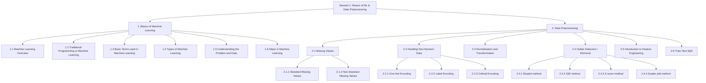
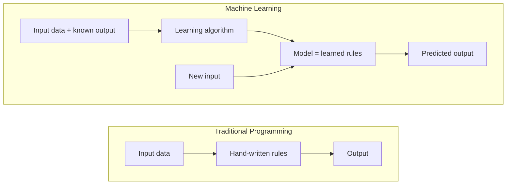
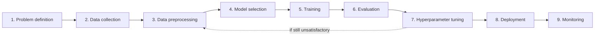
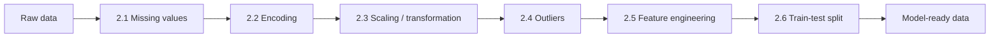
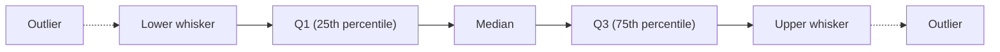

# Session 1: Basics of Machine Learning & Data Preprocessing

> Topic: Basics of Machine Learning & Data Preprocessing
> Date: Aug 3, 2026

## Concept Hierarchy

**Reordering note:** Within "Basics of Machine Learning", _Basic Terms_ and _Types of Machine Learning_ sit before _Understanding the Problem and Data_ and _Steps in Machine Learning_, because the vocabulary and the categories are needed to describe the problem-understanding step and the lifecycle correctly. No topic was dropped, merged, or added as a new prerequisite — every supplied item appears exactly once below.

**Running example used throughout:** predicting **house prices** from features like area, number of rooms, locality, and age of the house (a regression problem — the same worked scenario carries through every session in this folder).

**Analogy family used throughout Section 2:** a **restaurant kitchen receiving crates of raw produce**. Every preprocessing step is one thing the kitchen does to that produce before anything reaches a pan. Each subsection extends the same kitchen, rather than starting a new image.

---

## 1. Basics of Machine Learning

### Picture this

You're at a fruit market with a child who has never bought mangoes. You don't hand them a rulebook. You just walk the stalls, pick up one mango after another, and say "ripe" or "not ripe" — a hundred times, then two hundred. You never once state the rule out loud. Weeks later they walk into a different market on their own and pick perfectly. Ask them how they knew, and they shrug — they just know.

### Mapping

| Analogy element                       | What it really is                       |
| ------------------------------------- | --------------------------------------- |
| The child                             | The model                               |
| One mango you pick up                 | One instance (a row of data)            |
| Its colour, softness, smell           | The features (inputs)                   |
| Your "ripe" / "not ripe" verdict      | The label (the known answer)            |
| Hundreds of trips through the stalls  | Training                                |
| The instinct the child ends up with   | The learned parameters inside the model |
| The different market they visit alone | Unseen test data                        |

### Meaning

Machine Learning is the branch of computer science and statistics in which a system works out a rule from examples rather than being handed that rule as code, adjusting its internal parameters until its answers on past data are as close as possible to the known answers.

> **Formal definition:** Machine Learning is a field of study that gives computers the ability to learn from data and improve their performance at a task without being explicitly programmed with fixed rules.

### Why it matters

Everything else in this folder — linear regression, its assumptions, feature engineering, optimization, deployment — is machinery built on this one idea. Before any of it makes sense you need what the child needed: a vocabulary for what's going on (1.3), a sense of which kind of learning applies (1.4), a way to read a real problem (1.5), and the full workflow to solve it (1.6). Two of those, the vocabulary and the categories, come first because the later two are described using them.

### Core takeaway

Machine Learning exists because showing a system many correct answers is often far cheaper than knowing the rule that produced them.

### 1.1 Machine Learning Overview

**Meaning** — Instead of writing step-by-step instructions for a task, you supply many examples of input paired with the correct output, and the system searches for the parameters of a mapping from input to output that best reproduces those examples. Learning is measured, not assumed: performance on the task has to actually improve as more examples arrive.

> **Formal definition:** A program is said to learn from experience E, with respect to task T, and performance measure P, if its performance at T improves with E, as measured by P (Tom Mitchell's definition).

**Why it matters** — This is the definition that turns "the computer learns" from a vague claim into something testable. It forces you to name three things before you start: what the task is, what the data is, and how you will score success. Skip any one of them and you cannot tell a learning system from a broken one.

**Example** — For house price prediction: task $T$ = predict a house's price, experience $E$ = past house sales records (area, rooms, price), performance $P$ = how close the predicted price lands to the actual sale price. As $E$ grows (more sales recorded), $P$ should improve. That is the child getting better with each trip through the market.

**Core takeaway** — Learning is only learning when more experience measurably improves performance — otherwise it is just a fixed program that happened to be built from data.

**Exam focus** — Know Tom Mitchell's T/E/P definition verbatim; naming all three parts for a given scenario is a very common 2-mark question.

### 1.2 Traditional Programming vs Machine Learning

#### Picture this

Two cooks are making the same curry. The first works from a recipe card written by someone else: a quarter teaspoon of salt, exactly seven minutes, done. Hand her an unfamiliar vegetable and she stalls — there is no line on the card for it. The second cook never had a card. She learned by tasting: a hundred pots, each one adjusted after the first spoonful, until her hands knew the amounts. Hand her the unfamiliar vegetable and she tastes, adjusts, and carries on.

#### Mapping

| Analogy element                   | What it really is                             |
| --------------------------------- | --------------------------------------------- |
| The recipe card                   | Hand-written rules (traditional program code) |
| The first cook following it       | A traditional program executing those rules   |
| The hundred pots, each one tasted | The training dataset with known outcomes      |
| The tasting spoon                 | The performance measure being optimised       |
| The second cook's trained hands   | The learned model                             |
| The unfamiliar vegetable          | New, unseen input                             |

**Meaning** — In traditional programming a human writes the rules that turn input into output; in machine learning a human supplies input together with known output, and the algorithm produces the rules — the model — itself.

> **Formal definition:** In traditional programming, explicit rules and input data are supplied to produce output; in machine learning, input data and known output are supplied to produce the rules (the model), which are then applied to new input.

**Why it matters** — This contrast is the reason machine learning exists at all, and it is also the honest test of whether you should use it. If the rule is simple, fixed and fully known, writing it down beats learning it every time.

#### How it works

Notice the direction flip: rules are an _input_ on the left and an _output_ on the right.

**Example** — Writing `if area > 2000: price_category = "expensive"` requires you to already know the threshold, and to keep updating it as the market moves. Feeding a model thousands of (area, price) pairs lets it find the relationship itself, including gradations far too subtle to encode as a chain of `if` statements.

**Important details** — Prefer machine learning when the rule is unknown, changes often, is too complex to hand-code (image recognition), or must adapt per user. Prefer traditional programming when the rule is simple, stable and fully understood — a tax calculation does not need to be learned. Where the analogy breaks down: the second cook can explain her reasoning if pressed, whereas many trained models genuinely cannot, which is why interpretability is a separate concern in real deployments.

**Core takeaway** — The two approaches differ in which side of the equation the rules sit on: written by hand as an input, or produced by the data as an output.

**Exam focus** — A standard 5-mark comparison. Lead with the input/output direction flip, then give one problem each where the other approach would be the wrong choice.

### 1.3 Basic Terms used in Machine Learning

**Meaning** — Before describing types of learning or the lifecycle, the shared vocabulary has to be fixed. Each term below is introduced once and then used freely for the rest of this folder without redefinition. Read the last column against the market analogy: features are colour and softness, the label is your verdict, the child is the model.

| Term                                    | Plain meaning                  | Technical meaning                                                                               | Example (house price data)                                |
| --------------------------------------- | ------------------------------ | ----------------------------------------------------------------------------------------------- | --------------------------------------------------------- |
| **Dataset**                             | The full table of examples     | Collection of instances used to train and evaluate a model                                      | All past house sales records                              |
| **Feature** (independent variable)      | A measurable input clue        | A column of the dataset used as model input                                                     | Area, number of rooms, locality                           |
| **Label / Target** (dependent variable) | The answer you want            | The output variable the model learns to predict                                                 | Price of the house                                        |
| **Instance / Record / Row**             | One example                    | A single data point with all its feature values and, if known, its label                        | One specific house's data                                 |
| **Model**                               | The learned rule               | A mathematical function with fitted parameters, used to make predictions                        | The trained price-prediction equation                     |
| **Training**                            | Teaching the model             | The process of adjusting a model's parameters using the training data                           | Fitting the model on 80% of the sales                     |
| **Testing / Validation**                | Checking it on fresh examples  | Evaluating the model on data not used for training, to estimate real-world performance          | Checking price predictions on the remaining 20%           |
| **Parameters**                          | Values the model learns itself | Internal coefficients set automatically during training                                         | The weight given to "area" in the price formula           |
| **Hyperparameters**                     | Settings you choose beforehand | Configuration values set by the user, not learned from data                                     | The degree of a polynomial regression                     |
| **Overfitting**                         | Memorising instead of learning | Fitting the training data, including its noise, so closely that performance on new data suffers | Predicts old sale prices perfectly, fails on new listings |
| **Underfitting**                        | Learning too little            | Being too simple to capture the real pattern, performing poorly even on training data           | Predicting the same average price regardless of area      |
| **Algorithm**                           | The learning recipe            | The procedure used to find the model's parameters from data                                     | The linear regression algorithm                           |

**Important details** — Parameters versus hyperparameters is the pair most often confused: the model chooses parameters, you choose hyperparameters. Overfitting and underfitting appear here only as vocabulary; the mechanism behind them (bias and variance) is developed properly in Session 5.

**Core takeaway** — Nearly every disagreement about a model turns out to be a disagreement about which of these words someone meant, so fixing them early costs nothing and saves a lot.

**Exam focus** — Feature vs label, parameters vs hyperparameters, and overfitting vs underfitting are all frequent 2-mark definition pairs.

### 1.4 Types of Machine Learning

#### Picture this

Three people are learning a new city. The first walks around with a local who corrects every guess — "no, that's the fish market, the station is two streets left" — so every attempt comes back with the right answer attached. The second has no guide at all; she simply wanders, and after a week she has noticed that one quarter is all workshops, another all restaurants, without anyone ever naming them. The third is looking for a good lunch: he picks a street, eats, and remembers whether it was worth it, slowly steering himself towards the streets that pay off.

#### Mapping

| Analogy element                      | What it really is                            |
| ------------------------------------ | -------------------------------------------- |
| The local correcting every guess     | Labelled training data (supervised learning) |
| The corrected guess itself           | The error signal used to adjust the model    |
| Wandering with no guide              | Unlabelled data (unsupervised learning)      |
| Noticing "this quarter is workshops" | A discovered cluster                         |
| Choosing a street to eat on          | An action taken by an agent                  |
| The meal being worth it or not       | The reward signal (reinforcement learning)   |

**Meaning** — Machine learning techniques are grouped by what kind of feedback the data provides: a known answer for every example (supervised), no answers at all (unsupervised), or delayed rewards earned by the system's own actions (reinforcement).

> **Formal definition:** Supervised learning trains a model on labelled data (known input-output pairs) to predict outputs for new inputs. Unsupervised learning finds patterns or structure in unlabelled data with no known output. Reinforcement learning trains an agent to choose actions that maximise cumulative reward through trial-and-error interaction with an environment.

**Why it matters** — Choosing the wrong category makes every later decision wrong: you cannot fit a regression line if nobody recorded the prices, and you cannot cluster your way to a specific numeric prediction.

**How it works** — Supervised learning splits further by the _kind_ of label: **regression** when the label is a continuous number (price), **classification** when it is a category (spam / not spam). This folder and the next are devoted to exactly those two. Unsupervised learning covers **clustering** (grouping similar houses without being told the groups) and **dimensionality reduction** (compressing many features into fewer while keeping most of the information). Reinforcement learning has an **agent** acting in an **environment**, collecting **rewards**, and learning a policy that maximises total reward over time.

#### Comparison: Types of Machine Learning

| Aspect        | Supervised                             | Unsupervised                   | Reinforcement                         |
| ------------- | -------------------------------------- | ------------------------------ | ------------------------------------- |
| Data used     | Features + known labels                | Features only, no labels       | State, action, reward signal          |
| Goal          | Predict a label for new inputs         | Discover structure or groups   | Learn a policy maximising reward      |
| Example task  | House price prediction, spam detection | Customer segmentation          | Game-playing agent, robot navigation  |
| Feedback type | Direct — the correct answer is given   | None — patterns are self-found | Delayed — reward arrives after acting |

The central difference is where the feedback comes from: supervised learning is told the right answer, unsupervised learning is told nothing, and reinforcement learning finds out only through the consequences of its own actions. Choose supervised when labelled historical outcomes exist and you need predictions, unsupervised when you only want to explore structure, and reinforcement when the problem is sequential decision-making under feedback.

**Important details** — **Semi-supervised learning** (a small amount of labelled data plus a large amount of unlabelled data) is a practical hybrid worth knowing by name. Where the analogy breaks down: the city-wanderer really does have goals in mind, whereas a genuinely unsupervised algorithm optimises a structural criterion with no notion of what the groups mean.

**Core takeaway** — The three types are not three toolboxes but three different kinds of feedback, and the feedback you happen to have decides which toolbox you are allowed to open.

**Exam focus** — The comparison table itself is a common 5-mark answer. Be certain that regression and classification are both _supervised_.

### 1.5 Understanding the Problem and Data

#### Picture this

A patient walks into a clinic and says "I feel unwell." A careless doctor reaches straight for the prescription pad. A good one asks questions first: what exactly hurts, since when, what else changed — and only then decides what to do. The prescription is the easy part; getting the question right is the hard part, and everything downstream depends on it.

#### Mapping

| Analogy element                   | What it really is                                    |
| --------------------------------- | ---------------------------------------------------- |
| "I feel unwell"                   | The vague business request                           |
| The doctor's questions            | Problem framing                                      |
| The specific symptom named        | The identified target variable                       |
| Tests and measurements ordered    | The available features                               |
| Illegible or missing test results | Data quality problems                                |
| Choosing the class of treatment   | Choosing the type of ML (supervised/unsupervised/RL) |

**Meaning** — Understanding the problem and data means turning a loosely worded real-world question into a precisely specified learning task — naming the target, naming the available inputs, and checking that the data can actually support the question — before any algorithm is selected.

> **Formal definition:** Problem and data understanding is the initial stage of the machine learning workflow in which a real-world objective is formulated as a well-defined learning task, the target and predictor variables are identified, and the suitability and quality of the available data are assessed.

**Why it matters** — A mis-framed problem cannot be rescued by a better algorithm. If you build a classifier when the target is continuous, every subsequent step is executed flawlessly in the wrong direction.

**How it works**

1. State the real question in plain language — "what should we list this house for?"
2. Identify the target and its type: continuous → regression, categorical → classification.
3. Identify the features actually available to you at prediction time.
4. Check quantity and quality: enough rows, and how much is missing or suspect.
5. Decide the type of machine learning required.

**Example** — House prices: the question is "what should we list this house for?"; the target is price, which is continuous, so this is regression; features are area, rooms, locality, age; and a quality check reveals some houses have no recorded age — a problem handed straight to Section 2.

**Important details** — Step 3 has a trap worth naming: a feature is only usable if it is known _at the moment of prediction_. The final sale price of the house next door is wonderfully predictive and completely unavailable when you need it.

**Core takeaway** — The type of the target variable, not the sophistication of the algorithm, is what actually decides which technique you are solving with.

**Exam focus** — "How do you decide between regression and classification for a given problem?" is answered entirely by step 2.

### 1.6 Steps in Machine Learning

#### Picture this

A restaurant is putting a new dish on the menu. The chef decides what the dish should be, buys the ingredients, washes and chops them, chooses a cooking method, cooks, tastes, adjusts the seasoning, serves it to diners — and then keeps watching the plates coming back to see whether people are still finishing it a month later.

#### Mapping

| Analogy element               | What it really is     |
| ----------------------------- | --------------------- |
| Deciding what the dish is     | Problem definition    |
| Buying ingredients            | Data collection       |
| Washing and chopping          | Data preprocessing    |
| Choosing a cooking method     | Model selection       |
| Cooking                       | Training              |
| Tasting                       | Evaluation            |
| Adjusting the seasoning       | Hyperparameter tuning |
| Serving it to diners          | Deployment            |
| Watching the plates come back | Monitoring            |

**Meaning** — The steps in machine learning are the standard ordered stages that take a raw problem all the way to a working, maintained predictive system.

> **Formal definition:** The Machine Learning lifecycle is the standard sequence of stages — problem definition, data collection, preprocessing, model selection, training, evaluation, hyperparameter tuning, deployment, and monitoring — followed to turn a real-world question into a working, maintained predictive system.

**Why it matters** — The order is not decorative. Tasting before cooking tells you nothing; seasoning a dish nobody has tasted is guesswork; and serving without ever watching the plates is how a model quietly rots while everyone assumes it is fine.

#### How it works

1. **Problem definition** — frame the question and name the target.
2. **Data collection** — gather the records.
3. **Data preprocessing** — clean and prepare: missing values, encoding, scaling, outliers, feature engineering, and the train-test split. This is the whole of Section 2.
4. **Model selection** — choose an algorithm suited to the problem type; for a continuous target, linear regression.
5. **Training** — fit the model's parameters on the training split.
6. **Evaluation** — measure performance on the held-out split.
7. **Hyperparameter tuning** — adjust the settings you chose rather than learned.
8. **Deployment** — put the trained model into real use.
9. **Monitoring** — track real-world performance over time, because data patterns drift.

**Important details** — The dotted arrow matters: this is a loop, not a conveyor belt. Poor evaluation results usually send you back to preprocessing and feature work, not forward to a fancier algorithm. Where the analogy breaks down: a chef's ingredients do not change character after the dish launches, whereas real-world data distributions shift underneath a deployed model, which is exactly why step 9 exists.

**Core takeaway** — The lifecycle is ordered the way it is because each stage produces the thing the next stage consumes, and skipping one does not save time, it just moves the failure later.

**Exam focus** — Reproducing the nine stages in order, with the Mermaid diagram, is the core of a 10-mark answer.

**Connection** — Step 3 is by far the largest of the nine and is treated as its own parent topic next, in the exact order it would be carried out on the house-price dataset.

---

## 2. Data Preprocessing

### Picture this

It is six in the morning at the back door of a restaurant, and the crates have arrived. Some are half empty. A few sacks are labelled only in a language nobody in the kitchen reads. One supplier weighs everything in kilos, another in grams, and a third seems to have counted by hand. Sitting in a crate of grapes, absurdly, is a single watermelon. Nothing here is wrong exactly — it is just raw, and none of it can go into a pan in this state.

### Mapping

| Analogy element                      | What it really is                    |
| ------------------------------------ | ------------------------------------ |
| The crates arriving                  | The raw collected dataset            |
| Half-empty crates                    | Missing values (2.1)                 |
| Sacks labelled in an unread language | Non-numeric / categorical data (2.2) |
| Kilos in one crate, grams in another | Features on different scales (2.3)   |
| The watermelon among the grapes      | An outlier (2.4)                     |
| Squeezing juice, making stock        | Feature engineering (2.5)            |
| Sealing a portion for a taste test   | The held-out test set (2.6)          |

### Meaning

Data preprocessing is the set of operations that turn a raw, inconsistent dataset into a clean, fully numeric, comparably scaled and honestly split form that a learning algorithm can consume without being misled.

> **Formal definition:** Data preprocessing is the stage of the machine learning workflow in which raw data is cleaned, encoded, scaled, and organized into a form suitable for model training and evaluation.

### Why it matters

Most algorithms cannot even run on raw data — an empty cell or a text label will stop them outright — and the ones that do run will silently absorb whatever distortions the raw data carried. The kitchen rule applies exactly: what you fail to notice at the back door ends up on the plate.

### How it works

The order is deliberate and is the order used below: you cannot encode a cell that is empty, cannot scale a column that is still text, cannot judge an outlier on an unscaled mixture of units, and should not engineer new features out of data still carrying all three problems.

### Core takeaway

Preprocessing is not tidying for its own sake — every step removes one specific way the data could quietly lie to the algorithm.

### 2.1 Missing Values

**Meaning** — A missing value is a cell where no valid measurement was recorded for a feature of a particular instance — the half-empty crate at the back door.

> **Formal definition:** A missing value is the absence of a recorded observation for a variable in a given instance of a dataset.

**Why it matters** — Most algorithms cannot process an undefined value at all, and the ones that can will either drop the row silently or substitute something of their own choosing, neither of which you want happening without your knowledge.

#### 2.1.1 Standard Missing Values

**Meaning** — Values explicitly marked as missing by the source or the tool — a blank cell, `NaN`, `NULL`, `None` — which libraries such as pandas recognise automatically. In the kitchen, this is a crate that is visibly, obviously empty.

> **Formal definition:** A standard missing value is an absent observation recorded using a recognised missing-data marker that data-handling tools detect automatically.

**Example** — The "age of house" column has a blank cell for one record, which pandas reads directly as `NaN`.

#### 2.1.2 Non-Standard Missing Values

**Meaning** — Values that mean "missing" but were written as ordinary-looking text or numbers — `"n/a"`, `"--"`, `"unknown"`, `"?"`, or a placeholder such as `-1` or `0` in a column where that value is impossible. In the kitchen, this is the crate with a stone in it: it has weight, it is not empty, and it is not food.

> **Formal definition:** A non-standard missing value is an absent observation encoded as an ordinary data value, which data-handling tools therefore treat as valid unless it is identified manually.

**Why it matters** — These are strictly more dangerous than standard missing values, because nothing errors out. A `-1` in an age column is accepted, averaged, scaled and regressed on, quietly dragging every downstream statistic with it.

**How it works** — Detection first, then treatment.

1. Inspect the unique values of every column and the plausible range of every numeric column.
2. Convert anything meaning "missing" into a proper missing marker.
3. Then choose treatment: **drop** the row or column when little data is affected or the column is unimportant, or **impute** — fill with the mean or median for numeric columns, the mode for categorical ones, or a model-based estimate.

**Example** — The "locality" column contains `"?"` for some rows. Until those are recognised as missing, `"?"` will be encoded (2.2) as a perfectly ordinary fourth locality, and the model will dutifully learn a price effect for it.

**Important details** — Always run detection before treatment; imputing a column that still contains disguised `-1` values computes the mean of a lie. Where the analogy breaks down: a stone in a crate is obvious on sight, whereas a `0` in an "age" column can be entirely legitimate for a brand-new house, so judgement about the column's meaning is unavoidable.

**Core takeaway** — Standard missing values fail loudly and get fixed, non-standard ones pass silently and get learned, which is why the disguised kind does more damage.

**Exam focus** — Standard vs non-standard is a classic 2-mark distinction; the drop-versus-impute decision, with reasons, is a common 5-mark answer.

### 2.2 Handling Non-Numeric Data

#### Picture this

The supermarket checkout can only read barcodes. A customer arrives with a hand-written sack simply marked "Downtown". The till has no way to scan a word. Somebody has to decide how that word becomes numbers — and the choice is not innocent, because the till will happily do arithmetic on whatever number you give it.

#### Mapping

| Analogy element                          | What it really is                            |
| ---------------------------------------- | -------------------------------------------- |
| The barcode-only checkout                | An algorithm that accepts numeric input only |
| The word "Downtown" on the sack          | A categorical feature value                  |
| Assigning it a number                    | Categorical encoding                         |
| The till doing arithmetic on that number | The model treating the code as a magnitude   |

**Meaning** — Categorical encoding converts text or category-valued columns into numeric form so that an algorithm can process them, and the encoding chosen determines whether the model is allowed to infer an order among the categories.

> **Formal definition:** Categorical encoding is the process of converting categorical (non-numeric) variables into a numeric representation that a machine learning algorithm can process.

**Why it matters** — Every numeric encoding is also an implicit claim. If Rural becomes 2 and Downtown becomes 0, a model that assumes magnitude has been told, without anybody intending it, that Rural is twice something that Downtown is not.

#### 2.2.1 One-Hot Encoding

**Meaning** — One-hot encoding replaces a categorical column having $k$ distinct values with $k$ binary columns, exactly one of which is 1 for any given row — a separate on/off switch per category, so no category is numerically larger than another.

> **Formal definition:** One-hot encoding represents a categorical variable with $k$ levels as $k$ binary columns, where exactly one column is set to 1 to indicate the category of each observation.

**Example** — "Locality" with values {Downtown, Suburb, Rural} becomes `Locality_Downtown`, `Locality_Suburb`, `Locality_Rural`; a Downtown house is $(1, 0, 0)$.

**Important details** — The right default for **nominal** categories, which have no natural order. The cost is width: a column with hundreds of distinct values produces hundreds of new columns, feeding the curse of dimensionality. Regression has an extra subtlety here — it uses $k-1$ columns rather than $k$ — developed in Session 3.

#### 2.2.2 Label Encoding

**Meaning** — Label encoding replaces each category with a single integer code, adding no new columns — compact, but it hands the model a number line it was never entitled to.

> **Formal definition:** Label encoding assigns a unique integer to each category of a categorical variable, replacing the category with that integer code.

**Example** — Downtown → 0, Suburb → 1, Rural → 2.

**Important details** — Any model that interprets magnitude now believes Rural > Suburb > Downtown, and that the gap from Downtown to Suburb equals the gap from Suburb to Rural. Neither claim was in the data. Safe mainly for genuinely ordinal data, or for tree-based models, which split on thresholds rather than assuming a linear scale.

#### 2.2.3 Ordinal Encoding

**Meaning** — Ordinal encoding also assigns one integer per category, but deliberately in an order that genuinely exists in the data, so the number line the model reads is a real one.

> **Formal definition:** Ordinal encoding assigns integers to categories such that the numeric order of the codes reflects a genuine, meaningful rank among the categories.

**Example** — House condition {Poor, Average, Good, Excellent} → {0, 1, 2, 3}, where the ordering is a real property of the categories.

**Important details** — Mechanically identical to label encoding; the difference is entirely in whether the order you imposed is true. It still assumes equal spacing between consecutive levels, which is a further claim worth checking.

#### Comparison: Encoding Techniques

| Aspect          | One-Hot Encoding                      | Label Encoding                           | Ordinal Encoding              |
| --------------- | ------------------------------------- | ---------------------------------------- | ----------------------------- |
| Output          | One binary column per category        | One integer column                       | One integer column            |
| Assumes order?  | No                                    | No, but the model may infer one          | Yes, and intentionally        |
| Best suited for | Nominal categories, few unique values | Tree-based models, quick default         | Genuinely ranked categories   |
| Example column  | Locality                              | Locality, with caution                   | House condition               |
| Limitation      | Many columns when categories are many | Can mislead models that assume magnitude | Wrong if the order is guessed |

The central difference is what each encoding implies about order: one-hot implies none at the cost of extra columns, while label and ordinal encoding both imply an order but only ordinal encoding's is real. Choose one-hot for unordered categories with few levels, ordinal when a genuine rank exists, and label encoding mainly as a lightweight default for tree-based algorithms.

**Core takeaway** — Encoding is not a format conversion but an assertion about order, and the only bad choice is the one whose assertion the data does not support.

**Exam focus** — Very common 5- or 10-mark comparison. State explicitly _why_ label encoding misleads — the false ordinal and equal-spacing assumptions — not merely that it does.

### 2.3 Normalization and Transformation

#### Picture this

Two sacks sit on the same counter. One is labelled 3000, the other 4. The first is grams of rice, the second is kilos of saffron — and by any honest measure the small one matters far more. If you sort the counter by the printed number alone, the rice wins every time, purely because someone chose a smaller unit for it.

#### Mapping

| Analogy element                    | What it really is                                          |
| ---------------------------------- | ---------------------------------------------------------- |
| The printed numbers 3000 and 4     | Raw feature values on incomparable scales                  |
| Grams versus kilos                 | Different units of measurement per feature                 |
| Sorting by the printed number      | A distance- or gradient-based algorithm comparing features |
| Re-weighing everything in one unit | Feature scaling                                            |
| Grinding whole spices to powder    | Transformation, which changes the shape, not the unit      |

**Meaning** — Normalization, or feature scaling, rescales numeric features onto a common range or spread so that no feature dominates the model merely because its raw numbers are larger.

> **Formal definition:** Normalization (feature scaling) is the process of rescaling numeric feature values onto a common range or distribution so that no feature dominates a model purely due to its scale.

**Why it matters** — Area runs into the thousands of square feet while number of rooms runs from 1 to 5. Any algorithm that measures distance between rows, or that takes gradient steps of a shared size, will be effectively deaf to the rooms column until both are put on the same footing.

**Feel for the quantity** — For the scaled value $x'$: a very large $x'$ means this instance sits near the top of the feature's observed range, a value near the middle means typical, and a very small value means near the bottom. After scaling, the same number means the same thing in every column, which is the entire point.

**Formula (Min-Max Normalization)** — **Essential**
$$x' = \frac{x - x_{min}}{x_{max} - x_{min}}$$
**Where** — $x$: the original value of the feature for this instance; $x_{min}$: the smallest value of that feature in the dataset; $x_{max}$: the largest value of that feature in the dataset; $x'$: the rescaled value, always lying between 0 and 1.
**Example** — Area ranges from 500 to 3500 sq. ft. For a house of 2000 sq. ft.: $x' = \frac{2000-500}{3500-500} = \frac{1500}{3000} = 0.5$.
**Interpretation** — This house sits exactly halfway between the smallest and largest house in the dataset.

**Formula (Standardization / Z-score scaling)** — **Essential**
$$x' = \frac{x - \mu}{\sigma}$$
**Where** — $x$: the original value of the feature for this instance; $\mu$: the mean of that feature across the dataset; $\sigma$: the standard deviation of that feature, i.e. its typical spread around the mean; $x'$: the rescaled value, expressed as a number of standard deviations away from the mean.
**Example** — With mean area 2000 sq. ft. and $\sigma = 750$, a 2750 sq. ft. house gives $x' = \frac{2750-2000}{750} = 1$.
**Interpretation** — This house is one standard deviation above average in area. The same quantity, read as a distance from the mean, is what the Z-score outlier rule in 2.4.3 tests.

**Important details** — **Transformation** is a different operation with a different purpose: scaling moves and stretches a distribution without altering its shape, whereas a transformation such as a log deliberately reshapes it — pulling in a long right tail, for instance, as house prices tend to have. Where the analogy breaks down: re-weighing sacks in one unit is perfectly reversible and information-preserving, while some transformations genuinely discard information about the original spacing.

**Core takeaway** — Scaling exists because algorithms cannot tell the difference between a feature that matters more and a feature that was simply measured in smaller units.

**Exam focus** — Be ready to compute either formula on small numbers, and to justify the choice: Min-Max when a bounded $[0,1]$ range is required, standardization when the method assumes roughly normally distributed inputs.

### 2.4 Outlier Detection / Removal

#### Picture this

The watermelon in the crate of grapes. Nothing about it is broken — it is a real fruit, correctly delivered — but it weighs more than everything else in the crate combined. Average the crate and the number you get describes nothing that is actually in it.

#### Mapping

| Analogy element             | What it really is                                  |
| --------------------------- | -------------------------------------------------- |
| The crate of grapes         | The bulk of the data's distribution                |
| The single watermelon       | An outlier                                         |
| Its disproportionate weight | Its disproportionate pull on the mean and variance |
| Someone mis-loading the van | A data-entry error — a spurious outlier            |
| A genuinely exotic order    | A real but rare observation — a legitimate outlier |

**Meaning** — An outlier is an observation lying an unusually long way from the rest of the data, arising either from a recording error or from a genuinely rare case.

> **Formal definition:** An outlier is an observation that lies an abnormal distance from other values in a dataset's distribution.

**Why it matters** — The mean and the standard deviation are both unbounded in the influence a single point can have on them, and least-squares regression, which squares its errors, is more sensitive still. One watermelon can shift a fitted line noticeably.

#### 2.4.1 Boxplot method

**Meaning** — A boxplot draws a feature's median and quartiles as a box with whiskers extending to the bulk of the data; anything plotted beyond a whisker is flagged visually as a potential outlier.

> **Formal definition:** A boxplot is a graphical summary of a feature's distribution using its quartiles and whiskers, in which points beyond the whiskers are flagged as potential outliers.

**Example** — On a boxplot of house prices, a point sitting far above the upper whisker at ₹5 crore is flagged immediately, without any calculation.

#### 2.4.2 IQR method

**Meaning** — The IQR method turns the boxplot's picture into an exact numeric cutoff, using the width of the middle half of the data to decide how far is too far.

> **Formal definition:** The Interquartile Range (IQR) method flags any observation below $Q_1 - 1.5 \times IQR$ or above $Q_3 + 1.5 \times IQR$ as an outlier, where $IQR = Q_3 - Q_1$.

**Feel for the quantity** — A large IQR means the middle half of the data is itself widely spread, so the bounds sit far out and only extreme points are flagged. A small IQR means the bulk of the data is tightly packed, so even modest deviations get flagged.

**Formula (Interquartile Range and its outlier bounds)** — **Essential**
$$IQR = Q_3 - Q_1, \qquad \text{Lower} = Q_1 - 1.5 \times IQR, \qquad \text{Upper} = Q_3 + 1.5 \times IQR$$
**Where** — $Q_1$: the 25th percentile of the feature, the value below which a quarter of the data lies; $Q_3$: the 75th percentile; $IQR$: the interquartile range, the width of the middle 50% of the data; $1.5$: the conventional multiplier defining "unusually far"; Lower and Upper: the cutoffs outside which a value is flagged as an outlier.
**Example** — House prices with $Q_1 = 40$ lakh and $Q_3 = 70$ lakh give $IQR = 30$; Lower $= 40 - 45 = -5$ lakh, Upper $= 70 + 45 = 115$ lakh. A house at ₹5 crore (500 lakh) is far above the upper bound.
**Interpretation** — Any price outside the range $(-5, 115)$ lakh is more than one and a half box-widths from the middle half of the market and is flagged for review.

#### 2.4.3 Z-score method

**Meaning** — The Z-score method reuses the standardization quantity from 2.3 as a detector: it measures how many standard deviations a value sits from the mean and flags anything past a chosen threshold, most commonly $|z| > 3$.

> **Formal definition:** The Z-score method flags an observation as an outlier if the absolute value of its standardized score, $z = (x-\mu)/\sigma$, exceeds a chosen threshold, commonly 3.

**Example** — A house whose price gives $z = 4.2$ is well past the usual threshold of 3 and is flagged.

**Important details** — This method assumes a roughly normal distribution, and it has a self-defeating quality on skewed data: the outlier being hunted is itself inflating the $\sigma$ used to judge it, so extreme values can hide inside the very spread they created. For skewed data such as raw prices, the quartile-based IQR method is more robust.

#### 2.4.4 Scatter plot method

**Meaning** — A scatter plot draws two variables against each other so that points can be judged by their position relative to the overall trend, catching observations that are unremarkable on either variable alone but strange in combination.

> **Formal definition:** A scatter plot is a graph of two variables as plotted points, used to visually identify observations that deviate from the main trend or cluster formed by the rest of the data.

**Example** — Plotting area against price, most points follow a rising band, but one very small house at a very high price sits far off it. Its area is ordinary and its price is ordinary; only the pairing is strange — which is precisely what a single-variable method cannot see.

#### Comparison: Outlier Detection Methods

| Aspect                | Boxplot                     | IQR                  | Z-score                              | Scatter plot          |
| --------------------- | --------------------------- | -------------------- | ------------------------------------ | --------------------- |
| Basis                 | Visual, quartiles           | Numeric, quartiles   | Numeric, mean and standard deviation | Visual, two variables |
| Works on skewed data? | Yes                         | Yes                  | Poorly — assumes near-normality      | Yes                   |
| Variables considered  | One                         | One                  | One                                  | Two                   |
| Output                | Visual flag                 | Exact numeric cutoff | Exact numeric cutoff                 | Visual flag           |
| Example use           | Quick check of price spread | Precise price cutoff | A roughly normal feature             | Area against price    |

The central difference is dimensionality: the first three judge a value against its own column, while a scatter plot judges it against a relationship. Use IQR or a boxplot as the default for skewed real-world data, Z-score only when the feature is roughly normal, and a scatter plot whenever the anomaly is a combination rather than a value.

**Important details** — Detection is not disposal. Once flagged, an outlier can be **removed**, **capped** to the boundary value, or **kept and flagged** when it is a genuine rare case — a real luxury property is data, not noise, and deleting it teaches the model that such houses do not exist. Where the analogy breaks down: a watermelon is unmistakably not a grape, whereas a genuine outlier and a data-entry error look identical in the file and can only be separated by knowing the domain.

**Core takeaway** — An outlier is judged by distance from the bulk of the data, but treated according to whether that distance is an error or a fact.

**Exam focus** — Computing IQR bounds from given quartiles is a standard numeric question; explaining why a scatter plot catches what IQR cannot is the standard conceptual one.

### 2.5 Introduction to Feature Engineering

#### Picture this

Nobody serves a diner a raw onion, a bare bone and a handful of peppercorns. Simmered together for an hour they become stock — the same ingredients, in a form that actually makes the dish work. Nothing new arrived at the back door; the cook simply made something more useful out of what was already there.

#### Mapping

| Analogy element                       | What it really is             |
| ------------------------------------- | ----------------------------- |
| Raw onion, bone, peppercorns          | Raw feature columns           |
| The cook's knowledge of what combines | Domain knowledge              |
| Simmering them into stock             | Creating a derived feature    |
| Grinding whole spices                 | Transforming a feature        |
| Leaving the bay leaf out of the bowl  | Dropping an unhelpful feature |

**Meaning** — Feature engineering uses knowledge of the problem to create, reshape or select input variables that expose a pattern the raw columns only imply.

> **Formal definition:** Feature engineering is the process of using domain knowledge to create, transform, or select input variables (features) that improve a machine learning model's predictive performance.

**Why it matters** — A well-constructed feature frequently buys more accuracy than switching to a more powerful algorithm, because it hands the model a pattern it would otherwise have to discover indirectly from weaker signals.

**How it works**

1. **Feature creation** — combine existing columns into a more informative one, such as `price_per_sqft = price / area`.
2. **Feature transformation** — apply a mathematical change, such as the log transform mentioned in 2.3.
3. **Feature selection** — keep the features that genuinely help and drop the rest; a `house_id` column carries no signal at all and only invites the model to memorise.

**Example** — A raw "date of sale" is nearly useless as a number. Combined with the year the house was built it becomes `house_age = sale_year - year_built`, which is directly and strongly related to price.

**Important details** — Feature engineering sits _after_ 2.1 to 2.4 in the pipeline for a concrete reason: a feature derived from a column that still contains disguised missing values or unencoded text inherits every one of those problems and hides them one level deeper. Where the analogy breaks down: stock is unambiguously an improvement, whereas an engineered feature can easily be redundant with its own parents — a risk that has its own name and diagnosis in Session 3.

**Core takeaway** — Feature engineering wins because the pattern a model can express is limited by the columns it is given, and columns are the one part of the setup you fully control.

**Exam focus** — If asked to demonstrate understanding, give an example other than `price_per_sqft` — extracting "day of week" from a timestamp for a sales-forecasting problem works well.

### 2.6 Train-Test Split

#### Picture this

A cook tasting his own dish while cooking is not a taste test — he already knows what he put in, and he has been adjusting to his own palate for an hour. The real test is the portion he sealed away untouched and handed to someone who was not in the kitchen. Anything he learns from the sealed portion is honest, and he only gets to learn it once.

#### Mapping

| Analogy element                       | What it really is              |
| ------------------------------------- | ------------------------------ |
| The pot the cook keeps tasting        | The training set               |
| Adjusting seasoning while tasting     | Fitting the model's parameters |
| The sealed portion                    | The held-out test set          |
| Handing it to an outsider             | Evaluating on unseen data      |
| Peeking into the sealed portion early | Data leakage                   |

**Meaning** — A train-test split partitions the cleaned dataset into a portion used to fit the model and a portion held back untouched, used only to estimate how the model will perform on data it has never seen.

> **Formal definition:** Train-test split is the practice of partitioning a dataset into a training subset, used to fit a model's parameters, and a held-out test subset, used only to evaluate the model's performance on unseen data.

**Why it matters** — Scoring a model on the data it was fitted to cannot distinguish learning from memorising; a model that stored every training row would score perfectly and predict nothing. The held-out portion is the only honest estimate available before deployment.

**How it works** — Typically 70–80% of rows go to training and 20–30% to testing, drawn at random, with a fixed random seed so the split can be reproduced. Both portions should look like the dataset as a whole.

**Example** — Of 1,000 house records, 800 are used to fit the price model and 200 are sealed. Predictions on those 200 are compared against their true sale prices, and that comparison is the reported performance.

**Important details** — The subtle and much-tested point is _when_ the split happens. The scaling statistics from 2.3 — $x_{min}$, $x_{max}$, $\mu$, $\sigma$ — must be computed on the training portion alone and then applied to the test portion. Computing them over the whole dataset lets facts about the test rows influence the training transformation, which is **data leakage**: the cook has peeked, and the sealed portion is no longer an honest test. The same caution applies to imputation values from 2.1.

**Core takeaway** — A test set is only a test while it remains genuinely unknown, so anything fitted on it — even a mean — spends it.

**Exam focus** — The leakage caution is a favourite trap question. Know the typical ratios, and be able to name at least two preprocessing statistics that must be fitted on the training split only.

**Connection** — The dataset is now clean, fully numeric, comparably scaled, outlier-checked, enriched with engineered features and honestly split — exactly the state assumed by steps 4 and 5 of the lifecycle, which the next session takes up with linear regression.

---

## Examination Preparation

### Must understand

- Why the rules sit on opposite sides of the equation in traditional programming and machine learning (Section 1.2).
- The T/E/P framing and why all three must be named for a claim of "learning" to be testable (Section 1.1).
- How to decide supervised, unsupervised or reinforcement for a given problem (Section 1.4), and regression versus classification within supervised (Section 1.5).
- Why a numeric encoding is an assertion about order, and why label encoding's assertion is unsafe (Section 2.2).
- Why the train-test split must precede the fitting of any preprocessing statistic (Section 2.6).

### Must remember

- Tom Mitchell's definition — see the formal definition in Section 1.1.
- Feature versus label, parameters versus hyperparameters, overfitting versus underfitting — Section 1.3.
- The three types of machine learning and their feedback signals — see the formal definition in Section 1.4.
- Lifecycle order: problem definition → data collection → preprocessing → model selection → training → evaluation → hyperparameter tuning → deployment → monitoring (Section 1.6).
- Standard versus non-standard missing values — Sections 2.1.1 and 2.1.2.
- One-hot, label and ordinal encoding, and what each implies about order — Section 2.2.
- Min-Max: $x' = \frac{x-x_{min}}{x_{max}-x_{min}}$; Standardization: $x' = \frac{x-\mu}{\sigma}$ (Section 2.3).
- IQR bounds: $Q_1 - 1.5\,IQR$ and $Q_3 + 1.5\,IQR$ (Section 2.4.2).
- Typical train-test ratio 70–80% / 20–30%, and the definition of data leakage (Section 2.6).

### Common question patterns

- _2-mark:_ Define machine learning; feature versus label; overfitting versus underfitting; standard versus non-standard missing values; define an outlier.
- _5-mark:_ Traditional programming versus machine learning; the three types of machine learning; the three encoding techniques; the four outlier detection methods.
- _10-mark:_ Explain the complete machine learning lifecycle with a diagram and a worked example; explain data preprocessing with all its sub-techniques applied to a sample dataset.

### Answer-writing guidance

- _2-mark:_ the formal definition stated precisely, plus one supporting example.
- _5-mark:_ formal definition, a short explanation, the key points as a table, and one example, formula or small diagram.
- _10-mark:_ introduction, formal technical definition, Mermaid diagram or workflow, detailed step-by-step explanation, worked example, advantages and limitations, conclusion.

### Model answers

_2-mark:_ "Machine Learning is a field of study that gives computers the ability to learn from data and improve their performance at a task without being explicitly programmed with fixed rules. A program is said to learn from experience E with respect to task T and performance measure P if its performance at T, as measured by P, improves with E. For example, a house-price model's prediction error falls as more past sales records are supplied."

_5-mark:_ "In traditional programming, explicit rules written by a human are applied to input data to produce output. In machine learning, input data together with its known output is supplied to a learning algorithm, which produces the rules — the model — that are then applied to new input. The distinguishing feature is therefore the direction of the rules: an input in the first case, an output in the second. Consider spam detection. A traditional program would require a human to enumerate every rule that distinguishes spam from legitimate mail, which is impractical given the variety of spam and the speed at which it changes. A machine learning approach instead supplies a labelled dataset of spam and non-spam messages and lets the algorithm estimate the discriminating rules itself. Machine learning is therefore preferred where the rule is unknown, too complex to state, or subject to change, whereas traditional programming remains appropriate for rules that are simple, stable and fully understood, such as a tax calculation."

_10-mark:_ "Introduction: Turning a real-world question into a working predictive system requires a defined sequence of stages, collectively known as the machine learning lifecycle. Definition: the lifecycle is the standard sequence of problem definition, data collection, preprocessing, model selection, training, evaluation, hyperparameter tuning, deployment and monitoring. Diagram: reproduce the pipeline flowchart from Section 1.6, including the feedback arrow from tuning back to preprocessing. Detailed explanation: (1) problem definition frames the question and establishes whether the target is continuous, indicating regression, or categorical, indicating classification; (2) data collection assembles the relevant historical records; (3) data preprocessing, the largest stage, handles missing values, encodes categorical variables, scales numeric features, treats outliers, engineers new features and partitions the data into training and test subsets; (4) model selection chooses an algorithm appropriate to the problem type; (5) training fits the model's parameters on the training subset; (6) evaluation measures performance on the held-out test subset; (7) hyperparameter tuning adjusts settings that are chosen rather than learned; (8) deployment places the trained model into operational use; (9) monitoring tracks performance over time, since the underlying data distribution may drift. Example: for house price prediction this proceeds from raw sales records, through cleaning and encoding of the locality and condition columns, to a fitted regression model that estimates prices for new listings. Advantages: an explicit lifecycle prevents omitted steps such as leakage-free splitting and ensures evaluation precedes deployment. Limitations: the process is iterative rather than linear, with poor evaluation results typically returning work to the preprocessing stage, and monitoring is frequently neglected, producing silent performance decay. Conclusion: rigorous execution of this lifecycle, and particularly of the preprocessing stage, is what converts a raw dataset into a trustworthy deployable system."

## Practice Questions

### Basic recall

1. State Tom Mitchell's definition of machine learning.
   **Answer:** See the formal definition in Section 1.1 — a program learns from experience E with respect to task T and performance measure P if its performance at T, measured by P, improves with E.
2. What is the difference between a feature and a label?
   **Answer:** A feature is an input column used to predict; a label is the output the model learns to predict (Section 1.3).
3. Name the three main types of machine learning.
   **Answer:** Supervised, unsupervised and reinforcement learning (Section 1.4).
4. What is the difference between standard and non-standard missing values?
   **Answer:** Standard missing values use recognised markers such as blanks, `NaN` or `NULL` and are detected automatically; non-standard ones are written as ordinary values such as `"?"`, `"n/a"` or `-1` and must be identified manually (Sections 2.1.1–2.1.2).
5. What is the typical train-test split ratio?
   **Answer:** 70–80% training, 20–30% test (Section 2.6).

### Conceptual

1. Why is machine learning preferred over traditional programming for spam detection?
   **Answer:** The distinguishing rule is too complex to enumerate and changes constantly, so it is cheaper to learn it from labelled examples than to write and maintain it (Section 1.2).
2. Why can label encoding mislead a model?
   **Answer:** It assigns arbitrary integers, which a model that interprets magnitude reads as both an order and an equal spacing between categories — neither of which was present in the data (Section 2.2.2).
3. Why must scaling statistics be computed only from the training set?
   **Answer:** Computing them over the full dataset lets information from the test rows influence the training transformation, which is data leakage and produces an optimistic performance estimate (Section 2.6).
4. Why is the Z-score method less reliable than the IQR method on skewed data?
   **Answer:** It assumes near-normality, and the extreme value being tested inflates the very standard deviation used to judge it, so it can hide inside the spread it created; the quartile-based IQR method is unaffected (Section 2.4.3).
5. Why is feature engineering performed after missing-value handling, encoding and outlier treatment rather than before?
   **Answer:** A feature derived from uncleaned data inherits its problems and buries them one level deeper, where they are harder to detect (Section 2.5).

### Comparison

1. Compare one-hot, label and ordinal encoding.
   **Answer:** See the comparison table in Section 2.2 — one-hot creates one binary column per category and implies no order, label encoding assigns arbitrary integers and risks a false order, and ordinal encoding assigns integers that reflect a genuine rank.
2. Compare supervised, unsupervised and reinforcement learning.
   **Answer:** See the comparison table in Section 1.4 — they differ in feedback: a known answer per example, no answers at all, or delayed rewards from the system's own actions.
3. Compare the boxplot/IQR approach with the Z-score approach to outlier detection.
   **Answer:** Boxplot and IQR are quartile-based and robust on skewed data; Z-score is mean- and standard-deviation-based and assumes near-normality (Sections 2.4.1–2.4.3).

### Scenario / application

1. A hospital dataset records some blood pressure values as `"?"`. Identify the type of missing value and suggest how to handle it.
   **Answer:** A non-standard missing value (Section 2.1.2). Identify it manually and convert it to a proper missing marker first, then either drop the affected rows if few or impute with the median blood pressure.
2. A retail dataset has a "customer satisfaction" column with values {Low, Medium, High}. Which encoding should be used, and why?
   **Answer:** Ordinal encoding (Section 2.2.3), because the categories carry a genuine rank that should be preserved as increasing integers.
3. An exam-scores dataset records one student's score as 1000 out of 100. Which detection method would catch it, and how?
   **Answer:** Any univariate method — the IQR method would place it far above $Q_3 + 1.5\,IQR$ (Section 2.4.2), and the Z-score method would give it an extreme $|z|$ (Section 2.4.3). Being an impossible value, it is a data-entry error rather than a rare case, so removal or correction is appropriate.

### Long-answer

1. Describe the complete machine learning lifecycle from problem definition to monitoring, using a real-world example.
   **Answer:** See Section 1.6 and the 10-mark model answer in Examination Preparation.
2. Describe the data preprocessing pipeline for a raw dataset, covering missing values, encoding, scaling, outliers, feature engineering and the train-test split in the order they should be applied.
   **Answer:** See Section 2's pipeline diagram and Sections 2.1 to 2.6 in order, noting that scaling statistics are fitted on the training split only.

## Quick Revision

- **One-sentence summary:** Machine learning derives rules from examples instead of receiving them as code, and data preprocessing is the stage that removes every way raw data could quietly mislead those derived rules.
- **Hierarchy:** see the Concept Hierarchy diagram at the top of this file.
- **Essential definitions:** machine learning (1.1), traditional programming versus ML (1.2), core vocabulary (1.3), the three types (1.4), problem framing (1.5), the lifecycle (1.6), missing values (2.1), encoding (2.2), normalization (2.3), outlier (2.4), feature engineering (2.5), train-test split (2.6).
- **Key workflow:** the nine-stage lifecycle (1.6), and within its third stage the preprocessing order missing values → encoding → scaling → outliers → feature engineering → split (Section 2).
- **Most important comparison:** one-hot versus label versus ordinal encoding (2.2), because it determines what the model is told about order.
- **Key formulas:** Min-Max and Standardization (2.3), IQR bounds (2.4.2).
- **5 exam keywords:** overfitting, encoding, normalization, interquartile range, data leakage.
- **5 common mistakes:** confusing feature with label; using label encoding on unordered categories; fitting scalers before splitting; trusting the Z-score rule on skewed data; engineering features before the data is clean.

### Mental Models

- **1. Basics of ML** — a child learning ripe mangoes by example; showing many correct answers is often cheaper than knowing the rule that produced them.
- **1.2 Traditional programming vs ML** — a recipe card versus a cook who learned by tasting; the two differ in whether the rules are an input or an output.
- **1.4 Types of ML** — three ways to learn a city: with a guide, by wandering, or by eating and remembering; the feedback you have decides the toolbox you may open.
- **1.5 Problem understanding** — the doctor who asks before prescribing; the target's type, not the algorithm, decides the technique.
- **1.6 ML lifecycle** — putting a new dish on the menu, from deciding it to watching the plates come back; each stage produces what the next consumes.
- **2. Preprocessing** — crates at the back door of a kitchen; what you fail to notice at the door ends up on the plate.
- **2.1 Missing values** — an empty crate versus a stone in the crate; the disguised kind does more damage because nothing fails.
- **2.2 Encoding** — a barcode-only checkout reading a hand-written word; encoding is an assertion about order.
- **2.3 Normalization** — grams of rice against kilos of saffron; algorithms cannot tell importance from unit choice.
- **2.4 Outliers** — the watermelon among the grapes; distance from the bulk detects it, but its cause decides its fate.
- **2.5 Feature engineering** — simmering onion and bone into stock; what the model can express is limited by the columns you hand it.
- **2.6 Train-test split** — the sealed portion the cook never tasted; a test set is only a test while it remains unknown.

## Topic Coverage

- Machine Learning Overview — Covered in Section 1.1 (source: `01-introduction.md`, Session 1)
- Traditional Programming vs Machine Learning — Covered in Section 1.2 (source: `01-introduction.md`, Session 1)
- Basic Terms used in Machine Learning — Covered in Section 1.3 (source: `01-introduction.md`, Session 1)
- Types of Machine Learning — Covered in Section 1.4 (source: `01-introduction.md`, Session 1)
- Understanding the Problem and Data — Covered in Section 1.5 (source: `01-introduction.md`, Session 1)
- Steps in Machine Learning — Covered in Section 1.6 (source: `01-introduction.md`, Session 1)
- Missing Values (Standard, Non-Standard) — Covered in Section 2.1, with 2.1.1 and 2.1.2 (source: `01-introduction.md`, Session 1)
- Handle Non-Numeric Data (One-Hot, Label, Ordinal Encoding) — Covered in Section 2.2, with 2.2.1 to 2.2.3 (source: `01-introduction.md`, Session 1)
- Normalization and Transformation — Covered in Section 2.3 (source: `01-introduction.md`, Session 1)
- Outlier Detection / Removal (Boxplot, IQR, Z-score, Scatter plot) — Covered in Section 2.4, with 2.4.1 to 2.4.4 (source: `01-introduction.md`, Session 1)
- Introduction to Feature Engineering — Covered in Section 2.5 (source: `01-introduction.md`, Session 1)
- Train-Test Split — Covered in Section 2.6 (source: `01-introduction.md`, Session 1)

### Gaps to Look Up

- **Percentiles and quartiles** — used throughout 2.4.1 and 2.4.2 to define $Q_1$, $Q_3$ and the IQR, but never defined in the source material. Needed to compute the outlier bounds at all.
- **Mean and standard deviation** — used in 2.3 and 2.4.3 as the basis of standardization and the Z-score rule, and assumed known. Needed to interpret what "one standard deviation above the mean" actually measures.
- **Right-skewed distribution** — referenced in 2.3 when motivating transformation and in 2.4.3 when warning about the Z-score method, but the shape itself is never defined in the material.
