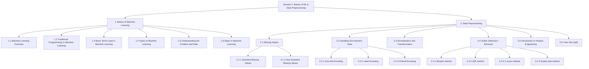
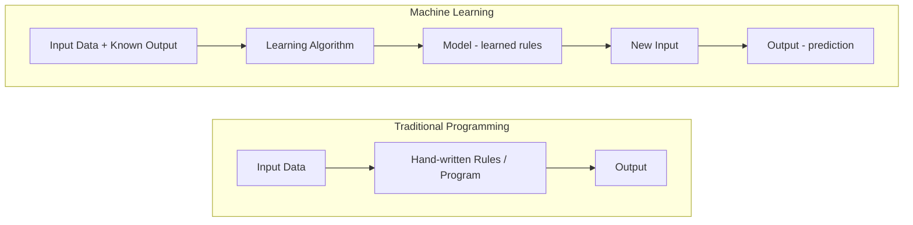
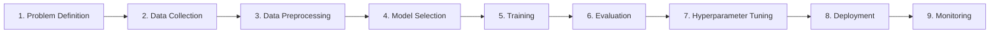
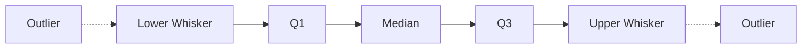

# Session 1: Basics of Machine Learning & Data Preprocessing

> Topic: Basics of Machine Learning & Data Preprocessing
> Date: Aug 3, 2026

## Concept Hierarchy

**Reordering note:** Within "Basics of Machine Learning", _Basic Terms_ and _Types of Machine Learning_ were moved earlier (before _Understanding the Problem and Data_ and _Steps in Machine Learning_) because the vocabulary and categories are needed to describe the problem-understanding step and the lifecycle correctly. No topic was dropped, merged, or added as a new prerequisite — every supplied item appears exactly once below.

**Running example used throughout:** predicting **house prices** from features like area, number of rooms, locality, and age of the house (a regression problem — ties directly into this folder's later sections on linear regression).

---

## 1. Basics of Machine Learning

**Parent concept.** Machine Learning (ML) is the branch of computer science/statistics where a system learns patterns from data instead of being told exact rules. Before learning any technique (regression, classification, etc.), you need: what ML actually means (1.1), how it differs from normal coding (1.2), the vocabulary used everywhere (1.3), the broad categories it falls into (1.4), how to read a real-world problem and its data (1.5), and the full workflow followed to solve it (1.6). These six pieces build on each other in that order.

### 1.1 Machine Learning Overview

**Meaning** — In plain words: instead of writing step-by-step instructions for a task, you show the computer many examples, and it figures out the pattern itself. Technically, **Machine Learning** is a field of study that gives computers the ability to learn a mapping from input data to an output (a prediction or decision) **without being explicitly programmed** for every rule, by optimizing a model's parameters against past data (Arthur Samuel's classic definition, refined by Tom Mitchell as: _a program learns from experience E, with respect to task T, and performance measure P, if its performance at T improves with E, measured by P_).

**Why it matters** — Many real problems (predicting a house price, recognizing spam, detecting fraud) have rules too complex or too numerous for a human to hand-code. ML lets the data itself reveal the rule.

**Example** — For house price prediction: task T = predict price, experience E = past house sales data (area, rooms, price), performance P = how close the predicted price is to the actual price. As E (more sales data) grows, the model's P should improve.

**Exam focus** — Know Tom Mitchell's T/E/P definition verbatim; it's a very common 2-mark question.

### 1.2 Traditional Programming vs Machine Learning

**Meaning** — Traditional programming: a human writes explicit rules (code) that turn input into output. Machine Learning: a human provides input **and** known output (examples), and the computer works out the rules (the model).

**Why it matters** — This contrast is the foundational reason ML exists — it explains _when_ to reach for ML instead of normal coding (rules unknown, too complex, or constantly changing) and _when not to_ (a fixed, simple, well-understood rule doesn't need "learning").

#### How it works — diagram

**Example** — Traditional: writing `if area > 2000: price_category = "expensive"` requires you to know the threshold. ML: you give thousands of (area, price) pairs, and the model learns the relationship itself, including cases too subtle for a human-written `if` rule.

**Important details** — ML is preferred when: the rule is unknown, the rule changes often, the rule is too complex for manual coding (e.g., image recognition), or the system must personalize to data. Traditional programming is preferred when the rule is simple, fixed, and fully known.

**Exam focus** — Common comparison table question (5-mark); see the "Must remember" list for a ready structure.

### 1.3 Basic Terms used in Machine Learning

**Meaning** — Before describing types of ML or its steps, you need a shared vocabulary. Below, each term is introduced once, in plain English + technical meaning, and reused afterward without redefining.

| Term                                    | Plain meaning                         | Technical meaning                                                                                    | Example (house price data)                                                 |
| --------------------------------------- | ------------------------------------- | ---------------------------------------------------------------------------------------------------- | -------------------------------------------------------------------------- |
| **Dataset**                             | The full table of examples used       | Collection of instances used to train/evaluate a model                                               | All past house sales records                                               |
| **Feature** (independent variable)      | A measurable input clue               | A column of the dataset used as model input                                                          | Area, number of rooms, locality                                            |
| **Label / Target** (dependent variable) | The answer you want to predict        | The output variable the model learns to predict                                                      | Price of the house                                                         |
| **Instance / Record / Row**             | One example                           | A single data point with all its feature values and (if known) its label                             | One specific house's data                                                  |
| **Model**                               | The "learned rule"                    | A mathematical function/parameters fit to the training data, used to make predictions                | The trained price-prediction equation                                      |
| **Training**                            | Teaching the model                    | Process of adjusting a model's parameters using the training data                                    | Fitting the model on 80% of house sales                                    |
| **Testing / Validation**                | Checking the model on unseen examples | Evaluating the model on data not used for training, to estimate real-world performance               | Checking price predictions on the remaining 20%                            |
| **Parameters**                          | Values the model learns itself        | Internal coefficients set automatically during training (e.g., regression coefficients)              | The weight given to "area" in the price formula                            |
| **Hyperparameters**                     | Settings you choose before training   | Configuration values set by the user, not learned from data (e.g., learning rate)                    | Degree of a polynomial regression                                          |
| **Overfitting**                         | Memorizing instead of learning        | Model fits training data (including noise) so closely that it performs poorly on new data            | A model that predicts old house prices perfectly but fails on new listings |
| **Underfitting**                        | Learning too little                   | Model is too simple to capture the real pattern, performing poorly even on training data             | Predicting the same average price regardless of area                       |
| **Algorithm**                           | The learning method/recipe            | The procedure used to find the model's parameters from data (e.g., linear regression, decision tree) | The linear regression algorithm                                            |

**Important details** — Overfitting and underfitting are introduced here only as vocabulary; their full treatment (bias-variance tradeoff) is covered later in this folder's regression-specific notes — not repeated here.

**Exam focus** — Definitions of feature/label, overfitting/underfitting, parameters vs hyperparameters are frequent 2-mark questions.

### 1.4 Types of Machine Learning

**Meaning** — ML techniques are grouped by **what kind of feedback/data** they learn from.

- **Supervised Learning** — plain: learning with an answer key. Technical: the dataset has both features and a known label; the model learns to map features → label. Split further into **Regression** (label is continuous, e.g., price) and **Classification** (label is a category, e.g., spam/not-spam). This whole folder (05) and the next (06) are dedicated to these two.
- **Unsupervised Learning** — plain: finding hidden groups/structure with no answer key. Technical: the dataset has only features, no labels; the model finds patterns, e.g., **clustering** (grouping similar houses by features) or **dimensionality reduction** (compressing many features into fewer, without losing much information).
- **Reinforcement Learning** — plain: learning by trial and reward, like training a pet. Technical: an **agent** takes actions in an **environment** and receives **rewards/penalties**; it learns a policy that maximizes total reward over time (e.g., a game-playing agent).

**Important details (variant)** — **Semi-supervised learning** (a mix: a little labelled data + a lot of unlabelled data) is a practical variant of supervised learning, worth knowing by name but not detailed further here.

#### Comparison: Types of Machine Learning

| Aspect        | Supervised                             | Unsupervised                    | Reinforcement                        |
| ------------- | -------------------------------------- | ------------------------------- | ------------------------------------ |
| Data used     | Features + known labels                | Features only, no labels        | State, action, reward signal         |
| Goal          | Predict a label for new inputs         | Discover structure/groups       | Learn a policy maximizing reward     |
| Example task  | House price prediction, spam detection | Customer segmentation           | Game-playing agent, robot navigation |
| Feedback type | Direct (correct answer given)          | None (self-discovered patterns) | Delayed (reward after actions)       |

The central difference: supervised learning is told the right answer during training, unsupervised learning is not, and reinforcement learning learns from the _consequences_ of its own actions rather than a fixed answer key. Choose supervised when labelled historical outcomes exist and you need predictions; unsupervised when you only want to explore structure; reinforcement when the problem is sequential decision-making with feedback over time.

**Exam focus** — This table format itself is a common 5-mark answer. Know which category regression and classification belong to (both supervised).

### 1.5 Understanding the Problem and Data

**Meaning** — Before touching any algorithm, you must correctly frame the real-world question as an ML problem and understand the data available to solve it.

**Why it matters** — A wrongly framed problem (e.g., picking classification when the target is actually continuous) or a poor understanding of the data (wrong features, biased sample) makes every later step — however well executed — produce a useless model.

#### How it works — steps

1. **State the business/real question** in plain language (e.g., "estimate how much a house should sell for").
2. **Identify the target (label)** — is it continuous (→ regression) or categorical (→ classification)? Using 1.4's categories.
3. **Identify available features** — what data do you actually have access to (area, location, etc.)?
4. **Check data quantity and quality** — enough rows? Missing values? (previewed here, fully treated in Section 2).
5. **Decide the type of ML** needed (supervised/unsupervised/reinforcement, from 1.4).

**Example** — For house price prediction: business question = "what should we list this house for?"; target = price (continuous → regression); features = area, rooms, locality, age; data quality check = some houses may have missing "age" values (handled in Section 2.1).

**Exam focus** — Frequently tested as "how do you decide between regression and classification for a given problem" — answer using the target-variable check in step 2.

### 1.6 Steps in Machine Learning

**Meaning** — The complete lifecycle followed to go from a raw problem to a working, deployed model.

#### How it works — pipeline diagram

1. **Problem definition** — frame the question and target (Section 1.5).
2. **Data collection** — gather the dataset (Section 1.3's "dataset").
3. **Data preprocessing** — clean and prepare data: missing values, encoding, scaling, outliers, feature engineering, train-test split — the entire subject of **Section 2** of these notes.
4. **Model selection** — choose an algorithm suited to the problem type (from 1.4), e.g., linear regression for a continuous target.
5. **Training** — fit the model's parameters on the training split (defined in 2.6).
6. **Evaluation** — measure performance on the test split (metrics such as R², RMSE are covered later in this folder).
7. **Hyperparameter tuning** — adjust hyperparameters (1.3) to improve performance.
8. **Deployment** — put the trained model into real use.
9. **Monitoring** — track the model's real-world performance over time, since data patterns can change.

**Connection** — Step 3 of this lifecycle, **Data Preprocessing**, is large and important enough to be its own parent topic — covered next in Section 2, in the same order it would actually be performed on the house-price dataset.

---

## 2. Data Preprocessing

**Parent concept.** Real-world data is rarely clean enough to feed directly into a model — it can have missing entries, text/categories instead of numbers, features on very different scales, and extreme values. **Data Preprocessing** is the set of techniques that turn raw data into a clean, model-ready form. Its children, in the order applied to the house-price dataset: handle missing values (2.1), convert non-numeric columns to numbers (2.2), bring numeric features to a comparable scale (2.3), detect and treat extreme values (2.4), engineer better features (2.5), and finally split the cleaned data for training and testing (2.6).

### 2.1 Missing Values

**Meaning** — Plain: some cells in the data table are empty or hold a "fake" placeholder instead of a real value. Technical: **missing values** are entries in the dataset where no valid measurement was recorded for a given feature of a given instance.

**Why it matters** — Most ML algorithms cannot process empty/undefined values directly — they will error out or silently bias the model if ignored.

#### 2.1.1 Standard Missing Values

**Meaning** — Values that are explicitly and consistently marked as missing by the data source or tool, e.g., blank cells, `NaN`, `NULL`, `None`. These are easy to detect because most libraries (e.g., pandas) recognize them automatically.

**Example** — In the house dataset, the "age of house" column has a blank cell for one record — pandas reads this directly as `NaN`.

#### 2.1.2 Non-Standard Missing Values

**Meaning** — Values that represent "missing" but are **not** flagged as such automatically — written as ordinary-looking text or numbers, e.g., `"n/a"`, `"--"`, `"unknown"`, `"?"`, or even a suspicious placeholder number like `-1` or `0` for a feature that can never realistically be zero.

**Why it matters** — If not identified manually, these silently masquerade as valid data and corrupt the model (e.g., treating `-1` age as a real age).

**Important details** — Handling missing values (both kinds), once detected: (a) **drop** the row/column if missing data is small in amount or the column is not important, (b) **impute** — fill with mean/median (numeric) or mode (categorical), or a model-based estimate. Always detect non-standard missing values first (by inspecting unique values per column) before choosing drop vs impute — otherwise they get treated as valid numbers.

**Example** — A "locality" column has entries `"?"` for some rows — these must be manually recognized as missing before deciding whether to drop those rows or impute the most frequent locality.

**Exam focus** — Standard vs non-standard missing values is a classic 2-mark distinction; the drop-vs-impute decision is a common 5-mark answer.

### 2.2 Handling Non-Numeric Data

**Meaning** — Plain: most ML algorithms only understand numbers, so text/category columns (like "locality": Downtown, Suburb, Rural) must be converted to numeric form. Technical: this conversion is called **categorical encoding**.

**Why it matters** — Without encoding, a model cannot mathematically process a text category at all.

#### 2.2.1 One-Hot Encoding

**Meaning** — Creates one new binary (0/1) column per category value; a `1` marks which category that row belongs to, all others are `0`.

**Example** — "Locality" with values {Downtown, Suburb, Rural} becomes three columns `Locality_Downtown`, `Locality_Suburb`, `Locality_Rural`; a Downtown house gets `(1, 0, 0)`.

**Important details** — Best for **nominal** categories (no natural order). Downside: many unique categories create many new columns (the "curse of dimensionality").

#### 2.2.2 Label Encoding

**Meaning** — Assigns each category a single integer code (0, 1, 2, …), with no new columns created.

**Example** — Downtown → 0, Suburb → 1, Rural → 2.

**Important details** — Risk: the model may wrongly assume an order/magnitude relationship (Rural > Suburb > Downtown numerically) where none exists in reality — suitable mainly for **ordinal** data or tree-based models that don't assume numeric order.

#### 2.2.3 Ordinal Encoding

**Meaning** — Like label encoding (each category → an integer), but the integers are deliberately assigned to **match a real, meaningful order** in the data.

**Example** — House condition {Poor, Average, Good, Excellent} → {0, 1, 2, 3}, where the order genuinely reflects increasing quality.

#### Comparison: Encoding Techniques

| Aspect          | One-Hot Encoding                      | Label Encoding                           | Ordinal Encoding                      |
| --------------- | ------------------------------------- | ---------------------------------------- | ------------------------------------- |
| Output          | One binary column per category        | One integer column                       | One integer column                    |
| Assumes order?  | No                                    | No (but model may wrongly infer one)     | Yes — order is real and intended      |
| Best suited for | Nominal categories, few unique values | Tree-based models, or as a quick default | True ordinal categories               |
| Example column  | Locality                              | Locality (with caution)                  | House condition                       |
| Limitation      | Many columns if many categories       | Can mislead models that assume magnitude | Wrong if order is guessed incorrectly |

The central difference: one-hot avoids implying any order at the cost of extra columns, while label/ordinal encoding stay compact but only ordinal encoding's implied order is actually meaningful. Choose one-hot for unordered categories with few unique values, ordinal encoding when a genuine rank exists, and label encoding mainly as a lightweight default for tree-based algorithms.

**Exam focus** — This table is a very common 5/10-mark question; make sure to state _why_ label encoding can mislead a model (false ordinal assumption).

### 2.3 Normalization and Transformation

**Meaning** — Plain: putting all numeric features on a similar scale so no single feature dominates just because its numbers are bigger. Technical: **normalization/scaling** transforms feature values into a defined range or distribution, without changing the relationships within the data.

**Why it matters** — In the house dataset, "area" might range in thousands (sq. ft.) while "number of rooms" ranges 1–5. Many algorithms (especially those using distance or gradient descent) would let "area" unfairly dominate unless scaled.

**Formula (Min-Max Normalization)** — **Essential**
**Formula** — $x' = \dfrac{x - x_{min}}{x_{max} - x_{min}}$
**Where** — $x$: original value; $x_{min}, x_{max}$: minimum and maximum of that feature in the dataset; $x'$: scaled value, always between 0 and 1.
**Example** — Area values range from 500 to 3500 sq. ft. For a house with area 2000: $x' = \dfrac{2000-500}{3500-500} = \dfrac{1500}{3000} = 0.5$.
**Interpretation** — This house's area is exactly halfway between the smallest and largest house in the dataset.

**Formula (Standardization / Z-score scaling)** — **Essential**
**Formula** — $x' = \dfrac{x - \mu}{\sigma}$
**Where** — $\mu$: mean of the feature; $\sigma$: standard deviation of the feature; $x'$: number of standard deviations $x$ is from the mean.
**Example** — If mean area = 2000 sq. ft. and $\sigma$ = 750, for a house with area 2750: $x' = \dfrac{2750-2000}{750} = 1$.
**Interpretation** — This house's area is 1 standard deviation above the average — this same formula is reused for outlier detection in Section 2.4.3, not re-derived there.

**Important details** — **Transformation** (e.g., log transform) is a related but distinct idea: it reshapes a skewed distribution (like house prices, which are often right-skewed) to be closer to normal, which helps some algorithms' assumptions, whereas normalization only rescales range/spread without changing shape.

**Exam focus** — Be ready to compute a Min-Max or Z-score value given small numbers; also state when to use which (Min-Max when a bounded range like [0,1] is needed, e.g., neural network inputs; standardization when the algorithm assumes normally-distributed features, e.g., linear regression with regularization).

### 2.4 Outlier Detection / Removal

**Meaning** — Plain: an outlier is a data point that looks unusually far from the rest, e.g., a house priced ₹5 crore when most are ₹20–80 lakh. Technical: an **outlier** is an observation that deviates markedly from the rest of the dataset's distribution, possibly due to a data-entry error or a genuinely rare case.

**Why it matters** — Outliers can heavily distort statistics (mean, standard deviation) and mislead models — especially regression, which is sensitive to extreme values.

#### 2.4.1 Boxplot method

**Meaning** — A **boxplot** visually displays a feature's median, quartiles, and "whiskers"; points plotted beyond the whiskers are flagged as outliers.

##### Diagram

**Example** — In a boxplot of house prices, a point far above the upper whisker (e.g., ₹5 crore) is visually flagged as an outlier.

#### 2.4.2 IQR method

**Meaning** — A numeric rule based on the same quartiles shown in the boxplot, used to calculate outlier boundaries precisely instead of just reading them off a chart.

**Formula** — **Essential**
**Formula** — $IQR = Q_3 - Q_1$; Lower bound $= Q_1 - 1.5 \times IQR$; Upper bound $= Q_3 + 1.5 \times IQR$
**Where** — $Q_1$: 25th percentile of the feature; $Q_3$: 75th percentile; any value outside [Lower bound, Upper bound] is an outlier.
**Example** — House prices: $Q_1 = 40$ lakh, $Q_3 = 70$ lakh → $IQR = 30$ lakh; Lower bound $= 40 - 45 = -5$ lakh; Upper bound $= 70 + 45 = 115$ lakh. A house priced 5 crore (500 lakh) exceeds the upper bound → outlier.
**Interpretation** — Any price outside ₹(-5, 115) lakh is unusually far from the typical middle 50% of prices and is flagged for review.

#### 2.4.3 Z-score method

**Meaning** — Uses the standardization formula from Section 2.3 to measure how many standard deviations a value is from the mean; values beyond a chosen threshold (commonly $|z| > 3$) are flagged as outliers.

**Example** — Using Section 2.3's Z-score formula, if a house's price gives $z = 4.2$, it is far beyond the common $|z| > 3$ threshold and is flagged as an outlier.

**Important details** — This method assumes the feature is roughly normally distributed; it is less reliable on skewed data (like raw house prices), where the IQR method is usually preferred.

#### 2.4.4 Scatter plot method

**Meaning** — A **scatter plot** plots two features (or a feature against the target) as points; outliers appear visually as points far away from the main cluster/trend of the data.

**Example** — Plotting area (x-axis) vs price (y-axis): most points follow a rising trend, but one house with very small area and very high price stands far off the trend line — a visual outlier.

**Important details** — Unlike the boxplot/IQR/Z-score methods (which look at one feature alone), a scatter plot can reveal outliers that are only unusual in _relation to another variable_ (e.g., a normal price that's outlying only when paired with its area).

#### Comparison: Outlier Detection Methods

| Aspect                     | Boxplot                     | IQR                          | Z-score                                 | Scatter plot                        |
| -------------------------- | --------------------------- | ---------------------------- | --------------------------------------- | ----------------------------------- |
| Basis                      | Visual, quartiles           | Numeric, quartiles           | Numeric, mean & std dev                 | Visual, two variables               |
| Works well on skewed data? | Yes                         | Yes                          | No (assumes normal-ish data)            | Yes                                 |
| Univariate/bivariate       | Univariate                  | Univariate                   | Univariate                              | Bivariate                           |
| Output                     | Visual flag                 | Exact numeric cutoff         | Exact numeric cutoff                    | Visual flag                         |
| Example use                | Quick check of price spread | Precise price outlier cutoff | Checking a normally-distributed feature | Checking area vs price relationship |

The central difference: boxplot/IQR/Z-score examine a single feature's own distribution, while a scatter plot can catch outliers defined by the _relationship_ between two features. Use IQR/boxplot as the default for skewed real-world data (like prices), Z-score only when the feature is roughly normal, and a scatter plot whenever the outlier depends on a pairing between two variables.

**Important details (general)** — After detection, outliers can be **removed** (dropped), **capped** (values clipped to the bound), or **kept with a flag** (if genuinely meaningful, e.g., a real luxury house) — the right choice depends on whether the outlier is an error or a real rare case.

**Exam focus** — Be ready to compute IQR bounds from given quartiles (numeric question), and to explain the boxplot/scatter-plot difference from IQR/Z-score (conceptual question).

### 2.5 Introduction to Feature Engineering

**Meaning** — Plain: creating better, more useful input columns from the raw data instead of using it as-is. Technical: **feature engineering** is the process of using domain knowledge to create, transform, or select features that improve a model's ability to learn the target.

**Why it matters** — A well-engineered feature can capture a pattern the raw data hides; good features often improve performance more than switching algorithms does.

#### How it works — examples of technique

1. **Feature creation** — combine existing columns into a new, more informative one (e.g., `price_per_sqft = price / area`).
2. **Feature transformation** — apply a mathematical change (e.g., the log transform mentioned in 2.3) to make a feature more useful.
3. **Feature selection** — keep only the features that genuinely help the model, dropping irrelevant or redundant ones (e.g., dropping a "house ID" column, which carries no predictive signal).

**Example** — From "date of sale" (a raw date, not directly numeric-useful), engineer `house_age = sale_year - year_built` — a far more predictive feature for price than the raw date.

**Important details** — Feature engineering builds on Sections 2.1–2.4: it is applied only after missing values, encoding, and outliers are handled, since a new feature built on dirty data inherits the same problems.

**Exam focus** — Give at least one original example (not price_per_sqft, already used) if asked to demonstrate understanding — e.g., extracting "day of week" from a date column for a sales-prediction problem.

### 2.6 Train-Test Split

**Meaning** — Plain: setting aside a portion of the cleaned data that the model never sees during learning, purely to check how well it performs on new, unseen houses. Technical: **train-test split** divides the dataset into a **training set** (used to fit the model's parameters, Section 1.3) and a **test set** (used only for evaluation, Section 1.6 step 6).

**Why it matters** — Evaluating a model on the same data it was trained on would hide overfitting (Section 1.3) — the model could simply be memorizing rather than generalizing. A held-out test set gives an honest estimate of real-world performance.

**How it works** — A common split is 70–80% training / 20–30% test, chosen randomly (or with a fixed random seed for reproducibility) so both sets are representative of the whole dataset.

**Example** — Out of 1,000 house records, 800 are randomly used to train the price-prediction model, and the remaining 200 are kept aside; predictions on those 200 are compared with their actual prices to judge the model.

**Important details** — Splitting must happen **before** certain preprocessing steps are _fit_ (e.g., the min/max or mean/std used for scaling in Section 2.3 should be calculated only from the training set, then applied to the test set) — otherwise information from the test set "leaks" into training, a mistake called **data leakage**.

**Exam focus** — The data-leakage caution above is a common trap question; also know the typical split ratios.

**Connection** — With Section 2 complete, the house-price dataset is now clean, fully numeric, scaled, outlier-checked, feature-engineered, and split — exactly the state needed before Model Selection and Training (Section 1.6, steps 4–5), which this folder's later notes on linear regression build on directly.

---

## Examination Preparation

### Must understand

- The learning-vs-programming contrast and _why_ ML is used (Section 1.2).
- The T/E/P definition of ML (Section 1.1).
- How to decide supervised vs unsupervised vs reinforcement for a given problem (Section 1.4).
- Why label encoding can mislead a model but ordinal encoding is safe when order is real (Section 2.2).
- Why train-test split must happen before fitting scalers, to avoid data leakage (Section 2.6).

### Must remember

- Tom Mitchell's definition: learns from E w.r.t. T, measured by P (1.1).
- Feature vs label, parameters vs hyperparameters, overfitting vs underfitting (1.3).
- Three main ML types: supervised, unsupervised, reinforcement (1.4).
- ML lifecycle order: problem → data → preprocessing → model → train → evaluate → tune → deploy → monitor (1.6).
- Standard vs non-standard missing values (2.1).
- One-Hot / Label / Ordinal encoding differences (2.2).
- Min-Max formula: $x' = \frac{x-x_{min}}{x_{max}-x_{min}}$; Standardization formula: $x' = \frac{x-\mu}{\sigma}$ (2.3).
- IQR bounds formula: $Q_1 - 1.5\,IQR$, $Q_3 + 1.5\,IQR$ (2.4.2).
- Typical train-test split ratio: 70–80% / 20–30% (2.6).

### Common question patterns

- _2-mark:_ Define ML / feature vs label / overfitting vs underfitting / standard vs non-standard missing values.
- _5-mark:_ Traditional programming vs ML; types of ML comparison; encoding techniques comparison; outlier detection methods comparison.
- _10-mark:_ Explain the complete Machine Learning lifecycle with a diagram and example; explain Data Preprocessing with all its sub-techniques on a sample dataset.

### Answer-writing guidance

- _2-mark:_ one clear definition + one example.
- _5-mark:_ definition, short explanation, key points/table, one example or small formula.
- _10-mark:_ introduction, technical definition, diagram/workflow, detailed step-by-step explanation, worked example, advantages/limitations, brief conclusion.

### Model answers

_2-mark:_ "Machine Learning is a field where a system learns a task T from experience E (data), improving its performance P over time, without being explicitly programmed with fixed rules. Example: a house-price model improves its predictions as it sees more past sales data."

_5-mark:_ "Machine Learning differs from traditional programming in how the output is produced. In traditional programming, a human writes explicit rules that convert input to output. In Machine Learning, the human instead provides input data along with known outputs (examples), and a learning algorithm works out the rules — called a model — itself. For example, to classify emails as spam, traditional programming would need a human to hand-code every spam-indicating rule, which is impractical given the huge variety of spam patterns. Machine Learning instead learns these patterns directly from a labelled dataset of spam and non-spam emails. This makes ML suitable whenever the rule is unknown, too complex, or likely to change, while traditional programming remains better for simple, fixed, fully-understood rules."

_10-mark:_ "Introduction: Before building any ML model, raw data must go through several lifecycle stages, together forming the Machine Learning workflow. Definition: This lifecycle is the sequence of steps — problem definition, data collection, data preprocessing, model selection, training, evaluation, hyperparameter tuning, deployment, and monitoring — followed to turn a real-world question into a working predictive system. Diagram: [reproduce the pipeline diagram from Section 1.6]. Detailed explanation: (1) Problem definition frames the real question and identifies whether the target is continuous or categorical; (2) Data collection gathers relevant historical records; (3) Data preprocessing — the largest stage — cleans missing values, encodes categorical data, scales numeric features, treats outliers, engineers new features, and splits data into training/test sets; (4) Model selection picks an algorithm suited to the problem type; (5) Training fits the model's parameters on the training set; (6) Evaluation measures performance on the untouched test set; (7) Hyperparameter tuning adjusts settings like learning rate to improve results; (8) Deployment puts the model into real use; (9) Monitoring tracks performance over time as real-world data can drift. Example/application: for house-price prediction, this means moving from raw sales records, through cleaning and encoding locality/condition columns, to a trained regression model that estimates new listing prices. Advantages: a structured lifecycle avoids skipped steps like leakage-free splitting; ensures the model is properly evaluated before deployment. Limitations: real-world data may need repeated cycles through preprocessing and tuning; monitoring is often neglected, causing silent performance decay. Conclusion: following this lifecycle rigorously, especially the data-preprocessing stage, is what turns a raw dataset into a trustworthy, deployable ML system."

## Practice Questions

### Basic recall

1. State Tom Mitchell's definition of Machine Learning.
   **Answer:** A program learns from experience E, with respect to task T, and performance measure P, if its performance at T improves with E, measured by P (Section 1.1).
2. What is the difference between a feature and a label?
   **Answer:** A feature (independent variable) is a measurable input column used to predict; a label/target (dependent variable) is the output the model learns to predict (Section 1.3).
3. Name the three main types of Machine Learning.
   **Answer:** Supervised, Unsupervised, and Reinforcement Learning (Section 1.4).
4. What is the difference between standard and non-standard missing values?
   **Answer:** Standard missing values are explicitly flagged (blank, `NaN`, `NULL`) and detected automatically by tools like pandas; non-standard missing values look like ordinary text/numbers (e.g., `"?"`, `"n/a"`, `-1`) and must be manually identified (Section 2.1).
5. What is the typical range used for a train-test split ratio?
   **Answer:** 70–80% training / 20–30% test (Section 2.6).

### Conceptual

1. Why is Machine Learning preferred over traditional programming for spam detection?
   **Answer:** The rule distinguishing spam from non-spam is too complex and constantly changing to hand-code; ML instead learns the pattern directly from labelled examples (Section 1.2).
2. Why might label encoding mislead a machine learning model?
   **Answer:** Label encoding assigns arbitrary integers to categories, and a model may wrongly interpret these as having an order or magnitude relationship (e.g., Rural > Suburb > Downtown) that doesn't actually exist (Section 2.2.2).
3. Why must feature scaling parameters be calculated only from the training set?
   **Answer:** Calculating min/max or mean/std from the full dataset (including the test set) lets information from the test set leak into training — a mistake called data leakage — giving an overly optimistic performance estimate (Section 2.6).
4. Why is the Z-score outlier method less reliable on skewed data than the IQR method?
   **Answer:** Z-score assumes the feature is roughly normally distributed; on skewed data (like raw house prices), the mean and standard deviation are themselves distorted by the skew, so the quartile-based IQR method is more robust (Section 2.4.3).
5. Why is feature engineering performed after handling missing values and outliers, not before?
   **Answer:** A new feature built on dirty data (missing values, unencoded categories, extreme outliers) inherits the same problems, so preprocessing must be done first (Section 2.5).

### Comparison

1. Compare One-Hot Encoding, Label Encoding, and Ordinal Encoding.
   **Answer:** See the comparison table in Section 2.2 — one-hot creates a binary column per category with no assumed order (best for nominal data); label encoding assigns arbitrary integers (risking a false order assumption); ordinal encoding assigns integers that match a genuine order in the data.
2. Compare Supervised, Unsupervised, and Reinforcement Learning.
   **Answer:** See the comparison table in Section 1.4 — supervised learning uses features + known labels to predict; unsupervised learning finds structure with no labels; reinforcement learning learns a policy from reward/penalty feedback on its own actions.
3. Compare the Boxplot/IQR method with the Z-score method for outlier detection.
   **Answer:** Boxplot/IQR are quartile-based and work well on skewed data; Z-score is mean/std-based and assumes a roughly normal distribution, making it less reliable on skewed data (Sections 2.4.1–2.4.3).

### Scenario / application

1. A hospital dataset has a "blood pressure" column with some values marked as `"?"` — identify the type of missing value and suggest how to handle it.
   **Answer:** This is a non-standard missing value (Section 2.1.2), since `"?"` isn't automatically recognized as missing by most tools. It should first be manually identified, then handled by dropping the affected rows (if few) or imputing with the median blood pressure, depending on how much data is missing.
2. A retail dataset has a "customer satisfaction" column with values {Low, Medium, High} — which encoding technique should be used, and why?
   **Answer:** Ordinal encoding (Section 2.2.3), because the categories have a genuine, meaningful order (Low < Medium < High) that should be preserved as increasing integers (e.g., 0, 1, 2).
3. A dataset of exam scores has one student's score recorded as 1000 (out of 100) — identify which outlier detection method would catch this and how.
   **Answer:** Any univariate method would catch it — e.g., the IQR method (Section 2.4.2), since 1000 would fall far above $Q_3 + 1.5 \times IQR$, or the Z-score method (Section 2.4.3), since 1000 would give an extremely large $|z|$ value, far beyond the common threshold of 3.

### Long-answer

1. Describe the complete Machine Learning lifecycle from problem definition to monitoring, using a real-world example.
   **Answer:** See Section 1.6's pipeline (problem definition → data collection → data preprocessing → model selection → training → evaluation → hyperparameter tuning → deployment → monitoring) and the 10-mark model answer in Examination Preparation, which walks through each stage using the house-price example.
2. Describe the Data Preprocessing pipeline for a raw dataset, covering missing values, encoding, scaling, outliers, feature engineering, and train-test split in the order they should be applied.
   **Answer:** See Section 2's parent-concept introduction and its child sections in order: handle missing values (2.1) → encode categorical columns (2.2) → scale numeric features (2.3) → detect/treat outliers (2.4) → engineer new features (2.5) → split into train/test sets (2.6), with scaling statistics fit only on the training split to avoid data leakage.

## Quick Revision

- **One-sentence summary:** Machine Learning lets a system learn patterns from data instead of fixed rules, and Data Preprocessing is the essential cleanup stage that turns raw data into a form that ML algorithms can correctly learn from.
- **Hierarchy:** see Concept Hierarchy above.
- **Essential definitions:** ML (1.1), feature/label/model/overfitting (1.3), supervised/unsupervised/reinforcement (1.4), missing values (2.1), encoding (2.2), normalization (2.3), outlier (2.4), feature engineering (2.5), train-test split (2.6).
- **Key workflow:** ML lifecycle pipeline (1.6); preprocessing order — missing values → encoding → scaling → outliers → feature engineering → train-test split (Section 2 order).
- **Most important comparison:** One-Hot vs Label vs Ordinal Encoding (2.2) — governs whether order is implied.
- **Key formulas:** Min-Max (2.3), Standardization/Z-score (2.3, reused in 2.4.3), IQR bounds (2.4.2).
- **5 exam keywords:** overfitting, encoding, normalization, IQR, data leakage.
- **5 common mistakes:** confusing feature with label; using label encoding on unordered categories; scaling before splitting data (leakage); assuming Z-score works well on skewed data; skipping feature engineering ordering (2.5's dependency on 2.1–2.4).

## Topic Coverage

- Machine Learning Overview — Covered in Section 1.1
- Traditional Programming Vs Machine Learning — Covered in Section 1.2
- Understanding the Problem and Data — Covered in Section 1.5
- Steps in Machine Learning — Covered in Section 1.6
- Basic Terms used in Machine Learning — Covered in Section 1.3
- Types of Machine Learning — Covered in Section 1.4
- Missing Values (Standard, Non-Standard) — Covered in Section 2.1 (2.1.1, 2.1.2)
- Handle Non-Numeric Data (One-Hot, Label, Ordinal Encoding) — Covered in Section 2.2 (2.2.1, 2.2.2, 2.2.3)
- Normalization and Transformation — Covered in Section 2.3
- Outliers Detection/removal (Boxplot, IQR, Z-score, Scatter plot) — Covered in Section 2.4 (2.4.1–2.4.4)
- Introduction to Feature Engineering — Covered in Section 2.5
- Train Test Split — Covered in Section 2.6
