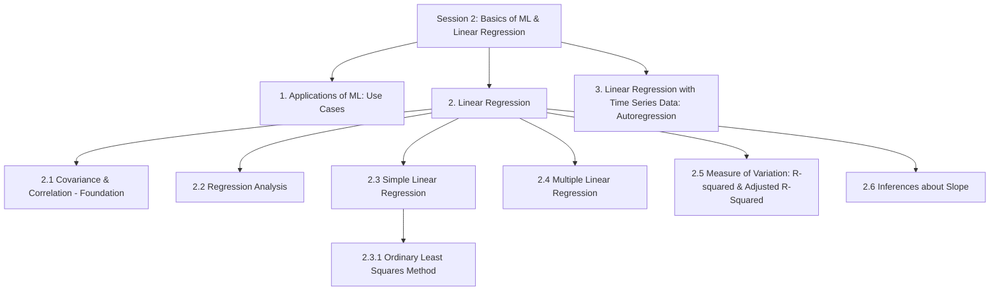

# Session 2: Basics of Machine Learning & Linear Regression

> Topic: Applications of Machine Learning & Linear Regression
> Date: Aug 3, 2026

## Concept Hierarchy

**Reordering note:** Inside "Linear Regression", *Visiting basics: Covariance & Correlation* was moved to the front (2.1) and *Regression Analysis* placed right after it (2.2), because both are prerequisites for understanding *Simple Linear Regression* — you cannot define the regression line or its slope without first knowing what covariance/correlation measure and what "regression analysis" means in general. *Ordinary Least Squares Method* was nested as a child of *Simple Linear Regression* (2.3.1) because it is the specific method used to fit that line. No topic was dropped or merged — every supplied item appears exactly once below, and *Applications of Machine Learning: Use Cases* and *Linear Regression with Time Series Data: Autoregression* keep their original top-level positions as given in the input.

**Running example used throughout:** continuing the **house price prediction** example from [Session 1](01-introduction.md) — first predicting price from a single feature (area), then extending to multiple features (area, rooms, age, locality). For Section 3 (time series), the example shifts to the **monthly average house price index of a city over time**, since predicting from a house's own past values (not its features) needs a genuine time-ordered dataset that the cross-sectional house example cannot provide.

---

## 1. Applications of Machine Learning: Use Cases

**Meaning** — Plain: real situations where Machine Learning (Section 1.1 of [Session 1](01-introduction.md)) is actually put to use. Technical: an **application/use case** is a specific real-world problem mapped onto one of the ML types (supervised/unsupervised/reinforcement, Session 1 Section 1.4) and solved with a trained model.

**Why it matters** — Seeing real use cases makes the abstract lifecycle (Session 1 Section 1.6) concrete, and helps you correctly classify a new problem (regression vs classification vs clustering) before choosing a technique — the same skill practiced in Session 1 Section 1.5.

### Examples (by ML type, using Session 1 Section 1.4's categories)

| Domain         | Use case                                        | ML type                               | Target                          |
| -------------- | ----------------------------------------------- | ------------------------------------- | ------------------------------- |
| Real estate    | Predicting a house's selling price              | Supervised — Regression               | Continuous (price)              |
| Email          | Spam vs not-spam detection                      | Supervised — Classification           | Categorical (spam/not-spam)     |
| Retail         | Grouping customers by buying behaviour          | Unsupervised — Clustering             | No label                        |
| Finance        | Detecting fraudulent transactions               | Supervised — Classification           | Categorical (fraud/not-fraud)   |
| Robotics/Games | An agent learning to play a game well           | Reinforcement Learning                | Reward signal                   |
| Weather/Sales  | Forecasting next month's value from past values | Supervised — Regression (time series) | Continuous, ties into Section 3 |

**Important details** — Use cases are grouped by ML type, not by industry — the same technique (e.g., regression) applies across very different domains (price, temperature, demand) whenever the target is continuous.

**Exam focus** — A common question gives a scenario and asks you to name the ML type and justify it using the target-variable check from Session 1 Section 1.5 — practice this using the table above.

---

## 2. Linear Regression

**Parent concept.** Linear Regression is the first concrete supervised-learning technique in this roadmap (the "Regression" branch introduced in Session 1 Section 1.4). Before defining it precisely, you need two foundations: how to measure the relationship between two numeric variables (2.1) and what "regression analysis" means as a general statistical idea (2.2). With those in place, the notes build up from the simplest case, one predictor (2.3, using the fitting method in 2.3.1), to many predictors (2.4), then to judging how good the fitted line is (2.5) and whether its slope is statistically meaningful (2.6).

### 2.1 Covariance & Correlation (Foundation)

**Meaning** — Plain: two ways to answer "do these two variables move together?" Technical: **covariance** measures the direction (and rough magnitude) of the joint variation of two variables; **correlation** rescales covariance into a fixed range so it can be compared across variables.

**Why it matters** — Linear regression only makes sense between variables that actually move together in a straight-line pattern; covariance and correlation are how that "moving together" is measured and quantified before/while fitting a regression line.

**Formula (Covariance)** — Essential
**Formula** — $Cov(X,Y) = \dfrac{\sum_{i=1}^{n}(x_i-\bar{x})(y_i-\bar{y})}{n-1}$
**Where** — $x_i, y_i$: individual data points; $\bar{x}, \bar{y}$: means of $X$ and $Y$; $n$: number of observations.
**Example** — For 4 houses with area (in 100 sq. ft.) $X = [10, 15, 20, 25]$ and price (in lakh) $Y = [40, 55, 65, 80]$: $\bar{x}=17.5$, $\bar{y}=60$. $Cov(X,Y) = \dfrac{(-7.5)(-20)+(-2.5)(-5)+(2.5)(5)+(7.5)(20)}{3} = \dfrac{150+12.5+12.5+150}{3} = 108.3$.
**Interpretation** — A positive covariance means area and price tend to increase together; the raw number (108.3) is hard to judge on its own since it depends on the units used — this is exactly why correlation is needed next.

**Formula (Correlation, Pearson's r)** — Essential
**Formula** — $r = \dfrac{Cov(X,Y)}{\sigma_X \, \sigma_Y}$
**Where** — $Cov(X,Y)$: covariance from above; $\sigma_X, \sigma_Y$: standard deviations of $X$ and $Y$; $r$ always lies between $-1$ and $+1$.
**Example** — Continuing above: $\sum(x_i-\bar{x})^2 = 125$ and $\sum(y_i-\bar{y})^2 = 850$, so $\sigma_X = \sqrt{125/3} \approx 6.46$ and $\sigma_Y = \sqrt{850/3} \approx 16.83$. Then $r = \dfrac{108.3}{6.46 \times 16.83} \approx 0.99$.
**Interpretation** — $r \approx 0.99$ (very close to $+1$) means a strong positive straight-line relationship — as area increases, price increases almost proportionally; close to $0$ means little to no straight-line relationship; close to $-1$ means a strong negative relationship.

**Important details** — $r > 0$: positive relationship; $r < 0$: negative relationship; $|r|$ close to 1: strong relationship; $|r|$ close to 0: weak/no **linear** relationship (a strong *curved* relationship can still give a low $r$). Correlation does not imply causation — a common exam trap.

**Exam focus** — Be ready to compute covariance and correlation from a small dataset, and to state the "correlation ≠ causation" caution.

### 2.2 Regression Analysis

**Meaning** — Plain: regression analysis is the general toolbox for drawing the "best-fit line (or curve)" through data so you can predict one variable from another. Technical: **regression analysis** is a set of statistical techniques for estimating the relationship between a dependent variable (label, Session 1 Section 1.3) and one or more independent variables (features), used both to explain that relationship and to predict new values.

**Why it matters** — It formalizes the intuition built by correlation (2.1) — correlation only says *how strong* a straight-line relationship is, while regression analysis actually builds the *equation* of that line so it can be used for prediction.

#### How it works — general idea

1. Assume a mathematical form for the relationship (for linear regression, a straight line/plane).
2. Use historical data to estimate the equation's coefficients (Section 2.3.1's Ordinary Least Squares is one such estimation method).
3. Use the fitted equation to predict the target for new, unseen inputs.

**Important details** — Regression analysis is a family with many members (linear, polynomial, logistic, etc.); this session and the rest of this folder focus specifically on **linear** regression, where the assumed relationship is a straight line (one predictor, 2.3) or a flat plane/hyperplane (multiple predictors, 2.4).

**Exam focus** — Know the one-line definition and be able to state that regression predicts a continuous target, distinguishing it from classification (Session 1 Section 1.4).

### 2.3 Simple Linear Regression

**Meaning** — Plain: drawing the single best straight line through a scatter plot of one input (feature) against one output (label), then using that line to predict. Technical: **Simple Linear Regression** models a continuous target $Y$ as a straight-line function of exactly one predictor $X$.

**Why it matters** — It is the simplest possible case of the general regression idea (2.2), so its formula and fitting method are the foundation the rest of this folder (multiple regression, polynomial regression, regularization) all extend.

**Formula** — Essential
**Formula** — $\hat{y} = b_0 + b_1 x$
**Where** — $\hat{y}$: predicted value of the target; $x$: value of the single predictor; $b_0$: intercept (predicted $\hat{y}$ when $x=0$); $b_1$: slope (how much $\hat{y}$ changes for a one-unit increase in $x$).
**Example** — Predicting house price ($\hat{y}$, in lakh) from area ($x$, in 100 sq. ft.) using a fitted equation $\hat{y} = 5 + 3x$: for a house with $x=20$ (2000 sq. ft.), $\hat{y} = 5 + 3(20) = 65$ lakh.
**Interpretation** — $b_1=3$ means every extra 100 sq. ft. of area is associated with about ₹3 lakh more in predicted price; $b_0=5$ is the baseline predicted price at (a theoretical) zero area — how $b_0$ and $b_1$ are actually calculated from data is covered next in Section 2.3.1.

**Important details** — Simple linear regression assumes the true relationship is (approximately) a straight line, and that leftover differences between actual and predicted values (called **residuals**, $e_i = y_i - \hat{y}_i$) are small and patternless — a fuller treatment of these assumptions is in this folder's dedicated notes on regression assumptions (see this folder's topic list).

**Exam focus** — Know the formula and what each symbol means; be ready to compute $\hat{y}$ given $b_0$, $b_1$, and $x$.

#### 2.3.1 Ordinary Least Squares Method

**Meaning** — Plain: the standard way to pick the "best" line — the one where the total squared vertical distance between the actual points and the line is as small as possible. Technical: **Ordinary Least Squares (OLS)** is an estimation method that chooses $b_0, b_1$ to minimize the **sum of squared residuals**, $\sum_i (y_i - \hat{y}_i)^2$.

**Why it matters** — Without a defined "best," infinitely many lines could be drawn through the same scatter plot; OLS gives one precise, mathematically justified answer, and is the default fitting method used across simple and multiple linear regression.

**Formula (OLS slope and intercept)** — Essential
**Formula** — $b_1 = \dfrac{\sum_{i=1}^{n}(x_i-\bar{x})(y_i-\bar{y})}{\sum_{i=1}^{n}(x_i-\bar{x})^2} = \dfrac{Cov(X,Y)}{Var(X)}$, then $b_0 = \bar{y} - b_1\bar{x}$
**Where** — $Cov(X,Y)$: covariance from Section 2.1; $Var(X)$: variance of $X$ (covariance of $X$ with itself); $\bar{x}, \bar{y}$: means of $X$ and $Y$.
**Example** — Reusing Section 2.1's 4-house data ($\bar{x}=17.5$, $\bar{y}=60$, numerator of covariance sum $=325$): $\sum(x_i-\bar{x})^2 = (-7.5)^2+(-2.5)^2+(2.5)^2+(7.5)^2 = 56.25+6.25+6.25+56.25=125$. So $b_1 = 325/125 = 2.6$, and $b_0 = 60 - 2.6(17.5) = 60 - 45.5 = 14.5$.
**Interpretation** — The OLS-fitted line for this tiny dataset is $\hat{y} = 14.5 + 2.6x$ — every extra 100 sq. ft. of area is associated with about ₹2.6 lakh more in price, computed directly from the data rather than assumed.

**Important details** — "Least squares" specifically means squaring the residuals before summing — this makes both positive and negative residuals count as positive error, and penalizes large errors more heavily than small ones. OLS is the estimation method; Section 2.5's R-squared is how you judge the quality of the resulting fit.

**Exam focus** — Be ready to derive/compute $b_1$ and $b_0$ from small $(x,y)$ data, exactly as in the worked example; know that OLS minimizes the sum of squared residuals.

### 2.4 Multiple Linear Regression

**Meaning** — Plain: the same idea as simple linear regression, but predicting from several features at once instead of just one. Technical: **Multiple Linear Regression** models a continuous target $Y$ as a linear function of two or more predictors $X_1, X_2, \dots, X_k$.

**Why it matters** — Real predictions rarely depend on just one feature — house price realistically depends on area *and* rooms *and* locality *and* age together; multiple regression lets all of them contribute simultaneously.

**Formula** — Essential
**Formula** — $\hat{y} = b_0 + b_1x_1 + b_2x_2 + \dots + b_kx_k$
**Where** — $x_1,\dots,x_k$: the $k$ predictors (e.g., area, rooms, age, locality); $b_1,\dots,b_k$: each predictor's own slope, showing its effect on $\hat{y}$ **holding the other predictors constant**; $b_0$: intercept.
**Example** — Extending the running example: $\hat{y} = 10 + 2.6x_1 + 4x_2 - 0.5x_3$ where $x_1$=area (100 sq. ft.), $x_2$=number of rooms, $x_3$=age of house (years). For a house with area 20 (2000 sq. ft.), 3 rooms, age 5 years: $\hat{y} = 10 + 2.6(20) + 4(3) - 0.5(5) = 10+52+12-2.5 = 71.5$ lakh.
**Interpretation** — Each coefficient is read "holding the others fixed" — e.g., $b_3=-0.5$ means, for two houses with the same area and rooms, each extra year of age is associated with about ₹0.5 lakh less predicted price.

**Important details** — The coefficients $b_0,\dots,b_k$ are still fit using the same Ordinary Least Squares principle from Section 2.3.1 (minimizing summed squared residuals) — only the formula is extended to matrix form (commonly written $\boldsymbol{\beta} = (X^{T}X)^{-1}X^{T}y$) rather than the single-predictor formula; this matrix form is *additional depth* and not needed to understand the concept, only to compute it efficiently in code.

**Exam focus** — Know the general formula, how to interpret one coefficient "holding others constant," and that it is fit by the same least-squares principle as simple linear regression (2.3.1) — don't re-derive OLS here.

### 2.5 Measure of Variation: R-squared & Adjusted R-Squared

**Meaning** — Plain: a score (0 to 1) telling you how much of the up-and-down pattern in the target your regression line actually explains. Technical: **R-squared ($R^2$)**, the **coefficient of determination**, is the proportion of the total variation in $Y$ that is explained by the fitted regression model.

**Why it matters** — After fitting a line with OLS (2.3.1), you need a number to judge *how good* that fit actually is — R² is the standard way to quantify this.

**Formula (R-squared)** — Essential
**Formula** — $R^2 = 1 - \dfrac{SS_{res}}{SS_{tot}}$, where $SS_{res} = \sum_i (y_i-\hat{y}_i)^2$ and $SS_{tot} = \sum_i (y_i-\bar{y})^2$
**Where** — $SS_{res}$: sum of squared residuals (unexplained variation, the same quantity OLS minimizes in 2.3.1); $SS_{tot}$: total variation of $Y$ around its own mean, ignoring the model entirely.
**Example** — If $SS_{tot} = 500$ and the fitted model leaves $SS_{res} = 100$: $R^2 = 1 - 100/500 = 0.8$.
**Interpretation** — 80% of the variation in house price is explained by the model's predictors; the remaining 20% is unexplained (noise or missing predictors).

**Formula (Adjusted R-squared)** — Essential
**Formula** — $R^2_{adj} = 1 - \dfrac{(1-R^2)(n-1)}{n-k-1}$
**Where** — $n$: number of observations; $k$: number of predictors; $R^2$: from the formula above.
**Example** — With $R^2=0.8$, $n=100$ houses, $k=4$ predictors: $R^2_{adj} = 1 - \dfrac{(0.2)(99)}{95} = 1 - 0.208 = 0.792$.
**Interpretation** — Adjusted R² (0.792) is slightly lower than plain R² (0.8) — it penalizes the model a little for using 4 predictors, so it only rewards a predictor if it genuinely improves the fit.

**Important details** — Plain R² **always increases (or stays the same)** when you add any extra predictor, even a useless one — this makes it unsafe for comparing models with a different number of predictors (relevant once Section 2.4's multiple regression is used). Adjusted R² corrects for this by penalizing extra predictors that don't earn their place, making it the safer metric when comparing multiple-regression models of different sizes.

**Exam focus** — Be ready to compute both R² and adjusted R² from given numbers, and to explain *why* adjusted R² is preferred over plain R² when comparing multiple-regression models (2.4) with different numbers of predictors.

### 2.6 Inferences about Slope

**Meaning** — Plain: checking whether the slope you calculated (2.3.1) is a real effect or could just be random noise from this particular sample. Technical: **inference about the slope** is a hypothesis test on the regression coefficient $b_1$, checking whether the true population slope $\beta_1$ is significantly different from zero.

**Why it matters** — A slope like $b_1=2.6$ (Section 2.3.1) is only computed from one sample of data; inference tells you whether that number is statistically trustworthy or could easily have been zero (no real relationship) just by chance.

#### How it works — steps

1. State the hypotheses: $H_0: \beta_1 = 0$ (no real linear relationship) vs $H_1: \beta_1 \neq 0$ (a real relationship exists).
2. Compute the standard error of the slope, $SE(b_1)$ (an estimate of how much $b_1$ would vary across repeated samples).
3. Compute a **t-statistic** for the slope.
4. Compare the t-statistic to a critical value (or check its p-value) to decide whether to reject $H_0$.

**Formula** — Exam-important
**Formula** — $t = \dfrac{b_1 - 0}{SE(b_1)}$
**Where** — $b_1$: the OLS-estimated slope from Section 2.3.1; $SE(b_1)$: standard error of the slope estimate; $t$: test statistic, compared against a t-distribution with $n-2$ degrees of freedom (simple regression) to get a p-value.
**Example** — If $b_1 = 2.6$ and $SE(b_1) = 0.5$: $t = 2.6/0.5 = 5.2$ — a large t-value, far from 0.
**Interpretation** — A large $|t|$ (and correspondingly small p-value, typically compared against 0.05) means it is very unlikely the true slope is actually zero — so area is judged a statistically significant predictor of price; a small $|t|$ would mean the observed slope could plausibly be due to chance alone.

**Important details** — Rejecting $H_0$ (small p-value, e.g., < 0.05) means the predictor is a statistically significant contributor to the model; failing to reject $H_0$ means there isn't enough evidence that this predictor genuinely affects the target — it might be worth dropping in feature selection (Session 1 Section 2.5).

**Exam focus** — Know the hypotheses ($H_0: \beta_1=0$), the t-statistic formula, and how to interpret a given t-value/p-value in terms of statistical significance.

**Connection** — Sections 2.1–2.6 together take the running house-price example from "do area and price even move together?" (2.1) all the way to "here is the fitted equation (2.3/2.4), how good it is (2.5), and whether we can trust its slope (2.6)" — the complete linear regression workflow. Section 3 next extends the same straight-line idea to data that arrives in **time order**.

---

## 3. Linear Regression with Time Series Data: Autoregression

**Meaning** — Plain: instead of predicting a value from *other* features (like area, rooms), predicting a value from its **own past values** over time. Technical: **Autoregression (AR)** is a linear regression model where the predictors are earlier (lagged) values of the same time-ordered variable, rather than separate features.

**Why it matters** — Some data (monthly price index, daily temperature, stock prices) doesn't come with separate predictor features at all — the most useful information for predicting tomorrow's value is often simply what happened on recent past days; autoregression applies the same linear-regression machinery (2.2–2.3.1) to this self-referencing case.

**Formula** — Exam-important
**Formula** — $Y_t = c + \phi_1 Y_{t-1} + \phi_2 Y_{t-2} + \dots + \phi_p Y_{t-p} + \varepsilon_t$ (an AR(p) model)
**Where** — $Y_t$: value at current time $t$; $Y_{t-1}, \dots, Y_{t-p}$: values at the previous $p$ time steps (the "lags"); $\phi_1,\dots,\phi_p$: coefficients (found via the same least-squares idea as Section 2.3.1, applied to lagged values instead of separate features); $c$: constant/intercept; $\varepsilon_t$: random error at time $t$.
**Example** — An AR(1) model for the monthly house price index: $Y_t = 5 + 0.9\,Y_{t-1}$. If last month's index was $Y_{t-1}=200$: $\hat{Y}_t = 5 + 0.9(200) = 5 + 180 = 185$.
**Interpretation** — The predicted index for this month is 185, driven mostly by last month's value (coefficient 0.9, close to 1, meaning strong persistence from one month to the next) plus a small constant drift of 5.

**Important details** — The number $p$ (how many past values/lags to use) is a hyperparameter (Session 1 Section 1.3), chosen using the data itself (e.g., by checking correlation between $Y_t$ and $Y_{t-k}$ for various lags $k$ — the same correlation idea from Section 2.1, now applied across time rather than across two different variables). Autoregression assumes the series is **stationary** (its statistical properties like mean and variance don't change over time) — a non-stationary series (e.g., one with a strong trend) usually needs differencing before an AR model is fit.

**Exam focus** — Know the AR(p) formula, that it regresses a variable on its own lagged values, and the stationarity assumption — a frequent conceptual question is "how does autoregression differ from ordinary multiple linear regression (2.4)?": the predictors are the series' own past values instead of separate, independently measured features.

---

## Examination Preparation

### Must understand

- Why correlation and covariance must be understood before regression's slope can make sense (Section 2.1 → 2.3).
- How Ordinary Least Squares actually chooses $b_0, b_1$ (Section 2.3.1).
- Why plain R² is unsafe for comparing models with different numbers of predictors, and how Adjusted R² fixes this (Section 2.5).
- How the hypothesis test on the slope works and what a small p-value means (Section 2.6).
- How autoregression differs from ordinary multiple linear regression (Section 3).

### Must remember

- Covariance and correlation formulas, and that $-1 \le r \le 1$ (2.1).
- Simple linear regression equation $\hat{y}=b_0+b_1x$ (2.3) and OLS formulas for $b_1, b_0$ (2.3.1).
- Multiple linear regression equation $\hat{y}=b_0+b_1x_1+\dots+b_kx_k$, coefficients read "holding others constant" (2.4).
- $R^2 = 1-SS_{res}/SS_{tot}$ and $R^2_{adj}=1-\frac{(1-R^2)(n-1)}{n-k-1}$ (2.5).
- Slope hypothesis test: $H_0:\beta_1=0$, $t=b_1/SE(b_1)$ (2.6).
- AR(p) formula: $Y_t=c+\phi_1Y_{t-1}+\dots+\phi_pY_{t-p}+\varepsilon_t$, stationarity assumption (Section 3).

### Common question patterns

- *2-mark:* Define regression analysis / correlation / R-squared / autoregression.
- *5-mark:* Difference between simple and multiple linear regression; R² vs adjusted R²; why OLS minimizes squared (not absolute) residuals; how autoregression differs from multiple regression.
- *10-mark:* Derive/explain the Ordinary Least Squares method with a worked numeric example; explain the full linear regression workflow from correlation to slope inference using a real example.

### Answer-writing guidance

- *2-mark:* one clear definition + one example.
- *5-mark:* definition, short explanation, key points/table, one example or small formula.
- *10-mark:* introduction, technical definition, diagram/workflow, detailed step-by-step explanation, worked example, advantages/limitations, brief conclusion.

### Model answers

*2-mark:* "R-squared is the proportion of the total variation in the target variable explained by a regression model, ranging from 0 to 1. Example: an R² of 0.8 means the model explains 80% of the variation in house prices."

*5-mark:* "Simple linear regression models a continuous target using exactly one predictor, with the equation $\hat{y}=b_0+b_1x$, whereas multiple linear regression extends this to several predictors at once, $\hat{y}=b_0+b_1x_1+\dots+b_kx_k$. In simple regression, the single slope $b_1$ directly shows how the target changes with the one predictor. In multiple regression, each slope $b_i$ instead shows the predictor's effect *holding all other predictors constant*, since several features can influence the target simultaneously — for example, a house's price may depend on area, number of rooms, and age together, not on area alone. Both are fit using the same Ordinary Least Squares principle of minimizing the sum of squared residuals, but multiple regression requires the extended matrix form of the OLS formula to handle several predictors at once. Multiple regression is preferred whenever more than one feature genuinely affects the target, which is the common case in real datasets."

*10-mark:* "Introduction: Fitting a regression line requires a precise, mathematically justified way to choose its coefficients — this is the role of the Ordinary Least Squares (OLS) method. Definition: OLS is an estimation method that selects the intercept and slope of a regression line by minimizing the sum of squared residuals between actual and predicted values. Diagram/workflow: raw (x,y) data → compute means, covariance, and variance → apply the OLS formulas → obtain fitted line → compute residuals for evaluation. Detailed explanation: for simple linear regression, the slope is calculated as $b_1=Cov(X,Y)/Var(X)$ and the intercept as $b_0=\bar y-b_1\bar x$; squaring the residuals before summing ensures that positive and negative errors don't cancel out, and that larger errors are penalized more heavily than small ones, which is why 'least squares' rather than, say, 'least absolute error' is the standard choice. Worked example: using four houses with area $X=[10,15,20,25]$ and price $Y=[40,55,65,80]$, the means are $\bar x=17.5,\bar y=60$; the OLS slope works out to $b_1=2.6$ and intercept $b_0=14.5$, giving the fitted line $\hat y=14.5+2.6x$. Advantages: OLS has a simple closed-form solution for linear regression and is easy to interpret. Limitations: OLS is sensitive to outliers (Session 1 Section 2.4), since squaring makes large residuals disproportionately influential, and it assumes a genuinely linear relationship between predictors and target. Conclusion: OLS is the foundational fitting method behind both simple and multiple linear regression, and understanding its formula is essential before moving to model evaluation (R-squared) and inference (slope significance testing)."

## Practice Questions

### Basic recall

1. State the formula for Pearson's correlation coefficient.
   **Answer:** $r = \dfrac{Cov(X,Y)}{\sigma_X\sigma_Y}$, always between $-1$ and $+1$ (Section 2.1).
2. Write the equation of a simple linear regression model and define each symbol.
   **Answer:** $\hat y = b_0 + b_1x$, where $\hat y$ is the predicted target, $x$ the single predictor, $b_0$ the intercept, and $b_1$ the slope (Section 2.3).
3. What does Ordinary Least Squares actually minimize?
   **Answer:** The sum of squared residuals, $\sum_i (y_i-\hat y_i)^2$ (Section 2.3.1).
4. Write the formula for R-squared.
   **Answer:** $R^2 = 1 - SS_{res}/SS_{tot}$ (Section 2.5).
5. Write the general AR(p) autoregression equation.
   **Answer:** $Y_t = c + \phi_1Y_{t-1}+\dots+\phi_pY_{t-p}+\varepsilon_t$ (Section 3).

### Conceptual

1. Why is correlation alone not enough to make predictions, unlike regression analysis?
   **Answer:** Correlation (Section 2.1) only measures how strong a straight-line relationship is; it gives no equation. Regression analysis (Section 2.2) actually estimates the coefficients of that equation, which can then be used to predict new values.
2. Why does OLS square the residuals instead of just adding them directly?
   **Answer:** Summing raw residuals directly would let positive and negative errors cancel out; squaring makes every error positive and penalizes large errors more heavily than small ones (Section 2.3.1).
3. Why does plain R² always increase when a new predictor is added, even a useless one?
   **Answer:** Adding any predictor can only reduce (or leave unchanged) the sum of squared residuals $SS_{res}$, since OLS can always assign a near-zero coefficient at worst — so $R^2=1-SS_{res}/SS_{tot}$ never decreases (Section 2.5).
4. Why must a time series be (approximately) stationary before fitting an autoregression model?
   **Answer:** Autoregression assumes the series' statistical properties (mean, variance) don't change over time; a non-stationary series (e.g., with a strong trend) violates this and usually needs differencing first (Section 3).
5. Why is each coefficient in multiple linear regression interpreted "holding other predictors constant"?
   **Answer:** Because several predictors influence the target simultaneously, each coefficient $b_i$ isolates that one predictor's own effect, assuming the values of all other predictors stay fixed (Section 2.4).

### Comparison

1. Compare Simple Linear Regression and Multiple Linear Regression.
   **Answer:** Simple regression uses exactly one predictor ($\hat y=b_0+b_1x$); multiple regression uses two or more predictors ($\hat y=b_0+b_1x_1+\dots+b_kx_k$), with each coefficient read "holding the others constant" (Sections 2.3–2.4).
2. Compare R-squared and Adjusted R-squared.
   **Answer:** R² always increases (or stays the same) with added predictors, even useless ones; Adjusted R² penalizes extra predictors that don't genuinely improve the fit, making it safer for comparing models with different numbers of predictors (Section 2.5).
3. Compare Multiple Linear Regression and Autoregression.
   **Answer:** Multiple regression predicts a target from separate, independently measured features; autoregression predicts a time-ordered variable from its own past (lagged) values instead of separate features (Sections 2.4 and 3).

### Scenario / application

1. A retailer wants to predict monthly sales purely from the past three months' sales figures — which technique from this session fits, and why?
   **Answer:** Autoregression, specifically an AR(3) model (Section 3), since the predictors are the series' own past values ($Y_{t-1}, Y_{t-2}, Y_{t-3}$), not separate features.
2. A model with 2 predictors gives R²=0.75, and adding a 3rd unrelated predictor raises R² to 0.76 but lowers Adjusted R² to 0.74 — explain what this means and which predictor set is better.
   **Answer:** The 3rd predictor barely improved the fit (R² rose only slightly) but wasn't worth its added complexity — Adjusted R² dropping confirms it doesn't genuinely help (Section 2.5). The original 2-predictor model is the better choice.
3. A fitted simple linear regression gives $b_1=0.8$ with a very small p-value (<0.01) — explain what this means about the predictor's relationship with the target.
   **Answer:** A small p-value means it is very unlikely the true slope is zero, so the predictor is a statistically significant contributor to the target (Section 2.6) — reject $H_0:\beta_1=0$.

### Long-answer

1. Explain the complete process of fitting and evaluating a simple linear regression model, from correlation to slope inference, using a worked example.
   **Answer:** See Sections 2.1 → 2.3 → 2.3.1 → 2.5 → 2.6 in order, and the 10-mark model answer in Examination Preparation, which walks through the full worked example (covariance/correlation → OLS fit → R² → slope significance test).
2. Explain how autoregression adapts the linear regression idea to time series data, including its key formula and assumption.
   **Answer:** See Section 3 — autoregression regresses a variable on its own lagged values ($Y_t=c+\phi_1Y_{t-1}+\dots+\phi_pY_{t-p}+\varepsilon_t$) using the same least-squares fitting principle as Section 2.3.1, under the assumption that the series is stationary.

## Quick Revision

- **One-sentence summary:** Linear Regression fits the best straight-line relationship between a continuous target and one or more predictors using Ordinary Least Squares, and its quality and reliability are checked using R-squared/Adjusted R-squared and slope-significance testing — the same straight-line idea also powers autoregression on time-ordered data.
- **Hierarchy:** see Concept Hierarchy above.
- **Essential definitions:** covariance/correlation (2.1), regression analysis (2.2), simple linear regression (2.3), OLS (2.3.1), multiple linear regression (2.4), R²/adjusted R² (2.5), slope inference (2.6), autoregression (Section 3).
- **Key formulas:** covariance & correlation (2.1); OLS slope/intercept (2.3.1); R² and adjusted R² (2.5); slope t-statistic (2.6); AR(p) equation (Section 3).
- **Most important comparison:** R² vs Adjusted R² (2.5) — governs safe model comparison when predictor count differs.
- **5 exam keywords:** covariance, Ordinary Least Squares, residual, Adjusted R-squared, stationarity.
- **5 common mistakes:** confusing covariance's raw scale with correlation's fixed [-1,1] scale; assuming a higher R² always means a better model regardless of predictor count; forgetting that OLS minimizes *squared* residuals, not absolute ones; misreading a multiple-regression coefficient without the "holding others constant" caveat; applying autoregression to a non-stationary series without differencing.

## Topic Coverage

- Applications of Machine Learning: Use Cases — Covered in Section 1
- Simple Linear Regression — Covered in Section 2.3
- Multiple Linear Regression — Covered in Section 2.4
- Visiting basics: Covariance & Correlation — Covered in Section 2.1
- Regression Analysis — Covered in Section 2.2
- Ordinary Least Square Method — Covered in Section 2.3.1
- Measure of Variation: R-squared & Adjusted R-Squared — Covered in Section 2.5
- Inferences about slope — Covered in Section 2.6
- Linear Regression with time series data: Autoregression — Covered in Section 3
