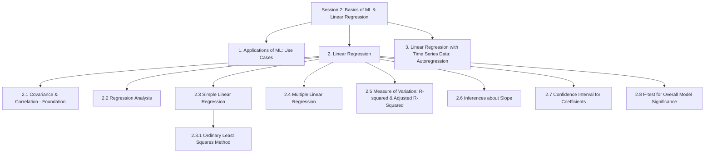
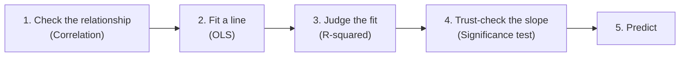
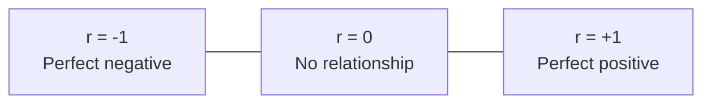
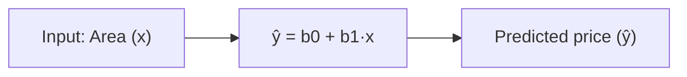
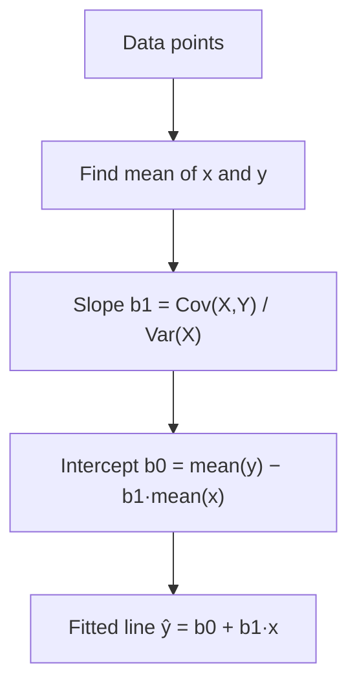
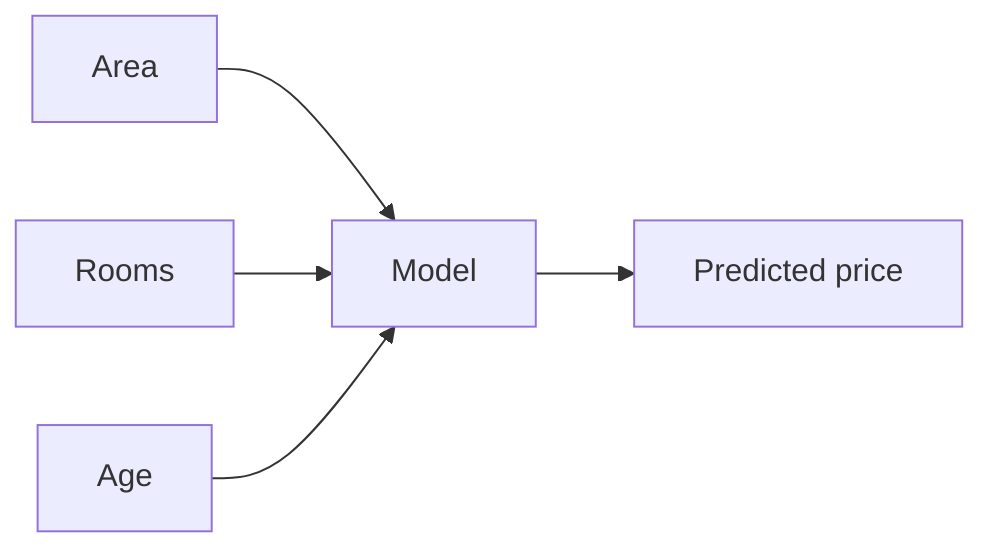
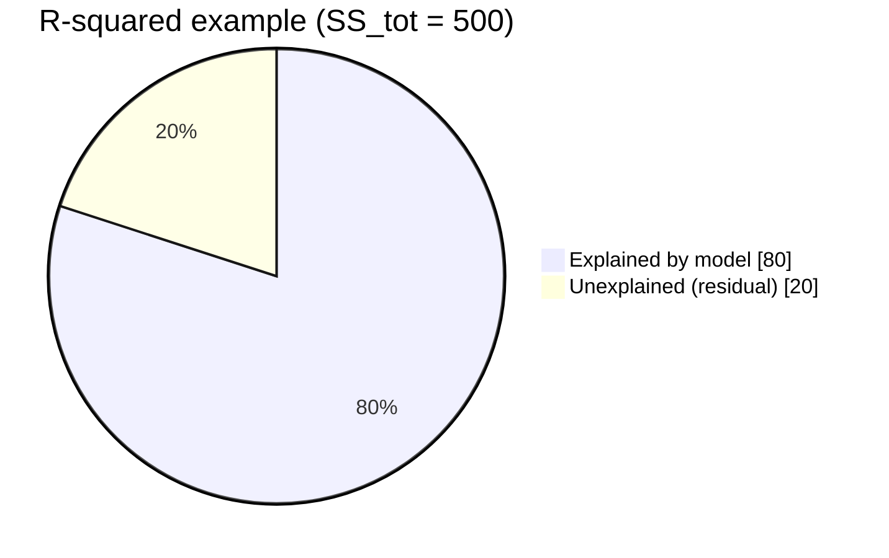
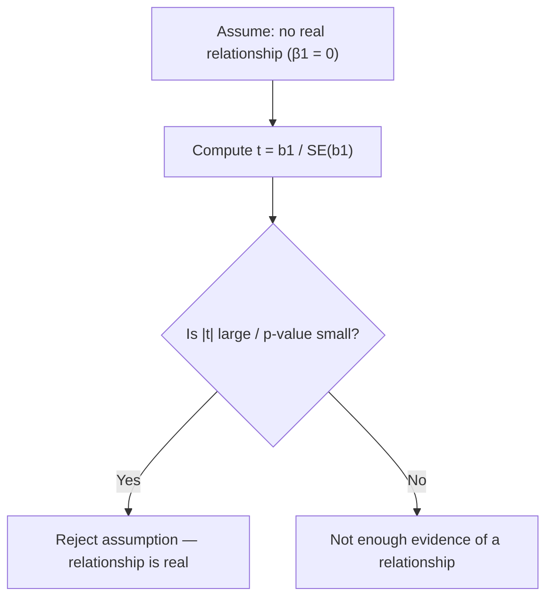
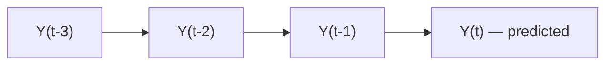

# Session 2: Basics of Machine Learning & Linear Regression

> Topic: Applications of Machine Learning & Linear Regression
> Date: Aug 3, 2026

## Concept Hierarchy

**Reordering note:** Inside "Linear Regression", *Visiting basics: Covariance & Correlation* was moved to the front (2.1) and *Regression Analysis* placed right after it (2.2), because both are prerequisites for understanding *Simple Linear Regression* — you cannot define the regression line or its slope without first knowing what covariance/correlation measure and what "regression analysis" means in general. *Ordinary Least Squares Method* was nested as a child of *Simple Linear Regression* (2.3.1) because it is the specific method used to fit that line. No topic was dropped or merged — every supplied item appears exactly once below, and *Applications of Machine Learning: Use Cases* and *Linear Regression with Time Series Data: Autoregression* keep their original top-level positions as given in the input.

**Running example used throughout:** continuing the **house price prediction** example from [Session 1](01-introduction.md) — first predicting price from a single feature (area), then extending to multiple features (area, rooms, age, locality). For Section 3 (time series), the example shifts to the **monthly average house price index of a city over time**, since predicting from a house's own past values (not its features) needs a genuine time-ordered dataset that the cross-sectional house example cannot provide.

---

## 1. Applications of Machine Learning: Use Cases

A **use case** is simply a real-world problem matched to one of the ML types (supervised/unsupervised/reinforcement) and solved with a trained model. Seeing real examples makes it easy to recognize whether a new problem is a regression, classification, or clustering task before picking a technique.

> **Formal definition:** A machine learning use case is a real-world problem formulated as a supervised, unsupervised, or reinforcement learning task and solved using a model trained on relevant data.

### Examples (by ML type)

| Domain         | Use case                                        | ML type                               | Target                          |
| -------------- | ----------------------------------------------- | ------------------------------------- | ------------------------------- |
| Real estate    | Predicting a house's selling price              | Supervised — Regression               | Continuous (price)              |
| Email          | Spam vs not-spam detection                      | Supervised — Classification           | Categorical (spam/not-spam)     |
| Retail         | Grouping customers by buying behaviour          | Unsupervised — Clustering             | No label                        |
| Finance        | Detecting fraudulent transactions               | Supervised — Classification           | Categorical (fraud/not-fraud)   |
| Robotics/Games | An agent learning to play a game well           | Reinforcement Learning                | Reward signal                   |
| Weather/Sales  | Forecasting next month's value from past values | Supervised — Regression (time series) | Continuous, ties into Section 3 |

**Important details** — Use cases are grouped by ML type, not by industry — the same technique (e.g., regression) applies across very different domains (price, temperature, demand) whenever the target is continuous.

---

## 2. Linear Regression

Linear Regression is the first real supervised-learning technique in this roadmap. The diagram below is the big picture — keep it in mind while reading the formulas that follow, so each formula has a clear place in the workflow instead of feeling like a standalone equation.

> **Formal definition:** Linear regression is a supervised learning technique that models the relationship between a dependent variable and one or more independent variables by fitting a linear equation to observed data, used to explain that relationship and to predict values of the dependent variable.

### 2.1 Covariance & Correlation (Foundation)

Before fitting any line, you first need to check whether two variables even move together. **Covariance** tells you the *direction* they move in (up together, or opposite). **Correlation** rescales that into a fixed $-1$ to $+1$ scale, so it's easy to judge strength at a glance:

> **Formal definition:** Covariance is a measure of the joint variability of two random variables, indicating the direction of their linear association. The Pearson correlation coefficient is a normalized measure of the strength and direction of the linear relationship between two variables, defined as the ratio of their covariance to the product of their standard deviations, and bounded between $-1$ and $+1$.

**Formula (Covariance)** — Essential
$$Cov(X,Y) = \dfrac{\sum(x_i-\bar{x})(y_i-\bar{y})}{n-1}$$

**Formula (Correlation, r)** — Essential
$$r = \dfrac{Cov(X,Y)}{\sigma_X \, \sigma_Y}$$

**Where** — $x_i, y_i$: each house's area and price; $\bar{x}, \bar{y}$: their averages; $n$: number of houses; $\sigma_X, \sigma_Y$: standard deviations of $X$ and $Y$ (how spread out each variable is).

**Worked example** — 4 houses, area (100 sq. ft.) $X=[10,15,20,25]$, price (lakh) $Y=[40,55,65,80]$. Working it out gives $Cov(X,Y) \approx 108.3$ and $r \approx 0.99$.

**Interpretation** — $r \approx 0.99$, almost $+1$, so as area goes up, price goes up almost proportionally. Remember: a low $r$ only rules out a *straight-line* relationship — a strong curved one can still exist. And correlation is never proof of causation.

### 2.2 Regression Analysis

Correlation only tells you *how strong* a relationship is — it doesn't give you an equation. **Regression analysis** takes the next step: it fits an actual equation to the data so you can predict new values.

> **Formal definition:** Regression analysis is a set of statistical techniques for estimating the relationship between a dependent variable and one or more independent variables, used both to explain that relationship and to predict the value of the dependent variable.

There are many kinds of regression (linear, polynomial, logistic); this folder focuses on **linear** regression, where the assumed shape is a straight line (2.3) or a flat plane when there are several predictors (2.4).

### 2.3 Simple Linear Regression

**Simple Linear Regression** draws the single best straight line through a scatter of one input against one output, then uses that line to predict:

> **Formal definition:** Simple linear regression is a statistical method that models the relationship between a single independent variable and a continuous dependent variable by fitting a straight-line equation to observed data.

**Formula** — Essential — $\hat{y} = b_0 + b_1 x$, where $b_0$ is the intercept (predicted value at $x=0$) and $b_1$ is the slope (change in $\hat{y}$ per unit increase in $x$).

**Example** — With a fitted line $\hat{y}=5+3x$, a house with area $x=20$ gets $\hat{y}=5+3(20)=65$ lakh. So $b_1=3$: every extra 100 sq. ft. adds about ₹3 lakh to the predicted price.

The line assumes the true relationship is roughly straight, and that the leftover gaps between actual and predicted values (**residuals**, $e_i=y_i-\hat{y}_i$) are small and show no pattern.

#### 2.3.1 Ordinary Least Squares (OLS)

Infinitely many lines could be drawn through the same scatter plot — OLS picks one precise "best" line: the one where the total *squared* vertical gap between actual points and the line is smallest.

> **Formal definition:** Ordinary Least Squares is an estimation method that determines the regression coefficients by minimizing the sum of squared differences between the observed and predicted values of the dependent variable.

**Formula** — Essential — $b_1 = \dfrac{Cov(X,Y)}{Var(X)}$, then $b_0 = \bar{y} - b_1\bar{x}$.

**Where** — $Cov(X,Y)$: covariance from 2.1; $Var(X)$: variance of $X$, i.e. how spread out $X$ is on its own; $\bar{x}, \bar{y}$: means of $X$ and $Y$.

**Example** — Using the same 4-house data as 2.1: $b_1 = 325/125 = 2.6$, $b_0 = 60 - 2.6(17.5) = 14.5$ → fitted line $\hat{y}=14.5+2.6x$.

Squaring the residuals (rather than just adding them) stops positive and negative errors from cancelling out, and punishes big errors more than small ones.

### 2.4 Multiple Linear Regression

Real predictions rarely depend on just one feature — house price depends on area *and* rooms *and* age together. **Multiple Linear Regression** is simple linear regression extended to several predictors at once:

> **Formal definition:** Multiple linear regression is an extension of simple linear regression that models the relationship between a dependent variable and two or more independent variables by fitting a linear equation to observed data.

**Formula** — Essential — $\hat{y} = b_0 + b_1x_1 + b_2x_2 + \dots + b_kx_k$, one slope per predictor, each read "holding the other predictors constant."

**Example** — $\hat{y} = 10 + 2.6x_1 + 4x_2 - 0.5x_3$ (area, rooms, age). For area 20, 3 rooms, age 5: $\hat{y} = 10+52+12-2.5 = 71.5$ lakh. Here $b_3=-0.5$ means each extra year of age costs about ₹0.5 lakh, *for houses with the same area and rooms*.

The coefficients are still fit by the same least-squares idea as 2.3.1 — only the computation extends to matrix form, which is an implementation detail, not a new concept.

### 2.5 Measure of Variation: R-squared & Adjusted R-Squared

Once a line is fitted, how good is it? **R-squared ($R^2$)** answers that with a single 0–1 score: the share of the target's total variation that the model actually explains.

> **Formal definition:** The coefficient of determination ($R^2$) is a statistical measure representing the proportion of variance in the dependent variable that is explained by the independent variable(s) in a regression model. Adjusted $R^2$ is a modified version of $R^2$ that adjusts for the number of predictors in the model, increasing only when a new predictor improves the fit by more than would be expected by chance.

Before computing $R^2$ itself, it helps to name the three building blocks it's made from — the **sum of squares decomposition**:

> **Formal definition:** The Total Sum of Squares ($SST$) measures the total variation in the observed target values around their mean; the Regression Sum of Squares ($SSR$) measures the variation explained by the fitted model; the Error Sum of Squares ($SSE$) measures the leftover, unexplained variation — related by $SST = SSR + SSE$.

**Formula** — Essential
$$SST=\sum_{i=1}^n(y_i-\bar y)^2,\quad SSR=\sum_{i=1}^n(\hat y_i-\bar y)^2,\quad SSE=\sum_{i=1}^n(y_i-\hat y_i)^2$$

**Where** — $y_i$: actual value; $\hat y_i$: predicted value; $\bar y$: mean of actual values. Note: this document also calls $SSE$ "$SS_{res}$" and $SST$ "$SS_{tot}$" below — same quantities, two common naming conventions.

**Example** — If $SST=500$ and $SSE=100$, then $SSR=SST-SSE=400$ — the model explains 400 of the 500 total units of variation, leaving 100 unexplained.

**Formula** — Essential — $R^2 = 1 - \dfrac{SS_{res}}{SS_{tot}}$

**Where** — $SS_{res}$: sum of squared residuals, the leftover error the model couldn't explain; $SS_{tot}$: total variation in $Y$ if you ignored the model entirely. If $SS_{tot}=500$ and $SS_{res}=100$, $R^2 = 1 - 100/500 = 0.8$ → the model explains 80% of the variation in price.

**Catch:** plain $R^2$ only ever goes up when you add *any* predictor, even a useless one. **Adjusted R²** fixes this by penalizing extra predictors that don't earn their place:

**Formula** — Essential — $R^2_{adj} = 1 - \dfrac{(1-R^2)(n-1)}{n-k-1}$

**Where** — $n$: number of observations; $k$: number of predictors. With $R^2=0.8$, $n=100$, $k=4$: $R^2_{adj} \approx 0.792$ — slightly lower, since it charges a small penalty for each predictor used. Use Adjusted R² whenever comparing models with a different number of predictors.

### 2.6 Inferences about Slope

A slope like $b_1=2.6$ was computed from just one sample — is it a real effect, or could it just be noise? A **hypothesis test on the slope** answers that:

> **Formal definition:** A hypothesis test for the regression slope evaluates whether the population slope coefficient is significantly different from zero (i.e. tests $H_0: \beta_1=0$ against $H_1: \beta_1 \neq 0$), thereby determining whether a statistically significant linear relationship exists between the independent and dependent variables.

**Formula** — Exam-important — $t = \dfrac{b_1}{SE(b_1)}$

**Where** — $b_1$: the OLS slope from 2.3.1; $SE(b_1)$: standard error of that slope, i.e. how much it would vary if you re-sampled the data. With $b_1=2.6$, $SE(b_1)=0.5$: $t=5.2$ — large and far from 0, so area is a statistically significant predictor of price (typically judged against p < 0.05).

**Important details** — The same $t=b_i/SE(b_i)$ test applies to *each* coefficient in a multiple regression model (2.4), not just a single-predictor model — this is exactly the significance check used later to decide which features to keep or drop (feature selection, in the Feature Engineering session).

### 2.7 Confidence Interval for Regression Coefficients

A t-test (2.6) only gives a yes/no verdict on whether $b_1$ differs from zero. A **confidence interval** goes further, giving a range of plausible values for the true population slope $\beta_1$, at a chosen confidence level (commonly 95%).

> **Formal definition:** A confidence interval for a regression coefficient is a range of values, computed from the sample estimate and its standard error, that is expected to contain the true population coefficient with a specified level of confidence.

**Formula** — Exam-important — $b_1 \pm t_{\alpha/2,\,n-2}\times SE(b_1)$

**Where** — $b_1$: the OLS slope (2.3.1); $SE(b_1)$: standard error of the slope (2.6); $t_{\alpha/2,\,n-2}$: the critical t-value at the chosen confidence level (e.g. $\alpha=0.05$ for 95% confidence) with $n-2$ degrees of freedom (simple regression) or $n-k-1$ (multiple regression, 2.4).

**Example** — With $b_1=2.6$, $SE(b_1)=0.4$, and $n=30$ ($df=28$), the critical value $t_{0.025,28}\approx 2.048$. The 95% confidence interval is $2.6 \pm 2.048(0.4) = 2.6 \pm 0.82$, i.e. **(1.78, 3.42)**.

**Interpretation** — We are 95% confident the true population slope for area lies between 1.78 and 3.42 (lakh per 100 sq. ft.). Since this interval does not contain 0, it agrees with the t-test's conclusion (2.6) that area is a significant predictor — the two tools are two views of the same underlying test.

**Important details** — The same formula applies to the intercept $b_0$, using $SE(b_0)$ in place of $SE(b_1)$. A narrower interval (from a larger sample or smaller $SE$) indicates a more precise estimate of the true coefficient.

**Exam focus** — Know that a confidence interval excluding 0 is equivalent to rejecting $H_0:\beta_1=0$ at the same confidence level — a common "explain the link" question.

### 2.8 F-test for Overall Model Significance

The t-test (2.6) and its confidence interval (2.7) each judge **one coefficient at a time**. But with several predictors (2.4), a different question arises: is the model **as a whole** better than predicting with no predictors at all? The **F-test** answers this in one shot.

> **Formal definition:** The F-test for overall regression significance tests the null hypothesis that all population slope coefficients are simultaneously zero ($H_0:\beta_1=\beta_2=\dots=\beta_k=0$) against the alternative that at least one is non-zero, using the ratio of explained to unexplained variance.

**Formula** — Exam-important — $F = \dfrac{SSR/k}{SSE/(n-k-1)} = \dfrac{MSR}{MSE}$

**Where** — $SSR, SSE$: from the sum-of-squares decomposition (2.5); $k$: number of predictors; $n$: number of observations.

**Example** — Reusing 2.5's numbers ($SST=500$, $SSE=100$, so $SSR=SST-SSE=400$), with $k=4$ predictors and $n=100$: $F = \dfrac{400/4}{100/(100-4-1)} = \dfrac{100}{1.053} \approx 95$.

**Interpretation** — An $F$ this large (checked against an F-distribution table, or via its p-value) is almost certainly far beyond the critical value, so $H_0$ is rejected — the model, taken as a whole, explains a statistically significant share of the variation in price, over and above what would be expected by chance with 4 unrelated predictors.

**Important details** — A significant F-test only confirms *some* predictor matters; it does not say *which* one — that is exactly what the individual t-tests (2.6) are for. A model can have a significant F-test even if one or two individual predictors are not significant themselves.

**Exam focus** — Know the formula, that $SST=SSR+SSE$, and the practical distinction from the t-test: F-test = whole-model significance, t-test = one-coefficient significance.

This completes the linear-regression workflow from the big-picture diagram at the top of Section 2: check the relationship → fit → judge → trust-check (t-test, confidence interval, F-test) → predict. Next, Section 3 applies the same straight-line idea to data that arrives in **time order**.

---

## 3. Linear Regression with Time Series Data: Autoregression

Instead of predicting a value from *other* features (area, rooms), **Autoregression (AR)** predicts a value from its **own past values** over time — useful when the data is just one series (a price index, temperature, stock price) with no separate predictor features at all.

> **Formal definition:** An autoregressive model of order $p$, denoted AR(p), represents a time series as a linear function of its own $p$ previous values plus a stochastic error term.

**Formula** — Exam-important — $Y_t = c + \phi_1 Y_{t-1} + \phi_2 Y_{t-2} + \dots + \phi_p Y_{t-p} + \varepsilon_t$ (an AR(p) model), fit with the same least-squares idea as an ordinary regression, just using past values of $Y$ as the "predictors."

**Where** — $Y_t$: value at the current time step; $Y_{t-1},\dots,Y_{t-p}$: the past $p$ values ("lags"); $\phi_1,\dots,\phi_p$: coefficients showing how much each lag influences today's value; $c$: constant/intercept; $\varepsilon_t$: random leftover error.

**Example** — AR(1) for a monthly house price index: $Y_t = 5 + 0.9\,Y_{t-1}$. If last month's index was 200: $\hat{Y}_t = 5+0.9(200) = 185$ — driven mostly by last month's value (coefficient close to 1 = strong persistence).

**Important details** — $p$ (how many past values to use) is chosen from the data, e.g. by checking correlation between $Y_t$ and $Y_{t-k}$ across lags. AR also assumes the series is **stationary** (mean/variance don't drift over time) — a trending series usually needs differencing first.

**Exam focus** — Know the AR(p) formula and the stationarity assumption. A common question: *how does autoregression differ from multiple regression?* — the predictors are the series' own past values, not separate features.

---

## Examination Preparation

### Must understand

- Why correlation and covariance must be understood before regression's slope can make sense (Section 2.1 → 2.3).
- How Ordinary Least Squares actually chooses $b_0, b_1$ (Section 2.3.1).
- Why plain R² is unsafe for comparing models with different numbers of predictors, and how Adjusted R² fixes this (Section 2.5).
- How the hypothesis test on the slope works and what a small p-value means (Section 2.6).
- How autoregression differs from ordinary multiple linear regression (Section 3).

### Must remember

- Covariance and correlation formulas, and that $-1 \le r \le 1$ (2.1).
- Simple linear regression equation $\hat{y}=b_0+b_1x$ (2.3) and OLS formulas for $b_1, b_0$ (2.3.1).
- Multiple linear regression equation $\hat{y}=b_0+b_1x_1+\dots+b_kx_k$, coefficients read "holding others constant" (2.4).
- $SST=SSR+SSE$, the sum-of-squares decomposition behind $R^2$ (2.5).
- $R^2 = 1-SS_{res}/SS_{tot}$ and $R^2_{adj}=1-\frac{(1-R^2)(n-1)}{n-k-1}$ (2.5).
- Slope hypothesis test: $H_0:\beta_1=0$, $t=b_1/SE(b_1)$ (2.6).
- Confidence interval for a coefficient: $b_1 \pm t_{\alpha/2,n-2}\times SE(b_1)$ (2.7).
- F-test for overall significance: $F=\dfrac{SSR/k}{SSE/(n-k-1)}$, tests $H_0:\beta_1=\dots=\beta_k=0$ (2.8).
- AR(p) formula: $Y_t=c+\phi_1Y_{t-1}+\dots+\phi_pY_{t-p}+\varepsilon_t$, stationarity assumption (Section 3).

### Common question patterns

- *2-mark:* Define regression analysis / correlation / R-squared / autoregression / F-test.
- *5-mark:* Difference between simple and multiple linear regression; R² vs adjusted R²; why OLS minimizes squared (not absolute) residuals; how autoregression differs from multiple regression; difference between the t-test and F-test for significance.
- *10-mark:* Derive/explain the Ordinary Least Squares method with a worked numeric example; explain the full linear regression workflow from correlation to slope inference using a real example, including confidence intervals and the F-test for overall significance.

### Answer-writing guidance

- *2-mark:* one clear definition + one example.
- *5-mark:* definition, short explanation, key points/table, one example or small formula.
- *10-mark:* introduction, technical definition, diagram/workflow, detailed step-by-step explanation, worked example, advantages/limitations, brief conclusion.

### Model answers

*2-mark:* "R-squared is the proportion of the total variation in the target variable explained by a regression model, ranging from 0 to 1. Example: an R² of 0.8 means the model explains 80% of the variation in house prices."

*5-mark:* "Simple linear regression models a continuous target using exactly one predictor, with the equation $\hat{y}=b_0+b_1x$, whereas multiple linear regression extends this to several predictors at once, $\hat{y}=b_0+b_1x_1+\dots+b_kx_k$. In simple regression, the single slope $b_1$ directly shows how the target changes with the one predictor. In multiple regression, each slope $b_i$ instead shows the predictor's effect *holding all other predictors constant*, since several features can influence the target simultaneously — for example, a house's price may depend on area, number of rooms, and age together, not on area alone. Both are fit using the same Ordinary Least Squares principle of minimizing the sum of squared residuals, but multiple regression requires the extended matrix form of the OLS formula to handle several predictors at once. Multiple regression is preferred whenever more than one feature genuinely affects the target, which is the common case in real datasets."

*10-mark:* "Introduction: Fitting a regression line requires a precise, mathematically justified way to choose its coefficients — this is the role of the Ordinary Least Squares (OLS) method. Definition: OLS is an estimation method that selects the intercept and slope of a regression line by minimizing the sum of squared residuals between actual and predicted values. Diagram/workflow: raw (x,y) data → compute means, covariance, and variance → apply the OLS formulas → obtain fitted line → compute residuals for evaluation. Detailed explanation: for simple linear regression, the slope is calculated as $b_1=Cov(X,Y)/Var(X)$ and the intercept as $b_0=\bar y-b_1\bar x$; squaring the residuals before summing ensures that positive and negative errors don't cancel out, and that larger errors are penalized more heavily than small ones, which is why 'least squares' rather than, say, 'least absolute error' is the standard choice. Worked example: using four houses with area $X=[10,15,20,25]$ and price $Y=[40,55,65,80]$, the means are $\bar x=17.5,\bar y=60$; the OLS slope works out to $b_1=2.6$ and intercept $b_0=14.5$, giving the fitted line $\hat y=14.5+2.6x$. Advantages: OLS has a simple closed-form solution for linear regression and is easy to interpret. Limitations: OLS is sensitive to outliers (Session 1 Section 2.4), since squaring makes large residuals disproportionately influential, and it assumes a genuinely linear relationship between predictors and target. Conclusion: OLS is the foundational fitting method behind both simple and multiple linear regression, and understanding its formula is essential before moving to model evaluation (R-squared) and inference (slope significance testing)."

## Practice Questions

### Basic recall

1. State the formula for Pearson's correlation coefficient.
   **Answer:** $r = \dfrac{Cov(X,Y)}{\sigma_X\sigma_Y}$, always between $-1$ and $+1$ (Section 2.1).
2. Write the equation of a simple linear regression model and define each symbol.
   **Answer:** $\hat y = b_0 + b_1x$, where $\hat y$ is the predicted target, $x$ the single predictor, $b_0$ the intercept, and $b_1$ the slope (Section 2.3).
3. What does Ordinary Least Squares actually minimize?
   **Answer:** The sum of squared residuals, $\sum_i (y_i-\hat y_i)^2$ (Section 2.3.1).
4. Write the formula for R-squared.
   **Answer:** $R^2 = 1 - SS_{res}/SS_{tot}$ (Section 2.5).
5. Write the general AR(p) autoregression equation.
   **Answer:** $Y_t = c + \phi_1Y_{t-1}+\dots+\phi_pY_{t-p}+\varepsilon_t$ (Section 3).
6. Write the sum-of-squares relationship between SST, SSR, and SSE.
   **Answer:** $SST = SSR + SSE$ (Section 2.5).
7. Write the formula for a 95% confidence interval on a regression slope.
   **Answer:** $b_1 \pm t_{0.025,n-2}\times SE(b_1)$ (Section 2.7).
8. Write the F-test formula for overall model significance.
   **Answer:** $F = \dfrac{SSR/k}{SSE/(n-k-1)}$ (Section 2.8).

### Conceptual

1. Why is correlation alone not enough to make predictions, unlike regression analysis?
   **Answer:** Correlation (Section 2.1) only measures how strong a straight-line relationship is; it gives no equation. Regression analysis (Section 2.2) actually estimates the coefficients of that equation, which can then be used to predict new values.
2. Why does OLS square the residuals instead of just adding them directly?
   **Answer:** Summing raw residuals directly would let positive and negative errors cancel out; squaring makes every error positive and penalizes large errors more heavily than small ones (Section 2.3.1).
3. Why does plain R² always increase when a new predictor is added, even a useless one?
   **Answer:** Adding any predictor can only reduce (or leave unchanged) the sum of squared residuals $SS_{res}$, since OLS can always assign a near-zero coefficient at worst — so $R^2=1-SS_{res}/SS_{tot}$ never decreases (Section 2.5).
4. Why must a time series be (approximately) stationary before fitting an autoregression model?
   **Answer:** Autoregression assumes the series' statistical properties (mean, variance) don't change over time; a non-stationary series (e.g., with a strong trend) violates this and usually needs differencing first (Section 3).
5. Why is each coefficient in multiple linear regression interpreted "holding other predictors constant"?
   **Answer:** Because several predictors influence the target simultaneously, each coefficient $b_i$ isolates that one predictor's own effect, assuming the values of all other predictors stay fixed (Section 2.4).
6. How does the F-test differ from the t-test for a regression coefficient?
   **Answer:** The t-test (Section 2.6) checks whether one specific coefficient is significantly different from zero; the F-test (Section 2.8) checks whether *all* coefficients are simultaneously zero, i.e. whether the model as a whole is significant. A model can pass the F-test overall while some individual predictors fail their own t-test.

### Comparison

1. Compare Simple Linear Regression and Multiple Linear Regression.
   **Answer:** Simple regression uses exactly one predictor ($\hat y=b_0+b_1x$); multiple regression uses two or more predictors ($\hat y=b_0+b_1x_1+\dots+b_kx_k$), with each coefficient read "holding the others constant" (Sections 2.3–2.4).
2. Compare R-squared and Adjusted R-squared.
   **Answer:** R² always increases (or stays the same) with added predictors, even useless ones; Adjusted R² penalizes extra predictors that don't genuinely improve the fit, making it safer for comparing models with different numbers of predictors (Section 2.5).
3. Compare Multiple Linear Regression and Autoregression.
   **Answer:** Multiple regression predicts a target from separate, independently measured features; autoregression predicts a time-ordered variable from its own past (lagged) values instead of separate features (Sections 2.4 and 3).

### Scenario / application

1. A retailer wants to predict monthly sales purely from the past three months' sales figures — which technique from this session fits, and why?
   **Answer:** Autoregression, specifically an AR(3) model (Section 3), since the predictors are the series' own past values ($Y_{t-1}, Y_{t-2}, Y_{t-3}$), not separate features.
2. A model with 2 predictors gives R²=0.75, and adding a 3rd unrelated predictor raises R² to 0.76 but lowers Adjusted R² to 0.74 — explain what this means and which predictor set is better.
   **Answer:** The 3rd predictor barely improved the fit (R² rose only slightly) but wasn't worth its added complexity — Adjusted R² dropping confirms it doesn't genuinely help (Section 2.5). The original 2-predictor model is the better choice.
3. A fitted simple linear regression gives $b_1=0.8$ with a very small p-value (<0.01) — explain what this means about the predictor's relationship with the target.
   **Answer:** A small p-value means it is very unlikely the true slope is zero, so the predictor is a statistically significant contributor to the target (Section 2.6) — reject $H_0:\beta_1=0$.

### Long-answer

1. Explain the complete process of fitting and evaluating a simple linear regression model, from correlation to slope inference, using a worked example.
   **Answer:** See Sections 2.1 → 2.3 → 2.3.1 → 2.5 → 2.6 in order, and the 10-mark model answer in Examination Preparation, which walks through the full worked example (covariance/correlation → OLS fit → R² → slope significance test).
2. Explain how autoregression adapts the linear regression idea to time series data, including its key formula and assumption.
   **Answer:** See Section 3 — autoregression regresses a variable on its own lagged values ($Y_t=c+\phi_1Y_{t-1}+\dots+\phi_pY_{t-p}+\varepsilon_t$) using the same least-squares fitting principle as Section 2.3.1, under the assumption that the series is stationary.

## Quick Revision

- **One-sentence summary:** Linear Regression fits the best straight-line relationship between a continuous target and one or more predictors using Ordinary Least Squares, and its quality and reliability are checked using R-squared/Adjusted R-squared and slope-significance testing — the same straight-line idea also powers autoregression on time-ordered data.
- **Hierarchy:** see Concept Hierarchy above.
- **Essential definitions:** covariance/correlation (2.1), regression analysis (2.2), simple linear regression (2.3), OLS (2.3.1), multiple linear regression (2.4), SST/SSR/SSE & R²/adjusted R² (2.5), slope inference (2.6), confidence intervals for coefficients (2.7), F-test for overall significance (2.8), autoregression (Section 3).
- **Key formulas:** covariance & correlation (2.1); OLS slope/intercept (2.3.1); SST/SSR/SSE and R²/adjusted R² (2.5); slope t-statistic (2.6); confidence interval for coefficients (2.7); F-test (2.8); AR(p) equation (Section 3).
- **Most important comparison:** R² vs Adjusted R² (2.5) — governs safe model comparison when predictor count differs.
- **5 exam keywords:** covariance, Ordinary Least Squares, residual, Adjusted R-squared, stationarity.
- **5 common mistakes:** confusing covariance's raw scale with correlation's fixed [-1,1] scale; assuming a higher R² always means a better model regardless of predictor count; forgetting that OLS minimizes *squared* residuals, not absolute ones; misreading a multiple-regression coefficient without the "holding others constant" caveat; applying autoregression to a non-stationary series without differencing.

## Topic Coverage

- Applications of Machine Learning: Use Cases — Covered in Section 1
- Simple Linear Regression — Covered in Section 2.3
- Multiple Linear Regression — Covered in Section 2.4
- Visiting basics: Covariance & Correlation — Covered in Section 2.1
- Regression Analysis — Covered in Section 2.2
- Ordinary Least Square Method — Covered in Section 2.3.1
- Measure of Variation: R-squared & Adjusted R-Squared — Covered in Section 2.5
- SST, SSR, SSE (Sum of Squares decomposition) — Covered in Section 2.5
- Inferences about slope — Covered in Section 2.6
- Confidence Interval for Regression Coefficients — Covered in Section 2.7
- F-test for Overall Model Significance — Covered in Section 2.8
- Linear Regression with time series data: Autoregression — Covered in Section 3
