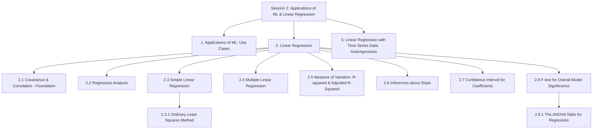
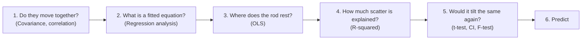
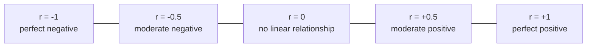
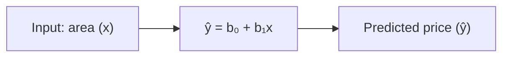
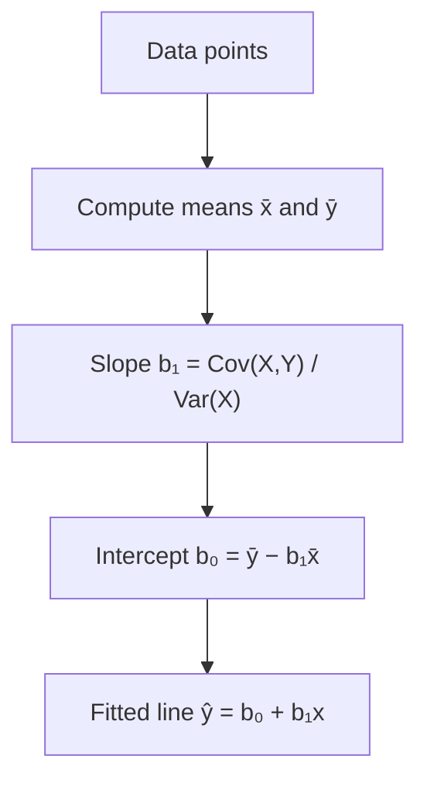
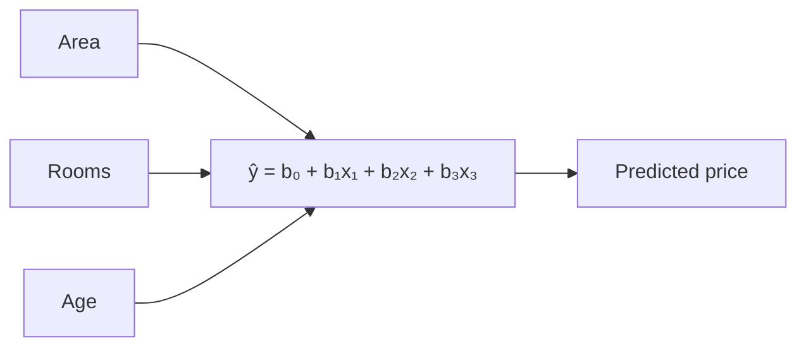
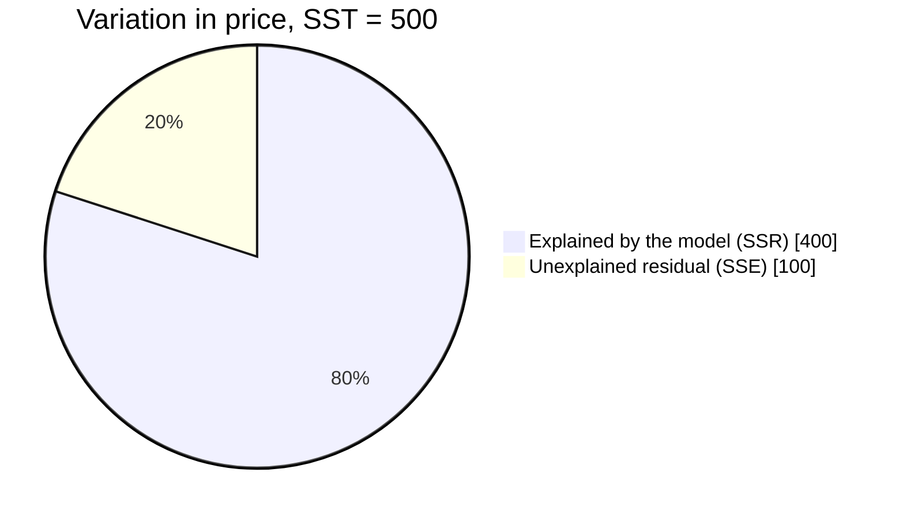
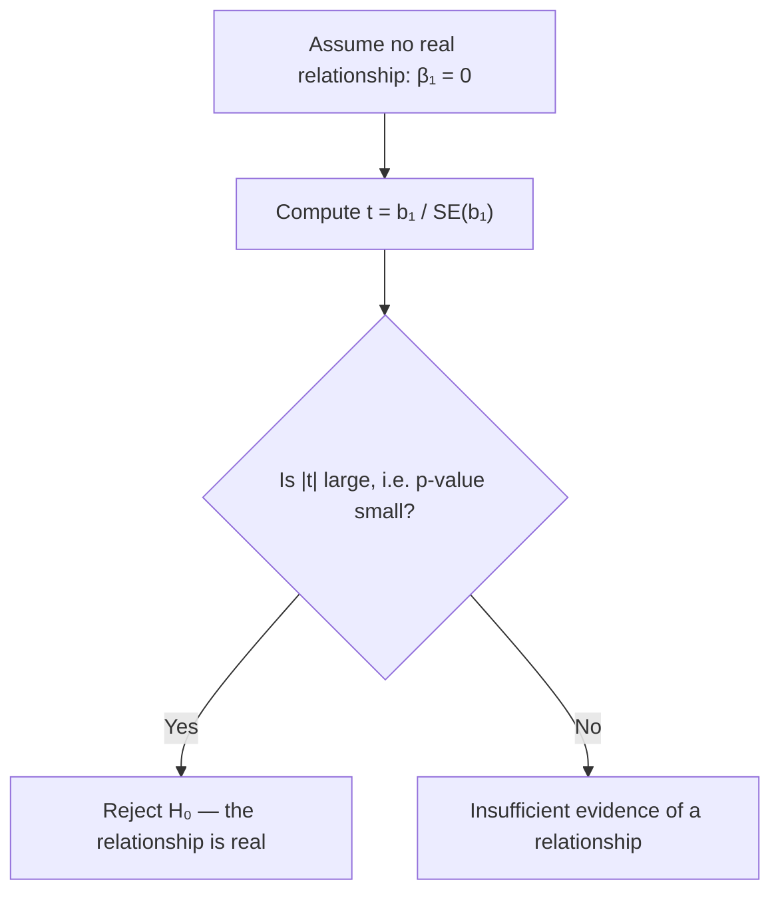
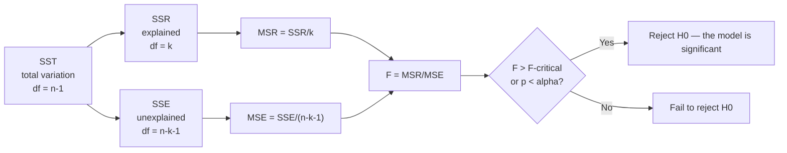
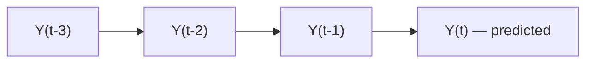

# Session 2: Applications of Machine Learning & Linear Regression

> Topic: Applications of Machine Learning & Linear Regression
> Date: Aug 3, 2026

## Concept Hierarchy

**Reordering note:** Inside "Linear Regression", _Covariance & Correlation_ was moved to the front (2.1) and _Regression Analysis_ placed immediately after it (2.2), because both are prerequisites for simple linear regression — the slope of the fitted line is literally built from covariance. _Ordinary Least Squares_ is nested under _Simple Linear Regression_ as 2.3.1, since it is the specific method that fits that line. No topic was dropped or merged; _Applications of Machine Learning_ and _Autoregression_ keep their original top-level positions.

**Running example used throughout:** the **house price prediction** case from Session 1 — first predicting price from area alone, then from area, rooms, age and locality together. Section 3 switches to a **monthly house price index for a city**, because predicting a value from its own history requires a genuinely time-ordered series, which a table of separate houses cannot provide.

**Analogy family used throughout Section 2:** a **board of pins with a rigid rod laid across them**. Each pin is one house. The rod is the fitted line. Every subsection asks one more question about that rod — do the pins trend at all, where exactly does the rod settle, how much of the scatter does it account for, and would it tilt the same way if you had used different pins.

---

## 1. Applications of Machine Learning: Use Cases

### Picture this

Walk into a hardware store and look at the tool wall. The wrenches are not sorted by whether plumbers, mechanics or cyclists use them — they are sorted by the shape of the nut they turn. A mechanic and a plumber reaching for the same 14 mm spanner is not a coincidence; it is the point. What decides the tool is the shape of the job, not the trade of the person holding it.

### Mapping

| Analogy element                       | What it really is                                  |
| ------------------------------------- | -------------------------------------------------- |
| A trade — plumber, mechanic, cyclist  | An industry or domain                              |
| The shape of the nut                  | The type of target variable                        |
| The spanner that fits it              | The machine learning technique                     |
| Two trades reaching for the same tool | The same technique solving very different problems |
| Picking a tool by trade instead       | Choosing a technique by industry — the mistake     |

### Meaning

A machine learning use case is a real-world problem restated as a learning task and solved with a trained model, and use cases are organised by the type of learning the target demands rather than by the industry the problem came from.

> **Formal definition:** A machine learning use case is a real-world problem formulated as a supervised, unsupervised, or reinforcement learning task and solved using a model trained on relevant data.

### Why it matters

Recognising the shape of a new problem — continuous target, categorical target, no target at all — tells you immediately which body of technique applies, before any algorithm is named. It is also the quickest way to sanity-check a proposal: a request to "classify" a price is a request that has already gone wrong.

### Example

| Domain         | Use case                                        | ML type                               | Target                             |
| -------------- | ----------------------------------------------- | ------------------------------------- | ---------------------------------- |
| Real estate    | Predicting a house's selling price              | Supervised — regression               | Continuous (price)                 |
| Email          | Spam versus not-spam detection                  | Supervised — classification           | Categorical (spam / not spam)      |
| Retail         | Grouping customers by buying behaviour          | Unsupervised — clustering             | No label                           |
| Finance        | Detecting fraudulent transactions               | Supervised — classification           | Categorical (fraud / not fraud)    |
| Robotics/games | An agent learning to play well                  | Reinforcement learning                | Reward signal                      |
| Weather/sales  | Forecasting next month's value from past values | Supervised — regression (time series) | Continuous — taken up in Section 3 |

**Important details** — Two rows on that table are the same technique wearing different clothes: predicting a house price and forecasting next month's sales are both regression, differing only in whether the predictors are separate features or the target's own history. Where the analogy breaks down: a spanner's fit is purely mechanical, whereas domain knowledge genuinely does change how a technique is applied — the same regression needs different features, and different error costs, in medicine than in retail.

### Core takeaway

Problems belong to techniques by the shape of their target, not by the industry they arrived from.

### Exam focus

A short recall question usually asks you to classify three or four given scenarios by ML type. Anchor every answer on the target: continuous, categorical, absent, or a reward.

---

## 2. Linear Regression

### Picture this

You are handed a wooden board studded with pins, one pin per house, positioned by area across and price up. Then you are handed a single straight rigid rod and told to lay it across the board so it represents the pins as well as a straight thing possibly can. Immediately, a series of questions arises. Do the pins even climb together, or are they scattered at random? Where exactly should the rod rest? How much of the pins' spread does the rod actually account for? And if someone swapped in a different handful of pins, would the rod still tilt the same way?

### Mapping

| Analogy element                         | What it really is                         |
| --------------------------------------- | ----------------------------------------- |
| One pin on the board                    | One observation, a (feature, target) pair |
| Position across the board               | The predictor $x$                         |
| Height of the pin                       | The target $y$                            |
| The rigid rod                           | The fitted regression line                |
| Where the rod crosses the left edge     | The intercept $b_0$                       |
| How steeply the rod tilts               | The slope $b_1$                           |
| Vertical gap between a pin and the rod  | A residual $e_i = y_i - \hat y_i$         |
| Swapping in a different handful of pins | Re-fitting on a different sample          |

### Meaning

Linear regression models the relationship between a continuous target and one or more predictors by fitting a straight-line equation to the observed data, then uses that equation both to explain the relationship and to predict new values.

> **Formal definition:** Linear regression is a supervised learning technique that models the relationship between a dependent variable and one or more independent variables by fitting a linear equation to observed data, used to explain that relationship and to predict values of the dependent variable.

### Why it matters

It is the simplest model that produces an actual equation rather than merely a score, which makes it the foundation on which almost everything later in this folder is built — assumptions, evaluation, feature engineering and regularisation are all defined relative to this one fitted line.

### How it works

Each subsection below is one of those six boxes, in that order.

### Core takeaway

Linear regression is the discipline of committing to the simplest possible shape — a straight line — and then measuring honestly how much that commitment cost.

### 2.1 Covariance & Correlation (Foundation)

#### Picture this

Two dials sit side by side on an old machine. You watch them for an hour. Sometimes when the left needle climbs, the right one climbs too; sometimes it drops instead; sometimes it does nothing recognisable. After an hour you can say two separate things: which way they tend to move together, and how tightly. The first is easy to see. The second is harder, because the left dial is calibrated in litres and the right in degrees, so the raw sizes of their swings cannot be compared until you put both on a common footing.

#### Mapping

| Analogy element                                   | What it really is                                      |
| ------------------------------------------------- | ------------------------------------------------------ |
| The left needle                                   | Variable $X$ (area)                                    |
| The right needle                                  | Variable $Y$ (price)                                   |
| A single moment's reading of both                 | One observation $(x_i, y_i)$                           |
| Each needle's distance from its own rest position | The deviation $x_i - \bar x$ or $y_i - \bar y$         |
| "They tend to climb together"                     | Positive covariance                                    |
| Litres versus degrees                             | The unit-dependence that makes covariance hard to read |
| Putting both on a common 0-to-10 footing          | Dividing by the standard deviations to get correlation |

#### Meaning

Covariance measures the direction in which two variables vary together, by averaging the product of their deviations from their own means; correlation rescales that same quantity by both standard deviations so the result always falls between $-1$ and $+1$ and can be compared across any pair of variables.

> **Formal definition:** Covariance is a measure of the joint variability of two random variables, indicating the direction of their linear association. The Pearson correlation coefficient is a normalized measure of the strength and direction of the linear relationship between two variables, defined as the ratio of their covariance to the product of their standard deviations, and bounded between $-1$ and $+1$.

#### Why it matters

Before laying the rod on the board at all, it is worth knowing whether the pins climb together. And more concretely: covariance is not merely a preliminary check, it is the numerator of the slope itself in 2.3.1 — the rod's tilt is covariance divided by the spread of $x$.

**Feel for the quantity** — For correlation $r$: a value near $+1$ means the pins sit almost exactly on a rising straight line, a value near $0$ means knowing $x$ tells you essentially nothing about $y$ in a straight-line sense, and a value near $-1$ means they sit almost exactly on a falling line.

**Formula (Covariance)** — **Essential**
$$Cov(X,Y) = \frac{\sum_{i=1}^{n}(x_i-\bar{x})(y_i-\bar{y})}{n-1}$$
**Where** — $x_i$: the value of $X$ for observation $i$ (a house's area); $y_i$: the value of $Y$ for the same observation (that house's price); $\bar x$: the mean of all $x$ values; $\bar y$: the mean of all $y$ values; $n$: the number of observations; $n-1$: the divisor used for a sample rather than a whole population.

**Formula (Pearson correlation coefficient)** — **Essential**
$$r = \frac{Cov(X,Y)}{\sigma_X \, \sigma_Y}$$
**Where** — $Cov(X,Y)$: the covariance defined immediately above; $\sigma_X$: the standard deviation of $X$, i.e. its typical spread about $\bar x$; $\sigma_Y$: the standard deviation of $Y$; $r$: the resulting correlation, always in $[-1, +1]$.

**Example** — Four houses, area in hundreds of sq. ft. $X = [10, 15, 20, 25]$ and price in lakh $Y = [40, 55, 65, 80]$. The means are $\bar x = 17.5$ and $\bar y = 60$. The deviation products sum to $325$, so $Cov(X,Y) = 325/3 \approx 108.3$. Dividing by the two standard deviations gives $r \approx 0.99$.

**Interpretation** — At $r \approx 0.99$ the four pins lie almost exactly on a rising straight line: area and price move together tightly and in the same direction.

**Important details** — A low $r$ rules out a _straight-line_ relationship only; a strong curved relationship can sit comfortably at $r \approx 0$. And correlation never establishes causation — the dials may both be driven by a third thing you never measured. Where the analogy breaks down: two needles on a machine usually are mechanically linked, whereas two correlated columns in a dataset frequently are not.

**Core takeaway** — Covariance says which way two variables lean together, and correlation is the same statement stripped of the units, which is the only form in which strength can be compared.

**Exam focus** — Both formulas, the bound $-1 \le r \le 1$, and the two standard cautions: a low $r$ does not rule out a curve, and a high $r$ does not establish cause.

### 2.2 Regression Analysis

#### Picture this

You have noticed that two colleagues always arrive at the office within minutes of each other. That is a genuinely useful observation, and it is also the limit of what it gives you: when one appears you expect the other soon. What it does not give you is a rule you could act on — if Ravi walks in at 9:05, exactly when should you start Priya's coffee? For that you need something stronger than "they arrive together". You need an equation.

#### Mapping

| Analogy element                       | What it really is                            |
| ------------------------------------- | -------------------------------------------- |
| "They always arrive together"         | A correlation                                |
| Ravi's arrival time                   | The independent variable                     |
| Priya's arrival time                  | The dependent variable                       |
| "9:05 means start the coffee at 9:12" | A fitted regression equation used to predict |
| The assumed shape of the rule         | The model form chosen — a line, a curve      |

#### Meaning

Regression analysis estimates an explicit equation linking a dependent variable to one or more independent variables, so that the relationship can be both described numerically and used to produce predictions for new inputs.

> **Formal definition:** Regression analysis is a set of statistical techniques for estimating the relationship between a dependent variable and one or more independent variables, used both to explain that relationship and to predict the value of the dependent variable.

#### Why it matters

Correlation stops at a description; regression produces a machine. That step from "these move together" to "given this, expect that" is what makes prediction possible at all.

**Important details** — The family is broad: linear regression assumes a straight line, polynomial regression a curve, logistic regression an S-shaped curve for a categorical target. This folder is concerned with the linear case, which means a straight line for one predictor (2.3) and a flat plane or hyperplane for several (2.4).

**Core takeaway** — Regression's contribution over correlation is the coefficients, because an equation is the only form of a relationship you can actually feed a new input into.

**Exam focus** — "Why is correlation not enough to predict?" is a standard 5-mark opener. The answer is one sentence — correlation yields a number, regression yields an equation — followed by an example.

### 2.3 Simple Linear Regression

**Meaning** — Simple linear regression lays a single straight rod across the board of pins using exactly one predictor, and reads predictions off that rod: a starting height plus a fixed rise for every step across.

> **Formal definition:** Simple linear regression is a statistical method that models the relationship between a single independent variable and a continuous dependent variable by fitting a straight-line equation to observed data.

**Why it matters** — It is the smallest complete regression model, and its two coefficients have such direct physical readings on the board — where the rod starts and how steeply it tilts — that every later extension is best understood as a modification of these two.

**Formula (Simple linear regression equation)** — **Essential**
$$\hat{y} = b_0 + b_1 x$$
**Where** — $\hat y$: the predicted value of the target for this observation (the height of the rod above this point); $x$: the value of the single predictor; $b_0$: the intercept, the predicted value when $x = 0$, i.e. where the rod crosses the left edge; $b_1$: the slope, the change in $\hat y$ for a one-unit increase in $x$, i.e. how steeply the rod tilts.

**Example** — With a fitted rod $\hat y = 5 + 3x$, a house of area $x = 20$ (2000 sq. ft.) gives $\hat y = 5 + 3(20) = 65$ lakh. The slope $b_1 = 3$ says every additional 100 sq. ft. adds roughly ₹3 lakh to the prediction.

**Important details** — Two things are assumed the moment you reach for a straight rod: that the true relationship really is close to straight, and that the vertical gaps left over — the **residuals** $e_i = y_i - \hat y_i$ — are small and show no systematic pattern. Session 3 is devoted entirely to checking exactly these.

**Core takeaway** — A fitted line is two numbers, a starting height and a tilt, and every prediction it will ever make is already contained in them.

**Exam focus** — Write the equation and define all four symbols; then be ready to read a given $b_1$ back into a sentence about the real world.

#### 2.3.1 Ordinary Least Squares (OLS)

##### Picture this

Extend the board. Attach a small spring from every pin straight down or straight up to the rod, so each spring is stretched by exactly the vertical gap between its pin and the rod. Now let go. The rod pivots and slides until the springs stop pulling it anywhere — and because a stretched spring stores energy in proportion to the _square_ of its stretch, the position it settles into is the one where the total of all those squared gaps is as small as it can be. Every other position you could have chosen has more energy in it, which is exactly why the rod refuses to stay there.

##### Mapping

| Analogy element                               | What it really is                                |
| --------------------------------------------- | ------------------------------------------------ |
| One spring                                    | One residual $e_i = y_i - \hat y_i$              |
| How far that spring is stretched              | The size of that residual                        |
| Energy stored in one spring                   | That residual squared                            |
| Total energy across all springs               | The sum of squared residuals — the cost function |
| Letting go and allowing the rod to settle     | Minimising that sum                              |
| The resting position                          | The OLS estimates $b_0$ and $b_1$                |
| A far-away pin with a hugely stretched spring | An outlier exerting disproportionate pull        |

##### Meaning

Ordinary Least Squares chooses the intercept and slope that make the sum of squared vertical distances between the observed points and the fitted line as small as possible.

> **Formal definition:** Ordinary Least Squares is an estimation method that determines the regression coefficients by minimizing the sum of squared differences between the observed and predicted values of the dependent variable.

##### Why it matters

Infinitely many rods can be laid across the same pins, so "best fit" is meaningless until a criterion is named. OLS names one, and for linear regression that criterion has a closed-form solution — the resting position can be calculated directly rather than searched for.

##### How it works

**Feel for the quantity** — The slope is a ratio. A large covariance relative to the spread of $x$ means the pins climb sharply and the rod tilts steeply; a covariance near zero relative to that spread means the rod comes to rest nearly flat, no matter how widely the pins are scattered vertically.

**Formula (OLS slope)** — **Essential**
$$b_1 = \frac{Cov(X,Y)}{Var(X)}$$
**Where** — $b_1$: the fitted slope; $Cov(X,Y)$: the covariance of predictor and target, from 2.1; $Var(X)$: the variance of the predictor alone, i.e. the average squared deviation of $x$ from $\bar x$, measuring how spread out the predictor is by itself.

**Formula (OLS intercept)** — **Essential**
$$b_0 = \bar{y} - b_1\bar{x}$$
**Where** — $b_0$: the fitted intercept; $\bar y$: the mean of the observed target values; $\bar x$: the mean of the observed predictor values; $b_1$: the slope just computed. This formula forces the fitted line to pass through the point $(\bar x, \bar y)$.

**Example** — Using the same four houses as 2.1: the deviation products sum to $325$ and the squared $x$-deviations sum to $125$, so $b_1 = 325/125 = 2.6$. Then $b_0 = 60 - 2.6(17.5) = 14.5$. The fitted line is $\hat y = 14.5 + 2.6x$.

**Interpretation** — Every extra 100 sq. ft. of area is associated with about ₹2.6 lakh more in price, and a hypothetical house of zero area would be priced at ₹14.5 lakh — a value which is arithmetically necessary but physically meaningless, and should be read as where the rod happens to cross the axis rather than as a real house.

**Important details** — Why squares, rather than plain distances? Two reasons, both visible in the springs. Squaring stops positive and negative gaps cancelling, so a rod balanced between wildly wrong pins is not mistaken for a good fit. And squaring makes a far-away pin pull far harder than a near one, which is desirable for suppressing many small errors but is also precisely why a single outlier can drag the whole rod — the sensitivity flagged back in Session 1's outlier section.

**Core takeaway** — The least-squares line is not chosen because it is fair to every point but because squared error is the one criterion that yields a unique, directly calculable resting position.

**Exam focus** — A very common 10-mark question: state the criterion, give both formulas, work the four-house example through, and explain why squared rather than absolute residuals are used.

### 2.4 Multiple Linear Regression

#### Picture this

The pins are no longer on a flat board. They float in the room — area running across, age running back into the depth, price running up. A rod is no longer enough to represent them; you need a flat sheet, tilted in two directions at once. Tilt it one way to follow area, the other way to follow age. Every further predictor tilts the sheet along one more direction you can no longer see, but the mechanism is unchanged.

#### Mapping

| Analogy element                               | What it really is                            |
| --------------------------------------------- | -------------------------------------------- |
| The sheet instead of the rod                  | The fitted hyperplane                        |
| Its tilt along the area direction             | The coefficient $b_1$                        |
| Its tilt along the age direction              | The coefficient $b_3$                        |
| Height of the sheet at the origin             | The intercept $b_0$                          |
| Tilting one way while holding the other fixed | "Holding all other predictors constant"      |
| Springs still pulling vertically              | Residuals, still measured on the target only |

#### Meaning

Multiple linear regression extends the same least-squares idea to two or more predictors at once, giving each predictor its own coefficient, read as that predictor's effect while all the others are held fixed.

> **Formal definition:** Multiple linear regression is an extension of simple linear regression that models the relationship between a dependent variable and two or more independent variables by fitting a linear equation to observed data.

#### Why it matters

Real targets almost never depend on one thing. Fitting price on area alone silently attributes to area whatever effect rooms and age were quietly having, which is why a single-predictor coefficient often changes once other predictors join the model.

**Formula (Multiple linear regression equation)** — **Essential**
$$\hat{y} = b_0 + b_1x_1 + b_2x_2 + \dots + b_kx_k$$
**Where** — $\hat y$: the predicted target value; $x_1, x_2, \dots, x_k$: the values of the $k$ predictors for this observation; $b_0$: the intercept, the prediction when every predictor is zero; $b_1, \dots, b_k$: one coefficient per predictor, each giving the change in $\hat y$ for a one-unit increase in that predictor while all others are held constant; $k$: the number of predictors.

**Example** — A fitted model $\hat y = 10 + 2.6x_1 + 4x_2 - 0.5x_3$ over area, rooms and age. For a house of area 20, with 3 rooms, aged 5 years: $\hat y = 10 + 52 + 12 - 2.5 = 71.5$ lakh.

**Interpretation** — The coefficient $b_3 = -0.5$ says each additional year of age is associated with about ₹0.5 lakh less in price _among houses of the same area and the same number of rooms_. Drop that qualifier and the sentence is simply false.

**Important details** — The coefficients are still found by minimising the same sum of squared residuals; only the arithmetic extends to matrix form, which is an implementation detail rather than a new idea. Where the analogy breaks down: a tilted sheet is easy to picture in three dimensions and impossible in eight, so beyond two predictors the geometry has to be trusted rather than seen — and one genuinely new failure mode appears with several predictors, when two of them tilt along nearly the same direction, which Session 3 diagnoses.

**Core takeaway** — Every coefficient in a multiple regression is a conditional statement, and reading one without its "holding the others constant" clause is the single most common misinterpretation in the whole subject.

**Exam focus** — Write the general equation, and be ready to interpret one given coefficient in a full sentence including the holding-constant clause.

### 2.5 Measure of Variation: R-squared & Adjusted R-Squared

#### Picture this

An unexpectedly large phone bill arrives. Before explaining anything you note how far above your usual bill it is — that gap is the whole thing to be accounted for. Then you start itemising: a roaming day, a long international call, a subscription. Each item accounts for part of the gap. Whatever remains after the itemising is the part you simply cannot explain. The useful question is not the size of the bill but what fraction of the gap you managed to name.

#### Mapping

| Analogy element                                    | What it really is                                    |
| -------------------------------------------------- | ---------------------------------------------------- |
| Your usual bill                                    | The mean of the target, $\bar y$                     |
| Total gap above the usual bill                     | Total sum of squares, $SST$                          |
| The part successfully itemised                     | Regression sum of squares, $SSR$                     |
| The part left unexplained                          | Error sum of squares, $SSE$                          |
| The fraction you managed to itemise                | $R^2$                                                |
| Padding the list with vague items to look thorough | Adding predictors that inflate $R^2$ without helping |
| A rule that discounts vague items                  | Adjusted $R^2$                                       |

#### Meaning

$R^2$ reports the proportion of the target's total variation that the fitted model accounts for, and Adjusted $R^2$ reports the same thing after charging a penalty for each predictor used, so that models with different numbers of predictors can be compared fairly.

> **Formal definition:** The coefficient of determination ($R^2$) is a statistical measure representing the proportion of variance in the dependent variable that is explained by the independent variable(s) in a regression model. Adjusted $R^2$ is a modified version of $R^2$ that adjusts for the number of predictors in the model, increasing only when a new predictor improves the fit by more than would be expected by chance.

#### Why it matters

The residual sum on its own is unreadable: is 100 large? It depends entirely on how much the target varied in the first place. Dividing by that total variation turns an unreadable number into a proportion that means the same thing on any dataset.

#### How it works

The three building blocks first — the itemisation of the bill.

**Formula (Total sum of squares, SST)** — **Essential**
$$SST = \sum_{i=1}^{n}(y_i - \bar y)^2$$
**Where** — $y_i$: the actual target value for observation $i$; $\bar y$: the mean of all actual target values; $n$: the number of observations; $SST$: the total variation in the target about its own mean, i.e. the whole gap to be accounted for.

**Formula (Regression sum of squares, SSR)** — **Essential**
$$SSR = \sum_{i=1}^{n}(\hat y_i - \bar y)^2$$
**Where** — $\hat y_i$: the model's predicted value for observation $i$; $\bar y$: the mean of the actual target values; $n$: the number of observations; $SSR$: the portion of the total variation that the model's predictions account for.

**Formula (Error sum of squares, SSE)** — **Essential**
$$SSE = \sum_{i=1}^{n}(y_i - \hat y_i)^2$$
**Where** — $y_i$: the actual value; $\hat y_i$: the predicted value; $n$: the number of observations; $SSE$: the leftover variation the model failed to account for. This is exactly the quantity OLS minimised in 2.3.1 — the total energy in the springs.

These three are linked by $SST = SSR + SSE$: the whole gap equals the itemised part plus the unexplained part.

**Example** — If $SST = 500$ and $SSE = 100$, then $SSR = 400$: of 500 units of total variation, the model accounts for 400 and leaves 100 unaccounted.

**Feel for the quantity** — For $R^2$: a value near 1 means the springs are barely stretched and the rod passes almost through the pins; a value near 0 means the rod explains no more than simply predicting the average price for every house; and a value of exactly 0 is what you would get from a perfectly flat rod at height $\bar y$.

**Formula (Coefficient of determination, R²)** — **Essential**
$$R^2 = 1 - \frac{SSE}{SST}$$
**Where** — $SSE$: the error sum of squares defined above, the unexplained variation; $SST$: the total sum of squares, the total variation; $R^2$: the resulting proportion of variation explained, normally between 0 and 1. Some texts write $SSE$ as $SS_{res}$ and $SST$ as $SS_{tot}$; these are the same quantities under different names.

**Example** — With $SST = 500$ and $SSE = 100$: $R^2 = 1 - 100/500 = 0.8$.

**Interpretation** — The model accounts for 80% of the variation in house price; the remaining 20% is driven by things the model does not contain.

**Formula (Adjusted R²)** — **Essential**
$$R^2_{adj} = 1 - \frac{(1-R^2)(n-1)}{n-k-1}$$
**Where** — $R^2$: the unadjusted coefficient of determination just computed; $n$: the number of observations; $k$: the number of predictors in the model; $n-k-1$: the residual degrees of freedom, which shrink as predictors are added and thereby create the penalty; $R^2_{adj}$: the adjusted value, which can decrease and can even go negative.

**Example** — With $R^2 = 0.8$, $n = 100$ and $k = 4$: $R^2_{adj} = 1 - \frac{(0.2)(99)}{95} \approx 0.792$.

**Interpretation** — Slightly below the raw 0.8, because four predictors were charged for. If a fifth predictor raised $R^2$ to 0.801 but dropped $R^2_{adj}$ to 0.790, that predictor bought less than it cost.

**Important details** — Plain $R^2$ can never decrease when a predictor is added, however useless that predictor is, because least squares can always assign it a coefficient of essentially zero and leave $SSE$ unchanged. That is why $R^2$ is safe for describing one model and unsafe for choosing between models of different sizes. Where the analogy breaks down: a phone bill's items are genuinely separate charges, whereas two correlated predictors can each appear to account for the same portion of the variation, which is a real complication taken up in Session 3.

**Core takeaway** — $R^2$ is a proportion rather than an amount, which is what makes it comparable across datasets and useless for comparing model sizes without the adjustment.

**Exam focus** — Know $SST = SSR + SSE$, both formulas, and the reason plain $R^2$ never falls. Computing $R^2_{adj}$ from given $R^2$, $n$ and $k$ is a standard numeric question.

### 2.6 Inferences about Slope

#### Picture this

You step on a bathroom scale that visibly jitters — stand still and the reading wanders by half a kilogram either way. Today it reads two kilograms below last month. Is that real? You cannot answer from the two kilograms alone. You need to know how much the scale jitters. Two kilograms against half a kilogram of jitter is convincing; two kilograms against three kilograms of jitter is nothing at all.

#### Mapping

| Analogy element                       | What it really is                       |
| ------------------------------------- | --------------------------------------- |
| Today's reading                       | The fitted slope $b_1$ from this sample |
| How much the scale jitters            | The standard error $SE(b_1)$            |
| The reading divided by the jitter     | The t-statistic                         |
| "It's just the scale wandering"       | The null hypothesis $H_0: \beta_1 = 0$  |
| Deciding the change is real           | Rejecting $H_0$                         |
| Your true weight, which you never see | The population slope $\beta_1$          |

#### Meaning

Inference about the slope asks whether the tilt observed in this particular sample is large enough, relative to how much that tilt would wobble across different samples, to conclude that the underlying relationship is real rather than an accident of which houses happened to be recorded.

> **Formal definition:** A hypothesis test for the regression slope evaluates whether the population slope coefficient is significantly different from zero (testing $H_0: \beta_1 = 0$ against $H_1: \beta_1 \neq 0$), thereby determining whether a statistically significant linear relationship exists between the independent and dependent variables.

#### Why it matters

The rod was laid across one handful of pins. A different handful would give a slightly different tilt. Without knowing the size of that wobble, a slope of 2.6 is just a number, and reporting it as a finding is a guess dressed as a result.

**Feel for the quantity** — For $t$: a large magnitude means the fitted slope is many jitter-widths away from zero and is very unlikely to be noise; a magnitude near zero means the slope sits comfortably within the range of wobble you would expect even if the true relationship were flat.

**Formula (t-statistic for a regression coefficient)** — **Exam-important**
$$t = \frac{b_1}{SE(b_1)}$$
**Where** — $b_1$: the fitted slope from OLS in 2.3.1; $SE(b_1)$: the standard error of that slope, i.e. the typical amount by which it would vary if the model were re-fitted on a fresh sample from the same population; $t$: the resulting test statistic, the slope measured in units of its own standard error.

**Example** — With $b_1 = 2.6$ and $SE(b_1) = 0.5$: $t = 5.2$.

**Interpretation** — The fitted slope sits more than five standard errors away from zero, which under the usual threshold of $p < 0.05$ is far into the region where a true slope of zero is implausible. Area is a statistically significant predictor of price.

**Important details** — The identical test, $t = b_j / SE(b_j)$, applies to every coefficient of a multiple regression, not only to a single-predictor model, and it is exactly the significance check that the feature selection methods in Session 4 are built on. Where the analogy breaks down: a bathroom scale's jitter is a property of the instrument, whereas $SE(b_1)$ depends on the sample size and the spread of the predictor, so it shrinks as you gather more data — a wobble you can reduce by working harder.

**Core takeaway** — A coefficient means nothing until it is compared against its own sampling wobble, because it is the ratio, not the coefficient, that carries the evidence.

**Exam focus** — State $H_0$ and $H_1$ explicitly, give the formula, and be able to read a supplied $t$ or p-value into a conclusion in one sentence.

### 2.7 Confidence Interval for Regression Coefficients

**Meaning** — A confidence interval takes the same jittering scale and reports a range rather than a verdict: instead of only answering whether the true slope differs from zero, it gives the band of slope values consistent with the data at a chosen confidence level.

> **Formal definition:** A confidence interval for a regression coefficient is a range of values, computed from the sample estimate and its standard error, that is expected to contain the true population coefficient with a specified level of confidence.

**Why it matters** — "Significant" is a yes-or-no summary that throws away magnitude. A slope that is significant but plausibly anywhere between 0.1 and 5.0 supports a very different business decision from one confined to 2.5 and 2.7, even though both pass the same test.

**Feel for the quantity** — A narrow interval means the estimate is precise, arising from a large sample or a small standard error; a wide interval means the data are consistent with a broad range of true slopes, so the point estimate should not be leaned on.

**Formula (Confidence interval for a regression coefficient)** — **Exam-important**
$$b_1 \pm t_{\alpha/2,\; df} \times SE(b_1)$$
**Where** — $b_1$: the fitted slope; $SE(b_1)$: its standard error, as in 2.6; $\alpha$: the significance level, so $\alpha = 0.05$ gives 95% confidence; $t_{\alpha/2,\,df}$: the critical value of the t-distribution at that level, with $df$ degrees of freedom; $df$: the residual degrees of freedom, $n-2$ for simple regression and $n-k-1$ for multiple regression with $k$ predictors.

**Example** — With $b_1 = 2.6$, $SE(b_1) = 0.4$ and $n = 30$, so $df = 28$, the critical value is $t_{0.025,28} \approx 2.048$. The interval is $2.6 \pm 2.048(0.4) = 2.6 \pm 0.82$, giving $(1.78,\; 3.42)$.

**Interpretation** — The data are consistent with a true price effect of anywhere between ₹1.78 and ₹3.42 lakh per 100 sq. ft., at 95% confidence. The interval excludes zero, which is the same conclusion the t-test reached — the two are two readings of one underlying calculation.

**Important details** — The identical construction applies to the intercept using $SE(b_0)$. An interval that excludes zero corresponds exactly to rejecting $H_0: \beta_1 = 0$ at the matching level, so the two tools never disagree.

**Core takeaway** — A confidence interval answers the question the significance test discards: not merely whether the effect exists, but how large it could reasonably be.

**Exam focus** — The equivalence between "the interval excludes zero" and "the t-test rejects $H_0$" is a common explain-the-link question.

### 2.8 F-test for Overall Model Significance

#### Picture this

A shop hires four salespeople at once and sales rise. Asking whether any particular one of them earned their keep is one question. Asking whether the hiring, taken as a single decision, did anything at all is a different question — and it has a different answer. The team can clearly be worth it while no individual member stands out from the noise.

#### Mapping

| Analogy element                           | What it really is                                  |
| ----------------------------------------- | -------------------------------------------------- |
| One salesperson's individual contribution | One coefficient, tested by a t-test (2.6)          |
| The hiring decision as a whole            | The model as a whole                               |
| "The hiring changed nothing"              | $H_0: \beta_1 = \beta_2 = \dots = \beta_k = 0$     |
| Extra sales attributable to the team      | Explained variation per predictor, $MSR$           |
| Ordinary week-to-week sales noise         | Unexplained variation per degree of freedom, $MSE$ |
| Signal compared against noise             | The F-statistic                                    |

**Meaning** — The F-test compares how much variation the model explains per predictor against how much variation is left unexplained per remaining degree of freedom, and asks whether that ratio is larger than chance alone would produce.

> **Formal definition:** The F-test for overall regression significance tests the null hypothesis that all population slope coefficients are simultaneously zero ($H_0: \beta_1 = \beta_2 = \dots = \beta_k = 0$) against the alternative that at least one is non-zero, using the ratio of explained to unexplained variance.

**Why it matters** — Running a separate t-test on each of many predictors and declaring victory on whichever passes is a way of manufacturing findings: test twenty unrelated predictors at the 5% level and roughly one will look significant by accident. The F-test asks the single global question first.

**Feel for the quantity** — For $F$: a value near 1 means the model explains no more per predictor than the leftover noise does per degree of freedom, which is exactly what a useless model produces; a value far above 1 means the explained share dwarfs the noise.

**Formula (F-statistic for overall significance)** — **Exam-important**
$$F = \frac{SSR/k}{SSE/(n-k-1)} = \frac{MSR}{MSE}$$
**Where** — $SSR$: the regression sum of squares from 2.5, the variation the model explains; $SSE$: the error sum of squares, the variation it does not; $k$: the number of predictors; $n$: the number of observations; $MSR = SSR/k$: the mean explained variation per predictor; $MSE = SSE/(n-k-1)$: the mean unexplained variation per residual degree of freedom; $F$: the ratio of the two.

**Example** — Reusing 2.5's figures, $SST = 500$ and $SSE = 100$ so $SSR = 400$, with $k = 4$ predictors and $n = 100$ observations: $MSR = 400/4 = 100$ and $MSE = 100/95 \approx 1.053$, giving $F \approx 95$.

**Interpretation** — An $F$ of about 95 is far above the critical value for these degrees of freedom, so $H_0$ is rejected: taken as a whole, the model explains substantially more variation in price than four unrelated predictors would produce by chance.

**Important details** — A significant F-test establishes only that _something_ in the model matters, never which thing; that is what the individual t-tests are for. The converse case is real too — a model can pass the F-test comfortably while several individual predictors fail their own t-tests, which typically happens when those predictors overlap heavily with one another.

**Core takeaway** — The F-test and the t-test answer questions at different scopes, and the whole-model question has to come first because individual tests multiply their own false alarms.

**Exam focus** — Know the formula, know $SST = SSR + SSE$, and be able to state the scope distinction in one sentence: F for the whole model, t for one coefficient.

#### 2.8.1 The ANOVA Table for Regression

**Picture this** — The shop's accountant is not content with "the hiring worked". She opens a ledger with fixed printed columns and writes the same story into them: one line for what the new team brought in, one line for ordinary trading noise, one line for the total, and against each line the headcount it was spread across. Anyone can now pick up the ledger, divide two numbers, and reach the same verdict she did — the format is what makes the conclusion checkable rather than merely asserted.

**Mapping**

| Analogy element                           | What it really is                                    |
| ----------------------------------------- | ---------------------------------------------------- |
| The ledger's fixed printed columns        | The standard columns of the ANOVA table              |
| The line for what the new team brought in | The Regression row, holding $SSR$                    |
| The line for ordinary trading noise       | The Error (residual) row, holding $SSE$              |
| The bottom total line                     | The Total row, holding $SST$                         |
| The headcount each line was spread across | The degrees of freedom column                        |
| Money per head on a line                  | The mean square, $SS$ divided by its own $df$        |
| The auditor dividing two of the numbers   | Forming $F = MSR/MSE$ and reaching the same decision |

**Meaning** — The ANOVA table for regression sets out the variation decomposition, its degrees of freedom, the resulting mean squares and the F-statistic in one fixed tabular layout, so that overall model significance can be read off — and independently rechecked — from a single block of numbers.

> **Formal definition:** The ANOVA (Analysis of Variance) table for regression is a standard tabular summary that partitions the total variation of the dependent variable into regression (explained) and error (unexplained) components, reporting for each the sum of squares, the degrees of freedom and the mean square, together with the resulting F-statistic and p-value used to test the overall significance of the model.

**Why it matters** — Every quantity from 2.5 and 2.8 already exists; the table adds no new mathematics. What it adds is a canonical arrangement — which is why statistical software prints it, why examiners ask for it, and why $R^2$, the residual variance and the F-test can all be recovered from the same six numbers without going back to the raw data.

**How it works**

The table itself, which is what an examiner expects to see drawn:

| Source of variation    | Sum of squares | Degrees of freedom | Mean square           | F                 |
| ---------------------- | -------------- | ------------------ | --------------------- | ----------------- |
| **Regression** (model) | $SSR$          | $k$                | $MSR = SSR / k$       | $F_0 = MSR / MSE$ |
| **Error** (residual)   | $SSE$          | $n - k - 1$        | $MSE = SSE / (n-k-1)$ |                   |
| **Total**              | $SST$          | $n - 1$            |                       |                   |

**Where** — $SSR$: the regression sum of squares from 2.5, the variation the fitted model explains; $SSE$: the error sum of squares, the variation left in the residuals; $SST$: the total sum of squares, the variation of $y$ about its own mean; $k$: the number of predictors in the model; $n$: the number of observations; $MSR$: the mean square for regression, explained variation per predictor; $MSE$: the mean square error, unexplained variation per residual degree of freedom; $F_0$: the computed test statistic, compared against a critical value from the F-distribution with $k$ and $n-k-1$ degrees of freedom.

Two internal checks confirm a correctly built table: the sums of squares add up, $SST = SSR + SSE$, and so do the degrees of freedom, $k + (n-k-1) = n-1$.

**Example** — Reusing the figures from 2.5 and 2.8 — $SST = 500$, $SSE = 100$, so $SSR = 400$, with $k = 4$ and $n = 100$:

| Source     | SS  | df  | MS                     | F                      |
| ---------- | --- | --- | ---------------------- | ---------------------- |
| Regression | 400 | 4   | $400/4 = 100$          | $100/1.053 \approx 95$ |
| Error      | 100 | 95  | $100/95 \approx 1.053$ |                        |
| Total      | 500 | 99  |                        |                        |

**Interpretation** — $F_0 \approx 95$ against a critical value of roughly 2.47 for $(4, 95)$ degrees of freedom at $\alpha = 0.05$, giving a p-value far below 0.05. The decision rule is stated either way and they always agree: reject $H_0$ if $F_0 > F_{\text{critical}}$, equivalently if $p < \alpha$. Here $H_0$ is rejected — at least one predictor carries real explanatory power.

**Important details** — **A naming clash worth guarding against in an exam.** Some texts label the regression row $RSS$ ("regression sum of squares") and the error row $ESS$ ("error sum of squares"); others use exactly the opposite convention, $RSS$ for "residual sum of squares" and $ESS$ for "explained sum of squares". The unambiguous move is to write $SSR$ and $SSE$, or to state in words which row you mean. Note also that $MSE$ here is the estimated variance of the residuals, so $\sqrt{MSE}$ is the residual standard error — the same quantity Session 3 reports as RMSE.

**Core takeaway** — The ANOVA table introduces no new statistics, only a fixed arrangement of existing ones, and that arrangement is what makes the significance verdict reproducible by anyone holding the table.

**Exam focus** — "Construct the ANOVA table for the given regression output" is a standard 5-mark question. Memorise the five column headings and, above all, the degrees-of-freedom column — $k$, $n-k-1$, $n-1$ — since that is where marks are most often lost. Always finish with the decision rule.

**Connection** — The six boxes of the workflow diagram are now complete: check the relationship, fit the rod, judge how much it explains, and trust-check both the individual tilts and the model as a whole. Section 3 keeps the same straight-line machinery but changes what goes into it, replacing separate features with the target's own history.

---

## 3. Linear Regression with Time Series Data: Autoregression

### Picture this

A heavy flywheel is spinning. Ask what speed it will be turning in one second and you do not need to know anything about the motor, the room or the operator — you need to know how fast it is turning right now, and perhaps how fast it was turning a moment before that. Its own recent past is the strongest available clue about its immediate future, because heavy things carry their state forward.

### Mapping

| Analogy element                           | What it really is                         |
| ----------------------------------------- | ----------------------------------------- |
| The flywheel's speed now                  | $Y_{t-1}$, the most recent observed value |
| Its speed a moment earlier                | $Y_{t-2}$, the second lag                 |
| The speed you are predicting              | $Y_t$, the current value being modelled   |
| How strongly it carries its speed forward | The coefficient $\phi_1$                  |
| How many past moments you look back over  | The order $p$                             |
| A random knock from outside               | The error term $\varepsilon_t$            |
| The wheel steadily accelerating all day   | A trend, i.e. non-stationarity            |

### Meaning

Autoregression predicts a time-ordered variable from its own previous values rather than from separate features, fitting a linear equation whose predictors are lagged copies of the target itself.

> **Formal definition:** An autoregressive model of order $p$, denoted AR($p$), represents a time series as a linear function of its own $p$ previous values plus a stochastic error term.

### Why it matters

Plenty of real series arrive with no separate predictors at all — a price index, a temperature record, a stock price. There is nothing to regress on except the series' own history, and for anything with momentum that history is a genuinely strong predictor.

**Formula (Autoregressive model of order p)** — **Exam-important**
$$Y_t = c + \phi_1 Y_{t-1} + \phi_2 Y_{t-2} + \dots + \phi_p Y_{t-p} + \varepsilon_t$$
**Where** — $Y_t$: the value of the series at the current time step, the quantity being predicted; $Y_{t-1}, \dots, Y_{t-p}$: the $p$ preceding values, called lags; $\phi_1, \dots, \phi_p$: the coefficients giving each lag's influence on the current value; $p$: the order, i.e. how many past values are used; $c$: the constant term, playing the role of the intercept; $\varepsilon_t$: the random error at time $t$, the part not explained by the lags.

**Example** — An AR(1) model for a monthly house price index: $Y_t = 5 + 0.9\,Y_{t-1}$. If last month's index stood at 200, the prediction is $\hat Y_t = 5 + 0.9(200) = 185$.

**Interpretation** — A coefficient of 0.9 means the series carries almost all of last month's level into this month, with a small pull back towards the constant — the flywheel losing a little speed but mostly persisting.

**Important details** — Two things must be decided or checked. The order $p$ is chosen from the data, typically by examining how strongly $Y_t$ correlates with $Y_{t-k}$ across a range of lags. And the series is assumed **stationary**, meaning its mean and variance do not drift over time; a steadily rising series violates this and is usually differenced — modelling the change from one step to the next rather than the level — before an AR model is fitted. Where the analogy breaks down: a flywheel's persistence comes from physical inertia, whereas a price index's persistence is a statistical regularity that can break the moment the underlying market changes.

### Core takeaway

Autoregression is ordinary regression with the predictor column filled in from the target's own past, which is why everything about fitting it is familiar and everything about _when it is allowed_ is not.

### Exam focus

Know the AR($p$) equation with every symbol, and the stationarity assumption. The standard comparison question — how autoregression differs from multiple regression — is answered by what fills the predictor columns.

---

## Examination Preparation

### Must understand

- Why covariance must be understood before the regression slope, since the slope is built from it (Section 2.1 into 2.3.1).
- How Ordinary Least Squares selects $b_0$ and $b_1$, and why squared rather than absolute residuals (Section 2.3.1).
- Why plain $R^2$ cannot fall when a predictor is added, and how Adjusted $R^2$ corrects for this (Section 2.5).
- Why a coefficient must be judged against its own standard error before it can be believed (Section 2.6).
- Why the F-test's whole-model question is not answered by any collection of individual t-tests (Section 2.8).
- How autoregression differs from ordinary multiple regression (Section 3).

### Must remember

- Covariance and correlation — see the formal definition in Section 2.1; $-1 \le r \le 1$.
- Simple linear regression equation $\hat y = b_0 + b_1x$ (2.3), and the OLS slope and intercept formulas (2.3.1).
- Multiple regression equation $\hat y = b_0 + b_1x_1 + \dots + b_kx_k$, every coefficient read as conditional on the others (2.4).
- $SST = SSR + SSE$, and the three individual formulas (2.5).
- $R^2 = 1 - SSE/SST$ and $R^2_{adj} = 1 - \frac{(1-R^2)(n-1)}{n-k-1}$ (2.5).
- Slope test: $H_0: \beta_1 = 0$ against $H_1: \beta_1 \neq 0$, with $t = b_1/SE(b_1)$ (2.6).
- Coefficient confidence interval: $b_1 \pm t_{\alpha/2,df} \times SE(b_1)$ (2.7).
- F-test: $F = \frac{SSR/k}{SSE/(n-k-1)}$, testing $H_0: \beta_1 = \dots = \beta_k = 0$ (2.8).
- AR($p$): $Y_t = c + \phi_1Y_{t-1} + \dots + \phi_pY_{t-p} + \varepsilon_t$, with the stationarity assumption (Section 3).

### Common question patterns

- _2-mark:_ Define regression analysis, correlation, $R^2$, autoregression, or the F-test.
- _5-mark:_ Simple versus multiple linear regression; $R^2$ versus Adjusted $R^2$; why OLS minimises squared rather than absolute residuals; autoregression versus multiple regression; the t-test versus the F-test.
- _10-mark:_ Explain the Ordinary Least Squares method with a worked numeric example; explain the complete linear regression workflow from correlation through to inference, including confidence intervals and the F-test.

### Answer-writing guidance

- _2-mark:_ the formal definition stated precisely, plus one supporting point or example.
- _5-mark:_ formal definition, main explanation, key points, and one example, formula or small diagram.
- _10-mark:_ introduction, formal technical definition, Mermaid diagram or workflow, detailed explanation, worked example, advantages and limitations, conclusion.

### Model answers

_2-mark:_ "The coefficient of determination, $R^2$, is a statistical measure representing the proportion of variance in the dependent variable that is explained by the independent variables in a regression model, calculated as $R^2 = 1 - SSE/SST$. For example, an $R^2$ of 0.8 indicates that the model accounts for 80% of the total variation in house prices."

_5-mark:_ "Simple linear regression models a continuous dependent variable using exactly one independent variable, with the equation $\hat y = b_0 + b_1x$. Multiple linear regression extends this to two or more independent variables, $\hat y = b_0 + b_1x_1 + \dots + b_kx_k$. The distinction is not merely the count of predictors but the interpretation of each coefficient. In simple regression, $b_1$ gives the change in the target for a one-unit change in the single predictor. In multiple regression, each $b_i$ gives that predictor's effect while all other predictors are held constant, since several variables influence the target simultaneously — a house's price depends jointly on area, number of rooms and age, so the effect attributed to area alone in a simple regression will generally absorb part of the effect of the others. Both are estimated by the same Ordinary Least Squares principle of minimising the sum of squared residuals, with multiple regression requiring the matrix form of the solution. Multiple regression is appropriate whenever more than one feature genuinely affects the target, which is the usual case in real data."

_10-mark:_ "Introduction: Fitting a regression line requires a precise and mathematically justified criterion for choosing its coefficients, which is the role of the Ordinary Least Squares method. Definition: Ordinary Least Squares is an estimation method that determines the regression coefficients by minimising the sum of squared differences between observed and predicted values of the dependent variable. Diagram: reproduce the OLS flowchart from Section 2.3.1 — data, then means, then slope, then intercept, then fitted line. Detailed explanation: for simple linear regression the slope is $b_1 = Cov(X,Y)/Var(X)$ and the intercept is $b_0 = \bar y - b_1\bar x$, the latter forcing the fitted line through the point of means. Residuals are squared before summing for two reasons: squaring prevents positive and negative errors from cancelling, so that a line balanced between two badly fitted points is not mistaken for a good fit, and squaring weights large errors disproportionately, which is why least squares rather than least absolute deviation is the standard criterion. Worked example: for four houses with $X = [10,15,20,25]$ and $Y = [40,55,65,80]$, the means are $\bar x = 17.5$ and $\bar y = 60$; the deviation products sum to 325 and the squared $x$-deviations to 125, giving $b_1 = 325/125 = 2.6$ and $b_0 = 60 - 2.6(17.5) = 14.5$, so the fitted line is $\hat y = 14.5 + 2.6x$. Advantages: the criterion has a closed-form solution for linear regression, is computationally cheap, and yields directly interpretable coefficients. Limitations: because errors are squared, OLS is sensitive to outliers, a single extreme observation exerting disproportionate influence on the fit; and it assumes the underlying relationship is genuinely linear. Conclusion: Ordinary Least Squares is the estimation method underlying both simple and multiple linear regression, and its criterion must be understood before model evaluation using $R^2$ and inference on the coefficients can be interpreted correctly."

## Practice Questions

### Basic recall

1. State the formula for Pearson's correlation coefficient and its bounds.
   **Answer:** $r = Cov(X,Y)/(\sigma_X\sigma_Y)$, always in $[-1, +1]$ (Section 2.1).
2. Write the simple linear regression equation and define each symbol.
   **Answer:** $\hat y = b_0 + b_1x$, where $\hat y$ is the predicted target, $x$ the single predictor, $b_0$ the intercept and $b_1$ the slope (Section 2.3).
3. What quantity does Ordinary Least Squares minimise?
   **Answer:** The sum of squared residuals, $\sum_i (y_i - \hat y_i)^2$ (Section 2.3.1).
4. Write the formula for $R^2$.
   **Answer:** $R^2 = 1 - SSE/SST$ (Section 2.5).
5. Write the relationship between SST, SSR and SSE.
   **Answer:** $SST = SSR + SSE$ (Section 2.5).
6. Write the formula for a 95% confidence interval on a regression slope in simple regression.
   **Answer:** $b_1 \pm t_{0.025,\,n-2} \times SE(b_1)$ (Section 2.7).
7. Write the F-statistic for overall model significance.
   **Answer:** $F = \frac{SSR/k}{SSE/(n-k-1)}$ (Section 2.8).
8. Write the general AR($p$) equation.
   **Answer:** $Y_t = c + \phi_1Y_{t-1} + \dots + \phi_pY_{t-p} + \varepsilon_t$ (Section 3).

### Conceptual

1. Why is correlation insufficient for prediction where regression is not?
   **Answer:** Correlation produces a single number describing strength and direction; regression estimates the coefficients of an equation, and only an equation can take a new input and return a value (Sections 2.1–2.2).
2. Why does OLS square the residuals rather than summing them directly?
   **Answer:** Summing signed residuals lets positive and negative errors cancel, so a badly balanced line could score well; squaring makes every error positive and penalises large errors disproportionately (Section 2.3.1).
3. Why does plain $R^2$ never decrease when a predictor is added, even a useless one?
   **Answer:** Least squares can assign the new predictor a coefficient of essentially zero, which leaves $SSE$ unchanged at worst, and $R^2 = 1 - SSE/SST$ therefore cannot fall (Section 2.5).
4. Why must a fitted slope be divided by its standard error before it can be interpreted as evidence?
   **Answer:** The slope came from one sample and would differ on another; only its size relative to that sampling variability indicates whether the underlying relationship is real (Section 2.6).
5. Why is each coefficient of a multiple regression interpreted "holding the other predictors constant"?
   **Answer:** Several predictors act on the target at once, so each coefficient isolates one predictor's effect on the assumption that the others do not move (Section 2.4).
6. How does the F-test differ in scope from the t-test on a coefficient?
   **Answer:** The t-test asks whether one specific coefficient differs from zero; the F-test asks whether all coefficients are simultaneously zero, i.e. whether the model as a whole explains anything. A model can pass the F-test while individual predictors fail their t-tests (Sections 2.6 and 2.8).
7. Why must a time series be approximately stationary before an autoregressive model is fitted?
   **Answer:** The model assumes the series' mean and variance do not drift; a trending series violates this and normally requires differencing first (Section 3).

### Comparison

1. Compare simple and multiple linear regression.
   **Answer:** Simple regression uses one predictor, $\hat y = b_0 + b_1x$; multiple regression uses two or more, $\hat y = b_0 + b_1x_1 + \dots + b_kx_k$, with every coefficient read as conditional on the others being held constant (Sections 2.3–2.4).
2. Compare $R^2$ and Adjusted $R^2$.
   **Answer:** $R^2$ never falls when predictors are added, even useless ones; Adjusted $R^2$ charges a penalty per predictor and can fall, which makes it the safe choice for comparing models of different sizes (Section 2.5).
3. Compare multiple linear regression and autoregression.
   **Answer:** Multiple regression predicts from separate measured features; autoregression predicts from lagged values of the target itself, and additionally requires stationarity (Sections 2.4 and 3).

### Scenario / application

1. A retailer wants to predict monthly sales purely from the past three months' sales figures. Which technique applies, and why?
   **Answer:** An AR(3) autoregression (Section 3), because the predictors are the series' own lagged values $Y_{t-1}, Y_{t-2}, Y_{t-3}$ rather than separate features. The series should be checked for stationarity first.
2. A model with 2 predictors gives $R^2 = 0.75$; adding a third raises $R^2$ to 0.76 but lowers Adjusted $R^2$ to 0.74. What does this mean, and which model is better?
   **Answer:** The third predictor improved the fit by less than the penalty it incurred, so it is not earning its place. The two-predictor model is preferable (Section 2.5).
3. A fitted simple regression gives $b_1 = 0.8$ with $p < 0.01$. What does this establish?
   **Answer:** A true slope of zero is very unlikely given this data, so $H_0: \beta_1 = 0$ is rejected and the predictor has a statistically significant linear relationship with the target (Section 2.6). It says nothing about the size of the effect being practically important — a confidence interval (Section 2.7) would address that.

### Long-answer

1. Explain the complete process of fitting and evaluating a simple linear regression model, from correlation through to slope inference, with a worked example.
   **Answer:** See Sections 2.1, 2.3, 2.3.1, 2.5 and 2.6 in order, and the 10-mark model answer in Examination Preparation.
2. Explain how autoregression adapts the linear regression idea to time series data, including its formula and its key assumption.
   **Answer:** See Section 3 — the target's own lagged values replace separate predictors, fitted by the same least-squares principle, under the assumption of stationarity.

## Quick Revision

- **One-sentence summary:** Linear regression settles a straight line into a cloud of points by minimising squared vertical error, then measures how much of the scatter that line explains and how much its tilt can be trusted — and the same machinery, fed the target's own past, becomes autoregression.
- **Hierarchy:** see the Concept Hierarchy diagram at the top of this file.
- **Essential definitions:** covariance and correlation (2.1), regression analysis (2.2), simple linear regression (2.3), OLS (2.3.1), multiple linear regression (2.4), the sums of squares and $R^2$ (2.5), slope inference (2.6), confidence intervals (2.7), the F-test (2.8), autoregression (Section 3).
- **Key formulas:** covariance and correlation (2.1); OLS slope and intercept (2.3.1); SST, SSR, SSE, $R^2$, Adjusted $R^2$ (2.5); the t-statistic (2.6); the confidence interval (2.7); the F-statistic (2.8); the ANOVA table layout and its degrees of freedom (2.8.1); the AR($p$) equation (Section 3).
- **Most important comparison:** $R^2$ versus Adjusted $R^2$ (2.5), because it governs whether model comparison is valid at all.
- **5 exam keywords:** covariance, Ordinary Least Squares, residual, Adjusted R-squared, stationarity.
- **5 common mistakes:** reading covariance's raw magnitude as a strength; treating a higher $R^2$ as a better model regardless of predictor count; stating that OLS minimises absolute rather than squared residuals; dropping the holding-constant clause from a multiple-regression coefficient; fitting an autoregression to a trending series without differencing.

### Mental Models

- **1. Use cases** — a hardware store's tool wall; problems belong to techniques by the shape of the target, not the industry they came from.
- **2. Linear regression** — a rigid rod laid across a board of pins; the discipline is committing to the simplest shape and then measuring what that cost.
- **2.1 Covariance and correlation** — two dials in litres and degrees; strength can only be compared once the units are stripped out.
- **2.2 Regression analysis** — knowing two colleagues arrive together versus knowing when to start the coffee; the coefficients are the whole contribution.
- **2.3.1 OLS** — springs pulling the rod until they stop; squared error is the criterion that yields a unique calculable resting position.
- **2.4 Multiple regression** — a tilted sheet instead of a rod; every coefficient is a conditional statement.
- **2.5 R-squared** — itemising an unexpectedly large phone bill; a proportion travels across datasets in a way an amount never can.
- **2.6 Slope inference** — a bathroom scale that jitters; the evidence lives in the ratio, not the reading.
- **2.7 Confidence interval** — quoting a range instead of a verdict; it answers the magnitude question the test discards.
- **2.8 F-test** — hiring four salespeople at once; the whole-model question must come first because individual tests multiply false alarms.
- **2.8.1 ANOVA table** — the accountant's fixed-column ledger; the layout is what makes the verdict recheckable by anyone.
- **3. Autoregression** — a heavy flywheel carrying its speed forward; ordinary regression with the predictor column filled from the target's own past.

## Topic Coverage

- Applications of Machine Learning: Use Cases — Covered in Section 1 (source: `02-linear-regression.md`, Session 2)
- Visiting basics: Covariance & Correlation — Covered in Section 2.1 (source: `02-linear-regression.md`, Session 2)
- Regression Analysis — Covered in Section 2.2 (source: `02-linear-regression.md`, Session 2)
- Simple Linear Regression — Covered in Section 2.3 (source: `02-linear-regression.md`, Session 2)
- Ordinary Least Square Method — Covered in Section 2.3.1 (source: `02-linear-regression.md`, Session 2)
- Multiple Linear Regression — Covered in Section 2.4 (source: `02-linear-regression.md`, Session 2)
- Measure of Variation: R-squared & Adjusted R-Squared — Covered in Section 2.5 (source: `02-linear-regression.md`, Session 2)
- SST, SSR, SSE (sum of squares decomposition) — Covered in Section 2.5 (source: `02-linear-regression.md`, Session 2)
- Inferences about slope — Covered in Section 2.6 (source: `02-linear-regression.md`, Session 2)
- Confidence Interval for Coefficients — Covered in Section 2.7 (source: `02-linear-regression.md`, Session 2)
- F-test for Overall Model Significance — Covered in Section 2.8 (source: `02-linear-regression.md`, Session 2)
- ANOVA table for regression (RSS/ESS/TSS, F-ratio, p-value) — Covered in Section 2.8.1 (source: `Session_1 - Linear Regression.pdf`, ANOVA Table and Model Significance; added after the knowledge-map audit)
- Linear Regression with Time Series Data: Autoregression — Covered in Section 3 (source: `02-linear-regression.md`, Session 2)

### Gaps to Look Up

- **Standard error of a coefficient, $SE(b_1)$** — used as the denominator of the t-statistic in 2.6 and inside the confidence interval in 2.7, but its own formula is never given in the material. Needed to compute either quantity from raw data rather than from a supplied value.
- **The t-distribution and p-values** — the critical value $t_{\alpha/2,df}$ and the "$p < 0.05$" threshold are used in 2.6 and 2.7 without the distribution itself being introduced. Needed to look up a critical value or to interpret a p-value from first principles.
- **The F-distribution** — 2.8 compares the computed $F$ against a critical value from this distribution, which the material never describes.
- **Variance** — used in the OLS slope formula in 2.3.1 and assumed known from prior statistics study.
- **Choosing the AR order $p$** — Section 3 states that $p$ is selected by examining correlations across lags, but the tool for doing so (the autocorrelation function) is named only obliquely and never explained.
