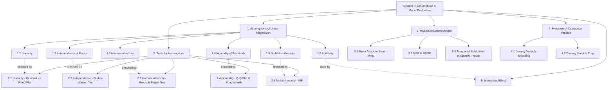
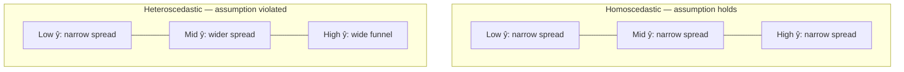
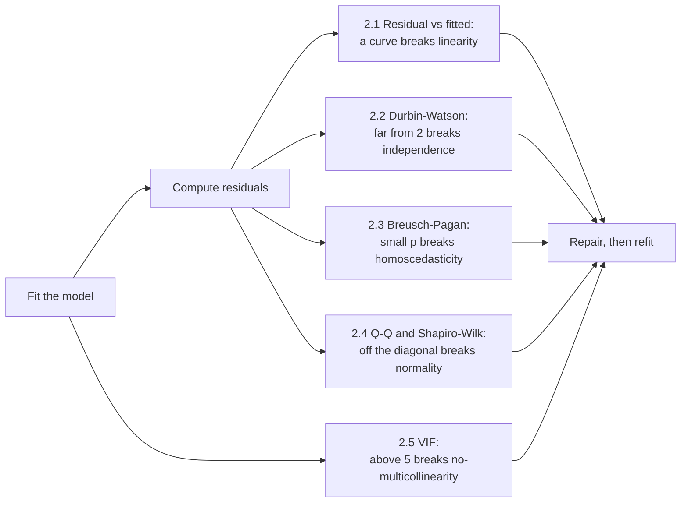
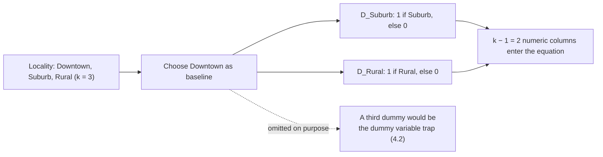

# Session 3: Assumptions of Linear Regression and Model Evaluation

> Topic: Assumptions of Linear Regression and Model Evaluation
> Date: Aug 3, 2026

## Concept Hierarchy

**Reordering note:** The five supplied topics keep their original order, but Sections 1 and 2 are aligned so that each test appears in the same position as the assumption it checks (1.1↔2.1, 1.2↔2.2, and so on), which makes each test's purpose obvious before it is described. **R-squared and Adjusted R-squared** (3.3) is required by the "model evaluation metrics" topic but was fully derived in Session 2, so it is placed here for comparison rather than re-explained. A sixth assumption, **Additivity** (1.6), completes Section 1 to the standard six; it deliberately has no numbered test in Section 2, because its violation is exactly what the pre-existing Interaction Effect topic (Section 5) diagnoses and repairs. No topic was dropped or merged.

**Running example used throughout:** the **house price prediction** case from Sessions 1 and 2 — price predicted from area, rooms and age, now joined by a categorical feature, **locality** (Downtown / Suburb / Rural), which drives Sections 4 and 5.

**Analogy families used in this session:** Section 1 runs on the **fine print of a guarantee** — the appliance still works when you break a clause, but the guarantee is void. Sections 1.6 and 5 share a **two taps filling a bath** image, because interaction is precisely the repair for a broken additivity clause. Section 3 uses **two examiners marking the same exam paper**.

---

## 1. Assumptions of Linear Regression

### Picture this

You buy an appliance with a two-year guarantee. On the back of the card, in small print, are the conditions: use the correct voltage, do not open the casing, do not run it outdoors. Break one of those and something interesting happens — the appliance does not stop working. It hums along exactly as before. What you have lost is invisible: the promise that if it goes wrong, anyone will stand behind it.

### Mapping

| Analogy element                        | What it really is                                                 |
| -------------------------------------- | ----------------------------------------------------------------- |
| The appliance                          | The fitted regression line                                        |
| It still runs after you break a clause | OLS still returns coefficients, whatever the data looks like      |
| The clauses in the small print         | The six assumptions                                               |
| The guarantee itself                   | Unbiased coefficients and valid standard errors, tests, intervals |
| Voiding the guarantee silently         | Producing confident numbers that are quietly wrong                |
| The inspection you would need to claim | The diagnostic tests of Section 2                                 |

### Meaning

The assumptions of linear regression are the conditions the data and its residuals must satisfy for the coefficients produced by Ordinary Least Squares, and the significance tests built on them, to be trustworthy rather than merely computable.

> **Formal definition:** The assumptions of linear regression are the set of conditions — linearity, independence of errors, homoscedasticity, normality of residuals, no multicollinearity, and additivity — that must hold for Ordinary Least Squares coefficient estimates and their significance tests to be valid.

### Why it matters

Least squares will settle a line into any cloud of points whatsoever. Nothing about the fitting procedure objects to nonsense, and no error is raised. The assumptions are the only place where the question "should I believe this line?" is asked at all.

### Core takeaway

An assumption is not a requirement for the model to run but a condition for its output to mean anything, which is exactly why violations are so easy to miss.

### 1.1 Linearity

#### Picture this

Lay a steel ruler along the edge of a slightly curved plank. Press it down in the middle and both ends lift off. Slide it to sit flush at the ends and it bows away in the middle. There is no position at all where a straight thing lies flush against a curved one — the gaps only move around.

#### Mapping

| Analogy element                             | What it really is                                  |
| ------------------------------------------- | -------------------------------------------------- |
| The curved plank                            | The true relationship between predictor and target |
| The straight steel ruler                    | The fitted linear model                            |
| The gaps between ruler and plank            | The residuals                                      |
| Gaps that move but never vanish             | Systematic, patterned residuals                    |
| The characteristic middle-then-ends pattern | The U-shape in a residual-vs-fitted plot           |

**Meaning** — The linearity assumption requires the expected value of the target to be a straight-line function of the predictors, so that a straight fit can in principle sit flush against the relationship rather than merely balanced across it.

> **Formal definition:** The linearity assumption states that the expected value of the dependent variable is a linear function of the independent variable(s).

**Why it matters** — When the true relationship curves, no fitted line is right anywhere; it over-predicts in some ranges and under-predicts in others by construction. Least squares will still minimise total squared error, which simply means it distributes the wrongness rather than removing it.

**Example** — Suppose house prices rise steeply with area up to 2000 sq. ft. and then flatten off, as very large houses hit the ceiling of what buyers will pay. A single straight fit across the whole range will over-predict small houses and under-predict mid-sized ones, no matter how the line is positioned.

**Important details** — The violation shows up as a curved band in the residual-vs-fitted plot rather than as a random scatter. The usual repairs are to add a polynomial term such as $x^2$, or to transform the variable, for instance using $\log(\text{area})$ — both covered in Session 4. Where the analogy breaks down: a plank's curvature is visible from the side, whereas a curved relationship in eight predictors can only be seen through its residuals.

**Core takeaway** — A straight model fitted to a curved truth does not fail loudly; it distributes its error into a pattern, which is why the pattern is what you look for.

**Exam focus** — Define it precisely and give one plausible real-world case where it fails. Diminishing returns is the standard example.

### 1.2 Independence of Errors

#### Picture this

You are measuring something in a hall with a loud echo. Each time you call out a reading, the echo of the previous one is still hanging in the air and colours what you hear next. You take ten readings and write down ten numbers — but you did not gather ten independent pieces of evidence. You gathered one, repeated, with the echo carrying part of each mistake into the next.

#### Mapping

| Analogy element                         | What it really is                                      |
| --------------------------------------- | ------------------------------------------------------ |
| One reading                             | One observation's residual $e_i$                       |
| The echo carrying into the next reading | Correlation between consecutive residuals              |
| Ten numbers written down                | The nominal sample size                                |
| Far fewer than ten independent facts    | The effective information actually present             |
| Believing you have ten                  | Under-estimated standard errors and false significance |

**Meaning** — The independence assumption requires that one observation's residual carries no information about any other's, so that each row contributes genuinely fresh evidence about the relationship.

> **Formal definition:** The independence-of-errors assumption states that the residuals of a regression model are uncorrelated with each other.

**Why it matters** — Standard errors are computed on the belief that every row is a new fact. When residuals echo one another, the model has less information than the row count implies, the standard error from Session 2 comes out too small, and every t-test built on it overstates its confidence — you conclude a predictor matters when the evidence never supported it.

**Example** — This most often bites time-ordered data. If the model systematically under-predicts during a hot stretch of the market, one month's positive error is followed by another positive error, and another. Errors like this are not independent, and this is exactly the situation where an autoregressive model, which explicitly represents the link between successive values, is the more honest choice than plain regression.

**Important details** — The violation is called **autocorrelation** and is tested with the Durbin-Watson statistic in 2.2. It also arises outside time: houses on the same street share unmeasured neighbourhood effects, so their errors correlate spatially. Where the analogy breaks down: an echo decays predictably with distance, whereas real autocorrelation can persist, cycle seasonally, or alternate in sign.

**Core takeaway** — Correlated errors do not bias the line, they inflate your confidence in it, because they let the same information be counted several times.

**Exam focus** — Know the word autocorrelation, that it threatens time-ordered and spatially grouped data, and that its consequence is invalid inference rather than a wrong line.

### 1.3 Homoscedasticity

#### Picture this

Hold a garden hose loosely and watch where the water lands. Close to the nozzle the spray is tight, a narrow patch you could cover with a hand. Further out it fans into a wide, ragged cone. The water is still going in the same direction throughout — only the scatter grows.

#### Mapping

| Analogy element            | What it really is                                 |
| -------------------------- | ------------------------------------------------- |
| The direction of the spray | The fitted relationship, still correct on average |
| The width of the wet patch | The variance of the residuals                     |
| A constant width all along | Homoscedasticity                                  |
| The widening cone          | Heteroscedasticity                                |
| Distance from the nozzle   | The fitted value $\hat y$                         |

**Meaning** — Homoscedasticity requires the spread of the residuals to stay roughly constant across all fitted values, so that the model's uncertainty is the same everywhere rather than growing in one region.

> **Formal definition:** Homoscedasticity is the assumption that the variance of the regression model's residuals is constant across all values of the independent variable(s).

**Why it matters** — Under heteroscedasticity the coefficients themselves stay unbiased — the spray still points the right way — but the standard errors are computed from a single pooled variance that is too large in the tight region and too small in the wide one. Every t-test and confidence interval from Session 2 is then miscalibrated.

**Example** — Errors of a few lakh on cheap houses and of tens of lakh on expensive ones. Plotted against fitted price, the residuals open out into a funnel — the hose's cone, drawn sideways.

**Important details** — Detected visually in the residual-vs-fitted plot from 2.1 by looking for a funnel rather than a curve, and formally by the Breusch-Pagan test in 2.3. A common repair is to model $\log(\text{price})$ instead of price, since taking logs compresses the large values where the spread was widest.

**Core takeaway** — Heteroscedasticity leaves the line honest and the error bars dishonest, because a single pooled variance cannot describe a spread that changes with position.

**Exam focus** — Know the term, be able to sketch or describe the funnel, and state clearly that it is the standard errors, not the coefficients, that are damaged.

### 1.4 Normality of Residuals

#### Picture this

Pour a bag of rice slowly onto one spot on a table. It does not stack into a tower and it does not spread flat — it builds a heap, thickest at the point where you aimed and thinning symmetrically in every direction. Most grains land close, a few land far, and the far ones are as likely to fall on one side as the other.

#### Mapping

| Analogy element                   | What it really is                  |
| --------------------------------- | ---------------------------------- |
| The point you aimed at            | Zero — a residual of exactly zero  |
| One grain of rice                 | One residual                       |
| Its distance from the aim point   | The size of that residual          |
| The symmetric bell-shaped heap    | A normal distribution of residuals |
| Grains piling up on one side only | Skewed residuals — a violation     |
| An unexpected clump far out       | Heavy tails — another violation    |

**Meaning** — The normality assumption requires the residuals to be distributed as a bell curve centred on zero, so that the probability statements underlying the significance tests and confidence intervals are correct.

> **Formal definition:** The normality-of-residuals assumption states that the regression model's residuals are normally distributed with a mean of zero.

**Why it matters** — This assumption does not affect the fitted coefficients at all; it affects the machinery built on top of them. The t-test in Session 2 and every confidence interval derived from it are calculated from the normal-based sampling distribution of the coefficients, and that calculation is only correct if the residuals are close to normal — a requirement that matters most in small samples.

**Example** — A histogram of the house-price model's residuals should be roughly symmetric about zero. Instead it leans heavily right, with a long tail of large under-predictions on expensive houses — a signature of the untransformed skewed target.

**Important details** — Checked visually with a Q-Q plot or formally with the Shapiro-Wilk test, both in 2.4. In large samples the requirement relaxes substantially, because the sampling distribution of the coefficients tends towards normality regardless of the residuals' own shape. Where the analogy breaks down: rice heaps because of gravity and friction, whereas residual normality is a claim about a data-generating process and can fail entirely.

**Core takeaway** — Normality is an assumption about the inference, not about the fit, which is why violating it produces wrong p-values rather than a wrong line.

**Exam focus** — The single most-tested point here is scope: the coefficients survive, the hypothesis tests do not.

### 1.5 No Multicollinearity

#### Picture this

Two witnesses give statements and both describe the same event in near-identical words. It emerges they were standing together and heard it from the same person. You now have two statements and one piece of information, and if you ask which witness's account is carrying the case, there is genuinely no answer — swap a word between them and the apparent importance flips.

#### Mapping

| Analogy element                          | What it really is                                |
| ---------------------------------------- | ------------------------------------------------ |
| Each witness                             | One predictor variable                           |
| Their near-identical statements          | Two highly correlated predictors                 |
| The single underlying rumour             | The one piece of information they share          |
| "Which witness's account matters?"       | Which coefficient should carry the effect        |
| The answer flipping on a tiny change     | Unstable coefficients that swing between samples |
| Both saying the same thing word-for-word | Perfect multicollinearity                        |

**Meaning** — The no-multicollinearity assumption requires that no predictor can be closely reproduced from a combination of the others, so that each predictor's individual contribution can actually be separated from the rest.

> **Formal definition:** No multicollinearity is the assumption that, in a multiple regression model, the independent variables are not highly linearly correlated with one another.

**Why it matters** — When two predictors move almost identically, the data contains no evidence about how to divide the effect between them. Least squares still returns two numbers, but they are arbitrary in a specific and dangerous way: refit on a slightly different sample and they can change dramatically, even swapping signs, while the model's overall predictions stay perfectly stable.

**Example** — Including both "area in square feet" and "area in square metres" as separate predictors. They are exact multiples of each other, so the model has infinitely many equally good ways to split the price effect between them.

**Important details** — This assumption applies only where there are several predictors; a single-predictor model has nothing to be collinear with. Measured by the Variance Inflation Factor in 2.5 and repaired by dropping one of the offending predictors or combining them into a single engineered feature. Note the specific symptom: predictions stay fine while the *interpretation* falls apart, so a model used only for prediction can tolerate collinearity that a model used for explanation cannot.

**Core takeaway** — Multicollinearity is not a shortage of data but a shortage of *variation*, and no amount of fitting can separate two things that were never observed apart.

**Exam focus** — Know that it applies only to multiple regression, and that it damages coefficient interpretation rather than predictive accuracy.

### 1.6 Additivity

#### Picture this

Two taps fill a bath. Turn on the first alone and it delivers ten litres a minute; the second alone delivers six. Common sense says both together give sixteen. Now suppose they share a single supply pipe: opening the second drops the pressure at the first, and the pair together deliver eleven. Nothing is broken. It is simply no longer true that you can work out the total by adding the parts.

#### Mapping

| Analogy element                           | What it really is                                 |
| ----------------------------------------- | ------------------------------------------------- |
| Each tap                                  | One predictor                                     |
| Its flow rate on its own                  | That predictor's coefficient                      |
| Total flow expected from adding the parts | The additive model $b_0 + b_1x_1 + b_2x_2$        |
| The shared supply pipe                    | A real dependency between the predictors' effects |
| The shortfall from sixteen to eleven      | The interaction the additive model cannot express |
| Fitting a pipe-pressure term              | Adding an interaction term (Section 5)            |

**Meaning** — The additivity assumption requires each predictor's effect on the target to be the same regardless of the other predictors' values, so that the combined effect is simply the sum of the individual effects.

> **Formal definition:** The additivity assumption states that the effect of each independent variable on the dependent variable is independent of the values of the other independent variables, i.e. their combined effect on the target is simply the sum of their individual effects.

**Why it matters** — If area genuinely commands a larger premium in one locality than another, an additive model is forced to fit one shared slope for both. The result is not random error but a systematic misfit: too low for one group and too high for the other, in every single prediction, while the overall fit statistics can still look respectable.

**Example** — Worked out fully in Section 5: area contributes 3 per unit in Downtown but 4.5 per unit in Suburb. An additive model must pick one number for both.

**Important details** — Unlike the first five assumptions, this one has no dedicated plot or statistic in Section 2. It is checked by fitting the interaction term itself and testing its coefficient for significance exactly as any other slope is tested — the diagnostic and the repair are the same object. Where the analogy breaks down: shared water pressure is a physical fact you could verify with a gauge, whereas whether two predictors interact is a modelling question that has to be posed before it can be answered.

**Core takeaway** — Additivity fails whenever one predictor changes the *rate* at which another one acts, which is why the repair is a product term rather than another separate slope.

**Exam focus** — Know that the fix for violated additivity is an interaction term, not one of the five numbered tests.

**Connection** — These six conditions define what "valid" means for a fitted line. Section 2 supplies one concrete instrument for each of the first five, in matching order; additivity is handled directly in Section 5.

---

## 2. Tests for Assumptions of Linear Regression

### Picture this

The guarantee's fine print is only worth anything if somebody actually inspects. Reading the clause "use the correct voltage" tells you nothing about whether the voltage was correct — that needs a meter held against the socket. Each clause in Section 1 has one instrument that reads it, and holding the wrong meter against the wrong clause reads nothing at all.

### Mapping

| Analogy element                       | What it really is                                  |
| ------------------------------------- | -------------------------------------------------- |
| A clause of the fine print            | One assumption from Section 1                      |
| The meter that reads it               | Its matching diagnostic test                       |
| The reading on the dial               | The test statistic or the shape of a plot          |
| The threshold for "acceptable"        | The critical value or p-value cutoff               |
| Holding the wrong meter to the socket | Applying a test that checks a different assumption |

### Meaning

Assumption tests are formal statistical or graphical diagnostics applied to a fitted model's residuals, each designed to detect the violation of one specific assumption.

> **Formal definition:** Assumption tests are formal statistical or graphical diagnostics applied to a fitted regression model's residuals to check whether a specific assumption — linearity, independence, homoscedasticity, normality, or no multicollinearity — holds.

### Why it matters

Every one of these tests is run on the residuals of an already-fitted model, which means the order is fixed: fit first, then inspect, then repair, then refit. Assumptions cannot be checked in advance on the raw data alone.

### How it works

Note that VIF branches off the fitted model rather than off the residuals — it is the one diagnostic here that examines the predictors themselves rather than what the model failed to explain.

### Core takeaway

Each test reads exactly one clause, so a model that passes four of them is not four-fifths trustworthy — it is untested on the fifth.

### 2.1 Testing Linearity — Residual vs Fitted Plot

**Meaning** — The residual-vs-fitted plot draws each observation's leftover error against the value the model predicted for it; if the model has captured the shape of the relationship, what remains should be structureless noise, and any visible pattern is structure the model failed to absorb.

> **Formal definition:** A residual-vs-fitted plot is a diagnostic graph of a regression model's residuals against its fitted values, used to detect non-linearity or non-constant variance.

**How it works**

1. Fit the model and compute the residuals $e_i = y_i - \hat y_i$.
2. Plot residuals on the vertical axis against fitted values $\hat y_i$ on the horizontal.
3. Read the shape: a formless cloud around the zero line means linearity holds; a systematic curve means it does not.

**Example** — A clear U-shape, with residuals negative in the middle of the fitted range and positive at both ends, is the steel ruler on the curved plank drawn as a graph — precisely the diminishing-returns case from 1.1.

**Important details** — This one plot reads two clauses, which is why it is worth drawing first. A *curve* indicates broken linearity; a *funnel* in the same plot indicates broken homoscedasticity (2.3). Same plot, different feature of the shape.

**Core takeaway** — Anything left in the residuals with a recognisable shape is signal the model should have used and did not.

**Exam focus** — Know that this single plot serves both linearity and homoscedasticity, and which visual feature corresponds to which.

### 2.2 Testing Independence — Durbin-Watson Test

**Meaning** — The Durbin-Watson test measures how much each residual resembles the one immediately before it, condensing the echo in the hall from 1.2 into a single number.

> **Formal definition:** The Durbin-Watson test is a statistical test that produces a value between 0 and 4 to detect the presence of autocorrelation among the residuals of a regression model.

**Feel for the quantity** — The statistic compares the size of the *changes* between consecutive residuals against the size of the residuals themselves. If consecutive errors resemble each other, the changes are small and the statistic falls below 2. If they alternate sharply, the changes are large and it climbs above 2. If they are unrelated, it sits near 2.

**Formula (Durbin-Watson statistic)** — **Exam-important**
$$DW = \frac{\sum_{t=2}^{n}(e_t - e_{t-1})^2}{\sum_{t=1}^{n}e_t^2}$$
**Where** — $e_t$: the residual at position $t$, where the data must be in a meaningful order such as time; $e_{t-1}$: the immediately preceding residual; $n$: the number of observations; the numerator: the total squared change between consecutive residuals; the denominator: the total squared size of the residuals themselves; $DW$: the resulting statistic, ranging from 0 to 4.

**Example** — A fitted model on monthly data returns $DW = 1.2$.

**Interpretation** — Well below 2, so consecutive residuals resemble each other more than chance would allow: positive autocorrelation. The independence assumption from 1.2 is in doubt, and every standard error in the model is likely too small.

**Important details** — The benchmark trio is worth memorising: $DW \approx 2$ means no autocorrelation, clearly below 2 means positive autocorrelation, clearly above 2 means negative autocorrelation. The test only means anything if the rows have a genuine order — applied to an arbitrarily shuffled table it measures nothing.

**Core takeaway** — The statistic works by asking whether consecutive errors change much, because errors that barely change between neighbours are errors that are repeating themselves.

**Exam focus** — The benchmark of 2 and the direction of each violation. Being handed a value such as 1.2 or 2.8 and asked to interpret it is the standard question.

### 2.3 Testing Homoscedasticity — Breusch-Pagan Test

**Meaning** — The Breusch-Pagan test turns the funnel shape into a formal question by regressing the squared residuals on the predictors: if the size of the error can be predicted from the predictors, then the spread is not constant.

> **Formal definition:** The Breusch-Pagan test is a statistical test for heteroscedasticity that checks whether the squared residuals of a regression model are significantly related to its independent variables.

**How it works**

1. Fit the original regression and obtain its residuals.
2. Square them, giving a measure of error size stripped of direction.
3. Regress those squared residuals on the same predictors.
4. Test that second regression for significance using a chi-square test. A small p-value means the predictors do explain error size, so the spread varies — heteroscedasticity is present.

**Example** — The Breusch-Pagan test on the house-price model returns $p = 0.01$. Squared residuals are significantly related to area, confirming numerically the funnel suspected visually in 1.3: errors on large houses really are bigger.

**Important details** — The null hypothesis is that homoscedasticity holds, so a *small* p-value is the bad news. The residual-vs-fitted plot from 2.1 answers the same question by eye and should be drawn first; Breusch-Pagan supplies the number when the eye is unsure.

**Core takeaway** — Squaring the residuals converts "how wrong" into a quantity that can itself be predicted, which is what makes a formal test of spread possible at all.

**Exam focus** — State the null hypothesis explicitly and note that rejecting it means heteroscedasticity is present.

### 2.4 Testing Normality — Q-Q Plot & Shapiro-Wilk Test

**Meaning** — Both tools compare the observed residual heap from 1.4 against the bell-shaped heap it ought to be: the Q-Q plot does so visually by plotting the residuals' quantiles against a normal distribution's, and the Shapiro-Wilk test does so numerically as a formal hypothesis test.

> **Formal definition:** A Q-Q plot graphically compares the quantiles of a sample against the quantiles of a theoretical normal distribution to assess normality; the Shapiro-Wilk test is a formal hypothesis test of the null hypothesis that a sample is drawn from a normally distributed population.

**How it works** — For the Q-Q plot: perfectly normal residuals fall on a straight diagonal line, because their quantiles match the reference distribution's exactly. Departures are read by where the line bends — bending away at both ends means heavier tails than normal, curvature in one direction means skew. For Shapiro-Wilk: the null hypothesis is normality, so a p-value below 0.05 means the residuals are unlikely to be normal.

**Example** — The house-price model's Q-Q plot curves away from the diagonal at both ends in a shallow S, indicating tails heavier than normal — more very large errors than a bell curve would produce. A Shapiro-Wilk p-value of 0.01 confirms it.

**Important details** — Two tools for one clause, differing in what they give you: the plot shows *how* normality fails, which guides the repair, while the test gives a yes-or-no verdict. The test is also over-sensitive in large samples, flagging departures too small to matter for inference, which is another reason to look at the plot.

**Core takeaway** — A Q-Q plot works because a straight diagonal is what "these two distributions have the same shape" looks like when drawn.

**Exam focus** — Know both tools belong to the same assumption, know the Shapiro-Wilk null hypothesis, and know what a straight diagonal on a Q-Q plot signifies.

### 2.5 Testing Multicollinearity — Variance Inflation Factor (VIF)

**Meaning** — The Variance Inflation Factor asks, for one predictor at a time, how much of that predictor's own variation is already accounted for by the other predictors, and converts the answer into a factor by which its coefficient's variance is inflated.

> **Formal definition:** The Variance Inflation Factor quantifies how much the variance of an estimated regression coefficient is increased due to collinearity with the other predictor variables.

**Feel for the quantity** — If the other predictors explain almost none of this predictor's variation, the denominator is close to 1 and VIF is close to 1: the witness has something of their own to say. If they explain nearly all of it, the denominator approaches zero and VIF explodes: the witness is repeating the others.

**Formula (Variance Inflation Factor)** — **Essential**
$$VIF_j = \frac{1}{1 - R_j^2}$$
**Where** — $VIF_j$: the variance inflation factor for predictor $j$; $R_j^2$: the coefficient of determination obtained by regressing predictor $X_j$ on all the *other* predictors — not on the target $Y$ — i.e. the proportion of $X_j$'s own variation the other predictors can reproduce; $1 - R_j^2$: the proportion of $X_j$'s variation that is uniquely its own.

**Example** — Regressing "number of rooms" on "area" and "age" gives $R_j^2 = 0.8$, so $VIF = 1/(1-0.8) = 5$.

**Interpretation** — Four-fifths of what the rooms column tells you is already contained in area and age. The variance of the rooms coefficient is five times what it would be if rooms were unrelated to the others, which makes that coefficient correspondingly unstable.

**Important details** — Read $VIF = 1$ as complete independence, 1 to 5 as generally acceptable, and above 5 — some texts say above 10 — as problematic. The repair is to drop one of the overlapping predictors or merge them into one engineered feature. Note that $VIF$ is computed per predictor, so a model can have one badly inflated predictor and four perfectly clean ones.

**Core takeaway** — VIF measures redundancy rather than correlation with the target, which is why a predictor can be extremely useful and still have an unusable coefficient.

**Exam focus** — Compute VIF from a given $R_j^2$, state the cutoff, and be explicit that $R_j^2$ comes from regressing a predictor on the *other predictors*, never on the target.

**Connection** — The model has now been checked for validity. The next question is a different one entirely — not whether the fit can be trusted, but how large its mistakes actually are.

---

## 3. Model Evaluation Metrics

### Picture this

Two examiners mark the same exam paper. The first deducts one mark per mistake, whatever the mistake was: a slipped decimal point and a completely fabricated method both cost one mark. The second deducts the *square* of the severity, so a handful of small slips barely register but a single catastrophic answer wipes out the paper. Neither examiner is wrong. They are answering different questions about the same script, and a student would want to know which one is holding the pen.

### Mapping

| Analogy element                             | What it really is                       |
| ------------------------------------------- | --------------------------------------- |
| The exam script                             | The set of predictions on the test data |
| One mistake in the script                   | One residual                            |
| How badly wrong that mistake was            | The magnitude of the residual           |
| The first examiner, one mark per mistake    | Mean Absolute Error (3.1)               |
| The second examiner, squaring severity      | Mean Squared Error and RMSE (3.2)       |
| Asking what fraction of the paper was right | $R^2$ (3.3)                             |

### Meaning

Model evaluation metrics quantify how far a model's predictions land from the observed values, either as a typical error size in the target's own units or as a proportion of the target's variation that the model accounts for.

> **Formal definition:** Model evaluation metrics are quantitative measures used to assess how closely a regression model's predictions match observed values.

### Why it matters

A metric encodes what you consider a bad mistake to be. Choosing one is a decision about the problem, not a technicality: if a single wildly wrong house valuation would sink a deal, you want the examiner who squares severity.

### Core takeaway

Every evaluation metric is a statement about which errors you are willing to tolerate, so the metric should be chosen from the problem rather than from habit.

### 3.1 Mean Absolute Error (MAE)

**Meaning** — MAE averages the sizes of the prediction errors, discarding their direction, so it reports the typical distance between predicted and actual values in the target's own units.

> **Formal definition:** The Mean Absolute Error is the average of the absolute differences between the predicted and actual values of the dependent variable.

**Feel for the quantity** — Interpretable directly: an MAE of 3.75 lakh means a typical prediction misses by about 3.75 lakh. Halving MAE means halving the typical miss, with no further translation needed.

**Formula (Mean Absolute Error)** — **Essential**
$$MAE = \frac{1}{n}\sum_{i=1}^{n}\left|y_i - \hat y_i\right|$$
**Where** — $y_i$: the actual target value for observation $i$; $\hat y_i$: the model's predicted value for the same observation; $|y_i - \hat y_i|$: the absolute error, which discards the sign so over- and under-predictions do not cancel; $n$: the number of observations; $MAE$: the resulting mean, in the same unit as the target.

**Example** — Four houses with actual prices $[40, 55, 65, 80]$ lakh and predictions $[42, 50, 68, 75]$. The errors are $[-2, 5, -3, 5]$, so the absolute errors are $[2, 5, 3, 5]$ and $MAE = (2+5+3+5)/4 = 3.75$ lakh.

**Interpretation** — Predictions are off by about ₹3.75 lakh on average, in either direction.

**Important details** — Because every error is counted at face value, MAE is comparatively unmoved by a single outlier — one enormous error contributes its own size and nothing more. This is the first examiner: fair, flat, and indifferent to severity.

**Core takeaway** — MAE treats all errors as equally bad per unit, which makes it the honest description of a typical miss and a poor detector of rare disasters.

**Exam focus** — Know the formula and be able to compute it from four or five supplied pairs.

### 3.2 Mean Squared Error (MSE) & Root Mean Squared Error (RMSE)

**Meaning** — MSE averages the *squared* errors, so that severity is punished disproportionately, and RMSE takes the square root of that average to return the result to the target's own unit.

> **Formal definition:** The Mean Squared Error is the average of the squared differences between predicted and actual values; the Root Mean Squared Error is the square root of the Mean Squared Error, expressed in the same unit as the target variable.

**Feel for the quantity** — Squaring means an error of 10 counts a hundred times an error of 1, not ten times. A model with many small errors and one enormous one will look far worse under MSE than under MAE — which is precisely the intent when large mistakes are what you fear.

**Formula (Mean Squared Error)** — **Essential**
$$MSE = \frac{1}{n}\sum_{i=1}^{n}(y_i - \hat y_i)^2$$
**Where** — $y_i$: the actual value; $\hat y_i$: the predicted value; $(y_i - \hat y_i)^2$: the squared error, which both removes the sign and magnifies large errors; $n$: the number of observations; $MSE$: the resulting mean, expressed in the *square* of the target's unit. This is the same quantity as $SSE$ from Session 2 divided by $n$, and the same quantity least squares was minimising when it fitted the line.

**Formula (Root Mean Squared Error)** — **Essential**
$$RMSE = \sqrt{MSE} = \sqrt{\frac{1}{n}\sum_{i=1}^{n}(y_i - \hat y_i)^2}$$
**Where** — $MSE$: the mean squared error defined immediately above; the square root: the step that converts squared target units back into the target's own unit; $RMSE$: the resulting value, directly comparable with $MAE$.

**Example** — Reusing 3.1's errors $[-2, 5, -3, 5]$: the squared errors are $[4, 25, 9, 25]$, giving $MSE = (4+25+9+25)/4 = 15.75$ and $RMSE = \sqrt{15.75} \approx 3.97$ lakh.

**Interpretation** — RMSE at 3.97 lakh sits just above MAE at 3.75 lakh, and the small gap indicates no single catastrophic error in this set. RMSE is always at least as large as MAE, and the gap between them is itself a diagnostic: a wide gap means the errors are uneven, with a few large ones dominating.

**Important details** — Prefer RMSE over MSE for reporting, because "15.75 squared lakh" is not a quantity anyone can picture; MSE earns its place as the thing being minimised mathematically, not as the thing being communicated. Where the analogy breaks down: the second examiner deliberately chose to square severity, whereas RMSE inherits its squaring from least squares itself, which means the metric and the fitting criterion are aligned by construction rather than by choice.

**Core takeaway** — RMSE reacts more strongly than MAE to a few large errors because squaring changes the exchange rate between a big mistake and several small ones.

**Exam focus** — Compute both from supplied values, and explain the sensitivity difference by naming the squaring step. Note that $RMSE \geq MAE$ always.

### 3.3 R-squared & Adjusted R-squared (recap)

Both were derived and worked through in Session 2, where they measured the proportion of the target's variation that the model accounts for. They belong here because they answer a question neither MAE nor RMSE can: not how large the errors are, but how much of the pattern was captured. The two views can disagree usefully — a model can account for most of the variation and still have a large RMSE, simply because the target itself ranges over a huge span.

#### Comparison: Model Evaluation Metrics

| Aspect                  | MAE                                    | RMSE                                    | R² / Adjusted R²                          |
| ----------------------- | -------------------------------------- | --------------------------------------- | ----------------------------------------- |
| What it measures        | Average absolute error                 | Square root of average squared error    | Proportion of variance explained          |
| Unit                    | Same as target                         | Same as target                          | Unit-free, normally 0 to 1                |
| Sensitivity to outliers | Low                                    | High — errors are squared               | Indirect, through $SSE$                   |
| Answers                 | "How far off is a typical prediction?" | "Are there any disastrous predictions?" | "How much of the pattern did we capture?" |
| Example value           | ₹3.75 lakh                             | ₹3.97 lakh                              | 0.8 / 0.792                               |

The central difference is between an amount and a proportion: MAE and RMSE report error size in rupees, while $R^2$ reports a unit-free share of the variation. Use MAE when a typical miss is what matters, RMSE when large misses are what you fear, and $R^2$ or Adjusted $R^2$ when comparing how much structure competing models capture — with Adjusted $R^2$ whenever the models have different numbers of predictors.

**Exam focus** — Computing MAE and RMSE from supplied values, and explaining the outlier-sensitivity difference, are both extremely common.

**Connection** — Prediction quality is now measurable. Section 4 turns to a kind of predictor the regression equation cannot yet accept at all.

---

## 4. Presence of Categorical Variable

### Picture this

A control panel of physical switches, each wired to one room's lights. Flip a switch and that room comes on. To describe which room is lit you do not need a switch for every room — if the panel has switches for the kitchen and the hall, and both are down, the lit room must be the third one. The third switch would tell you nothing the first two did not already say.

### Mapping

| Analogy element                          | What it really is                        |
| ---------------------------------------- | ---------------------------------------- |
| One switch                               | One dummy variable                       |
| The switch being up                      | That dummy taking the value 1            |
| Each room                                | One level of the categorical predictor   |
| The room with no switch of its own       | The baseline (reference) category        |
| "All switches down means the third room" | Why $k-1$ dummies suffice for $k$ levels |
| Adding a switch that is always redundant | The dummy variable trap (4.2)            |

### Meaning

Including a categorical predictor in a regression means replacing its levels with a set of numeric 0/1 indicator columns, one fewer than the number of levels, with the omitted level serving as the baseline that every coefficient is measured against.

> **Formal definition:** The presence of a categorical variable in a regression model requires converting its categories into numeric dummy variables before it can be used as a predictor.

### Why it matters

The regression equation accepts only numeric predictors, yet the most informative features in real data are frequently categorical. Locality plausibly matters more to a house's price than its age, and there is no number to put in the equation until it is encoded.

### How it works

### Core takeaway

A categorical predictor enters a regression as a set of contrasts against a chosen baseline, which is why one level always has to go without a column of its own.

### 4.1 Dummy Variable Encoding

**Meaning** — Dummy variable encoding represents a $k$-level categorical predictor with $k-1$ binary columns, leaving one level out as the reference; each included level's coefficient then reads as the difference between that level and the reference, with the other predictors held constant.

> **Formal definition:** Dummy variable encoding represents a categorical predictor with $k$ levels using $k-1$ binary (0/1) variables, with one level omitted as the reference category against which the others are compared.

**Formula (Regression equation with dummy variables)** — **Essential**
$$\hat y = b_0 + b_1 x_{area} + b_2 D_{Suburb} + b_3 D_{Rural}$$
**Where** — $\hat y$: the predicted price; $x_{area}$: the continuous area predictor; $D_{Suburb}$: a dummy variable equal to 1 if the house is in the Suburb and 0 otherwise; $D_{Rural}$: a dummy equal to 1 if the house is Rural and 0 otherwise; $b_0$: the intercept, which now represents the baseline category (Downtown, where both dummies are 0) at zero area; $b_1$: the slope on area; $b_2$: the price difference between Suburb and the Downtown baseline; $b_3$: the price difference between Rural and the same baseline.

**Example** — Suppose the fitted model is $\hat y = 10 + 3x_{area} + 8D_{Suburb} - 4D_{Rural}$. For a Suburb house of area 20: $\hat y = 10 + 3(20) + 8(1) - 4(0) = 78$ lakh.

**Interpretation** — A Suburb house is predicted to cost ₹8 lakh more than a Downtown house of the same area, and a Rural house ₹4 lakh less than that same Downtown house. Every dummy coefficient is a comparison, and the thing being compared to is the omitted level.

**Important details** — Note what this does *not* allow: all three localities share the single area slope $b_1$. The dummies shift the line up or down per locality but cannot tilt it differently for each — which is exactly the additivity constraint from 1.6, and exactly what Section 5 relaxes.

**Core takeaway** — A dummy coefficient is never an absolute effect but always a difference from the baseline, so changing which level is omitted changes every coefficient's value without changing a single prediction.

**Exam focus** — Know the $k-1$ rule and be able to read a dummy coefficient into a full sentence naming the baseline.

### 4.2 Dummy Variable Trap

**Meaning** — The dummy variable trap is what happens when all $k$ dummy columns are included instead of $k-1$: since exactly one of them is 1 in every row, they always sum to 1, so any one of them can be reconstructed exactly from the others — perfect multicollinearity, deliberately introduced.

> **Formal definition:** The dummy variable trap is a scenario of perfect multicollinearity that arises when all $k$ dummy variables for a categorical predictor with $k$ levels are included in a regression model instead of $k-1$.

**Why it matters** — This is not a mild version of the redundancy from 1.5 but its extreme case. With perfect collinearity there is no unique least-squares solution at all: infinitely many coefficient sets fit exactly equally well, and the VIF of each dummy is infinite. Software either errors out or silently drops a column and continues.

**Example** — Including $D_{Downtown}$, $D_{Suburb}$ and $D_{Rural}$ together. For every house, exactly one is 1 and the others 0, so $D_{Downtown} = 1 - D_{Suburb} - D_{Rural}$ always holds — an exact linear relationship among the predictors, which is the third switch that told you nothing.

**Important details** — The repair is simply to drop one dummy, as 4.1 does. Which one you drop is arbitrary and changes only the interpretation, never the fit — the baseline is a viewpoint, not a property of the data.

**Core takeaway** — The trap occurs because $k$ switches describing $k$ mutually exclusive states carry only $k-1$ independent facts, and the surplus column adds a constraint rather than information.

**Exam focus** — A frequent trap question. Explain *why* it fails — perfect multicollinearity from the columns summing to 1 — rather than just quoting the $k-1$ rule.

**Connection** — With locality now in the equation as a set of level shifts, Section 5 addresses the constraint that encoding left behind: every locality is still forced to share one area slope.

---

## 5. Interaction Effect

### Picture this

Back to the two taps and their shared supply pipe. The additive model insists that each tap's flow is a fixed number, so the only way to describe the pair is to add them. But the plumbing says otherwise: how much the first tap delivers genuinely depends on whether the second is open. To describe the bath honestly you need a term for the pipe itself — something that only comes into play when both are on.

### Mapping

| Analogy element                                | What it really is                                 |
| ---------------------------------------------- | ------------------------------------------------- |
| The first tap                                  | The continuous predictor, area                    |
| The second tap being open or shut              | The dummy $D_{Suburb}$, at 1 or 0                 |
| Each tap's flow on its own                     | The main-effect coefficients $b_1$ and $b_2$      |
| The shared pipe's effect                       | The interaction term $x_{area} \times D_{Suburb}$ |
| How much the pipe changes the first tap's flow | The interaction coefficient $b_3$                 |
| Total flow with both open                      | The predicted value under the interaction model   |

### Meaning

An interaction effect exists when one predictor's effect on the target depends on the value of another predictor, and it is represented by adding the product of the two predictors to the equation as a further term.

> **Formal definition:** An interaction effect exists when the effect of one independent variable on the dependent variable depends on the level of another independent variable, and is modeled by including the product of the two variables as an additional predictor.

### Why it matters

The dummy model in 4.1 lets each locality have its own starting price but forces all localities to share one area slope. If larger houses genuinely command a steeper premium in the Suburb, that model cannot express it at any coefficient values whatsoever — which is exactly the additivity assumption from 1.6 failing. The interaction term is simultaneously the diagnosis and the repair: fit it, test its coefficient like any other slope, and a significant result tells you additivity was violated.

### How it works

The product term is zero for every baseline observation and equal to the continuous predictor for every other one, which means it adds nothing to the baseline group's slope and adds $b_3$ to the other group's.

**Formula (Regression equation with an interaction term)** — **Exam-important**
$$\hat y = b_0 + b_1 x_{area} + b_2 D_{Suburb} + b_3 (x_{area} \times D_{Suburb})$$
**Where** — $\hat y$: the predicted price; $x_{area}$: the continuous predictor; $D_{Suburb}$: the dummy from 4.1, equal to 1 for Suburb houses and 0 for the Downtown baseline; $x_{area} \times D_{Suburb}$: the interaction term, which equals $x_{area}$ for Suburb houses and 0 for Downtown houses; $b_0$: the baseline intercept; $b_1$: the area slope for the baseline group; $b_2$: the intercept shift for Suburb houses; $b_3$: the interaction coefficient, the *additional* area slope that applies only to Suburb houses.

**Example** — Fitted model $\hat y = 10 + 3x_{area} + 5D_{Suburb} + 1.5(x_{area} \times D_{Suburb})$. For a Downtown house of area 20, both $D_{Suburb}$ and the product term are 0, so $\hat y = 10 + 3(20) = 70$ lakh. For a Suburb house of the same area: $\hat y = 10 + 3(20) + 5(1) + 1.5(20)(1) = 105$ lakh.

**Interpretation** — Downtown houses gain 3 per unit of area; Suburb houses gain $b_1 + b_3 = 4.5$ per unit. The two groups now have genuinely different slopes, not merely different starting heights — which is the constraint 4.1 could not escape.

**Important details** — Interactions can be built between two continuous predictors, two dummies, or one of each as here. Two cautions come with them. The interaction term is by construction correlated with both of its parents, so it tends to inflate VIF (2.5) — centring the continuous predictor before multiplying mitigates this. And each interaction consumes a degree of freedom, so it should be kept only if it earns its place under the Adjusted $R^2$ logic from Session 2. Where the analogy breaks down: shared water pressure is symmetric and physical, whereas a fitted interaction coefficient establishes only that the effects vary together, never which predictor is modifying which.

### Core takeaway

An interaction term works because multiplying two predictors creates a column that is active only in one group, which is the only way a single shared equation can give two groups different slopes.

### Exam focus

Know the general form, and be ready to compute the effective slope for each group — $b_1$ for the baseline and $b_1 + b_3$ for the other — from a supplied fitted equation.

---

## Examination Preparation

### Must understand

- Why an assumption governs the trustworthiness of the output rather than the ability to fit (Section 1).
- Which specific quantity each violation damages: the line, or the standard errors and tests built on it (Sections 1.1 to 1.5).
- Why additivity has no numbered test, its diagnosis and repair being the same interaction term (Section 1.6 with Section 5).
- Why RMSE reacts more strongly than MAE to a few large errors, and how both differ from $R^2$ (Section 3).
- Why exactly $k-1$ dummies are used for a $k$-level category, in terms of perfect multicollinearity (Section 4).
- How an interaction term produces different slopes for different groups within one equation (Section 5).

### Must remember

- The six assumptions — see the formal definition in Section 1: linearity, independence of errors, homoscedasticity, normality of residuals, no multicollinearity, additivity.
- The matching tests: residual-vs-fitted plot, Durbin-Watson, Breusch-Pagan, Q-Q plot with Shapiro-Wilk, VIF (2.1 to 2.5).
- Durbin-Watson benchmark: $DW \approx 2$ means no autocorrelation, below 2 positive, above 2 negative (2.2).
- $VIF_j = 1/(1-R_j^2)$, with $R_j^2$ from regressing $X_j$ on the other predictors; concern above 5 (2.5).
- $MAE = \frac{1}{n}\sum|y_i-\hat y_i|$ and $RMSE = \sqrt{\frac{1}{n}\sum(y_i-\hat y_i)^2}$, with $RMSE \geq MAE$ always (3.1, 3.2).
- Dummy rule: $k-1$ dummies for $k$ levels, one omitted as baseline (4.1); including all $k$ is the dummy variable trap (4.2).
- Interaction equation $\hat y = b_0 + b_1x_1 + b_2D + b_3(x_1 \times D)$, with group slopes $b_1$ and $b_1 + b_3$ (Section 5).

### Common question patterns

- _2-mark:_ Define linearity, homoscedasticity, multicollinearity, additivity, the dummy variable trap, or an interaction effect.
- _5-mark:_ Compare MAE and RMSE; explain the dummy variable trap and its repair; explain how the Durbin-Watson test checks independence.
- _10-mark:_ Explain all six assumptions with the test or repair for each; explain how categorical variables and interaction terms are incorporated into a multiple regression, with a worked example.

### Answer-writing guidance

- _2-mark:_ the formal definition stated precisely, plus one supporting example.
- _5-mark:_ formal definition, main explanation, key points, and one example, formula or small diagram.
- _10-mark:_ introduction, formal technical definition, Mermaid diagram or workflow, detailed explanation, worked example, advantages and limitations, conclusion.

### Model answers

_2-mark:_ "Homoscedasticity is the assumption that the variance of the regression model's residuals is constant across all values of the independent variables. For example, if prediction errors are small for inexpensive houses but grow steadily larger for expensive ones, the residual variance is not constant, which is heteroscedasticity and a violation of this assumption."

_5-mark:_ "The Mean Absolute Error is the average of the absolute differences between actual and predicted values, $MAE = \frac{1}{n}\sum|y_i - \hat y_i|$, and therefore counts every error at its face value. The Root Mean Squared Error squares each error before averaging and then takes the square root, $RMSE = \sqrt{\frac{1}{n}\sum(y_i-\hat y_i)^2}$, so that severity is weighted disproportionately: an error of ten contributes one hundred times as much as an error of one, rather than ten times. Two consequences follow. First, RMSE is always greater than or equal to MAE, with the gap between them widening as the errors become more uneven, so the gap is itself an indicator of whether a few large mistakes dominate. Second, RMSE is markedly more sensitive to outliers than MAE. Both are expressed in the same unit as the target, unlike $R^2$, which is a unit-free proportion of variance explained. In practice, MAE is the better description of a typical error, whereas RMSE is the better detector of occasional large failures, and the choice between them should follow from whether the application can tolerate a rare severe mistake."

_10-mark:_ "Introduction: Ordinary Least Squares returns a fitted line for any dataset whatsoever, so the validity of that line's coefficients and of the inference built on them depends entirely on a set of assumptions holding. Definition: linear regression assumes linearity, that the expected target is a linear function of the predictors; independence of errors, that residuals are mutually uncorrelated; homoscedasticity, that residual variance is constant; normality of residuals, that they are normally distributed with mean zero; additivity, that each predictor's effect is independent of the others' values; and, for multiple predictors, no multicollinearity, that predictors are not highly linearly related to one another. Diagram: fit the model, compute residuals, apply each matching diagnostic, repair any violation, refit. Detailed explanation: linearity is checked with a residual-versus-fitted plot, where a systematic curve indicates violation and the usual repairs are a polynomial term or a transformation; independence is checked with the Durbin-Watson statistic, where a value near 2 indicates no autocorrelation and a value well below 2 indicates positive autocorrelation; homoscedasticity is checked with the Breusch-Pagan test, whose null hypothesis is constant variance, or visually by looking for a funnel shape in the same residual plot; normality is checked visually with a Q-Q plot, on which normal residuals fall along a straight diagonal, or formally with the Shapiro-Wilk test; multicollinearity is measured with the Variance Inflation Factor, $VIF_j = 1/(1-R_j^2)$, where $R_j^2$ comes from regressing predictor $j$ on the remaining predictors and values above about 5 indicate a problem; and additivity has no separate diagnostic, being both detected and repaired by adding an interaction term and testing its coefficient. Example: a Durbin-Watson value of 1.2 on a house-price model built from time-ordered sales indicates positive autocorrelation, meaning the reported standard errors are too small and the significance tests overstate their confidence. Advantages: checking assumptions before interpreting a model prevents confident conclusions being drawn from invalid inference. Limitations: mild violations matter less as sample size grows, and repairs such as transformation or dropping predictors carry their own costs in interpretability. Conclusion: verifying each assumption with its matching diagnostic is a precondition for trusting a regression model's coefficients, as distinct from merely obtaining them."

## Practice Questions

### Basic recall

1. List the six assumptions of linear regression.
   **Answer:** Linearity, independence of errors, homoscedasticity, normality of residuals, no multicollinearity, additivity (Sections 1.1–1.6).
2. Which test checks independence of errors, and what is its ideal value?
   **Answer:** The Durbin-Watson test; a value near 2 indicates no autocorrelation (Section 2.2).
3. Write the formula for the Variance Inflation Factor.
   **Answer:** $VIF_j = 1/(1-R_j^2)$, where $R_j^2$ comes from regressing predictor $j$ on the other predictors (Section 2.5).
4. Write the formulas for MAE and RMSE.
   **Answer:** $MAE = \frac{1}{n}\sum|y_i-\hat y_i|$ and $RMSE = \sqrt{\frac{1}{n}\sum(y_i-\hat y_i)^2}$ (Sections 3.1–3.2).
5. How many dummy variables represent a categorical feature with 4 levels?
   **Answer:** Three, with the fourth level acting as the baseline (Section 4.1).

### Conceptual

1. Why does violating normality of residuals affect hypothesis testing rather than the coefficients?
   **Answer:** OLS estimates the coefficients by minimising squared error, which requires no distributional assumption; normality enters only in the sampling distribution used to construct t-tests and confidence intervals (Section 1.4).
2. Why is RMSE more sensitive to outliers than MAE?
   **Answer:** Squaring changes the exchange rate between large and small errors, so one very large residual contributes disproportionately to the average, whereas MAE counts it at face value (Sections 3.1–3.2).
3. Why does including a dummy for every category cause a failure rather than mere redundancy?
   **Answer:** The $k$ dummies sum to 1 in every row, so one is an exact linear function of the others. This is perfect multicollinearity, which leaves no unique least-squares solution (Section 4.2).
4. Why is the no-multicollinearity assumption irrelevant to simple regression?
   **Answer:** It concerns correlation among predictors, and a simple regression has only one predictor (Section 1.5).
5. Why can an additive model not represent a predictor whose effect differs across groups?
   **Answer:** An additive model assigns one coefficient per predictor, forcing every group to share the same slope; only a product term creates a column active in one group alone, which is what allows the slopes to differ (Sections 1.6 and 5).
6. Why does autocorrelation make significance tests unreliable even though the fitted line stays unbiased?
   **Answer:** Standard errors are computed assuming each observation is independent evidence; correlated residuals mean the same information is counted repeatedly, so the standard errors come out too small and the tests overstate confidence (Section 1.2).

### Comparison

1. Compare MAE and RMSE.
   **Answer:** See the comparison table in Section 3.3 — MAE averages absolute errors and is robust to outliers, RMSE averages squared errors and is highly sensitive to them, and both are in the target's own unit.
2. Compare the residual-versus-fitted plot with the Durbin-Watson test as diagnostics.
   **Answer:** The plot is a visual check serving two assumptions, linearity through a curve and homoscedasticity through a funnel; Durbin-Watson is a single numeric statistic serving only independence, and requires meaningfully ordered data (Sections 2.1–2.2).
3. Compare a regression with and without an interaction term for the same two predictors.
   **Answer:** Without one, each group shares a single slope and differs only in intercept; with one, the effective slope is $b_1$ for the baseline group and $b_1 + b_3$ for the other (Sections 4.1 and 5).

### Scenario / application

1. A residual-versus-fitted plot shows a clear funnel, errors widening as predictions rise. Which assumption is violated, and which formal test confirms it?
   **Answer:** Homoscedasticity (Section 1.3); the Breusch-Pagan test would confirm it with a small p-value (Section 2.3). A common repair is to model the log of the target.
2. Two predictors return a VIF of 12. What does this mean and what should be done?
   **Answer:** Well above the usual cutoff of 5, so most of each predictor's variation is reproducible from the others and their coefficients are unstable (Section 2.5). Drop one, or combine them into a single engineered feature.
3. A model of price on area and locality fits well, but area's effect appears much stronger in the Suburb than Downtown. What change captures this, and how is its coefficient read?
   **Answer:** Add an interaction term between area and the Suburb dummy (Section 5). Its coefficient $b_3$ is the additional area slope applying only to Suburb houses, so their effective slope becomes $b_1 + b_3$.

### Long-answer

1. Explain all six assumptions, the test or repair for each, and the action that follows a violation.
   **Answer:** See Sections 1.1–1.5 paired with 2.1–2.5, plus 1.6 with Section 5, and the 10-mark model answer in Examination Preparation.
2. Explain how categorical variables enter a multiple regression, what the dummy variable trap is, and how an interaction term extends the model to group-specific effects, with a worked numeric example.
   **Answer:** See Sections 4.1, 4.2 and 5, which run the locality and area example end to end.

## Quick Revision

- **One-sentence summary:** A fitted regression line is only trustworthy while six assumptions hold — five with a matching diagnostic and one repaired by an interaction term — and its prediction quality is judged by error-size metrics alongside the variance-explained metrics from Session 2.
- **Hierarchy:** see the Concept Hierarchy diagram at the top of this file.
- **Essential definitions:** the six assumptions (1.1–1.6), their matching tests (2.1–2.5), MAE (3.1), MSE and RMSE (3.2), dummy encoding and the trap (4.1–4.2), interaction effect (Section 5).
- **Key formulas:** Durbin-Watson (2.2); VIF (2.5); MAE, MSE and RMSE (3.1–3.2); the dummy-variable equation (4.1); the interaction equation (Section 5).
- **Most important comparison:** MAE versus RMSE (Section 3), because it decides how outlier-sensitive your judgement of the model will be.
- **5 exam keywords:** heteroscedasticity, autocorrelation, Variance Inflation Factor, dummy variable trap, interaction effect.
- **6 common mistakes:** checking assumptions by eye and skipping the formal test; treating a high $R^2$ as evidence the assumptions hold; using all $k$ dummies instead of $k-1$; comparing MAE and RMSE without noting the squaring; adding an interaction term without checking it improves Adjusted $R^2$; assuming additivity holds because nothing tested it.

### Mental Models

- **1. Assumptions** — the fine print on a guarantee; the appliance still runs, but the promise behind it is void.
- **1.1 Linearity** — a steel ruler on a curved plank; the error becomes a pattern rather than disappearing.
- **1.2 Independence** — measuring in a hall with an echo; correlated errors let the same fact be counted twice.
- **1.3 Homoscedasticity** — a garden hose fanning out with distance; the line stays honest, the error bars do not.
- **1.4 Normality** — rice poured into a symmetric heap; an assumption about the inference, not about the fit.
- **1.5 Multicollinearity** — two witnesses repeating one rumour; a shortage of variation, not of data.
- **1.6 Additivity** — two taps sharing a supply pipe; it fails when one predictor changes the rate of another.
- **2. Assumption tests** — the meter held against the socket; each reads exactly one clause.
- **2.5 VIF** — how much of this witness's story is already in the others'.
- **3. Evaluation metrics** — two examiners marking one script, one deducting per mistake and one squaring severity.
- **4. Dummy variables** — switches on a control panel; all switches down already names a room.
- **5. Interaction** — a term for the shared pipe itself; a column active in one group only is what lets slopes differ.

## Topic Coverage

- Assumptions of Linear Regression — Covered in Section 1, with 1.1 to 1.6 (source: `03-assumptions-and-model-evaluation.md`, Session 3)
- Tests for assumptions of Linear Regression — Covered in Section 2, with 2.1 to 2.5 (source: `03-assumptions-and-model-evaluation.md`, Session 3)
- Model evaluation Metrics — Covered in Section 3, with 3.1 to 3.3 (source: `03-assumptions-and-model-evaluation.md`, Session 3; R² and Adjusted R² merged by reference with Session 2 Section 2.5, where they were derived)
- Presence of categorical variable — Covered in Section 4, with 4.1 and 4.2 (source: `03-assumptions-and-model-evaluation.md`, Session 3)
- Interaction effect — Covered in Section 5 (source: `03-assumptions-and-model-evaluation.md`, Session 3)

### Gaps to Look Up

- **The chi-square test** — the Breusch-Pagan procedure in 2.3 concludes with a chi-square test whose mechanics the material never explains. Needed to understand how the p-value in that step arises.
- **Quantiles** — the Q-Q plot in 2.4 is built entirely from them, but the material never defines what a quantile is or how the theoretical ones are obtained.
- **Degrees of freedom** — used in the Durbin-Watson benchmarks and in the F and t tests carried over from Session 2, and assumed known throughout.
- **Centring a predictor** — mentioned in Section 5 as the standard mitigation for interaction-induced collinearity, but not explained in the material.
