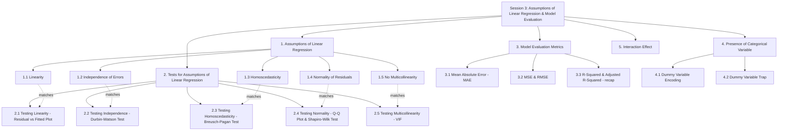
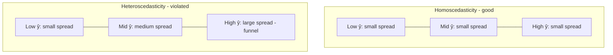

# Session 3: Assumptions of Linear Regression and Model Evaluation

> Topic: Assumptions of Linear Regression and Model Evaluation
> Date: Aug 3, 2026

## Concept Hierarchy

**Reordering note:** The learner's five topics are kept in their original order, but grouped so each "test" in Section 2 lines up one-to-one, in the same order, with the assumption it checks in Section 1 (1.1↔2.1, 1.2↔2.2, etc.) — this makes each test easier to connect to *why* it exists. **R-Squared & Adjusted R-Squared** (3.3) is included as required by the "Model evaluation Metrics" topic, but only recapped by reference to [Session 2 Section 2.5](02-linear-regression.md) — where it was fully derived — instead of re-explained, per the anti-repetition rule. No topic was dropped, merged, or added as a new prerequisite; every supplied item appears exactly once below.

**Running example used throughout:** continuing the **house price prediction** example from [Session 1](01-introduction.md) and [Session 2](02-linear-regression.md) — predicting a house's price ($\hat y$) from its area, number of rooms, age, and a newly introduced categorical feature, **locality** (Downtown / Suburb / Rural), used in Sections 4 and 5.

---

## 1. Assumptions of Linear Regression

**Parent concept.** Ordinary Least Squares ([Session 2 Section 2.3.1](02-linear-regression.md)) will always produce *some* fitted line, no matter what the data looks like. But that line's coefficients are only trustworthy — unbiased, and valid for the slope-significance test in [Session 2 Section 2.6](02-linear-regression.md) — if the data and its residuals ($e_i = y_i - \hat y_i$) satisfy a set of conditions. These conditions are the **assumptions of linear regression**: the relationship is actually a straight line (1.1), residuals don't depend on each other (1.2), residuals spread out evenly (1.3), residuals follow a bell curve (1.4), and (for multiple regression) predictors aren't too similar to each other (1.5).

> **Formal definition:** The assumptions of linear regression are the set of conditions — linearity, independence of errors, homoscedasticity, normality of residuals, and (for multiple predictors) no multicollinearity — that must hold for Ordinary Least Squares coefficient estimates and their significance tests to be valid.

### 1.1 Linearity

**Meaning** — The true relationship between a predictor and the target must genuinely look like a straight line (or flat plane, for multiple predictors), not a curve — **linearity** requires $E[Y|X=x]$ to be a linear function of $x$.

> **Formal definition:** The linearity assumption states that the expected value of the dependent variable is a linear function of the independent variable(s).

**Why it matters** — If the real relationship curves (e.g., price gain per extra 100 sq. ft. shrinks for very large houses), a straight-line fit will systematically over- or under-predict at different ranges of $x$, no matter how well OLS minimizes squared error.

**Example** — If actual house prices rise steeply with area up to 2000 sq. ft. but then level off for larger houses, a straight line fit across the whole range will overpredict small-house prices and underpredict mid-size ones.

**Important details** — Violation shows up as a curved pattern in the residual-vs-fitted plot (tested in 2.1). Common fixes: add a polynomial term (e.g., $x^2$), or transform the variable (e.g., log(area)).

**Exam focus** — Be ready to define linearity and describe one real-world case where it could plausibly fail.

### 1.2 Independence of Errors

**Meaning** — One data point's error shouldn't help you guess another point's error — **independence of errors** requires $Cov(e_i, e_j) = 0$ for all $i \neq j$.

> **Formal definition:** The independence-of-errors assumption states that the residuals of a regression model are uncorrelated with each other.

**Why it matters** — If errors are correlated with each other, the standard error of the slope ($SE(b_1)$, [Session 2 Section 2.6](02-linear-regression.md)) is calculated wrong, making the significance test unreliable — you could wrongly conclude a predictor matters (or doesn't).

**Example** — This is especially likely with time-ordered data: if today's prediction error tends to resemble yesterday's error (e.g., both high on weekends), the errors are not independent. This is exactly the situation where switching to autoregression ([Session 2 Section 3](02-linear-regression.md)) — which explicitly models the link between successive values — is more appropriate than plain regression.

**Important details** — This violation is called **autocorrelation**; it is tested using the Durbin-Watson test (2.2).

**Exam focus** — Know the term "autocorrelation" and that it mainly threatens time-ordered data.

### 1.3 Homoscedasticity

**Meaning** — The "spread" of prediction errors should stay roughly the same size across all predictor values, not fan out or shrink — **homoscedasticity** requires $Var(e_i)$ to be constant across all values of $x$; its violation is called **heteroscedasticity**.

> **Formal definition:** Homoscedasticity is the assumption that the variance of the regression model's residuals is constant across all values of the independent variable(s).

**Why it matters** — Under heteroscedasticity, OLS coefficients ($b_0, b_1$) stay correct on average, but their standard errors are wrong, again making the significance test from [Section 2.6](02-linear-regression.md) unreliable.

#### Diagram — residual spread patterns

**Example** — Errors could be small and tight for cheap houses but large and scattered for expensive houses — a "funnel" shape, i.e., heteroscedasticity.

**Important details** — Tested via the Breusch-Pagan test or the same residual-vs-fitted plot from 2.1/2.3, now looking for a funnel shape instead of a curve.

**Exam focus** — Know the term and be able to sketch/recognize the funnel-shaped residual pattern.

### 1.4 Normality of Residuals

**Meaning** — When you plot all the leftover errors, they should roughly form a bell curve centered at zero — **normality of residuals** requires $e_i \sim N(0, \sigma^2)$.

> **Formal definition:** The normality-of-residuals assumption states that the regression model's residuals are normally distributed with a mean of zero.

**Why it matters** — The t-test used for slope inference ([Session 2 Section 2.6](02-linear-regression.md)) and confidence intervals around predictions rely on this assumption, especially with smaller sample sizes.

**Example** — A histogram of residuals from the house-price model should look roughly symmetric around zero, not heavily skewed to one side.

**Important details** — Tested using a Q-Q plot or the Shapiro-Wilk test (2.4).

**Exam focus** — Know why this assumption matters specifically for hypothesis testing (2.6), not for the coefficients themselves.

### 1.5 No Multicollinearity

**Meaning** — In multiple regression, the predictors themselves shouldn't be too strongly correlated with each other — **no multicollinearity** requires that no predictor $X_j$ can be closely predicted by a linear combination of the other predictors.

> **Formal definition:** No multicollinearity is the assumption that, in a multiple regression model, the independent variables are not highly linearly correlated with one another.

**Why it matters** — If two predictors move almost identically (e.g., area and number of rooms are near-duplicates in a dataset), OLS cannot reliably tell which one is actually driving the change in price — coefficients become unstable, and can even flip sign unexpectedly between similar datasets.

**Example** — Including both "area in sq. ft." and "area in sq. m." as separate predictors in [Session 2 Section 2.4](02-linear-regression.md)'s multiple regression model — they are perfectly correlated (one is a constant multiple of the other), a clear case of multicollinearity.

**Important details** — Only relevant when there is more than one predictor (multiple regression, not simple regression). Tested using the Variance Inflation Factor (2.5).

**Exam focus** — Know that this assumption applies only to multiple regression, unlike 1.1–1.4 which apply to simple regression too.

**Connection** — These five conditions define what "valid" means for a fitted regression line. Section 2 next gives one concrete, checkable test for each assumption, in the same order.

---

## 2. Tests for Assumptions of Linear Regression

**Parent concept.** Each assumption in Section 1 needs an actual, checkable test applied to a fitted model's residuals — otherwise "assuming" linearity or normality is just a guess. The five tests below map one-to-one onto the five assumptions just introduced.

> **Formal definition:** Assumption tests are formal statistical or graphical diagnostics applied to a fitted regression model's residuals to check whether a specific assumption (linearity, independence, homoscedasticity, normality, or no multicollinearity) holds.

### 2.1 Testing Linearity — Residual vs Fitted Plot

**Meaning** — Plot the residuals ($e_i$, y-axis) against the model's predicted values ($\hat y_i$, x-axis) and look for a pattern — a **residual-vs-fitted plot** is the standard diagnostic for checking linearity.

> **Formal definition:** A residual-vs-fitted plot is a diagnostic graph of a regression model's residuals against its fitted values, used to detect non-linearity or non-constant variance.

**How it works** — 1. Fit the regression model and compute residuals. 2. Plot residuals against fitted values. 3. Interpret: random scatter around the zero line (no visible curve) means linearity holds; a clear curve (e.g., U-shape) means it's violated.

**Example** — If the residual-vs-fitted plot for the house-price model shows a clear U-shape (residuals negative in the middle, positive at both ends), the true relationship is likely curved, not linear — matching the diminishing-returns case from 1.1.

**Exam focus** — Know that this single plot is reused (in 2.3) to also check homoscedasticity, just by looking at a different feature of its shape (curve vs funnel).

### 2.2 Testing Independence — Durbin-Watson Test

**Meaning** — A numeric test that checks whether consecutive errors are related — the **Durbin-Watson (DW) test** produces a statistic measuring autocorrelation between successive residuals.

> **Formal definition:** The Durbin-Watson test is a statistical test that produces a value between 0 and 4 to detect the presence of autocorrelation among the residuals of a regression model.

**Formula** — Exam-important
**Formula** — $DW = \dfrac{\sum_{t=2}^{n}(e_t - e_{t-1})^2}{\sum_{t=1}^{n}e_t^2}$
**Where** — $e_t$: residual at position $t$ (data must be ordered, e.g., by time); $DW$ ranges from 0 to 4.
**Example** — A fitted model gives $DW = 1.2$.
**Interpretation** — $DW \approx 2$ means no autocorrelation (independence holds); $DW$ well below 2 (like 1.2) signals **positive** autocorrelation (consecutive errors tend to be similar); $DW$ well above 2 signals **negative** autocorrelation — so this model's independence assumption (1.2) is likely violated.

**Exam focus** — Remember the benchmark: $DW \approx 2$ is ideal; know which direction (below/above 2) each type of autocorrelation falls on.

### 2.3 Testing Homoscedasticity — Breusch-Pagan Test

**Meaning** — A numeric test for the "funnel shape" spotted visually in 1.3 — the **Breusch-Pagan test** regresses the squared residuals ($e_i^2$) on the original predictors, then checks whether that regression is statistically significant.

> **Formal definition:** The Breusch-Pagan test is a statistical test for heteroscedasticity that checks whether the squared residuals of a regression model are significantly related to its independent variables.

**How it works** — 1. Fit the original regression and get residuals. 2. Regress $e_i^2$ on the same predictors $X$. 3. Test whether this second regression is significant (via a chi-square test). 4. A small p-value (< 0.05) means predictors do explain variation in the squared residuals → heteroscedasticity is present.

**Example** — If the Breusch-Pagan test on the house-price model gives $p = 0.01$, the squared residuals are significantly related to area — confirming the funnel shape suspected in 1.3 (errors are genuinely larger for bigger houses).

**Important details** — The residual-vs-fitted plot from 2.1 gives a quick visual check for the same issue; Breusch-Pagan gives a formal, numeric one.

**Exam focus** — Know the null hypothesis: $H_0$ = homoscedasticity (constant variance) holds; a small p-value rejects it.

### 2.4 Testing Normality — Q-Q Plot & Shapiro-Wilk Test

**Meaning** — Two ways — one visual, one numeric — to check if residuals form a bell curve: a **Q-Q (quantile-quantile) plot** plots the residuals' quantiles against the quantiles of a theoretical normal distribution; the **Shapiro-Wilk test** is a formal hypothesis test for normality.

> **Formal definition:** A Q-Q plot graphically compares the quantiles of a sample against the quantiles of a theoretical normal distribution to assess normality; the Shapiro-Wilk test is a formal hypothesis test of the null hypothesis that a sample is drawn from a normally distributed population.

**How it works (Q-Q plot)** — If residuals are normally distributed, the plotted points fall approximately on a straight diagonal line; systematic curving away from the line indicates non-normality.

**How it works (Shapiro-Wilk)** — $H_0$: residuals are normally distributed. A small p-value (< 0.05) means rejecting $H_0$ — residuals are likely not normal.

**Example** — A Q-Q plot for the house-price model's residuals that curves away at both ends (an "S" shape) suggests heavier tails than a normal distribution — confirmed if the Shapiro-Wilk test also gives $p < 0.05$.

**Exam focus** — Know both tools exist for the same assumption (1.4) — one visual, one numeric — and the Shapiro-Wilk null hypothesis.

### 2.5 Testing Multicollinearity — Variance Inflation Factor (VIF)

**Meaning** — A number that tells you how much a predictor's information is duplicated by the other predictors — the **Variance Inflation Factor (VIF)** measures how much a predictor's coefficient variance is "inflated" due to its correlation with the other predictors.

> **Formal definition:** The Variance Inflation Factor quantifies how much the variance of an estimated regression coefficient is increased due to collinearity with the other predictor variables.

**Formula** — Essential
**Formula** — $VIF_j = \dfrac{1}{1 - R_j^2}$
**Where** — $R_j^2$: the R-squared ([Session 2 Section 2.5](02-linear-regression.md)) obtained by regressing predictor $X_j$ on all the *other* predictors (not on the target $Y$).
**Example** — Regressing "number of rooms" on "area" and "age" gives $R_j^2 = 0.8$ (rooms are largely predictable from area and age). Then $VIF = \dfrac{1}{1-0.8} = 5$.
**Interpretation** — $VIF = 1$ means no correlation with other predictors; $VIF$ between 1 and 5 is generally acceptable; $VIF > 5$ (some use $> 10$) signals problematic multicollinearity — here, "number of rooms" is redundant enough with area/age that its own coefficient becomes unstable, violating assumption 1.5.

**Important details** — Fix by dropping one of the strongly correlated predictors, or combining them into a single feature (feature engineering, [Session 1 Section 2.5](01-introduction.md)).

**Exam focus** — Be ready to compute VIF from a given $R_j^2$, and to state the common cutoff ($VIF > 5$ or $10$).

**Connection** — With the model now checked for validity (Sections 1–2), the next question is different: not "is this model's fit trustworthy?" but "how good are its actual predictions?" — the subject of Section 3.

---

## 3. Model Evaluation Metrics

**Parent concept.** **Model evaluation metrics** quantify how far a model's predictions are from the actual values, in the target's own units — a different question from R² (Session 2 Section 2.5), which measures a *proportion* of variance explained rather than a plain error size. The two most common absolute-error metrics are the Mean Absolute Error (3.1) and the Mean/Root Squared Error family (3.2); R² and Adjusted R² (3.3) are then recapped by reference so all evaluation tools can be compared together.

> **Formal definition:** Model evaluation metrics are quantitative measures used to assess how closely a regression model's predictions match observed values.

### 3.1 Mean Absolute Error (MAE)

**Meaning** — The average size of the prediction mistakes, ignoring whether they were too high or too low — **MAE** is the mean of the absolute differences between actual and predicted values.

> **Formal definition:** The Mean Absolute Error is the average of the absolute differences between the predicted and actual values of the dependent variable.

**Formula** — Essential
**Formula** — $MAE = \dfrac{1}{n}\sum_{i=1}^{n}|y_i - \hat y_i|$
**Where** — $y_i$: actual value; $\hat y_i$: predicted value; $n$: number of observations.
**Example** — For 4 houses with actual prices $[40, 55, 65, 80]$ (lakh) and predicted prices $[42, 50, 68, 75]$: errors are $[2, -5, 3, -5]$, absolute errors $[2, 5, 3, 5]$. $MAE = \dfrac{2+5+3+5}{4} = 3.75$ lakh.
**Interpretation** — On average, predictions are off by about ₹3.75 lakh, in either direction.

**Important details** — MAE treats every error equally (no squaring), so it is **less sensitive to outliers** than MSE/RMSE (3.2) — one very large error doesn't dominate the average.

**Exam focus** — Know the formula and be ready to compute it from a small dataset.

### 3.2 Mean Squared Error (MSE) & Root Mean Squared Error (RMSE)

**Meaning** — Like MAE, but errors are squared first, so bigger mistakes count much more heavily; RMSE brings the result back to the target's original unit — **MSE** is the mean of squared residuals; **RMSE** is its square root.

> **Formal definition:** The Mean Squared Error is the average of the squared differences between predicted and actual values; the Root Mean Squared Error is the square root of the Mean Squared Error, expressed in the same unit as the target variable.

**Formula** — Essential
**Formula** — $MSE = \dfrac{1}{n}\sum_{i=1}^{n}(y_i-\hat y_i)^2$, $\quad RMSE = \sqrt{MSE}$
**Where** — Same $y_i, \hat y_i, n$ as above; note $MSE = SS_{res}/n$, reusing $SS_{res}$ from [Session 2 Section 2.5](02-linear-regression.md).
**Example** — Reusing 3.1's errors $[2, -5, 3, -5]$: squared errors $[4, 25, 9, 25]$. $MSE = \dfrac{4+25+9+25}{4} = 15.75$. $RMSE = \sqrt{15.75} \approx 3.97$ lakh.
**Interpretation** — RMSE (≈₹3.97 lakh) is close to MAE (₹3.75 lakh) here, but RMSE is always $\geq$ MAE, and grows disproportionately if even one prediction is very far off — because squaring a large error (as OLS itself does in [Session 2 Section 2.3.1](02-linear-regression.md)) penalizes it much more heavily than a small one.

**Important details** — RMSE is in the same unit as the target (unlike MSE, which is in squared units), making RMSE easier to interpret directly; MSE is mainly useful as the quantity being minimized/compared mathematically.

**Exam focus** — Know that squaring makes RMSE more sensitive to outliers than MAE — a frequent comparison question.

### 3.3 R-Squared & Adjusted R-Squared (recap)

R² and Adjusted R² were fully defined, derived, and worked through in [Session 2 Section 2.5](02-linear-regression.md) — they measure the *proportion* of the target's variance explained by the model (a relative, unit-free score between 0 and 1), which complements the *absolute*-error metrics MAE and RMSE above (in the target's own units). Used together, they give a complete evaluation picture: e.g., a model could have a high R² (explains most of the variance) but still have a large RMSE if the target itself varies over a huge range.

#### Comparison: Model Evaluation Metrics

| Aspect                  | MAE                                   | RMSE                                 | R² / Adjusted R²                                                                      |
| ----------------------- | ------------------------------------- | ------------------------------------ | ------------------------------------------------------------------------------------- |
| Meaning                 | Average absolute error                | Square-root of average squared error | Proportion of variance explained                                                      |
| Unit                    | Same as target                        | Same as target                       | Unit-free (0 to 1)                                                                    |
| Sensitivity to outliers | Low                                   | High (squares errors)                | Indirect, via $SS_{res}$                                                              |
| Best for                | Robust, easy-to-explain average error | Penalizing large mistakes            | Comparing overall explanatory power, across model sizes (Adjusted R², Session 2 §2.5) |
| Example value           | ₹3.75 lakh                            | ₹3.97 lakh                           | 0.8 / 0.792 (Session 2 §2.5)                                                          |

The central difference: MAE and RMSE report error size in the target's own unit (with RMSE penalizing big mistakes more), while R²/Adjusted R² report what *fraction* of the variation is explained, unit-free. Use MAE/RMSE to judge how large a typical mistake actually is in real terms; use R²/Adjusted R² to judge how much of the pattern the model captures, especially when comparing models with different predictor counts.

**Exam focus** — Be ready to compute MAE and RMSE from given actual/predicted values, and to explain why RMSE reacts more strongly to outliers than MAE.

**Connection** — With prediction quality now measurable, Section 4 turns to a data type not yet handled directly inside a regression equation — categorical predictors — which is needed before Section 5 can show how one predictor's effect can change depending on another.

---

## 4. Presence of Categorical Variable

**Parent concept.** The multiple regression equation ([Session 2 Section 2.4](02-linear-regression.md)) only accepts numeric predictors ($x_1, x_2, \dots$), but real features like **locality** (Downtown / Suburb / Rural) are categories, not numbers. **Presence of categorical variable** covers how such a feature is still included in a regression model: by converting it to numeric dummy columns (4.1), while avoiding a specific trap that would break the no-multicollinearity assumption (4.2, from 1.5).

> **Formal definition:** The presence of a categorical variable in a regression model requires converting its categories into numeric dummy variables before it can be used as a predictor.

### 4.1 Dummy Variable Encoding

**Meaning** — Turning a category like "locality" into a set of 0/1 columns so it can be plugged into the regression equation — **dummy variable encoding** reuses the one-hot encoding idea ([Session 1 Section 2.2.1](01-introduction.md)), but for regression, only $k-1$ dummy columns are created for a category with $k$ levels — one level is left out as the **baseline (reference) category**.

> **Formal definition:** Dummy variable encoding represents a categorical predictor with $k$ levels using $k-1$ binary (0/1) variables, with one level omitted as the reference category against which the others are compared.

**Formula** — Essential
**Formula** — $\hat y = b_0 + b_1\,x_{area} + b_2\,D_{Suburb} + b_3\,D_{Rural}$
**Where** — $x_{area}$: continuous area predictor; $D_{Suburb}, D_{Rural}$: dummy variables (1 if the house is in that locality, else 0); **Downtown** is the omitted baseline category (both dummies are 0 for a Downtown house).
**Example** — Suppose the fitted model is $\hat y = 10 + 3\,x_{area} + 8\,D_{Suburb} + (-4)\,D_{Rural}$. For a Suburb house with area 20 (2000 sq. ft.): $\hat y = 10 + 3(20) + 8(1) + (-4)(0) = 10+60+8 = 78$ lakh.
**Interpretation** — $b_2 = 8$ means a Suburb house is predicted to cost ₹8 lakh more than a Downtown house of the same area (holding area constant, the same "holding others constant" reading from [Session 2 Section 2.4](02-linear-regression.md)); $b_3 = -4$ means a Rural house is predicted to cost ₹4 lakh less than a Downtown house of the same area.

**Exam focus** — Know that a category with $k$ levels needs exactly $k-1$ dummies, and how to interpret a dummy's coefficient relative to the baseline category.

### 4.2 Dummy Variable Trap

**Meaning** — The mistake of including a dummy column for *every* category (all $k$, instead of $k-1$) — the **dummy variable trap** occurs because the $k$ dummy columns for one category always sum to exactly 1 for every row, making one dummy perfectly predictable from the others — a case of perfect multicollinearity (Section 1.5).

> **Formal definition:** The dummy variable trap is a scenario of perfect multicollinearity that arises when all $k$ dummy variables for a categorical predictor with $k$ levels are included in a regression model instead of $k-1$.

**Why it matters** — This directly violates the no-multicollinearity assumption; the regression's coefficients become unstable or mathematically undefined, since VIF (Section 2.5) for each of these dummies would be infinite.

**Example** — Including all three of $D_{Downtown}, D_{Suburb}, D_{Rural}$ together: for any house, exactly one of the three is 1 and the rest 0, so $D_{Downtown} = 1 - D_{Suburb} - D_{Rural}$ always — a perfect linear relationship among predictors.

**Important details** — Fix: always drop exactly one category's dummy column as the baseline, as done correctly in 4.1.

**Exam focus** — A frequent trap question — know *why* including all $k$ dummies fails (perfect multicollinearity), not just the rule "always use $k-1$."

**Connection** — With categorical predictors correctly encoded, Section 5 shows a case where one predictor's effect on the target genuinely changes depending on the level of another predictor — best shown here using area together with the locality dummy just introduced.

---

## 5. Interaction Effect

**Meaning** — Sometimes one feature's effect on the target isn't the same for every group — e.g., area might matter more to price in the Suburb than in Downtown. An **interaction effect** exists when the effect of one predictor on the target depends on the value of another predictor; it is modeled by adding a product term of the two predictors to the regression equation.

> **Formal definition:** An interaction effect exists when the effect of one independent variable on the dependent variable depends on the level of another independent variable, and is modeled by including the product of the two variables as an additional predictor.

**Why it matters** — The plain additive model in 4.1 assumes area's effect on price ($b_1$) is identical across all localities. If, in reality, larger houses command an extra premium specifically in the Suburb, an additive model cannot capture that — only an interaction term can.

**Formula** — Exam-important
**Formula** — $\hat y = b_0 + b_1\,x_{area} + b_2\,D_{Suburb} + b_3\,(x_{area} \times D_{Suburb})$
**Where** — $x_{area}$: continuous predictor; $D_{Suburb}$: dummy variable from Section 4.1; $x_{area} \times D_{Suburb}$: the **interaction term**, equal to $x_{area}$ for Suburb houses and 0 for Downtown houses; $b_3$: interaction coefficient.
**Example** — Fitted model: $\hat y = 10 + 3\,x_{area} + 5\,D_{Suburb} + 1.5\,(x_{area}\times D_{Suburb})$. For a Downtown house ($D_{Suburb}=0$) with area 20: $\hat y = 10 + 3(20) = 70$ lakh. For a Suburb house ($D_{Suburb}=1$) with area 20: $\hat y = 10 + 3(20) + 5(1) + 1.5(20)(1) = 10+60+5+30 = 105$ lakh.
**Interpretation** — For Downtown houses, each extra unit of area adds $b_1 = 3$ to price; for Suburb houses, each extra unit of area adds $b_1 + b_3 = 3+1.5 = 4.5$ — area's effect on price is genuinely stronger in the Suburb. This group-specific slope difference is exactly what the additive model from Section 4.1 (same $b_1$ for every locality) cannot represent.

**Important details** — Interaction terms can be built between two continuous predictors, two categorical (dummy) predictors, or — as shown here — one of each. Adding interaction terms increases model flexibility but also increases the risk of multicollinearity (Section 1.5/2.5) between the interaction term and its own parent predictors, and should only be kept if it genuinely improves fit enough to justify the extra predictor, following the same Adjusted R² penalty logic from [Session 2 Section 2.5](02-linear-regression.md).

**Exam focus** — Know the general interaction formula, and be ready to compute and compare the effective slope for two different groups, as in the worked example.

---

## Examination Preparation

### Must understand

- Why each assumption (Section 1) is needed for OLS coefficients/tests to be trustworthy, not just "for the fit to exist."
- How each test in Section 2 maps to and checks its corresponding assumption in Section 1.
- Why RMSE reacts more strongly to outliers than MAE, and how both differ from R²/Adjusted R² (Section 3).
- Why exactly $k-1$ dummy variables (not $k$) must be used for a $k$-level category (Section 4).
- How an interaction term changes the interpretation of a predictor's slope across groups (Section 5).

### Must remember

- Five assumptions: linearity, independence of errors, homoscedasticity, normality of residuals, no multicollinearity (1.1–1.5).
- Matching tests: residual-vs-fitted plot, Durbin-Watson, Breusch-Pagan, Q-Q plot/Shapiro-Wilk, VIF (2.1–2.5).
- Durbin-Watson benchmark: $DW \approx 2$ is ideal (2.2).
- VIF formula: $VIF_j = 1/(1-R_j^2)$; common cutoff $VIF > 5$ (2.5).
- MAE formula: $\frac{1}{n}\sum|y_i-\hat y_i|$; RMSE formula: $\sqrt{\frac{1}{n}\sum(y_i-\hat y_i)^2}$ (3.1–3.2).
- Dummy variable rule: $k-1$ dummies for $k$ categories, one baseline omitted (4.1); including all $k$ causes the dummy variable trap (4.2).
- Interaction formula: $\hat y = b_0+b_1x_1+b_2D+b_3(x_1\times D)$; group slope = $b_1$ for baseline, $b_1+b_3$ for the other group (Section 5).

### Common question patterns

- *2-mark:* Define linearity / homoscedasticity / multicollinearity / dummy variable trap / interaction effect.
- *5-mark:* Compare MAE and RMSE; explain the dummy variable trap and its fix; explain how the Durbin-Watson test checks independence of errors.
- *10-mark:* Explain all assumptions of linear regression along with the test used to check each one; explain how categorical variables and interaction terms are incorporated into a multiple regression model, with a worked example.

### Answer-writing guidance

- *2-mark:* definition + one supporting example.
- *5-mark:* definition, main explanation, key points, example/formula/small diagram.
- *10-mark:* introduction, technical definition, diagram/workflow, detailed explanation, example/application, advantages/limitations, conclusion.

### Model answers

*2-mark:* "Homoscedasticity is the assumption that the variance of the regression model's residuals stays constant across all predictor values. Example: if prediction errors grow larger for more expensive houses, that is heteroscedasticity — a violation of this assumption."

*5-mark:* "MAE (Mean Absolute Error) is the average of the absolute differences between actual and predicted values, treating every error equally regardless of size. RMSE (Root Mean Squared Error) instead squares each error before averaging and taking the square root, which means large mistakes are penalized far more heavily than small ones — the same principle behind why Ordinary Least Squares itself minimizes squared, not absolute, residuals. As a result, RMSE is always greater than or equal to MAE, and the gap between them widens whenever the model has even a few large prediction errors (outliers), making RMSE more sensitive to such outliers than MAE. Both are reported in the same unit as the target variable, unlike R-squared, which is a unit-free proportion of variance explained. In practice, MAE gives an easy-to-explain 'typical' error size, while RMSE better highlights whether a model is making some very large mistakes."

*10-mark:* "Introduction: A fitted regression line is only as reliable as the assumptions behind it — violating them undermines the validity of its coefficients and significance tests. Definition: linear regression assumes linearity (a genuinely straight-line relationship), independence of errors (residuals don't depend on each other), homoscedasticity (constant residual variance), normality of residuals (errors follow a bell curve), and, for multiple regression, no multicollinearity (predictors aren't too correlated with each other). Diagram/workflow: fit model → compute residuals → check each assumption with its matching test → fix violations if found. Detailed explanation: linearity is checked with a residual-vs-fitted plot, looking for a curved pattern; independence is checked using the Durbin-Watson statistic, where a value near 2 indicates no autocorrelation; homoscedasticity is checked with the Breusch-Pagan test or the same residual-vs-fitted plot, looking instead for a funnel shape; normality is checked visually with a Q-Q plot or formally with the Shapiro-Wilk test; and multicollinearity is checked using the Variance Inflation Factor, $VIF_j = 1/(1-R_j^2)$, with values above about 5 signalling a problem. Example/application: in a house-price model, a Durbin-Watson value of 1.2 would signal positive autocorrelation, suggesting the independence assumption is violated, especially likely if the data is time-ordered. Advantages: checking assumptions upfront prevents drawing wrong conclusions from an invalid model. Limitations: some violations (like mild non-normality) matter less with large sample sizes, and fixes like transformation or dropping predictors can themselves introduce new trade-offs. Conclusion: verifying all five assumptions, using their matching tests, is essential before trusting a regression model's coefficients or using it for inference."

## Practice Questions

### Basic recall

1. List the five assumptions of linear regression.
   **Answer:** Linearity, independence of errors, homoscedasticity, normality of residuals, no multicollinearity (Sections 1.1–1.5).
2. Which test is used to check independence of errors, and what is the ideal value of its statistic?
   **Answer:** The Durbin-Watson test; a statistic near 2 indicates no autocorrelation (Section 2.2).
3. Write the formula for the Variance Inflation Factor (VIF).
   **Answer:** $VIF_j = 1/(1-R_j^2)$ (Section 2.5).
4. Write the formulas for MAE and RMSE.
   **Answer:** $MAE=\frac{1}{n}\sum|y_i-\hat y_i|$; $RMSE=\sqrt{\frac{1}{n}\sum(y_i-\hat y_i)^2}$ (Sections 3.1–3.2).
5. How many dummy variables are needed to represent a categorical feature with 4 levels?
   **Answer:** 3 ($k-1$ dummies for $k=4$ levels), with one level left as the baseline (Section 4.1).

### Conceptual

1. Why does violating the normality-of-residuals assumption specifically affect hypothesis testing, rather than the coefficients themselves?
   **Answer:** OLS coefficients remain unbiased regardless of residual normality; it's the t-test/confidence intervals used for slope inference (Session 2 Section 2.6) that rely on the normality assumption, especially in small samples (Section 1.4).
2. Why is RMSE more sensitive to outliers than MAE?
   **Answer:** RMSE squares each error before averaging, so a few very large errors dominate the average much more than under MAE, which weighs every error equally (Sections 3.1–3.2).
3. Why does including a dummy variable for every category (instead of leaving one out) cause a problem?
   **Answer:** This is the dummy variable trap — with all $k$ dummies included, they always sum to 1 for every row, so one dummy is perfectly predictable from the others, creating perfect multicollinearity (Section 4.2).
4. Why is the no-multicollinearity assumption only relevant for multiple regression, not simple regression?
   **Answer:** Multicollinearity is about correlation *among predictors*; simple regression has only one predictor, so there's nothing for it to be collinear with (Section 1.5).
5. Why can't an additive model (no interaction term) capture a case where one predictor's effect on the target differs across groups?
   **Answer:** An additive model forces the same slope $b_1$ for every group; only adding an interaction term (product of the predictor and the group dummy) lets the effective slope differ by group (Section 5).

### Comparison

1. Compare MAE and RMSE as evaluation metrics.
   **Answer:** See the comparison table in Section 3.3 — MAE averages absolute errors and has low sensitivity to outliers; RMSE averages squared errors (then square-roots) and is highly sensitive to outliers, though both are reported in the target's own unit.
2. Compare the residual-vs-fitted plot and the Durbin-Watson test as diagnostic tools.
   **Answer:** The residual-vs-fitted plot (Section 2.1) is a visual check reused for both linearity (curve pattern) and homoscedasticity (funnel pattern); the Durbin-Watson test (Section 2.2) is a formal numeric statistic specifically for independence/autocorrelation.
3. Compare a regression model with and without an interaction term, for the same two predictors.
   **Answer:** Without an interaction term (Section 4.1), a predictor's slope is assumed identical across all groups; with an interaction term (Section 5), the slope can differ by group ($b_1$ for the baseline, $b_1+b_3$ for the other group), capturing group-specific effects the additive model cannot.

### Scenario / application

1. A fitted model's residual-vs-fitted plot shows a clear funnel shape (errors grow larger as predicted values increase) — which assumption is likely violated, and which formal test would confirm it?
   **Answer:** Homoscedasticity is likely violated (heteroscedasticity, Section 1.3); the Breusch-Pagan test (Section 2.3) would formally confirm it via a significant p-value.
2. Two predictors in a multiple regression give a VIF of 12 — explain what this means and what action should be taken.
   **Answer:** A VIF of 12 (above the common cutoff of 5–10) signals problematic multicollinearity between that predictor and the others (Section 2.5); the fix is to drop one of the correlated predictors or combine them into a single feature.
3. A regression model of price on area and locality (dummies) fits well, but a residual check shows area's effect on price seems much stronger in the Suburb than Downtown — what modeling change would capture this, and how would you interpret its coefficient?
   **Answer:** Add an interaction term between area and the Suburb dummy (Section 5); its coefficient $b_3$ represents the extra slope area gets specifically in the Suburb, on top of the baseline slope $b_1$.

### Long-answer

1. Explain all five assumptions of linear regression, the test used to check each, and what action follows if a test reveals a violation.
   **Answer:** See Sections 1.1–1.5 paired with their matching tests in 2.1–2.5, and the 10-mark model answer in Examination Preparation for the full worked explanation with fixes for each violation.
2. Explain how categorical variables are incorporated into a multiple regression model, the dummy variable trap, and how an interaction term extends this to capture group-specific effects — using a worked numeric example.
   **Answer:** See Sections 4.1 (dummy encoding), 4.2 (the trap and its fix), and 5 (interaction terms), which together walk through the worked locality/area house-price example end to end.

## Quick Revision

- **One-sentence summary:** A linear regression model's coefficients are only trustworthy if its five assumptions hold (each checked using a matching test), its prediction quality is judged using absolute-error metrics (MAE, RMSE) alongside R²/Adjusted R², and it can be extended with dummy-encoded categorical predictors and interaction terms to capture group-specific effects.
- **Hierarchy:** see Concept Hierarchy above.
- **Essential definitions:** linearity, independence, homoscedasticity, normality, no multicollinearity (1.1–1.5); their matching tests (2.1–2.5); MAE, MSE/RMSE (3.1–3.2); dummy variable encoding and the dummy variable trap (4.1–4.2); interaction effect (Section 5).
- **Key formulas:** Durbin-Watson (2.2); VIF $=1/(1-R_j^2)$ (2.5); MAE, MSE, RMSE (3.1–3.2); dummy-variable regression equation (4.1); interaction regression equation (Section 5).
- **Most important comparison:** MAE vs RMSE (Section 3) — governs how outlier-sensitive an evaluation is.
- **5 exam keywords:** heteroscedasticity, Durbin-Watson, Variance Inflation Factor, dummy variable trap, interaction effect.
- **5 common mistakes:** checking assumptions only visually and skipping the formal test; assuming a high R² means all assumptions hold; using all $k$ dummy columns instead of $k-1$; comparing MAE and RMSE values without noting RMSE penalizes outliers more; adding an interaction term without checking it actually improves Adjusted R² (Session 2 §2.5).

## Topic Coverage

- Assumptions of Linear Regression — Covered in Section 1
- Tests for assumptions of Linear Regression — Covered in Section 2
- Model evaluation Metrics — Covered in Section 3
- Presence of categorical variable — Covered in Section 4
- Interaction effect — Covered in Section 5
