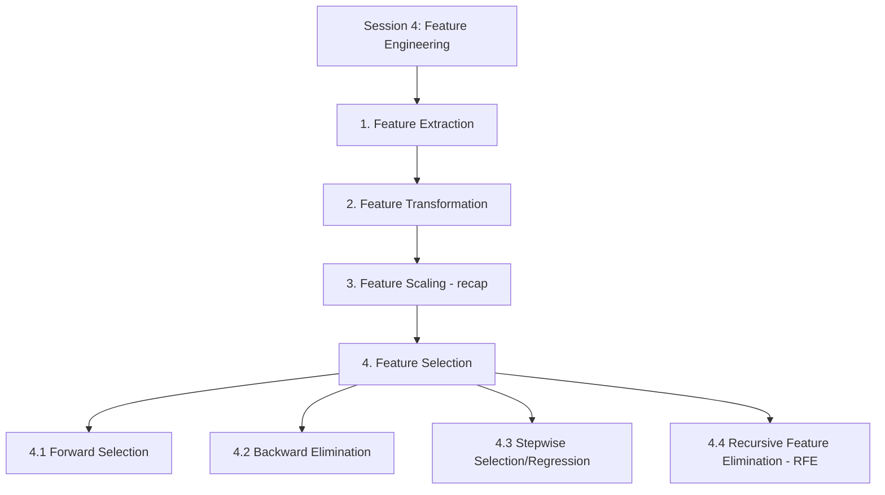

# Session 4: Feature Engineering

> Topic: Feature Engineering
> Date: Aug 3, 2026

## Concept Hierarchy

**Reordering note:** The learner's four topics were already in the natural feature-engineering pipeline order — derive candidate features (1), reshape them mathematically (2), bring them to a comparable scale (3), then pick the best subset (4) — so no reordering was needed. **Feature Scaling** (3) is recapped only by reference to [Session 1 Section 2.3](01-introduction.md), where Min-Max normalization and standardization were already fully derived, per the anti-repetition rule; **Feature Extraction/Transformation/Selection** were also previewed briefly in [Session 1 Section 2.5](01-introduction.md) ("Introduction to Feature Engineering") — this session gives each its full, dedicated treatment instead of repeating that preview. No topic was dropped; every supplied item, including all four Feature Selection sub-methods, appears exactly once below.

**Running example used throughout:** continuing the **house price prediction** example from [Session 1](01-introduction.md), [Session 2](02-linear-regression.md), and [Session 3](03-assumptions-and-model-evaluation.md) — with candidate features area, number of rooms, age, sale date, and the locality dummies from [Session 3 Section 4.1](03-assumptions-and-model-evaluation.md).

---

## 1. Feature Extraction

**Meaning** — Plain: pulling out new, more useful features from raw or complex data, instead of using that raw data as-is. Technical: **feature extraction** is the process of deriving a new set of informative features from raw data, either through domain-based derivation (combining/deriving columns) or through statistical dimensionality-reduction techniques.

**Why it matters** — Raw data (a sale date, several correlated distance measurements, raw text) is often not directly usable, or not efficiently usable, by a regression algorithm. Extraction pulls out the useful signal in a more compact or model-ready form before any other feature-engineering step happens.

**How it works — two common approaches**

1. **Domain-based derivation** — combine or derive a new column using knowledge of the problem, e.g., `house_age = sale_year - year_built` from a raw sale date (the same example introduced in [Session 1 Section 2.5](01-introduction.md), not repeated here).
2. **Dimensionality-reduction extraction** — techniques such as **Principal Component Analysis (PCA)** compress several correlated raw features into fewer new "component" features that still capture most of the original variance (PCA itself belongs to unsupervised learning, [Session 1 Section 1.4](01-introduction.md)).

**Example** — A dataset has three correlated location features: distance to school, distance to hospital, distance to market. Instead of keeping all three (risking multicollinearity, [Session 3 Section 1.5](03-assumptions-and-model-evaluation.md)), PCA can extract a single new "amenity-proximity" component that summarizes all three with minimal information loss.

**Important details** — Feature extraction **creates** new features (sometimes fewer than the original raw count); this is different from Feature Selection (Section 4), which only **picks a subset** of already-existing features and creates nothing new.

**Exam focus** — Be ready to state the core difference between extraction (creates new features) and selection (chooses among existing ones) — a common short-answer trap.

---

## 2. Feature Transformation

**Meaning** — Plain: changing the mathematical shape of a feature's values (not its range) to make it better suited for modeling. Technical: **feature transformation** applies a mathematical function to a feature to change its distribution shape, most often to reduce skew or to let a linear model capture a curved relationship.

**Why it matters** — [Session 1 Section 2.3](01-introduction.md) noted that transformation is distinct from scaling: scaling only rescales range/spread, while transformation reshapes the distribution itself — needed, for example, to help satisfy the normality-of-residuals assumption ([Session 3 Section 1.4](03-assumptions-and-model-evaluation.md)) or to fix a linearity violation ([Session 3 Section 1.1](03-assumptions-and-model-evaluation.md)).

**Formula (Log Transform)** — Essential
**Formula** — $x' = \log(x)$ (or $\log(x+1)$ when $x$ can be 0)
**Where** — $x$: original feature value (must be positive); $x'$: transformed value.
**Example** — House prices are right-skewed: most houses cluster at 40–80 lakh, with a few at 300+ lakh. Applying $x' = \log(x)$ compresses the large values far more than the small ones, pulling the distribution toward a more symmetric, bell-like shape.
**Interpretation** — The log-transformed price is more likely to satisfy the normality-of-residuals assumption ([Session 3 Section 1.4](03-assumptions-and-model-evaluation.md)) when used as the regression target, compared to using raw, heavily skewed prices directly.

**Formula (Polynomial Transform)** — Exam-important
**Formula** — introduce $x^2, x^3, \dots$ as additional predictors alongside $x$.
**Where** — $x$: the original predictor (e.g., area); $x^2$: a new feature equal to area squared.
**Example** — If price rises steeply with area up to 2000 sq. ft. but levels off beyond that (the curved relationship flagged in [Session 3 Section 1.1](03-assumptions-and-model-evaluation.md)), adding $x_{area}^2$ as a second predictor lets the fitted equation curve, instead of forcing a single straight line across the whole range.
**Interpretation** — This is the standard fix referenced in Session 3 for a linearity violation: the model is still a *linear regression* in its coefficients, but the predictor set itself now includes a squared term, letting it fit a curved pattern.

**Important details (Box-Cox Transform)** — Additional depth: the **Box-Cox transform**, $x' = \dfrac{x^\lambda - 1}{\lambda}$ for $\lambda \neq 0$ (and $\log(x)$ for $\lambda = 0$), automatically searches for the power $\lambda$ that makes the transformed feature closest to normally distributed — a more general, data-driven version of the fixed log transform above.

**Exam focus** — Know the log transform's purpose (reduce right-skew) and the polynomial transform's purpose (capture curvature while remaining a linear regression) — these are the two most commonly tested transforms.

---

## 3. Feature Scaling (recap)

Feature scaling — bringing numeric features to a comparable range or spread — was fully defined and derived in [Session 1 Section 2.3](01-introduction.md), including the Min-Max normalization formula ($x' = \frac{x-x_{min}}{x_{max}-x_{min}}$) and the standardization (Z-score) formula ($x' = \frac{x-\mu}{\sigma}$). Within the feature-engineering pipeline, scaling is applied **after** extraction (Section 1) and transformation (Section 2) have produced the final candidate features, and its statistics ($x_{min}, x_{max}, \mu, \sigma$) must still be computed only from the training split, as cautioned in [Session 1 Section 2.6](01-introduction.md), to avoid data leakage.

**Connection** — With candidate features derived (1), reshaped (2), and scaled (3), the pipeline's final step is choosing *which* of them actually belong in the model — the subject of Feature Selection next.

---

## 4. Feature Selection

**Parent concept.** [Session 1 Section 2.5](01-introduction.md) introduced feature selection generally, as keeping only the features that genuinely help the model. **Feature Selection** here means the systematic algorithms used to make that choice, rather than guesswork. Too many features risk overfitting ([Session 1 Section 1.3](01-introduction.md)) and multicollinearity ([Session 3 Section 1.5](03-assumptions-and-model-evaluation.md)); too few risk underfitting ([Session 1 Section 1.3](01-introduction.md)). The four methods below (4.1–4.4) are different systematic strategies for finding a good balance, most of them built on the significance testing from [Session 2 Section 2.6](02-linear-regression.md) or Adjusted R² from [Session 2 Section 2.5](02-linear-regression.md).

### 4.1 Forward Selection

**Meaning** — Plain: start with nothing, and keep adding whichever remaining feature helps the most, one at a time. Technical: **forward selection** begins with an empty model and iteratively adds the single most significant remaining predictor until no further addition improves the model significantly.

**How it works — steps**

1. Start with an empty model (intercept only).
2. For each candidate feature not yet included, test its contribution if added (e.g., its p-value from the slope-significance test, [Session 2 Section 2.6](02-linear-regression.md)).
3. Add the feature with the strongest improvement (lowest p-value / largest gain in Adjusted R², [Session 2 Section 2.5](02-linear-regression.md)).
4. Repeat steps 2–3 until no remaining feature significantly improves the model (e.g., all remaining p-values exceed 0.05).

**Example** — Starting empty for the house-price model: area is added first (strongest single predictor), then number of rooms, then the locality dummies ([Session 3 Section 4.1](03-assumptions-and-model-evaluation.md)); age is tested last and not added because its p-value stays above 0.05.

**Important details** — This is a **greedy** algorithm: it never reconsiders or removes a feature once added, so it does not guarantee the best possible subset overall — only a reasonable one built up step by step.

**Exam focus** — Know that forward selection only *adds*, never removes, and that this is exactly its key limitation, addressed next in stepwise selection (4.3).

### 4.2 Backward Elimination

**Meaning** — Plain: start with everything, and keep removing whichever feature helps the least, one at a time. Technical: **backward elimination** begins with all candidate predictors in the model and iteratively removes the least significant one until all remaining predictors are significant.

**How it works — steps**

1. Fit the model with all candidate features included.
2. Find the feature with the highest p-value (least significant, [Session 2 Section 2.6](02-linear-regression.md)).
3. If that p-value exceeds a chosen threshold (commonly 0.05), remove the feature and refit the model.
4. Repeat steps 2–3 until every remaining feature's p-value is below the threshold.

**Example** — Starting with area, rooms, age, and locality dummies all included: age has $p = 0.6$, the highest among all — it is removed first; refitting shows all remaining features now have $p < 0.05$, so the process stops.

**Important details** — Like forward selection, this is also **greedy** in the opposite direction: once a feature is removed, it is never reconsidered for re-entry.

**Exam focus** — Be ready to compare forward selection (starts empty, adds) with backward elimination (starts full, removes) — a very common comparison question.

### 4.3 Stepwise Selection/Regression

**Meaning** — Plain: a mix of both previous methods — at each step, it can add a helpful feature *or* remove one that has since become unhelpful. Technical: **stepwise selection** performs a forward-selection step, but after each addition, re-checks all currently included features and removes any that have become statistically insignificant.

**Why it matters** — Pure forward selection (4.1) can never undo an earlier choice: a feature added early might become redundant once a later feature is added (e.g., a newly revealed multicollinearity, [Session 3 Section 1.5](03-assumptions-and-model-evaluation.md)), but forward selection alone has no mechanism to remove it. Stepwise selection fixes exactly this gap.

**Example** — Forward selection adds area first, then rooms. But once rooms is added, area's own p-value rises above 0.05 (its information has become redundant with rooms). Pure forward selection (4.1) would leave area in regardless; stepwise selection re-checks after each addition and would remove area at that point.

**Important details** — Stepwise selection is more thorough than either forward or backward alone, but also more computationally expensive, since it re-evaluates all included features at every step.

**Exam focus** — Know the specific gap in forward selection that stepwise regression closes (illustrated by the worked example above) — a frequent "why is stepwise better" question.

### 4.4 Recursive Feature Elimination (RFE)

**Meaning** — Plain: start with every feature, repeatedly find and remove the least useful one, until only the desired number of features remains. Technical: **Recursive Feature Elimination (RFE)** fits a model on all current features, ranks them by an importance measure (e.g., coefficient magnitude), removes the least important one, and repeats.

**How it works — steps**

1. Fit the model using all current candidate features.
2. Rank features by importance (e.g., the absolute value of their fitted coefficient, or a model-specific importance score).
3. Remove the single least important feature.
4. Repeat steps 1–3, refitting each time, until a target number of features remains.

**Example** — With area, rooms, age, and locality dummies, RFE fits the full model, ranks age as least important (smallest coefficient magnitude), removes it, refits with the remaining three, ranks again, and continues until only the desired number of features is left.

**Important details** — Unlike backward elimination (4.2), which removes based on statistical significance (p-values), RFE removes based on **feature importance/coefficient magnitude** directly, which lets it work with a broader range of model types (including those that don't naturally produce p-values, such as tree-based models).

**Exam focus** — Know the one key distinguishing detail versus backward elimination: RFE's removal criterion is importance/coefficient magnitude, not a p-value.

#### Comparison: Feature Selection Methods

| Aspect                          | Forward Selection                   | Backward Elimination                   | Stepwise Selection                                      | RFE                                     |
| ------------------------------- | ----------------------------------- | -------------------------------------- | ------------------------------------------------------- | --------------------------------------- |
| Starting point                  | Empty model                         | Full model (all features)              | Empty model                                             | Full model (all features)               |
| Direction                       | Adds only                           | Removes only                           | Adds, but can also remove                               | Removes only                            |
| Removal criterion               | N/A                                 | Highest p-value                        | Highest p-value (post-addition check)                   | Lowest importance/coefficient magnitude |
| Can reconsider a past decision? | No                                  | No                                     | Yes                                                     | No (each removal is final)              |
| Typical stopping rule           | No remaining feature is significant | All remaining features are significant | No remaining feature is significant, and none removable | Target number of features reached       |

The central difference: forward and backward selection move in only one direction and use significance (p-values), stepwise selection combines both directions to correct earlier mistakes, and RFE uses feature importance/coefficient magnitude rather than p-values, making it usable beyond models that produce p-values. Choose forward or backward selection for a quick, simple search; stepwise when redundancy between features is likely to emerge only after several additions; and RFE when working with model types that don't provide p-values, or when a specific target feature count is needed.

**Connection** — Together, Sections 1–4 form the complete feature-engineering pipeline for this course: derive candidate features (1), reshape them (2), scale them (3), and select the final, best subset (4) — the clean, well-chosen feature set this pipeline produces is exactly what the model-optimization techniques in the next session (bias-variance tradeoff, regularization, hyperparameter tuning) build on.

---

## Examination Preparation

### Must understand

- Why feature extraction creates new features while feature selection only picks among existing ones (Section 1 vs 4).
- Why transformation reshapes a distribution while scaling only rescales range/spread (Section 2 vs 3, referencing Session 1 §2.3).
- Why forward selection's inability to remove a feature is a real limitation, and how stepwise selection fixes it (4.1 vs 4.3).
- Why RFE's removal criterion (importance/coefficient magnitude) differs from backward elimination's (p-value), and what that means for its usability (4.2 vs 4.4).

### Must remember

- Feature extraction creates new features (domain-derived or via PCA); feature selection only picks a subset of existing ones (Section 1).
- Log transform reduces right-skew; polynomial transform captures curvature while staying a linear regression (Section 2).
- Feature scaling formulas already covered: Min-Max and Standardization (Section 3, recapping Session 1 §2.3).
- Forward selection: starts empty, only adds (4.1). Backward elimination: starts full, only removes (4.2). Stepwise: combines both (4.3). RFE: ranks by importance and removes iteratively until a target count (4.4).

### Common question patterns

- *2-mark:* Define feature extraction / feature transformation / forward selection / RFE.
- *5-mark:* Compare forward selection and backward elimination; explain why stepwise selection improves on forward selection; compare log transform and polynomial transform.
- *10-mark:* Explain the complete feature engineering pipeline (extraction → transformation → scaling → selection) with an example at each stage; explain all four feature selection methods with their stopping rules and a comparison.

### Answer-writing guidance

- *2-mark:* definition + one supporting example.
- *5-mark:* definition, main explanation, key points, example/formula/small diagram.
- *10-mark:* introduction, technical definition, diagram/workflow, detailed explanation, example/application, advantages/limitations, conclusion.

### Model answers

*2-mark:* "Recursive Feature Elimination (RFE) is a feature selection method that starts with all candidate features, repeatedly fits a model, ranks features by importance, and removes the least important one until a target number of features remains. Example: starting with area, rooms, age, and locality, RFE would remove age first if it has the smallest coefficient magnitude."

*5-mark:* "Forward selection and backward elimination are both greedy, one-directional feature selection methods, but they start from opposite ends. Forward selection begins with an empty model and repeatedly adds whichever remaining feature most improves it (e.g., lowest p-value), stopping once no remaining feature is significant. Backward elimination instead begins with all candidate features included and repeatedly removes whichever feature is least significant (highest p-value), stopping once every remaining feature is significant. Because both methods are greedy, neither can undo an earlier decision: forward selection can never remove a feature once added, and backward elimination can never re-add a feature once removed. This means both can end up with a suboptimal subset if a feature's usefulness changes after other features are added or removed — a gap that stepwise selection specifically addresses by allowing both addition and removal within the same search."

*10-mark:* "Introduction: after raw features are engineered, a systematic process is needed to decide exactly which ones belong in the final regression model. Definition: feature selection methods choose a subset of the available features, aiming to avoid both overfitting from too many features and underfitting from too few. Diagram/workflow: full candidate feature set → apply a selection method → evaluate significance/importance at each step → stop at a chosen criterion → final feature subset. Detailed explanation: forward selection starts empty and adds the most significant remaining feature at each step; backward elimination starts full and removes the least significant feature at each step; stepwise selection performs forward-style additions but re-checks and removes any feature that becomes insignificant after a later addition, fixing forward selection's inability to reverse an earlier choice; Recursive Feature Elimination instead ranks all features by importance (such as coefficient magnitude) and removes the weakest one repeatedly until a target feature count is reached, making it usable even for models that don't produce p-values. Example/application: for a house-price model with area, rooms, age, and locality dummies, backward elimination might remove age first for having the highest p-value, while RFE might remove it first for having the smallest coefficient magnitude — the outcome can be similar, but the underlying criterion differs. Advantages: these methods replace guesswork with a repeatable, criterion-driven process, reducing multicollinearity and overfitting risk. Limitations: forward, backward, and RFE are all greedy and not guaranteed to find the single best possible subset, and stepwise selection, while more thorough, is more computationally expensive. Conclusion: choosing among these four methods depends on whether re-evaluation of earlier decisions is needed (stepwise) and whether the model type provides p-values (backward elimination) or only importance scores (RFE)."

## Practice Questions

### Basic recall

1. Define feature extraction and give one example technique.
   **Answer:** Feature extraction derives new, informative features from raw data, either by domain-based derivation or dimensionality reduction; example: Principal Component Analysis (PCA) (Section 1).
2. What is the purpose of a log transform?
   **Answer:** To reduce right-skew in a feature's distribution, pulling it toward a more symmetric, bell-like shape (Section 2).
3. State the stopping rule for forward selection.
   **Answer:** Stop once no remaining feature significantly improves the model (e.g., all remaining p-values exceed 0.05) (Section 4.1).
4. State the stopping rule for backward elimination.
   **Answer:** Stop once every remaining feature's p-value is below the chosen threshold (Section 4.2).
5. What criterion does RFE use to decide which feature to remove?
   **Answer:** Feature importance/coefficient magnitude, not p-values (Section 4.4).

### Conceptual

1. Why is PCA considered a feature extraction technique rather than a feature selection technique?
   **Answer:** PCA creates new "component" features by combining the originals; feature selection only picks a subset of already-existing features and creates nothing new (Section 1).
2. Why does a polynomial transform still count as "linear regression" even though it lets the model fit a curve?
   **Answer:** The model remains linear in its coefficients — only the predictor set is extended with a squared/cubed term; the fitting method (OLS) and equation form are unchanged (Section 2).
3. Why can forward selection end up keeping a feature that has since become redundant?
   **Answer:** Forward selection is greedy and only adds features, never re-checking or removing one after a later addition makes it redundant — a gap stepwise selection closes (Section 4.1 vs 4.3).
4. Why is RFE usable with model types that backward elimination cannot be applied to?
   **Answer:** Backward elimination removes based on p-values, which only some models produce; RFE removes based on feature importance/coefficient magnitude, which is available even for models (like tree-based ones) that don't produce p-values (Section 4.4).

### Comparison

1. Compare Feature Extraction and Feature Selection.
   **Answer:** Extraction creates new features (domain-derived or via PCA); selection only picks a subset of existing features, creating nothing new (Section 1 vs 4).
2. Compare Forward Selection and Backward Elimination.
   **Answer:** Forward selection starts empty and only adds; backward elimination starts full and only removes; both are greedy and cannot reverse an earlier decision (Sections 4.1–4.2).
3. Compare Stepwise Selection and Recursive Feature Elimination.
   **Answer:** Stepwise selection adds features but re-checks and can remove ones that later become insignificant (p-value based); RFE starts full and removes by importance/coefficient magnitude until a target feature count is reached (Sections 4.3–4.4).

### Scenario / application

1. A dataset has three highly correlated distance-based features — which technique from Section 1 would you use to reduce them to fewer, less redundant features, and why?
   **Answer:** PCA (Section 1), since it can compress the three correlated features into fewer new components that still capture most of the original variance, reducing multicollinearity risk.
2. After running forward selection, you notice one of the earlier-added features now has a p-value of 0.4 because of a later addition — which method should have been used instead, and why?
   **Answer:** Stepwise selection (Section 4.3), because it re-checks all included features after each addition and removes any that have become insignificant — exactly this situation.
3. You are selecting features for a tree-based model that does not produce p-values — which feature selection method from this session is most appropriate, and why?
   **Answer:** Recursive Feature Elimination (Section 4.4), since it ranks features by importance/coefficient magnitude rather than relying on p-values.

### Long-answer

1. Explain the complete feature engineering pipeline covered in this session, from feature extraction through to feature selection, with an example at each stage.
   **Answer:** See Sections 1 → 2 → 3 → 4 in order (extract → transform → scale → select), and the 10-mark model answer in Examination Preparation for the full worked walkthrough.
2. Explain all four feature selection methods, their stopping rules, and the key difference between p-value-based and importance-based removal criteria.
   **Answer:** See Sections 4.1–4.4 and their comparison table — forward, backward, and stepwise selection all use p-values; RFE uses importance/coefficient magnitude.

## Quick Revision

- **One-sentence summary:** Feature engineering builds a model-ready feature set by extracting new features from raw data, transforming their mathematical shape, scaling them to a comparable range, and finally selecting the best subset using a systematic method (forward, backward, stepwise, or RFE).
- **Hierarchy:** see Concept Hierarchy above.
- **Essential definitions:** feature extraction (1), feature transformation (2), feature scaling (3, recap of Session 1 §2.3), forward selection, backward elimination, stepwise selection, RFE (4.1–4.4).
- **Key formulas:** log transform, polynomial transform (Section 2); Min-Max/standardization (Section 3, Session 1 §2.3).
- **Most important comparison:** the four feature selection methods (Section 4 table) — governs which method fits which situation.
- **5 exam keywords:** PCA, Box-Cox transform, greedy algorithm, p-value threshold, feature importance.
- **5 common mistakes:** confusing feature extraction (creates new features) with feature selection (picks existing ones); confusing transformation (reshapes distribution) with scaling (rescales range); assuming forward selection can remove a redundant feature (it cannot); assuming backward elimination and RFE use the same removal criterion (p-value vs importance); forgetting that all methods except stepwise are greedy and cannot undo earlier decisions.

## Topic Coverage

- Feature Extraction — Covered in Section 1
- Feature Transformation — Covered in Section 2
- Feature Scaling — Covered in Section 3
- Feature Selection — Covered in Section 4
- Forward Selection — Covered in Section 4.1
- Backward elimination — Covered in Section 4.2
- Stepwise selection/regression — Covered in Section 4.3
- Recursive Feature Elimination (RFE) — Covered in Section 4.4
