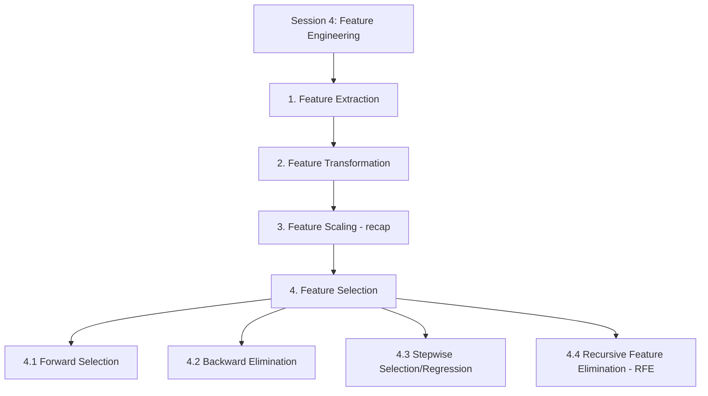
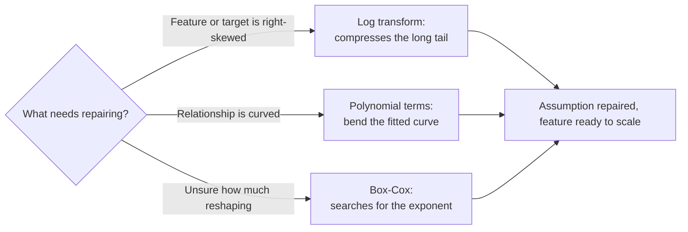
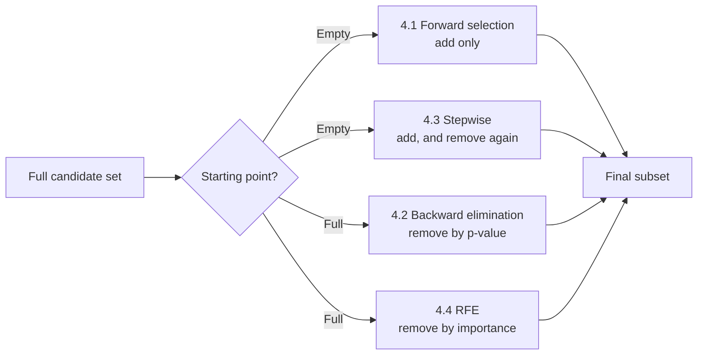

# Session 4: Feature Engineering

> Topic: Feature Engineering
> Date: Aug 3, 2026

## Concept Hierarchy

**Reordering note:** The four supplied topics were already in the natural pipeline order — derive candidate features, reshape them, bring them to a comparable scale, then choose the final subset — so nothing was reordered. **Feature Scaling** (3) was fully derived in Session 1 and appears here only as a positioned recap, per the anti-repetition rule. Session 1 also previewed extraction, transformation and selection in a single introductory section; this session gives each its own full treatment rather than repeating that preview. No topic was dropped; all four selection methods appear exactly once.

**Running example used throughout:** the **house price prediction** case from Sessions 1 to 3, with candidate features area, number of rooms, age, sale date, and the locality dummies introduced in Session 3.

**Analogy families used in this session:** Section 1 runs on **packing a suitcase**; Section 2 on **a ruler with a hinge**, extending the straight-ruler-on-a-curved-plank image from Session 3; and Section 4 on **selection trials for a team**, with each of the four methods a different way of running those trials.

---

## 1. Feature Extraction

### Picture this

You are packing a suitcase for a two-week trip and it will not close. On the bed are three heavy coats. One is warm and waterproof, one is warm and windproof, one is warm and slightly smarter. Every one of them is mostly *warm* — that is what they overwhelmingly have in common — and the differences between them are marginal. You put all three back and pack a single coat that covers the same range of weather. Nothing you actually needed has been left behind; what has gone is the triple repetition of "warm".

### Mapping

| Analogy element                                             | What it really is                              |
| ----------------------------------------------------------- | ---------------------------------------------- |
| Each of the three coats                                     | One raw feature                                |
| The warmth all three share                                  | The variance they hold in common               |
| Their marginal differences                                  | The variance unique to each                    |
| The single coat that covers the same range                  | A principal component — a new, derived feature |
| The suitcase that now closes                                | A smaller, more manageable feature set         |
| Packing a made sandwich rather than loose bread and filling | A domain-derived feature such as house age     |

### Meaning

Feature extraction derives a new set of features from the raw data, either by combining columns using knowledge of the problem or by compressing several overlapping columns into fewer new ones that retain most of their information.

> **Formal definition:** Feature extraction is the process of transforming raw data into a new, reduced set of informative features, either through domain-driven derivation or through dimensionality-reduction techniques such as PCA.

### Why it matters

Raw columns are frequently either unusable in their given form — a calendar date is a poor number — or redundant with one another, which is the multicollinearity problem from Session 3 arriving one stage earlier. Extraction addresses both before anything else is attempted.

### How it works

There are two quite different routes to the same goal.

1. **Domain-based derivation** — combine or derive a column using knowledge of what the problem means. This is the sandwich rather than the loose ingredients: `house_age = sale_year - year_built` turns two nearly useless raw columns into one strongly predictive feature.
2. **Dimensionality-reduction extraction** — techniques such as **Principal Component Analysis (PCA)** find the directions along which several correlated columns vary together, and build new component features along those directions, so that a handful of components carries most of what the original set carried.

**Example** — Three location features sit in the dataset: distance to school, distance to hospital, distance to market. In a compact city they move together almost perfectly, so keeping all three invites unstable coefficients. PCA can extract a single "amenity proximity" component that reproduces most of their combined variation — the one coat instead of three.

**Important details** — The distinction to hold on to is that extraction *creates* new features that did not previously exist, whereas selection (Section 4) only chooses among features that already do. The cost of extraction is interpretability: `house_age` still means something a client would understand, while a principal component is a weighted blend with no natural name. Where the analogy breaks down: a coat you did not pack is still in the wardrobe, whereas the discarded portion of variance in PCA is genuinely gone from the model's view.

### Core takeaway

Extraction is worthwhile because the information a set of columns carries is almost always smaller than the number of columns carrying it.

### Exam focus

The extraction-versus-selection distinction — creates new features against chooses existing ones — is the single most commonly tested point in this session.

---

## 2. Feature Transformation

### Picture this

Session 3 left a steel ruler lying against a curved plank, gaps opening at the ends however you positioned it. Now put a hinge in the middle of the ruler. It is still a rigid, predictable object — you have not replaced it with a piece of rope — but it can now follow a bend the straight version never could. Separately, imagine an accordion whose far end is squeezed shut: the notes at that end crowd together while the near end stays open. Nothing has been thrown away; the spacing has been redistributed.

### Mapping

| Analogy element                       | What it really is                                       |
| ------------------------------------- | ------------------------------------------------------- |
| The straight steel ruler              | A model with only the raw predictor $x$                 |
| The curved plank                      | A genuinely non-linear relationship                     |
| Adding a hinge                        | Adding a polynomial term such as $x^2$                  |
| The ruler still being rigid, not rope | The model remaining linear in its coefficients          |
| The accordion's squeezed far end      | A long right tail being compressed                      |
| Its still-open near end               | Small values being left comparatively spread out        |
| The accordion's total length changing | The distribution's shape changing, not merely its range |

### Meaning

Feature transformation applies a mathematical function to a variable in order to change the shape of its distribution or the shape of its relationship with the target, most often to reduce skew or to let a linear model follow a curve.

> **Formal definition:** Feature transformation is the application of a mathematical function to a variable to change its distribution shape, commonly to reduce skewness or to model non-linear relationships within a linear framework.

### Why it matters

Two of Session 3's broken assumptions are repaired here rather than anywhere else. A curved relationship — the ruler on the plank — is repaired by a polynomial term. A heavily skewed target, which produces skewed residuals and often a funnel of growing error variance, is repaired by a log transform. Both repairs are transformations, which is why the topic sits between extraction and scaling rather than as an afterthought.

### How it works

**Feel for the quantity (log transform)** — The log of a number grows ever more slowly as the number grows. Doubling a small value moves its log by the same amount as doubling a large one, which is exactly why an enormous value gets pulled in hard while a modest one barely moves.

**Formula (Log transform)** — **Essential**
$$x' = \log(x), \quad \text{or} \quad x' = \log(x+1) \text{ when } x \text{ can be zero}$$
**Where** — $x$: the original feature value, which must be strictly positive for $\log(x)$ to be defined; $x'$: the transformed value; the $+1$ variant: the standard adjustment when the column legitimately contains zeros, since $\log(0)$ is undefined.

**Example** — House prices cluster between 40 and 80 lakh with a thin tail stretching past 300 lakh. Taking logs pulls 300 in far harder than it pulls 40, so the long tail collapses and the distribution becomes close to symmetric.

**Interpretation** — Using $\log(\text{price})$ as the regression target makes the residuals much more likely to satisfy the normality assumption, and typically flattens the heteroscedastic funnel at the same time, because both problems came from the same skew.

**Feel for the quantity (polynomial transform)** — Adding $x^2$ gives the model a term that grows slowly at small $x$ and rapidly at large $x$, so its coefficient can bend the fitted curve upward or downward at the extremes while barely disturbing the middle.

**Formula (Polynomial transform)** — **Exam-important**
$$\hat y = b_0 + b_1x + b_2x^2 + \dots + b_dx^d$$
**Where** — $x$: the original predictor, such as area; $x^2, \dots, x^d$: additional predictor columns created by raising $x$ to successive powers; $d$: the degree, i.e. how many bends the curve is permitted; $b_0, \dots, b_d$: the coefficients, still estimated by ordinary least squares; $\hat y$: the predicted target.

**Example** — Price rises steeply with area up to about 2000 sq. ft. and then flattens. Adding $x_{area}^2$ with a negative coefficient lets the fitted curve rise and then level off, which a single straight line cannot do at any slope.

**Interpretation** — This is the hinge in the ruler. The model is still *linear regression* — it is linear in its coefficients $b_0, b_1, b_2$, which is all that "linear" ever meant — and it is still fitted by the same least squares. Only the predictor set has grown.

**Important details (Box-Cox transform)** — **Additional depth.** The log transform fixes one particular reshaping in advance. The Box-Cox transform instead searches for the right amount of reshaping.

**Formula (Box-Cox transform)** — **Additional depth**
$$x' = \begin{cases} \dfrac{x^\lambda - 1}{\lambda} & \lambda \neq 0 \\[6pt] \log(x) & \lambda = 0 \end{cases}$$
**Where** — $x$: the original value, which must be positive; $\lambda$: the transformation parameter, chosen automatically to make the transformed feature as close to normally distributed as possible; $x'$: the transformed value. Note that $\lambda = 0$ recovers the log transform exactly, so the log is a special case rather than a rival.

**Important details** — Transformation and scaling are frequently confused and are not the same operation: scaling shifts and stretches a distribution while leaving its shape untouched, whereas transformation deliberately changes the shape. A skewed feature is still skewed after standardisation. There is a cost too — a coefficient on $\log(\text{price})$ no longer reads in rupees, so interpretability is traded for validity. Where the analogy breaks down: a hinge in a ruler is visible and countable, whereas choosing a polynomial degree that is too high produces a curve that bends to follow noise, a failure Session 5 names and treats.

### Core takeaway

Transformation earns its place because a straight-line method applied to a bent relationship is not wrong about the method — it is wrong about the axis, and reshaping the axis is cheaper than abandoning the method.

### Exam focus

Know the log transform's purpose (reduce right skew) and the polynomial transform's purpose (follow curvature while remaining a linear model). The most-tested subtlety is why a polynomial fit is still called linear regression.

---

## 3. Feature Scaling (recap)

Feature scaling was derived in full in Session 1, including Min-Max normalization and standardization. Its place in this pipeline is the point that matters here: it is applied *after* extraction and transformation, because those two steps are what create the final set of columns to be scaled — scaling first and then transforming would simply undo the work. Its statistics must still be computed from the training split alone, for the leakage reason established in Session 1.

**Connection** — Candidate features have now been derived, reshaped and scaled. The pipeline's final question is which of them belong in the model at all.

---

## 4. Feature Selection

### Picture this

Trials for a team. Fifty players have turned up and eleven places are available. Nobody claims that all fifty are useless — but eleven have to be chosen, and a squad of fifty on the pitch would obstruct itself. Worse, two of the hopefuls play identically in the same position: picking both wins you nothing and makes it impossible to say which of them the result depended on. The coach needs a procedure, not an opinion, and the four sections below are four different procedures.

### Mapping

| Analogy element                          | What it really is                                  |
| ---------------------------------------- | -------------------------------------------------- |
| One player at the trial                  | One candidate feature                              |
| The eleven places available              | The final feature subset                           |
| A player's contribution in a trial match | A feature's statistical significance or importance |
| Two hopefuls who play identically        | Two collinear features                             |
| Fifty players obstructing each other     | Overfitting from too many features                 |
| Fielding only three players              | Underfitting from too few                          |
| The coach's procedure                    | A feature selection algorithm                      |

### Meaning

Feature selection is the systematic choice of a subset of the available predictors, using a stated criterion applied repeatedly, without creating any new features.

> **Formal definition:** Feature selection is the process of systematically choosing a subset of the available predictor variables that contribute most to a model's predictive performance, without creating any new features.

### Why it matters

Both extremes are real failures. Too many features and the model chases noise and inherits unstable, collinear coefficients; too few and it cannot represent the pattern at all. Doing the choosing by intuition also does not survive scrutiny — a stated procedure can be defended, repeated, and checked.

### How it works

Every method differs on only three things: where it starts, which direction it moves, and what criterion it uses to judge a player.

### Core takeaway

Feature selection is a search problem, and the four methods are four different compromises between how much of the space they explore and how long they take to do it.

### 4.1 Forward Selection

**Meaning** — Forward selection begins with no predictors at all and repeatedly adds whichever remaining candidate improves the model most, stopping once nothing left makes a significant difference — building the team one signing at a time.

> **Formal definition:** Forward selection is a stepwise feature selection method that starts with no predictors and iteratively adds the most statistically significant remaining predictor until no further addition significantly improves the model.

**How it works**

1. Start with an intercept-only model — an empty team sheet.
2. For every candidate not yet included, test what it would contribute if added, judged by its p-value or by the gain in Adjusted $R^2$.
3. Add the single strongest candidate.
4. Repeat steps 2 and 3 until no remaining candidate clears the threshold, commonly a p-value of 0.05.

**Example** — Starting empty on the house-price data: area goes in first as the strongest single predictor, then rooms, then the locality dummies. Age is tested at every round and never clears 0.05, so it never enters.

**Important details** — The method is **greedy**: it takes the best option available at each step and never revisits it. That makes it fast and makes it fallible, because a player who was the obvious first pick can become redundant once a similar player joins, and forward selection has no mechanism to notice.

**Core takeaway** — Forward selection is cheap precisely because it never reconsiders, which is the same reason it can finish holding a feature it no longer needs.

**Exam focus** — Know that it only ever adds, and that this is exactly the limitation stepwise selection was built to remove.

### 4.2 Backward Elimination

**Meaning** — Backward elimination starts with every candidate in the model and repeatedly removes the least significant one, stopping when everything remaining clears the threshold — starting with all fifty on the pitch and sending off the weakest each round.

> **Formal definition:** Backward elimination is a stepwise feature selection method that starts with all candidate predictors and iteratively removes the least statistically significant predictor until all remaining predictors are significant.

**How it works**

1. Fit the model with every candidate included.
2. Find the predictor with the highest p-value, i.e. the weakest evidence of an effect.
3. If that p-value exceeds the threshold, drop the predictor and refit.
4. Repeat until every survivor is below the threshold.

**Example** — Starting with area, rooms, age and the locality dummies all in: age has the highest p-value at 0.6 and is removed first. After refitting, everything remaining sits below 0.05, so the procedure stops.

**Important details** — Also greedy, in the opposite direction: once a player is sent off they are never called back, even if a later removal would have made them useful again. It also has a practical constraint that forward selection does not — the full model must be fittable in the first place, which fails when there are more candidate features than observations.

**Core takeaway** — Backward elimination judges each feature in the presence of all the others, which makes it better at spotting redundancy than forward selection but useless when the full model cannot be fitted.

**Exam focus** — The forward-versus-backward comparison is very commonly asked. Anchor it on starting point and direction.

### 4.3 Stepwise Selection/Regression

**Meaning** — Stepwise selection runs forward selection but, after every addition, re-examines everything already in the model and removes anything that has since become insignificant — the coach who re-checks the squad each time a new signing arrives.

> **Formal definition:** Stepwise selection is a feature selection method that combines forward selection and backward elimination, adding significant predictors and removing any that subsequently become insignificant, at each iteration.

**Why it matters** — This closes the exact gap named in 4.1. A feature's significance is not a fixed property; it depends entirely on what else is in the model. When a later addition overlaps heavily with an earlier one, the earlier one's evidence collapses, and only a method that re-checks will notice.

**Example** — Area is added first and looks excellent. Rooms is added next, and because rooms and area carry much the same information in this dataset, area's own p-value rises above 0.05. Forward selection would keep area regardless. Stepwise selection re-checks at that moment and removes it.

**Important details** — More thorough and correspondingly more expensive, since every included feature is re-evaluated at every step. It is still not guaranteed to find the best possible subset — it explores more of the space than the one-directional methods, not all of it.

**Core takeaway** — Stepwise selection exists because significance is a property of a feature *within a model*, not of the feature by itself, so any procedure that decides once has decided too early.

**Exam focus** — Be able to state the specific gap it closes, ideally with the area-and-rooms example, rather than merely saying it "combines both".

### 4.4 Recursive Feature Elimination (RFE)

**Meaning** — RFE fits the model on all current features, ranks them by an importance measure rather than a p-value, discards the weakest, and repeats until a target number of features remains — cutting the squad by the coach's own ratings rather than by match statistics.

> **Formal definition:** Recursive Feature Elimination is a feature selection method that repeatedly fits a model, ranks features by an importance measure, and removes the least important feature until a specified number of features remains.

**How it works**

1. Fit the model using every feature currently in the set.
2. Rank the features by importance — the absolute size of the fitted coefficient, or a model-specific importance score.
3. Remove the single lowest-ranked feature.
4. Refit and repeat until the target count is reached.

**Example** — With area, rooms, age and the locality dummies, RFE fits the full model, finds age has the smallest coefficient magnitude, drops it, refits on the remaining three, ranks again, and continues to the requested squad size.

**Important details** — The one distinction that matters versus backward elimination is the criterion: importance rather than a p-value. Because many model types produce importance scores but only some produce p-values, RFE works with tree-based models and others where backward elimination simply cannot be run. One caveat follows directly: coefficient magnitude is only a meaningful ranking when the features are on comparable scales, which is why Section 3's scaling step has to have happened first.

**Core takeaway** — RFE trades statistical rigour for reach, using a criterion every model can supply rather than one only some models can.

**Exam focus** — The removal criterion is the examinable difference. Also be ready to state why scaling must precede it.

#### Comparison: Feature Selection Methods

| Aspect                       | Forward Selection           | Backward Elimination                | Stepwise Selection                      | RFE                                        |
| ---------------------------- | --------------------------- | ----------------------------------- | --------------------------------------- | ------------------------------------------ |
| Starting point               | Empty model                 | Full model                          | Empty model                             | Full model                                 |
| Direction                    | Adds only                   | Removes only                        | Adds, and can remove                    | Removes only                               |
| Criterion                    | Lowest p-value to add       | Highest p-value to remove           | p-value, re-checked after each addition | Lowest importance or coefficient magnitude |
| Reconsiders a past decision? | No                          | No                                  | Yes                                     | No                                         |
| Stopping rule                | Nothing left is significant | Everything remaining is significant | Nothing to add and nothing to remove    | Target feature count reached               |
| Works without p-values?      | No                          | No                                  | No                                      | Yes                                        |

The central difference is between direction and criterion: forward and backward move one way using significance, stepwise moves both ways using significance, and RFE moves one way using importance, which is what lets it work with models that produce no p-values at all. Choose forward or backward for a quick, defensible search; stepwise when redundancy is likely to emerge only after several features are in; and RFE when the model type provides no p-values or when a specific feature count is required.

**Connection** — Sections 1 to 4 complete the feature-engineering pipeline: derive, reshape, scale, select. The clean feature set it produces is the input the next session assumes when it turns from *which features* the model uses to *how* the model is fitted and controlled.

---

## Examination Preparation

### Must understand

- Why extraction creates features while selection only chooses among existing ones (Section 1 against Section 4).
- Why transformation changes a distribution's shape while scaling changes only its range and spread (Section 2 against Section 3).
- Why a polynomial fit is still linear regression (Section 2).
- Why forward selection's inability to remove a feature is a genuine limitation, and how stepwise selection removes it (4.1 against 4.3).
- Why RFE's importance-based criterion extends its reach beyond backward elimination's p-value criterion (4.2 against 4.4).

### Must remember

- Feature extraction — see the formal definition in Section 1; two routes, domain derivation and dimensionality reduction such as PCA.
- Log transform reduces right skew; polynomial terms follow curvature while the model stays linear in its coefficients; Box-Cox searches for the exponent automatically (Section 2).
- Scaling formulas were established in Session 1 and are applied after extraction and transformation (Section 3).
- Forward selection starts empty and only adds; backward elimination starts full and only removes; stepwise does both; RFE removes by importance until a target count (4.1–4.4).
- Only RFE functions without p-values, which is why it suits tree-based models (4.4).

### Common question patterns

- _2-mark:_ Define feature extraction, feature transformation, forward selection, or RFE.
- _5-mark:_ Compare forward selection and backward elimination; explain why stepwise selection improves on forward selection; compare the log and polynomial transforms.
- _10-mark:_ Explain the complete feature engineering pipeline with an example at each stage; explain all four selection methods with their criteria, stopping rules and a comparison.

### Answer-writing guidance

- _2-mark:_ the formal definition stated precisely, plus one supporting example.
- _5-mark:_ formal definition, main explanation, key points, and one example, formula or small diagram.
- _10-mark:_ introduction, formal technical definition, Mermaid diagram or workflow, detailed explanation, worked example, advantages and limitations, conclusion.

### Model answers

_2-mark:_ "Recursive Feature Elimination is a feature selection method that repeatedly fits a model, ranks the features by an importance measure such as coefficient magnitude, and removes the least important feature until a specified number of features remains. For example, given area, rooms, age and locality dummies, RFE would remove age first if its scaled coefficient had the smallest magnitude."

_5-mark:_ "Forward selection and backward elimination are both greedy, one-directional feature selection methods that differ in where they begin. Forward selection starts with an intercept-only model and repeatedly adds whichever remaining predictor is most statistically significant, stopping when no remaining predictor clears the chosen threshold. Backward elimination starts with all candidate predictors included and repeatedly removes whichever is least significant, stopping when every survivor clears the threshold. Two consequences distinguish them in practice. First, because both are greedy, neither can reverse an earlier decision: forward selection cannot remove a predictor that a later addition has rendered redundant, and backward elimination cannot recall a predictor it has already dropped. Second, backward elimination judges each predictor in the presence of all the others, which makes it better at detecting redundancy, but it requires the full model to be fittable, which fails when the candidate features outnumber the observations — a situation forward selection handles without difficulty. The shared inability to reverse a decision is exactly the gap that stepwise selection was designed to close."

_10-mark:_ "Introduction: once raw data has been cleaned, a systematic process is required to determine which features a model should actually be given, since both an excess and a shortage of features degrade performance in different ways. Definition: feature selection is the process of systematically choosing a subset of the available predictors that contribute most to predictive performance, without creating any new features. Diagram: reproduce the selection flowchart from Section 4, distinguishing methods by starting point and direction. Detailed explanation: forward selection begins with an empty model and adds the most significant remaining predictor at each step, stopping when none clears the threshold; backward elimination begins with the full model and removes the least significant predictor at each step, stopping when all survivors clear it; stepwise selection performs forward-style additions but re-examines the whole model after each one and removes any predictor whose significance has collapsed, which repairs forward selection's inability to reverse an earlier choice; and Recursive Feature Elimination ranks all current features by an importance measure such as coefficient magnitude, removes the weakest, refits and repeats until a target count is reached, which allows it to operate with model types that produce no p-values. Example: for a house-price model over area, rooms, age and locality dummies, backward elimination might remove age first because it has the highest p-value, while RFE might remove it first because it has the smallest scaled coefficient — the same outcome reached by different criteria. Advantages: all four replace judgement with a stated, repeatable procedure, reducing overfitting and collinearity in a way that can be defended. Limitations: forward, backward and RFE are greedy and are not guaranteed to find the optimal subset; stepwise explores more but costs more; and RFE's coefficient-magnitude ranking is only meaningful once features have been scaled. Conclusion: the choice among the four depends on whether earlier decisions must be revisable, whether the model type supplies p-values, and whether a specific feature count is required."

## Practice Questions

### Basic recall

1. Define feature extraction and name one technique.
   **Answer:** Deriving a new, reduced set of informative features from raw data, by domain derivation or by dimensionality reduction; Principal Component Analysis is the standard example (Section 1).
2. What is the purpose of a log transform?
   **Answer:** To compress a long right tail and pull a right-skewed distribution towards symmetry (Section 2).
3. State the stopping rule for forward selection.
   **Answer:** Stop when no remaining feature clears the significance threshold, commonly a p-value of 0.05 (Section 4.1).
4. State the stopping rule for backward elimination.
   **Answer:** Stop when every remaining feature's p-value is below the threshold (Section 4.2).
5. What criterion does RFE use to decide which feature to remove?
   **Answer:** Feature importance or coefficient magnitude, not a p-value (Section 4.4).

### Conceptual

1. Why is PCA feature extraction rather than feature selection?
   **Answer:** It creates new component features by combining the originals; selection only chooses among features that already exist (Section 1).
2. Why does a polynomial transform still count as linear regression?
   **Answer:** "Linear" refers to linearity in the coefficients, not in the predictors. Adding $x^2$ as a column leaves the equation linear in $b_0, b_1, b_2$ and leaves the fitting method unchanged (Section 2).
3. Why can forward selection end up keeping a feature that has become redundant?
   **Answer:** It is greedy and only adds, so a feature whose significance collapses after a later addition is never re-examined (Sections 4.1 and 4.3).
4. Why can RFE be used with models that backward elimination cannot?
   **Answer:** Backward elimination removes by p-value, which only some model types produce; RFE removes by importance, which is available from tree-based and other models as well (Section 4.4).
5. Why must feature scaling precede RFE?
   **Answer:** RFE ranks by coefficient magnitude, and magnitudes are only comparable when the features share a scale — otherwise a feature measured in small units appears important merely because its coefficient is large (Sections 3 and 4.4).
6. Why does transforming a feature not remove the need to scale it?
   **Answer:** Transformation changes the distribution's shape; scaling changes its range and spread. A log-transformed feature can still occupy a completely different range from its neighbours (Sections 2 and 3).

### Comparison

1. Compare feature extraction and feature selection.
   **Answer:** Extraction creates new features by derivation or compression; selection chooses a subset of existing features and creates nothing (Sections 1 and 4).
2. Compare forward selection and backward elimination.
   **Answer:** See the comparison table in Section 4 — opposite starting points and directions, both greedy, both p-value driven, differing in whether the full model must be fittable.
3. Compare stepwise selection and Recursive Feature Elimination.
   **Answer:** Stepwise adds and removes using p-values and can revisit decisions; RFE only removes, uses importance rather than significance, and stops at a target feature count (Sections 4.3–4.4).

### Scenario / application

1. A dataset has three highly correlated distance features. Which technique reduces them, and why?
   **Answer:** PCA (Section 1), because it compresses correlated columns into fewer components carrying most of their combined variation, which also removes the collinearity those three would otherwise introduce.
2. After forward selection, an early feature now has a p-value of 0.4 because of a later addition. Which method should have been used?
   **Answer:** Stepwise selection (Section 4.3), which re-examines every included feature after each addition and removes any whose significance has collapsed.
3. You are selecting features for a tree-based model that produces no p-values. Which method applies?
   **Answer:** Recursive Feature Elimination (Section 4.4), since it ranks by importance rather than significance.

### Long-answer

1. Explain the complete feature engineering pipeline from extraction to selection, with an example at each stage.
   **Answer:** See Sections 1 to 4 in order — extract, transform, scale, select — and the 10-mark model answer in Examination Preparation.
2. Explain all four feature selection methods, their stopping rules, and the difference between p-value-based and importance-based removal.
   **Answer:** See Sections 4.1 to 4.4 and their comparison table; forward, backward and stepwise use p-values, RFE uses importance.

## Quick Revision

- **One-sentence summary:** Feature engineering builds the model's input by deriving new features from raw data, reshaping their distributions, scaling them to comparable ranges, and finally selecting the subset that earns its place by a stated procedure.
- **Hierarchy:** see the Concept Hierarchy diagram at the top of this file.
- **Essential definitions:** feature extraction (1), feature transformation (2), feature scaling (3, from Session 1), forward selection, backward elimination, stepwise selection, RFE (4.1–4.4).
- **Key formulas:** log transform, polynomial transform, Box-Cox (Section 2).
- **Most important comparison:** the four selection methods (Section 4 table), because it decides which procedure suits which situation.
- **5 exam keywords:** Principal Component Analysis, Box-Cox, greedy algorithm, p-value threshold, feature importance.
- **5 common mistakes:** confusing extraction with selection; confusing transformation with scaling; assuming forward selection can drop a redundant feature; assuming backward elimination and RFE use the same criterion; running RFE on unscaled features and trusting the coefficient ranking.

### Mental Models

- **1. Feature extraction** — three overlapping coats replaced by one; the information a set of columns carries is smaller than the number of columns carrying it.
- **2. Feature transformation** — a hinge in the steel ruler, and an accordion squeezed at one end; reshaping the axis is cheaper than abandoning the method.
- **4. Feature selection** — fifty players at a trial for eleven places; a search problem with four different compromises.
- **4.1 Forward selection** — signing one player at a time and never reconsidering; cheap for the same reason it can finish holding a redundant feature.
- **4.2 Backward elimination** — starting with everyone on the pitch and sending off the weakest; judges each in the presence of all the others.
- **4.3 Stepwise selection** — re-checking the squad after every signing; significance is a property of a feature within a model, not of the feature alone.
- **4.4 RFE** — cutting by the coach's ratings rather than match statistics; trades rigour for reach.

## Topic Coverage

- Feature Extraction — Covered in Section 1 (source: `04-feature-engineering.md`, Session 4)
- Feature Transformation — Covered in Section 2 (source: `04-feature-engineering.md`, Session 4)
- Feature Scaling — Covered in Section 3 as a positioned recap (source: `04-feature-engineering.md`, Session 4; merged with Session 1 Section 2.3, where the formulas were derived)
- Feature Selection — Covered in Section 4 (source: `04-feature-engineering.md`, Session 4)
- Forward Selection — Covered in Section 4.1 (source: `04-feature-engineering.md`, Session 4)
- Backward Elimination — Covered in Section 4.2 (source: `04-feature-engineering.md`, Session 4)
- Stepwise selection/regression — Covered in Section 4.3 (source: `04-feature-engineering.md`, Session 4)
- Recursive Feature Elimination (RFE) — Covered in Section 4.4 (source: `04-feature-engineering.md`, Session 4)

### Gaps to Look Up

- **How PCA actually works** — named in Section 1 as the standard extraction technique and used in the worked example, but its mechanism (eigenvectors of the covariance matrix, explained variance per component) is never described in the material. Needed to decide how many components to keep.
- **How the Box-Cox $\lambda$ is chosen** — Section 2 states that the exponent is found automatically, without saying by what criterion. Needed to apply the transform rather than merely recognise it.
- **Choosing the polynomial degree $d$** — Section 2 introduces the degree as a modelling choice but gives no method for setting it; the validation machinery that answers this appears in Session 5.
