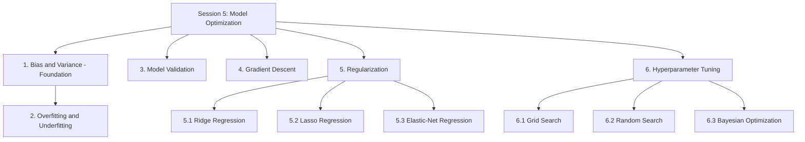
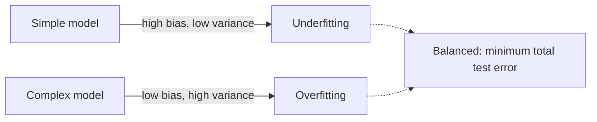
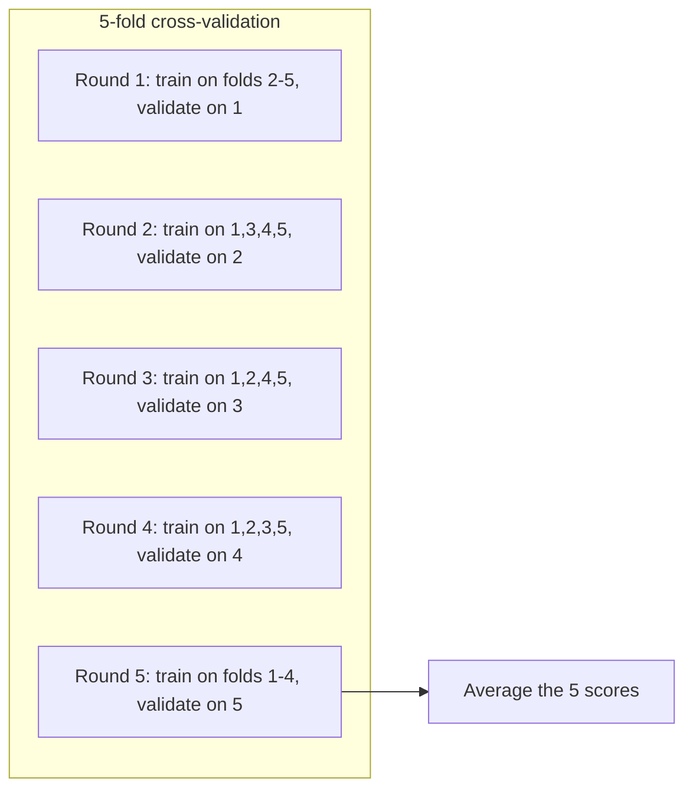

# Session 5: Model Optimization

> Topic: Model Optimization
> Date: Aug 3, 2026

## Concept Hierarchy

**Reordering note:** Under Regularization, **Ridge** is explained before **Lasso** (the supplied order was the reverse) because Ridge's penalty is the simpler case and Lasso is most easily understood as the same idea with a penalty that pulls differently near zero. **Bias and Variance** is labelled a **Foundation**: Session 1 introduced overfitting and underfitting only as vocabulary, and this session supplies the mechanism behind them before formally revisiting the terms in Section 2. No topic was dropped or merged; every supplied item appears exactly once. **Elastic-Net** (5.3) was added afterwards, since the source material names it as the third regularization variant but the original list omitted it.

**Running example used throughout:** the **house price prediction** case from Sessions 1 to 4, using the engineered feature set from Session 4. The question has changed: not which features the model uses, but how it is fitted, checked and controlled.

**Analogy families used in this session:** Section 1 uses **arrows at an archery target**; Sections 2 and 3 share an **exam preparation** image; Section 4 uses a **ball rolling downhill in fog**; Section 5 uses **springs and constant-force pulls tethering each coefficient to zero**; and Section 6 uses **tuning a radio dial**.

---

## 1. Bias and Variance (Foundation)

### Picture this

Two archers shoot ten arrows each. The first archer's arrows land in a tight cluster, beautifully grouped — a hand's width to the left of the bullseye, every single one. Her technique is immaculate and her sight is misaligned. The second archer's arrows scatter all over the target; average their positions and the centre of that scatter sits right on the bullseye, but no individual arrow is near it. Both archers missed. They missed in ways that need opposite corrections, and giving either one the other's advice makes things worse.

### Mapping

| Analogy element                               | What it really is                                         |
| --------------------------------------------- | --------------------------------------------------------- |
| One arrow                                     | One prediction from one fitted model                      |
| The bullseye                                  | The true underlying value                                 |
| The first archer's consistent leftward offset | Bias — a systematic error present in every fit            |
| The second archer's wide scatter              | Variance — sensitivity to which training sample was drawn |
| Re-shooting the whole round                   | Re-fitting the model on a fresh training sample           |
| Gusts of wind nobody can control              | Irreducible noise $\sigma^2$                              |
| Total distance from the bullseye              | Expected test error                                       |

### Meaning

Bias is the error that comes from a model's assumptions being too simple to represent the real relationship, and variance is the error that comes from a model responding too strongly to the particular training sample it happened to be given.

> **Formal definition:** Bias is the error introduced by approximating a real-world relationship with a simplified model; variance is the error introduced by a model's sensitivity to fluctuations in the training sample.

### Why it matters

This is the mechanism behind the overfitting and underfitting vocabulary from Session 1. It explains why the two failures need opposite corrections, and — more usefully — why reducing one usually increases the other, which is the central tension in every decision that follows in this session.

**Feel for the quantity** — Squared bias measures how far the _average_ of many re-fitted models sits from the truth, so it stays exactly the same however much data you gather with the same model form. Variance measures how far individual fits sit from that average, so it shrinks as the sample grows. A high-bias, low-variance model is the first archer; a low-bias, high-variance model is the second.

**Formula (Bias-variance decomposition of expected test error)** — **Essential**
$$E\big[(y - \hat f(x))^2\big] = \big[\text{Bias}(\hat f(x))\big]^2 + \text{Var}(\hat f(x)) + \sigma^2$$
**Where** — $y$: the true target value at the point $x$; $\hat f(x)$: the model's prediction at $x$; $E[\cdot]$: the expectation taken over many different training samples, i.e. the average across many repeated rounds of shooting; $\text{Bias}(\hat f(x)) = E[\hat f(x)] - f(x)$: the gap between the average prediction and the true function $f(x)$; $\text{Var}(\hat f(x))$: how much the prediction itself varies across those training samples; $\sigma^2$: the irreducible noise in the data, which no model can remove.

**Example** — Fitting a straight line to a genuinely curved price relationship produces predictions consistently too low for large houses, no matter which sample of houses was used — the first archer's misaligned sight, which is high bias. Fitting a tenth-degree polynomial that passes through every training point exactly produces near-perfect training predictions, but a slightly different sample of houses would yield a wildly different curve and wildly different predictions — the second archer's scatter, which is high variance.

**Interpretation** — Total expected error is the sum of three terms, only two of which you can influence. Reducing either bias or variance to zero while ignoring the other does not minimise the total.

**Important details** — As model complexity rises — more predictors, higher polynomial degree — bias typically falls while variance rises, which is why there is a complexity that minimises the total rather than a rule that more flexible is better. The $\sigma^2$ term is a genuine floor: a model reporting zero error on its test set has not beaten it, it has leaked. Where the analogy breaks down: an archer can correct a misaligned sight without affecting her grouping, whereas in a model the two are coupled — reducing bias by adding flexibility almost always adds variance.

### Core takeaway

Total error splits into being wrong in the same direction every time and being wrong in a different direction every time, and because the usual cures for one worsen the other, optimization is a balancing act rather than a maximisation.

### Exam focus

Know the decomposition formula with all four terms, and be ready to classify a described scenario as high bias or high variance from the symptoms given.

---

## 2. Overfitting and Underfitting

### Picture this

Two students prepare for the same exam. The first memorises last year's paper answer for answer, word for word. On last year's paper he is flawless. Hand him this year's paper, where the same ideas appear in different questions, and he is lost — he learned the answers, not the subject. The second student skimmed the chapter titles and nothing else. He is equally lost this year, and he was already lost on last year's paper too. That difference is the whole diagnosis.

### Mapping

| Analogy element                          | What it really is                                |
| ---------------------------------------- | ------------------------------------------------ |
| Last year's paper                        | The training set                                 |
| This year's paper                        | The test or validation set                       |
| Memorising answers word for word         | Overfitting                                      |
| Flawless on last year, lost on this year | Low training error, high test error              |
| Skimming only the chapter titles         | Underfitting                                     |
| Lost on both papers alike                | High training error and high test error together |
| Noise in last year's specific wording    | Noise in the training data that was fitted       |

### Meaning

Overfitting is a model learning the training data's noise along with its pattern, so that it performs far worse on new data than on the data it was fitted to; underfitting is a model too simple to capture the pattern at all, so that it performs poorly on both.

> **Formal definition:** Overfitting occurs when a model learns the training data, including its noise, so closely that it fails to generalize to new data; underfitting occurs when a model is too simple to capture the underlying pattern, performing poorly even on training data.

### Why it matters

These are the observable symptoms of the two error sources from Section 1: overfitting is what high variance looks like from outside, and underfitting is what high bias looks like. Since the cures are opposite, misreading one as the other actively makes the model worse — adding complexity to an overfitted model, or regularising an underfitted one.

### How it works

The diagnosis needs two numbers, never one. Compare error on the training set against error on held-out data:

- A large gap — low training error, much higher test error — means overfitting.
- Both errors high and close together means underfitting.
- Both errors low and close together is what you are aiming for.

Notice that test error alone cannot distinguish them. A test error of 12 could be either student.

#### Comparison: Overfitting vs Underfitting

| Aspect         | Overfitting                                           | Underfitting                                        |
| -------------- | ----------------------------------------------------- | --------------------------------------------------- |
| Training error | Very low                                              | High                                                |
| Test error     | High, with a large gap from training error            | High, close to training error                       |
| Bias           | Low                                                   | High                                                |
| Variance       | High                                                  | Low                                                 |
| Typical cause  | Too complex, too many features, too little data       | Too simple, too few features, over-regularised      |
| Typical repair | Regularisation (Section 5), more data, fewer features | More features, more complexity, less regularisation |

The central difference is the _gap_, not the level: overfitting shows a wide gap between training and test error, underfitting shows both high and together. Diagnose from the pair of numbers, then apply the matching repair from the table — never the other one.

**Example** — A tenth-degree polynomial on a few hundred house records reaches near-zero training error and a very large test error: the first student. A model that predicts the average price for every house, ignoring area entirely, has high error on both: the second.

**Important details** — Where the analogy breaks down: a student can be told to study differently, whereas a model cannot change its own capacity — capacity is chosen by you, which is exactly why Sections 5 and 6 exist. Note also that "more data" repairs overfitting but does nothing at all for underfitting; a model incapable of representing a curve does not become capable with a million rows.

### Core takeaway

Overfitting and underfitting are not degrees of the same failure but opposite failures, which is why the diagnosis needs the gap between two errors rather than the size of one.

### Exam focus

Given a pair of training and test error values, state which condition applies and name the repair. This is a near-guaranteed question.

---

## 3. Model Validation

### Picture this

The exam is in a month and you have five past papers. Study all five and you have no honest way to test yourself — every paper you attempt is one you have already seen. So you seal one, study the other four, and sit the sealed one under exam conditions. Then, since one paper is a thin basis for judgement, you do it again with a different paper sealed, and again, until each of the five has been sat once cold. Five honest scores, averaged, tell you far more than any one of them.

### Mapping

| Analogy element                | What it really is                     |
| ------------------------------ | ------------------------------------- |
| The five past papers           | The dataset split into $k$ folds      |
| Sealing one paper              | Holding out one fold for validation   |
| Studying the other four        | Training on the remaining $k-1$ folds |
| Sitting the sealed paper cold  | Evaluating on the held-out fold       |
| Rotating which paper is sealed | Iterating over all $k$ folds          |
| The average of the five scores | The cross-validation score            |
| One unusually easy paper       | A lucky train-test split              |

### Meaning

Model validation estimates how well a model will perform on data it has not seen, by repeatedly training on part of the data and evaluating on the part withheld, so that the estimate does not depend on which particular rows happened to be held out.

> **Formal definition:** Model validation is the process of assessing a model's performance on data not used for training, in order to estimate how well it generalizes to unseen data.

### Why it matters

A single train-test split from Session 1 gives one number, and that number carries the luck of the draw: an unusually easy 20% flatters the model and an unusually hard one condemns it. On a small dataset the variation between splits can exceed the difference between the models you are trying to compare, which makes the comparison meaningless. Cross-validation also supplies the score that every hyperparameter search in Section 6 optimises.

### How it works

1. Split the dataset into $k$ roughly equal folds.
2. For each fold in turn, train on the other $k-1$ folds and evaluate on the held-out fold, recording a metric such as RMSE.
3. Continue until every fold has served once as the validation set.
4. Average the $k$ recorded values.

**Formula (Cross-validation score)** — **Essential**
$$\text{CV score} = \frac{1}{k}\sum_{i=1}^{k} \text{metric}_i$$
**Where** — $k$: the number of folds; $\text{metric}_i$: the chosen evaluation metric — RMSE, MAE or another — computed on fold $i$ during the round in which fold $i$ was held out; $\text{CV score}$: the averaged estimate of out-of-sample performance.

**Example** — With 800 house records and $k = 5$, each fold holds 160 records. Five rounds of training on 640 and validating on 160 give RMSE values of $[3.9, 4.1, 3.7, 4.3, 4.0]$, so the CV score is $20.0/5 = 4.0$ lakh.

**Interpretation** — A cross-validated RMSE of 4.0 lakh is a substantially more reliable estimate than any single one of those five figures, because it averages away the effect of which particular houses landed in the held-out portion. The _spread_ of the five is informative too: values from 3.7 to 4.3 indicate a stable model, whereas 1.2 to 8.5 would indicate one whose performance depends heavily on the sample.

**Important details** — **Leave-One-Out Cross-Validation (LOOCV)** is the extreme case where $k$ equals the number of observations, so each round holds out a single row; it extracts the most from a very small dataset at a correspondingly high computational cost. One structural point carries over from Session 1: every preprocessing step fitted from data — scaling statistics, imputation values — must be re-fitted inside each fold on that fold's training portion, not once on the whole dataset beforehand, or the sealed paper has been read. Where the analogy breaks down: past papers are genuinely independent, whereas folds drawn from time-ordered data are not, and time series require ordered splitting rather than random folds.

### Core takeaway

Cross-validation works because it spends every row as training data and as test data without ever doing both in the same round, which converts one lucky number into an average with a visible spread.

### Exam focus

Know the $k$-fold steps in order and be able to state why the average of $k$ scores is more reliable than a single split.

---

## 4. Gradient Descent

### Picture this

You are standing on a hillside in thick fog, trying to reach the valley floor. You cannot see the bottom and you cannot see the route. All you can do is feel which way the ground slopes under your feet and take a step that way. Then feel again, and step again. Step too timidly and nightfall arrives before you do. Stride too boldly and you cross the valley entirely and end up climbing the far side, then overcorrect back, bouncing between slopes and never settling.

### Mapping

| Analogy element                 | What it really is                               |
| ------------------------------- | ----------------------------------------------- |
| Your position on the hillside   | The current coefficient values                  |
| Your altitude                   | The value of the cost function $J$              |
| The valley floor                | The minimum of the cost function                |
| The slope felt underfoot        | The gradient $\partial J / \partial b_j$        |
| The length of one step          | The learning rate $\alpha$                      |
| Stepping downhill               | Subtracting the gradient                        |
| Bouncing between the two slopes | Divergence from too large a learning rate       |
| Arriving after nightfall        | Slow convergence from too small a learning rate |

### Meaning

Gradient descent finds the coefficients that minimise a cost function by starting from a guess and repeatedly stepping in the direction that reduces the cost most steeply, until further steps stop helping.

> **Formal definition:** Gradient descent is an iterative optimization algorithm that minimizes a differentiable cost function by repeatedly updating parameters in the direction of the negative gradient.

### Why it matters

Ordinary Least Squares from Session 2 solves the same problem exactly and in one step, so gradient descent is not needed for a small linear regression. It is needed when the closed form stops being practical — very large datasets, very many predictors, or model families whose cost functions have no closed-form solution at all, which describes most of machine learning beyond this folder. Gradient descent is the general method; OLS is the special case where you can skip the walk.

### How it works

1. Start from an initial guess for the coefficients, commonly all zeros.
2. Compute the gradient of the cost function with respect to each coefficient — the slope underfoot in each direction.
3. Move each coefficient a small step in the direction that reduces the cost.
4. Repeat until the cost stops decreasing meaningfully, which is called **convergence**.

**Feel for the quantity** — The gradient is large where the surface is steep and small near the bottom, so the steps naturally shorten as you approach the minimum even with a fixed learning rate. That self-slowing is what allows the walk to settle rather than oscillate — provided $\alpha$ is small enough for it to take effect.

**Formula (Gradient descent update rule)** — **Essential**
$$b_j := b_j - \alpha \frac{\partial J}{\partial b_j}$$
**Where** — $b_j$: the coefficient being updated; $:=$ : assignment, meaning the new value replaces the old at each iteration; $\alpha$: the learning rate, a hyperparameter setting the step size, itself tuned in Section 6; $J$: the cost function being minimised, such as MSE from Session 3; $\frac{\partial J}{\partial b_j}$: the partial derivative of the cost with respect to $b_j$, i.e. the slope of the cost surface in that coefficient's direction; the minus sign: the step that makes the move _downhill_, since the gradient itself points uphill.

**Example** — Take the toy one-parameter cost $J(b) = (b-4)^2$, whose minimum is plainly at $b = 4$. Starting at $b = 0$ with $\alpha = 0.1$: the gradient is $2(b-4) = 2(0-4) = -8$, so $b := 0 - 0.1(-8) = 0.8$. Recomputing at $b = 0.8$ gives a gradient of $-6.4$, so the next step is $b := 0.8 + 0.64 = 1.44$.

**Interpretation** — The steps are 0.8, then 0.64, then smaller again — shortening automatically as the slope flattens near the minimum. The walk converges on $b = 4$, exactly the value a closed-form solution would have produced directly.

**Important details** — The learning rate is the one setting that decides whether the walk works at all. Too large and the cost oscillates or grows without bound; too small and convergence takes impractically many iterations. Three variants differ in how much data each step consults: **Batch gradient descent** uses the entire dataset per step, giving a smooth but expensive descent; **Stochastic gradient descent (SGD)** uses one random observation per step, which is fast and noisy; and **Mini-batch gradient descent** uses a small random subset, the practical compromise used almost universally. Where the analogy breaks down: a real hillside has one valley floor, whereas many cost surfaces have several local minima, and plain gradient descent will settle in whichever it reaches first — although the squared-error cost of linear regression is bowl-shaped with exactly one minimum, so this particular hazard does not arise here.

### Core takeaway

Gradient descent works because a local slope, which you can always measure, is enough to reach a global minimum on a bowl-shaped surface, which is why the step size rather than the direction is the thing that can go wrong.

### Exam focus

The update rule with every symbol, the role of the learning rate, and the two failure modes of setting it wrongly. The consequence of too large a rate is divergence, not merely slowness — a frequently confused point.

---

## 5. Regularization

### Picture this

Tie every coefficient to a peg at zero with an elastic band. Now, when the data pulls a coefficient outward, it has to pull against the band as well. Small, well-supported movements still happen easily. Large excursions, which are usually the model chasing a peculiarity of this particular sample, get held back. You have deliberately made the model slightly less able to fit the training data, in exchange for it being far less able to chase noise.

### Mapping

| Analogy element                                                 | What it really is                           |
| --------------------------------------------------------------- | ------------------------------------------- |
| Each coefficient                                                | One fitted parameter $b_j$                  |
| The peg at zero                                                 | The target the penalty pulls towards        |
| The data pulling a coefficient outward                          | The squared-error term of the cost function |
| The elastic band pulling back                                   | The penalty term                            |
| How stiff the band is                                           | The regularization strength $\lambda$       |
| The coefficient settling short of where data alone would put it | The shrinkage effect                        |
| Being slightly worse on training data                           | The small increase in bias                  |
| Being far steadier across samples                               | The large reduction in variance             |

### Meaning

Regularization adds a penalty on coefficient size to the cost function, so that the fitting procedure must balance goodness of fit against coefficient magnitude, deliberately accepting a little more bias in exchange for a larger reduction in variance.

> **Formal definition:** Regularization is a technique that adds a penalty term to a model's cost function to discourage overly large coefficients, reducing variance/overfitting at the cost of a small increase in bias.

### Why it matters

It is the direct instrument for the high-variance side of Section 1's tradeoff. When a model overfits, the diagnosis from Section 2 says variance is the problem, and the decomposition says total error will fall if variance falls by more than bias rises. Regularization is how that trade is actually made, with $\lambda$ as the dial controlling how much of it you take.

### How it works

Both variants below leave the fitting procedure and the squared-error term exactly as Session 2 had them and add one more term to the quantity being minimised. They differ only in how the elastic behaves — and that single difference produces two qualitatively different outcomes, with the third variant simply attaching both kinds of elastic at once.

### Core takeaway

Regularization improves a model by making it fit the training data worse, which is only sensible because the fit it gives up was fitting noise.

### 5.1 Ridge Regression (L2 Regularization)

**Meaning** — Ridge adds a penalty proportional to the sum of the squared coefficients, which behaves like a genuine spring: the pull back towards zero grows with distance and, crucially, weakens to nothing as a coefficient approaches zero — so every coefficient shrinks and none is ever quite extinguished.

> **Formal definition:** Ridge regression is a regularized linear regression technique that adds a penalty equal to the sum of squared coefficients (L2 penalty) to the OLS cost function, shrinking coefficients toward zero without eliminating them.

**Feel for the quantity** — At $\lambda = 0$ the band is cut and Ridge is exactly ordinary least squares. As $\lambda$ grows, every coefficient is pulled progressively closer to zero, and in the limit of very large $\lambda$ the model predicts almost the same value for every house.

**Formula (Ridge regression cost function, L2)** — **Essential**
$$J(b) = \sum_{i=1}^{n}(y_i - \hat y_i)^2 + \lambda\sum_{j=1}^{k} b_j^2$$
**Where** — $J(b)$: the total cost being minimised; $\sum(y_i - \hat y_i)^2$: the ordinary sum of squared residuals from Session 2, the goodness-of-fit term; $\lambda$: the regularization strength, a hyperparameter tuned in Section 6, controlling how heavily coefficient size is penalised; $b_j$: the coefficient of predictor $j$; $\sum b_j^2$: the L2 penalty, the sum of squared coefficients; $k$: the number of predictors; $n$: the number of observations. The intercept $b_0$ is excluded from the penalty, since shrinking it would simply bias every prediction downward.

**Example** — With $\lambda = 0$, Ridge reproduces OLS exactly. Raising $\lambda$ from 0 upwards shrinks every coefficient smoothly, and no matter how large $\lambda$ becomes, coefficients approach zero without landing on it.

**Interpretation** — Shrinking all coefficients makes the fitted model less responsive to the particular sample, which is precisely a reduction in variance. Ridge is especially valuable under multicollinearity from Session 3: when two predictors overlap heavily, unregularised least squares can assign them enormous coefficients of opposite sign that cancel out, and the penalty makes that solution expensive, so Ridge settles instead on a stable division between them.

**Important details** — Ridge performs no feature selection: every predictor stays in the model in some shrunken form. Because the penalty is on raw coefficient size, features must be scaled first, or a feature measured in small units is penalised more heavily for no reason other than its unit.

**Core takeaway** — Ridge's pull weakens as a coefficient approaches zero, which is exactly why it can shrink everything and eliminate nothing.

**Exam focus** — The L2 cost function, and the fact that Ridge shrinks without zeroing — the essential contrast with Lasso.

### 5.2 Lasso Regression (L1 Regularization)

**Meaning** — Lasso adds a penalty proportional to the sum of the absolute coefficient values, which behaves not like a spring but like a constant pull — it does not weaken as a coefficient nears zero, so it keeps pulling right up to zero and can hold a coefficient exactly there, removing that predictor from the model entirely.

> **Formal definition:** Lasso regression is a regularized linear regression technique that adds a penalty equal to the sum of absolute coefficient values (L1 penalty) to the OLS cost function, capable of shrinking some coefficients to exactly zero and thereby performing feature selection.

**Feel for the quantity** — The difference from Ridge lives entirely in the behaviour near zero. Ridge's penalty on a coefficient of 0.01 is 0.0001, vanishingly small, so there is nothing left to finish the job. Lasso's penalty on the same coefficient is 0.01 — small in absolute terms but still a constant pull per unit, which is enough to close the last of the distance and pin the coefficient at exactly zero.

**Formula (Lasso regression cost function, L1)** — **Essential**
$$J(b) = \sum_{i=1}^{n}(y_i - \hat y_i)^2 + \lambda\sum_{j=1}^{k} \left|b_j\right|$$
**Where** — $J(b)$: the total cost; $\sum(y_i - \hat y_i)^2$: the sum of squared residuals, identical to Ridge's fit term; $\lambda$: the regularization strength; $|b_j|$: the absolute value of coefficient $j$; $\sum|b_j|$: the L1 penalty; $k$: the number of predictors; $n$: the number of observations. As with Ridge, the intercept is excluded from the penalty.

**Example** — With $\lambda$ set large enough, Lasso applied to the house-price model can shrink the coefficient on age to exactly 0, dropping age from the model altogether, while area and the locality dummies retain smaller but non-zero coefficients.

**Interpretation** — Because a coefficient of exactly zero means the predictor contributes nothing, Lasso performs **feature selection** as a by-product of fitting — an alternative to, or a complement of, the explicit selection algorithms from Session 4, with the difference that Lasso decides while fitting rather than in a separate search.

**Important details** — Lasso has a known weakness under strong multicollinearity: given several near-identical predictors it tends to keep one arbitrarily and zero the rest, which produces a sparse model but an unstable choice of which predictor survives. Ridge, by contrast, shares the effect between them. This is exactly why the two are chosen for different situations, and why combining both penalties is a recognised third option, taken up in 5.3. Feature scaling is required here for the same reason as Ridge. Where the analogy breaks down: a real elastic band would snap rather than hold a coefficient pinned at exactly zero, whereas L1's constant pull does hold it there against small opposing forces from the data.

**Core takeaway** — Lasso can zero a coefficient because its pull does not fade near zero, which turns regularization into selection.

**Exam focus** — The L1 cost function and the reason Lasso can zero coefficients while Ridge cannot. Being able to explain _why_ — the behaviour of the penalty near zero — distinguishes a strong answer from a memorised one.

### 5.3 Elastic-Net Regression (L1 + L2)

**Meaning** — Elastic-Net attaches both restraints to every coefficient at once — Ridge's spring and Lasso's constant pull — so the model keeps Lasso's ability to reach exactly zero while retaining Ridge's habit of sharing an effect between correlated predictors instead of picking one at random.

> **Formal definition:** Elastic-Net regression is a regularized linear regression technique that adds a weighted combination of the L1 and L2 penalties to the OLS cost function, performing feature selection like Lasso while retaining Ridge's stable treatment of correlated predictors.

**Feel for the quantity** — With only the L2 weight active the method is exactly Ridge; with only the L1 weight active it is exactly Lasso; in between, both restraints act on every coefficient at the same time — the constant pull finishes off the genuinely useless predictors, and the spring stops any surviving coefficient from growing unreasonably large.

**Formula (Elastic-Net cost function, separate penalties)** — **Essential**
$$J(b) = \sum_{i=1}^{n}(y_i - \hat y_i)^2 + \lambda_1\sum_{j=1}^{k}\left|b_j\right| + \lambda_2\sum_{j=1}^{k} b_j^2$$
**Where** — $J(b)$: the total cost being minimised; $\sum(y_i - \hat y_i)^2$: the ordinary sum of squared residuals, the goodness-of-fit term, identical to Ridge's and Lasso's; $\lambda_1$: the strength of the L1 penalty, controlling how readily coefficients are driven to zero; $\sum|b_j|$: the L1 penalty, the sum of absolute coefficients; $\lambda_2$: the strength of the L2 penalty, controlling how heavily large coefficients are discouraged; $\sum b_j^2$: the L2 penalty, the sum of squared coefficients; $b_j$: the coefficient of predictor $j$; $k$: the number of predictors; $n$: the number of observations. As in 5.1 and 5.2, the intercept $b_0$ is excluded from both penalties.

**Formula (Elastic-Net cost function, mixing-ratio form)** — **Exam-important**
$$J(b) = \sum_{i=1}^{n}(y_i - \hat y_i)^2 + \lambda\left[\rho\sum_{j=1}^{k}\left|b_j\right| + (1-\rho)\sum_{j=1}^{k} b_j^2\right]$$
**Where** — $J(b)$: the total cost; $\sum(y_i - \hat y_i)^2$: the sum of squared residuals; $\lambda$: the overall regularization strength, how hard both restraints pull together; $\rho$: the mixing ratio between the two penalties, taking values from 0 to 1, where $\rho = 1$ gives pure Lasso and $\rho = 0$ gives pure Ridge; $\sum|b_j|$: the L1 penalty; $\sum b_j^2$: the L2 penalty; $b_j$: the coefficient of predictor $j$; $k$: the number of predictors; $n$: the number of observations. Some texts and libraries write the mixing ratio as $\alpha$, which collides with the learning rate $\alpha$ from Section 4 — check which quantity a given source means before using its formula.

**Example** — The house-price model carries three locality-derived features that overlap heavily, plus a genuinely irrelevant `house_id` column. Lasso zeroes `house_id` correctly but then keeps one locality feature arbitrarily and zeroes the other two, and which one survives changes if a few rows change. Ridge stabilises all three but leaves `house_id` in the model with a small non-zero coefficient. Elastic-Net at $\rho = 0.5$ zeroes `house_id` and keeps all three locality features together with shrunken, comparable coefficients.

**Interpretation** — That behaviour has a name: the **grouping effect**. Correlated predictors are admitted or excluded as a group rather than individually, which is what makes Elastic-Net's selection reproducible across samples where Lasso's is not.

**Important details** — The cost is a second dial. Where Ridge and Lasso each have one hyperparameter, Elastic-Net has two — $\lambda$ and $\rho$ — so the search in Section 6 becomes two-dimensional, which is precisely the situation where random search starts beating grid search. Feature scaling is required for the same reason as in 5.1 and 5.2, since both penalties act on raw coefficient size. The method is sometimes described as **two-stage**, because its original formulation applies the Ridge-style penalty first and the Lasso-style penalty to that result, then rescales to undo the double shrinkage. It is the standard choice when $k > n$ — more predictors than observations — where Lasso alone can select at most $n$ of them.

**Core takeaway** — Elastic-Net exists because Lasso's ability to eliminate and Ridge's ability to share are complements rather than alternatives, and the price of having both is one extra hyperparameter to tune.

**Exam focus** — The combined cost function in either form, the fact that $\rho = 0$ and $\rho = 1$ recover Ridge and Lasso exactly, and one sentence on when to prefer it: many predictors, heavily correlated, and many of them suspected irrelevant.

#### Comparison: Ridge vs Lasso vs Elastic-Net

| Aspect                      | Ridge (L2)                                            | Lasso (L1)                                                   | Elastic-Net (L1 + L2)                                            |
| --------------------------- | ----------------------------------------------------- | ------------------------------------------------------------ | ---------------------------------------------------------------- |
| Penalty                     | Sum of squared coefficients, $\lambda\sum b_j^2$      | Sum of absolute coefficients, $\lambda\sum \lvert b_j\rvert$ | Weighted sum of both penalties                                   |
| Behaviour near zero         | Pull weakens, approaching zero without reaching it    | Pull stays constant, so zero is reachable and held           | Constant pull reaches zero; the spring still limits large values |
| Effect on coefficients      | Shrinks all smoothly                                  | Shrinks some to exactly zero                                 | Shrinks all, and zeroes some                                     |
| Performs feature selection? | No                                                    | Yes                                                          | Yes                                                              |
| Under multicollinearity     | Shares the effect between correlated predictors       | Keeps one arbitrarily, zeroes the rest                       | Keeps or drops correlated predictors as a group                  |
| Hyperparameters             | $\lambda$                                             | $\lambda$                                                    | $\lambda$ and the mixing ratio $\rho$                            |
| Best suited for             | Most predictors matter; correlated predictors present | Many predictors suspected irrelevant; sparsity wanted        | Both at once, and the $k > n$ case                               |

The central difference is what the penalty does in the last stretch to zero, and every practical consequence follows from it. Choose Ridge when the predictors are correlated and you want them all retained in stabilised form; choose Lasso when you expect many predictors to be irrelevant and want a sparser, more interpretable model; choose Elastic-Net when both conditions hold at once and you are prepared to tune a second hyperparameter for it.

**Connection** — All three variants leave one number unresolved: $\lambda$ itself, joined in Elastic-Net's case by $\rho$. Those numbers, along with gradient descent's $\alpha$ and cross-validation's $k$, are settings rather than learned parameters — which is the subject of the final section.

---

## 6. Hyperparameter Tuning

### Picture this

An old radio with an analogue dial. Somewhere across the band is a station coming through clearly; everywhere else is static. There is no display telling you where it is — you turn the dial and listen. You could work methodically through every marked notch. You could jab at random positions across the whole band. Or you could listen to where the static thinned, and concentrate your turning there. All three eventually find the station; they differ entirely in how many turns it takes.

### Mapping

| Analogy element                        | What it really is                              |
| -------------------------------------- | ---------------------------------------------- |
| The dial's position                    | One hyperparameter value, such as $\lambda$    |
| The whole band                         | The hyperparameter search space                |
| Clarity of the sound                   | The cross-validated validation score           |
| One turn and one listen                | One trial: fit the model and cross-validate it |
| Working through every marked notch     | Grid search (6.1)                              |
| Jabbing at random positions            | Random search (6.2)                            |
| Concentrating where the static thinned | Bayesian optimization (6.3)                    |
| A second dial for fine tuning          | A second hyperparameter, multiplying the space |

### Meaning

Hyperparameter tuning is the systematic search for the combination of pre-set configuration values that produces the best validation performance, replacing guesswork with a stated procedure.

> **Formal definition:** Hyperparameter tuning is the process of systematically searching for the combination of hyperparameter values that optimizes a model's validation performance.

### Why it matters

Session 1 defined hyperparameters as settings chosen rather than learned, and this folder has accumulated several: Ridge and Lasso's $\lambda$, Elastic-Net's mixing ratio $\rho$ alongside it, gradient descent's learning rate $\alpha$, cross-validation's fold count $k$, and the polynomial degree from Session 4. Every one of them materially changes the result, and none of them is determined by the fitting procedure. Something has to choose them, and "a value that looked reasonable" is not a defensible answer.

### How it works

Every method needs the same two ingredients: a space of candidate values, and a score for each candidate. The score always comes from cross-validation (Section 3), never from the training data — a hyperparameter tuned to minimise training error would simply pick the setting that overfits hardest.

### Core takeaway

The three methods differ only in how they choose where to look next, which is why their costs diverge sharply as the number of dials increases.

### 6.1 Grid Search

**Meaning** — Grid search defines a fixed list of candidate values for each hyperparameter and evaluates every combination of them, scoring each with cross-validation and keeping the best.

> **Formal definition:** Grid search is a hyperparameter tuning method that exhaustively evaluates every combination of values in a predefined hyperparameter grid, using cross-validation to score each combination.

**Example** — For Ridge, try $\lambda \in \{0.01, 0.1, 1, 10\}$. Run 5-fold cross-validation at each value, compare the four average RMSEs, and keep the $\lambda$ with the lowest.

**Important details** — Being exhaustive, it is guaranteed to find the best combination _within the grid you specified_ — a guarantee that is weaker than it sounds, since the true optimum may sit between two of your notches, or outside the range entirely. Its real problem is growth: the number of trials multiplies with every hyperparameter added, so four values each for four hyperparameters is 256 trials, and each trial is a full cross-validation.

**Core takeaway** — Grid search's guarantee is only as good as the grid, and the grid is the thing that becomes unaffordable first.

**Exam focus** — Exhaustive within the grid, and scales multiplicatively — both halves matter.

### 6.2 Random Search

**Meaning** — Random search samples a fixed number of hyperparameter combinations at random from the space, often drawing from continuous ranges rather than a discrete list, evaluates each by cross-validation, and keeps the best it found.

> **Formal definition:** Random search is a hyperparameter tuning method that evaluates a fixed number of randomly sampled hyperparameter combinations, using cross-validation to score each combination.

**Example** — Instead of grid search's four fixed values, draw 20 values of $\lambda$ at random from the continuous range $[0.001, 100]$, cross-validate each, and take the best of the 20.

**Important details** — The reason it works better than intuition suggests is worth understanding. In most problems only one or two hyperparameters genuinely matter much. A grid spends its budget evaluating many distinct values of the unimportant ones, whereas random sampling gives every trial a fresh value of the important one — so for the same number of trials it explores the dimension that matters far more thoroughly. It gives up the exhaustive guarantee, which was of limited value anyway, and it has one clear advantage grid search cannot match: you can stop whenever the budget runs out and still have a usable answer.

**Core takeaway** — Random search wins not by being cleverer than grid search but by refusing to waste trials on dials that were not doing anything.

**Exam focus** — Know that it trades the guarantee for coverage, and that it is generally preferred once several hyperparameters are involved.

### 6.3 Bayesian Optimization

**Meaning** — Bayesian optimization builds a probabilistic model of how the validation score varies across the hyperparameter space, updates it after every trial, and uses it to choose where to look next — balancing regions that already scored well against regions it has not yet explored.

> **Formal definition:** Bayesian optimization is a hyperparameter tuning method that builds a probabilistic model of the objective function from past evaluations to guide the selection of the next hyperparameter combination to try.

**How it works** — After each trial, the observed (hyperparameter, score) pair is added to the probabilistic model, which then produces both a predicted score and a measure of uncertainty for every untried point. The next trial is chosen to balance **exploitation** — testing near the best result so far — against **exploration** — testing where the model is most uncertain, since a surprise is most likely there.

**Example** — Having tried $\lambda = 0.1$ giving RMSE 4.2 and $\lambda = 10$ giving RMSE 6.0, the model infers that smaller values look more promising and directs the next trial near 0.1, rather than spending it near 50 as random search might.

**Important details** — Because each trial is chosen using everything learned so far, it typically reaches a good result in far fewer trials than grid or random search — which matters most when each trial is a full cross-validated fit taking hours. The costs are a more complex setup and inherently sequential trials, since each depends on the previous ones, whereas grid and random search can be run entirely in parallel. On a cluster with many idle cores, that parallelism can outweigh Bayesian optimization's efficiency per trial.

**Core takeaway** — Bayesian optimization is worth its complexity exactly when trials are expensive, because its whole advantage is spending fewer of them.

**Exam focus** — The distinguishing feature is that it uses past results to choose the next point; grid and random search do not.

#### Comparison: Hyperparameter Tuning Methods

| Aspect                             | Grid Search                       | Random Search                         | Bayesian Optimization                |
| ---------------------------------- | --------------------------------- | ------------------------------------- | ------------------------------------ |
| How the next point is chosen       | Next entry in a fixed grid        | Sampled at random                     | Predicted from all past trials       |
| Exhaustive?                        | Yes, within the grid              | No                                    | No                                   |
| Uses information from past trials? | No                                | No                                    | Yes                                  |
| Scaling with more hyperparameters  | Poor — multiplies                 | Good — budget is fixed by you         | Best — fewest trials needed          |
| Parallelisable?                    | Fully                             | Fully                                 | Limited, trials are sequential       |
| Best suited for                    | Few hyperparameters, cheap trials | Several hyperparameters, fixed budget | Expensive trials, small trial budget |

The central difference is whether past results inform the next choice: grid and random search are both blind, differing only in how they cover the space, while Bayesian optimization learns as it goes. Choose grid search for a small, cheap space, random search when the space is larger but trials remain affordable, and Bayesian optimization when each trial is expensive enough that the number of them is what you are minimising.

**Connection** — The model-optimization toolkit is now complete: Sections 1 and 2 explain why a model goes wrong, Section 3 detects it reliably, Section 4 fits the coefficients at scale, Section 5 corrects excess variance, and Section 6 chooses every setting the previous sections introduced. The next session takes the resulting model out of the notebook and into use.

---

## Examination Preparation

### Must understand

- Why the bias-variance decomposition explains the overfitting and underfitting vocabulary from Session 1 (Section 1 into Section 2).
- Why the diagnosis of overfitting requires the _gap_ between two errors rather than the level of one (Section 2).
- Why cross-validation is more reliable than a single train-test split (Section 3).
- Why gradient descent is needed at all when OLS already has a closed-form solution (Section 4).
- Why Ridge and Lasso trade bias for variance, why only Lasso reaches exactly zero, and what Elastic-Net gains by using both penalties (Section 5).
- Why the three tuning methods diverge in cost as the number of hyperparameters grows (Section 6).

### Must remember

- Bias-variance decomposition: $E[(y-\hat f(x))^2] = \text{Bias}^2 + \text{Variance} + \sigma^2$ (Section 1).
- Overfitting means high variance and low bias with a large train-test gap; underfitting means high bias and low variance with both errors high (Section 2).
- $k$-fold cross-validation steps, and $\text{CV score} = \frac{1}{k}\sum_i \text{metric}_i$ (Section 3).
- Gradient descent update rule $b_j := b_j - \alpha \frac{\partial J}{\partial b_j}$; too large an $\alpha$ diverges, too small converges slowly (Section 4).
- Ridge penalty $\lambda\sum b_j^2$ shrinks without zeroing; Lasso penalty $\lambda\sum|b_j|$ can zero coefficients; Elastic-Net combines both and selects correlated predictors as a group (Section 5).
- Grid search is exhaustive within its grid, random search samples, Bayesian optimization uses past trials to guide the next (Section 6).

### Common question patterns

- _2-mark:_ Define bias, variance, overfitting, gradient descent, regularization, or grid search.
- _5-mark:_ Compare overfitting and underfitting; compare Ridge, Lasso and Elastic-Net; explain the role of the learning rate; compare grid search and random search.
- _10-mark:_ Explain the bias-variance tradeoff and connect it to overfitting, regularization and hyperparameter tuning as a complete optimization workflow.

### Answer-writing guidance

- _2-mark:_ the formal definition stated precisely, plus one supporting example.
- _5-mark:_ formal definition, main explanation, key points, and one example, formula or small diagram.
- _10-mark:_ introduction, formal technical definition, Mermaid diagram or workflow, detailed explanation, worked example, advantages and limitations, conclusion.

### Model answers

_2-mark:_ "Regularization is a technique that adds a penalty term to a model's cost function to discourage overly large coefficients, reducing variance and overfitting at the cost of a small increase in bias. For example, Ridge regression adds $\lambda\sum b_j^2$ to the sum of squared residuals, shrinking every coefficient smoothly towards zero."

_5-mark:_ "Ridge and Lasso regression both add a penalty term to the ordinary least squares cost function in order to reduce overfitting, and they differ in the form of that penalty and in its consequence. Ridge adds an L2 penalty, the sum of squared coefficients, $\lambda\sum b_j^2$. Because a squared penalty's pull weakens as a coefficient approaches zero, Ridge shrinks every coefficient smoothly but never drives one to exactly zero, so all predictors are retained in reduced form. This makes it well suited to data with correlated predictors, where it distributes the shared effect stably between them rather than assigning them large offsetting values. Lasso adds an L1 penalty, the sum of absolute coefficient values, $\lambda\sum|b_j|$. An absolute-value penalty exerts a constant pull that does not weaken near zero, so it can drive a coefficient to exactly zero and hold it there, removing that predictor from the model entirely. Lasso therefore performs feature selection as a by-product of fitting, which Ridge does not. In practice, Ridge is preferred when most predictors contribute and stability under correlation is the goal, and Lasso is preferred when many predictors are expected to be irrelevant and a sparser, more interpretable model is wanted. Both require the features to be scaled first, since the penalties act on raw coefficient magnitudes."

_10-mark:_ "Introduction: a model's usefulness depends not on how well it fits the data it was trained on but on how well it performs on data it has never seen, and managing that distinction is the subject of model optimization. Definition: the bias-variance decomposition expresses expected test error as the sum of squared bias, the error from a model's assumptions being too simple; variance, the error from sensitivity to the particular training sample; and irreducible noise. Overfitting and underfitting are the observable symptoms of high variance and high bias respectively. Diagram: reproduce the complexity-against-error diagram from Section 1, showing bias falling and variance rising with complexity and a balanced minimum between them. Detailed explanation: the two failures are diagnosed by comparing training error against validation error, where a large gap indicates overfitting and both errors being high together indicates underfitting, so a single error figure is insufficient. Reliable validation figures come from $k$-fold cross-validation rather than a single train-test split, since a single split's result carries the luck of which rows were withheld. Overfitting is repaired by regularization, which adds a penalty on coefficient size to the cost function: Ridge uses an L2 penalty and shrinks all coefficients smoothly, while Lasso uses an L1 penalty and can shrink some to exactly zero, thereby performing feature selection. Underfitting is repaired in the opposite direction, by adding features or complexity or by reducing the regularization strength. The coefficients themselves may be obtained either from the closed-form least squares solution or, when that becomes impractical at scale, by gradient descent, which iteratively updates each coefficient against the gradient of the cost function using a learning rate that must be neither so large that the descent diverges nor so small that it fails to converge in reasonable time. Every hyperparameter introduced along this path — the regularization strength, the learning rate, the number of folds, the polynomial degree — must then be chosen systematically using grid search, random search or Bayesian optimization, each scored by cross-validation rather than by training error. Example: for the house-price model, Lasso with a $\lambda$ selected by grid search over five-fold cross-validation might drop an uninformative predictor while stabilising the rest, reducing test RMSE even though training RMSE rises. Advantages: this workflow makes the accuracy-generalisation trade explicit and measurable rather than a matter of judgement. Limitations: cross-validated tuning is computationally expensive, and repeatedly tuning against the same validation data eventually overfits to it, which is why a final untouched test set is retained. Conclusion: model optimization is the deliberate management of the bias-variance tradeoff, using validation to measure it, regularization to shift it, and systematic tuning to choose the settings that control it."

## Practice Questions

### Basic recall

1. Write the bias-variance decomposition of expected test error.
   **Answer:** $E[(y-\hat f(x))^2] = [\text{Bias}(\hat f(x))]^2 + \text{Var}(\hat f(x)) + \sigma^2$ (Section 1).
2. State the steps of $k$-fold cross-validation.
   **Answer:** Split into $k$ folds; for each fold, train on the other $k-1$ and validate on it; repeat until every fold has been held out once; average the $k$ scores (Section 3).
3. Write the gradient descent update rule and define each symbol.
   **Answer:** $b_j := b_j - \alpha\frac{\partial J}{\partial b_j}$, where $b_j$ is the coefficient, $\alpha$ the learning rate, and $\frac{\partial J}{\partial b_j}$ the gradient of the cost with respect to that coefficient (Section 4).
4. Write the Ridge regression cost function.
   **Answer:** $J(b) = \sum(y_i - \hat y_i)^2 + \lambda\sum b_j^2$ (Section 5.1).
5. Name the three hyperparameter tuning methods covered.
   **Answer:** Grid search, random search, Bayesian optimization (Section 6).

### Conceptual

1. Why does increasing model complexity usually reduce bias but increase variance?
   **Answer:** A more flexible model can follow the true pattern more closely, lowering systematic error, but it also follows the particular sample's noise, so its fit changes more from sample to sample (Section 1).
2. Why is $k$-fold cross-validation more reliable than a single train-test split?
   **Answer:** A single split yields one estimate that depends on which rows were withheld; cross-validation averages over $k$ different withholdings and also reveals the spread between them (Section 3).
3. Why is gradient descent needed when OLS has a closed-form solution?
   **Answer:** The closed form becomes computationally impractical for very large datasets or very many predictors, and does not exist at all for many other model families; gradient descent scales to both cases (Section 4).
4. Why can Lasso zero a coefficient when Ridge cannot?
   **Answer:** Ridge's squared penalty produces a pull that weakens as the coefficient approaches zero, leaving nothing to close the final gap; Lasso's absolute-value penalty produces a constant pull that persists at zero and holds the coefficient there (Section 5). Elastic-Net inherits this ability by including the L1 term (Section 5.3).
5. Why does Bayesian optimization typically need fewer trials than grid search?
   **Answer:** It builds a model of the score surface from past trials and chooses each new point where the expected gain is greatest, whereas grid search evaluates a fixed list regardless of what it has already learned (Section 6.3).
6. Why must hyperparameters be scored on validation data rather than training data?
   **Answer:** Training error falls monotonically with model flexibility, so tuning against it would always select the setting that overfits hardest; validation error is the only score that can rise when a model overfits (Sections 3 and 6).
7. Why does adding more data fix overfitting but not underfitting?
   **Answer:** More data reduces variance, which is the source of overfitting; underfitting arises from bias, a limitation of the model's form that additional rows cannot change (Sections 1 and 2).

### Comparison

1. Compare overfitting and underfitting.
   **Answer:** See the comparison table in Section 2 — overfitting shows low training error and high test error with a wide gap, underfitting shows both errors high and close together, and the repairs are opposite.
2. Compare Ridge, Lasso and Elastic-Net regression.
   **Answer:** See the comparison table in Section 5 — L2 versus L1 versus both penalties combined, smooth shrinkage versus exact zeroing, no feature selection versus feature selection versus group-wise selection, and one hyperparameter against two.
3. Compare grid search, random search and Bayesian optimization.
   **Answer:** See the comparison table in Section 6 — exhaustive but multiplicative, random but budget-bounded, and guided by past trials at the cost of being sequential.

### Scenario / application

1. A model has near-zero training error and much higher test error. Which condition is this, and what would you do?
   **Answer:** Overfitting, i.e. high variance (Section 2). Apply regularization (Section 5), gather more data, or reduce the feature count using Session 4's selection methods.
2. A dataset has many correlated predictors and you want to keep all of them but stabilise their coefficients. Ridge or Lasso?
   **Answer:** Ridge (Section 5.1), because it shrinks all coefficients smoothly without zeroing any, distributing the shared effect stably between correlated predictors. Lasso would keep one arbitrarily and drop the rest. If some of those predictors were also suspected to be irrelevant, Elastic-Net (Section 5.3) would be the better choice, since it drops correlated predictors as a group rather than individually.
3. You must tune five hyperparameters and each training run takes an hour. Which tuning method, and why?
   **Answer:** Bayesian optimization (Section 6.3), since expensive trials make minimising the number of trials the dominant concern, and it uses past results to do exactly that. If many machines were available in parallel, random search would become competitive despite needing more trials.
4. A model's cost function increases with every gradient descent iteration instead of decreasing. What is the likely cause?
   **Answer:** The learning rate $\alpha$ is too large, so each step overshoots the minimum and lands further up the opposite slope (Section 4). Reduce $\alpha$.

### Long-answer

1. Explain the bias-variance tradeoff and its connection to overfitting and underfitting, with a worked example.
   **Answer:** See Sections 1 and 2 and the 10-mark model answer in Examination Preparation.
2. Explain gradient descent, regularization and hyperparameter tuning as one connected optimization workflow.
   **Answer:** See Sections 4 to 6 and the 10-mark model answer in Examination Preparation.

## Quick Revision

- **One-sentence summary:** Model optimization manages the split of error into bias and variance — detecting the imbalance with cross-validation, fitting coefficients at scale with gradient descent, correcting excess variance with Ridge or Lasso regularization, and choosing every setting involved by systematic search.
- **Hierarchy:** see the Concept Hierarchy diagram at the top of this file.
- **Essential definitions:** bias and variance (1), overfitting and underfitting (2), $k$-fold cross-validation (3), gradient descent (4), Ridge, Lasso and Elastic-Net (5.1–5.3), grid search, random search and Bayesian optimization (6.1–6.3).
- **Key formulas:** the bias-variance decomposition (1); the cross-validation score (3); the gradient descent update rule (4); the Ridge, Lasso and Elastic-Net cost functions (5.1–5.3).
- **Most important comparison:** Ridge versus Lasso versus Elastic-Net (Section 5), because it decides whether regularization also performs selection, and how it behaves when predictors overlap.
- **5 exam keywords:** bias-variance tradeoff, cross-validation, learning rate, L1 and L2 penalty, Bayesian optimization.
- **5 common mistakes:** treating overfitting and underfitting as needing the same repair; judging a model from test error alone without the training error to compare against; assuming a too-large learning rate merely slows convergence rather than diverging; expecting Ridge to perform feature selection; regularising unscaled features and reading the penalty as fair.

### Mental Models

- **1. Bias and variance** — two archers, one tightly grouped off-centre and one scattered around the bullseye; the usual cure for one worsens the other.
- **2. Overfitting and underfitting** — the student who memorised last year's paper and the one who skimmed the chapter titles; the diagnosis lives in the gap, not the level.
- **3. Model validation** — sealing one past paper at a time and rotating; every row is spent as both training and test data, never in the same round.
- **4. Gradient descent** — walking downhill in fog by feel alone; the direction is always available, so the step size is what can go wrong.
- **5. Regularization** — every coefficient tethered to zero by elastic; the fit it gives up was fitting noise.
- **5.1 Ridge** — a spring whose pull fades near zero; shrinks everything, eliminates nothing.
- **5.2 Lasso** — a constant pull that does not fade; turns regularization into selection.
- **5.3 Elastic-Net** — both elastics tied to the same peg; correlated predictors leave or stay as a group.
- **6. Hyperparameter tuning** — hunting a station on an analogue dial; the three methods differ only in where they turn next.

## Topic Coverage

- Bias and Variance — Covered in Section 1 as a labelled Foundation (source: `05-model-optimization.md`, Session 5)
- Overfitting and Underfitting — Covered in Section 2 (source: `05-model-optimization.md`, Session 5; vocabulary previously introduced in Session 1 Section 1.3)
- Model Validation — Covered in Section 3 (source: `05-model-optimization.md`, Session 5)
- Gradient Descent — Covered in Section 4 (source: `05-model-optimization.md`, Session 5)
- Regularization — Covered in Section 5 (source: `05-model-optimization.md`, Session 5)
- Ridge — Covered in Section 5.1 (source: `05-model-optimization.md`, Session 5)
- Lasso — Covered in Section 5.2 (source: `05-model-optimization.md`, Session 5)
- Elastic-Net — Covered in Section 5.3 (source: `Session_5 - ModelOptimization.pdf`, Regularization; added after the knowledge-map audit)
- Hyperparameter Tuning — Covered in Section 6 (source: `05-model-optimization.md`, Session 5)
- Grid Search — Covered in Section 6.1 (source: `05-model-optimization.md`, Session 5)
- Random Search — Covered in Section 6.2 (source: `05-model-optimization.md`, Session 5)
- Bayesian Optimization — Covered in Section 6.3 (source: `05-model-optimization.md`, Session 5)

### Gaps to Look Up

- **Partial derivatives** — the gradient descent update rule in Section 4 is written entirely in terms of $\partial J/\partial b_j$, which the material uses without explaining. Needed to compute a gradient rather than be handed one.
- **The probabilistic surrogate model in Bayesian optimization** — Section 6.3 describes the method as building a probabilistic model of the objective and balancing exploration against exploitation, but never names or explains the surrogate (commonly a Gaussian process) or the acquisition function that makes the choice.
- **Choosing $k$ for cross-validation** — Section 3 uses $k=5$ throughout and mentions LOOCV as the extreme, but gives no basis for choosing between them.
