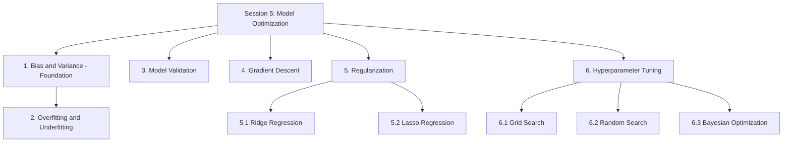
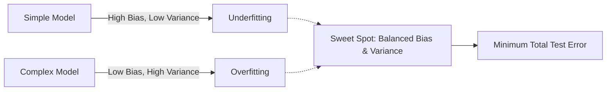

# Session 5: Model Optimization

> Topic: Model Optimization
> Date: Aug 3, 2026

## Concept Hierarchy

**Reordering note:** Under "Regularization", **Ridge** is explained before **Lasso** (the learner listed Lasso first) because Ridge's penalty is the simpler, more intuitive case (shrinks coefficients smoothly) and Lasso is best understood as "Ridge, but with a penalty that can shrink coefficients all the way to zero" — no topic was dropped, both appear in full below. **Bias and Variance** is labelled a **Foundation**: it was only briefly previewed as vocabulary in [Session 1 Section 1.3](01-introduction.md) ("Overfitting"/"Underfitting" terms); this session explains the actual mechanism (bias-variance tradeoff) behind those terms before formally revisiting them in Section 2, exactly as promised in Session 1's note that "their full treatment ... is covered later in this folder's regression-specific notes." No other topic was reordered, merged, or dropped — every supplied item appears exactly once below.

**Running example used throughout:** continuing the **house price prediction** example from [Session 1](01-introduction.md)–[Session 4](04-feature-engineering.md), using the final engineered feature set from [Session 4](04-feature-engineering.md) (area, rooms, age, locality dummies) to now optimize *how* the model is fitted and validated, rather than *which* features it uses.

---

## 1. Bias and Variance (Foundation)

**Meaning** — Every prediction model can be wrong in two different ways — it can be *systematically* off in the same direction (bias), or it can *swing wildly* depending on which training data it happened to see (variance). **Bias** is the error from a model's assumptions being too simple to capture the true pattern; **variance** is the error from a model being too sensitive to the specific training sample it was fit on.

> **Formal definition:** Bias is the error introduced by approximating a real-world relationship with a simplified model; variance is the error introduced by a model's sensitivity to fluctuations in the training sample.

**Why it matters** — This is the actual mechanism behind the overfitting/underfitting vocabulary previewed in [Session 1 Section 1.3](01-introduction.md): understanding bias and variance explains *why* those two failure modes happen, and why fixing one often makes the other worse — the central tension in model optimization.

**Formula (Expected Test Error Decomposition)** — Essential
**Formula** — $E\big[(y - \hat f(x))^2\big] = \text{Bias}(\hat f(x))^2 + \text{Var}(\hat f(x)) + \sigma^2$
**Where** — $\hat f(x)$: the model's prediction; $\text{Bias}(\hat f(x)) = E[\hat f(x)] - f(x)$, the average gap between predicted and true value across many re-fits on different training samples; $\text{Var}(\hat f(x))$: how much the prediction itself changes across those different training samples; $\sigma^2$: irreducible noise in the data that no model can remove.
**Example** — Fitting a plain straight line to a house-price relationship that is actually curved gives predictions that are consistently off in the same direction for large houses, no matter which sample of houses was used to train it — that consistent gap is **high bias**. Fitting a very high-degree polynomial that passes through every training point exactly gives near-perfect training predictions, but a slightly different training sample would produce a very different curve and very different predictions for new houses — that swing is **high variance**.
**Interpretation** — Total test error is the sum of these two error sources plus irreducible noise; a good model needs both bias and variance to be reasonably small, not just one of them.

#### Diagram — the bias-variance tradeoff

**Important details** — As model complexity increases (e.g., adding more predictors or higher-degree polynomial terms, [Session 4 Section 2](04-feature-engineering.md)), bias typically *decreases* but variance typically *increases* — this trade-off is why there is usually a "sweet spot" of complexity that minimizes total test error, rather than always choosing the most flexible model available.

**Exam focus** — Know the decomposition formula, the plain-English meaning of each term, and be ready to identify a scenario as high-bias or high-variance.

---

## 2. Overfitting and Underfitting

**Meaning** — [Session 1 Section 1.3](01-introduction.md) introduced these as vocabulary: **overfitting** is a model fitting the training data (including its noise) so closely that it performs poorly on new data; **underfitting** is a model too simple to capture the real pattern, performing poorly even on training data. Using Section 1's terms: overfitting is the practical symptom of **high variance** (and typically low bias); underfitting is the practical symptom of **high bias** (and typically low variance).

> **Formal definition:** Overfitting occurs when a model learns the training data, including its noise, so closely that it fails to generalize to new data; underfitting occurs when a model is too simple to capture the underlying pattern, performing poorly even on training data.

**Why it matters** — Recognizing which of the two a model suffers from tells you exactly which direction to adjust it — the opposite fixes are needed for each, so misdiagnosing one as the other makes a model worse, not better.

**How it works — detection** — Compare training error against validation/test error (validation is formalized in Section 3): a large gap (low training error, much higher test error) signals overfitting; both errors being high and similar signals underfitting.

#### Comparison: Overfitting vs Underfitting

| Aspect                | Overfitting                                                                                          | Underfitting                                                            |
| --------------------- | ---------------------------------------------------------------------------------------------------- | ----------------------------------------------------------------------- |
| Training error        | Very low                                                                                             | High                                                                    |
| Test/validation error | High (large gap from training error)                                                                 | High (similar to training error)                                        |
| Bias                  | Low                                                                                                  | High                                                                    |
| Variance              | High                                                                                                 | Low                                                                     |
| Typical cause         | Model too complex, too many features, too little data                                                | Model too simple, too few features                                      |
| Typical fix           | Regularization (Section 5), more data, feature selection ([Session 4 §4](04-feature-engineering.md)) | Add features, increase model complexity, reduce regularization strength |

The central difference: overfitting shows a big gap between training and test error, underfitting shows both errors high together. Diagnose using the training-vs-test error comparison above, then apply the matching fix from the table.

**Example** — A house-price model using a 10th-degree polynomial on a small dataset achieves near-zero training error but a very large test error — overfitting. A model that only ever predicts the average house price achieves both high training and high test error — underfitting.

**Exam focus** — Be ready to diagnose overfitting vs underfitting from given training/test error values, and to state the matching fix from the table.

---

## 3. Model Validation

**Meaning** — A systematic way of checking a model's real-world performance using data it wasn't trained on, so overfitting/underfitting (Section 2) can actually be detected rather than assumed. **Model validation** extends the train-test split ([Session 1 Section 2.6](01-introduction.md)) with more robust procedures such as **k-fold cross-validation**.

> **Formal definition:** Model validation is the process of assessing a model's performance on data not used for training, in order to estimate how well it generalizes to unseen data.

**Why it matters** — A single train-test split gives only one estimate of test performance, which can be misleading by chance (an unusually easy or hard test split) — especially risky with a small dataset. Cross-validation averages performance over several different splits for a more reliable estimate, and is also the standard tool used to compare hyperparameter choices (Section 6).

**How it works — k-fold cross-validation steps**

1. Split the dataset into $k$ roughly equal parts ("folds").
2. For each fold $i$ (from 1 to $k$): train the model on the remaining $k-1$ folds, and validate it on fold $i$, recording a metric (e.g., RMSE, [Session 3 Section 3.2](03-assumptions-and-model-evaluation.md)).
3. Repeat until every fold has been used once as the validation set.
4. Average the $k$ recorded metric values to get the final cross-validated estimate.

**Formula** — Essential
**Formula** — $\text{CV score} = \dfrac{1}{k}\sum_{i=1}^{k} \text{metric}_i$
**Where** — $\text{metric}_i$: the chosen evaluation metric (e.g., RMSE) computed on fold $i$ when it was the validation set; $k$: number of folds.
**Example** — With 5-fold cross-validation on 800 house records (5 folds of 160 each): train on 640 records / validate on the remaining 160, five times (rotating which 160 is held out), giving five RMSE values, e.g., $[3.9, 4.1, 3.7, 4.3, 4.0]$; $\text{CV score} = \dfrac{3.9+4.1+3.7+4.3+4.0}{5} = 4.0$.
**Interpretation** — A CV score of 4.0 lakh RMSE is a more reliable estimate of real-world prediction error than any single one of the five individual runs, since it averages out the effect of which particular houses ended up in the test split.

**Important details** — **Leave-One-Out Cross-Validation (LOOCV)** is the special case where $k$ equals the number of data points $n$ — additional depth, used mainly for very small datasets since it is computationally expensive for large ones.

**Exam focus** — Know the k-fold steps in order and be able to state why cross-validation is more reliable than a single train-test split.

---

## 4. Gradient Descent

**Meaning** — Instead of solving directly for the best-fit coefficients in one step (as OLS does), gradient descent starts with a guess and repeatedly nudges it in the direction that reduces error, gradually walking downhill toward the best fit. **Gradient descent** is an iterative optimization algorithm that minimizes a cost function by repeatedly updating parameters in the direction opposite to the cost function's gradient.

> **Formal definition:** Gradient descent is an iterative optimization algorithm that minimizes a differentiable cost function by repeatedly updating parameters in the direction of the negative gradient.

**Why it matters** — Ordinary Least Squares' closed-form solution ([Session 2 Section 2.3.1](02-linear-regression.md)) works well for simple/multiple linear regression, but becomes computationally expensive or infeasible for very large datasets, many predictors, or more complex models. Gradient descent scales to these cases and is the general-purpose fitting method used across most of machine learning.

**How it works — steps**

1. Start with an initial guess for the coefficients (e.g., $b_0=0, b_1=0$).
2. Compute the gradient — the slope of the cost function (e.g., MSE, [Session 3 Section 3.2](03-assumptions-and-model-evaluation.md)) with respect to each coefficient.
3. Update each coefficient by taking a small step in the direction that *reduces* the cost function.
4. Repeat steps 2–3 until the cost function stops decreasing meaningfully (**convergence**).

**Formula (Update Rule)** — Essential
**Formula** — $b_j := b_j - \alpha \dfrac{\partial J}{\partial b_j}$
**Where** — $b_j$: the coefficient being updated; $\alpha$: the **learning rate**, a hyperparameter ([Session 1 Section 1.3](01-introduction.md)) controlling step size, itself tuned in Section 6; $J$: the cost function being minimized (e.g., MSE); $\dfrac{\partial J}{\partial b_j}$: the gradient, showing which direction increases the cost.
**Example** — For a toy one-parameter cost function $J(b) = (b-4)^2$ (minimum at $b=4$), starting at $b=0$ with $\alpha=0.1$: the gradient is $\dfrac{\partial J}{\partial b} = 2(b-4) = 2(0-4) = -8$. Update: $b := 0 - 0.1(-8) = 0.8$. The next iteration recomputes the gradient at $b=0.8$ and steps again, gradually approaching $b=4$.
**Interpretation** — Each step moves $b$ closer to the value that minimizes the cost function, exactly the same coefficients OLS ([Session 2 Section 2.3.1](02-linear-regression.md)) would find directly for plain linear regression — but reached iteratively instead of in one closed-form calculation.

**Important details** — The learning rate $\alpha$ is critical: too large causes the steps to overshoot and the cost to oscillate or diverge instead of shrinking; too small causes very slow convergence, needing many more iterations. Common variants: **Batch Gradient Descent** (uses the entire dataset for every step), **Stochastic Gradient Descent (SGD)** (uses one random data point per step — faster per step but noisier), and **Mini-batch Gradient Descent** (uses a small random batch per step — a practical compromise between the two).

**Exam focus** — Know the update rule, the role of the learning rate, and the consequence of setting it too high (divergence) or too low (slow convergence) — a very common conceptual question.

---

## 5. Regularization

**Parent concept.** Regularization directly targets the **high-variance/overfitting** side of the bias-variance tradeoff (Section 1–2): it adds a penalty term to the cost function that discourages overly large coefficients, deliberately accepting a small increase in bias in exchange for a much larger reduction in variance — lowering total test error whenever the plain model was overfitting. Both variants below add a penalty to the same cost function ($\sum (y_i-\hat y_i)^2$, the quantity OLS minimizes, [Session 2 Section 2.3.1](02-linear-regression.md)), differing only in *what kind* of penalty is added.

> **Formal definition:** Regularization is a technique that adds a penalty term to a model's cost function to discourage overly large coefficients, reducing variance/overfitting at the cost of a small increase in bias.

### 5.1 Ridge Regression (L2 Regularization)

**Meaning** — Fits the regression line as usual, but also penalizes coefficients for being large, so it shrinks all of them a little, smoothly, toward zero. **Ridge regression** adds an **L2 penalty** — the sum of squared coefficients — to the OLS cost function.

> **Formal definition:** Ridge regression is a regularized linear regression technique that adds a penalty equal to the sum of squared coefficients (L2 penalty) to the OLS cost function, shrinking coefficients toward zero without eliminating them.

**Formula** — Essential
**Formula** — $J(b) = \sum_{i=1}^{n}(y_i - \hat y_i)^2 + \lambda\sum_{j=1}^{k} b_j^2$
**Where** — $\sum(y_i-\hat y_i)^2$: the usual sum of squared residuals from OLS; $\lambda$ (lambda): the **regularization strength**, a hyperparameter (tuned in Section 6) controlling how heavily large coefficients are penalized; $b_j$: each predictor's coefficient (the intercept $b_0$ is not penalized).
**Example** — With $\lambda=0$, Ridge reduces exactly to plain OLS. As $\lambda$ increases from 0 to a large value, every coefficient shrinks progressively closer to (but rarely exactly reaching) zero.
**Interpretation** — Shrinking all coefficients smoothly reduces variance (Section 1) — the fitted model becomes less sensitive to the specific training sample — and is especially useful when predictors are highly correlated (multicollinearity, [Session 3 Section 1.5](03-assumptions-and-model-evaluation.md)), since Ridge stabilizes the otherwise unstable coefficient estimates in that situation.

**Important details** — Ridge does **not** perform feature selection: coefficients shrink but essentially never become exactly zero, so every original predictor typically remains in the model in some (smaller) form.

**Exam focus** — Know the L2 penalty formula and that Ridge shrinks but does not zero out coefficients — the key contrast with Lasso next.

### 5.2 Lasso Regression (L1 Regularization)

**Meaning** — Like Ridge, but its penalty can shrink some coefficients all the way down to exactly zero, effectively dropping those predictors from the model entirely. **Lasso regression** ("Least Absolute Shrinkage and Selection Operator") adds an **L1 penalty** — the sum of absolute coefficient values — to the OLS cost function.

> **Formal definition:** Lasso regression is a regularized linear regression technique that adds a penalty equal to the sum of absolute coefficient values (L1 penalty) to the OLS cost function, capable of shrinking some coefficients to exactly zero and thereby performing feature selection.

**Formula** — Essential
**Formula** — $J(b) = \sum_{i=1}^{n}(y_i - \hat y_i)^2 + \lambda\sum_{j=1}^{k} |b_j|$
**Where** — Same terms as Ridge's formula (5.1), except the penalty uses $|b_j|$ (absolute value) instead of $b_j^2$.
**Example** — With a sufficiently large $\lambda$, Lasso applied to the house-price model might shrink the coefficient for "age" all the way to exactly 0, effectively removing age from the model, while area and locality dummies keep smaller, nonzero coefficients.
**Interpretation** — Because Lasso can zero out coefficients entirely, it performs **automatic feature selection** as a side effect of regularization — an alternative (or complement) to the explicit feature selection algorithms in [Session 4 Section 4](04-feature-engineering.md).

**Important details** — Choose Lasso when many predictors are expected to be irrelevant and a simpler, sparser model is desirable; choose Ridge (5.1) when most predictors are expected to contribute at least somewhat and multicollinearity, rather than irrelevant predictors, is the main concern.

**Exam focus** — Know the L1 penalty formula and that Lasso's ability to zero out coefficients is the key practical difference from Ridge.

#### Comparison: Ridge vs Lasso

| Aspect                      | Ridge (L2)                                                                                    | Lasso (L1)                                                                     |
| --------------------------- | --------------------------------------------------------------------------------------------- | ------------------------------------------------------------------------------ |
| Penalty                     | Sum of squared coefficients                                                                   | Sum of absolute coefficients                                                   |
| Effect on coefficients      | Shrinks all smoothly toward zero                                                              | Can shrink some coefficients to exactly zero                                   |
| Performs feature selection? | No                                                                                            | Yes                                                                            |
| Best suited for             | Multicollinearity among predictors ([Session 3 §1.5](03-assumptions-and-model-evaluation.md)) | Many suspected-irrelevant predictors, need for a simpler model                 |
| Example use                 | Stabilizing coefficients when area/rooms are highly correlated                                | Automatically dropping an uninformative predictor like a near-random ID column |

The central difference: Ridge shrinks every coefficient a little; Lasso can shrink some coefficients to exactly zero. Choose Ridge when keeping all predictors (in shrunken form) is fine and multicollinearity is the concern; choose Lasso when a sparser, more interpretable model with automatic feature dropping is preferred.

**Connection** — The regularization strength $\lambda$ used by both Ridge and Lasso is itself a hyperparameter that must be chosen systematically — along with gradient descent's learning rate (Section 4) and cross-validation's fold count (Section 3) — which is exactly the job of Hyperparameter Tuning, next.

---

## 6. Hyperparameter Tuning

**Parent concept.** [Session 1 Section 1.3](01-introduction.md) defined **hyperparameters** as settings chosen before training, not learned from data — examples introduced across this folder include Ridge/Lasso's $\lambda$ (Section 5), gradient descent's learning rate $\alpha$ (Section 4), and cross-validation's fold count $k$ (Section 3). **Hyperparameter tuning** is the systematic search for the values of these settings that give the best validation performance (Section 3), rather than guessing them manually. The three methods below differ only in *how* they search the space of possible hyperparameter values.

> **Formal definition:** Hyperparameter tuning is the process of systematically searching for the combination of hyperparameter values that optimizes a model's validation performance.

### 6.1 Grid Search

**Meaning** — Try every possible combination from a fixed list of candidate values for each hyperparameter, and keep the best one. **Grid search** exhaustively evaluates every combination in a predefined hyperparameter grid, scoring each via cross-validation (Section 3).

> **Formal definition:** Grid search is a hyperparameter tuning method that exhaustively evaluates every combination of values in a predefined hyperparameter grid, using cross-validation to score each combination.

**Example** — For Ridge regression, try $\lambda \in \{0.01, 0.1, 1, 10\}$; run 5-fold cross-validation (Section 3) for each value, compare the average RMSE ([Session 3 Section 3.2](03-assumptions-and-model-evaluation.md)), and select the $\lambda$ with the lowest average RMSE.

**Important details** — Grid search is exhaustive, so it is guaranteed to find the best combination *within the specified grid*, but it becomes very computationally expensive as the number of hyperparameters or candidate values grows (the grid size grows multiplicatively with each added hyperparameter).

**Exam focus** — Know that grid search is exhaustive and guaranteed-within-the-grid, at the cost of scaling poorly with more hyperparameters.

### 6.2 Random Search

**Meaning** — Instead of trying every combination, randomly sample a fixed number of combinations from the hyperparameter space and keep the best one found. **Random search** samples a fixed number of random hyperparameter combinations (often from continuous ranges, not just a discrete grid) and evaluates each via cross-validation.

> **Formal definition:** Random search is a hyperparameter tuning method that evaluates a fixed number of randomly sampled hyperparameter combinations, using cross-validation to score each combination.

**Example** — Instead of grid search's fixed list of 4 $\lambda$ values, randomly sample 20 $\lambda$ values from the continuous range $[0.001, 100]$, evaluate each with 5-fold cross-validation, and keep the best of the 20.

**Important details** — Random search often finds comparably good hyperparameters much faster than grid search, especially when only a few hyperparameters actually matter much for performance — a well-known practical finding. It does not guarantee finding the single best combination, but usually offers a better time-versus-quality trade-off than grid search.

**Exam focus** — Know that random search trades the guarantee of grid search for speed, and is often preferred when many hyperparameters are involved.

### 6.3 Bayesian Optimization

**Meaning** — A smarter search that learns from earlier trials to decide which hyperparameter values to try next, instead of trying everything (grid) or picking blindly at random (random search). **Bayesian optimization** builds a probabilistic model from past (hyperparameter value, validation score) pairs to predict which unexplored region of the hyperparameter space is likely to perform best, and focuses new trials there.

> **Formal definition:** Bayesian optimization is a hyperparameter tuning method that builds a probabilistic model of the objective function from past evaluations to guide the selection of the next hyperparameter combination to try.

**How it works** — After each trial, the probabilistic model is updated with the new (hyperparameter, score) result, and the next hyperparameter value to try is chosen to balance exploring uncertain regions against exploiting regions already known to perform well.

**Example** — After trying $\lambda=0.1$ (RMSE $=4.2$) and $\lambda=10$ (RMSE $=6.0$), Bayesian optimization infers that smaller $\lambda$ values are more promising, and focuses the next trials near $\lambda=0.1$ rather than wasting a trial near $\lambda=50$, unlike random search, which might sample there anyway.

**Important details** — Bayesian optimization typically finds good hyperparameters using fewer total trials than grid or random search, which is especially valuable when each trial (a full train + cross-validation cycle) is computationally expensive; it is more complex to set up than the other two methods.

**Exam focus** — Know the core idea — using past results to guide the next search point — as the key distinguishing feature versus grid and random search.

#### Comparison: Hyperparameter Tuning Methods

| Aspect                               | Grid Search                             | Random Search                                   | Bayesian Optimization                            |
| ------------------------------------ | --------------------------------------- | ----------------------------------------------- | ------------------------------------------------ |
| Search strategy                      | Tries every combination in a fixed grid | Randomly samples a fixed number of combinations | Uses past trial results to choose the next point |
| Exhaustive?                          | Yes (within the grid)                   | No                                              | No                                               |
| Efficiency with many hyperparameters | Poor (grows multiplicatively)           | Better than grid search                         | Best — typically fewest trials needed            |
| Uses information from past trials?   | No                                      | No                                              | Yes                                              |
| Best suited for                      | Few hyperparameters, small grids        | More hyperparameters, limited time budget       | Expensive trials, need for very few evaluations  |

The central difference: grid search is exhaustive but expensive, random search trades the exhaustive guarantee for speed, and Bayesian optimization uses past results to search more intelligently, typically needing the fewest trials of the three. Choose grid search for a small, cheap search space; random search when the space is larger but trials are still reasonably cheap; Bayesian optimization when each trial is expensive and search efficiency matters most.

**Connection** — This closes the model-optimization toolkit: Sections 1–2 explain *why* a model can go wrong (bias/variance, overfitting/underfitting), Section 3 shows how to *detect* it reliably (validation), Section 4 shows *how* a model's coefficients are actually found (gradient descent), and Sections 5–6 show how to *fix* high variance (regularization) and *systematically choose* every hyperparameter involved — completing the linear regression workflow built up since [Session 2](02-linear-regression.md), ready for the deployment topics in the next session.

---

## Examination Preparation

### Must understand

- Why the bias-variance decomposition explains the overfitting/underfitting terms first introduced in Session 1 (Section 1 → 2).
- Why cross-validation gives a more reliable performance estimate than a single train-test split (Section 3).
- Why gradient descent is needed at all when OLS already has a closed-form solution (Section 4).
- Why Ridge and Lasso trade a small increase in bias for a reduction in variance, and why only Lasso can perform feature selection (Section 5).
- Why grid search, random search, and Bayesian optimization differ in efficiency as the number of hyperparameters grows (Section 6).

### Must remember

- Bias-variance decomposition: $E[(y-\hat f(x))^2] = \text{Bias}^2 + \text{Variance} + \sigma^2$ (Section 1).
- Overfitting = high variance/low bias, large train-test error gap; underfitting = high bias/low variance, both errors high (Section 2).
- k-fold cross-validation steps and formula $\text{CV score} = \frac{1}{k}\sum \text{metric}_i$ (Section 3).
- Gradient descent update rule: $b_j := b_j - \alpha \frac{\partial J}{\partial b_j}$; too-high $\alpha$ diverges, too-low $\alpha$ converges slowly (Section 4).
- Ridge penalty: $\lambda\sum b_j^2$ (shrinks, no feature selection); Lasso penalty: $\lambda\sum|b_j|$ (can zero out coefficients) (Section 5).
- Grid search = exhaustive; random search = random sampling; Bayesian optimization = uses past trials to guide the search (Section 6).

### Common question patterns

- *2-mark:* Define bias / variance / overfitting / gradient descent / regularization / grid search.
- *5-mark:* Compare overfitting and underfitting; compare Ridge and Lasso; explain why the learning rate matters in gradient descent; compare grid search and random search.
- *10-mark:* Explain the bias-variance tradeoff and how it connects to overfitting/underfitting, regularization, and hyperparameter tuning as a complete model-optimization workflow.

### Answer-writing guidance

- *2-mark:* definition + one supporting example.
- *5-mark:* definition, main explanation, key points, example/formula/small diagram.
- *10-mark:* introduction, technical definition, diagram/workflow, detailed explanation, example/application, advantages/limitations, conclusion.

### Model answers

*2-mark:* "Regularization adds a penalty term to a regression model's cost function to discourage overly large coefficients, reducing variance at the cost of a small increase in bias. Example: Ridge regression adds $\lambda\sum b_j^2$ to the cost function, shrinking all coefficients smoothly."

*5-mark:* "Ridge and Lasso regression both add a penalty term to the ordinary least squares cost function to reduce overfitting, but they differ in the type of penalty used and its effect on coefficients. Ridge regression adds an L2 penalty, the sum of squared coefficients, which shrinks all coefficients smoothly toward zero but rarely to exactly zero, making it well suited when predictors are correlated with each other (multicollinearity) and all are expected to contribute somewhat. Lasso regression instead adds an L1 penalty, the sum of absolute coefficient values, which can shrink some coefficients all the way to exactly zero, effectively removing those predictors from the model entirely. This gives Lasso a built-in feature-selection effect that Ridge does not have. In practice, Ridge is preferred when most predictors matter and stability against correlated features is the goal, while Lasso is preferred when many predictors are suspected to be irrelevant and a simpler, sparser model is desired."

*10-mark:* "Introduction: a trained regression model's real-world usefulness depends not just on fitting the training data well, but on managing the trade-off between two sources of error — the subject of model optimization. Definition: the bias-variance tradeoff decomposes expected test error into bias (error from overly simple assumptions), variance (error from sensitivity to the training sample), and irreducible noise; overfitting and underfitting are the practical symptoms of high variance and high bias respectively. Diagram/workflow: assess bias/variance via training-vs-validation error → detect overfitting or underfitting → apply the matching fix → validate using cross-validation → tune any resulting hyperparameters. Detailed explanation: overfitting (low training error, high test error) is fixed using regularization — Ridge shrinks all coefficients via an L2 penalty, while Lasso can zero out coefficients entirely via an L1 penalty, effectively performing feature selection; underfitting is instead fixed by increasing model complexity or reducing regularization strength. Reliable performance estimates come from k-fold cross-validation rather than a single train-test split, since it averages performance across several different splits. Model coefficients themselves may be found either via OLS's closed-form solution or, for larger-scale problems, via gradient descent, which iteratively updates coefficients using a learning rate hyperparameter. Every hyperparameter introduced along the way — regularization strength, learning rate, number of cross-validation folds — must itself be chosen systematically, using grid search (exhaustive), random search (faster, samples randomly), or Bayesian optimization (uses past trial results to search efficiently). Example/application: for the house-price model, Lasso regularization with a cross-validated $\lambda$ chosen via grid search might automatically drop an uninformative predictor while stabilizing the remaining coefficients. Advantages: this workflow directly targets the real cause of poor test performance rather than blindly tweaking the model. Limitations: cross-validation and hyperparameter search both add computational cost, and Bayesian optimization in particular requires more setup than grid or random search. Conclusion: bias-variance understanding, validation, regularization, and hyperparameter tuning together form the complete model-optimization toolkit that turns an initially fitted regression model into one that generalizes reliably to new data."

## Practice Questions

### Basic recall

1. Write the bias-variance decomposition formula for expected test error.
   **Answer:** $E[(y-\hat f(x))^2] = \text{Bias}(\hat f(x))^2 + \text{Var}(\hat f(x)) + \sigma^2$ (Section 1).
2. State the steps of k-fold cross-validation.
   **Answer:** Split data into $k$ folds → for each fold, train on the remaining $k-1$ folds and validate on it → repeat until every fold has been the validation set once → average the $k$ recorded metric values (Section 3).
3. Write the gradient descent update rule and define each symbol.
   **Answer:** $b_j := b_j - \alpha\frac{\partial J}{\partial b_j}$, where $b_j$ is the coefficient being updated, $\alpha$ the learning rate, and $\frac{\partial J}{\partial b_j}$ the gradient of the cost function (Section 4).
4. Write the Ridge regression cost function formula.
   **Answer:** $J(b) = \sum(y_i-\hat y_i)^2 + \lambda\sum b_j^2$ (Section 5.1).
5. Name the three hyperparameter tuning methods covered in this session.
   **Answer:** Grid search, random search, Bayesian optimization (Section 6).

### Conceptual

1. Why does increasing model complexity typically reduce bias but increase variance?
   **Answer:** A more complex model can fit the training data's patterns (including noise) more closely, lowering systematic bias, but this makes it more sensitive to the specific training sample, raising variance (Section 1).
2. Why is k-fold cross-validation considered more reliable than a single train-test split?
   **Answer:** A single split gives one estimate that can be misleading by chance (an unusually easy/hard split); cross-validation averages performance over several different splits for a more reliable estimate (Section 3).
3. Why is gradient descent needed even though OLS has a closed-form solution?
   **Answer:** OLS's closed-form solution becomes computationally expensive or infeasible for very large datasets, many predictors, or more complex models; gradient descent scales to these cases (Section 4).
4. Why can Lasso perform feature selection but Ridge cannot?
   **Answer:** Lasso's L1 penalty (sum of absolute coefficients) can shrink coefficients all the way to exactly zero; Ridge's L2 penalty (sum of squared coefficients) only shrinks them smoothly, rarely to exactly zero (Section 5).
5. Why does Bayesian optimization typically need fewer trials than grid search?
   **Answer:** It uses the results of past trials to intelligently choose the next hyperparameter value to try, rather than exhaustively trying every combination (grid search) or sampling blindly (random search) (Section 6.3).

### Comparison

1. Compare Overfitting and Underfitting.
   **Answer:** See the comparison table in Section 2 — overfitting shows low training error but high test error (high variance); underfitting shows both errors high and similar (high bias).
2. Compare Ridge Regression and Lasso Regression.
   **Answer:** See the comparison table in Section 5 — Ridge (L2) shrinks all coefficients smoothly with no feature selection; Lasso (L1) can zero out coefficients, performing automatic feature selection.
3. Compare Grid Search, Random Search, and Bayesian Optimization.
   **Answer:** See the comparison table in Section 6 — grid search is exhaustive but expensive; random search samples randomly and is faster; Bayesian optimization uses past trial results to search most efficiently, typically needing the fewest trials.

### Scenario / application

1. A model has near-zero training error but a much higher test error — which condition is this, and which section's fix would you apply?
   **Answer:** Overfitting (Section 2, high variance); apply regularization (Section 5), gather more data, or perform feature selection (Session 4 Section 4).
2. A dataset has many correlated predictors, and you want to keep all of them but stabilize their coefficients — would you choose Ridge or Lasso, and why?
   **Answer:** Ridge (Section 5.1), since it shrinks all coefficients smoothly without zeroing any out, stabilizing estimates under multicollinearity while keeping every predictor in the model.
3. You need to tune 5 hyperparameters and each training run takes an hour — which tuning method from Section 6 would you choose, and why?
   **Answer:** Bayesian optimization (Section 6.3), since expensive trials make it valuable to use past results to search efficiently and minimize the total number of trials needed.

### Long-answer

1. Explain the bias-variance tradeoff and how it connects to overfitting and underfitting, using a worked example.
   **Answer:** See Sections 1–2 and the 10-mark model answer in Examination Preparation, which connects the decomposition formula to the overfitting/underfitting symptoms using the house-price polynomial example.
2. Explain gradient descent, regularization (Ridge and Lasso), and hyperparameter tuning as a connected model-optimization workflow.
   **Answer:** See Sections 4–6 and the 10-mark model answer in Examination Preparation for the complete connected explanation.

## Quick Revision

- **One-sentence summary:** Model optimization manages the bias-variance tradeoff behind overfitting and underfitting, using cross-validation to reliably detect it, gradient descent to fit coefficients at scale, regularization (Ridge/Lasso) to reduce overfitting, and systematic hyperparameter tuning (grid/random/Bayesian search) to choose every setting involved.
- **Hierarchy:** see Concept Hierarchy above.
- **Essential definitions:** bias, variance (1); overfitting, underfitting (2); k-fold cross-validation (3); gradient descent (4); Ridge, Lasso (5.1–5.2); grid search, random search, Bayesian optimization (6.1–6.3).
- **Key formulas:** bias-variance decomposition (1); cross-validation score (3); gradient descent update rule (4); Ridge and Lasso cost functions (5.1–5.2).
- **Most important comparison:** Ridge vs Lasso (Section 5) — governs whether regularization also performs feature selection.
- **5 exam keywords:** bias-variance tradeoff, cross-validation, learning rate, L1/L2 penalty, Bayesian optimization.
- **5 common mistakes:** treating overfitting and underfitting as needing the same fix; assuming a single train-test split is as reliable as cross-validation; forgetting that too-high a learning rate causes divergence, not just slower convergence; assuming Ridge can perform feature selection like Lasso; assuming grid search is always the best choice regardless of how many hyperparameters are involved.

## Topic Coverage

- Bias and Variance — Covered in Section 1
- Overfitting and Underfitting — Covered in Section 2
- Model Validation — Covered in Section 3
- Gradient Descent — Covered in Section 4
- Regularization — Covered in Section 5
- Lasso — Covered in Section 5.2
- Ridge — Covered in Section 5.1
- Hyperparameter Tuning — Covered in Section 6
- Grid Search — Covered in Section 6.1
- Random Search — Covered in Section 6.2
- Bayesian Optimization — Covered in Section 6.3
