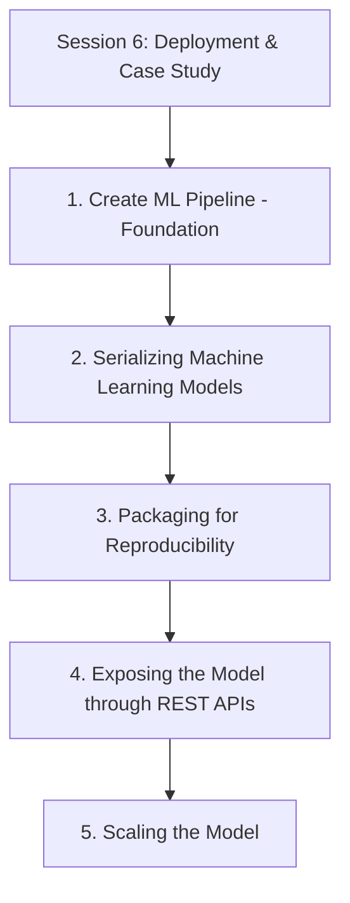
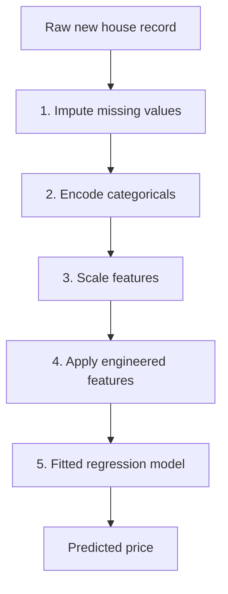
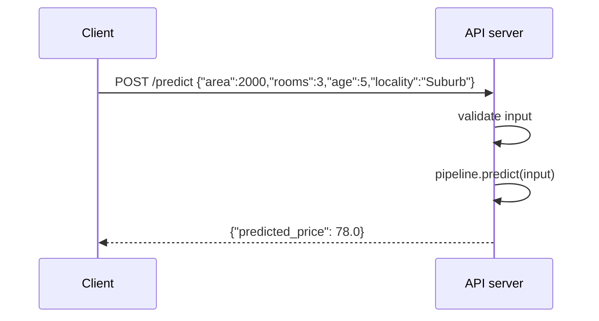

# Session 6: Deployment & Case Study

> Topic: Deployment & Case Study
> Date: Aug 3, 2026

## Concept Hierarchy

**Reordering note:** **Create ML Pipeline** is moved to the front and labelled a **Foundation**, because it is the single object that all four remaining topics act upon — the thing that gets serialized, packaged, served and scaled. The other four keep the natural deployment order: save it, make it run identically elsewhere, expose it over a network, then survive real load. No topic was dropped, merged, or added.

**Running example used throughout:** the **house price prediction** case built across Sessions 1 to 5 — a preprocessed, feature-engineered, regularized regression model that now has to leave the notebook and answer real requests.

**Analogy family used throughout:** a **kitchen serving the public**. Session 1 stood at the back door where the raw produce arrives; this session stands at the front, where dishes go out to customers who never see the kitchen at all. Every section is one step of getting from "it works when I cook it" to "it works when a hundred strangers order it at once".

---

## 1. Create ML Pipeline (Foundation)

### Picture this

Two ways to make coffee. In the first, a bench holds five separate tools — grinder, scale, tamper, kettle, press — and you use each in the correct order, from memory, every single time. It works beautifully when you are paying attention. In the second, one machine has all five stages bolted together behind a single button. Press it and the grind, dose, tamp and brew happen in the fixed order they were built in. And critically, the machine was calibrated once, at setup, against a known bag of beans; it does not re-measure and re-calibrate itself against your cup as it pours.

### Mapping

| Analogy element                                 | What it really is                                               |
| ----------------------------------------------- | --------------------------------------------------------------- |
| Each separate tool on the bench                 | One preprocessing step performed manually                       |
| Remembering the correct order every time        | The manual sequencing that eventually goes wrong                |
| The single machine with stages bolted together  | The ML pipeline object                                          |
| Pressing the one button                         | Calling `pipeline.predict(new_data)`                            |
| Calibrating once at setup                       | Fitting the pipeline on the training data                       |
| The stored calibration settings                 | Fitted preprocessing parameters — means, min/max, categories    |
| Not re-calibrating against the cup being poured | Not re-fitting on incoming data, which is what prevents leakage |

### Meaning

An ML pipeline chains every preprocessing step together with the fitted model into one object, so that identical, already-fitted logic is applied in a fixed order to training data and to every piece of new data thereafter.

> **Formal definition:** An ML pipeline is a sequential composition of data transformation and estimator steps that applies identical, previously fitted preprocessing and modeling logic to both training and new data.

### Why it matters

Two failures are prevented, and only one of them is obvious. The obvious one is human error: without a pipeline, someone must reapply imputation, encoding, scaling and feature construction in exactly the right order, by hand, every time new data arrives. The subtle one is **data leakage** — the temptation to recompute a scaling mean or an imputation value from the new data, which is the sealed-portion mistake from Session 1 reappearing in production. The pipeline enforces the separation structurally: fitting happens once, applying happens always.

### How it works

The stages, in the order established across the earlier sessions: missing value imputation, categorical encoding, feature scaling, the engineering and selection decisions from Session 4, and finally the fitted model from Session 5.

**Example** — A raw record arrives with a blank age field and a text locality of `"Suburb"`. One call runs the whole chain: age is filled with the median computed from the training data, locality becomes the dummy columns fixed at training time, the numeric columns are scaled by the training statistics, the engineered features are constructed, and the regularized regression returns a price.

**Important details** — The mechanism worth stating precisely: fitting the pipeline computes and *stores* each step's parameters from the training data alone, and predicting *reuses* those stored values without recomputing anything. That is the whole of leakage prevention in one sentence. Where the analogy breaks down: a coffee machine's calibration stays correct indefinitely, whereas a pipeline's fitted statistics slowly stop describing reality as the world changes — which is the drift that step 9 of Session 1's lifecycle exists to catch.

### Core takeaway

A pipeline prevents leakage not by being careful but by making the careless version impossible, since there is no longer a separate step for anyone to perform on the wrong data.

### Exam focus

Define the pipeline and, specifically, explain why bundling preprocessing with the model prevents data leakage. The fit-once, apply-always mechanism is the answer.

---

## 2. Serializing Machine Learning Models

### Picture this

The dish is cooked and it is good. Cooking it took three hours. Nobody is going to spend three hours again every time someone orders it, so it goes into a vacuum-sealed pack in the freezer — not the recipe, the actual finished dish, with every reduction and adjustment already in it. Reheating takes two minutes and produces exactly what came out of the pan, because it *is* what came out of the pan.

### Mapping

| Analogy element                         | What it really is                                        |
| --------------------------------------- | -------------------------------------------------------- |
| The three hours of cooking              | Training the pipeline                                    |
| The finished dish                       | The fitted pipeline object in memory                     |
| Everything already adjusted inside it   | Learned coefficients and fitted preprocessing parameters |
| Vacuum-sealing it                       | Serializing to a file                                    |
| The freezer                             | Disk or object storage                                   |
| Reheating in two minutes                | Loading the file back into memory                        |
| Accepting a sealed pack from a stranger | Loading a serialized file from an untrusted source       |

### Meaning

Serialization converts a fitted in-memory pipeline — coefficients, preprocessing parameters and structure together — into a file that can be stored, transferred and loaded back into a different process without any retraining.

> **Formal definition:** Serialization is the process of converting an in-memory fitted model or pipeline object into a storable, transferable file format that can be reloaded without retraining.

### Why it matters

Training and serving are different activities that happen in different places and at different times. Training is expensive, happens occasionally, and needs the full dataset; serving is cheap, happens constantly, and needs only the fitted object. Serialization is what lets them be separated at all — and note that what should be saved is the whole pipeline, not merely the model, since a set of coefficients without its preprocessing is unusable on raw input.

### How it works

Three formats cover the common cases.

- **Pickle** — Python's general-purpose serialization, able to store almost any object.
- **Joblib** — optimised for objects holding large numeric arrays, and the usual choice for scikit-learn pipelines.
- **ONNX** — a language-independent format, used when the model must run outside Python, for instance inside a Java or C++ service.

**Example** — After fitting the Ridge pipeline from Session 5, `joblib.dump(pipeline, "house_price_model.pkl")` writes it to disk. Later, in a completely separate process, `joblib.load("house_price_model.pkl")` restores the identical fitted object with no recomputation.

**Important details** — **Security caution, and this is a genuine vulnerability rather than a style preference.** Loading a pickle or joblib file executes code contained in that file by design, because the format reconstructs arbitrary Python objects. A malicious model file will therefore run arbitrary commands on your server the moment it is loaded — this is the insecure-deserialization class of vulnerability. Never load a serialized model from a source you do not control. Treat model files with the same suspicion as executables: check their integrity, restrict who can write to the location they are loaded from, and prefer ONNX when the provenance of a file cannot be guaranteed. Where the analogy breaks down: a suspicious frozen meal can at worst make you ill, whereas a malicious pickle file compromises the machine that opens it.

### Core takeaway

Serialization exists to separate the expensive act of training from the frequent act of predicting, and its convenience is exactly why the file it produces has to be treated as trusted code.

### Exam focus

Why serialization exists, at least one format by name, and the untrusted-source security caution — the last is asked more often than students expect.

---

## 3. Packaging for Reproducibility

### Picture this

You post the recipe to a friend and it comes out wrong. Nothing was mistyped. Their oven runs twenty degrees hot, their flour is milled differently, and where your recipe said "gas mark 6" their dial only goes up to 5. The instructions were perfect and the surroundings were not. The only reliable fix is to stop sending instructions and start sending the whole kitchen.

### Mapping

| Analogy element                        | What it really is                                |
| -------------------------------------- | ------------------------------------------------ |
| The recipe                             | The prediction code                              |
| The frozen dish posted alongside it    | The serialized pipeline from Section 2           |
| Their oven running hot                 | A different library version behaving differently |
| Their differently milled flour         | A different underlying system library            |
| A dial that does not reach gas mark 6  | A dependency that is missing entirely            |
| Writing exact temperatures and timings | Pinning dependency versions                      |
| Sending the whole kitchen in a crate   | Containerisation                                 |

### Meaning

Packaging for reproducibility bundles the model together with the exact code, dependency versions and configuration it was built with, so that it behaves identically wherever and whenever it runs.

> **Formal definition:** Packaging for reproducibility is the practice of bundling a model together with its exact dependencies, code, and configuration so that its behavior is deterministic and consistent across environments and over time.

### Why it matters

This is the failure that wastes the most time in practice, because it presents as a mystery: the same model file, the same input, a different answer — or no answer at all, because the file will not load. A library that changed a default between versions produces predictions that are subtly and silently different, with nothing anywhere reporting an error.

### How it works

1. **Pin dependency versions** — record the exact versions used at training time in a `requirements.txt` or equivalent, so the environment can be reconstructed rather than approximated.
2. **Containerise** — package the operating system, system libraries, Python libraries, code and serialized model together, using a tool such as Docker, so that the entire environment travels rather than just the code.
3. **Version-control code and data** — track the training code and, ideally, the dataset version alongside the model, so any past prediction can be traced back to exactly what produced it.

**Example** — A Dockerfile that installs the exact scikit-learn version used at training, copies in the serialized pipeline from Section 2 and the API code from Section 4, and fixes the entry point. The resulting image behaves identically on a laptop, a build server and a production cluster.

**Important details** — Reproducibility must cover the whole pipeline, not just the model's coefficients, because the preprocessing carries fitted parameters too — an imputation median, a scaling range, a category ordering. A model reproduced without its preprocessing is a model reproduced without most of what it does. Note also the difference in strength between the three practices: pinning versions reconstructs the Python environment but not the operating system beneath it, which is precisely the gap containerisation closes.

### Core takeaway

Reproducibility fails silently rather than loudly, which is why it has to be built in beforehand instead of debugged afterwards.

### Exam focus

Know that mismatched library versions are the usual cause, and that containerisation addresses it by shipping the environment rather than only the code.

---

## 4. Exposing the Model through REST APIs

### Picture this

A hatch in the wall between the kitchen and the street. Customers never come inside — they pass an order through the hatch in an agreed form, and a plate comes back out. Whether the kitchen is one cook or twenty, whether it was rebuilt last night, none of it is the customer's concern. What matters is that the hatch is always in the same place and always takes orders in the same form.

### Mapping

| Analogy element                                      | What it really is                                 |
| ---------------------------------------------------- | ------------------------------------------------- |
| The hatch                                            | The HTTP endpoint, e.g. `POST /predict`           |
| The customer outside                                 | The calling application                           |
| The agreed order form                                | The JSON request schema                           |
| The plate handed back                                | The JSON response containing the prediction       |
| Never entering the kitchen                           | The caller not needing Python or the model itself |
| The kitchen already staffed before opening           | The pipeline loaded once at server startup        |
| Skipping the preparation and plating raw ingredients | Applying the model formula without the pipeline   |

### Meaning

A REST API exposes the packaged model over HTTP as an endpoint that accepts feature values in a structured request and returns the model's prediction in a structured response.

> **Formal definition:** A REST API is an HTTP-based interface that exposes an endpoint accepting input data and returning a model's prediction as a structured (commonly JSON) response.

### Why it matters

The systems that need predictions — a web front end, a mobile app, another backend service — are usually not written in Python and should not be coupled to the model's internals. An HTTP endpoint is the standard boundary: the model can be retrained, re-tuned or replaced entirely without a single caller changing, as long as the hatch keeps its shape.

### How it works

1. Load the serialized pipeline **once**, at server startup, not per request — loading it on every call would add the reload cost to every prediction.
2. Define an endpoint such as `POST /predict` that accepts a request body of feature values.
3. Validate the incoming values before using them: check that required fields are present, that numbers are numbers, and that they fall in plausible ranges. Input arriving over a network is untrusted by definition.
4. Pass the validated input through the loaded pipeline's `predict()` method.
5. Return the prediction as a JSON response.

**Example** — Sending `{"area": 2000, "rooms": 3, "age": 5, "locality": "Suburb"}` to `POST /predict` returns `{"predicted_price": 78.0}`.

**Important details** — Flask and FastAPI are the usual Python frameworks. The single most important correctness point is that the endpoint must run raw input through the **entire pipeline**, not apply the fitted regression coefficients directly: the model was trained on imputed, encoded, scaled data, so feeding it raw values produces a confidently wrong number rather than an error. Two operational points are worth adding: the endpoint should never return a raw stack trace to the caller, since these leak internal detail, and any real deployment needs authentication, since an open prediction endpoint is both a cost and an information exposure.

### Core takeaway

The API's job is to be a stable boundary, which is why everything variable — the model, its version, its preprocessing — must sit behind it rather than be reimplemented in front of it.

### Exam focus

The request-response flow, and specifically that the API must apply the full pipeline rather than the model formula alone.

---

## 5. Scaling the Model

### Picture this

One hatch, one cook, and it is fine — until one o'clock, when eighty people arrive at once. The kitchen has not broken. Every dish still takes the same time it always did. What has changed is that the queue now grows faster than it clears, and the eightieth customer is waiting an hour for a dish that takes four minutes.

### Mapping

| Analogy element                                | What it really is                         |
| ---------------------------------------------- | ----------------------------------------- |
| One order                                      | One prediction request                    |
| Time to cook one dish                          | Latency per request                       |
| Orders arriving per minute                     | Request throughput                        |
| The queue at the hatch                         | Requests waiting to be served             |
| A faster cook with a bigger stove              | Vertical scaling                          |
| More hatches, with someone directing customers | Horizontal scaling behind a load balancer |
| Popular dishes pre-made and kept warm          | Caching                                   |
| Cooking a hundred portions overnight           | Batch prediction                          |

### Meaning

Scaling adjusts a deployment's resources or architecture so that prediction requests continue to be served reliably and promptly as their volume grows.

> **Formal definition:** Scaling is the practice of adjusting a deployed system's resources or architecture to reliably handle an increasing volume of requests.

### Why it matters

A model that answers one test request instantly can become unusable under real traffic without anything in it being wrong. The gap between "it works" and "it works at one o'clock" is not a modelling problem at all, which is why it is so often discovered late.

### How it works

Four approaches, and the useful distinction is that the first two add capacity while the last two reduce the work.

1. **Vertical scaling** — give the existing server more CPU and memory. Simple, requires no architectural change, and eventually hits a hardware ceiling.
2. **Horizontal scaling** — run several replicas of the API behind a **load balancer** that distributes requests among them. Scales far further, and requires the API to be **stateless** so that any replica can serve any request.
3. **Caching** — store the prediction for an input and reuse it when the identical input arrives again, skipping the computation entirely.
4. **Batch prediction** — process many inputs together on a schedule rather than one at a time on demand, when an immediate response is not required.

**Example** — The house-price API begins receiving thousands of requests per minute. Running five replicas behind a load balancer spreads the load, instead of every request queuing behind a single overloaded process.

#### Comparison: Scaling Approaches

| Aspect                         | Vertical Scaling               | Horizontal Scaling                        | Caching                              | Batch Prediction                            |
| ------------------------------ | ------------------------------ | ----------------------------------------- | ------------------------------------ | ------------------------------------------- |
| What it changes                | More resources on one machine  | More machines, plus a load balancer       | Reuses past results                  | Groups many requests into one pass          |
| Adds capacity or reduces work? | Adds capacity                  | Adds capacity                             | Reduces work                         | Reduces work                                |
| Best suited for                | Simple setups, moderate growth | High or unpredictable real-time load      | Frequently repeated identical inputs | High volume with no real-time requirement   |
| Limitation                     | Hits a hardware ceiling        | Needs a load balancer and a stateless API | Useless for inputs never seen before | Unsuitable when responses must be immediate |

The central difference is between serving more and computing less: vertical and horizontal scaling buy capacity, while caching and batching remove work that did not need doing. Choose horizontal scaling for unpredictable real-time load, caching when the same inputs recur often, and batch prediction when the answer is not needed this second — and note that these combine rather than compete, since a cache sitting in front of a horizontally scaled service is a common arrangement.

**Important details** — The underlying choice is between **real-time serving**, the low-latency one-request-at-a-time model of Section 4, and **batch serving**, where many predictions are computed on a schedule. Caching also carries a correctness obligation that is easy to overlook: when the model is retrained, cached predictions from the previous version become stale and must be invalidated, or the service will keep confidently serving answers from a model that no longer exists. Where the analogy breaks down: a kitchen's capacity is fixed by its walls, whereas cloud infrastructure can add replicas automatically in response to load — but that autoscaling has to be configured deliberately, and a stateless API is the precondition for it.

### Core takeaway

Scaling problems are queueing problems rather than model problems, which is why the effective responses are either more servers or less work, never a better model.

### Exam focus

Know all four approaches and be ready to recommend one, with justification, for a described load scenario. The real-time versus batch distinction is the usual framing.

**Connection** — This closes the journey begun with raw sales records in Session 1: through preprocessing, linear regression, assumption checking, feature engineering and optimization, to a pipeline that is serialized, packaged reproducibly, exposed over HTTP and scaled to real load — steps 8 and 9 of the lifecycle first sketched in Session 1.

---

## Examination Preparation

### Must understand

- Why bundling preprocessing with the model into a pipeline prevents data leakage structurally rather than by care (Section 1).
- Why a serialized model file must be treated as executable code (Section 2).
- Why reproducibility must cover the whole pipeline and the whole environment, not just the coefficients (Section 3).
- Why an API endpoint must apply the full pipeline rather than the fitted formula (Section 4).
- How to choose among vertical scaling, horizontal scaling, caching and batch prediction for a given load pattern (Section 5).

### Must remember

- Pipeline stages in order: imputation, encoding, scaling, feature engineering, model — with fitting once and applying always (Section 1).
- Serialization formats: pickle, joblib, ONNX; loading an untrusted file executes arbitrary code (Section 2).
- Reproducibility practices: pin dependency versions, containerise, version-control code and data (Section 3).
- REST flow: load the pipeline once at startup, validate input, call `predict()`, return JSON (Section 4).
- Four scaling approaches: vertical, horizontal, caching, batch prediction — the first two add capacity, the last two reduce work (Section 5).

### Common question patterns

- _2-mark:_ Define an ML pipeline, serialization, containerisation, or horizontal scaling.
- _5-mark:_ Why an API must apply the full pipeline; compare vertical and horizontal scaling; explain the security risk of loading an untrusted serialized model.
- _10-mark:_ Explain the complete deployment lifecycle for a trained regression model, from pipeline creation to scaling, with an example at each stage.

### Answer-writing guidance

- _2-mark:_ the formal definition stated precisely, plus one supporting example.
- _5-mark:_ formal definition, main explanation, key points, and one example or small diagram.
- _10-mark:_ introduction, formal technical definition, Mermaid diagram or workflow, detailed explanation, worked example, advantages and limitations, conclusion.

### Model answers

_2-mark:_ "Serialization is the process of converting an in-memory fitted model or pipeline object into a storable, transferable file format that can be reloaded without retraining. For example, `joblib.dump()` writes a fitted house-price pipeline to a file, which a separate serving process can later load with `joblib.load()` and use immediately."

_5-mark:_ "A REST API endpoint serving a deployed regression model must apply the model's entire preprocessing pipeline to incoming raw data, not merely its fitted coefficients. The reason lies in what the model was trained on: the training data had already had its missing values imputed, its categorical columns encoded into dummy variables and its numeric columns scaled, so the coefficients were estimated against transformed values rather than raw ones. Applying those coefficients directly to raw input therefore evaluates the equation at the wrong point entirely — a text locality has no numeric value at all, and an unscaled area is orders of magnitude away from the scaled value the coefficient expects. Critically, this produces no error; it produces a confident and wrong number, which is far harder to detect than a failure. The correct arrangement is to serialize the full pipeline, covering imputation, encoding, scaling, feature engineering and the model together, load it once when the server starts, and call its `predict()` method inside the endpoint. This guarantees that every request is processed through exactly the steps used during training, with the parameters fitted at training time, which additionally prevents data leakage since nothing is recomputed from the incoming data."

_10-mark:_ "Introduction: once a regression model has been built, validated and optimized, it must be deployed before it produces any value, and deployment is a sequence of distinct engineering steps rather than a single act. Definition: deployment covers composing the model into a pipeline, serializing it, packaging it for consistent behaviour across environments, exposing it over a network, and scaling it to handle real load. Diagram: raw request, then pipeline of impute, encode, scale, engineer and predict, then the serialized file, then the packaged container, then the REST endpoint, then the scaled deployment behind a load balancer. Detailed explanation: an ML pipeline chains every preprocessing step to the fitted model so that both training and serving apply identical logic, with each step's parameters fitted once on training data and reused thereafter, which prevents data leakage structurally rather than by discipline. The fitted pipeline is then serialized, using joblib or pickle for Python-only deployments or ONNX where the model must be loaded outside Python, so that training and serving are separated and no retraining is needed to serve; because pickle-based formats reconstruct arbitrary objects, loading such a file from an untrusted source permits arbitrary code execution and must be avoided. Packaging for reproducibility then pins the exact dependency versions and, more robustly, containerises the whole environment, since a differing library version can silently change predictions rather than raise an error. A REST API loads the packaged pipeline once at startup, validates incoming JSON, applies the full pipeline to it and returns the prediction, thereby giving non-Python callers a stable interface that survives model retraining. Finally, scaling keeps the service responsive under load through vertical scaling, horizontal scaling behind a load balancer, caching of repeated identical requests, and batch prediction where immediate responses are unnecessary. Example: a house-price API facing a traffic surge could run five replicas behind a load balancer while additionally serving frequently repeated queries from a cache, with the cache invalidated whenever the model is retrained. Advantages: this arrangement guarantees consistency between training and serving and scales without changing the model. Limitations: containerisation and orchestration add operational complexity, cached results become stale on retraining, and none of these steps addresses model drift, which requires the separate monitoring stage of the lifecycle. Conclusion: deployment converts a validated model into a dependable service, and its central principle is that whatever was fitted during training must be reused unchanged during serving."

## Practice Questions

### Basic recall

1. List the typical stages of an ML pipeline in order.
   **Answer:** Missing value imputation, categorical encoding, feature scaling, feature engineering, the fitted model (Section 1).
2. Name two common serialization formats.
   **Answer:** Pickle and joblib, with ONNX for cross-platform use (Section 2).
3. What is the security caution associated with loading a serialized model?
   **Answer:** Loading a pickle or joblib file can execute arbitrary code, so a file from an untrusted source must never be loaded (Section 2).
4. What HTTP method and endpoint pattern typically exposes a model for prediction?
   **Answer:** `POST /predict` (Section 4).
5. Name the four scaling approaches.
   **Answer:** Vertical scaling, horizontal scaling, caching, batch prediction (Section 5).

### Conceptual

1. Why does bundling preprocessing into a pipeline prevent data leakage?
   **Answer:** Each step's parameters are computed once, from training data alone, and stored; at prediction time those stored values are reused rather than recomputed, so nothing from the new data can influence the transformation (Section 1).
2. Why must a REST API apply the full pipeline rather than the fitted regression formula?
   **Answer:** The coefficients were estimated against imputed, encoded and scaled values, so applying them to raw input evaluates the equation at the wrong point and returns a confidently wrong number with no error raised (Section 4).
3. Why is pinning library versions insufficient for full reproducibility, and what does containerisation add?
   **Answer:** Pinning reconstructs the Python environment but not the operating system, system libraries or configuration beneath it; a container packages the whole environment so behaviour is identical anywhere (Section 3).
4. Why does caching help some workloads and not others?
   **Answer:** A cache only returns a result for an input it has already seen, so it helps when identical requests recur frequently and does nothing for a stream of unique inputs (Section 5).
5. Why should the serialized artefact be the whole pipeline rather than just the model?
   **Answer:** The preprocessing steps carry fitted parameters of their own — imputation values, scaling statistics, category orderings — and a set of coefficients without them cannot be applied to raw input at all (Sections 1 to 3).
6. Why must a horizontally scaled API be stateless?
   **Answer:** A load balancer may route consecutive requests from the same caller to different replicas, so no replica can rely on state left behind by a previous request (Section 5).

### Comparison

1. Compare vertical and horizontal scaling.
   **Answer:** Vertical scaling adds resources to one machine and eventually meets a hardware ceiling; horizontal scaling adds replicas behind a load balancer, scales much further, and requires a stateless API (Section 5).
2. Compare caching and batch prediction.
   **Answer:** Caching reuses a stored result for a repeated identical input; batch prediction computes many different predictions together on a schedule when immediate responses are not required (Section 5).
3. Compare pickle/joblib with ONNX.
   **Answer:** Pickle and joblib are Python-specific, convenient for scikit-learn objects, and unsafe to load from untrusted sources because they reconstruct arbitrary objects; ONNX is language-independent and generally safer where provenance cannot be guaranteed (Section 2).

### Scenario / application

1. A deployed model behaves differently on a colleague's machine than it did during training. Which practice was skipped, and what should be done?
   **Answer:** Packaging for reproducibility (Section 3). Pin the exact dependency versions and, better, containerise the environment so it runs identically anywhere.
2. An API must serve a mobile app in real time with unpredictable traffic spikes. Which scaling approach fits?
   **Answer:** Horizontal scaling (Section 5) — replicas behind a load balancer absorb unpredictable load far better than a single larger server, provided the API is stateless.
3. A company needs price estimates for 100,000 houses overnight, with no real-time requirement.
   **Answer:** Batch prediction (Section 5), since responses need not be immediate and processing the whole set in one pass is far more efficient than 100,000 individual HTTP requests.
4. A team is handed a pre-trained `.pkl` model file downloaded from a public forum and asks whether to load it on the production server.
   **Answer:** No. Loading a pickle file executes code contained within it, so an untrusted file can compromise the server (Section 2). Retrain from trusted data, or obtain the model in ONNX form from a verified source with an integrity check.

### Long-answer

1. Explain how an ML pipeline is built and why it prevents data leakage, using the house-price example.
   **Answer:** See Section 1 — the pipeline chains imputation, encoding, scaling, feature engineering and the model, fitting each step's parameters once on training data and reusing them unchanged thereafter.
2. Explain the complete deployment workflow from serialization to scaling, including the risk addressed at each stage.
   **Answer:** See Sections 2 to 5 and the 10-mark model answer in Examination Preparation, which covers serialization's untrusted-file risk, packaging's silent-divergence risk, the API's full-pipeline requirement, and scaling's load tradeoffs.

## Quick Revision

- **One-sentence summary:** Deploying a regression model means chaining its preprocessing and fitting logic into one pipeline, serializing that pipeline, packaging it so it behaves identically everywhere, exposing it behind a stable HTTP endpoint, and scaling that endpoint to survive real traffic.
- **Hierarchy:** see the Concept Hierarchy diagram at the top of this file.
- **Essential definitions:** ML pipeline (1); serialization and its formats (2); packaging and containerisation (3); REST API and endpoint (4); vertical scaling, horizontal scaling, caching, batch prediction (5).
- **Key formulas:** none — this session is architectural rather than mathematical; the diagrams in Sections 1, 4 and 5 carry the content.
- **Most important comparison:** the four scaling approaches (Section 5 table), because it decides the response to a given load pattern.
- **5 exam keywords:** data leakage, joblib, containerisation, REST endpoint, load balancer.
- **5 common mistakes:** applying the model formula to raw input instead of the full pipeline; loading a serialized file from an untrusted source; assuming pinned library versions alone guarantee reproducibility; assuming vertical scaling can grow indefinitely; caching without invalidating on retraining.

### Mental Models

- **1. ML pipeline** — one coffee machine instead of five separate tools, calibrated once at setup; it prevents leakage by making the careless version impossible.
- **2. Serialization** — vacuum-sealing the finished dish rather than the recipe; convenience is why the file must be treated as trusted code.
- **3. Packaging** — posting the whole kitchen instead of the recipe, because their oven runs hot; it fails silently, so it must be built in beforehand.
- **4. REST API** — a hatch in the wall that customers never step through; the boundary stays fixed so everything behind it can change.
- **5. Scaling** — the one o'clock rush at a single hatch; queueing problems are answered with more servers or less work, never a better model.

## Topic Coverage

- Create ML pipeline — Covered in Section 1 as a labelled Foundation (source: `06-deployment-and-case-study.md`, Session 6)
- Serializing machine learning models — Covered in Section 2 (source: `06-deployment-and-case-study.md`, Session 6)
- Packaging for reproducibility — Covered in Section 3 (source: `06-deployment-and-case-study.md`, Session 6)
- Exposing the model through REST APIs — Covered in Section 4 (source: `06-deployment-and-case-study.md`, Session 6)
- Scaling the model — Covered in Section 5 (source: `06-deployment-and-case-study.md`, Session 6)

### Gaps to Look Up

- **HTTP and REST fundamentals** — Section 4 uses methods, endpoints, request bodies and status handling as known concepts, without introducing them. Needed to implement rather than merely describe the endpoint.
- **Docker and containerisation mechanics** — Section 3 names containerisation as the robust answer to reproducibility and references a Dockerfile, but never explains images, layers or the build process.
- **Load balancers and statelessness** — Section 5 relies on both, and the material states the requirement without explaining how a load balancer distributes requests or what makes a service stateless.
- **Model monitoring and drift detection** — Session 1's lifecycle listed monitoring as step 9 and this session's closing note refers to it, but no session in the material actually covers how drift is detected or what triggers retraining.
