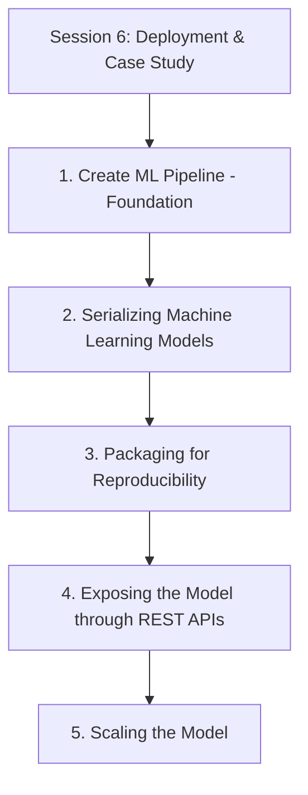
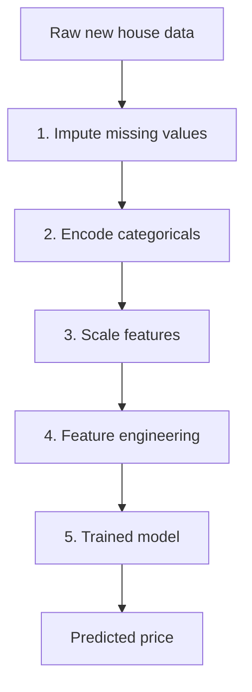
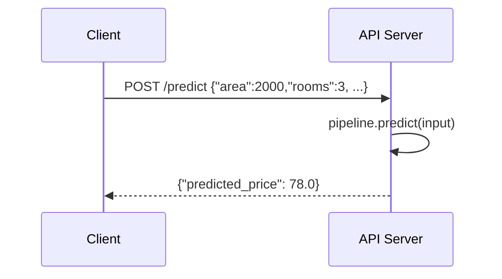

# Session 6: Deployment & Case Study

> Topic: Deployment & Case Study
> Date: Aug 3, 2026

## Concept Hierarchy

**Reordering note:** **Create ML Pipeline** is moved to the front and labelled a **Foundation**, since it is the single artifact (bundling every preprocessing step from [Session 1](01-introduction.md), the feature engineering from [Session 4](04-feature-engineering.md), and the fitted model from [Session 2](02-linear-regression.md)/[Session 5](05-model-optimization.md)) that all four later topics — serializing (2), packaging (3), exposing via API (4), and scaling (5) — actually operate on. The remaining four topics are kept in the natural deployment order: save the pipeline (2), package it so it runs identically elsewhere (3), expose it over the network (4), then handle real-world load (5). No topic was dropped, merged, or added as a new prerequisite — every supplied item appears exactly once below.

**Running example used throughout:** completing the **house price prediction** case study built across [Session 1](01-introduction.md)–[Session 5](05-model-optimization.md) — the fully preprocessed, feature-engineered, regularized regression model is now bundled, saved, packaged, served, and scaled for real use.

---

## 1. Create ML Pipeline (Foundation)

**Meaning** — Chaining every step of the model-building process — cleaning the data, engineering features, and fitting the model — into one single object, so all those steps run automatically, in the correct order, on any new data. An **ML pipeline** is a sequential wrapper of transformation and estimator steps that applies the same fitted preprocessing and model logic consistently to both training and new (unseen) data.

> **Formal definition:** An ML pipeline is a sequential composition of data transformation and estimator steps that applies identical, previously fitted preprocessing and modeling logic to both training and new data.

**Why it matters** — Without a pipeline, each preprocessing step ([Session 1](01-introduction.md)'s missing-value handling, encoding, scaling; [Session 4](04-feature-engineering.md)'s extraction/transformation/selection) has to be manually repeated, in the exact right order, every time new data arrives — an easy place to introduce mistakes or, worse, **data leakage** (accidentally fitting scaling statistics on data that includes the test/new set, the exact caution raised in [Session 1 Section 2.6](01-introduction.md)). A pipeline enforces the fit/transform separation automatically.

**How it works — typical stages (in order)**

1. Missing value imputation ([Session 1 Section 2.1](01-introduction.md)).
2. Categorical encoding, e.g., dummy variables ([Session 1 Section 2.2](01-introduction.md), [Session 3 Section 4.1](03-assumptions-and-model-evaluation.md)).
3. Feature scaling ([Session 1 Section 2.3](01-introduction.md)).
4. Feature engineering — extraction, transformation, selection ([Session 4](04-feature-engineering.md)).
5. The fitted model itself, e.g., a regularized regression ([Session 5 Section 5](05-model-optimization.md)).

#### Diagram — pipeline flow

**Example** — Once built, calling `pipeline.predict(new_house_data)` on a raw new house record (with a missing "age" value and a text "locality" column) automatically imputes the missing age, encodes the locality into dummies, scales the numeric features, applies the chosen engineered features, and returns a price prediction — all in one call.

**Important details** — When the pipeline is fitted (`pipeline.fit(...)`) on training data, each step's own fitting (e.g., computing the mean for imputation, or $x_{min}/x_{max}$ for scaling) happens only on that training data; when later used on new data (`pipeline.predict(...)`), those already-fitted values are reused, never recomputed — this is exactly the mechanism that prevents the data leakage risk from [Session 1 Section 2.6](01-introduction.md).

**Exam focus** — Know the definition of an ML pipeline and, specifically, why bundling preprocessing and modeling together prevents data leakage.

---

## 2. Serializing Machine Learning Models

**Meaning** — Saving a trained model (or, more usefully, the entire fitted pipeline from Section 1) to a file so it can be reloaded and reused later without retraining from scratch. **Serialization** converts an in-memory fitted object — including all its learned coefficients and fitted preprocessing parameters — into a storable, transferable file format.

> **Formal definition:** Serialization is the process of converting an in-memory fitted model or pipeline object into a storable, transferable file format that can be reloaded without retraining.

**Why it matters** — Training a model can be slow or resource-intensive; serialization lets you train once and reuse the *exact* fitted model repeatedly, including in a completely different program or environment (such as the API server in Section 4).

**How it works — common formats**

- **Pickle** — Python's built-in general-purpose serialization format.
- **Joblib** — optimized for objects containing large numpy arrays, the common choice for scikit-learn-style models/pipelines.
- **ONNX** — a cross-platform, language-independent format, useful when the model must be loaded outside Python (e.g., in a Java or C++ service).

**Example** — After fitting the Ridge regression pipeline ([Session 5 Section 5.1](05-model-optimization.md)) on the house-price data, `joblib.dump(pipeline, "house_price_model.pkl")` saves it to disk; later, `joblib.load("house_price_model.pkl")` restores the exact fitted pipeline instantly, without recomputing any coefficients or fitted preprocessing statistics.

**Important details** — **Security caution:** never load a pickle/joblib file from an untrusted source — deserializing such files can execute arbitrary code, since Python's pickle format supports reconstructing arbitrary objects. This is a genuine OWASP-relevant risk in ML deployment, not just a style preference; ONNX is generally a safer choice when a model file's origin cannot be fully trusted.

**Exam focus** — Know why serialization exists (avoid retraining) and be able to name at least one format, along with the untrusted-source security caution.

---

## 3. Packaging for Reproducibility

**Meaning** — Bundling the serialized model (Section 2) together with everything else needed to run it identically anywhere — the exact library versions, the code, and configuration — so it behaves exactly the same regardless of where or when it runs. **Packaging for reproducibility** ensures a deployed model's behavior is deterministic and consistent across environments and over time.

> **Formal definition:** Packaging for reproducibility is the practice of bundling a model together with its exact dependencies, code, and configuration so that its behavior is deterministic and consistent across environments and over time.

**Why it matters** — A model trained with one version of a library can behave differently, or fail to even load, with a different library version later — a common and hard-to-debug real-world deployment failure if not addressed upfront.

**How it works — common practices**

1. **Pin dependency versions** — record exact library versions (e.g., in a `requirements.txt` or `environment.yml`) used at training time.
2. **Containerize** — package the operating system, libraries, code, and the serialized model file together (e.g., using Docker), so the whole environment is reproducible, not just the code.
3. **Version-control code and data** — track the exact training code (and ideally the dataset version) alongside the serialized model, so any past model can be traced back to exactly how it was produced.

**Example** — A Dockerfile that installs the exact scikit-learn version used during training, then copies in the serialized pipeline file (Section 2) and the API code (Section 4), ensures the model behaves identically on any machine that runs the resulting container.

**Important details** — Reproducibility must cover the **entire pipeline** from Section 1, not just the final model's coefficients — since the preprocessing logic (imputation values, scaling statistics, encoding scheme) must also match exactly, or predictions on new data will silently differ from what was intended.

**Exam focus** — Know that reproducibility failures often come from mismatched library versions, and that containerization addresses this by packaging the whole environment, not just the code.

---

## 4. Exposing the Model through REST APIs

**Meaning** — Making the packaged model (Section 3) usable by other programs over a network, by wrapping it in a small web service that accepts input data and sends back a prediction. A **REST API** exposes an HTTP endpoint (e.g., `POST /predict`) that accepts feature values as input (commonly as JSON) and returns the model's prediction as a response.

> **Formal definition:** A REST API is an HTTP-based interface that exposes an endpoint accepting input data and returning a model's prediction as a structured (commonly JSON) response.

**Why it matters** — Most real applications (web apps, mobile apps, other backend services) need to request predictions remotely over a network, rather than running Python code directly — REST APIs are the standard way to expose that capability.

**How it works — steps**

1. Load the serialized pipeline (Section 2) once, when the API server starts.
2. Define an endpoint (e.g., `POST /predict`) that accepts a request body containing feature values (area, rooms, age, locality).
3. Inside the endpoint, pass the input through the loaded pipeline's `predict()` method — reusing the exact same preprocessing from Section 1, not just the final regression formula.
4. Return the prediction as a JSON response.

#### Diagram — request/response flow

**Example** — Sending `{"area": 2000, "rooms": 3, "age": 5, "locality": "Suburb"}` to `POST /predict` returns `{"predicted_price": 78.0}`.

**Important details** — Common frameworks for building this in Python: Flask, FastAPI. The endpoint must run the raw input through the **entire pipeline** (Section 1), including imputation, encoding, and scaling — not just apply the fitted regression coefficients directly to raw values — otherwise predictions won't match what the model was actually trained on.

**Exam focus** — Know the request/response flow, and specifically that the API must apply the full pipeline, not just the model's final formula.

---

## 5. Scaling the Model

**Meaning** — Making sure the deployed API (Section 4) keeps working reliably as more people or systems request predictions, instead of slowing down or failing under load. **Scaling** means adjusting a deployment's resources or architecture to handle an increasing volume of prediction requests.

> **Formal definition:** Scaling is the practice of adjusting a deployed system's resources or architecture to reliably handle an increasing volume of requests.

**Why it matters** — A model that responds instantly to one test request can become very slow, or fail outright, once hundreds or thousands of requests arrive at the same time — a gap between "it works" and "it works in production" that scaling addresses directly.

**How it works — common approaches**

1. **Vertical scaling** — give the existing server more resources (more CPU/RAM) to handle more load on the same machine.
2. **Horizontal scaling** — run multiple copies (replicas) of the API behind a **load balancer**, which distributes incoming requests across them.
3. **Caching** — store and reuse predictions for repeated, identical inputs instead of recomputing them every time.
4. **Batch prediction** — process many prediction requests together in one pass, instead of one at a time, when an immediate real-time response isn't required for every request.

**Example** — If the house-price API starts receiving thousands of requests per minute, running 5 replica instances behind a load balancer (horizontal scaling) distributes the load, instead of every request queuing up at a single overloaded server.

#### Comparison: Scaling Approaches

| Aspect          | Vertical Scaling                    | Horizontal Scaling                             | Caching                                      | Batch Prediction                                         |
| --------------- | ----------------------------------- | ---------------------------------------------- | -------------------------------------------- | -------------------------------------------------------- |
| Meaning         | More resources on one server        | More server replicas + load balancer           | Reuse past results for repeated inputs       | Process many requests together, not one-by-one           |
| Best suited for | Simple setups, moderate load growth | High, unpredictable load                       | Frequently repeated identical requests       | Non-real-time, high-volume scenarios                     |
| Limitation      | Hits a hardware ceiling eventually  | Needs a load balancer and stateless API design | Only helps for repeated inputs, not new ones | Not suitable when each request needs an instant response |

The central difference: vertical and horizontal scaling add raw serving capacity (on one machine vs many), while caching and batching reduce the actual computation needed per request. Choose horizontal scaling for unpredictable, high real-time load; caching when many users request the same prediction; and batch prediction when responses don't need to be instantaneous.

**Important details** — The choice between **real-time serving** (Section 4's REST API, one request at a time, low latency) and **batch serving** (scheduled, many predictions computed together) depends on the use case — a common case-study-style exam question asks you to justify this choice for a given scenario.

**Exam focus** — Know all four scaling approaches, and be ready to recommend one (with justification) for a given load scenario.

**Connection** — This completes the full journey from [Session 1](01-introduction.md)'s raw house-sale data through preprocessing, linear regression, assumption-checking, feature engineering, and model optimization, to a pipeline (1) that is serialized (2), packaged reproducibly (3), exposed via a REST API (4), and scaled for real-world load (5) — the complete lifecycle promised back in [Session 1 Section 1.6](01-introduction.md)'s steps 8–9 (Deployment, Monitoring).

---

## Examination Preparation

### Must understand

- Why bundling preprocessing and modeling into a pipeline prevents data leakage (Section 1).
- Why a REST API endpoint must run input through the entire pipeline, not just the final regression formula (Section 4).
- Why reproducibility must cover the whole pipeline (preprocessing + model), not just the model's coefficients (Section 3).
- How to choose among vertical scaling, horizontal scaling, caching, and batch prediction for a given load scenario (Section 5).

### Must remember

- Pipeline stages in order: imputation → encoding → scaling → feature engineering → model (Section 1).
- Serialization formats: pickle, joblib, ONNX; untrusted-source security caution (Section 2).
- Packaging practices: pinned dependencies, containerization, version-controlled code/data (Section 3).
- REST API flow: load pipeline once → accept JSON input at an endpoint → pipeline.predict() → return JSON response (Section 4).
- Four scaling approaches: vertical scaling, horizontal scaling, caching, batch prediction (Section 5).

### Common question patterns

- *2-mark:* Define ML pipeline / serialization / containerization / horizontal scaling.
- *5-mark:* Why must an API apply the full pipeline and not just the model formula; compare vertical and horizontal scaling; explain the security risk of loading an untrusted serialized model.
- *10-mark:* Explain the complete deployment lifecycle for a trained regression model, from pipeline creation through to scaling, with a worked example at each stage.

### Answer-writing guidance

- *2-mark:* definition + one supporting example.
- *5-mark:* definition, main explanation, key points, example/formula/small diagram.
- *10-mark:* introduction, technical definition, diagram/workflow, detailed explanation, example/application, advantages/limitations, conclusion.

### Model answers

*2-mark:* "Serialization is the process of saving a trained model (or pipeline) to a file so it can be reloaded and reused later without retraining. Example: using joblib.dump() to save a fitted house-price regression pipeline to a .pkl file."

*5-mark:* "A REST API endpoint for a deployed regression model must apply the model's entire preprocessing pipeline to incoming raw data, not just its final fitted coefficients. This is because the model was trained on data that had already been imputed for missing values, encoded from categorical form, and scaled — applying only the regression formula to raw, unprocessed input would produce incorrect predictions, since the input would no longer match the form the model actually learned from. By loading the full serialized pipeline (covering imputation, encoding, scaling, and the model itself) at server startup and calling its predict() method inside the endpoint, the API guarantees that every incoming request is processed through exactly the same steps used during training, keeping predictions consistent and correct."

*10-mark:* "Introduction: once a regression model has been built, validated, and optimized, it must be deployed so it can generate real predictions for real users — this is the final stage of the machine learning lifecycle. Definition: deployment covers bundling the model into a pipeline, saving it, packaging it for consistent behavior across environments, exposing it over a network, and scaling it to handle real load. Diagram/workflow: raw new data → pipeline (impute → encode → scale → feature engineer → predict) → serialized file → packaged environment (e.g., Docker container) → REST API endpoint → scaled deployment (replicas/load balancer). Detailed explanation: a pipeline chains every preprocessing step with the fitted model so both training and new data are processed identically, preventing data leakage; the resulting pipeline is serialized (e.g., via joblib) so it can be reloaded without retraining, with the caution that pickle-based files should never be loaded from an untrusted source due to arbitrary code execution risk; packaging for reproducibility, often via containerization, ensures the exact library versions and code used at training time are preserved so the model behaves identically wherever it runs; a REST API then exposes an endpoint that loads this pipeline once and applies it to every incoming request, returning predictions as JSON; finally, scaling techniques — vertical scaling, horizontal scaling with a load balancer, caching repeated requests, and batch prediction for non-real-time cases — keep the API responsive under real-world load. Example/application: a house-price API receiving a sudden surge of requests could be scaled horizontally by running multiple replica instances behind a load balancer, while frequently repeated identical queries could additionally be served from a cache. Advantages: this pipeline-based deployment approach guarantees consistency between training and serving, and scales cleanly as demand grows. Limitations: containerized, horizontally scaled deployments add infrastructure complexity and cost compared to a single-server setup, and caching or batch prediction are only appropriate for certain kinds of requests. Conclusion: reliable deployment requires treating the whole pipeline, not just the model, as the unit that must be saved, packaged, served, and scaled consistently."

## Practice Questions

### Basic recall

1. List the typical stages of an ML pipeline in order.
   **Answer:** Missing value imputation → categorical encoding → feature scaling → feature engineering → the fitted model (Section 1).
2. Name two common model serialization formats.
   **Answer:** Pickle and Joblib (also ONNX for cross-platform use) (Section 2).
3. What is the security caution associated with loading a serialized model file?
   **Answer:** Never load a pickle/joblib file from an untrusted source, since deserializing it can execute arbitrary code (Section 2).
4. What HTTP method and endpoint pattern is commonly used to expose a model for prediction?
   **Answer:** `POST /predict` (Section 4).
5. Name the four scaling approaches covered in this session.
   **Answer:** Vertical scaling, horizontal scaling, caching, batch prediction (Section 5).

### Conceptual

1. Why does bundling preprocessing steps into a pipeline prevent data leakage?
   **Answer:** Each step's fitting (e.g., computing scaling statistics) happens only on training data when the pipeline is fit; when used on new data, those already-fitted values are reused rather than recomputed, so no information from new/test data leaks into training (Section 1).
2. Why must a REST API apply the full pipeline rather than just the fitted regression formula?
   **Answer:** The model was trained on data that had already been imputed, encoded, and scaled; applying only the raw regression formula to unprocessed input would produce incorrect predictions, since the input wouldn't match the form the model actually learned from (Section 4).
3. Why can pinning library versions alone be insufficient for full reproducibility, and what does containerization add?
   **Answer:** Pinning versions doesn't guarantee the same operating system, system libraries, or environment configuration; containerization (e.g., Docker) packages the entire environment together, ensuring identical behavior anywhere (Section 3).
4. Why is caching only useful for some kinds of prediction requests but not others?
   **Answer:** Caching only helps when identical inputs are requested repeatedly; it provides no benefit for unique, never-before-seen inputs, which still require full computation (Section 5).

### Comparison

1. Compare Vertical Scaling and Horizontal Scaling.
   **Answer:** Vertical scaling adds more resources (CPU/RAM) to one server; horizontal scaling runs multiple replicas behind a load balancer. Vertical scaling hits a hardware ceiling; horizontal scaling handles high, unpredictable load better but needs a stateless API design (Section 5).
2. Compare Caching and Batch Prediction as approaches to handling load.
   **Answer:** Caching reuses results for repeated identical inputs; batch prediction processes many different requests together when an instant real-time response isn't required (Section 5).
3. Compare Pickle/Joblib and ONNX as serialization formats.
   **Answer:** Pickle/Joblib are Python-specific and convenient for scikit-learn-style objects but pose a security risk if loaded from an untrusted source; ONNX is a cross-platform, language-independent format, generally safer when a model file's origin can't be fully trusted (Section 2).

### Scenario / application

1. A deployed model behaves differently on a colleague's machine than it did during training — which section's practice was most likely skipped, and what should be done?
   **Answer:** Packaging for reproducibility (Section 3) was likely skipped — pin dependency versions and/or containerize the environment so it runs identically everywhere.
2. An API needs to serve predictions to a mobile app in real time, with unpredictable traffic spikes — which scaling approach fits best, and why?
   **Answer:** Horizontal scaling (Section 5), since running multiple replicas behind a load balancer handles unpredictable, high real-time load better than a single, vertically-scaled server.
3. A company needs to generate price estimates for 100,000 houses overnight, with no real-time requirement — which serving approach from Section 5 fits best?
   **Answer:** Batch prediction (Section 5), since responses don't need to be instantaneous and processing many requests together is more efficient.

### Long-answer

1. Explain how an ML pipeline is built and why it prevents data leakage, using the house-price example.
   **Answer:** See Section 1 and its worked example — the pipeline chains imputation, encoding, scaling, feature engineering, and the model, fitting each step's parameters only on training data and reusing them (never recomputing) on new data.
2. Explain the complete deployment workflow from serialization through to scaling, including the risks addressed at each stage.
   **Answer:** See Sections 2–5 and the 10-mark model answer in Examination Preparation, which walks through serialization's untrusted-source risk, packaging's reproducibility risk, the API's full-pipeline requirement, and scaling's load-handling tradeoffs.

## Quick Revision

- **One-sentence summary:** Deploying a regression model means bundling its preprocessing and fitting logic into a pipeline, serializing that pipeline, packaging it for reproducible behavior everywhere, exposing it through a REST API, and scaling the deployment to handle real-world load.
- **Hierarchy:** see Concept Hierarchy above.
- **Essential definitions:** ML pipeline (1); serialization, pickle/joblib/ONNX (2); packaging/containerization (3); REST API/endpoint (4); vertical/horizontal scaling, caching, batch prediction (5).
- **Key formulas:** none — this session is process/architecture-focused rather than formula-based; see diagrams in Sections 1 and 4.
- **Most important comparison:** the four scaling approaches (Section 5 table) — governs which fits a given load scenario.
- **5 exam keywords:** data leakage, joblib, containerization, REST endpoint, load balancer.
- **5 common mistakes:** applying only the regression formula to raw input instead of the full pipeline; loading a serialized model file from an untrusted source; assuming pinned library versions alone guarantee reproducibility; assuming vertical scaling can grow indefinitely; using caching for requests that are rarely repeated.

## Topic Coverage

- Serializing machine learning models — Covered in Section 2
- Exposing the model through Rest APIs — Covered in Section 4
- Packaging for reproducibility — Covered in Section 3
- Create ML pipeline — Covered in Section 1
- Scaling the model — Covered in Section 5
