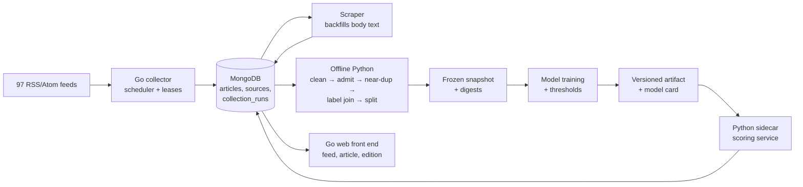

# A Dynamic E-Newspaper Built on Classical Machine Learning

**Semester 1 mini-project report — Supervised Machine Learning (Classification)**

| | |
| --- | --- |
| Student | Mohamed Riaz |
| Roll number | PES1PGE25DS037 |
| Course | Supervised ML — Classification (Semester 1) |
| Project | Regional news collection, topic classification and edition assembly |
| Report date | 26 August 2026 |
| Repository | `semester-1/06-supervised-ml-classification/mini-project/news` |

---

## Abstract

This project builds an end-to-end news system: a service that continuously collects
articles from 97 RSS and Atom feeds into MongoDB, an offline machine-learning pipeline
that files each article under one of 13 topics, and a web front end that presents the
result as a self-assembling newspaper. The classifier is the centrepiece and the part
this report evaluates most closely.

Two complete modelling passes were run. The first (`ml/`) classifies from the headline
and opening sentence and reaches a validation macro-F1 of **0.720**, with a test-split
figure of **0.722** obtained by opening that split exactly once. The second (`ml-v2/`)
re-runs the study with stronger statistics and tests one specific hypothesis: that the
full article body, now available for 94.9% of the corpus, carries more topical signal
than a headline does. It does — the body is worth **+0.059 macro-F1** (0.712 → 0.771),
with non-overlapping bootstrap confidence intervals and McNemar *p* = 7.5 × 10⁻⁶.

The more interesting result is the set of things that did **not** work. Feature
engineering, entity scrubbing, gradient-boosted trees, random forests, sentence
embeddings and four different ensembles were each measured against the linear baseline
and each lost or tied. On this data the classifier was never the bottleneck; the data
preparation was. A perfect selector over the candidate models would score 0.900 against
the incumbent's 0.771, but every reachable ensemble lands on 0.771 with McNemar
*p* = 1.0000, because the disagreement between models is asymmetric — the diverse models
destroy roughly twice as many correct answers as they rescue.

---

## 1. Introduction

### 1.1 Motivation

A news reader sees the same story five times because five publishers ran the same wire
copy, and sees it filed under whatever section the publisher happened to choose. The
goal here was a newspaper that organises itself: it decides what a story is about, folds
syndicated copies of the same story together, and assembles a front page — all from
classical machine learning, with no large language model anywhere in the pipeline.

That constraint is deliberate. The point of the exercise is to show that the techniques
covered this semester are sufficient for a real product, and to be able to explain every
prediction the system makes.

### 1.2 Objectives

1. Collect a real, continuously growing news corpus reliably and lawfully.
2. Produce a hand-labelled gold dataset large enough to train and honestly evaluate a
   multi-class classifier.
3. Build and evaluate a topic classifier over a fixed 13-class taxonomy, reporting
   uncertainty rather than point estimates.
4. Give the model a defensible way to say "I don't know" instead of guessing.
5. Assemble the output into a dynamic e-newspaper.

Objectives 1–4 are complete. Objective 5 is designed and partially built; §9 states
exactly what remains.

### 1.3 Scope and constraints

Four hard constraints shaped every decision:

- **No LLMs**, at training or inference. Transformer encoders were tested once, as a
  measured baseline, and rejected on the numbers.
- **Serving fits in 2 GB RAM** on an 8 GB home server. Training happens offline on a
  laptop, so the serving budget never distorts the modelling.
- **The test split is touched exactly once.** A test split consulted during tuning is a
  validation split wearing a disguise.
- **The raw corpus is never redistributed.** It is third-party copyrighted text
  collected for study. Only figures, metrics and derived features are published.

---

## 2. System architecture



The collector is written in Go (1.26) and deployed to a home server via Docker Compose.
It respects `robots.txt`, rate-limits per host, guards against SSRF on every outbound
request, and holds a per-source lease so two scheduler instances never collect the same
feed twice. Deduplication is enforced by unique indexes at the database level on
normalised URL, on `(source_id, feed_guid)` and on `(source_id, content_hash)`.

The machine-learning code is a separate offline Python package (`uv`-managed, pinned,
seeded) that never runs on the server. It reads MongoDB, freezes a **snapshot** — an
immutable copy of the corpus, its labels and a manifest of content digests — and every
reported number is reproducible from the triple `(snapshot_id, git SHA, seed)`. Running
`newsml verify` rebuilds a snapshot and compares digests byte-for-byte against a
database that has since grown by a thousand articles.

---

## 3. The data

### 3.1 Corpus

At the frozen cut of 2026-08-26T12:00Z the corpus held **14,189 articles** from 95
section feeds belonging to **38 publishers**. After the admission stage, 13,607 remained
(4.1% rejected). Publication timestamps span 2025-09-13 to 2026-08-26, but collection
timestamps span only four days — the corpus is a wide sample of recent news, not a
longitudinal one, and that limits what can be said about concept drift.

| Field | Non-empty |
| --- | --- |
| title | 100.0% |
| body | 94.9% |
| summary | 79.2% |
| categories | 64.6% |
| dateline city | 2.7% |

Article length is heavily skewed: the median body is 3,313 characters but the longest is
175,331 — fifty-three times the median. That single fact is why body truncation became a
first-class experiment rather than an implementation detail (§6.2).

### 3.2 Taxonomy and labels

The taxonomy is **13 flat classes** based on the top level of IPTC Media Topics — the
same set of sections a major international paper uses. An earlier two-level, 26-class
version was tried and abandoned: a like-for-like test showed the finer model scored
0.693 against 0.685 when both were evaluated over the same 13 groups, so the extra
resolution bought nothing, and the classes that failed did so because they were not
linguistically distinct, not because they were thin.

Labels are **8,001 hand-labelled articles** collected over four blind rounds. Sheets
were sharded four ways with a 40-article overlap block so inter-annotator agreement
could be measured, and no proposed class name ever appeared on a sheet — a labeller
shown a suggestion rubber-stamps it.

| Class | Labelled | Share |
| --- | ---: | ---: |
| politics | 1,571 | 19.8% |
| business_economy | 916 | 11.6% |
| entertainment_arts | 734 | 9.3% |
| crime_justice | 723 | 9.1% |
| sport | 716 | 9.0% |
| technology | 630 | 8.0% |
| health | 486 | 6.1% |
| society_lifestyle | 439 | 5.5% |
| disaster_accident | 401 | 5.1% |
| education | 398 | 5.0% |
| science_space | 373 | 4.7% |
| environment_climate | 298 | 3.8% |
| conflict_war | 234 | 3.0% |

Class imbalance is **6.7:1**, handled by `class_weight="balanced"` rather than
resampling — resampling a text corpus either duplicates rows the near-duplicate stage
just finished merging, or throws away real data.

### 3.3 Weak labels, and why they were retired

An early design used the publisher's own RSS section as a free training label. Measured
against human labels, the weak labeller agreed only **73.8%** of the time where it fired
at all, and covered just 66% of articles. Worse, it can never express `crime_justice`,
`conflict_war` or `disaster_accident`, because no publisher runs a "Crime" or "War"
section — those stories hide inside the general national feed. Weak labels were dropped
from training entirely. Every label the shipping model saw is human.

### 3.4 Label noise is a real ceiling

Grouping same-story articles and checking label agreement showed that **18–22% of
multi-article story groups carry disagreeing labels**, stable across three similarity
cuts. Inspecting them showed these are not carelessness but taxonomy boundary
collisions:

| Same story | Labels given |
| --- | --- |
| Ukraine shopping-centre strike | politics vs conflict_war |
| Gujarat hooch tragedy | disaster_accident vs crime_justice |
| Ex-cricketers' letter on Imran Khan | politics / crime_justice / sport |
| NCERT textbook panel | politics vs education |

The most frequently disagreeing pairs — conflict_war↔politics, business_economy↔politics,
crime_justice↔disaster_accident — are **exactly the pairs the trained classifier confuses
most**. Part of the model's error is in the labels. Targeting a macro-F1 of 0.90 on this
data would mean targeting annotation noise.

---

## 4. Data preparation

### 4.1 Cleaning and admission

Cleaning is deterministic and versioned (`CLEANING_VERSION`), so a snapshot names one
exact transformation. Unicode normalisation alone was not enough — NFKC does not fold
curly quotes or en/em dashes, so an explicit character fold was added, without which
reworded wire copy escapes duplicate detection.

Admission rejects non-articles by reason code, and the partition function raises rather
than returning an unbalanced result, so **100% of the input/output difference is
accounted for**. The dominant reasons are `too_short` and `implausible_timestamp`;
content-format rules account for only ~2%.

One admission rule was found by running a proposed regular expression over the whole
corpus and reading every hit — a `travel advisory` pattern intended to reject tourism
bulletins was matching a diplomacy story about visa policy. It was narrowed and a
regression test added. Every rule since has been validated the same way.

### 4.2 Near-duplicate detection

Indian news is heavily syndicated (PTI/ANI/IANS), so the same story appears under many
mastheads. Exact content hashing catches none of it — publishers reword headlines.
MinHash with locality-sensitive hashing does.

The important lesson here was a diagnostic one. The similarity threshold had been set at
0.72 and was assumed to be the problem. Labelling a census of 43 boundary-region pairs
showed the threshold recovered only **7 of 31 real duplicates (recall 0.226)**. But
moving the threshold from 0.72 to 0.44 changed the number of merges by only 4 — because
the LSH *banding* (16 bands × 8 rows) requires an entire 8-row band to match before a
pair is even proposed for comparison. Re-banding to 32 × 4 and then lowering the cut
raised recall to 0.90 at precision 0.80.

Precision **cannot** reach 0.90 at any threshold, and the acceptance criterion was
formally recalibrated with the reason recorded. The residual false positives are four
named kinds — recurring daily features (gold rates, a daily astronomy picture), the same
feature published as both video and podcast, follow-ups revising an earlier story, and
two articles whose entire body is site boilerplate. Each is genuinely near-identical text
about a different thing. That needs a recurring-template rule, not a different number.

**481 story groups span more than one publisher.** These are the syndicated copies that
would leak across a train/test boundary if the split ignored them.

### 4.3 Splitting

The split is **grouped and temporal**: cut on time quantiles first, then drop any story
group straddling a boundary whole. Doing it the other way round — ordering groups and
then using the maximum publication time of the training set — let a single
corpus-spanning group empty the validation and test sets entirely (observed: train 721,
val 0, test 1).

A second, subtler failure: taking time quantiles over the *whole* corpus put only 37
labelled articles into the test split, because labelling stops the day a round is drawn.
The fix was to compute quantiles from the **labelled** rows and apply those boundaries to
all rows, freezing the two cut times in the manifest.

---

## 5. Evaluation methodology

This is the part of the project I would defend hardest, because the first pass got it
wrong in a way that is easy to miss.

**Version 1 tuned and selected on the same ~600-row validation split, and reported point
estimates.** With a validation set of that size the standard error on macro-F1 is roughly
±0.02–0.03, which means the per-class swings of ±0.07 that were being read as signal
across labelling rounds were noise. Version 2 fixed this with four changes:

1. **`StratifiedGroupKFold` on the training set** for all tuning; the validation split is
   used only for final selection. Grouping is by story cluster, so a syndicated copy can
   never sit on both sides of a fold.
2. **Bootstrap confidence intervals resampled by story group**, not by article.
   Article-level bootstrap under-reports variance whenever near-duplicate clusters exist.
3. **McNemar's test** for paired model comparisons, which is the right test when two
   classifiers are scored on the same items.
4. A decision rule agreed in advance: **any difference under ~0.03 on a single split is
   noise**, and where two models' intervals overlap, the simpler one ships.

The headline metric is **macro-F1**, not accuracy. With 13 classes and a 6.7:1 imbalance
a model that ignores every small class still posts a respectable accuracy; macro-F1
refuses to hide that. The majority-class floor is 0.035, which is the number every result
below should be read against.

Publisher holdouts are evaluated as *whole publishers*, never as section feeds. Holding
out `The Indian Express — Technology` once produced a macro-F1 of 0.111, which looked
like catastrophic leakage and was pure arithmetic: a section feed carries one class, so
five of six classes had zero support in the macro average.

---

## 6. Modelling and results

### 6.1 Baseline ladder (version 1, headline + lede)

| Rung | Val macro-F1 |
| --- | ---: |
| majority class | 0.035 |
| hashing + SGD | 0.562 |
| ComplementNB | 0.638 |
| TF-IDF + LinearSVC | **0.680** |

After the final labelling round the same pipeline reached **val macro-F1 0.720 /
accuracy 0.753** on 5,525 training articles. Macro AUC was 0.933. Holding out the whole
of *The Indian Express* (1,098 articles) moved macro-F1 by **0.029** — it learned topic,
not house style. A leakage audit confirmed the top features per class are subject words
(`cricket`/`innings`, `film`/`actor`, `students`/`exam`, `ai`/`openai`) with no wire
credit, timezone or masthead anywhere.

The **test split was opened once**, through a single call site, and scored **0.722**
against a validation figure of 0.671 at that time — a gap of 0.051, one point over the
nominal guard but in the direction that matters least, with the small classes swinging
most. It was accepted as measured rather than re-run.

### 6.2 The body hypothesis (version 2)

Version 1 deliberately trained on `title + lede` because body availability tracked the
*publisher* rather than the topic, so training on it risked learning the masthead. Once
the scraper had drained its queue, body coverage reached 94.9% and was uniform across
classes (89.7%–99.3%), which removed that objection and made the hypothesis testable.

| Body characters | Val macro-F1 | The Hindu holdout | The Guardian holdout |
| --- | ---: | ---: | ---: |
| none (summary only) | 0.712 | 0.688 | 0.675 |
| 512 | 0.759 | 0.730 | 0.665 |
| 2,048 | 0.774 | 0.752 | 0.700 |
| **4,000** | **0.771** | **0.772** | **0.726** |
| 8,000 | 0.783 | 0.760 | 0.721 |
| full | 0.781 | 0.765 | 0.712 |

The body is worth **+0.059 macro-F1** with disjoint intervals and McNemar
*p* = 7.5 × 10⁻⁶. The curve climbs steeply to about 2,048 characters and then flattens —
8,000 is nominally best, but its interval overlaps everything from 2,048 upward, so the
extra text is not measurably worth anything. 4,000 characters was selected on the
tiebreak that matters: it has the best publisher holdout on **both** mastheads.

Repeating the title to up-weight it — the cheap alternative to a weighted feature union —
made things monotonically **worse** (×1: 0.783, ×2: 0.768, ×3: 0.764, ×5: 0.751). That
settled the field-weighting question in the opposite direction to the prior and removed a
whole tuning dimension.

### 6.3 Model families

| Candidate | Val macro-F1 [95% CI] | Hindu | Guardian | Fit (s) |
| --- | --- | ---: | ---: | ---: |
| **LinearSVC, C=1 (incumbent)** | **0.771 [0.743, 0.796]** | 0.772 | 0.726 | 8.8 |
| LinearSVC, C=3 | 0.772 [0.743, 0.797] | 0.768 | 0.712 | 11.4 |
| LogisticRegression, C=10 | 0.751 [0.720, 0.775] | 0.763 | 0.736 | 23.4 |
| XGBoost on 256 SVD components | 0.735 [0.705, 0.761] | 0.721 | 0.679 | 41.9 |
| Random forest | 0.730 [0.698, 0.757] | 0.705 | 0.695 | 22.0 |
| MiniLM embeddings + logistic | 0.710 [0.679, 0.736] | 0.718 | 0.693 | 0.2 |
| Extra trees | 0.684 [0.651, 0.712] | 0.686 | 0.648 | 20.1 |

Three findings:

- **Tuning is exhausted.** A sixfold swing in the regularisation parameter `C` moves
  macro-F1 by 0.002. The model sits on a flat optimum.
- **Trees lose for a structural reason.** Text lives in a ~200,000-dimensional sparse
  space where classes are near-linearly separable. Reducing to 256 SVD components to make
  trees usable discards exactly the discriminative detail the linear model exploits.
  Giving XGBoost *more* capacity (512 components, depth 8) made it **worse** — the
  signature of a wrong inductive bias, not underfitting.
- **MiniLM lands at 0.710, almost exactly the title-only TF-IDF score of 0.712.** That is
  the tell: MiniLM truncates at 256 tokens (~200 words), while the body advantage comes
  from ~500 words. The embedding model structurally cannot see the thing that made the
  body work.

### 6.4 The ensemble result

The prior was that ensembling would be a formality: the alternatives are uniformly
weaker, so a vote would not help. That prior was **wrong in an interesting way**.

The models genuinely disagree. A perfect selector over all ten candidates would score
**0.900 [0.878, 0.919]** against the incumbent's 0.771 — disjoint intervals, a gap of
0.129. MiniLM alone is right on 70 of the incumbent's 231 errors.

And yet every reachable ensemble lands on the incumbent: one-per-family 0.772, linear
family 0.771, top-five 0.772, all ten 0.770. Best vote 0.772 versus 0.771, **McNemar
*p* = 1.0000**. Four member sets, four ties.

The pairwise table explains it:

| Member added | Disagrees | Rescues | Destroys | Net |
| --- | ---: | ---: | ---: | ---: |
| LinearSVC C=0.5 | 28 | 10 | 8 | **+2** |
| LogisticRegression C=10 | 135 | 40 | 59 | −19 |
| XGBoost SVD-256 | 181 | 53 | 89 | −36 |
| MiniLM + logistic | 271 | **70** | **148** | −78 |
| Extra trees | 226 | 39 | 120 | −81 |

**The more diverse the member, the worse the trade.** MiniLM rescues the most articles and
also destroys the most, better than 2:1 against. The disagreement is *asymmetric*: a
weaker model is far more often wrong where the incumbent is right than right where the
incumbent is wrong, and a majority vote has no way of knowing which side of that trade it
is on. Soft voting and stacking were therefore refused on the evidence rather than run
for completeness.

The 0.129 oracle gap is not wasted, though. It is the measured upper bound on what
*confidence-based routing* could buy — because the closest reachable thing to a selector
is per-class thresholds and abstention.

### 6.5 Final model

**`word_char_svc` on title + 4,000 characters of body, `class_weight="balanced"`,
validation macro-F1 0.771 [0.743, 0.796].**

| Class | F1 | | Class | F1 |
| --- | ---: | --- | --- | ---: |
| sport | 0.95 | | politics | 0.78 |
| entertainment_arts | 0.89 | | conflict_war | 0.74 |
| science_space | 0.86 | | health | 0.72 |
| disaster_accident | 0.84 | | education | 0.71 |
| business_economy | 0.84 | | environment_climate | 0.69 |
| technology | 0.81 | | society_lifestyle | **0.42** |
| crime_justice | 0.79 | | | |

---

## 7. Knowing when to abstain

A classifier that must answer is worse than one that can decline. Every article the model
files wrongly is a story a reader finds in the wrong section.

Abstention uses **per-class thresholds, never one global cut**, because the classes are
not equally learnable: `sport` reaches F1 0.95 and needs a low bar, `society_lifestyle`
sits at 0.42 and needs a high one. Thresholds are chosen to hit a target precision of 80%
per class. On version 1 this converted 0.753 raw accuracy into **0.832 accuracy on the
82.9% of articles it still files**; the rest are routed to an `unsorted` tray.

`LinearSVC` has no probability output at all — a margin is a distance from a hyperplane
and must never be shown to a user as a confidence — so the model is wrapped in Platt
scaling. Calibration was assumed to be expensive and measured to be **free**: 0.678
calibrated against 0.680 raw, well inside noise.

One class ships as a **permanent forced abstainer**. `society_lifestyle` scored F1 0.42 at
headline length and **0.421** with 500 words of body — two independent measurements at
100× the input length agreeing to three decimal places. That is a definition problem, not
a data problem: the class is "community + labour + lifestyle" glued together, and adding
185 training rows in one labelling round made it *worse*. Its best achievable threshold
gave 0.64 precision, below every other class's *target*. Rather than a fifth relabelling
round, its threshold is set to infinity so it always routes to `unsorted`. That is a
recorded decision, not an unmeasured default.

---

## 8. What the semester's coursework contributed

| Subject | Where it appears in this project |
| --- | --- |
| **Python** | The whole offline pipeline: a `src`-layout package with a CLI, dependency-pinned and seeded, ~195 unit tests, Parquet + zstd snapshot storage, and the ground rule that notebooks *call* library code and never define logic — so every reported number is reproducible from a script and covered by a test. |
| **Statistics & Analytics** | The core of §5. Sampling and stratification; standard error on a proportion, which is what told us ±0.07 per-class swings were noise; bootstrap confidence intervals resampled by group; McNemar's test for paired classifiers; hypothesis testing discipline — stating the decision rule *before* seeing the result; and the distinction between an upper bound (the 18–22% label-noise figure) and a point estimate. |
| **DB & SQL** | Schema and index design in MongoDB: unique compound indexes doing deduplication at the storage layer rather than in application code, query planning for the profiling aggregations (`$group`, `$avg`, `$strLenCP`), a migration path, and the decision to keep the raw collection immutable with all cleaning as a derived, versioned artifact. The document model was chosen over a relational one because feed items are ragged and schema-on-read, but the set-based thinking, indexing and normalisation trade-offs are the same ones the course taught. |
| **Data Visualisation** | Figures are the argument, not decoration. A 26×26 confusion matrix with printed values was unreadable, so it became an unannotated heat map plus a ranked top-12 confusion list; per-class scores became horizontal bars sorted by F1 with support printed alongside, because a recall of 1.000 on seven validation articles is noise dressed as a result; ROC curves grey out all but the best and worst three. A shared token layer means report figures and the web UI use one palette, and contrast was verified with a checker rather than by eye. |
| **Supervised ML — Regression** | More transferable than it first looks. Regularisation (`C` is an inverse L2 penalty, swept exactly as in the ridge/lasso material), gradient descent (the `hashing + SGD` rung), the bias–variance framing behind the learning curve over ten growing training slices, feature engineering and ablation discipline, and the fact that the planned front-page ranker is a documented linear scoring function whose weights must each be justified. The course's model-evaluation and deployment material is what produced the model card. |
| **Supervised ML — Classification** | Everything in §6 and §7. The baseline ladder from a majority-class floor upward; TF-IDF and n-gram feature extraction; naive Bayes, linear SVM, logistic regression, random forest, extra trees and boosting compared on one table; class imbalance and `class_weight`; precision, recall, specificity and F1 derived by hand from the confusion matrix with scikit-learn used only as the assertion; macro versus micro versus weighted averaging, and the `micro-F1 == accuracy` identity; one-vs-rest ROC and macro AUC; probability calibration; ensembling and why it failed here; and confidence thresholding for abstention. |

---

## 9. Limitations and threats to validity

- **Four days of collection.** Publication dates span a year, but arrival times span four
  days. Nothing in this report says anything about concept drift, and any claim that it
  does would be unsupported.
- **A single annotator produced most labels.** The overlap block measures self-consistency,
  not inter-annotator agreement. After three rounds it reported zero disagreements, which
  means label noise is no longer estimable from it — 100% self-agreement is not evidence
  of correctness.
- **The corpus is Indian-English-dominant.** The Guardian and BBC provide an
  out-of-distribution check, and the model loses about 0.045 macro-F1 on The Guardian,
  which is the honest generalisation figure to quote.
- **`society_lifestyle` does not work** and ships abstaining. That is a taxonomy defect,
  documented rather than hidden.
- **Macro-F1 has a ceiling below 1.0** because of the label disagreements in §3.4. The
  practical ceiling on the three colliding classes is well under `sport`'s 0.95.
- **Two model versions coexist.** The 0.771 result is a proof of concept and has not been
  through a test split or a deployment review; the 0.720 model is the one that is packaged,
  carded and serviceable. Choosing between them is the next decision, not a settled one.

---

## 10. Remaining work

| Phase | Content | State |
| --- | --- | --- |
| Confidence routing | Calibration diagnostics (Brier, log loss, ECE, reliability curves), per-class thresholds fitted on out-of-fold training probabilities, three-band auto/review/unknown routing | In progress |
| Error analysis and holdouts | Full confusion analysis, both publisher holdouts, a single test-split opening, behaviour check on live unlabelled news | Next |
| Serving integration | Python sidecar over a local socket, scoring every new article within one scheduler interval, resumable corpus backfill, and golden train/serve parity fixtures asserted from **both** the Python and Go test suites — the single biggest risk in that phase | Designed |
| Event clustering and summarisation | Online leader–follower clustering against cluster centroids, evaluated with B-cubed F1 on a hand-grouped set drawn from one busy day; multi-document extractive summarisation with TextRank + MMR, scored with ROUGE against hand-written summaries | Designed |
| Edition assembly | Scheduled edition with a masthead; front page ranked by importance, freshness, novelty and interest with every weight justified; diversity caps enforced by test; sections from the classifier; a "today's news map" from a truncated SVD projection to two dimensions | Designed |

---

## 11. Conclusion

The system collects 14,189 news articles from 38 publishers, cleans and deduplicates them
deterministically, and files them under 13 topics at a validation macro-F1 of **0.771**
against a majority-class floor of 0.035, abstaining on the cases where its confidence does
not support an answer.

The result I would put first in a viva, though, is not that number. It is that **six
separate attempts to improve the model — entity scrubbing, feature engineering, boosted
trees, bagging, sentence embeddings and four ensembles — were each measured properly and
each failed**, while one change to the *data* (reading the article instead of the headline)
was worth +0.059 with a *p*-value of 7.5 × 10⁻⁶. The classifier was never the bottleneck.

The ensemble result taught me the most. "The models are complementary, so voting will
help" is a reasonable prior, and it was measurably wrong here: the complementarity is real
(oracle 0.900) but asymmetric, so the vote is a flat line at *p* = 1.0000. Without paired
significance testing and group-resampled intervals I would have shipped a more complicated
model on a +0.001 difference and believed I had improved something.

---

## Appendix A — Reproducing the results

```bash
# Go collector gates
make check && make test-race && make test-integration

# Freeze a dataset with its labels, then prove it rebuilds identically
make ml-snapshot CUT=2026-08-26T12:00:00+00:00
make ml-verify

# Fit the shipping model, choose its per-class cuts, write the bundle + card
make ml-train SNAPSHOT=data/snapshots/20260826-120

# Version 2 experiments (from ml-v2/)
uv run python scripts/phase_d_features.py
uv run python scripts/phase_e_families.py
uv run python scripts/phase_f_ensemble.py
```

Every model artifact ships with a generated model card recording the model version, git
SHA, snapshot id, cleaning and taxonomy versions, corpus cut, vectoriser configuration,
label map, per-class thresholds and metrics. No number in this report was typed by hand
into a document; each one is reproducible from a snapshot id and a commit.

## Appendix B — Serving cost

| Measure | Value |
| --- | --- |
| Inference | 0.059 ms/article (budget: 20 ms) |
| Artifact size | 20.4 MB (budget: 100 MB) |
| Resident memory target | < 2 GB on an 8 GB host |
