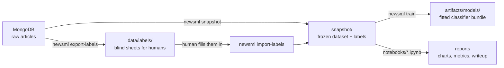

# `ml/` — offline data prep and modelling for the news collector

The Go service in [`news/`](../) only collects articles into MongoDB. Everything
that turns those articles into a topic classifier — cleaning, labelling,
training, evaluating — lives here, in a separate Python project. Nothing in
`ml/` runs on the collector; it is a laptop-only, offline side project that
reads the database and writes files to disk.

If you are new to this repo, read this file top to bottom once, then come back
to whichever section you need.

## 1. The five-minute mental model



- **MongoDB** holds every collected article. `ml/` only ever reads it.
- A **snapshot** is a frozen, reproducible copy of "the corpus + the labels
  that exist as of this moment", written to `data/snapshots/<id>/`. Every
  number in the notebook is computed from one snapshot, not the live,
  growing database — re-run the notebook next month and the numbers don't move.
- **Labels are mostly human.** A small "weak label" guess comes from the RSS
  feed section, but it only covers ~2/3 of articles and can't see three whole
  topics (crime, war, disaster) at all. The real labels came from three rounds
  of people reading headlines and picking a topic — that's what
  `data/labels/` and the `export-labels` / `import-labels` commands are for.
- **Training** fits a model against a snapshot and writes a "bundle" (the
  fitted model + per-class confidence thresholds + a model card) to
  `artifacts/models/`.
- **The notebook** is where you *read* the results — it calls the library in
  `src/newsml/`, it never contains modelling logic itself.

## 2. Directory map

```
ml/
├── src/newsml/       the actual logic — everything else only calls this
├── notebooks/        one notebook that reads a snapshot and reports on it
├── tests/            pytest suite for src/newsml/
├── data/             labels, near-dup pairs, and frozen snapshots (mostly gitignored)
├── artifacts/        boilerplate.yaml + trained model bundles (mostly gitignored)
├── reports/          corpus profile report + figures
├── taxonomy.yaml     the fixed list of 13 topic classes
├── pyproject.toml    dependencies (managed with uv)
└── requirements.txt  same deps, plain pip format
```

### `src/newsml/` — what each module is for

Think of this as a pipeline, roughly top to bottom:

| Module | Purpose | You touch this when... |
|---|---|---|
| `load.py` | Read-only access to MongoDB (the raw "bronze" articles). | never directly — everything else calls it |
| `clean.py` | Normalise text: unicode, quotes/dashes, strip datelines/wire credits/share prompts. | you see junk text getting through to the model |
| `admit.py` | Decide what even counts as an article — drops horoscopes, listicles, weather bulletins, stubs under 12 words, each with a reason code. | a non-article is leaking into training data |
| `boilerplate.py` | Learn each source's boilerplate lines automatically instead of hand-listing them. | onboarding a new, noisy source |
| `neardup.py` | Find near-duplicate articles (same wire story, reworded) via MinHash/LSH, so they can't land on both sides of a split. | tuning how aggressively duplicates are grouped |
| `pairs.py` | Build/calibrate the human-labelled sheet used to tune the near-dup threshold. | recalibrating near-dup detection |
| `labels.py` | The taxonomy and "weak" labels guessed from feed section / publisher / category tags. | changing what a feed section maps to |
| `annotate.py` | Build blind labelling sheets for humans, and read the completed sheets back (agreement checks, adjudication, targeted sampling for thin classes). | running a new labelling round |
| `splits.py` | Train/validation/test split that is both **grouped** (no story on both sides) and **temporal** (test is always after train). | changing the split logic |
| `dataset.py` | Glues it all together: clean → admit → dedupe → label → split → the `Dataset` the models train on. | the main "build me a dataset" entry point |
| `models.py` | The model ladder (majority baseline → Naive Bayes → linear SVM → SGD) and how each is scored. | adding/removing a model to compare |
| `thresholds.py` | Per-class confidence cuts so the model can say "unsorted" instead of guessing wrong; some classes are forced to always abstain. | tuning precision vs. coverage |
| `snapshot.py` | Freeze a dataset + labels to disk as a reproducible, hashable snapshot. | you want a number that doesn't change tomorrow |
| `train.py` | Fit the shipping model from a snapshot, choose its thresholds, write the model card + bundle. | producing a model you'd actually ship |
| `profile.py` | Corpus-wide stats report (counts, field coverage, sources) — no modelling. | just want to know what's in the DB right now |
| `config.py` | Constants and the Mongo URI resolution (env var → `.env` fallback). | pointing at a different database |
| `cli.py` | Wires all of the above into the `newsml` command (see below). | adding a new CLI command |

Every module has a docstring at the top explaining the "why" in more detail —
worth reading before changing one.

### `data/` and `artifacts/`

- `data/labels/` — the labelling sheets and the resulting `gold.jsonl` files
  (one folder per round: `pilot`, `v1`, `v2`, `v3`). Mostly gitignored raw
  sheets; the gold label files are what actually matters.
- `data/pairs/` — the near-duplicate calibration sheet and its answer key.
- `data/snapshots/<id>/` — frozen datasets. `<id>` is a date-based tag; a
  snapshot directory has a manifest, digests, and joined labels.
- `artifacts/boilerplate.yaml` — per-source template lines discovered by
  `newsml boilerplate`, reviewed by hand, then used by `clean.py`.
- `artifacts/models/<name>-<snapshot-id>/` — a fitted model bundle: the
  `.joblib` file (gitignored, ~11 MB), `manifest.json`, and `model-card.md`
  (both committed — provenance without the binary).

## 3. Setup

```bash
cd ml
uv sync --group dev        # or: make ml-setup, from the news/ directory
```

Uses **uv** with `.python-version` pinned to 3.12 (`requires-python = ">=3.12"`
in `pyproject.toml`, so 3.13 also works if you're not using uv).

Reading the live database needs a Mongo URI. `config.mongo_uri()` falls back to
reading `NEWS_MONGO_URI`/`NEWS_MONGO_DATABASE` out of `../.env` automatically —
you don't normally need to export anything by hand.

## 4. How to run things

Everything is a subcommand of `newsml`, run from inside `ml/` (`uv run newsml
<command>`), or via a `make ml-*` target from the `news/` directory. Prefer the
`make` targets — they fill in the fiddlier flags for you.

| I want to... | Command | What it does |
|---|---|---|
| See what's actually in the database | `make ml-profile` | Writes `reports/corpus-profile.md` + figures. No modelling, just stats. |
| Run the test suite | `make ml-test` | pytest over `tests/`. Run this after touching any `src/newsml/` file. |
| Check the notebook still works | `make ml-notebook` | Executes every notebook headlessly; fails if one has rotted. Output goes to `/tmp/newsml-nb`, the checked-in notebook stays at zero stored outputs. |
| Explore the data / see the model results | Open `notebooks/01_news_article_category_classifier.ipynb` and run all cells | Reads a **frozen snapshot** (see `SNAPSHOT_ID` near the top), never the live DB. |
| Freeze today's corpus + labels as a snapshot | `make ml-snapshot CUT=2026-08-25T00:00:00+00:00` | Writes `data/snapshots/<id>/`. Needed before training or before changing the notebook's `SNAPSHOT_ID`. |
| Rebuild a snapshot and confirm it's reproducible | `make ml-verify` | Same inputs as `ml-snapshot`, asserts byte-identical digests. |
| Learn a source's boilerplate lines | `make ml-boilerplate` | Writes `artifacts/boilerplate.yaml` for review before `clean.py` uses it. |
| Generate blind sheets for a new labelling round | `make ml-labels-export SIZE=150 SHARDS=4` | Writes CSVs under `data/labels/`. Give the CSVs to human annotators. |
| Turn completed sheets into gold labels | `make ml-labels-import SHEETS="a.csv b.csv"` | Validates agreement, writes `gold.jsonl`. |
| Generate the near-duplicate calibration sheet | `make ml-pairs-export SNAPSHOT=data/snapshots/<id>` | Blind pairs sheet for a human to judge "same story or not". |
| Calibrate the near-dup threshold from that sheet | `make ml-pairs-import` | Reads the labelled sheet, reports precision/recall at different cuts. |
| Train the shipping classifier | `make ml-train SNAPSHOT=data/snapshots/<id>` | Fits the model, chooses per-class thresholds, writes the bundle + model card to `artifacts/models/`. |

Every `make ml-*` target is a thin wrapper — `cd ml && uv run newsml <command>
<flags>` — see the `# --- Offline ML` section of [`../Makefile`](../Makefile)
for the exact flags each one passes.

### Typical first thing to try

```bash
cd ml
uv sync --group dev
uv run pytest                              # confirm the suite is green
uv run --with nbconvert --with ipykernel jupyter nbconvert \
  --to notebook --execute notebooks/*.ipynb --output-dir /tmp/out
```

Then open `notebooks/01_news_article_category_classifier.ipynb` in VS Code and
run it cell by cell to see how the data is analysed, cleaned, labelled, split,
modelled, and scored.

## 5. Which model / which command, when

- **Just looking at data?** `newsml profile`, or read the notebook's section 1.
  No labels, no training needed.
- **Adding a new source or noticing junk text?** Fix it in `clean.py` /
  `admit.py`, add a regression test, re-run `make ml-test`.
- **Want a reproducible number to quote?** Freeze a snapshot first
  (`ml-snapshot`), then point the notebook or `ml-train` at that snapshot id —
  never quote a number computed against the live, growing database.
- **Model comparison**: the notebook's `LADDER` (from `models.py`) always runs
  four models cheapest/dumbest-first — `majority` (floor), `complement_nb`,
  `tfidf_linear_svc` (usually the best rung), `hashing_sgd` (smaller, gives a
  usable confidence score for abstention). Macro-F1 is the metric that
  matters, not accuracy — with 13 imbalanced classes, accuracy rewards
  ignoring the small ones.
- **Producing a model you'd actually ship?** `newsml train`, not the notebook —
  it also picks per-class confidence thresholds so the model can answer
  "unsorted" instead of guessing wrong on the classes it's bad at.

## 6. Where to read more

- [`docs/plan.md`](../docs/plan.md) is the authoritative phase-by-phase plan
  and decision log — read it before proposing a design change, it likely
  already explains why something is the way it is.
- Every module's docstring in `src/newsml/` explains the "why", not just the
  "what".
- `taxonomy.yaml`'s header comment explains why the topic list is fixed and
  flat at 13 classes (an earlier, finer 26-class taxonomy was tried and
  rolled back — the reasoning is recorded there).
