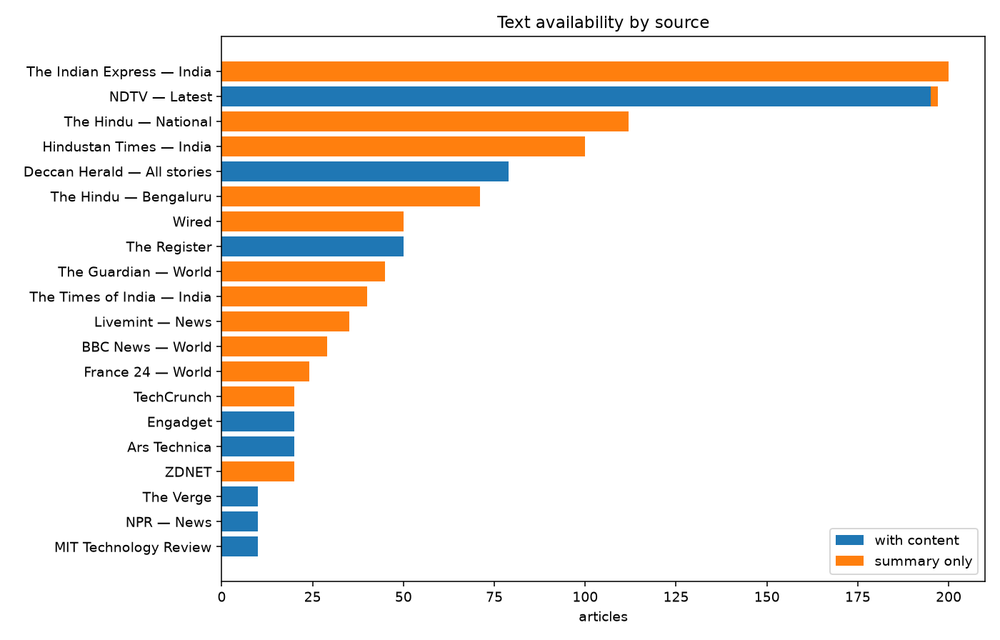
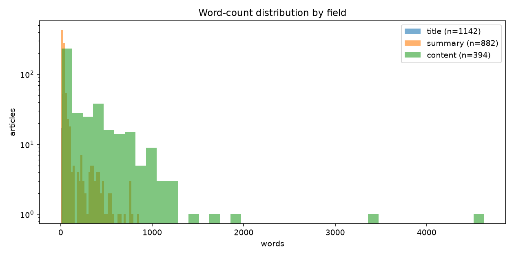
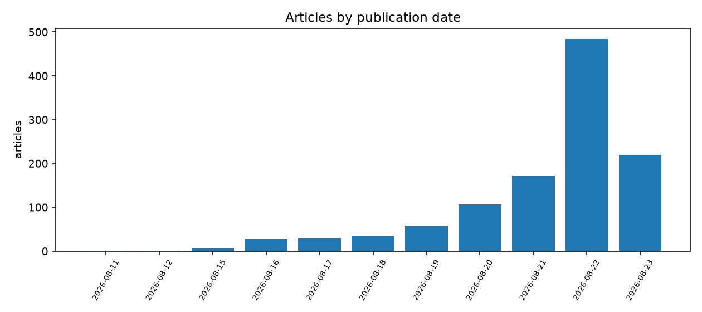

# Corpus profile

Generated 2026-08-23T14:31:30+05:30 — regenerate with `make ml-profile`. Do not edit by hand.

## Shape

| Metric | Value |
| --- | --- |
| Articles | 1,142 |
| Sources | 20 |
| Published range | 2026-08-11T10:00:56+00:00 → 2026-08-23T08:36:53+00:00 |
| Collection lag p50 | 18.01 h |
| Distinct categories | 470 |
| Articles with no category | 347 |

## Field availability

| Field | Present | Absent | p5 | p50 | p95 |
| --- | --- | --- | --- | --- | --- |
| title | 1,142 | 0 | 8 | 12 | 17 |
| summary | 882 | 260 | 11 | 25 | 304 |
| content | 394 | 748 | 16 | 33 | 952 |

## Scrape status

| Status | Articles |
| --- | --- |
| not_needed | 57 |
| pending | 806 |
| unset | 279 |

## Sources

| Source | Articles | With content | Content p50 | Summary p50 |
| --- | --- | --- | --- | --- |
| The Indian Express — India | 200 | 0 | 0 | 0 |
| NDTV — Latest | 197 | 195 | 24 | 24 |
| The Hindu — National | 112 | 0 | 0 | 27 |
| Hindustan Times — India | 100 | 0 | 0 | 21 |
| Deccan Herald — All stories | 79 | 79 | 424 | 331 |
| The Hindu — Bengaluru | 71 | 0 | 0 | 28 |
| Wired | 50 | 0 | 0 | 23 |
| The Register | 50 | 50 | 521 | 12 |
| The Guardian — World | 45 | 0 | 0 | 98 |
| The Times of India — India | 40 | 0 | 0 | 61 |
| Livemint — News | 35 | 0 | 0 | 37 |
| BBC News — World | 29 | 0 | 0 | 19 |
| France 24 — World | 24 | 0 | 0 | 54 |
| TechCrunch | 20 | 0 | 0 | 26 |
| Engadget | 20 | 20 | 17 | 17 |
| ZDNET | 20 | 0 | 0 | 23 |
| Ars Technica | 20 | 20 | 167 | 13 |
| NPR — News | 10 | 10 | 34 | 30 |
| The Verge | 10 | 10 | 132 | 56 |
| MIT Technology Review | 10 | 10 | 1022 | 55 |

## Top categories

| Category | Articles |
| --- | --- |
| india | 236 |
| india-news | 100 |
| karnataka | 38 |
| gear | 36 |
| bengaluru | 33 |
| world news | 28 |
| coupons | 23 |
| keralam | 16 |
| tamil nadu | 13 |
| tech | 13 |
| gear / deals | 13 |
| entertainment | 12 |
| us news | 12 |
| ai | 12 |
| security | 12 |
| science | 10 |
| uttar pradesh | 10 |
| business | 10 |
| europe | 10 |
| andhra pradesh | 9 |
| uk news | 9 |
| telangana | 7 |
| maharashtra | 7 |
| middle east and north africa | 7 |
| americas | 7 |

## Figures

