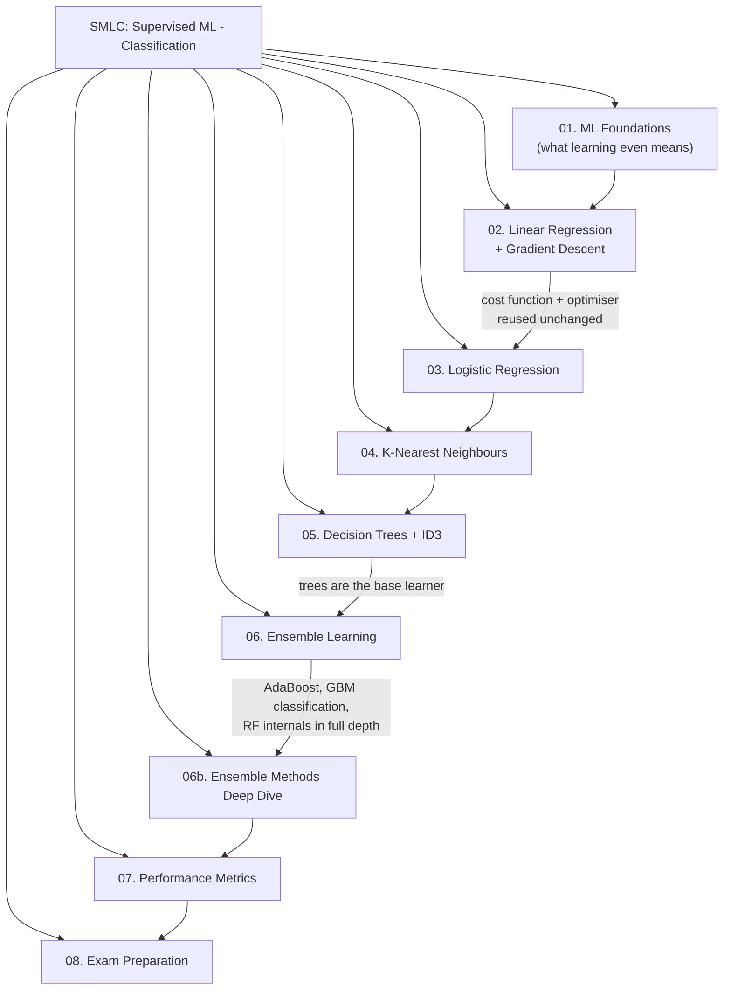

# SMLC — Module Map & Study Checklist

> Subject: Supervised Machine Learning — Classification (SMLC)
> Compiled: Aug 7, 2026
> Source material processed: 12 files — `unit-1_a_ml_intro.pdf`, `unit-1_b_performance_metrics.pdf`, `unit-1_c_linear_regression.pdf`, `unit-1_d_logistic_regression.pdf`, `unit-2_knn.pdf`, `unit-3_a_decission_tree.pdf`, `unit-3_b_id3_algo.pdf`, `unit-4_ensemble_learning.txt`, `08_ensemble-learning.pptx`, `09_adaBoost.pdf`, `10_gradientBoost.pdf`, `11_random_forest.pptx`

This file is the entry point. It tells you **what exists, in what order to read it, and how to check you actually know it.** Every other file in this folder is a chapter of the same book — read them in the numbered order the first time, then jump around freely afterwards.

---

## 1. How this book is organised

**Why this order and not the syllabus order.** The source units present performance metrics (unit 1b) immediately after the ML introduction, before any algorithm exists. That ordering is hard to learn from — you cannot judge a confusion matrix before you have a classifier that produces one. So metrics were moved to **Chapter 07**, after all four algorithm families. Nothing was dropped; only resequenced.

Linear regression (unit 1c) is kept **before** logistic regression even though this is a classification subject, because logistic regression borrows its cost-function machinery and its optimiser (gradient descent) wholesale. Skipping it makes Chapter 03 unreadable.

| #   | File                                                                                 | Covers (source unit) | Read it for                                                                                                                                            |
| --- | ------------------------------------------------------------------------------------ | -------------------- | ------------------------------------------------------------------------------------------------------------------------------------------------------ |
| 00  | this file                                                                            | —                    | Map, checklist, revision tracker                                                                                                                       |
| 01  | [ML Foundations](01-ml-foundations.md)                                               | unit-1a              | $\langle P, T, E \rangle$, learning styles, workflow, notation                                                                                         |
| 02  | [Linear Regression & Gradient Descent](02-linear-regression-and-gradient-descent.md) | unit-1c              | Residuals, squared-error cost, gradient descent, convergence                                                                                           |
| 03  | [Logistic Regression](03-logistic-regression.md)                                     | unit-1d              | Sigmoid, probability output, decision boundary, one-vs-all                                                                                             |
| 04  | [K-Nearest Neighbours](04-knn.md)                                                    | unit-2               | Distance, choosing K, elbow method, encoding, scaling, KNN regression                                                                                  |
| 05  | [Decision Trees & ID3](05-decision-trees-and-id3.md)                                 | unit-3a, unit-3b     | Entropy, information gain, ID3, inductive bias, overfitting, pruning                                                                                   |
| 06  | [Ensemble Learning](06-ensemble-learning.md)                                         | unit-4               | Bagging, boosting, Random Forest, AdaBoost, GBM, XGBoost, feature importance                                                                           |
| 06b | [Ensemble Methods Deep Dive](06b-ensemble-methods-deep-dive.md)                      | 08–11                | Weak-learner diversity & taxonomy, full AdaBoost algorithm, Gradient Boosting for classification, Random Forest OOB/voting/proximity-matrix imputation |
| 07  | [Performance Metrics](07-performance-metrics.md)                                     | unit-1b              | Confusion matrix, precision/recall/F1, ROC, AUC                                                                                                        |
| 08  | [Exam Preparation](08-exam-preparation.md)                                           | all                  | Model answers, question patterns, practice set, quick revision, gaps                                                                                   |

---

## 2. The one running example

Every chapter uses the same scenario so you never have to re-learn a story:

> **A bank decides whether to approve a personal loan.** For each past applicant the bank has recorded `age`, `annual income`, `loan amount`, `credit score`, `city`, `gender`, and whether the customer eventually **defaulted (1)** or **repaid (0)**.

- Chapter 02 uses it as a **regression** problem — predict the *credit score* (a number).
- Chapters 03–06 use it as a **classification** problem — predict *default / no default* (a label).
- Chapter 07 uses the classifier's output to judge how good it is.

A second example appears only where the loan example genuinely cannot demonstrate a concept.

---

## 3. Study checklist

Tick these off as you revise. The section reference tells you exactly where the full explanation lives. Definitions here are the *one-line reminder*, not the exam answer — the exam wording is in the `> **Formal definition:**` callout at the referenced section.

If a checklist item will not come back to you, jump first to the **Mental Models** table in [08 §3](08-exam-preparation.md#mental-models): one line per concept pairing the picture it was taught with and the reason it behaves that way. That is usually enough to rebuild the section without rereading it.

### Chapter 01 — ML Foundations

- [ ] **1.** **Machine learning ($\langle P, T, E \rangle$)** — a program improves at task $T$, measured by $P$, through experience $E$. → [01 §1](01-ml-foundations.md#1-what-machine-learning-is)
- [ ] **2.** **Task $T$ / Experience $E$ / Performance measure $P$** — the three parts you must name to call a problem "well-posed". → [01 §1.1–1.3](01-ml-foundations.md#11-task-t)
- [ ] **3.** **Well-posed learning problems** — chess, self-driving cars, text categorisation, spam detection, each broken into $\langle P,T,E\rangle$. → [01 §1.4](01-ml-foundations.md#14-worked-p-t-e-breakdowns)
- [ ] **4.** **Traditional programming vs machine learning** — rules given vs rules learned. → [01 §2](01-ml-foundations.md#2-why-machine-learning-instead-of-ordinary-programming)
- [ ] **5.** **Supervised learning** — training data carries the correct answers (labels). → [01 §3.1](01-ml-foundations.md#31-supervised-learning)
- [ ] **6.** **Regression vs classification** — continuous target vs categorical target. → [01 §3.1](01-ml-foundations.md#31-supervised-learning)
- [ ] **7.** **Unsupervised learning** — structure discovered without labels. → [01 §3.2](01-ml-foundations.md#32-unsupervised-learning)
- [ ] **8.** **Reinforcement learning** — an agent learns from rewards and penalties. → [01 §3.3](01-ml-foundations.md#33-reinforcement-learning)
- [ ] **9.** **Supervised learning notation** — $m$, $n$, $x^{(i)}$, $y^{(i)}$, $h_\theta(x)$. → [01 §4](01-ml-foundations.md#4-notation-you-will-see-in-every-later-chapter)
- [ ] **10.** **Train / validation / test split** — three datasets, three different jobs. → [01 §5](01-ml-foundations.md#5-training-validation-and-test-data)

### Chapter 02 — Linear Regression & Gradient Descent

- [ ] **11.** **Residual** — the vertical gap $y_i - \hat{y}_i$ between the true value and the fitted line. → [02 §2](02-linear-regression-and-gradient-descent.md#2-prediction-error-residuals)
- [ ] **12.** **Squared-error cost function** — one number summarising how wrong the whole model is, $J(\theta)$. → [02 §3](02-linear-regression-and-gradient-descent.md#3-the-squared-error-cost-function)
- [ ] **13.** **Cost surface & contour plot** — the bowl-shaped picture of $J(\theta)$ and its top-down map. → [02 §4](02-linear-regression-and-gradient-descent.md#4-the-cost-surface-and-contour-plots)
- [ ] **14.** **Gradient descent** — repeatedly step downhill against the gradient to minimise $J(\theta)$. → [02 §5](02-linear-regression-and-gradient-descent.md#5-gradient-descent)
- [ ] **15.** **Learning rate $\alpha$** — the step size; too small crawls, too large diverges. → [02 §5.3](02-linear-regression-and-gradient-descent.md#53-the-learning-rate-alpha)
- [ ] **16.** **Simultaneous update** — all parameters must be updated from the *old* values. → [02 §5.2](02-linear-regression-and-gradient-descent.md#52-the-update-rule)
- [ ] **17.** **Convergence** — the point where further steps no longer meaningfully reduce $J(\theta)$. → [02 §6](02-linear-regression-and-gradient-descent.md#6-convergence)

### Chapter 03 — Logistic Regression

- [ ] **18.** **Why linear regression fails at classification** — unbounded output, outlier-sensitive boundary. → [03 §1](03-logistic-regression.md#1-why-linear-regression-cannot-do-classification)
- [ ] **19.** **Sigmoid (logistic) function** — squashes any real number into $(0,1)$. → [03 §2.1](03-logistic-regression.md#21-the-sigmoid-function)
- [ ] **20.** **Probability interpretation** — $h_\theta(x) = P(y=1 \mid x; \theta)$. → [03 §2.2](03-logistic-regression.md#22-reading-the-output-as-a-probability)
- [ ] **21.** **Decision boundary** — the surface where $\theta^T x = 0$; linear or non-linear. → [03 §3](03-logistic-regression.md#3-decision-boundary)
- [ ] **22.** **Log-loss / cross-entropy cost** — the convex cost that replaces squared error. → [03 §4](03-logistic-regression.md#4-cost-function-for-logistic-regression)
- [ ] **23.** **One-vs-all (one-vs-rest)** — $k$ binary classifiers, pick the highest probability. → [03 §5](03-logistic-regression.md#5-multi-class-classification-one-vs-all)

### Chapter 04 — K-Nearest Neighbours

- [ ] **24.** **Instance-based / lazy learning** — no training phase; all work happens at prediction time. → [04 §1](04-knn.md#1-instance-based-lazy-learning)
- [ ] **25.** **Euclidean distance** — straight-line distance used to find "nearest". → [04 §2.1](04-knn.md#21-euclidean-distance)
- [ ] **26.** **The KNN algorithm** — distance → sort → take K → majority vote. → [04 §3](04-knn.md#3-the-knn-classification-algorithm)
- [ ] **27.** **Choosing K** — odd K for binary problems, $K \approx \sqrt{n}$ as a starting rule of thumb. → [04 §4.1](04-knn.md#41-rules-of-thumb-for-k)
- [ ] **28.** **Elbow method** — plot error rate vs K, take the bend. → [04 §4.2](04-knn.md#42-the-elbow-method)
- [ ] **29.** **Effect of K on bias/variance** — small K overfits, large K underfits. → [04 §4.3](04-knn.md#43-what-k-does-to-the-decision-boundary)
- [ ] **30.** **KNN for regression** — average (or weighted average) of the K neighbours' values. → [04 §5](04-knn.md#5-knn-for-regression)
- [ ] **31.** **Categorical encoding** — label encoding vs one-hot for `gender`, `city`. → [04 §6.1](04-knn.md#61-encoding-categorical-features)
- [ ] **32.** **Feature scaling** — min-max and standardisation; mandatory for KNN. → [04 §6.2](04-knn.md#62-feature-scaling)
- [ ] **33.** **Curse of dimensionality** — distances stop being meaningful in high dimensions. → [04 §7](04-knn.md#7-strengths-limitations-and-the-curse-of-dimensionality)

### Chapter 05 — Decision Trees & ID3

- [ ] **34.** **Tree anatomy** — root node, decision node, branch, leaf node, subtree. → [05 §1](05-decision-trees-and-id3.md#1-what-a-decision-tree-is)
- [ ] **35.** **Entropy** — measure of impurity/disorder; $0$ = pure, $1$ = maximally mixed (binary). → [05 §2](05-decision-trees-and-id3.md#2-entropy)
- [ ] **36.** **Information gain** — entropy removed by splitting on an attribute. → [05 §3](05-decision-trees-and-id3.md#3-information-gain)
- [ ] **37.** **ID3 algorithm** — recursively split on the highest-information-gain attribute. → [05 §4](05-decision-trees-and-id3.md#4-the-id3-algorithm)
- [ ] **38.** **Hypothesis space search** — complete space, greedy hill-climbing, no backtracking. → [05 §5](05-decision-trees-and-id3.md#5-hypothesis-space-search-in-id3)
- [ ] **39.** **Inductive bias of ID3** — prefers shorter trees with high-gain attributes near the root. → [05 §6](05-decision-trees-and-id3.md#6-inductive-bias-prerequisite)
- [ ] **40.** **Overfitting** — the tree memorises noise and fails on new data. → [05 §7](05-decision-trees-and-id3.md#7-overfitting-in-decision-trees)
- [ ] **41.** **Validation set** — the third dataset used to decide *how much* to prune. → [05 §8.1](05-decision-trees-and-id3.md#81-the-validation-set)
- [ ] **42.** **Reduced-error pruning** — remove a subtree if validation accuracy does not drop. → [05 §8.2](05-decision-trees-and-id3.md#82-reduced-error-pruning)
- [ ] **43.** **Rule post-pruning** — convert to rules, prune preconditions, sort by accuracy. → [05 §8.3](05-decision-trees-and-id3.md#83-rule-post-pruning)
- [ ] **44.** **Continuous attributes** — turn into a threshold test $A < c$ by scanning candidate splits. → [05 §9](05-decision-trees-and-id3.md#9-handling-continuous-valued-attributes)
- [ ] **45.** **Missing values** — fill with the commonest value, or distribute fractionally. → [05 §10](05-decision-trees-and-id3.md#10-handling-missing-attribute-values)

### Chapter 06 — Ensemble Learning

- [ ] **46.** **Ensemble learning** — combine many weak/base models into one strong model. → [06 §1](06-ensemble-learning.md#1-what-ensemble-learning-is)
- [ ] **47.** **Why ensembles work** — error cancellation needs models that are better than chance *and* diverse. → [06 §2](06-ensemble-learning.md#2-why-combining-models-works)
- [ ] **48.** **Bagging & bootstrapping** — parallel models on resampled data, then vote/average. → [06 §3](06-ensemble-learning.md#3-bagging-bootstrap-aggregating)
- [ ] **49.** **Random Forest** — bagged trees plus random feature subsetting at each split. → [06 §4](06-ensemble-learning.md#4-random-forest)
- [ ] **50.** **Boosting** — sequential models, each fixing the previous one's mistakes. → [06 §5](06-ensemble-learning.md#5-boosting)
- [ ] **51.** **AdaBoost** — reweight misclassified points, weight each learner by its accuracy. → [06 §5.1](06-ensemble-learning.md#51-adaboost-adaptive-boosting)
- [ ] **52.** **Gradient Boosting** — each new tree fits the residual errors of the running model. → [06 §5.2](06-ensemble-learning.md#52-gradient-boosting)
- [ ] **53.** **XGBoost** — regularised, engineered gradient boosting. → [06 §5.3](06-ensemble-learning.md#53-xgboost)
- [ ] **54.** **Bagging vs boosting** — variance reduction vs bias reduction. → [06 §6](06-ensemble-learning.md#6-bagging-vs-boosting)
- [ ] **55.** **Feature importance** — ranking inputs by total impurity reduction contributed. → [06 §7](06-ensemble-learning.md#7-feature-importance)

### Chapter 07 — Performance Metrics

- [ ] **56.** **Why accuracy alone misleads** — the imbalanced-class trap. → [07 §1](07-performance-metrics.md#1-why-accuracy-alone-is-not-enough)
- [ ] **57.** **Confusion matrix** — TP, TN, FP, FN and their layout. → [07 §2](07-performance-metrics.md#2-the-confusion-matrix)
- [ ] **58.** **Type I and Type II errors** — false positive vs false negative. → [07 §2.2](07-performance-metrics.md#22-type-i-and-type-ii-errors)
- [ ] **59.** **Accuracy** — $(TP+TN)/\text{total}$. → [07 §3.1](07-performance-metrics.md#31-accuracy)
- [ ] **60.** **Precision** — of the predicted positives, how many were right. → [07 §3.2](07-performance-metrics.md#32-precision)
- [ ] **61.** **Recall / sensitivity / TPR** — of the actual positives, how many were caught. → [07 §3.3](07-performance-metrics.md#33-recall-sensitivity-true-positive-rate)
- [ ] **62.** **Specificity / TNR** — of the actual negatives, how many were correctly cleared. → [07 §3.4](07-performance-metrics.md#34-specificity-true-negative-rate)
- [ ] **63.** **F1-score** — harmonic mean of precision and recall, and why harmonic. → [07 §3.5](07-performance-metrics.md#35-f1-score)
- [ ] **64.** **Precision–recall trade-off** — moving the threshold moves both. → [07 §4](07-performance-metrics.md#4-the-classification-threshold-and-the-precisionrecall-trade-off)
- [ ] **65.** **Multi-class confusion matrix** — per-class one-vs-rest, macro vs micro averaging. → [07 §5](07-performance-metrics.md#5-multi-class-confusion-matrix)
- [ ] **66.** **ROC curve** — TPR vs FPR across all thresholds; conservative vs liberal classifiers. → [07 §6](07-performance-metrics.md#6-roc-curve)
- [ ] **67.** **AUC** — one number for the whole ROC curve; $1.0$ perfect, $0.5$ random. → [07 §7](07-performance-metrics.md#7-auc-area-under-the-roc-curve)

---

## 4. Corrections applied to the raw source summary

The concept map extracted from the 8 sources was checked line by line. These points were **imprecise and have been corrected** in the chapters — memorise the corrected version, not the original phrasing:

| Raw summary said                                            | Corrected in the notes                                                                                                                                                                                                                                                           |
| ----------------------------------------------------------- | -------------------------------------------------------------------------------------------------------------------------------------------------------------------------------------------------------------------------------------------------------------------------------- |
| "Cost function *adds up* all the errors"                    | It adds up the **squared** errors and takes the **mean** (with a $\tfrac{1}{2m}$ factor). Plain summing lets positive and negative residuals cancel. → [02 §3](02-linear-regression-and-gradient-descent.md#3-the-squared-error-cost-function)                                   |
| "Entropy: 0 means pure, higher numbers mean more confusion" | For a **binary** target entropy is capped at exactly $1$ bit; for $c$ classes the cap is $\log_2 c$. "Higher" is bounded, not open-ended. → [05 §2](05-decision-trees-and-id3.md#2-entropy)                                                                                      |
| "$K = \sqrt{n}$"                                            | A **rule of thumb for the starting value only**, and it must still be validated (elbow method / cross-validation). It is not a rule. → [04 §4.1](04-knn.md#41-rules-of-thumb-for-k)                                                                                              |
| "F1 uses a special kind of average"                         | Specifically the **harmonic mean**, which is dominated by the smaller of precision and recall. → [07 §3.5](07-performance-metrics.md#35-f1-score)                                                                                                                                |
| "Elbow method plots error rates"                            | For KNN it plots **misclassification error (or accuracy) against K** — not the within-cluster sum of squares used in K-Means clustering. Same name, different curve. → [04 §4.2](04-knn.md#42-the-elbow-method)                                                                  |
| "Gradient descent slides down a bowl-shaped graph"          | The bowl (convex) shape is guaranteed for the **squared-error cost of linear regression** and for **log-loss in logistic regression**; it is *not* guaranteed for costs in general. → [02 §4](02-linear-regression-and-gradient-descent.md#4-the-cost-surface-and-contour-plots) |
| "Logistic regression predicts probability"                  | It predicts $P(y=1\mid x)$; a **threshold** (default $0.5$) is a separate, tunable step that turns that probability into a label. This distinction is the whole basis of the ROC curve. → [03 §2.2](03-logistic-regression.md#22-reading-the-output-as-a-probability)            |

---

## 5. Suggested revision cycle

Gaps the source material never explained are listed in [08 §5 — Gaps to Look Up](08-exam-preparation.md#5-gaps-to-look-up). Fill those from a textbook before the exam if your syllabus includes them.

Back to [module index](../README.md).
