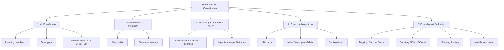

# 00 — Module Map & Study Checklist

> Topic: Supervised ML — Classification (module index)
> Date: Aug 6, 2026

This file is the entry point for the classification module. Part A is the concept map, Part B is the term-by-term study checklist (with the note section that covers each term), and Part C lists the gaps that the source decks did not explain and that are filled in [07-gaps-to-look-up.md](07-gaps-to-look-up.md).

---

## Part A — Concept Map

- **Machine Learning Foundations** → [01-introduction.md](01-introduction.md)
  - **Learning Paradigms** — Supervised (labeled data), Unsupervised (unlabeled data), Reinforcement (state/action/feedback)
  - **Task Types** — Classification (categorical), Regression (continuous), Clustering (grouping), Association (relationships)
  - **Problem Setup** — the PTE framework (Performance, Task, Experience), CRISP-DM roadmap
- **Data Mechanics** → [02-data-mechanics-and-proximity.md](02-data-mechanics-and-proximity.md)
  - **Organization** — data matrix (observations & features), categorical vs numeric data
  - **Measurement (Proximity)** — similarity vs dissimilarity; Euclidean, Manhattan, Minkowski, Chebyshev, Cosine, Edit, Hamming
- **Probability & Information Theory** → [03-probability-and-information-theory.md](03-probability-and-information-theory.md)
  - **Probability Basics** — conditional probability, likelihood calculation, Laplace smoothing ($\alpha=1$)
  - **Information Theory (Purity)** — Shannon's entropy, information gain, Gini index, classification error
- **Supervised Algorithms** → [04-classification-algorithms.md](04-classification-algorithms.md)
  - **Lazy Learning** — K-Nearest Neighbors
  - **Probabilistic Learning** — Naive Bayes (spam/ham)
  - **Decision Trees** — anatomy, recursive construction, numeric features, differing costs
- **Model Optimization & Evaluation** → [05-ensemble-learning.md](05-ensemble-learning.md), [06-model-evaluation.md](06-model-evaluation.md)
  - **Ensemble Learning** — bagging (Random Forest, bootstrap & OOB), boosting (GBM, XGBoost), stacking & voting
  - **Model Assessment** — confusion matrix, accuracy/precision/recall/specificity/F1, deviance/AIC/pseudo-$R^2$/ROC/AUC, overfitting & class skew

---

## Part B — Study Checklist

| #   | Term                    | One-line meaning                                                             | Covered in                                          |
| --- | ----------------------- | ---------------------------------------------------------------------------- | --------------------------------------------------- |
| 1   | Machine Learning        | Teaching computers to learn from experience instead of explicit instructions | [01](01-introduction.md) §1                         |
| 2   | PTE Framework           | Define a learning problem as Task, Performance measure, Experience           | [01](01-introduction.md) §3.1                       |
| 3   | Supervised Learning     | Training data already includes the right answers (labels)                    | [01](01-introduction.md) §1.1                       |
| 4   | Unsupervised Learning   | No labels — the model finds hidden groups/patterns itself                    | [01](01-introduction.md) §1.2                       |
| 5   | Classification          | Sorting data into categories, e.g. spam vs not-spam                          | [01](01-introduction.md) §2.1                       |
| 6   | Regression              | Predicting a continuous number, e.g. a house price                           | [01](01-introduction.md) §2.2                       |
| 7   | CRISP-DM                | The 6-phase project roadmap from business understanding to deployment        | [01](01-introduction.md) §3.2                       |
| 8   | Data Matrix             | Rows = observations, columns = features                                      | [02](02-data-mechanics-and-proximity.md) §1.1       |
| 9   | Distance Measures       | Formulas for how far apart two observations are                              | [02](02-data-mechanics-and-proximity.md) §2         |
| 10  | Euclidean Distance      | Straight-line ("ruler") distance                                             | [02](02-data-mechanics-and-proximity.md) §2.2       |
| 11  | Manhattan Distance      | City-block distance — no diagonals                                           | [02](02-data-mechanics-and-proximity.md) §2.3       |
| 12  | Conditional Probability | Chance of A given that B already happened                                    | [03](03-probability-and-information-theory.md) §1.1 |
| 13  | Laplace Smoothing       | Add $\alpha=1$ to every count so no probability is ever 0                    | [03](03-probability-and-information-theory.md) §1.3 |
| 14  | Entropy                 | Score for how mixed-up a group is; lower = purer                             | [03](03-probability-and-information-theory.md) §2.1 |
| 15  | Information Gain        | Entropy removed by splitting on a feature                                    | [03](03-probability-and-information-theory.md) §2.2 |
| 16  | K-Nearest Neighbors     | Classify by majority vote of the $k$ closest points                          | [04](04-classification-algorithms.md) §1            |
| 17  | Root Node               | Top of a decision tree, where splitting starts                               | [04](04-classification-algorithms.md) §3.1          |
| 18  | Leaf Node               | Terminal node holding the final predicted class                              | [04](04-classification-algorithms.md) §3.1          |
| 19  | Gini Index              | Alternative impurity measure to entropy                                      | [03](03-probability-and-information-theory.md) §2.3 |
| 20  | Ensemble Learning       | Combine many models into one stronger prediction                             | [05](05-ensemble-learning.md) §1                    |
| 21  | Bootstrap Sample        | Random sample drawn *with replacement* from the training set                 | [05](05-ensemble-learning.md) §2.1                  |
| 22  | Random Forest           | Many de-correlated trees built in parallel and voted                         | [05](05-ensemble-learning.md) §2.2                  |
| 23  | Boosting                | Models built sequentially, each fixing the previous one's errors             | [05](05-ensemble-learning.md) §3                    |
| 24  | XGBoost                 | Fast, regularized implementation of gradient boosting                        | [05](05-ensemble-learning.md) §3.2                  |
| 25  | Confusion Matrix        | Scorecard of TP/TN/FP/FN counts                                              | [06](06-model-evaluation.md) §1                     |
| 26  | Accuracy                | Fraction of all predictions that were correct                                | [06](06-model-evaluation.md) §2.1                   |
| 27  | Precision               | Of predicted positives, how many were truly positive                         | [06](06-model-evaluation.md) §2.2                   |
| 28  | Recall / Sensitivity    | Of actual positives, how many the model found                                | [06](06-model-evaluation.md) §2.3                   |
| 29  | F1-Score                | Harmonic mean of precision and recall; used under class skew                 | [06](06-model-evaluation.md) §2.5                   |
| 30  | ROC Curve               | TPR vs FPR as the decision threshold varies                                  | [06](06-model-evaluation.md) §3.1                   |
| 31  | AUC                     | Single number summarising the ROC curve; 0.5 = random                        | [06](06-model-evaluation.md) §3.2                   |
| 32  | AIC                     | Likelihood score penalised for model complexity                              | [06](06-model-evaluation.md) §4.2                   |

---

## Part C — Gaps to Look Up

These were referenced in the source decks but not explained there. All five are worked out in [07-gaps-to-look-up.md](07-gaps-to-look-up.md).

1. **Stepwise selection methods** — how variables are added/removed (also covered for regression in [Session 4 §4.3](../../05-supervised-ml-regression/notes/04-feature-engineering.md)).
2. **Chi-square ($\chi^2$) significance** — the test behind deviance comparisons.
3. **L1 / L2 / L∞ norms vs distance** — the geometric meaning behind Manhattan/Euclidean/Chebyshev.
4. **Logit / log-odds transformation** — how a probability becomes a logit, used in GBM and deviance.
5. **Logistic regression algorithm** — how the sigmoid + log-loss fit produces a classifier.

---

Back to [module README](../README.md).
