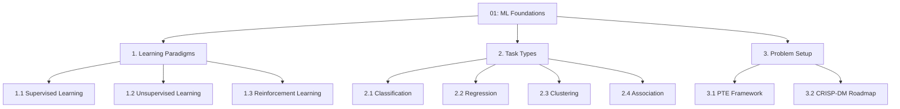
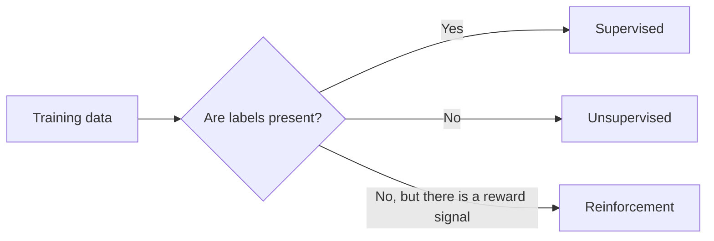
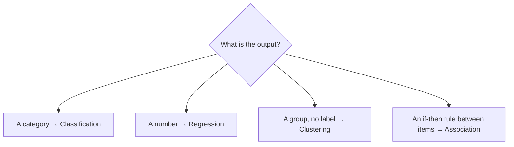
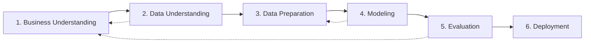

# 01 — Machine Learning Foundations

> Topic: Learning paradigms, task types, and problem setup (PTE, CRISP-DM)
> Date: Aug 6, 2026

## Concept Hierarchy

**Ordering note:** *Learning paradigms* comes before *task types* because a task type only makes sense once you know whether labels exist — classification and regression are both sub-cases of supervised learning, clustering and association of unsupervised learning. *Problem setup* comes last because PTE and CRISP-DM are the wrappers you apply **after** deciding the paradigm and task. No topic from the concept map was dropped or merged.

**Running example used throughout:** **email spam detection** — a mailbox of emails, each either *spam* or *ham* (not spam). This is the same example the source decks use for Naive Bayes, and it carries through every note in this module. Where a continuous target is needed for contrast, the **house price prediction** example from [Session 1 of the regression module](../../05-supervised-ml-regression/notes/01-introduction.md) is reused.

---

## 1. Learning Paradigms

**Meaning** — A learning paradigm answers one question: *what kind of feedback does the algorithm get while learning?* Labels for every example, no labels at all, or a delayed reward signal.

> **Formal definition:** Machine learning is the study of algorithms that improve their performance at a task through experience, without being explicitly programmed for that task. Learning paradigms are distinguished by the form of the training signal available: labeled outputs (supervised), no outputs (unsupervised), or scalar rewards from an environment (reinforcement).

### 1.1 Supervised Learning

**Meaning** — The training set contains the correct answer for every row, so the model can compare its guess against the truth and correct itself.

> **Formal definition:** Supervised learning infers a mapping $f: X \rightarrow Y$ from a training set of input–output pairs $\{(x_i, y_i)\}_{i=1}^{n}$, where each $y_i$ is a known label supplied with the data.

**Example** — 10,000 emails, each already tagged *spam* or *ham*. The model learns which word patterns go with which tag, then labels new, untagged emails.

**Important details** — Every algorithm in this module (KNN, Naive Bayes, decision trees, random forests, boosting) is supervised. The label is what makes a confusion matrix ([06 §1](06-model-evaluation.md)) possible at all.

### 1.2 Unsupervised Learning

**Meaning** — No answers are supplied; the algorithm has to find structure in the data on its own.

> **Formal definition:** Unsupervised learning discovers structure — groupings, associations, or a lower-dimensional representation — in a dataset consisting only of inputs $\{x_i\}_{i=1}^{n}$, with no corresponding labels.

**Example** — Given the same mailbox with the spam/ham tags stripped away, an unsupervised algorithm might still discover two natural clusters of emails, but it cannot tell you which cluster means "spam" — naming the clusters is a human job.

### 1.3 Reinforcement Learning

**Meaning** — An agent takes actions in an environment, observes the resulting state, and receives a reward or penalty; it learns the action sequence that maximises long-run reward.

> **Formal definition:** Reinforcement learning trains an agent to select actions in a sequential decision problem so as to maximise cumulative reward, learning from state–action–reward feedback rather than from labeled examples.

**Example** — A spam filter that observes whether the user later moves a message out of the spam folder, and adjusts its future behaviour to reduce those corrections.

**Important details** — The feedback is *evaluative* (how good was that action) rather than *instructive* (what was the right answer) — this is the core difference from supervised learning.

| Paradigm      | Training signal        | Typical output            | Spam-example form                     |
| ------------- | ---------------------- | ------------------------- | ------------------------------------- |
| Supervised    | Labeled pairs $(x, y)$ | Predicted label or number | Emails pre-tagged spam/ham            |
| Unsupervised  | Inputs only            | Groups, rules, components | Untagged emails grouped by similarity |
| Reinforcement | Reward after an action | A policy (action rule)    | Filter adapts to user corrections     |

**Exam focus** — Be able to place a described scenario into the right paradigm from the single clue of what feedback is available. That is the most common one-mark question here.

---

## 2. Task Types

**Meaning** — Within a paradigm, the *task type* is decided by the shape of what you are predicting: a category, a number, a grouping, or a co-occurrence rule.

### 2.1 Classification

> **Formal definition:** Classification is a supervised task in which the model assigns each observation to one of a finite set of predefined discrete classes.

**Example** — spam vs ham (binary); or routing a support ticket to *billing / technical / sales* (multi-class).

**Important details** — **Binary** classification has two classes, **multi-class** has more than two, and **multi-label** allows an observation to carry several labels at once. Everything from [02](02-data-mechanics-and-proximity.md) onwards in this module targets classification.

### 2.2 Regression

> **Formal definition:** Regression is a supervised task in which the model predicts a continuous numeric value for each observation.

**Example** — predicting a house's selling price in lakhs, the full subject of the [regression module](../../05-supervised-ml-regression/README.md).

**Important details** — The dividing line is the *target*, not the algorithm: decision trees and boosting appear in both modules, only the loss function and evaluation metrics change (RMSE/$R^2$ for regression, accuracy/F1/AUC here — see [06](06-model-evaluation.md)).

### 2.3 Clustering

> **Formal definition:** Clustering is an unsupervised task that partitions observations into groups so that observations within a group are more similar to each other than to those in other groups.

**Important details** — Clustering depends entirely on a distance measure, which is why the proximity measures in [02 §2](02-data-mechanics-and-proximity.md) serve both clustering and KNN.

### 2.4 Association

> **Formal definition:** Association rule mining is an unsupervised task that discovers if–then relationships of the form "if itemset $A$ occurs, then itemset $B$ tends to occur", scored by support, confidence, and lift.

**Example** — "customers who buy bread and butter also buy jam" — the classic market-basket rule.

**Exam focus** — A frequent trap: clustering and classification both produce groups, but classification's groups are *predefined and labeled*, clustering's are *discovered and unnamed*.

---

## 3. Problem Setup

### 3.1 The PTE Framework

**Meaning** — Before any modelling, state the problem in three parts so that "is it learning?" becomes a checkable claim rather than an opinion.

> **Formal definition (Mitchell, 1997):** A computer program is said to learn from experience $E$ with respect to some class of tasks $T$ and performance measure $P$, if its performance at tasks in $T$, as measured by $P$, improves with experience $E$.

**Where** — $T$: what the system must do; $P$: the metric that scores how well it did; $E$: the data it learns from.

**Example — spam filter**

| Component           | Value in the running example                                        |
| ------------------- | ------------------------------------------------------------------- |
| **T** — Task        | Classify an incoming email as spam or ham                           |
| **P** — Performance | F1-score on a held-out test set ([06 §2.5](06-model-evaluation.md)) |
| **E** — Experience  | 10,000 emails already tagged spam/ham                               |

**Important details** — Picking $P$ badly is the single most common project failure. If only 2% of emails are spam, a model that labels *everything* ham scores 98% accuracy while catching zero spam — the class-skew trap covered in [06 §5.2](06-model-evaluation.md).

**Exam focus** — Be ready to write out T, P and E for any described application. Naming $P$ correctly (and justifying it against class skew) carries most of the marks.

### 3.2 CRISP-DM Roadmap

**Meaning** — The industry-standard 6-phase cycle that wraps the modelling work, so a project does not start with code and end without a decision.

> **Formal definition:** CRISP-DM (Cross-Industry Standard Process for Data Mining) is a six-phase, iterative process model — Business Understanding, Data Understanding, Data Preparation, Modeling, Evaluation, Deployment — that structures analytics projects independently of industry or tool.

| Phase                     | Question it answers                                  | Spam-filter activity                                                                                         |
| ------------------------- | ---------------------------------------------------- | ------------------------------------------------------------------------------------------------------------ |
| 1. Business Understanding | What decision are we improving?                      | Reduce spam reaching inboxes without losing real mail                                                        |
| 2. Data Understanding     | What data exists, and is it trustworthy?             | Inspect the tagged mailbox, check the spam/ham ratio                                                         |
| 3. Data Preparation       | How do we get it model-ready?                        | Clean text, build the data matrix ([02 §1.1](02-data-mechanics-and-proximity.md))                            |
| 4. Modeling               | Which algorithm and settings?                        | Naive Bayes, then trees and ensembles ([04](04-classification-algorithms.md), [05](05-ensemble-learning.md)) |
| 5. Evaluation             | Does it meet the business goal, not just the metric? | Confusion matrix and F1 ([06](06-model-evaluation.md))                                                       |
| 6. Deployment             | How does it reach real users?                        | Serve the model behind the mail pipeline                                                                     |

**Important details** — The dotted arrows matter: CRISP-DM is a **cycle**, not a checklist. Evaluation can send you back to business understanding, and modeling routinely sends you back to data preparation. Deployment itself is covered in [Session 6 of the regression module](../../05-supervised-ml-regression/notes/06-deployment-and-case-study.md) and is not repeated here.

**Exam focus** — Know all six phases *in order* and which phase a described activity belongs to. The commonly-confused pair is Data Understanding (explore and assess) vs Data Preparation (clean and transform).

---

## Quick Revision

- **Three paradigms** — supervised (labels), unsupervised (no labels), reinforcement (rewards).
- **Four task types** — classification (category), regression (number), clustering (discovered groups), association (if–then rules).
- **Key framework:** PTE — a program learns if performance $P$ at task $T$ improves with experience $E$.
- **Key process:** CRISP-DM's six phases, iterative, business-first and business-last.
- **Most important comparison:** classification vs clustering — predefined labeled classes vs discovered unnamed groups.
- **5 exam keywords:** supervised, class skew, PTE, CRISP-DM, multi-class.
- **4 common mistakes:** calling any grouping task "classification"; choosing accuracy as $P$ on a skewed dataset; treating CRISP-DM as one-directional; assuming the paradigm is fixed by the algorithm rather than by the available feedback.

## Topic Coverage

- Machine Learning — Covered in Section 1
- Supervised / Unsupervised / Reinforcement Learning — Covered in Sections 1.1–1.3
- Classification / Regression / Clustering / Association — Covered in Sections 2.1–2.4
- PTE Framework — Covered in Section 3.1
- CRISP-DM Roadmap — Covered in Section 3.2

Next: [02 — Data Mechanics & Proximity](02-data-mechanics-and-proximity.md) · Back to [module map](00-study-checklist.md).
