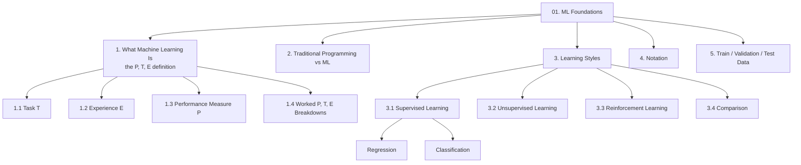
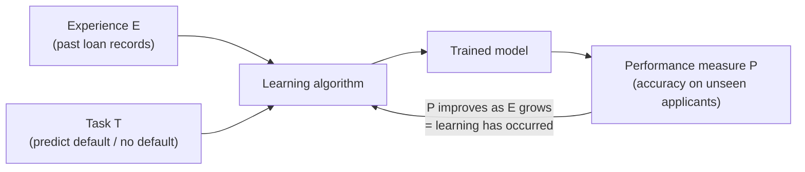
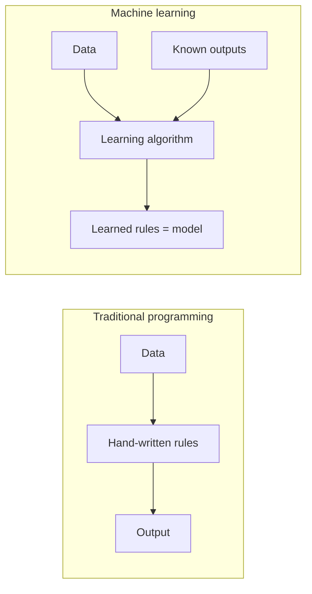
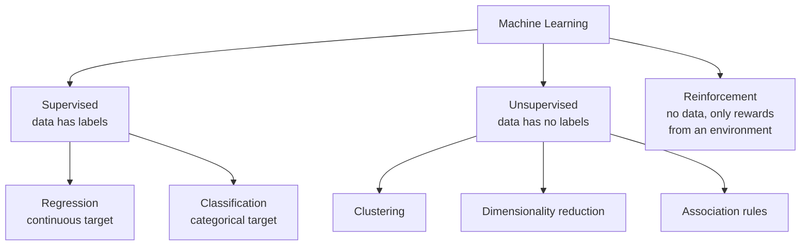
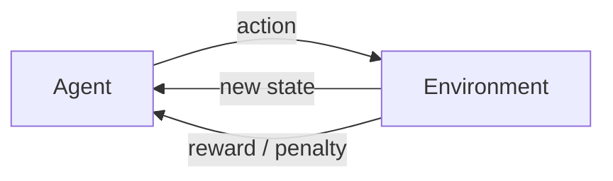
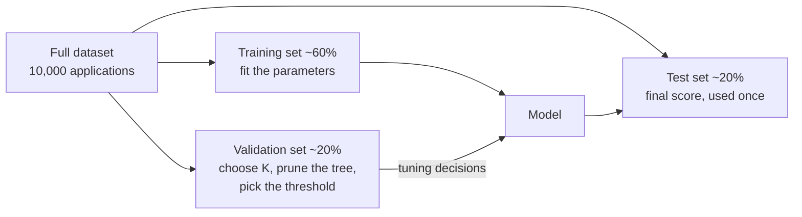

# Chapter 01 — Machine Learning Foundations

> Source: `unit-1_a_ml_intro.pdf`
> Prerequisite for: every other chapter in this folder

## Concept Hierarchy

**Ordering note:** the source introduces the four example problems (chess, self-driving, text categorisation, spam) before formally naming $T$, $E$ and $P$. That order is reversed here — the three components are defined first (§1.1–1.3), then the examples become drills that *use* the definition (§1.4). Sections 4 and 5 are prerequisites added because every later chapter silently assumes the notation and the data split.

**Running example:** the bank loan default problem described in [00 §2](00-study-checklist.md#2-the-one-running-example).

---

## 1. What Machine Learning Is

**Picture this** — someone throws you a cricket ball. The first one slips straight through your fingers. The second stings your palms. By the twentieth you are already moving before the ball has left their hand, hands soft, weight shifting onto the back foot. Nobody ever handed you the equations of flight, and you could not write them down now if you tried. You simply kept doing the one thing you were asked to do, and a friend counting your catches could watch the number climb.

**Mapping**:

| Analogy element                              | What it really is                                     |
| -------------------------------------------- | ----------------------------------------------------- |
| Catching the ball                            | the task $T$ — the one job being learned              |
| Every throw you have already faced           | the experience $E$ — the data learned from            |
| Catches out of ten, counted by your friend   | the performance measure $P$                           |
| Your hands getting quicker throw after throw | learning — $P$ rising as $E$ grows                    |
| Being unable to write down the equations     | the learned rule is not human-readable                |

**Meaning** — ordinary software does exactly what a programmer wrote. Machine learning software instead *improves on its own* as it sees more data — you supply examples rather than rules, and the program works out the rule. Tom Mitchell's definition pins this down with three named parts, written $\langle P, T, E \rangle$, and an exam will almost always ask you to identify all three for a given scenario.

> **Formal definition:** A computer program is said to learn from experience $E$ with respect to some class of tasks $T$ and performance measure $P$, if its performance at tasks in $T$, as measured by $P$, improves with experience $E$.

The definition is deliberately strict about one thing: **improvement must be measurable**. A program that changes its behaviour but does not get better at $T$ under $P$ is not learning — it is just changing.

**Core takeaway** — learning may only be claimed when a *named* score on a *named* task rises with *more* experience; behaviour that changes without that measured rise is drift, not learning.

### 1.1 Task $T$

The task is the concrete job the program has to do, stated as an input-to-output mapping — not a vague goal like "understand customers".

> **Formal definition:** The task $T$ is the specific problem the learning system is required to solve, expressed as the mapping the system must produce from an input instance to a desired output.

**Example** — for the bank, $T$ = "given an applicant's age, income, loan amount, credit score, city and gender, output whether this applicant will default". Note it is stated as one input record → one output label. "Reduce the bank's losses" would be a *business objective*, not a task.

### 1.2 Experience $E$

Experience is the data the system learns from — the raw material of learning. Different learning styles consume different kinds of experience, which is exactly what §3 is about.

> **Formal definition:** The experience $E$ is the data or interaction history made available to the learning system, from which it extracts the patterns used to perform the task.

**Example** — $E$ = 10,000 historical loan applications together with what actually happened to each one (defaulted or repaid). Because each record carries the true answer, this experience is *labelled*, which makes the bank problem a supervised one.

### 1.3 Performance Measure $P$

Without a number, "the model got better" is an opinion. $P$ is the agreed yardstick, and it must be evaluated on data the model has never seen.

> **Formal definition:** The performance measure $P$ is the quantitative criterion used to evaluate how well the system performs task $T$, computed on data not used during learning.

**Example** — $P$ = the percentage of unseen applicants classified correctly. Chapter 07 shows why raw accuracy is a poor choice for this particular problem and what to use instead — but the *role* of $P$ in the definition never changes.

**Important details** — $P$ must match the task type: accuracy/F1 for classification, mean squared error for regression, cumulative reward for reinforcement learning. Choosing $P$ badly is the single most common way an ML project quietly fails.

### 1.4 Worked P, T, E Breakdowns

These four are the standard examination scenarios. Learn the pattern, not the sentences — you will be handed a new scenario and asked to decompose it.

| Scenario                                | Task $T$                                             | Experience $E$                                                                                    | Performance $P$                                                                  |
| --------------------------------------- | ---------------------------------------------------- | ------------------------------------------------------------------------------------------------- | -------------------------------------------------------------------------------- |
| **Chess / checkers playing**            | Play a game of chess                                 | Games played against itself or against opponents                                                  | Percentage of games won against a fixed opponent pool                            |
| **Self-driving car**                    | Drive on a public road using camera and sensor input | Recorded sequences of a human driver's steering, braking and acceleration for the same road input | Average distance travelled before a human has to take over                       |
| **Text categorisation**                 | Assign a document to one of a fixed set of topics    | A corpus of documents already tagged with their correct topic                                     | Fraction of unseen documents assigned the correct topic                          |
| **Spam detection**                      | Label an incoming email as spam or not-spam          | A mailbox of emails already marked spam / not-spam by users                                       | Fraction of unseen emails labelled correctly (and the cost of each mistake type) |
| **Bank loan default** (running example) | Label an applicant as default / no-default           | 10,000 past applications with their actual outcome                                                | Accuracy, precision and recall on held-out applicants                            |

**Exam focus** — the classic 2-mark trap is to swap $E$ and $P$ for the chess example. "Games played" is the *experience*; "percentage of games won" is the *performance measure*. Write $T$ first, then $E$, then $P$ — stating them in that order makes the swap hard to make.

---

## 2. Why Machine Learning Instead of Ordinary Programming

**Picture this** — walk into two kitchens. In the first, a card is taped to the wall: 200 g flour, 12 minutes, 180 °C. Follow it exactly and the cake comes out right; the card is the whole reason anything works. In the second kitchen there is no card. The cook has eaten ten thousand cakes, each one served with a note saying whether people liked it, and from that alone she now bakes better than the card ever managed. Ask her for the recipe and she stumbles — she can bake it, but she cannot write it down.

**Mapping**:

| Analogy element                        | What it really is                                            |
| -------------------------------------- | ------------------------------------------------------------ |
| The recipe card on the wall            | hand-written rules in traditional programming                |
| Flour and eggs on the bench            | the input data                                               |
| The cake that comes out                | the output                                                   |
| Ten thousand cakes with verdicts       | the labelled training data — inputs *and* known outputs      |
| The second cook's unwritten knack      | the learned model                                            |
| Her stumbling when asked for the recipe| why a learned model cannot simply be read and audited        |

**Meaning** — traditional programming needs a human to know the rule in advance. Machine learning is used exactly where nobody can write that rule down: nobody can enumerate every combination of income, age and credit score that leads to default, but 10,000 examples of it exist.

> **Formal definition:** In traditional programming, data and an explicitly coded set of rules are supplied as input and the program produces output; in machine learning, data and known outputs are supplied as input and the algorithm produces the rules (the model) as output.

**Why it matters** — this reversal is why ML needs so much data and why it can fail silently: the rules were never written by a human, so nobody can read them to check they are sensible. Decision trees ([Chapter 05](05-decision-trees-and-id3.md)) are valued largely because their learned rules *can* still be read.

**Use machine learning when** the rule is unknown or too complex to state, the rule changes over time, or the rule must be personalised per user. **Do not use it** when a simple deterministic rule already solves the problem — a GST calculation needs a formula, not a model.

**Core takeaway** — machine learning runs programming backwards, taking answers in and handing rules out, which is exactly why nobody can afterwards read the rule to check it is sensible.

---

## 3. Learning Styles

**Picture this** — three people are dropped into a city none of them has seen. The first walks beside a local who names every street, every building, every bus as it passes. The second walks alone; after a week she cannot name one street, but she can tell you that one quarter smells of fish and shuts at four while another is full of students and never sleeps. The third is blindfolded, and every turn he takes earns either a sweet or a slap. He learns nothing about the city at all — yet after enough turns he walks to the station without a single wrong step.

**Mapping**:

| Analogy element                              | What it really is                                     |
| -------------------------------------------- | ----------------------------------------------------- |
| The guide naming every building              | the correct label attached to each training example   |
| The first walker                             | supervised learning                                   |
| The second walker noticing quarters          | unsupervised learning — structure found without labels|
| Her inability to name a street               | no labels means no named answer can ever be produced  |
| The sweets and slaps at each turn            | rewards and penalties                                 |
| The third walker                             | reinforcement learning                                |
| Reaching the station without knowing why     | a learned policy — a strategy, not an explanation     |

**Meaning** — machine learning is classified by *what kind of experience $E$ is available*. Three styles cover the source material, and every algorithm in this book sits in the first one.

### 3.1 Supervised Learning

Supervised learning is learning with an answer key: every training record carries the correct output, so the algorithm can compare its guess against the truth and correct itself. This is the entire subject matter of SMLC.

> **Formal definition:** Supervised learning is a machine learning approach in which the algorithm is trained on a labelled dataset — a set of input–output pairs — and learns a mapping function from inputs to outputs that generalises to previously unseen inputs.

The target's data type splits supervised learning in two, and this split decides which algorithm you may legally use:

> **Formal definition:** Regression is a supervised learning task in which the target variable is continuous and the model predicts a numeric quantity. Classification is a supervised learning task in which the target variable is categorical and the model predicts a discrete class label.

|                         | Regression                                                                                                                       | Classification                                                                                                                                                               |
| ----------------------- | -------------------------------------------------------------------------------------------------------------------------------- | ---------------------------------------------------------------------------------------------------------------------------------------------------------------------------- |
| Target type             | Continuous number                                                                                                                | Discrete category                                                                                                                                                            |
| Bank example            | Predict the applicant's credit score (300–900)                                                                                   | Predict default / no-default                                                                                                                                                 |
| Typical output          | $\hat{y} = 712.4$                                                                                                                | $\hat{y} = \text{"default"}$                                                                                                                                                 |
| Algorithms in this book | Linear regression ([02](02-linear-regression-and-gradient-descent.md)), KNN regression ([04 §5](04-knn.md#5-knn-for-regression)) | Logistic regression ([03](03-logistic-regression.md)), KNN ([04](04-knn.md)), decision trees ([05](05-decision-trees-and-id3.md)), ensembles ([06](06-ensemble-learning.md)) |
| Typical $P$             | Mean squared error, $R^2$                                                                                                        | Accuracy, precision, recall, F1, AUC ([07](07-performance-metrics.md))                                                                                                       |

The central difference is the **type of the target variable**, and it is decided by the problem, not by you: if the thing you must output is a number on a scale it is regression; if it is one of a fixed set of names it is classification. A number that only *looks* continuous but really encodes categories (e.g. `1 = Bangalore, 2 = Udupi`) is still classification — see the encoding warning in [04 §6.1](04-knn.md#61-encoding-categorical-features).

### 3.2 Unsupervised Learning

Here the data has inputs but no correct answers, so the algorithm cannot be told when it is wrong. It instead reports structure it finds — natural groupings, compressed representations, or items that co-occur.

> **Formal definition:** Unsupervised learning is a machine learning approach in which the algorithm is trained on unlabelled data and must discover inherent structure, patterns or groupings in the data without reference to known output values.

**Example** — the same bank, but with the default column removed: an unsupervised algorithm could still group the 10,000 customers into segments such as "young, high income, small loans" and "older, low income, large loans". It cannot tell you which segment defaults, because it was never told what defaulting is.

**Important details** — because there is no ground truth, unsupervised results cannot be scored with accuracy; evaluation is indirect and often subjective. This is precisely why the metrics of [Chapter 07](07-performance-metrics.md) apply only to supervised models.

### 3.3 Reinforcement Learning

Reinforcement learning has neither labels nor a fixed dataset. An **agent** acts in an **environment**, receives a **reward** or **penalty** for each action, and gradually works out a **policy** — a strategy that maximises total reward over time.

> **Formal definition:** Reinforcement learning is a machine learning approach in which an agent learns to select actions in an environment so as to maximise a cumulative reward signal, improving its policy through trial-and-error interaction rather than from labelled training examples.

**Example** — a game-playing program is told only "you won" or "you lost" at the end, never which individual move was correct. It must work out for itself which moves deserve credit. This is why the chess scenario in §1.4 lists "games played" as $E$: the games *are* the experience.

**Important details** — the defining difficulty is **delayed reward**: the action that caused the loss may have happened fifty moves before the loss was announced.

### 3.4 Comparison of the Three Styles

|                    | Supervised                                        | Unsupervised                  | Reinforcement                              |
| ------------------ | ------------------------------------------------- | ----------------------------- | ------------------------------------------ |
| Experience $E$     | Labelled input–output pairs                       | Inputs only, no labels        | Interaction with an environment            |
| Feedback           | Exact correct answer for every example            | None                          | Scalar reward, often delayed               |
| Goal               | Learn a mapping input → output                    | Discover structure            | Learn a policy maximising reward           |
| Bank example       | Predict default from history                      | Segment customers into groups | (not applicable — no sequential decisions) |
| Typical algorithms | Linear/logistic regression, KNN, trees, ensembles | K-Means clustering, PCA       | Q-learning, policy gradient                |
| Evaluated by       | Accuracy / error on held-out data                 | Indirect, often qualitative   | Cumulative reward                          |

The single distinguishing question is **what feedback the algorithm receives**: the exact answer (supervised), nothing (unsupervised), or a reward score (reinforcement). Choose by looking at your data — if a column of correct answers exists, you are doing supervised learning.

**Core takeaway** — the learning style is never a preference; it is dictated by the only feedback the data can physically supply, so the shape of your data chooses the branch for you.

**Connection** — from here on, this book stays inside the supervised branch. Chapter 02 starts with the regression half because its cost function and optimiser are the tools that Chapter 03 reuses to build the first real classifier.

---

## 4. Notation You Will See in Every Later Chapter

This notation is used unchanged in Chapters 02, 03 and 07. Learning it once here saves re-reading later.

| Symbol          | Meaning                                      | Bank example                                            |
| --------------- | -------------------------------------------- | ------------------------------------------------------- |
| $m$             | number of training examples                  | $m = 10{,}000$ applications                             |
| $n$             | number of features (input variables)         | $n = 6$ (age, income, loan amount, score, city, gender) |
| $x$             | a feature vector for one example             | $[34,\ 850000,\ 500000,\ 710,\ 2,\ 1]$                  |
| $x^{(i)}$       | the $i$-th training example's feature vector | $x^{(3)}$ = the 3rd applicant                           |
| $x_j^{(i)}$     | feature $j$ of example $i$                   | $x_2^{(3)}$ = 3rd applicant's income                    |
| $y^{(i)}$       | the true label/target of example $i$         | $y^{(3)} = 1$ (defaulted)                               |
| $\hat{y}^{(i)}$ | the model's prediction for example $i$       | $\hat{y}^{(3)} = 0$ (predicted repay — a mistake)       |
| $\theta$        | the model's learned parameters (weights)     | $[\theta_0, \theta_1, \dots, \theta_6]$                 |
| $h_\theta(x)$   | the hypothesis — the model's output function | $h_\theta(x) = 0.82$                                    |

> **Formal definition:** A hypothesis $h_\theta$ is the candidate function, drawn from the hypothesis space defined by the chosen model family, that maps input feature vectors to predicted outputs using the current parameter values $\theta$.

**Where the term reappears** — the "hypothesis space" of a decision tree, and the way ID3 searches it, is [05 §5](05-decision-trees-and-id3.md#5-hypothesis-space-search-in-id3). Same word, same meaning: the set of all models the algorithm is allowed to consider.

**Core takeaway** — the superscript always indexes the *example* and the subscript always indexes the *feature*, and holding those two apart is what makes every formula in the next six chapters readable at a glance.

---

## 5. Training, Validation and Test Data

**Picture this** — think about how you actually prepared for your last exam. You worked through a stack of practice papers until the methods stuck. Then you sat one timed mock under real conditions, discovered you were losing marks on one topic, and went back and drilled it. Finally you walked into the hall for the real paper. Now imagine somebody had slipped you that real paper a week earlier. You would still come out with a mark — it just would not tell anyone anything about you.

**Mapping**:

| Analogy element                                | What it really is                                    |
| ---------------------------------------------- | ---------------------------------------------------- |
| The stack of practice papers you drill on      | the training set                                     |
| The timed mock that tells you what to fix      | the validation set                                   |
| Going back to drill the weak topic             | tuning hyper-parameters and model choices            |
| The real paper, sat once                       | the test set                                         |
| Being slipped the real paper in advance        | data leakage                                         |
| A mark that no longer says anything about you  | an optimistically biased performance estimate        |

**Meaning** — $P$ must be measured on data the model never saw (§1.3). That forces the dataset to be split — and the source material's pruning discussion ([05 §8](05-decision-trees-and-id3.md#8-pruning)) needs a *third* split, so all three are defined here once.

> **Formal definition:** The training set is the subset of data used to fit the model's parameters; the validation set is a separate subset used to tune hyper-parameters and make model-selection decisions such as pruning; the test set is a further disjoint subset used once, at the end, to obtain an unbiased estimate of generalisation performance.

| Split      | Used for                                                                                                                                                                                                                   | Used how often   | If you misuse it                                                                                                         |
| ---------- | -------------------------------------------------------------------------------------------------------------------------------------------------------------------------------------------------------------------------- | ---------------- | ------------------------------------------------------------------------------------------------------------------------ |
| Training   | Estimating $\theta$                                                                                                                                                                                                        | Every iteration  | —                                                                                                                        |
| Validation | Choosing $K$ ([04 §4](04-knn.md#4-choosing-k)), pruning ([05 §8](05-decision-trees-and-id3.md#8-pruning)), threshold ([07 §4](07-performance-metrics.md#4-the-classification-threshold-and-the-precisionrecall-trade-off)) | Many times       | —                                                                                                                        |
| Test       | Reporting final performance $P$                                                                                                                                                                                            | **Exactly once** | Repeatedly tuning against the test set leaks it into training, and the reported score becomes optimistic and meaningless |

**Common mistake** — reporting training accuracy as the model's performance. A decision tree grown to full depth scores 100% on its training set and can still be useless ([05 §7](05-decision-trees-and-id3.md#7-overfitting-in-decision-trees)). Training accuracy measures memory, not learning.

**Core takeaway** — a test score is honest only while the test stays unseen, so every extra look at the test set quietly converts it into more training data and destroys the very thing it was reserved for.

---

**Next:** [Chapter 02 — Linear Regression & Gradient Descent](02-linear-regression-and-gradient-descent.md) · Back to [module map](00-study-checklist.md)
