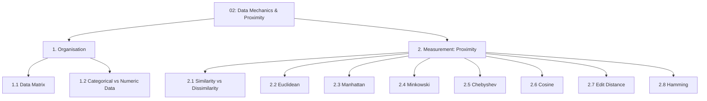

# 02 — Data Mechanics & Proximity

> Topic: Data organisation and distance/similarity measures
> Date: Aug 6, 2026

## Concept Hierarchy

**Ordering note:** Organisation precedes measurement because a distance is only defined between two *rows of a data matrix* — you cannot measure proximity before you know what a row is. Within proximity, Minkowski (2.4) is placed after Euclidean and Manhattan even though it is the general form, because it is far easier to understand as "the pattern behind the two you already know" than as an abstract definition; Chebyshev (2.5) then follows immediately as its $p \rightarrow \infty$ limit. Cosine, Edit and Hamming come last as the non-geometric measures.

**Running example used throughout:** the **email spam detection** example from [01](01-introduction.md), with each email represented by a few numeric features (word counts, number of links, message length).

---

## 1. Organisation

### 1.1 Data Matrix

**Meaning** — The standard rectangular layout every algorithm in this module expects: one row per thing you observed, one column per thing you know about it.

> **Formal definition:** A data matrix is an $n \times p$ array in which each of the $n$ rows is an observation (record, instance, object) and each of the $p$ columns is a feature (attribute, variable) measured on those observations. In supervised learning one additional column holds the label.

**Formula** — Essential
$$X = \begin{bmatrix} x_{11} & x_{12} & \cdots & x_{1p} \\ x_{21} & x_{22} & \cdots & x_{2p} \\ \vdots & \vdots & \ddots & \vdots \\ x_{n1} & x_{n2} & \cdots & x_{np} \end{bmatrix}$$

**Where** — $x_{ij}$: the value of feature $j$ for observation $i$; $n$: number of observations; $p$: number of features. Row $i$ is written $\mathbf{x}_i = (x_{i1}, \dots, x_{ip})$ and is the unit that distance measures compare.

**Example**

| Email | `free` count | links | length (words) | Label |
| ----- | ------------ | ----- | -------------- | ----- |
| $e_1$ | 3            | 5     | 120            | spam  |
| $e_2$ | 0            | 1     | 300            | ham   |
| $e_3$ | 4            | 6     | 100            | spam  |

Here $n=3$, $p=3$, and $\mathbf{x}_1 = (3, 5, 120)$.

**Important details** — Every observation must have a value for every feature; this is why missing-value handling (see [regression Session 1 §2.1](../../05-supervised-ml-regression/notes/01-introduction.md)) happens before any distance is computed.

### 1.2 Categorical vs Numeric Data

> **Formal definition:** Numeric (quantitative) features take values on an interval or ratio scale where arithmetic differences are meaningful; categorical (qualitative) features take values from a finite unordered set (nominal) or ordered set (ordinal), where arithmetic on the codes is not meaningful.

| Type            | Sub-type              | Example                    | Valid distance measures                        |
| --------------- | --------------------- | -------------------------- | ---------------------------------------------- |
| Numeric         | Continuous / discrete | message length, link count | Euclidean, Manhattan, Minkowski, Chebyshev     |
| Categorical     | Nominal               | sender domain              | Hamming (after encoding), matching coefficient |
| Categorical     | Ordinal               | priority: low/med/high     | Manhattan on the ranked codes                  |
| Text / sequence | —                     | subject line               | Edit distance, Cosine on word vectors          |

**Important details** — Encoding a nominal feature as $1,2,3$ and then applying Euclidean distance silently claims that category 1 is "closer" to category 2 than to category 3, which is false. Use one-hot encoding first (see [regression Session 1 §2.2](../../05-supervised-ml-regression/notes/01-introduction.md)), after which Euclidean distance on the one-hot columns reduces to a count of mismatches.

**Exam focus** — Be able to state why arithmetic on nominal codes is invalid, and name the encoding that fixes it.

---

## 2. Measurement (Proximity)

### 2.1 Similarity vs Dissimilarity

**Meaning** — Two ways to say the same thing, pointing in opposite directions: similarity goes **up** as two records get closer, dissimilarity (distance) goes **down**.

> **Formal definition:** A dissimilarity (distance) measure $d(\mathbf{x}, \mathbf{y})$ is a non-negative function that is 0 when the two objects are identical and grows as they differ. A similarity measure $s(\mathbf{x}, \mathbf{y})$ is typically bounded in $[0,1]$ and takes its maximum when the objects are identical. For measures bounded in $[0,1]$, $d = 1 - s$.

A measure is a true **metric** if it satisfies all four properties:

| Property            | Statement                                                                          |
| ------------------- | ---------------------------------------------------------------------------------- |
| Non-negativity      | $d(\mathbf{x},\mathbf{y}) \ge 0$                                                   |
| Identity            | $d(\mathbf{x},\mathbf{y}) = 0 \iff \mathbf{x} = \mathbf{y}$                        |
| Symmetry            | $d(\mathbf{x},\mathbf{y}) = d(\mathbf{y},\mathbf{x})$                              |
| Triangle inequality | $d(\mathbf{x},\mathbf{z}) \le d(\mathbf{x},\mathbf{y}) + d(\mathbf{y},\mathbf{z})$ |

**Important details** — Cosine *similarity* (2.6) is not a distance metric; its companion, cosine distance $1 - \cos\theta$, does not satisfy the triangle inequality in general. This matters for algorithms that assume metric behaviour to prune the search space.

**Running numeric example for 2.2–2.5** — compare $\mathbf{x} = (3, 5, 120)$ and $\mathbf{y} = (0, 1, 100)$, so the per-feature gaps are $|3-0| = 3$, $|5-1| = 4$, $|120-100| = 20$.

### 2.2 Euclidean Distance ($L_2$)

**Meaning** — Straight-line distance, exactly what a ruler would measure.

**Formula** — Essential
$$d_{Euc}(\mathbf{x},\mathbf{y}) = \sqrt{\sum_{i=1}^{p}(x_i - y_i)^2}$$

**Where** — $x_i, y_i$: the $i$-th feature of the two observations; $p$: number of features.

**Worked example** — $\sqrt{3^2 + 4^2 + 20^2} = \sqrt{9 + 16 + 400} = \sqrt{425} \approx 20.6$.

**Interpretation** — The result is dominated by the *length* feature (20 of the 20.6). Because squaring magnifies large gaps, Euclidean distance is highly sensitive to features on bigger scales — which is why feature scaling is mandatory before KNN ([04 §1](04-classification-algorithms.md)).

### 2.3 Manhattan Distance ($L_1$)

**Meaning** — City-block distance: you may only travel along the axes, never diagonally.

**Formula** — Essential
$$d_{Man}(\mathbf{x},\mathbf{y}) = \sum_{i=1}^{p}|x_i - y_i|$$

**Worked example** — $3 + 4 + 20 = 27$.

**Interpretation** — Larger than the Euclidean value (27 vs 20.6) because no diagonal shortcut is allowed. It does not square the gaps, so it is **less sensitive to outliers** than Euclidean — the usual reason to prefer it on high-dimensional or noisy data.

### 2.4 Minkowski Distance ($L_p$)

**Meaning** — The general family that Euclidean and Manhattan both belong to, with a tunable exponent $p$.

**Formula** — Essential
$$d_{Mink}(\mathbf{x},\mathbf{y}) = \left(\sum_{i=1}^{p}|x_i - y_i|^{r}\right)^{1/r}$$

**Where** — $r$: the order of the norm. $r=1$ gives Manhattan, $r=2$ gives Euclidean, $r \rightarrow \infty$ gives Chebyshev.

**Worked example** — with $r = 3$: $(3^3 + 4^3 + 20^3)^{1/3} = (27 + 64 + 8000)^{1/3} = 8091^{1/3} \approx 20.08$.

**Interpretation** — As $r$ rises, the single largest gap (20) increasingly dominates the total. This is exactly the trend that ends at Chebyshev, where only the largest gap counts.

### 2.5 Chebyshev Distance ($L_\infty$)

**Formula** — Exam-important
$$d_{Cheb}(\mathbf{x},\mathbf{y}) = \max_{i}|x_i - y_i|$$

**Worked example** — $\max(3, 4, 20) = 20$.

**Interpretation** — Also called the *chessboard distance*: it is the number of king moves between two squares, since a king covers one rank and one file in a single move. Use it when "how bad is the worst single mismatch" is the meaningful question.

| Measure   | Order $r$ | Value on the example | Sensitivity to one large gap |
| --------- | --------- | -------------------- | ---------------------------- |
| Manhattan | 1         | 27                   | Lowest                       |
| Euclidean | 2         | 20.6                 | Medium                       |
| Minkowski | 3         | 20.1                 | Higher                       |
| Chebyshev | $\infty$  | 20                   | Total — only the max matters |

### 2.6 Cosine Similarity

**Meaning** — Measures the *angle* between two vectors, ignoring their lengths — the right choice when a long document and a short document should count as similar if they discuss the same words.

**Formula** — Essential
$$\cos(\theta) = \frac{\mathbf{x} \cdot \mathbf{y}}{\|\mathbf{x}\|\,\|\mathbf{y}\|} = \frac{\sum_{i=1}^{p} x_i y_i}{\sqrt{\sum x_i^2}\sqrt{\sum y_i^2}}$$

**Where** — $\mathbf{x}\cdot\mathbf{y}$: dot product; $\|\mathbf{x}\|$: vector length (Euclidean norm).

**Worked example** — Two emails as word-count vectors, $\mathbf{a} = (2, 0, 1)$ and $\mathbf{b} = (4, 0, 2)$ (same words, one email simply twice as long). Dot product $= 8 + 0 + 2 = 10$; $\|\mathbf{a}\| = \sqrt{5} \approx 2.236$, $\|\mathbf{b}\| = \sqrt{20} \approx 4.472$; $\cos\theta = 10 / 10 = 1.0$.

**Interpretation** — Perfect similarity (angle $0°$), even though the Euclidean distance between them is $\sqrt{4+0+1} \approx 2.24$, i.e. clearly non-zero. For counts (never negative) $\cos\theta \in [0,1]$: 1 = same direction, 0 = no shared terms.

**Important details** — Cosine *distance* is $1 - \cos\theta$. Cosine is the default for text/TF-IDF vectors precisely because document length should not drive the verdict.

### 2.7 Edit (Levenshtein) Distance

> **Formal definition:** The edit distance between two strings is the minimum number of single-character insertions, deletions, or substitutions required to transform one string into the other.

**Worked example** — `"kitten"` → `"sitting"`: substitute k→s, substitute e→i, insert g. Distance $= 3$.

**Important details** — Works on strings of *different* lengths, which is exactly what Hamming distance cannot do. Typical use in this module: fuzzy-matching sender names or catching deliberately misspelled spam keywords (`"fr33"` vs `"free"`, distance 2).

### 2.8 Hamming Distance

> **Formal definition:** The Hamming distance between two equal-length strings or binary vectors is the number of positions at which the corresponding symbols differ.

**Formula** — Exam-important
$$d_{Ham}(\mathbf{x},\mathbf{y}) = \sum_{i=1}^{p} \mathbb{1}[x_i \neq y_i]$$

**Worked example** — `10110` vs `10011`, compared position by position: 1=1, 0=0, **1≠0**, 1=1, **0≠1**. Two positions differ, so $d_{Ham} = 2$.

**Important details** — Requires equal lengths. On binary/one-hot data, Hamming distance equals the squared Euclidean distance, which is why one-hot encoding lets categorical features slot into a Euclidean pipeline cleanly.

**Exam focus** — The most commonly asked contrast is Hamming (equal length, positional mismatches) vs Edit distance (any lengths, insert/delete/substitute).

---

## Quick Revision

- **Data matrix:** $n$ rows (observations) $\times$ $p$ columns (features); a distance always compares two rows.
- **Key formulas:** Euclidean $\sqrt{\sum(x_i-y_i)^2}$; Manhattan $\sum|x_i-y_i|$; Minkowski $(\sum|x_i-y_i|^r)^{1/r}$; Chebyshev $\max|x_i-y_i|$; Cosine $\frac{\mathbf{x}\cdot\mathbf{y}}{\|\mathbf{x}\|\|\mathbf{y}\|}$.
- **Most important comparison:** Euclidean vs Manhattan — squaring makes Euclidean outlier-sensitive; Manhattan is the robust choice.
- **The $r$ ladder:** $r=1$ Manhattan → $r=2$ Euclidean → $r=\infty$ Chebyshev; the larger $r$ gets, the more the single biggest gap dominates.
- **5 exam keywords:** data matrix, metric properties, triangle inequality, Minkowski order, cosine similarity.
- **5 common mistakes:** computing distances on unscaled features; applying Euclidean distance to nominal codes; using Hamming on unequal-length strings; assuming cosine distance is a true metric; confusing similarity (higher = closer) with distance (lower = closer).

## Topic Coverage

- Data Matrix — Covered in Section 1.1
- Categorical vs Numeric Data — Covered in Section 1.2
- Similarity vs Dissimilarity — Covered in Section 2.1
- Euclidean / Manhattan / Minkowski / Chebyshev — Covered in Sections 2.2–2.5
- Cosine / Edit / Hamming — Covered in Sections 2.6–2.8

Next: [03 — Probability & Information Theory](03-probability-and-information-theory.md) · Back to [module map](00-study-checklist.md).
