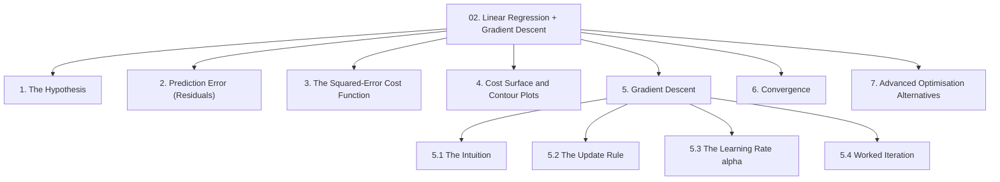
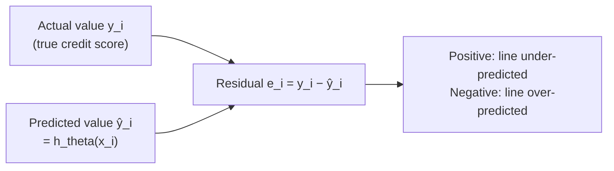
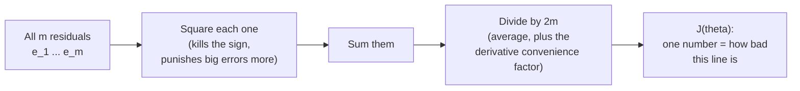
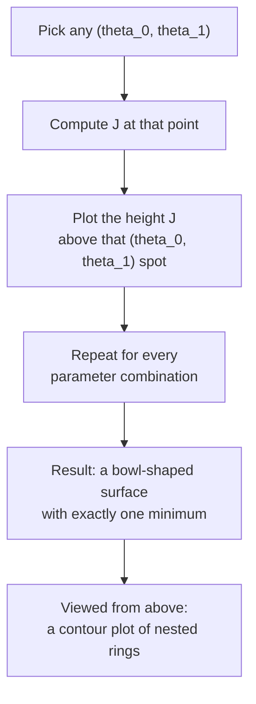
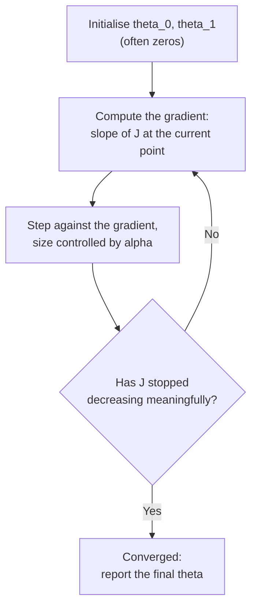
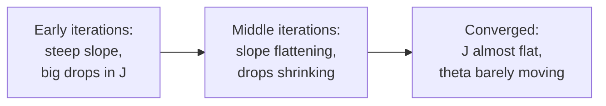

# Chapter 02 — Linear Regression & Gradient Descent

> Source: `unit-1_c_linear_regression.pdf`
> Read after: [Chapter 01](01-ml-foundations.md) · Prerequisite for: [Chapter 03](03-logistic-regression.md)

**Why a regression chapter in a classification subject.** Logistic regression is *not* built from scratch — it takes this chapter's cost-function idea and this chapter's optimiser, and changes only the hypothesis. If gradient descent is unclear here, Chapter 03 will read like magic. Everything below is the machinery; Chapter 03 is the application.

> A deeper statistical treatment of linear regression (covariance, OLS closed form, $R^2$, F-tests, assumptions) lives in the regression module: [05-supervised-ml-regression/notes/02-linear-regression.md](../../05-supervised-ml-regression/notes/02-linear-regression.md). This chapter deliberately covers only the *optimisation* view that SMLC needs.

## Concept Hierarchy



**Ordering note:** the source presents the cost surface picture alongside the cost function. It is split out into its own section (§4) here and placed *before* gradient descent, because the descent algorithm is meaningless until you can picture the surface it descends.

**Running example (regression form):** predict an applicant's **credit score** $y$ from a single feature — **annual income** $x$ (in lakh). This keeps the arithmetic small enough to do by hand. Multiple features change nothing conceptually; only the number of $\theta$ terms grows.

---

## 1. The Hypothesis

**Picture this** — a board with a handful of drawing pins pushed into it at random, and one straight steel ruler lying across them. You are allowed to slide the ruler up and down, and you are allowed to tilt it. That is all. It will not bend, no matter how the pins are arranged. Your whole job is to find the one position where the ruler sits as fairly as possible among all the pins — two movements, and every answer you are permitted to give is some combination of them.

**Mapping**:

| Analogy element                    | What it really is                                       |
| ---------------------------------- | ------------------------------------------------------- |
| The pins pushed into the board     | the training examples $(x^{(i)}, y^{(i)})$              |
| The steel ruler                    | the hypothesis $h_\theta$ — a straight line, by choice  |
| Sliding the ruler up or down       | changing the intercept $\theta_0$                       |
| Tilting the ruler                  | changing the slope $\theta_1$                           |
| The ruler refusing to bend         | the model family you fixed before any learning began    |
| Finding the fairest position       | learning — choosing $\theta$                            |

**Meaning** — linear regression assumes the relationship between input and output is a straight line, and the entire learning problem reduces to picking the two numbers that define that line.

> **Formal definition:** Linear regression is a supervised learning technique that models the relationship between one or more independent variables and a continuous dependent variable by fitting a linear equation to the observed data, and uses that equation to predict the dependent variable for new inputs.

**Formula (Hypothesis, single feature)** — Essential
$$h_\theta(x) = \theta_0 + \theta_1 x$$

**Where** — $h_\theta(x)$: the predicted output for input $x$; $x$: the single input feature (annual income, in lakh); $\theta_0$: the intercept, the prediction when $x=0$; $\theta_1$: the slope, the change in the prediction per one-unit increase in $x$; the subscript $\theta$ records that the function depends on the current parameter values.

**Formula (Hypothesis, $n$ features)** — Essential
$$h_\theta(x) = \theta_0 + \theta_1 x_1 + \theta_2 x_2 + \dots + \theta_n x_n = \theta^T x$$

**Where** — $x_1 \dots x_n$: the $n$ input features; $\theta_1 \dots \theta_n$: one weight per feature; $\theta_0$: the bias/intercept term, paired with a constant $x_0 = 1$ so the compact form $\theta^T x$ works; $\theta^T x$: the dot product of the parameter vector and the feature vector.

**Example** — with $\theta_0 = 500$ and $\theta_1 = 25$, an applicant earning $x = 8$ lakh gets $h_\theta(8) = 500 + 25(8) = 700$ credit score.

**Learning = choosing $\theta$.** The shape (a line) is fixed by you; the *particular* line is chosen by the algorithm. Sections 2–6 are entirely about how that choice is made.

**Core takeaway** — you choose the shape of the answer and the algorithm only chooses where to put it, so no amount of fitting can rescue a shape that was wrong to begin with.

---

## 2. Prediction Error (Residuals)

**Picture this** — with the ruler now resting on the board, stretch a thread from each pin straight down (or straight up) until it just touches the ruler's edge. Some threads hang below the ruler, some poke above it, and one lucky pin sits right on the edge with no thread at all. Every judgement you will ever make about this ruler comes from those threads. Notice you always pull them straight up and down — never at an angle to follow the ruler.

**Mapping**:

| Analogy element                             | What it really is                                       |
| ------------------------------------------- | ------------------------------------------------------- |
| Each pin                                    | one true observation $y^{(i)}$                          |
| The point on the ruler directly below it    | the prediction $\hat y^{(i)} = h_\theta(x^{(i)})$        |
| The length of the thread                    | the size of the residual                                |
| Hanging below versus poking above           | the residual's sign                                     |
| Always pulling the thread vertically        | error measured only in $y$, never in $x$                |
| A pin sitting exactly on the edge           | a residual of zero                                      |

**Meaning** — the fitted line will almost never pass exactly through the data points. The leftover vertical gap for each point is its residual, and every idea in this chapter is built on top of it.

> **Formal definition:** A residual is the difference between the observed value of the dependent variable and the value predicted by the fitted model for the same observation, $e_i = y_i - \hat{y}_i$.



**Formula (Residual)** — Essential
$$e_i = y_i - \hat{y}_i = y^{(i)} - h_\theta\!\left(x^{(i)}\right)$$

**Where** — $e_i$: residual of the $i$-th example; $y^{(i)}$: the true observed target of example $i$; $\hat{y}^{(i)} = h_\theta(x^{(i)})$: the model's prediction for that same example; $i$ runs from $1$ to $m$.

**Example** — applicant 1 earns 8 lakh and truly has a credit score of $y^{(1)} = 720$. The line predicts $700$. Residual $e_1 = 720 - 700 = +20$: the line under-predicted by 20 points.

**Important details** — residuals are measured **vertically**, parallel to the $y$-axis, not perpendicular to the line. This matters because the line is being judged only on how well it predicts $y$; error in $x$ is assumed to be zero. Residuals also carry signs, which creates the problem §3 has to solve.

**Core takeaway** — every verdict on the line is assembled from these vertical gaps alone, and because they carry signs they cannot simply be added up, which is the whole reason §3 has to square them first.

---

## 3. The Squared-Error Cost Function

**Picture this** — you want one number for "how badly is this ruler fitting?", so you decide to weigh all the threads at once. Straight away it fails: a thread hanging 50 below and a thread poking 50 above cancel on the scale, and a visibly terrible ruler weighs in as perfect. So before weighing, you cut each thread and lay it out flat as a square of that side length. Direction has now stopped mattering, and a long thread makes a *far* bigger patch than a short one. Weigh the squares, divide by the number of pins, and read the dial.

**Mapping**:

| Analogy element                              | What it really is                                          |
| -------------------------------------------- | ---------------------------------------------------------- |
| Threads cancelling on the scale              | positive and negative residuals summing towards zero       |
| Laying each thread out as a square           | squaring each residual                                     |
| A long thread's disproportionately big patch | large errors penalised far more heavily than small ones    |
| The total area of all the squares            | the sum of squared errors                                  |
| Dividing by the number of pins               | averaging, so datasets of different sizes stay comparable  |
| The single reading on the dial               | $J(\theta)$                                                 |

**Meaning** — to compare two candidate lines you need one number per line, not $m$ residuals. Naively adding the residuals fails: a line that is $+50$ wrong on one applicant and $-50$ wrong on another sums to zero and looks perfect. Squaring each residual first removes the sign, and averaging keeps the number comparable across datasets of different size.

> **Formal definition:** The squared-error cost function $J(\theta)$ is the mean of the squared differences between the predicted and actual values over all training examples, and serves as the objective function minimised during parameter estimation.

**Formula (Squared-error cost, $J$)** — Essential
$$J(\theta_0, \theta_1) = \frac{1}{2m}\sum_{i=1}^{m}\left(h_\theta\!\left(x^{(i)}\right) - y^{(i)}\right)^2$$

**Where** — $J(\theta_0,\theta_1)$: the total cost (error) of the parameter pair being tested; $m$: number of training examples; $h_\theta(x^{(i)})$: prediction for example $i$; $y^{(i)}$: true value for example $i$; the summation runs over all $m$ examples; the $\tfrac{1}{2}$ is a convenience factor that cancels the exponent $2$ when the derivative is taken in §5.2 — it changes the *value* of $J$ but never the $\theta$ that minimises it.



**Worked example** — three applicants, income $x = [4, 8, 12]$ lakh, true credit scores $y = [600, 720, 800]$. Test the line $\theta_0 = 500,\ \theta_1 = 25$:

| $i$ | $x^{(i)}$ | $y^{(i)}$ | $h_\theta(x^{(i)}) = 500 + 25x$ | $e_i$ | $e_i^2$ |
| --- | --------- | --------- | ------------------------------- | ----- | ------- |
| 1   | 4         | 600       | 600                             | 0     | 0       |
| 2   | 8         | 720       | 700                             | +20   | 400     |
| 3   | 12        | 800       | 800                             | 0     | 0       |

$$J = \frac{1}{2(3)}(0 + 400 + 0) = \frac{400}{6} \approx 66.7$$

**Interpretation** — 66.7 is not meaningful on its own; it is only meaningful *in comparison*. If a second line scores $J = 20$, that second line fits these three applicants better. Learning is nothing more than the search for the line with the smallest $J$.

**Important details** — squaring also means a single very wrong prediction dominates the cost: an error of 100 contributes 25× as much as an error of 20. That makes squared error highly sensitive to outliers, which is one of the reasons it is abandoned for classification in [03 §4](03-logistic-regression.md#4-cost-function-for-logistic-regression).

**Exam focus** — "Why square the errors instead of taking their sum or absolute value?" Three marks, three reasons: (1) signs would cancel, (2) large errors are penalised more heavily, (3) the squared function is smooth and differentiable everywhere, so calculus-based optimisation works — the absolute-value function has a corner at zero and does not.

**Core takeaway** — squaring makes the cost blind to the *direction* of an error but hypersensitive to its *size*, which is exactly why one wild outlier can drag the whole line towards itself.

---

## 4. The Cost Surface and Contour Plots

**Picture this** — stop looking at the board and start looking at a landscape. Every position the ruler could take — every slide, every tilt — is one patch of ground you could stand on, and the height of the ground there is the reading you just took off the dial. Good fit, low ground. Terrible fit, high ground. Now photograph that landscape from directly overhead: it turns into a set of nested rings, like a contour map, except this hill runs downwards — a smooth bowl with exactly one place where you cannot get any lower.

**Mapping**:

| Analogy element                          | What it really is                                       |
| ---------------------------------------- | ------------------------------------------------------- |
| Your east–west position on the ground    | $\theta_0$                                               |
| Your north–south position                | $\theta_1$                                               |
| The height of the ground beneath you     | $J(\theta_0, \theta_1)$                                  |
| Every patch of ground you could stand on | the whole parameter space                               |
| The rings on the overhead photograph     | contour lines — parameter pairs of equal cost           |
| The single lowest point of the bowl      | the global minimum — the best possible line             |
| Rings crowded tightly together           | a steep region of the cost surface                      |

**Meaning** — $J$ is a function of the parameters, so it can be drawn as a landscape: $\theta_0$ and $\theta_1$ on the floor, $J$ as height. For the squared-error cost of linear regression this landscape is provably a **convex bowl** — one single lowest point, no local traps.

> **Formal definition:** The cost surface is the graph of the cost function $J(\theta)$ plotted against the model parameters; a contour plot is its two-dimensional projection, in which each closed curve joins all parameter combinations that yield the same value of $J$.



Reading a contour plot:

- **Each ring = equal cost.** Every point on one ring is a different line that fits the data equally badly.
- **The centre = the global minimum**, the best parameter pair — this is what gradient descent is walking towards.
- **Rings packed tightly together = a steep slope**, so gradient descent takes big steps there. **Widely spaced rings = a flat region**, so steps become small — which is exactly what convergence looks like (§6).
- **Elongated, stretched rings** mean the two parameters have very different scales, and descent zig-zags. This is the optimisation argument for feature scaling, covered in [04 §6.2](04-knn.md#62-feature-scaling).

**Important details — the convexity caveat.** "Bowl-shaped, so you always reach the bottom" is true for **linear regression with squared-error cost** and for **logistic regression with log-loss** ([03 §4](03-logistic-regression.md#4-cost-function-for-logistic-regression)). It is *not* a general property of cost functions — a non-convex surface has local minima where gradient descent can stall. State the caveat in an exam answer; it is the difference between a correct statement and a memorised one.

**Core takeaway** — the landscape is a bowl because squared error is convex, not because the optimiser is clever, so "it always finds the best answer" is a claim about the *cost function* and never about the algorithm.

---

## 5. Gradient Descent

**Picture this** — you are standing somewhere on that landscape and thick fog has rolled in. You cannot see the bottom. You cannot see ten metres. You have no idea which way the valley runs. All you have is your own two feet — and feet are enough to tell you which way the ground tips beneath them. So you feel the tilt, take one step down it, stop, feel again, step again. You never once see where you are going, and you still arrive.

**Mapping**:

| Analogy element                              | What it really is                                        |
| -------------------------------------------- | -------------------------------------------------------- |
| The fog                                      | you cannot evaluate the whole surface, only your own spot |
| The tilt you feel underfoot                  | the partial derivative $\partial J/\partial\theta_j$       |
| Deliberately stepping *against* the tilt     | the minus sign in the update rule                        |
| The length of one stride                     | the learning rate $\alpha$                                |
| Stopping to feel the ground after each step  | one iteration                                            |
| Arriving at the valley floor without seeing it | convergence to the minimum                             |

**Meaning** — the bowl has one lowest point but the algorithm cannot see the whole bowl; it only knows the slope at the spot it is standing on. Gradient descent exploits exactly that: repeatedly measure the slope and take a step in the downhill direction.

> **Formal definition:** Gradient descent is an iterative first-order optimisation algorithm that minimises a differentiable cost function by repeatedly updating each parameter in the direction opposite to the partial derivative of the cost with respect to that parameter, scaled by a learning rate.

### 5.1 The Intuition

The two quantities the walker actually uses have exact mathematical counterparts, and naming them is the whole bridge from the picture to the algorithm: the slope felt underfoot is the partial derivative $\partial J/\partial\theta_j$, and the stride is the learning rate $\alpha$. Everything else — the fog, the blindness, the stubborn repetition — is just what "iterative first-order optimisation" means in practice.



### 5.2 The Update Rule

**Formula (Gradient descent update)** — Essential
$$\theta_j := \theta_j - \alpha\,\frac{\partial}{\partial \theta_j} J(\theta_0, \theta_1) \qquad \text{for } j = 0, 1, \dots, n$$

**Where** — $\theta_j$: the parameter being updated; $:=$ denotes assignment (overwrite the old value), not mathematical equality; $\alpha$: the learning rate, a small positive number controlling step size; $\dfrac{\partial}{\partial\theta_j}J$: the partial derivative of the cost with respect to $\theta_j$, i.e. the slope of the cost surface along that parameter's axis; the **minus sign** is what makes it *descent* — you move against the slope.

Substituting the squared-error cost from §3 and differentiating (this is where the $\tfrac{1}{2}$ cancels) gives the two concrete rules used in practice:

**Formula (Update for the intercept $\theta_0$)** — Exam-important
$$\theta_0 := \theta_0 - \alpha\,\frac{1}{m}\sum_{i=1}^{m}\left(h_\theta\!\left(x^{(i)}\right) - y^{(i)}\right)$$

**Where** — $\theta_0$: the intercept; $\alpha$: learning rate; $m$: number of training examples; $h_\theta(x^{(i)}) - y^{(i)}$: the *signed* error of example $i$ (prediction minus actual — note the order, it is the reverse of the residual in §2, and that reversal is what supplies the correct sign); the sum runs over all $m$ examples.

**Formula (Update for a weight $\theta_j$, $j \geq 1$)** — Exam-important
$$\theta_j := \theta_j - \alpha\,\frac{1}{m}\sum_{i=1}^{m}\left(h_\theta\!\left(x^{(i)}\right) - y^{(i)}\right) x_j^{(i)}$$

**Where** — $\theta_j$: the weight of feature $j$; $x_j^{(i)}$: the value of feature $j$ in example $i$ — this extra factor is the only difference from the $\theta_0$ rule, and it exists because $\theta_j$ influences the prediction *through* $x_j$; all other symbols as above.

**Non-negotiable rule — simultaneous update.** Compute the new value of *every* parameter using the **old** parameter values, then overwrite them all together:

```text
temp0 := θ₀ − α · (∂J/∂θ₀ evaluated at the old θ)
temp1 := θ₁ − α · (∂J/∂θ₁ evaluated at the old θ)
θ₀ := temp0
θ₁ := temp1
```

Updating $\theta_0$ first and then using that *new* $\theta_0$ while computing $\theta_1$'s gradient is a different algorithm with different behaviour. This is a favourite examination trap.

### 5.3 The Learning Rate $\alpha$

On the same hillside, $\alpha$ is simply how long your stride is. Shuffle forward in centimetres and nightfall will find you still on the slope; take running leaps and you will sail clean over the valley floor and land partway up the far side, then leap back, higher each time. It is the one setting you must choose by hand, and both extremes fail in distinct, recognisable ways.

> **Formal definition:** The learning rate $\alpha$ is a positive hyper-parameter that scales the magnitude of each gradient descent update, thereby controlling the size of the step taken along the cost surface at every iteration.

| $\alpha$    | What happens to $J$ per iteration    | Symptom on a plot of $J$ vs iteration                                     |
| ----------- | ------------------------------------ | ------------------------------------------------------------------------- |
| Too small   | Decreases, but by a tiny amount      | A nearly flat, very slowly falling curve — thousands of iterations wasted |
| Well chosen | Decreases steadily and noticeably    | A smooth curve falling quickly then flattening                            |
| Too large   | Overshoots the minimum, may increase | A curve that oscillates, or rises, or blows up to infinity (divergence)   |

**Important details** — $\alpha$ does **not** need to be reduced over time for gradient descent to converge. As the minimum is approached the gradient itself shrinks, so the steps automatically get smaller even with a fixed $\alpha$. Typical values to try: $0.001,\ 0.003,\ 0.01,\ 0.03,\ 0.1,\ 0.3,\ 1$ — roughly tripling each time.

**Diagnosing $\alpha$ is done by plotting $J$ against iteration number**, not by inspecting $\theta$. If that curve ever goes *up*, $\alpha$ is too large. Full stop.

**Core takeaway** — $\alpha$ decides whether each step lands you nearer the bottom or beyond it, so the honest diagnostic is never the parameters but the shape of $J$ over iterations — a curve that rises has already given you the answer.

### 5.4 Worked Iteration

Take the three applicants from §3, start from $\theta_0 = 500$, $\theta_1 = 25$ and use $\alpha = 0.01$. The errors $(h_\theta(x^{(i)}) - y^{(i)})$ are $0$, $-20$, $0$.

**Step 1 — gradient for $\theta_0$:**
$$\frac{1}{m}\sum (h_\theta(x^{(i)}) - y^{(i)}) = \frac{0 + (-20) + 0}{3} = -6.67$$

**Step 2 — gradient for $\theta_1$** (multiply each error by its own $x$: $0\cdot4$, $-20\cdot8$, $0\cdot12$):
$$\frac{1}{m}\sum (h_\theta(x^{(i)}) - y^{(i)})\,x^{(i)} = \frac{0 + (-160) + 0}{3} = -53.33$$

**Step 3 — simultaneous update:**
$$\theta_0 := 500 - 0.01(-6.67) = 500.067 \qquad \theta_1 := 25 - 0.01(-53.33) = 25.533$$

**Interpretation** — both gradients came out negative, meaning the cost decreases as the parameters increase, so both parameters were nudged **up**. Recomputing $J$ with the new line gives roughly $47.5$, down from $66.7$ — one iteration, one improvement. Repeat a few thousand times and the line settles at the bottom of the bowl.

**Core takeaway** — gradient descent succeeds because a purely local measurement, the slope under your feet, is enough to reach the globally best answer — but only for as long as the landscape really is a single bowl.

---

## 6. Convergence

**Picture this** — the ground under your boots has gone flat. You take another step and your altitude barely changes; another step, and again barely anything. You might be standing at the very bottom of the valley. You might equally be standing in a wide flat meadow high up on the shoulder of the hill. Your feet cannot tell the two apart, because flat is flat.

**Mapping**:

| Analogy element                                    | What it really is                                        |
| -------------------------------------------------- | -------------------------------------------------------- |
| The ground going flat                              | the gradient shrinking towards zero                      |
| Altitude barely changing between steps             | $J_{\text{prev}} - J_{\text{current}} < \epsilon$          |
| Deciding you have walked far enough                | the stopping criterion you must choose explicitly        |
| Your feet not distinguishing valley floor from meadow | convergence says nothing about how low $J$ actually is |
| A flat meadow high on the shoulder                 | a converged but underfitting model                       |

**Meaning** — gradient descent has no natural stopping point, so "when do I stop?" is a decision you must make explicitly.

> **Formal definition:** Convergence is the state in which successive iterations of an optimisation algorithm produce changes in the cost function (or in the parameters) smaller than a predefined tolerance, indicating that a minimum has effectively been reached.

**How convergence is declared** — any one of:

1. **Change in cost** — stop when $J_{\text{prev}} - J_{\text{current}} < \epsilon$, e.g. $\epsilon = 10^{-3}$.
2. **Change in parameters** — stop when every $|\Delta\theta_j|$ falls below a tolerance.
3. **Iteration cap** — stop after a fixed number of iterations (a safety net, not a criterion).
4. **Visual check** — plot $J$ vs iteration and stop where the curve visibly flattens.

**Where** — $J_{\text{prev}}$: cost at the previous iteration; $J_{\text{current}}$: cost at the current iteration; $\epsilon$: the convergence tolerance, a small positive threshold you choose; $\Delta\theta_j$: the change in parameter $j$ during the last iteration.



**Interpretation** — convergence means *the algorithm has stopped improving*, which is **not** the same as *the model is good*. A converged model with a huge remaining $J$ means the straight-line assumption was wrong for this data, not that the optimiser failed. Distinguishing "optimisation failure" from "wrong model choice" is exactly the kind of judgement a 10-mark question rewards.

**Failure modes to recognise:**

| Symptom                                               | Cause                                                      | Fix                                                                         |
| ----------------------------------------------------- | ---------------------------------------------------------- | --------------------------------------------------------------------------- |
| $J$ rises or oscillates wildly                        | $\alpha$ too large                                         | Reduce $\alpha$ (try $\div 3$)                                              |
| $J$ falls but painfully slowly                        | $\alpha$ too small, or features on wildly different scales | Increase $\alpha$; scale features ([04 §6.2](04-knn.md#62-feature-scaling)) |
| $J$ flattens at a high value                          | The model family is too simple for the data (underfitting) | Add features, or use a non-linear model                                     |
| $J$ near zero on training data, terrible on test data | Overfitting                                                | See [05 §7](05-decision-trees-and-id3.md#7-overfitting-in-decision-trees)   |

**Core takeaway** — converged means the walking has stopped, not that it stopped anywhere good, so a flat gradient sitting at a high cost indicts your choice of model family rather than the optimiser.

---

## 7. Advanced Optimisation Alternatives

Gradient descent is the one you must be able to derive and trace by hand, but it is not the only minimiser. The source material names three faster alternatives without explaining them:

- **Conjugate gradient**
- **BFGS** (Broyden–Fletcher–Goldfarb–Shanno)
- **L-BFGS** (limited-memory BFGS)

What you can safely say about all three: they minimise the same cost function $J(\theta)$, they typically converge in far fewer iterations than gradient descent, and they **do not require you to pick a learning rate** — they choose the step size internally. Their internal mechanics are not covered by the source and are listed in [08 §5 — Gaps to Look Up](08-exam-preparation.md#5-gaps-to-look-up).

**Core takeaway** — these solvers change only *how a step is chosen*, never *what is being minimised*, so everything you know about $J$, convexity and convergence carries across untouched.

**Connection** — everything in this chapter is about fitting a *number*. Chapter 03 keeps $J$, keeps gradient descent, keeps convergence — and changes only the hypothesis function, so that the output becomes a *probability* and the problem becomes classification.

---

**Previous:** [Chapter 01](01-ml-foundations.md) · **Next:** [Chapter 03 — Logistic Regression](03-logistic-regression.md) · Back to [module map](00-study-checklist.md)
