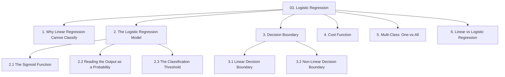
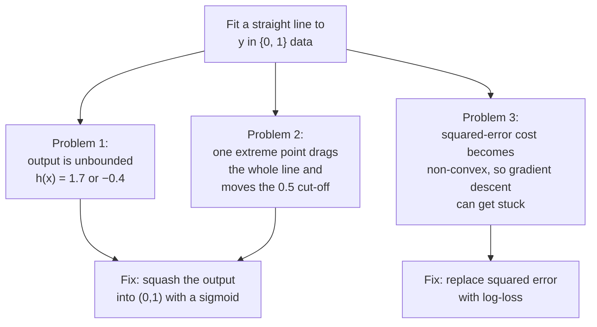
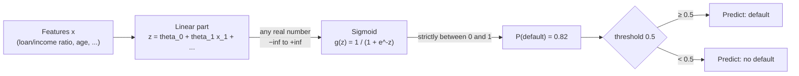
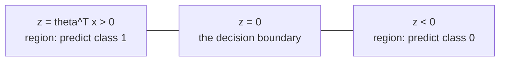
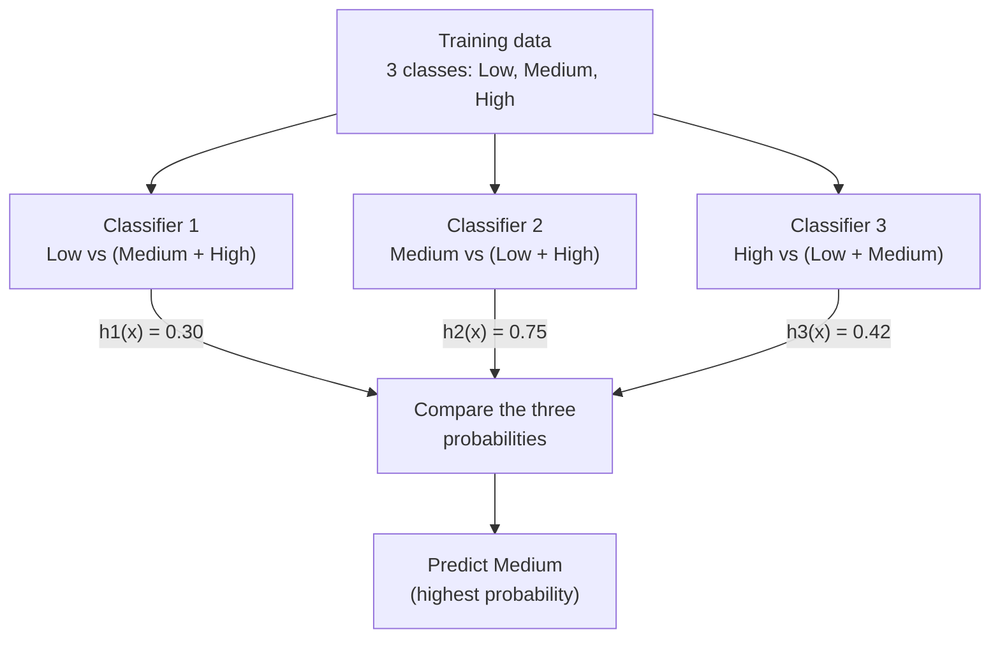

# Chapter 03 — Logistic Regression

> Source: `unit-1_d_logistic_regression.pdf`
> Read after: [Chapter 02](02-linear-regression-and-gradient-descent.md)

This is the first genuine classifier in the book. Despite the name, logistic regression performs **classification** — the word "regression" survives only because it fits a regression-style linear equation *inside* a probability-producing wrapper.

## Concept Hierarchy

**Ordering note:** §1 (why linear regression fails) is not a separate topic in the source — it is stitched together from the source's motivation for introducing the sigmoid. It is promoted to its own section because every subsequent design choice is a direct answer to a failure listed there. §4 (cost function) is included because the source discusses optimising logistic regression with gradient descent and its advanced alternatives, which is impossible to explain without naming the cost being optimised.

**Running example:** predict **default (1) / no default (0)** for a loan applicant, starting from the single feature **loan-amount-to-income ratio** $x$.

---

## 1. Why Linear Regression Cannot Do Classification

**Picture this** — take the steel ruler from the last chapter and ask it a yes-or-no question: will this customer pay us back? The ruler does not do yes and no. It slides along and reads out a number, and nothing whatsoever stops that number being 1.7, or −0.4. Worse, push one pin far out to the edge of the board and the whole ruler tilts to reach for it — which quietly drags the place where its reading crosses halfway. Pins that were comfortably on the safe side a moment ago are now on the wrong one, and nobody touched them.

**Mapping**:

| Analogy element                          | What it really is                                          |
| ---------------------------------------- | ---------------------------------------------------------- |
| The steel ruler from Chapter 02          | the linear hypothesis $\theta^T x$                          |
| Asking it a yes-or-no question           | using a regression model for classification                |
| A reading of 1.7 or −0.4                 | output outside $[0,1]$ — not a probability                  |
| One pin pushed far out to the edge       | an outlier                                                 |
| The whole ruler tilting to reach it      | least squares refitting the line to accommodate it         |
| The halfway mark sliding along with it   | the $0.5$ cut-off moving, reclassifying untouched points   |

**Meaning** — the obvious idea is to encode the label as $y \in \{0, 1\}$, fit a straight line with Chapter 02's machinery, and call anything above $0.5$ a default. It breaks in three specific ways, and each break motivates one piece of logistic regression.

1. **The output is not a probability.** A line extends to $\pm\infty$, so it will happily predict $h_\theta(x) = 1.7$ or $-0.4$. "There is a 170% chance of default" is not a statement anyone can act on.
2. **The boundary is unstable.** Add one applicant with an extreme income and the least-squares line tilts to accommodate it. Because the cut-off is defined as "where the line crosses $0.5$", tilting the line silently moves the classification boundary — and can start misclassifying points that were previously correct.
3. **The optimisation stops being safe.** Feed a $\{0,1\}$ target into the squared-error cost of [02 §3](02-linear-regression-and-gradient-descent.md#3-the-squared-error-cost-function) together with a non-linear hypothesis, and the cost surface is no longer the guaranteed convex bowl of [02 §4](02-linear-regression-and-gradient-descent.md#4-the-cost-surface-and-contour-plots).

**Exam focus** — "Why can't we use linear regression for classification?" is a standard 5-mark question. Give the three points above with the fix each one leads to; a list of complaints without the corresponding fixes reads as half an answer.

**Core takeaway** — a straight line has no floor and no ceiling, so no quality of fit will ever turn its output into a probability; the repair has to change the *shape* of the output, not the accuracy of the line.

---

## 2. The Logistic Regression Model

**Picture this** — a long lever on the wall, wired to a dimmer switch. You can shove the lever as far as you like in either direction; it has no end stops. But the lamp it controls only ever runs from fully dark to fully bright and cannot exceed either. Push hard one way and the room floods with light — and pushing twice as hard after that achieves almost nothing more. Push hard the other way and it goes nearly black. All the interesting behaviour lives in the narrow band around the lever's neutral point, where the smallest nudge visibly changes the room.

**Mapping**:

| Analogy element                                   | What it really is                                        |
| ------------------------------------------------- | -------------------------------------------------------- |
| The lever, with no end stops                      | the linear part $z = \theta^T x$, unbounded in both ways   |
| How hard, and which way, you push it              | the learned weights acting on the features               |
| The dimmer's internal mechanism                   | the sigmoid $g(z)$                                        |
| Brightness in the room, 0% to 100%                | $P(y=1 \mid x;\theta)$                                     |
| Pushing harder at the extremes achieving little   | the sigmoid's flat asymptotes at 0 and 1                 |
| Tiny nudges near neutral changing everything      | the steep region around $z = 0$                           |
| The brightness at which you declare the room lit  | the classification threshold                             |

**Meaning** — logistic regression keeps the linear equation $\theta^T x$ but passes its result through a squashing function, so the final output is always a valid probability between 0 and 1.

> **Formal definition:** Logistic regression is a supervised classification technique that models the probability of a binary outcome as the logistic (sigmoid) transformation of a linear combination of the input features, and assigns a class label by comparing that probability against a decision threshold.

### 2.1 The Sigmoid Function

The sigmoid (also called the logistic function) is an S-shaped curve that takes any real number and returns a value strictly between 0 and 1 — large positive inputs approach 1, large negative inputs approach 0, and zero maps exactly to 0.5.

> **Formal definition:** The sigmoid (logistic) function is defined as $g(z) = \dfrac{1}{1+e^{-z}}$; it is a monotonically increasing function mapping the real line onto the open interval $(0,1)$, with $g(0)=0.5$ and horizontal asymptotes at $0$ and $1$.

**Formula (Sigmoid)** — Essential
$$g(z) = \frac{1}{1 + e^{-z}}$$

**Where** — $g(z)$: the squashed output, always in $(0,1)$; $z$: the input, any real number — in logistic regression $z = \theta^T x$; $e$: Euler's number, $\approx 2.71828$.

**Formula (Logistic regression hypothesis)** — Essential
$$h_\theta(x) = g\!\left(\theta^T x\right) = \frac{1}{1 + e^{-\theta^T x}}$$

**Where** — $h_\theta(x)$: the predicted probability that $y=1$ for input $x$; $\theta^T x$: the same linear combination as in [02 §1](02-linear-regression-and-gradient-descent.md#1-the-hypothesis), i.e. $\theta_0 + \theta_1x_1 + \dots + \theta_nx_n$; $\theta$: the learned parameter vector; $x$: the feature vector, with $x_0=1$ so $\theta_0$ acts as the intercept.

**Worked example** — take $\theta_0 = -4$ and $\theta_1 = 8$, with $x$ = loan-to-income ratio.

| Applicant | $x$  | $z = -4 + 8x$ | $e^{-z}$ | $h_\theta(x) = 1/(1+e^{-z})$ | Meaning               |
| --------- | ---- | ------------- | -------- | ---------------------------- | --------------------- |
| A         | 0.25 | $-2$          | $7.389$  | $0.12$                       | 12% chance of default |
| B         | 0.50 | $0$           | $1.000$  | $0.50$                       | exactly on the fence  |
| C         | 0.75 | $+2$          | $0.135$  | $0.88$                       | 88% chance of default |

**Interpretation** — the sigmoid never actually reaches 0 or 1, so the model is never absolutely certain. Notice how compressed the extremes are: pushing $z$ from $2$ to $4$ only moves the probability from $0.88$ to $0.98$. Most of the interesting behaviour happens near $z = 0$.

**Key property to memorise:**

| If $z$ is       | then $g(z)$ is | so the prediction is |
| --------------- | -------------- | -------------------- |
| $z \geq 0$      | $\geq 0.5$     | class 1              |
| $z < 0$         | $< 0.5$        | class 0              |
| $z \to +\infty$ | $\to 1$        | confidently class 1  |
| $z \to -\infty$ | $\to 0$        | confidently class 0  |

That first pair of rows is the entire basis of §3.

### 2.2 Reading the Output as a Probability

The value produced is not a score to be interpreted loosely — it is a genuine conditional probability.

> **Formal definition:** In logistic regression, the hypothesis output is interpreted as the conditional probability that the dependent variable takes the value 1, given the input features and the model parameters: $h_\theta(x) = P(y=1 \mid x;\ \theta)$.

**Formula (Probability of each class)** — Exam-important
$$P(y=1 \mid x;\theta) = h_\theta(x) \qquad\qquad P(y=0 \mid x;\theta) = 1 - h_\theta(x)$$

**Where** — $P(y=1\mid x;\theta)$: probability the example belongs to the positive class, given its features $x$ and parameters $\theta$; the semicolon reads "parameterised by", signalling that $\theta$ is a fixed quantity, not a random variable; $h_\theta(x)$: the sigmoid output; the two probabilities necessarily sum to 1 because there are only two classes.

**Example** — applicant C above has $h_\theta(x) = 0.88$, so $P(\text{default}) = 0.88$ and $P(\text{no default}) = 0.12$.

**Why it matters** — this probability is strictly more informative than a bare label. The bank can rank all applicants by risk, approve the safest 60%, or charge a higher interest rate to those between 0.4 and 0.7. It is also what makes the ROC curve of [07 §6](07-performance-metrics.md#6-roc-curve) possible: a model that only emitted labels would have nothing to sweep a threshold over.

### 2.3 The Classification Threshold

Turning the probability into a label needs one more decision, and it is **separate from the model**.

> **Formal definition:** The classification threshold is the probability value above which an instance is assigned to the positive class; predictions satisfying $h_\theta(x) \geq \text{threshold}$ are labelled class 1 and the remainder class 0.

The default of $0.5$ is a convention, not a law. Lowering it to $0.3$ makes the model flag more applicants as risky — catching more true defaulters while also wrongly rejecting more good customers. Which trade-off is correct depends on the relative cost of the two mistakes, which is precisely the subject of [07 §4](07-performance-metrics.md#4-the-classification-threshold-and-the-precisionrecall-trade-off).

**Common mistake** — saying "logistic regression outputs 0 or 1". It outputs a probability; the *threshold* outputs 0 or 1. Losing this distinction makes ROC/AUC impossible to explain.

**Core takeaway** — logistic regression is a linear model wearing a squashing wrapper: all the learning happens in the lever, all the usable meaning comes out of the dimmer, and the threshold is a third thing bolted on afterwards.

---

## 3. Decision Boundary

**Picture this** — a farmer drives a line of posts across a field and strings wire between them. Cattle on one side get sold; cattle on the other stay. Where that fence runs was decided entirely by where the posts went into the ground — not by where the cattle happened to be standing that morning. Herd them all into a shed and the fence is still exactly where it was, dividing an empty field.

**Mapping**:

| Analogy element                             | What it really is                                       |
| ------------------------------------------- | ------------------------------------------------------- |
| The field                                   | the feature space                                       |
| Where each animal stands in it              | one instance's feature vector                           |
| Where the posts were driven in              | the learned parameters $\theta$                          |
| The wire strung between them                | the decision boundary $\theta^T x = 0$                   |
| Which side of the wire an animal is on      | the predicted class                                     |
| The fence still standing over an empty field| the boundary is a property of $\theta$, not of the data  |
| A fence bent to follow a stream             | a non-linear boundary built from polynomial features    |

**Meaning** — since the label flips exactly where $z$ changes sign, the geometry of classification is completely described by the surface $\theta^T x = 0$.

> **Formal definition:** The decision boundary is the surface in feature space that separates the regions assigned to different classes by the classifier; for logistic regression with threshold 0.5 it is the set of points satisfying $\theta^T x = 0$.

The boundary is a property of **the parameters $\theta$**, not of the dataset. Once $\theta$ is fixed the boundary is fixed, and it would exist even if you deleted every training point.

### 3.1 Linear Decision Boundary

With features entering the equation only in first power, $\theta^T x = 0$ is a straight line in 2-D, a plane in 3-D, and a hyperplane in general.

**Worked example** — a two-feature model with $\theta_0 = -30$, $\theta_1 = 0.2$ (age), $\theta_2 = 0.3$ (loan-to-income $\times 100$). Predict default when

$$-30 + 0.2x_1 + 0.3x_2 \geq 0$$

The boundary is the line $0.2x_1 + 0.3x_2 = 30$. An applicant of age 40 with ratio-score 80: $-30 + 8 + 24 = 2 \geq 0$ → predicted **default**. An applicant of age 30 with ratio-score 60: $-30 + 6 + 18 = -6 < 0$ → predicted **no default**.

### 3.2 Non-Linear Decision Boundary

A straight boundary cannot separate classes arranged in a ring. Adding **polynomial features** — squares, cubes, products of existing features — lets the same logistic regression carve out curved boundaries, because the boundary is linear in the *parameters* but not in the *original* features.

**Example** — with $\theta = [-1, 0, 0, 1, 1]$ over features $[1, x_1, x_2, x_1^2, x_2^2]$, the boundary is $-1 + x_1^2 + x_2^2 = 0$, i.e. the circle $x_1^2 + x_2^2 = 1$. Points outside the circle are class 1, inside are class 0.

**Important details** — higher-degree polynomial features let the boundary become arbitrarily wiggly, which is a direct route to overfitting ([05 §7](05-decision-trees-and-id3.md#7-overfitting-in-decision-trees)). Increased flexibility is not free.

**Core takeaway** — the boundary belongs to the parameters and not to the data, which is precisely why a brand-new applicant can be classified without ever consulting a single training record again.

---

## 4. Cost Function for Logistic Regression

**Picture this** — two witnesses in a courtroom. The first says "I'm honestly not sure, it might have been him" and turns out to be wrong; the court shrugs and moves on. The second swears on everything she holds dear that it was definitely him — and it was not. That testimony costs her enormously more than a shrug, and the more absolute her certainty was, the less the court can forgive it. Being unsure and wrong is a small thing. Being certain and wrong is not.

**Mapping**:

| Analogy element                                | What it really is                                          |
| ---------------------------------------------- | ---------------------------------------------------------- |
| A witness's testimony                          | the predicted probability $h_\theta(x)$                     |
| How certain she claims to be                    | how close that probability sits to 0 or to 1               |
| What actually happened                         | the true label $y$                                          |
| The penalty the court imposes                  | the cost $-\log(\cdot)$ for that one example                |
| A shrug for the unsure witness who was wrong   | cost of only $0.69$ at $h_\theta(x) = 0.5$                   |
| Never forgiven for absolute certainty, wrong   | cost growing without bound as $h_\theta(x)\to 0$ when $y=1$  |
| Averaging the penalties over all witnesses     | $J(\theta)$ across the $m$ training examples                |

**Meaning** — reusing squared error would produce a non-convex surface (§1, problem 3), so logistic regression uses a purpose-built cost that is convex for this hypothesis — which means gradient descent, unchanged from [02 §5](02-linear-regression-and-gradient-descent.md#5-gradient-descent), is still guaranteed to reach the global minimum.

> **Formal definition:** The logistic regression cost function, also known as log-loss or binary cross-entropy, measures the negative log-likelihood of the observed labels under the model, penalising confident predictions that are wrong far more heavily than uncertain ones.

**Formula (Cost of a single example)** — Essential
$$\text{Cost}\big(h_\theta(x),\ y\big) = \begin{cases} -\log\big(h_\theta(x)\big) & \text{if } y = 1\\[4pt] -\log\big(1 - h_\theta(x)\big) & \text{if } y = 0 \end{cases}$$

**Where** — $h_\theta(x)$: the predicted probability that $y=1$; $y$: the true label, $0$ or $1$; $\log$: the natural logarithm; the leading minus sign makes the cost positive, since $\log$ of a number below 1 is negative.

**Formula (Overall cost, combined form)** — Exam-important
$$J(\theta) = -\frac{1}{m}\sum_{i=1}^{m}\Big[\,y^{(i)}\log h_\theta\!\left(x^{(i)}\right) + \left(1-y^{(i)}\right)\log\!\left(1 - h_\theta\!\left(x^{(i)}\right)\right)\Big]$$

**Where** — $J(\theta)$: average cost over the training set; $m$: number of training examples; $y^{(i)}$: true label of example $i$; $h_\theta(x^{(i)})$: predicted probability for example $i$. The two-case definition is collapsed into one line by the multipliers $y^{(i)}$ and $(1-y^{(i)})$: when $y^{(i)}=1$ the second term vanishes, and when $y^{(i)}=0$ the first term vanishes.

**Worked example** — true label $y = 1$:

| Prediction $h_\theta(x)$ | Cost $= -\log(h_\theta(x))$ | Reading                                     |
| ------------------------ | --------------------------- | ------------------------------------------- |
| $0.99$                   | $0.01$                      | confidently right → almost no penalty       |
| $0.50$                   | $0.69$                      | no opinion → moderate penalty               |
| $0.10$                   | $2.30$                      | confidently wrong → heavy penalty           |
| $0.01$                   | $4.61$                      | very confidently wrong → very heavy penalty |

**Interpretation** — the penalty grows without bound as the prediction approaches complete confidence in the wrong class. This is the behaviour you want from a probabilistic model: being sure and wrong must hurt much more than being unsure and wrong.

**Formula (Gradient descent update for logistic regression)** — Exam-important
$$\theta_j := \theta_j - \alpha\,\frac{1}{m}\sum_{i=1}^{m}\left(h_\theta\!\left(x^{(i)}\right) - y^{(i)}\right)x_j^{(i)}$$

**Where** — every symbol has the same meaning as in [02 §5.2](02-linear-regression-and-gradient-descent.md#52-the-update-rule); $h_\theta$ is now the **sigmoid** hypothesis rather than the linear one.

**Interpretation** — the update rule is *algebraically identical* to linear regression's, even though the cost function and hypothesis both changed. Only the definition of $h_\theta$ differs. This is a favourite exam observation: identical form, different meaning. Simultaneous update ([02 §5.2](02-linear-regression-and-gradient-descent.md#52-the-update-rule)) and learning-rate diagnostics ([02 §5.3](02-linear-regression-and-gradient-descent.md#53-the-learning-rate-alpha)) apply here without modification, as do the faster alternatives — conjugate gradient, BFGS, L-BFGS ([02 §7](02-linear-regression-and-gradient-descent.md#7-advanced-optimisation-alternatives)).

**Core takeaway** — log-loss penalises *confidence* and not merely error, which is what forces the model to report honest probabilities instead of bravado.

---

## 5. Multi-Class Classification: One-vs-All

**Picture this** — three interview rooms down a corridor, and a candidate walks into each in turn. In the first she is asked exactly one question: are you Low risk, yes or no? In the second: are you Medium, yes or no? In the third: are you High, yes or no? None of the three interviewers has met the others or knows what was asked, and each replies not with a verdict but with a confidence. You wait outside, collect three confidences, and go with the loudest yes.

**Mapping**:

| Analogy element                                  | What it really is                                       |
| ------------------------------------------------ | ------------------------------------------------------- |
| Each interview room                              | one binary classifier                                   |
| The single yes/no question asked inside it       | that class relabelled 1, every other class relabelled 0 |
| The interviewer's stated confidence              | that classifier's output $h^{(i)}_\theta(x)$             |
| Interviewers never comparing notes               | the $k$ classifiers trained independently               |
| Going with the loudest yes                       | $\arg\max_i h^{(i)}_\theta(x)$                            |
| The three confidences not adding up to 100%      | the outputs are not a joint probability distribution    |

**Meaning** — logistic regression is binary by construction: the sigmoid emits one probability, for one class. Problems with three or more classes are handled by decomposing them into several binary problems.

> **Formal definition:** One-vs-all (also called one-vs-rest) is a strategy for multi-class classification in which one binary classifier is trained per class, treating that class as positive and all remaining classes together as negative; a new instance is assigned to the class whose classifier outputs the highest probability.

**Example** — the bank now sorts applicants into three risk grades: **Low**, **Medium**, **High**.

**Formula (One-vs-all prediction)** — Exam-important
$$\hat{y} = \arg\max_{i}\ h_\theta^{(i)}(x)$$

**Where** — $\hat{y}$: the predicted class label; $h_\theta^{(i)}(x)$: the probability output by the $i$-th binary classifier, i.e. its estimate of $P(y=i \mid x)$; $\arg\max_i$ returns the *index* $i$ that gives the largest value, not the value itself.

**How it works — steps:**

1. For $k$ classes, create $k$ relabelled copies of the training set. In copy $i$, examples of class $i$ get label 1 and every other example gets label 0.
2. Train one ordinary binary logistic regression on each copy, producing $k$ separate parameter vectors.
3. To predict, run the new instance through all $k$ classifiers and take the class of the highest output.

**Important details:**

- **Training sets become imbalanced.** With 3 balanced classes, each binary problem is roughly 33% positive and 67% negative. With 10 classes it is 10% vs 90%, and accuracy stops being a usable metric — see [07 §1](07-performance-metrics.md#1-why-accuracy-alone-is-not-enough).
- **The $k$ probabilities need not sum to 1.** Each classifier was trained independently, so they are not a joint distribution. Taking the maximum is still a sound decision rule, but reporting "$h_2(x)=0.75$ means a 75% chance of Medium" across all classes is not strictly correct.
- **Cost** — $k$ classifiers must be trained and $k$ must be evaluated per prediction.
- **The alternative, one-vs-one**, trains a classifier for every *pair* of classes ($k(k-1)/2$ of them) and decides by majority vote. It is mentioned here only so you can name the contrast; the source covers one-vs-all.

**Core takeaway** — one-vs-all is sound because you only ever need to *rank* the $k$ answers against each other, never to trust them together as a single joint probability.

---

## 6. Linear vs Logistic Regression

|                 | Linear regression ([Ch 02](02-linear-regression-and-gradient-descent.md))                               | Logistic regression                                                       |
| --------------- | ------------------------------------------------------------------------------------------------------- | ------------------------------------------------------------------------- |
| Task type       | Regression                                                                                              | Classification                                                            |
| Target variable | Continuous                                                                                              | Categorical (binary, extended by one-vs-all)                              |
| Hypothesis      | $h_\theta(x) = \theta^T x$                                                                              | $h_\theta(x) = g(\theta^T x)$                                             |
| Output range    | $(-\infty, +\infty)$                                                                                    | $(0, 1)$                                                                  |
| Output meaning  | The predicted quantity                                                                                  | $P(y=1\mid x;\theta)$                                                     |
| Cost function   | Squared error ([02 §3](02-linear-regression-and-gradient-descent.md#3-the-squared-error-cost-function)) | Log-loss (§4)                                                             |
| Cost surface    | Convex                                                                                                  | Convex (with log-loss; non-convex with squared error)                     |
| Optimiser       | Gradient descent                                                                                        | Gradient descent — *the same update rule*                                 |
| Fitted shape    | A line/plane through the data                                                                           | A boundary between the data                                               |
| Bank example    | Predict a credit score of 712                                                                           | Predict an 82% chance of default                                          |
| Evaluated by    | MSE, $R^2$                                                                                              | Accuracy, precision, recall, F1, AUC ([Ch 07](07-performance-metrics.md)) |

The central difference is **what the linear combination $\theta^T x$ is used for**: in linear regression it *is* the answer, in logistic regression it is an intermediate score that gets squashed into a probability. Choose by the target's data type — continuous number → linear; category → logistic.

**Connection** — logistic regression draws one global boundary through the whole feature space, using every training point to place it. Chapter 04 takes the opposite approach: no boundary is computed at all, and prediction is decided purely by whichever training points happen to be nearby.

---

**Previous:** [Chapter 02](02-linear-regression-and-gradient-descent.md) · **Next:** [Chapter 04 — K-Nearest Neighbours](04-knn.md) · Back to [module map](00-study-checklist.md)
