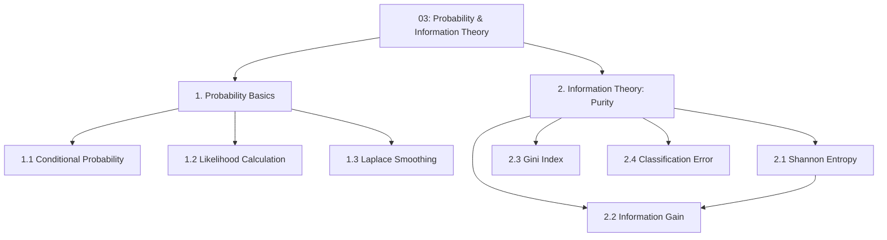

# 03 — Probability & Information Theory

> Topic: Conditional probability, likelihood, Laplace smoothing, and impurity measures
> Date: Aug 6, 2026

## Concept Hierarchy

**Ordering note:** Probability basics come first because they feed Naive Bayes ([04 §2](04-classification-algorithms.md)); information theory comes second because it feeds decision trees ([04 §3](04-classification-algorithms.md)). Within Part 2, entropy precedes information gain because information gain is *defined* as a reduction in entropy; Gini and classification error follow as the two alternative impurity measures compared against it.

**Running example used throughout:** the same **spam/ham mailbox** — a training set of **10 emails: 6 spam, 4 ham**, with the feature "does the email contain the word *free*?".

| Email              | contains `free` | contains `meeting` | Label |
| ------------------ | --------------- | ------------------ | ----- |
| $e_1 \dots e_4$    | yes             | no                 | spam  |
| $e_5, e_6$         | no              | yes                | spam  |
| $e_7$              | yes             | no                 | ham   |
| $e_8 \dots e_{10}$ | no              | yes                | ham   |

---

## 1. Probability Basics

### 1.1 Conditional Probability

**Meaning** — The probability of an event once you already know something else happened. Classification is entirely built on this: *given the words in this email*, how likely is spam?

> **Formal definition:** For events $A$ and $B$ with $P(B) > 0$, the conditional probability of $A$ given $B$ is $P(A \mid B) = P(A \cap B) / P(B)$ — the probability of $A$ within the restricted sample space where $B$ has occurred.

**Formula** — Essential
$$P(A \mid B) = \frac{P(A \cap B)}{P(B)}$$

**Worked example** — From the table: $P(\text{spam}) = 6/10 = 0.6$. Among the 5 emails containing `free`, 4 are spam, so
$$P(\text{spam} \mid \texttt{free}) = \frac{P(\text{spam} \cap \texttt{free})}{P(\texttt{free})} = \frac{4/10}{5/10} = 0.8$$

**Interpretation** — Knowing the email contains `free` raises the spam probability from 0.6 to 0.8. That *lift* is exactly what a classifier exploits.

**Bayes' theorem** — Exam-important — reverses the conditioning, which is what lets us go from "how often does spam contain `free`" (easy to count in training data) to "how likely is spam given `free`" (what we actually want):
$$P(C \mid X) = \frac{P(X \mid C)\,P(C)}{P(X)}$$

**Where** — $P(C \mid X)$: **posterior** (probability of class $C$ after seeing evidence $X$); $P(X \mid C)$: **likelihood**; $P(C)$: **prior**; $P(X)$: **evidence** (a normalising constant, identical across classes).

**Important details** — Because $P(X)$ is the same for every class, comparing classes only needs the numerator: $P(C \mid X) \propto P(X \mid C) P(C)$. This shortcut is used everywhere in [04 §2](04-classification-algorithms.md).

**Exam focus** — Be able to name all four parts of Bayes' theorem and explain why the denominator can be dropped when *comparing* classes but not when *reporting* a probability.

### 1.2 Likelihood Calculation

**Meaning** — How probable the observed evidence is, *assuming* a particular class is true. With several pieces of evidence and the naive independence assumption, likelihoods simply multiply.

> **Formal definition:** The likelihood of a class given observed features $x_1, \dots, x_p$ is $P(x_1,\dots,x_p \mid C)$. Under the conditional-independence (naive) assumption, this factorises as $\prod_{i=1}^{p} P(x_i \mid C)$.

**Formula** — Essential
$$P(C \mid x_1,\dots,x_p) \propto P(C)\prod_{i=1}^{p}P(x_i \mid C)$$

**Worked example** — A new email contains both `free` and `meeting`. From the table:

| Quantity                          | Spam                                    | Ham                                   |
| --------------------------------- | --------------------------------------- | ------------------------------------- |
| Prior $P(C)$                      | $6/10 = 0.6$                            | $4/10 = 0.4$                          |
| $P(\texttt{free} \mid C)$         | $4/6 = 0.667$                           | $1/4 = 0.25$                          |
| $P(\texttt{meeting} \mid C)$      | $2/6 = 0.333$                           | $3/4 = 0.75$                          |
| Score $= P(C)\prod P(x_i \mid C)$ | $0.6 \times 0.667 \times 0.333 = 0.133$ | $0.4 \times 0.25 \times 0.75 = 0.075$ |

Normalising: $P(\text{spam} \mid X) = 0.133 / (0.133 + 0.075) = 0.64$.

**Interpretation** — Spam wins, but only at 64% confidence — the strong `free` signal is partly cancelled by the strong `meeting` counter-signal. Compare this to threshold choice in [06 §3.1](06-model-evaluation.md): whether 0.64 is enough to actually block the email is a business decision, not a maths one.

**Important details** — With many features the product underflows to 0 in floating point, so implementations sum log-probabilities instead: $\log P(C) + \sum_i \log P(x_i \mid C)$. Ordering of classes is unchanged because $\log$ is monotonic.

### 1.3 Laplace Smoothing

**Meaning** — Add a small constant to every count so that a word never seen with a class does not force the entire probability to zero.

> **Formal definition:** Laplace (additive) smoothing estimates a categorical probability as $\hat{P}(x_i \mid C) = \dfrac{n_{x_i,C} + \alpha}{n_C + \alpha d}$, where $\alpha > 0$ is the smoothing parameter ($\alpha = 1$ gives standard Laplace / add-one smoothing) and $d$ is the number of possible values of the feature.

**Formula** — Essential
$$\hat{P}(x_i \mid C) = \frac{n_{x_i,C} + \alpha}{n_C + \alpha d}$$

**Where** — $n_{x_i,C}$: times value $x_i$ appeared with class $C$ in training; $n_C$: total observations in class $C$; $d$: number of distinct values the feature can take; $\alpha$: smoothing constant, usually 1.

**Worked example** — The word `lottery` never appears in any of the 4 ham emails. Unsmoothed, $P(\texttt{lottery} \mid \text{ham}) = 0/4 = 0$, which zeroes the whole ham product no matter how ham-like the rest of the email is. With $\alpha = 1$ and $d = 2$ (present/absent):
$$\hat{P}(\texttt{lottery} \mid \text{ham}) = \frac{0 + 1}{4 + 1\times 2} = \frac{1}{6} \approx 0.167$$

**Interpretation** — The zero becomes a small-but-nonzero probability, so a single unseen word can no longer veto a class. The effect shrinks as the training set grows: with $n_C = 4000$ instead of 4, the same estimate is $1/4002 \approx 0.00025$.

**Important details** — This is the "$\alpha = 1$ rule". $\alpha < 1$ (Lidstone smoothing) smooths more gently; $\alpha$ is a hyperparameter and can be tuned like any other ([regression Session 5 §6](../../05-supervised-ml-regression/notes/05-model-optimization.md)).

**Exam focus** — State the exact failure being prevented — a *single* zero likelihood wiping out an entire class's posterior — and show the corrected fraction with both $\alpha$ terms in place. Forgetting the $\alpha d$ in the denominator is the classic slip.

---

## 2. Information Theory (Purity)

**Meaning** — A decision tree needs to score *how mixed* a group of labels is, so it can prefer splits that produce purer groups. All three measures below do that; they differ only in how harshly they punish mixture.

**Running node for 2.1–2.4** — the root node of the mailbox: 6 spam, 4 ham, so $p_{spam} = 0.6$, $p_{ham} = 0.4$.

### 2.1 Shannon's Entropy

> **Formal definition:** The entropy of a set $S$ with $c$ classes is $H(S) = -\sum_{i=1}^{c} p_i \log_2 p_i$, measuring the average number of bits needed to encode the class of a randomly drawn member — i.e. the heterogeneity of the set.

**Formula** — Essential
$$H(S) = -\sum_{i=1}^{c} p_i \log_2 p_i$$

**Where** — $p_i$: proportion of set $S$ belonging to class $i$; $c$: number of classes. By convention $0\log_2 0 = 0$.

**Worked example**
$$H(S) = -(0.6\log_2 0.6 + 0.4\log_2 0.4) = 0.6(0.737) + 0.4(1.322) = 0.442 + 0.529 = 0.971 \text{ bits}$$

**Interpretation** — 0.971 out of a maximum of 1 bit: the node is nearly as mixed as it could be. Range for binary problems:

| Node composition | $H(S)$ | Meaning                          |
| ---------------- | ------ | -------------------------------- |
| 10 spam, 0 ham   | 0      | Perfectly pure — no split needed |
| 6 spam, 4 ham    | 0.971  | Highly mixed                     |
| 5 spam, 5 ham    | 1.0    | Maximum uncertainty              |

**Important details** — Maximum entropy for $c$ classes is $\log_2 c$, so a 4-class problem tops out at 2 bits, not 1.

### 2.2 Information Gain

**Meaning** — How much entropy a candidate split removes. The tree greedily picks the feature with the highest gain.

> **Formal definition:** The information gain of splitting set $S$ on attribute $A$ is $IG(S,A) = H(S) - \sum_{v \in values(A)} \frac{|S_v|}{|S|}H(S_v)$ — the parent entropy minus the weighted average entropy of the child nodes.

**Formula** — Essential
$$IG(S, A) = H(S) - \sum_{v \in values(A)}\frac{|S_v|}{|S|}H(S_v)$$

**Where** — $S_v$: the subset of $S$ where attribute $A$ takes value $v$; $|S_v|/|S|$: that child's share of the parent, used as its weight.

**Worked example** — split on `free`:

- **`free` = yes** — 5 emails: 4 spam, 1 ham. $H = -(0.8\log_2 0.8 + 0.2\log_2 0.2) = 0.8(0.322)+0.2(2.322) = 0.722$
- **`free` = no** — 5 emails: 2 spam, 3 ham. $H = -(0.4\log_2 0.4 + 0.6\log_2 0.6) = 0.971$
- Weighted child entropy $= 0.5(0.722) + 0.5(0.971) = 0.847$
- $IG = 0.971 - 0.847 = \mathbf{0.124}$ bits

**Interpretation** — Splitting on `free` removes 0.124 bits of disorder. Any competing feature is scored the same way, and the highest gain wins the node.

**Important details** — Information gain is **biased toward high-cardinality features**: a feature like *email ID* splits every row into its own pure child, giving near-maximal gain and zero generalisation. The **gain ratio** ($IG$ divided by the split's own entropy, used by C4.5) corrects this; CART sidesteps it by using Gini with binary splits only.

**Exam focus** — Show the full weighted-average step. Comparing raw child entropies without weighting by $|S_v|/|S|$ is the single most common calculation error.

### 2.3 Gini Index

> **Formal definition:** The Gini index of a set $S$ is $Gini(S) = 1 - \sum_{i=1}^{c} p_i^2$ — the probability that two items drawn at random from $S$ (with replacement) belong to different classes.

**Formula** — Essential
$$Gini(S) = 1 - \sum_{i=1}^{c}p_i^2$$

**Worked example** — $1 - (0.6^2 + 0.4^2) = 1 - (0.36 + 0.16) = 0.48$.

**Interpretation** — 0.48 against a binary maximum of 0.5 — same verdict as entropy (very mixed), reached with no logarithms. The reduction in Gini after a split, called **Gini gain**, is used exactly like information gain and is the default split criterion in CART and scikit-learn's `DecisionTreeClassifier`.

**Important details** — Entropy and Gini agree on the chosen split roughly 98% of the time; Gini is preferred in practice only because it is cheaper (no $\log$).

### 2.4 Classification Error

> **Formal definition:** The classification error of a node is $E(S) = 1 - \max_i p_i$ — the fraction misclassified if every member were assigned the node's majority class.

**Worked example** — $1 - \max(0.6, 0.4) = 0.4$.

**Interpretation** — 40% of this node would be wrong under a majority-vote prediction. It is intuitive but a poor *splitting* criterion because it is not strictly concave: a split can improve purity noticeably while leaving classification error unchanged, so the tree sees no reason to make it. It is therefore used for **pruning**, not for growing.

| Measure              | Formula               | Value at 6/4 | Binary max | Primary use              |
| -------------------- | --------------------- | ------------ | ---------- | ------------------------ |
| Entropy              | $-\sum p_i\log_2 p_i$ | 0.971        | 1.0        | ID3/C4.5 splitting       |
| Gini                 | $1-\sum p_i^2$        | 0.48         | 0.5        | CART splitting (default) |
| Classification error | $1-\max p_i$          | 0.40         | 0.5        | Pruning                  |

**Exam focus** — Compute all three for the same node and state which is used for splitting versus pruning, and why.

---

## Quick Revision

- **Key formulas:** $P(A\mid B) = P(A\cap B)/P(B)$; Bayes $P(C\mid X) \propto P(X\mid C)P(C)$; Laplace $\frac{n_{x,C}+\alpha}{n_C+\alpha d}$; entropy $-\sum p_i\log_2 p_i$; $IG = H(S) - \sum\frac{|S_v|}{|S|}H(S_v)$; Gini $1-\sum p_i^2$; error $1-\max p_i$.
- **Most important comparison:** entropy vs Gini — same decisions in practice, Gini is cheaper because it avoids logarithms.
- **The zero-probability problem** is the one thing Laplace smoothing exists to solve.
- **5 exam keywords:** posterior, likelihood, prior, additive smoothing, information gain.
- **5 common mistakes:** forgetting $\alpha d$ in the Laplace denominator; skipping the $|S_v|/|S|$ weights in information gain; using $\ln$ instead of $\log_2$ and reporting the answer as bits; assuming maximum entropy is always 1 (it is $\log_2 c$); using classification error to grow a tree.

## Topic Coverage

- Conditional Probability — Covered in Section 1.1
- Likelihood Calculation — Covered in Section 1.2
- Laplace Smoothing — Covered in Section 1.3
- Shannon's Entropy — Covered in Section 2.1
- Information Gain — Covered in Section 2.2
- Gini Index — Covered in Section 2.3
- Classification Error — Covered in Section 2.4

Next: [04 — Classification Algorithms](04-classification-algorithms.md) · Back to [module map](00-study-checklist.md).
