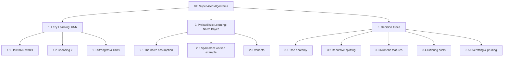
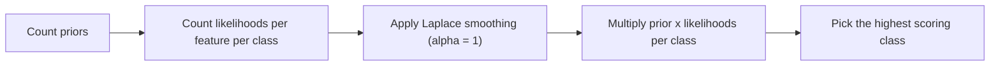
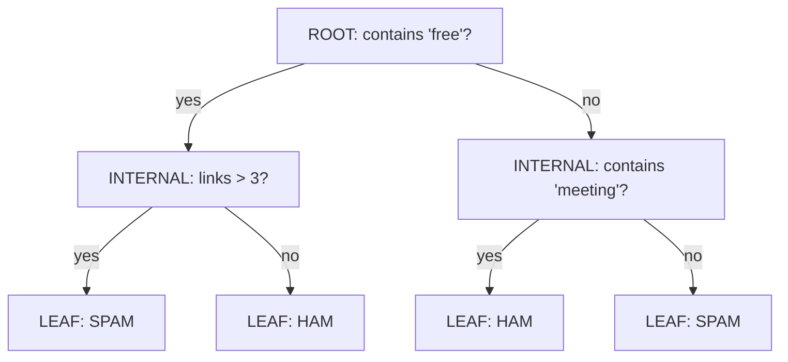

# 04 — Classification Algorithms

> Topic: K-Nearest Neighbors, Naive Bayes, and Decision Trees
> Date: Aug 6, 2026

## Concept Hierarchy

**Ordering note:** The three algorithms are presented in increasing order of what they *store*: KNN stores the whole training set and does no work upfront (lazy), Naive Bayes stores a table of probabilities, and a decision tree stores an explicit rule structure. Each one directly consumes a prerequisite already built: KNN uses the distance measures from [02 §2](02-data-mechanics-and-proximity.md), Naive Bayes uses Bayes' theorem and Laplace smoothing from [03 §1](03-probability-and-information-theory.md), and decision trees use the impurity measures from [03 §2](03-probability-and-information-theory.md). Nothing is re-derived here.

**Running example used throughout:** the **spam/ham mailbox** from [03](03-probability-and-information-theory.md) — 10 training emails, 6 spam and 4 ham, with the features `free`, `meeting`, and numeric link count.

---

## 1. K-Nearest Neighbors (Lazy Learning)

**Meaning** — There is no "training" at all. To classify a new email, find the $k$ training emails closest to it and take a majority vote of their labels.

> **Formal definition:** K-Nearest Neighbors is a non-parametric, instance-based (lazy) supervised algorithm that classifies a query point by majority vote among the $k$ training observations nearest to it under a chosen distance measure.

**Why "lazy"** — An **eager** learner (Naive Bayes, decision trees) builds a compact model during training and then discards the data. A **lazy** learner stores the training set verbatim and defers all computation to prediction time.

### 1.1 How KNN Works

**Steps**

1. Choose $k$ and a distance measure ([02 §2](02-data-mechanics-and-proximity.md)).
2. **Scale all features** — mandatory, see 1.3.
3. Compute the distance from the query point to every training observation.
4. Take the $k$ smallest distances.
5. Predict the majority class among those $k$ neighbours (average of their values, for KNN regression).

**Worked example** — Query email $q$ with 2 occurrences of `free` and 4 links. Training points (`free` count, links), all already scaled to a comparable range for simplicity:

| Neighbour | Features | Euclidean distance to $q=(2,4)$ | Label |
| --------- | -------- | ------------------------------- | ----- |
| $e_1$     | (3, 5)   | $\sqrt{1+1}=1.41$               | spam  |
| $e_3$     | (4, 6)   | $\sqrt{4+4}=2.83$               | spam  |
| $e_9$     | (0, 3)   | $\sqrt{4+1}=2.24$               | ham   |
| $e_{10}$  | (1, 1)   | $\sqrt{1+9}=3.16$               | ham   |

With $k=3$ the nearest are $e_1$ (spam, 1.41), $e_9$ (ham, 2.24), $e_3$ (spam, 2.83) → 2 spam vs 1 ham → **spam**.

**Interpretation** — With $k=1$ the answer would also be spam (nearest is $e_1$); with $k=4$ the vote ties 2–2 and must be broken (by nearest neighbour, or by distance weighting).

**Important details** — **Distance-weighted KNN** gives each neighbour a vote of $1/d^2$ instead of 1, so closer neighbours count more and ties become far less likely.

### 1.2 Choosing $k$

| $k$         | Effect                                    | Risk                                                               |
| ----------- | ----------------------------------------- | ------------------------------------------------------------------ |
| Small (1–3) | Very flexible, follows every local wiggle | **Overfitting** — one noisy/mislabeled point can decide the answer |
| Large (≫)   | Very smooth decision boundary             | **Underfitting** — the global majority class dominates every query |

**Important details** — Rules of thumb: use an **odd** $k$ for binary problems to avoid ties, and start near $k \approx \sqrt{n}$. Then tune it properly with cross-validation ([regression Session 5 §3](../../05-supervised-ml-regression/notes/05-model-optimization.md)); $k$ is the classic example of a hyperparameter controlling the bias–variance trade-off.

### 1.3 Strengths and Limits

| Strengths                                    | Limits                                                                                |
| -------------------------------------------- | ------------------------------------------------------------------------------------- |
| No training phase; adding data is instant    | Prediction is $O(n \times p)$ — slow on large training sets                           |
| Naturally handles multi-class problems       | Must store the entire training set in memory                                          |
| No assumptions about the data distribution   | **Requires feature scaling** — an unscaled large-range feature dominates the distance |
| Decision boundary can be arbitrarily complex | Degrades badly in high dimensions (curse of dimensionality)                           |

**Important details — why scaling is non-negotiable** — In [02 §2.2](02-data-mechanics-and-proximity.md), the message-length gap of 20 contributed 400 of the 425 squared distance while the `free`-count gap contributed 9. Without scaling, KNN is effectively a one-feature model. Use Min-Max or Z-score scaling ([regression Session 1 §2.3](../../05-supervised-ml-regression/notes/01-introduction.md)), fitted on the training split only.

**Important details — curse of dimensionality** — As $p$ grows, all pairwise distances converge toward each other, so "nearest" stops being meaningful. Reduce dimensions (PCA, feature selection) before applying KNN to wide data.

**Exam focus** — Be able to state the lazy-vs-eager distinction, walk through a small $k$-vote by hand, and explain the effect of $k$ on overfitting in both directions.

---

## 2. Naive Bayes (Probabilistic Learning)

**Meaning** — Compute the probability of each class given the observed features using Bayes' theorem, and pick the highest. "Naive" refers to the simplifying assumption that features are independent given the class.

> **Formal definition:** The Naive Bayes classifier assigns to an observation the class $\hat{C} = \arg\max_{C} P(C)\prod_{i=1}^{p}P(x_i \mid C)$, applying Bayes' theorem under the assumption that features are conditionally independent given the class.

### 2.1 The Naive Assumption

**Meaning** — The classifier treats every feature as if it carried information independent of the others, once the class is known.

$$P(x_1, x_2, \dots, x_p \mid C) = \prod_{i=1}^{p} P(x_i \mid C)$$

**Important details** — This assumption is almost always **false** in real text: the words "free" and "offer" clearly co-occur in spam. Yet Naive Bayes still classifies well, because the decision only needs the *ranking* of class scores to be right, not the absolute probabilities. The cost of a wrong assumption shows up as poorly-calibrated probabilities (over-confident scores near 0 or 1), which matters if you use the score itself for thresholding ([06 §3.1](06-model-evaluation.md)).

**Why it matters** — Without the assumption, estimating $P(x_1,\dots,x_p \mid C)$ jointly requires counts for every *combination* of feature values — $2^p$ cells for binary features. With it, only $p$ separate counts per class are needed. That is the whole reason the algorithm is tractable on vocabularies of tens of thousands of words.

### 2.2 Worked Example — Spam vs Ham

Using the mailbox from [03](03-probability-and-information-theory.md), classify a new email containing both `free` and `meeting`:

**Step 1 — Priors** — $P(\text{spam}) = 6/10 = 0.6$, $P(\text{ham}) = 4/10 = 0.4$.

**Step 2 — Likelihoods** — $P(\texttt{free}\mid\text{spam}) = 4/6$, $P(\texttt{meeting}\mid\text{spam}) = 2/6$, $P(\texttt{free}\mid\text{ham}) = 1/4$, $P(\texttt{meeting}\mid\text{ham}) = 3/4$.

**Step 3 — Score each class**

$$\text{spam}: 0.6 \times \tfrac{4}{6} \times \tfrac{2}{6} = 0.1333 \qquad \text{ham}: 0.4 \times \tfrac{1}{4} \times \tfrac{3}{4} = 0.075$$

**Step 4 — Normalise** — $P(\text{spam}\mid X) = 0.1333/(0.1333+0.075) = 0.64$ → **predict spam**.

**Step 5 — Smoothing check** — If the email also contained `lottery`, unseen in any ham email, the ham score would collapse to exactly 0. Laplace smoothing ([03 §1.3](03-probability-and-information-theory.md)) with $\alpha=1$ replaces that $0/4$ with $1/6$, keeping the comparison meaningful.

### 2.3 Variants

| Variant            | Feature type              | Typical use                                                                                                                                                   |
| ------------------ | ------------------------- | ------------------------------------------------------------------------------------------------------------------------------------------------------------- |
| **Multinomial NB** | Word counts / frequencies | Text classification, spam filtering                                                                                                                           |
| **Bernoulli NB**   | Binary present/absent     | Short texts where occurrence matters more than count                                                                                                          |
| **Gaussian NB**    | Continuous                | Assumes each feature is normally distributed within each class, using $P(x_i \mid C) = \frac{1}{\sqrt{2\pi\sigma_C^2}}e^{-\frac{(x_i-\mu_C)^2}{2\sigma_C^2}}$ |

**Strengths** — Extremely fast to train (one pass of counting), works well with very high-dimensional text, needs relatively little training data, and handles multi-class naturally.

**Limits** — Correlated features are double-counted; output probabilities are poorly calibrated; Gaussian NB is wrong whenever the normality assumption fails.

**Exam focus** — State the naive assumption precisely (conditional independence *given the class*), explain why the classifier still works despite it, and show the full 4-step calculation with smoothing.

---

## 3. Decision Trees

**Meaning** — A flowchart of yes/no questions learned from data. Follow the answers from the top down and the leaf you land on is the prediction.

> **Formal definition:** A decision tree is a supervised model that recursively partitions the feature space into axis-parallel regions, choosing at each internal node the feature-and-threshold split that most reduces an impurity measure, and assigning to each terminal region the majority class of the training observations it contains.

### 3.1 Tree Anatomy

| Part                         | Definition                                                              | In the diagram                      |
| ---------------------------- | ----------------------------------------------------------------------- | ----------------------------------- |
| **Root node**                | The topmost node, holding the full training set; where splitting begins | "contains `free`?"                  |
| **Decision / internal node** | Any non-terminal node that tests a feature and splits the data further  | "links > 3?", "contains `meeting`?" |
| **Branch**                   | An edge representing one outcome of a test                              | the `yes` / `no` arrows             |
| **Leaf / terminal node**     | A node with no children; carries the final predicted class              | SPAM / HAM boxes                    |
| **Depth**                    | Number of edges on the longest root-to-leaf path                        | 2 here                              |
| **Subtree**                  | Any node together with everything below it                              | the "links > 3?" branch             |

**Important details** — Every observation follows exactly one root-to-leaf path, so the leaves partition the data with no overlap and no gaps. Each path is directly readable as an if-then rule — this interpretability is the tree's biggest practical advantage.

### 3.2 Construction — Recursive Splitting

**Meaning** — Trees are built greedily, top-down: at each node try every feature, score each candidate split with an impurity measure, keep the best, then repeat inside each child.

> **Formal definition:** Recursive binary partitioning selects at each node the split $(feature, threshold)$ maximising the impurity reduction $\Delta = I(parent) - \sum_{v}\frac{|S_v|}{|S|}I(S_v)$, and applies the same procedure to each resulting child until a stopping criterion is met.

**Steps**

1. Start with all training data at the root.
2. For every feature (and every candidate threshold, see 3.3), compute the impurity reduction — information gain or Gini gain, both defined in [03 §2](03-probability-and-information-theory.md).
3. Split on the winner.
4. Recurse into each child with the data that reached it.
5. Stop when a node is pure, has too few observations, hits the maximum depth, or no split gives a worthwhile gain.
6. Label each leaf with its majority class.

**Worked example** — At the root of the mailbox, splitting on `free` gives $IG = 0.124$ ([03 §2.2](03-probability-and-information-theory.md)). If splitting on `meeting` gave $IG = 0.091$, the root becomes "contains `free`?" and the procedure repeats independently inside each child.

**Important details** — The algorithm is **greedy**: it takes the locally best split at every node and never reconsiders. A pair of splits that would jointly be better but individually look weak will be missed. Finding the globally optimal tree is NP-hard, which is why the greedy heuristic is universal.

| Algorithm | Split criterion  | Split type                                    |
| --------- | ---------------- | --------------------------------------------- |
| ID3       | Information gain | Multi-way, categorical only                   |
| C4.5      | Gain ratio       | Multi-way, handles numeric and missing values |
| CART      | Gini index       | Binary splits only; also does regression      |

### 3.3 Handling Numeric Features

**Meaning** — A numeric feature has no natural categories, so the tree must invent a threshold and turn it into a yes/no test.

**Steps**

1. Sort the distinct values of the feature at that node.
2. Take the midpoint between each pair of adjacent values as a candidate threshold.
3. Score every candidate as a binary split $x \le t$ vs $x > t$.
4. Keep the threshold with the highest gain.

**Worked example** — Link counts at a node are 1, 3, 5, 6 → candidate thresholds 2, 4, 5.5. If $t = 4$ separates {1, 3} (both ham) from {5, 6} (both spam), that split reaches zero impurity and wins.

**Important details** — Only thresholds *between observed values* need testing, and only where the class label actually changes — a large but finite search. Because splits compare one feature against a constant, the resulting boundaries are always **axis-parallel**; a diagonal boundary must be approximated by a staircase of many splits. Note also that trees need **no feature scaling** at all, since a threshold is chosen within each feature's own units — the sharpest contrast with KNN (§1.3).

### 3.4 Handling Differing Costs

**Meaning** — Not all mistakes cost the same. Sending a real invoice to the spam folder (false positive) is far worse than letting one spam email through (false negative), so the tree should be told that.

> **Formal definition:** Cost-sensitive learning incorporates a cost matrix $C(i,j)$ — the cost of predicting class $j$ when the true class is $i$ — into training, so that the model minimises expected misclassification cost rather than raw error count.

**Example cost matrix**

|                 | Predicted ham | Predicted spam         |
| --------------- | ------------- | ---------------------- |
| **Actual ham**  | 0             | 10 (a real email lost) |
| **Actual spam** | 1 (nuisance)  | 0                      |

**How it is applied — three equivalent levers**

1. **Weighted leaf labelling** — a leaf predicts the class minimising expected cost, not the majority. A leaf with 6 spam and 1 ham would normally say spam; under the matrix above, labelling it spam risks $1 \times 10 = 10$ while labelling it ham risks $6 \times 1 = 6$, so it predicts **ham**.
2. **Class weights** — weight each observation by the cost of misclassifying it, so the impurity measures in [03 §2](03-probability-and-information-theory.md) are computed on weighted counts.
3. **Threshold shifting** — keep the tree, but require a higher predicted probability before declaring spam (see [06 §3.1](06-model-evaluation.md)).

**Important details** — This is also the standard remedy for **class skew** ([06 §5.2](06-model-evaluation.md)): the rare class is given a larger weight so the tree cannot ignore it.

### 3.5 Overfitting and Pruning

**Meaning** — Left unchecked, a tree keeps splitting until every leaf holds a single training observation — perfect on training data, useless on new data.

| Control                        | How it works                                                                                                               |
| ------------------------------ | -------------------------------------------------------------------------------------------------------------------------- |
| **Max depth**                  | Stop splitting past a fixed depth (pre-pruning)                                                                            |
| **Min samples per leaf/split** | Refuse splits that would create very small nodes (pre-pruning)                                                             |
| **Min impurity decrease**      | Refuse splits whose gain is below a threshold (pre-pruning)                                                                |
| **Cost-complexity pruning**    | Grow the full tree, then cut back subtrees that do not justify their complexity, judged on a validation set (post-pruning) |

**Important details** — Cost-complexity (weakest-link) pruning minimises $R_\alpha(T) = R(T) + \alpha|T|$, where $R(T)$ is the misclassification cost, $|T|$ is the number of leaves, and $\alpha$ penalises size — the same complexity-penalty idea as AIC ([06 §4.2](06-model-evaluation.md)) and regularisation ([regression Session 5 §5](../../05-supervised-ml-regression/notes/05-model-optimization.md)). Post-pruning generally beats pre-pruning because a split that looks weak on its own can enable a strong split beneath it, which early stopping never gets to see.

**Connection** — A single tree is unstable: change a few training rows and the root split can change entirely. That high variance is precisely what the ensembles in [05](05-ensemble-learning.md) exist to fix.

**Exam focus** — Label every part of a given tree diagram, run one full split selection using information gain, describe midpoint threshold selection for a numeric feature, and explain how a cost matrix changes a leaf's label.

---

## Quick Revision

- **KNN:** lazy, distance-based, majority vote of $k$ neighbours. Needs scaling; small $k$ overfits, large $k$ underfits.
- **Naive Bayes:** $\arg\max_C P(C)\prod P(x_i\mid C)$; assumes conditional independence; needs Laplace smoothing.
- **Decision tree:** greedy recursive splitting on maximum impurity reduction; no scaling needed; prune to control overfitting.
- **Most important comparison:** KNN needs feature scaling and stores everything; trees need neither and produce readable rules.
- **5 exam keywords:** lazy learner, conditional independence, recursive partitioning, axis-parallel split, cost matrix.
- **6 common mistakes:** running KNN on unscaled features; choosing an even $k$ for a binary problem; forgetting smoothing and hitting a zero likelihood; stating the naive assumption without "given the class"; scaling features before a tree because KNN needed it; letting a tree grow unpruned and reporting the training accuracy.

## Topic Coverage

- K-Nearest Neighbors — Covered in Section 1
- Naive Bayes (spam/ham) — Covered in Section 2
- Tree Anatomy (root, decision node, internal node, leaf, branch) — Covered in Section 3.1
- Construction / recursive splitting — Covered in Section 3.2
- Handling numeric features — Covered in Section 3.3
- Handling differing costs — Covered in Section 3.4

Next: [05 — Ensemble Learning](05-ensemble-learning.md) · Back to [module map](00-study-checklist.md).
