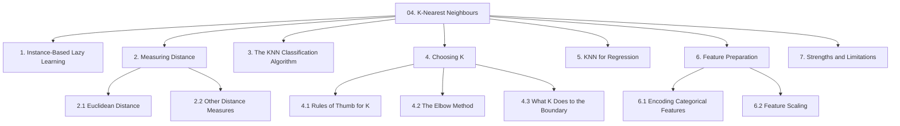
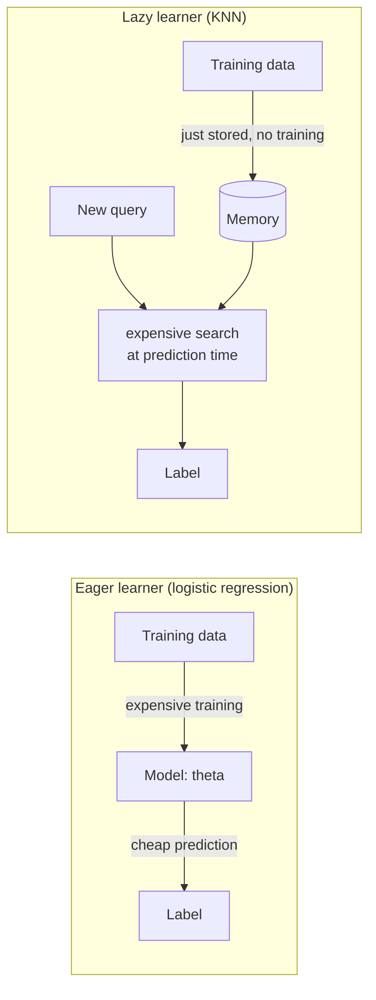
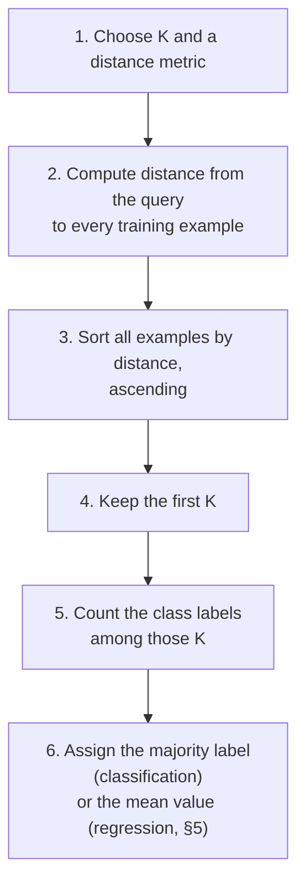
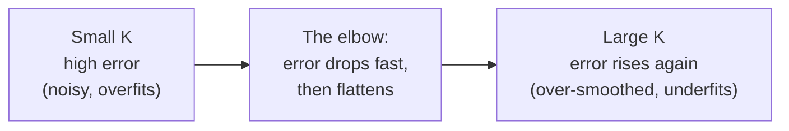
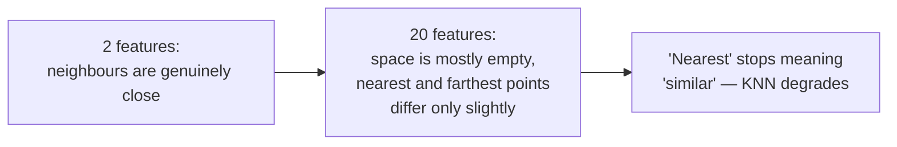

# Chapter 04 — K-Nearest Neighbours (KNN)

> Source: `unit-2_knn.pdf`
> Read after: [Chapter 03](03-logistic-regression.md)

## Concept Hierarchy

**Ordering note:** the source presents feature preparation (encoding gender and location, scaling) before the algorithm. It is moved to §6, *after* the algorithm, because the reason those steps are mandatory is that KNN is distance-based — a fact you can only appreciate once you have seen the distance calculation. §1 (lazy learning) is added as framing: it is implicit in the source's description of KNN having "no training phase".

**Running example:** the same bank data, classifying applicants as **default / no default** using `age` and `annual income`.

---

## 1. Instance-Based (Lazy) Learning

**Picture this** — two students sit the same open-book exam. The first spent a month boiling three thick textbooks down to six pages of notes; she walks in with those six pages and answers each question in seconds. The second did no preparation at all — she wheels in a trolley carrying all three textbooks untouched and looks everything up on the spot. She got ready for free. She will also spend the entire three hours flipping pages, and the trolley only gets heavier every time a new book is published.

**Mapping**:

| Analogy element                                | What it really is                                          |
| ---------------------------------------------- | ---------------------------------------------------------- |
| The first student's six pages of notes         | a parametric model's learned parameters $\theta$            |
| The month spent condensing them                | the training phase of an eager learner                     |
| Answering each question in seconds             | cheap prediction                                           |
| The trolley of untouched textbooks             | KNN's stored training set — the "model"                     |
| Doing no preparation at all                    | KNN's absent training phase                                |
| Flipping pages for every single question       | computing distance to all $m$ examples, per query          |
| The trolley getting heavier with each new book | model size and latency growing with the data               |

**Meaning** — logistic regression compresses 10,000 applicants into a handful of numbers $\theta$ and then throws the data away. KNN does the exact opposite: it **stores every training example** and does no work at all until a prediction is requested — at which point it searches the stored data for the most similar records.

> **Formal definition:** K-Nearest Neighbours is a non-parametric, instance-based (lazy) supervised learning algorithm that classifies a new instance by a majority vote of the class labels of its $K$ closest training instances, where closeness is measured by a distance metric in feature space.

Two consequences follow directly, and both are examinable:

- **Training cost is essentially zero; prediction cost is high.** Every prediction compares the query against all $m$ stored examples. With 10,000 applicants and 6 features, that is 10,000 distance calculations *per applicant scored*.
- **KNN is non-parametric.** There is no fixed set of parameters summarising the data; the "model" is the dataset. Its complexity therefore grows with the data, which is why memory and latency — not accuracy — are usually what kill KNN in production.

The core assumption is simple and stated explicitly in exams: **similar inputs have similar outputs.** Applicants whose age and income closely resemble those of past defaulters are themselves likely to default.

**Core takeaway** — KNN moves the entire cost of learning from training time to prediction time, so it is free to build and expensive to use — the exact inversion of every model before it.

---

## 2. Measuring Distance

**Picture this** — a town map with a pin for every household you hold records on, and one fresh pin for the family that moved in last week. To guess anything at all about the newcomers you look at who is physically nearest that new pin. But "nearest" depends entirely on how you decide to measure: crow-flies straight over the rooftops, or walking the grid of streets round the blocks. The two rulers can hand you different neighbours from the same map.

**Mapping**:

| Analogy element                    | What it really is                              |
| ---------------------------------- | ---------------------------------------------- |
| The town map                       | the feature space                              |
| One axis of the map                | one feature                                    |
| A pin already on it                | one stored training example                    |
| The fresh pin                      | the query instance                             |
| Measuring crow-flies over rooftops | Euclidean distance                             |
| Walking the grid of streets        | Manhattan distance                             |
| Whichever households end up closest| the neighbours that will get a vote            |

**Meaning** — "nearest" needs an arithmetic definition. Each training record is a point in $n$-dimensional space (one axis per feature), and distance between points is what "similar" means.

### 2.1 Euclidean Distance

The straight-line distance between two points — Pythagoras' theorem extended to $n$ dimensions.

> **Formal definition:** The Euclidean distance between two points $p$ and $q$ in $n$-dimensional space is the square root of the sum of the squared differences of their corresponding coordinates.

**Formula (Euclidean distance)** — Essential
$$d(p, q) = \sqrt{\sum_{j=1}^{n}\left(p_j - q_j\right)^2}$$

**Where** — $d(p,q)$: the distance between point $p$ and point $q$; $p_j$: the value of feature $j$ for the first point; $q_j$: the value of feature $j$ for the second point; $n$: the number of features; the sum runs over every feature, so each feature contributes to the total distance.

**Worked example** — a new applicant $Q$ = (age 30, income 6 lakh) compared against three stored applicants, using **scaled** features (see §6.2 for why raw values would be wrong):

| Stored point | Age | Income | $(\Delta \text{age})^2$ | $(\Delta \text{income})^2$ | $d$                  | Label      |
| ------------ | --- | ------ | ----------------------- | -------------------------- | -------------------- | ---------- |
| $A$          | 32  | 6.5    | 4                       | 0.25                       | $\sqrt{4.25} = 2.06$ | default    |
| $B$          | 28  | 5.0    | 4                       | 1.00                       | $\sqrt{5.00} = 2.24$ | default    |
| $C$          | 45  | 12.0   | 225                     | 36.00                      | $\sqrt{261} = 16.16$ | no default |

**Interpretation** — $A$ and $B$ are the near neighbours; $C$ is far away and will not influence the decision for small $K$. With $K = 3$ the vote is 2 default vs 1 no-default → predict **default**.

### 2.2 Other Distance Measures

Euclidean is the default and the one to use unless told otherwise, but naming the alternatives shows range in a long answer:

| Metric                 | Formula                                               | Use when                                                                                   |
| ---------------------- | ----------------------------------------------------- | ------------------------------------------------------------------------------------------ |
| Euclidean              | $\sqrt{\sum(p_j-q_j)^2}$                              | Continuous features, straight-line similarity is meaningful                                |
| Manhattan (city-block) | $\sum \lvert p_j - q_j \rvert$                        | Movement is grid-constrained, or high-dimensional data where squaring exaggerates outliers |
| Minkowski              | $\left(\sum \lvert p_j-q_j \rvert^{\,r}\right)^{1/r}$ | General form: $r=1$ gives Manhattan, $r=2$ gives Euclidean                                 |
| Hamming                | count of positions where $p_j \neq q_j$               | Purely categorical or binary features                                                      |

**Where (Minkowski)** — $r$: the order parameter that selects the metric family; $p_j, q_j$: coordinate $j$ of the two points; $\lvert\cdot\rvert$: absolute value.

**Core takeaway** — whichever formula you pick for distance *is* this model's definition of "similar"; there is no second, truer notion of similarity hiding behind it.

---

## 3. The KNN Classification Algorithm

**Picture this** — you walk to the new family's pin, knock on the $K$ doors closest to it, and ask each household the same single question. Then you count the replies and go with whatever most of them said. At no point did anyone draw the town's districts or mark out where one neighbourhood ends and the next begins — the answer for that one address simply fell out of who happened to live around it.

**Mapping**:

| Analogy element                          | What it really is                                        |
| ---------------------------------------- | -------------------------------------------------------- |
| Knocking on the $K$ closest doors        | selecting the $K$ smallest distances                     |
| The single question you ask each one     | reading that stored example's class label                |
| Counting the replies                     | the majority vote                                        |
| Going with the commonest reply           | the predicted class                                      |
| Four of five doors saying the same thing | the vote proportion, usable as a confidence              |
| Never drawing the district boundaries    | no decision boundary is ever computed or stored          |

**Meaning** — prediction is four mechanical steps: measure every distance, sort, keep the nearest $K$, and take their majority label.

> **Formal definition:** Given a query instance, KNN classification computes the distance from the query to every training instance, selects the $K$ instances with the smallest distances, and assigns the query the class label held by the majority of those $K$ instances.

**Steps in detail:**

1. **Choose $K$** and a distance metric — see §4 for how.
2. **Compute the distance** from the query to each of the $m$ stored examples.
3. **Sort** ascending by distance.
4. **Take the top $K$** rows — these are the nearest neighbours.
5. **Vote**: count each class's occurrences among those $K$ neighbours.
6. **Assign** the class with the most votes. Optionally report the vote proportion as a confidence, e.g. 4 out of 5 neighbours default → 0.8.

**Worked example** — extend the table in §2.1 with two more stored applicants, $D$ ($d = 2.50$, no default) and $E$ ($d = 3.10$, default). Sorted by distance: $A$ (2.06, default), $B$ (2.24, default), $D$ (2.50, no default), $E$ (3.10, default), $C$ (16.16, no default).

| $K$ | Neighbours used | Votes                   | Prediction |
| --- | --------------- | ----------------------- | ---------- |
| 1   | $A$             | 1 default               | default    |
| 3   | $A, B, D$       | 2 default, 1 no-default | default    |
| 5   | $A, B, D, E, C$ | 3 default, 2 no-default | default    |

**Important details:**

- **Ties.** With an even $K$ in a binary problem the vote can split 2–2. Standard remedies: use an odd $K$ (§4.1), break the tie towards the closer neighbour, or fall back to $K-1$.
- **Distance weighting.** A refinement gives each neighbour a vote of weight $1/d^2$, so a neighbour at distance 0.1 counts far more than one at distance 5. This reduces the harm of choosing $K$ slightly too large.
- **No decision boundary is ever computed.** KNN's boundary exists implicitly — it is wherever the majority vote happens to flip — which is why it can be arbitrarily jagged (§4.3).

**Core takeaway** — KNN never draws a boundary; the boundary is merely wherever the local vote flips, which is why its shape is dictated by the data rather than chosen by you.

---

## 4. Choosing K

**Picture this** — you have just moved in and want to know whether the street is safe. Ask exactly one neighbour and you inherit whatever that one person believes, including the bad night they had last Tuesday. Ask every single person in the city and you get the city's average opinion, which tells you nothing whatsoever about your street. Somewhere between one and everyone is the number of people actually worth asking — and no amount of thinking will tell you what it is. You have to try a few and see which answer held up.

**Mapping**:

| Analogy element                            | What it really is                                     |
| ------------------------------------------ | ----------------------------------------------------- |
| Asking exactly one neighbour               | $K = 1$                                                |
| Inheriting their one bad Tuesday           | fitting the noise carried by a single point           |
| Asking everyone in the city                | $K = m$                                                |
| Getting the bland city-wide average        | predicting the global majority class for every query  |
| The number actually worth asking           | the chosen $K$                                         |
| Trying a few and seeing which held up      | validating $K$ with the elbow method or CV            |

**Meaning** — $K$ is the only significant hyper-parameter, and it controls the entire behaviour of the model.

### 4.1 Rules of Thumb for K

> **Formal definition:** $K$ is the hyper-parameter specifying how many nearest training instances contribute to the prediction of a query instance.

Two heuristics are used to pick the *starting* value:

- **Use an odd $K$ for binary classification**, so a majority always exists and ties are impossible. (For three or more classes, odd $K$ does not guarantee this — a 2-2-1 split with $K=5$ still ties.)
- **Start near $K \approx \sqrt{m}$**, where $m$ is the number of training examples. With $m = 10{,}000$ that gives $K \approx 100$.

**Correction to the common phrasing** — $K=\sqrt{m}$ is *only a starting point for the search*, not a rule that determines $K$. It is a rough compromise between the two failure modes in §4.3 and has no theoretical guarantee. The value you actually use must be selected empirically with the elbow method (§4.2) or cross-validation on the validation set ([01 §5](01-ml-foundations.md#5-training-validation-and-test-data)).

### 4.2 The Elbow Method

> **Formal definition:** The elbow method selects a hyper-parameter value by plotting a performance measure against candidate values and choosing the point at which the rate of improvement sharply decreases, producing a visible bend in the curve.

For KNN the curve plots **misclassification error rate on the validation set** against $K$:

**Steps:**

1. Choose a range of candidate $K$, e.g. 1, 3, 5, …, 31.
2. For each, train (i.e. store) on the training set and score on the validation set.
3. Plot error rate on the $y$-axis against $K$ on the $x$-axis.
4. Pick the $K$ at the bend — where extra neighbours stop buying meaningful accuracy.

**Worked example:**

| $K$   | Validation error |
| ----- | ---------------- |
| 1     | 0.18             |
| 3     | 0.13             |
| 5     | 0.11             |
| **7** | **0.10**         |
| 9     | 0.099            |
| 11    | 0.099            |
| 15    | 0.105            |

**Interpretation** — the sharp fall stops at $K = 7$; going to 9 or 11 buys 0.001, and beyond that error begins to climb. Choose $K = 7$ — the simplest model at essentially the best error.

**Correction to the common phrasing** — this is *not* the same elbow plot used in K-Means clustering. Same name, same visual idea, different $y$-axis: K-Means plots the within-cluster sum of squares, KNN plots supervised error rate. Conflating them in an exam is a marked error.

### 4.3 What K Does to the Decision Boundary

|                      | Small $K$ (e.g. $K=1$)                                        | Large $K$ (e.g. $K=m$)                                                              |
| -------------------- | ------------------------------------------------------------- | ----------------------------------------------------------------------------------- |
| Boundary shape       | Highly jagged, wraps around individual points                 | Very smooth, eventually a straight line                                             |
| Sensitivity to noise | Extremely high — one mislabelled point creates its own island | Very low — a single bad point is outvoted                                           |
| Bias / variance      | Low bias, **high variance** → overfitting                     | High bias, low variance → underfitting                                              |
| Training accuracy    | $K=1$ gives 100% (each point is its own nearest neighbour)    | Poor                                                                                |
| Extreme failure      | Memorises the training set                                    | Predicts the overall majority class for every query, ignoring the features entirely |

The central trade-off in one sentence: **$K$ controls how much the model smooths over local detail** — too little smoothing chases noise, too much erases the real signal. Choose it on the validation set, never on the training set (where $K=1$ always wins and is always wrong).

**Core takeaway** — $K$ is a smoothing dial deciding how much local detail counts as signal, and only data the model has not seen can say where to set it.

---

## 5. KNN for Regression

Same doorstep, different question: instead of asking each neighbour how they voted, you ask what their house sold for, and average the replies. The identical neighbour-search machinery predicts a number instead of a label — only the final aggregation step changes.

> **Formal definition:** KNN regression predicts the value of a continuous target for a query instance as the mean (or distance-weighted mean) of the target values of its $K$ nearest training instances.

**Formula (KNN regression prediction)** — Exam-important
$$\hat{y} = \frac{1}{K}\sum_{i \in N_K(x)} y^{(i)}$$

**Where** — $\hat{y}$: the predicted numeric value for the query $x$; $K$: number of neighbours used; $N_K(x)$: the set of indices of the $K$ nearest training instances to $x$; $y^{(i)}$: the true target value of neighbour $i$.

**Formula (Distance-weighted KNN regression)** — Additional depth
$$\hat{y} = \frac{\sum_{i \in N_K(x)} w_i\, y^{(i)}}{\sum_{i \in N_K(x)} w_i}, \qquad w_i = \frac{1}{d(x, x^{(i)})^2}$$

**Where** — $w_i$: the weight of neighbour $i$, larger for closer neighbours; $d(x, x^{(i)})$: distance from the query to neighbour $i$; the denominator normalises the weights so they sum to 1; all other symbols as above.

**Example** — predicting an applicant's **credit score**. The 3 nearest applicants have scores 700, 720 and 740, so $\hat{y} = (700+720+740)/3 = 720$.

**Important details** — KNN regression can only ever predict values inside the range seen in training. It cannot extrapolate: no combination of stored neighbours can produce a score above the maximum in the data. Linear regression ([Chapter 02](02-linear-regression-and-gradient-descent.md)) extrapolates freely — sometimes usefully, sometimes absurdly.

|                  | KNN classification                                | KNN regression          |
| ---------------- | ------------------------------------------------- | ----------------------- |
| Neighbour search | Identical                                         | Identical               |
| Aggregation      | Majority vote                                     | Mean (or weighted mean) |
| Output           | Class label                                       | Numeric value           |
| Evaluated by     | Accuracy, F1 ([Ch 07](07-performance-metrics.md)) | MSE, MAE                |

**Core takeaway** — because it can only ever average values it has already been shown, KNN regression is structurally incapable of predicting outside the range of its training data.

---

## 6. Feature Preparation

**Picture this** — someone hands you a map and asks which house is nearest. Then you read the small print on the axes: the horizontal one is marked in millimetres, the vertical one in kilometres. Two houses a full kilometre apart look practically stacked on top of one another, while two a few millimetres apart sideways look like they are in different countries. Nothing has moved. The map is simply lying, because nobody agreed on what its two axes meant.

**Mapping**:

| Analogy element                                | What it really is                                        |
| ---------------------------------------------- | -------------------------------------------------------- |
| The map with mismatched axis units             | features living on wildly different numeric scales       |
| The horizontal axis in millimetres             | a small-valued feature such as age                       |
| The vertical axis in kilometres                | a large-valued feature such as income in rupees          |
| A whole vertical kilometre looking like nothing| a genuinely important feature erased by its units        |
| Redrawing both axes to one agreed scale        | feature scaling (§6.2)                                    |
| Numbering unrelated towns 1, 2, 3 on the map   | label-encoding an unordered category (§6.1)               |

**Meaning** — KNN is *pure distance arithmetic*, so anything that distorts distances destroys the model. Two preparation steps are therefore mandatory, not optional.

### 6.1 Encoding Categorical Features

The bank data contains `gender` (Male/Female) and `city` (Bangalore/Udupi/Mangalore). You cannot subtract "Male" from "Female", so these must become numbers first.

> **Formal definition:** Categorical encoding is the process of converting categorical attribute values into numeric representations so that they can be used by algorithms requiring numeric input; label encoding assigns each category an integer, whereas one-hot encoding creates one binary indicator column per category.

|                   | Label encoding                                                     | One-hot encoding                                             |
| ----------------- | ------------------------------------------------------------------ | ------------------------------------------------------------ |
| What it does      | `Male → 0, Female → 1`                                             | Creates `is_Bangalore`, `is_Udupi`, `is_Mangalore`, each 0/1 |
| Columns added     | 0 (replaces in place)                                              | One per category (minus one if a baseline is dropped)        |
| Implies an order? | **Yes** — the algorithm sees $2 > 1 > 0$                           | No — every category is equidistant from every other          |
| Use for           | Binary features, or genuinely ordered categories (Low/Medium/High) | Unordered categories with no ranking                         |

**The trap** — label-encoding `city` as `Bangalore=1, Udupi=2, Mangalore=3` tells the distance formula that Bangalore is *closer to* Udupi than to Mangalore, and that Udupi sits exactly halfway between them. That relationship is invented by the encoding and does not exist in reality. For an unordered category with more than two values, use one-hot encoding.

**Example** — after encoding, one applicant becomes `[age=30, income=6.0, gender=1, is_Bangalore=1, is_Udupi=0, is_Mangalore=0]`, and the Euclidean formula of §2.1 now applies to the whole row.

### 6.2 Feature Scaling

This is the single most important preparation step for KNN, and the most commonly skipped.

> **Formal definition:** Feature scaling is the transformation of numeric features onto a common range or distribution, so that no feature dominates a distance or gradient computation purely because of the units in which it is measured.

**Why it is mandatory — a demonstration.** Compare two applicants using **raw** values: $P$ = (age 30, income 600,000) and $Q$ = (age 55, income 610,000).

$$d = \sqrt{(30-55)^2 + (600000-610000)^2} = \sqrt{625 + 100{,}000{,}000} \approx 10{,}000.03$$

The 25-year age difference contributed $625$ out of $100{,}000{,}625$ — around **0.0006%** of the distance. Income, measured in rupees, has silently become the *only* feature the model uses. Age has not been down-weighted for a good reason; it has been erased by a choice of units.

**Formula (Min-max normalisation)** — Essential
$$x' = \frac{x - x_{\min}}{x_{\max} - x_{\min}}$$

**Where** — $x'$: the scaled value, always in $[0,1]$; $x$: the original value; $x_{\min}$, $x_{\max}$: the smallest and largest values of that feature **in the training set**.

**Formula (Standardisation / Z-score)** — Essential
$$x' = \frac{x - \mu}{\sigma}$$

**Where** — $x'$: the scaled value, centred on 0 with a spread of 1; $x$: the original value; $\mu$: the mean of that feature in the training set; $\sigma$: its standard deviation.

**Worked example** — income ranges from 2 lakh to 20 lakh. An applicant earning 6 lakh scales to $x' = (6-2)/(20-2) = 0.222$. Age ranges 21–60, so age 30 scales to $(30-21)/(60-21) = 0.231$. Both features now live in $[0,1]$ and contribute comparably.

|                   | Min-max normalisation                                         | Standardisation                                                 |
| ----------------- | ------------------------------------------------------------- | --------------------------------------------------------------- |
| Output range      | Exactly $[0,1]$                                               | Unbounded, mean 0, SD 1                                         |
| Outlier behaviour | One extreme value squashes everything else into a narrow band | More robust; outliers stay extreme but do not compress the rest |
| Assumes           | A known, stable min and max                                   | Roughly bell-shaped data                                        |
| Prefer when       | Bounded features, no severe outliers                          | Outliers present, or distribution roughly normal                |

**Non-negotiable rule** — compute $x_{\min}, x_{\max}, \mu, \sigma$ on the **training set only**, then apply those same stored numbers to the validation and test sets. Computing them over the full dataset leaks information about the test data into training and inflates the reported score ([01 §5](01-ml-foundations.md#5-training-validation-and-test-data)).

**Which algorithms need scaling:**

| Needs scaling                                                                                                                                              | Does not need scaling                                                                                 |
| ---------------------------------------------------------------------------------------------------------------------------------------------------------- | ----------------------------------------------------------------------------------------------------- |
| KNN (distances)                                                                                                                                            | Decision trees ([Ch 05](05-decision-trees-and-id3.md)) — splits compare a feature against itself only |
| Gradient descent ([02 §5](02-linear-regression-and-gradient-descent.md#5-gradient-descent)) — unscaled features stretch the contours and cause zig-zagging | Random Forest, boosted trees ([Ch 06](06-ensemble-learning.md)) — same reason                         |
| SVM, K-Means, PCA                                                                                                                                          |                                                                                                       |

**Core takeaway** — distance obeys units, not meaning, so whichever feature happens to be measured in the biggest numbers silently becomes the only feature the model is actually using.

---

## 7. Strengths, Limitations and the Curse of Dimensionality

| Strengths                                                                                                                         | Limitations                                                                          |
| --------------------------------------------------------------------------------------------------------------------------------- | ------------------------------------------------------------------------------------ |
| Extremely simple to explain and implement                                                                                         | Prediction is slow: $O(m \times n)$ per query                                        |
| No training phase at all                                                                                                          | Must keep the entire dataset in memory                                               |
| Naturally handles multi-class — no one-vs-all needed ([03 §5](03-logistic-regression.md#5-multi-class-classification-one-vs-all)) | Requires careful scaling and encoding (§6)                                           |
| Makes no assumption about the shape of the boundary                                                                               | Degrades badly in high dimensions (below)                                            |
| Adapts instantly to new data — just append the row                                                                                | Sensitive to irrelevant features, which add noise to every distance                  |
| Works for both classification and regression (§5)                                                                                 | Struggles with imbalanced classes — the majority class dominates most neighbourhoods |

**Picture this** — put a hundred people in one small room and it is instantly obvious who is standing near whom; the clusters draw themselves. Now scatter those same hundred people across an entire continent. Every single one of them is, for all practical purposes, far from every other, and the gap between the closest pair and the furthest pair has stopped being interesting. Nobody walked anywhere. You only gave the space more room.

**Mapping**:

| Analogy element                              | What it really is                                        |
| -------------------------------------------- | -------------------------------------------------------- |
| The hundred people                           | your $m$ training examples                                |
| The small room                               | a feature space of two or three dimensions               |
| The whole continent                          | the same data described by twenty or more features       |
| Adding room without adding people            | volume growing exponentially with each extra feature     |
| Everyone becoming roughly equidistant        | distance concentration in high dimensions                |
| "Nearest" no longer meaning anything useful  | the loss of discriminative power                         |

> **Formal definition:** The curse of dimensionality refers to the phenomenon whereby, as the number of features increases, the volume of the feature space grows exponentially and data points become increasingly sparse and approximately equidistant from one another, causing distance-based methods to lose discriminative power.

**Mitigations** — remove irrelevant features, apply dimensionality reduction, or switch to a model that selects features internally, such as a decision tree ([Chapter 05](05-decision-trees-and-id3.md)).

**Core takeaway** — extra features expand the space faster than they add information, so in high dimensions "nearest" quietly stops meaning "similar" — and that was the one assumption KNN was standing on.

**Connection** — KNN needs every feature to be numeric and comparably scaled, and it produces no readable rule. Chapter 05 inverts both properties: decision trees handle categorical features natively, ignore scaling entirely, and produce a model a bank manager can read aloud.

---

**Previous:** [Chapter 03](03-logistic-regression.md) · **Next:** [Chapter 05 — Decision Trees & ID3](05-decision-trees-and-id3.md) · Back to [module map](00-study-checklist.md)
