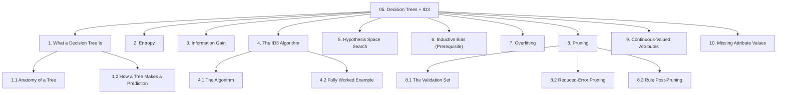
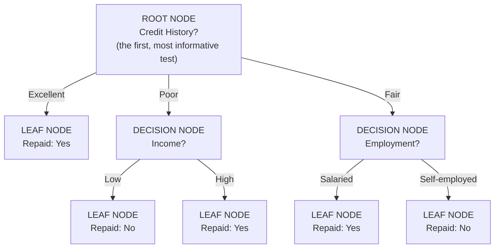
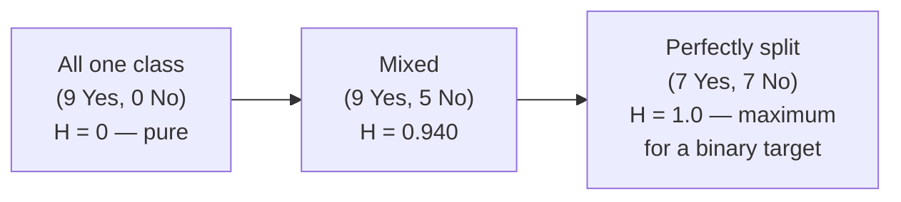
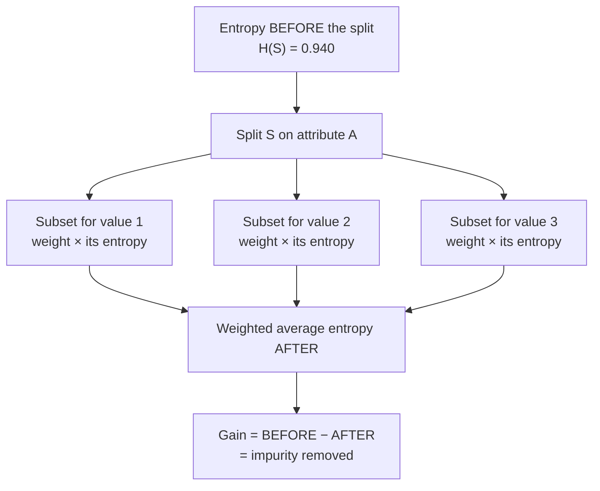
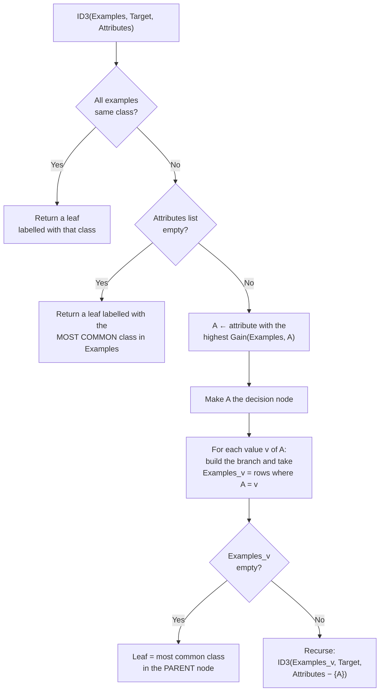
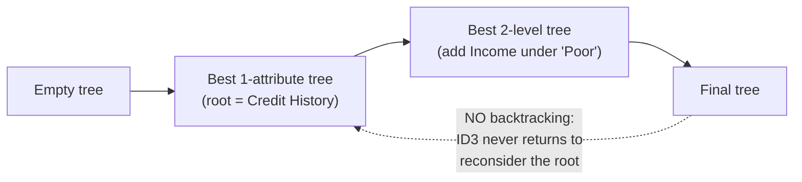
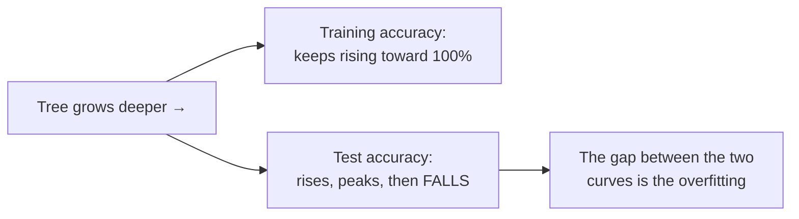
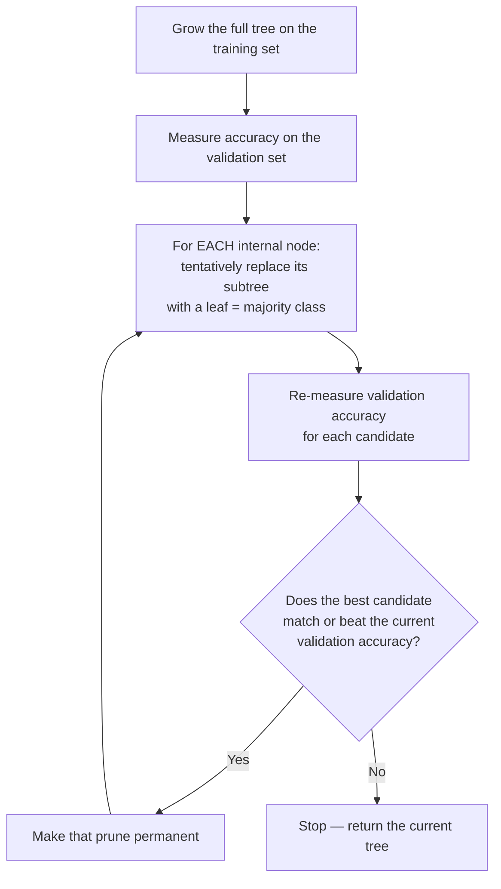

# Chapter 05 — Decision Trees & the ID3 Algorithm

> Sources: `unit-3_a_decission_tree.pdf`, `unit-3_b_id3_algo.pdf`
> Read after: [Chapter 04](04-knn.md) · Prerequisite for: [Chapter 06](06-ensemble-learning.md)

Decision trees are the most *readable* model in this book — the finished model is a flowchart of yes/no questions that a bank manager can follow without knowing any mathematics. They are also the base learner for every ensemble method in Chapter 06, so this chapter carries double weight.

## Concept Hierarchy

**Ordering note:** the two source files overlap heavily — the tree-structure material from `unit-3_a` and the algorithm material from `unit-3_b` have been merged into one chapter, with entropy and information gain (§2, §3) pulled *before* the ID3 algorithm (§4), because ID3 is nothing but repeated information-gain maximisation. **Inductive bias** (§6) is added as a labelled **Prerequisite**: the sources refer to ID3's inductive bias without ever defining the term, and §5 cannot be explained without it. It is therefore also listed in [08 §5 — Gaps to Look Up](08-exam-preparation.md#5-gaps-to-look-up).

**Running example (this chapter's dataset):** 14 past loan applications with four categorical attributes, predicting whether the loan was **Repaid (Yes)** or **Defaulted (No)**. This dataset is used continuously from §2 through §8.

| #   | Credit History | Loan Amount | Income | Employment    | **Repaid?** |
| --- | -------------- | ----------- | ------ | ------------- | ----------- |
| 1   | Poor           | Large       | Low    | Salaried      | **No**      |
| 2   | Poor           | Large       | Low    | Self-employed | **No**      |
| 3   | Excellent      | Large       | Low    | Salaried      | **Yes**     |
| 4   | Fair           | Medium      | Low    | Salaried      | **Yes**     |
| 5   | Fair           | Small       | High   | Salaried      | **Yes**     |
| 6   | Fair           | Small       | High   | Self-employed | **No**      |
| 7   | Excellent      | Small       | High   | Self-employed | **Yes**     |
| 8   | Poor           | Medium      | Low    | Salaried      | **No**      |
| 9   | Poor           | Small       | High   | Salaried      | **Yes**     |
| 10  | Fair           | Medium      | High   | Salaried      | **Yes**     |
| 11  | Poor           | Medium      | High   | Self-employed | **Yes**     |
| 12  | Excellent      | Medium      | Low    | Self-employed | **Yes**     |
| 13  | Excellent      | Large       | High   | Salaried      | **Yes**     |
| 14  | Fair           | Medium      | Low    | Self-employed | **No**      |

Totals: **9 Yes, 5 No** out of 14.

---

## 1. What a Decision Tree Is

**Picture this** — the nurse at a hospital's front desk works from a single laminated card. She asks you one question — are you bleeding? — and depending on your answer she moves to a *different* next question, never to both. Four or five questions later, without knowing any medicine at all, she has put you in exactly the right queue. And anyone reading the card over her shoulder can see precisely why you ended up where you did.

**Mapping**:

| Analogy element                                | What it really is                                        |
| ---------------------------------------------- | -------------------------------------------------------- |
| The laminated card                             | the decision tree                                        |
| The first question printed on it               | the root node                                            |
| Each question after that                       | a decision (internal) node                               |
| Each possible answer, sending you one way      | a branch                                                 |
| The queue you finally join                     | a leaf node, holding the class label                     |
| Reading the card over her shoulder             | the model's interpretability                             |
| Only ever asking one question at a time        | each node tests exactly one attribute                    |
| Her knowing no medicine whatsoever             | the model needs no understanding, only the recorded rule |

**Meaning** — a decision tree asks a sequence of questions about the input, each answer choosing which branch to follow, until it reaches a box that contains the answer.

> **Formal definition:** A decision tree is a supervised learning model represented as a tree structure in which each internal node tests the value of one attribute, each branch corresponds to one possible outcome of that test, and each leaf node holds a class label (classification) or a numeric value (regression); an instance is classified by traversing the tree from the root to a leaf according to its attribute values.

### 1.1 Anatomy of a Tree

| Term                              | Meaning                                                                     | In the diagram                     |
| --------------------------------- | --------------------------------------------------------------------------- | ---------------------------------- |
| **Root node**                     | The topmost node; the first attribute tested. Every prediction starts here. | Credit History                     |
| **Decision node** (internal node) | Any non-leaf node; tests one attribute and splits the data.                 | Income, Employment                 |
| **Branch** (edge)                 | One possible value of the tested attribute.                                 | "Excellent", "Poor", "Fair"        |
| **Leaf node** (terminal node)     | A node with no children; holds the final class label.                       | "Repaid: Yes" / "Repaid: No"       |
| **Subtree**                       | A node together with everything below it.                                   | The Income node and its two leaves |
| **Depth**                         | Number of edges on the longest root-to-leaf path.                           | 2                                  |
| **Parent / child**                | The node above / below along a branch.                                      | Credit History is parent of Income |

**Important details** — a decision node tests **exactly one attribute at a time**. This makes trees readable but also means the boundary they carve in feature space is always made of axis-parallel steps: a tree cannot express the rule "approve if income $>$ 3 × loan amount" in a single test; it can only approximate it with a staircase of many tests.

### 1.2 How a Tree Makes a Prediction

**Steps:** start at the root → read the tested attribute's value in the new record → follow the matching branch → if you land on a decision node, repeat → if you land on a leaf, output its label.

**Example** — a new applicant with Credit History = Fair, Employment = Self-employed. Start at the root, follow "Fair", reach the Employment node, follow "Self-employed", land on the leaf → predict **Defaulted (No)**. Note that Loan Amount and Income were never consulted: the tree performed **implicit feature selection**, deciding they were unnecessary on this path.

**Every root-to-leaf path is an IF-THEN rule.** The path above reads: `IF Credit History = Fair AND Employment = Self-employed THEN Repaid = No`. This equivalence is exploited directly by rule post-pruning (§8.3).

**Why decision trees are used:**

| Strengths                                                                                                           | Limitations                                                          |
| ------------------------------------------------------------------------------------------------------------------- | -------------------------------------------------------------------- |
| Human-readable; a non-technical stakeholder can audit the logic                                                     | Prone to overfitting if grown unrestricted (§7)                      |
| Handles categorical attributes natively, no encoding needed ([04 §6.1](04-knn.md#61-encoding-categorical-features)) | Unstable — a small change in the data can restructure the whole tree |
| No feature scaling required ([04 §6.2](04-knn.md#62-feature-scaling))                                               | Greedy construction gives no guarantee of the optimal tree (§5)      |
| Performs feature selection implicitly                                                                               | Boundaries are axis-parallel staircases                              |
| Fast prediction — one comparison per level                                                                          | Biased towards attributes with many distinct values (§3)             |

**Core takeaway** — a tree is readable precisely because it tests one attribute at a time, and limited for exactly the same reason: no single question can ever weigh two features against each other.

---

## 2. Entropy

**Picture this** — three sealed jars of sweets on a shelf. The first holds nothing but orange ones: reach in blind and you already know what will come out before your hand is inside. The third is an even mix of orange and lemon, and you have no idea, every single time. The second sits somewhere in between — mostly orange, a few lemons, so you would bet on orange but you would not bet much. What you want is one number for how surprised the next sweet should expect to leave you.

**Mapping**:

| Analogy element                               | What it really is                                        |
| --------------------------------------------- | -------------------------------------------------------- |
| One jar                                       | the set $S$ of examples sitting at a node                 |
| A sweet's flavour                             | that example's class label                               |
| The all-orange jar                            | a pure set, $H = 0$                                       |
| The evenly mixed jar                          | a maximally impure binary set, $H = 1$ bit                |
| The mostly-orange jar                         | a partially mixed set, $0 < H < 1$                        |
| How surprised the next draw leaves you        | the entropy, in bits                                     |
| Adding a third flavour to the jar             | a third class, lifting the ceiling to $\log_2 3$          |

**Meaning** — before you can decide which question to ask first, you need a way to say how *mixed up* a set of examples is. A group of 14 applicants who all repaid needs no further questioning; a group split 7–7 is maximally uncertain. Entropy puts a number on that.

> **Formal definition:** Entropy is a measure from information theory that quantifies the impurity or disorder of a collection of examples; for a set $S$ with $c$ classes it is the expected number of bits required to encode the class label of a randomly drawn member of $S$.

**Formula (Entropy, general $c$-class form)** — Essential
$$H(S) = -\sum_{i=1}^{c} p_i \log_2 p_i$$

**Where** — $H(S)$: the entropy of the set $S$, measured in bits; $c$: the number of distinct classes; $p_i$: the proportion of examples in $S$ belonging to class $i$, i.e. $\text{count}_i / |S|$; $\log_2$: logarithm to base 2 (base 2 is what makes the unit "bits"); the leading minus sign makes $H$ positive, since $\log_2$ of a proportion below 1 is negative. By convention $0\log_2 0 = 0$.

**Formula (Entropy, binary form)** — Exam-important
$$H(S) = -p_+\log_2 p_+ - p_-\log_2 p_-$$

**Where** — $p_+$: proportion of positive examples (here, Repaid = Yes); $p_-$: proportion of negative examples (Repaid = No), with $p_+ + p_- = 1$.

**Worked example — entropy of the whole dataset $S$** (9 Yes, 5 No out of 14):

$$p_+ = \frac{9}{14} = 0.643, \qquad p_- = \frac{5}{14} = 0.357$$
$$H(S) = -0.643\log_2(0.643) - 0.357\log_2(0.357)$$
$$= -0.643(-0.637) - 0.357(-1.486) = 0.410 + 0.530 = \mathbf{0.940}$$

**Interpretation** — 0.940 bits. Close to the maximum of 1, so this set is highly mixed and worth splitting. If it had been 14 Yes and 0 No, $H = 0$ and there would be nothing left to learn.

**Values to memorise** (binary target):

| Composition                      | $p_+$      | $H(S)$                       |
| -------------------------------- | ---------- | ---------------------------- |
| all one class (e.g. 4 Yes, 0 No) | 1.0 or 0.0 | **0.000** — pure             |
| 9 Yes, 5 No                      | 0.643      | 0.940                        |
| 6 Yes, 1 No                      | 0.857      | 0.592                        |
| 3 Yes, 4 No                      | 0.429      | 0.985                        |
| 2 Yes, 3 No                      | 0.400      | 0.971                        |
| 3 Yes, 3 No / 7 Yes, 7 No        | 0.500      | **1.000** — maximally impure |

**Correction to the common phrasing** — "0 means pure, higher numbers mean more confusion" is only half right. Entropy is **bounded above by $\log_2 c$**: exactly $1$ bit for a binary target, $\log_2 3 = 1.585$ for three classes. It cannot grow without limit. Saying "the entropy was 2.5 for a yes/no problem" is impossible.

**Core takeaway** — entropy measures how surprised the next draw would leave you, which is why it is zero for a pure set and capped by the number of classes rather than climbing without limit.

---

## 3. Information Gain

**Picture this** — tip that mixed jar through a sieve and you end up with two or three smaller piles on the bench. If each pile turns out nearly all one flavour, the sieve did real work and you now know far more than you did. If every pile comes out just as mixed as the jar was, the sieve told you nothing at all. And a sieve that yields one tiny perfectly pure pile beside one enormous mess has barely helped either — almost everything is still in the mess.

**Mapping**:

| Analogy element                            | What it really is                                       |
| ------------------------------------------ | ------------------------------------------------------- |
| The jar before sieving                     | the set $S$, with entropy $H(S)$                         |
| The particular sieve you reached for       | the attribute $A$ being tested                           |
| Each pile left on the bench                | a subset $S_v$                                           |
| How mixed each pile still is               | $H(S_v)$                                                 |
| How big each pile is                       | the weight $\lvert S_v\rvert / \lvert S\rvert$             |
| The overall drop in mixedness              | the information gain                                    |
| A tiny pure pile beside a huge mess        | why each pile's entropy must be size-weighted           |

**Meaning** — entropy scores a single set. To *choose* an attribute you need to score a split: how much impurity does asking this question remove? That is information gain.

> **Formal definition:** Information gain of an attribute $A$ relative to a collection of examples $S$ is the expected reduction in entropy achieved by partitioning $S$ according to the values of $A$; it equals the entropy of $S$ minus the weighted average entropy of the resulting subsets.

**Formula (Information Gain)** — Essential
$$\text{Gain}(S, A) = H(S) - \sum_{v \in \text{Values}(A)} \frac{|S_v|}{|S|}\,H(S_v)$$

**Where** — $\text{Gain}(S,A)$: information gain from splitting set $S$ on attribute $A$, in bits; $H(S)$: entropy of $S$ *before* the split (§2); $\text{Values}(A)$: the set of distinct values attribute $A$ can take; $S_v$: the subset of $S$ whose value of $A$ equals $v$; $|S_v|$: number of examples in that subset; $|S|$: number of examples in $S$; the fraction $|S_v|/|S|$ weights each subset by its size, so a large messy subset counts more than a tiny one.

**Worked example — Gain(S, Credit History).** Split the 14 rows by Credit History:

| Value     | Rows            | Yes | No  | $\lvert S_v \rvert$ | $H(S_v)$       |
| --------- | --------------- | --- | --- | ------------------- | -------------- |
| Excellent | 3, 7, 12, 13    | 4   | 0   | 4                   | $0.000$ (pure) |
| Fair      | 4, 5, 6, 10, 14 | 3   | 2   | 5                   | $0.971$        |
| Poor      | 1, 2, 8, 9, 11  | 2   | 3   | 5                   | $0.971$        |

$$\text{Gain}(S,\text{Credit History}) = 0.940 - \left[\frac{4}{14}(0) + \frac{5}{14}(0.971) + \frac{5}{14}(0.971)\right]$$
$$= 0.940 - \left[0 + 0.347 + 0.347\right] = 0.940 - 0.694 = \mathbf{0.246}$$

**Now all four attributes, computed the same way:**

| Attribute          | Partition (Yes/No)                | Weighted entropy after                                                | **Gain**            |
| ------------------ | --------------------------------- | --------------------------------------------------------------------- | ------------------- |
| **Credit History** | Excellent 4/0, Fair 3/2, Poor 2/3 | 0.694                                                                 | **0.246** ← highest |
| Income             | Low 3/4, High 6/1                 | $\frac{7}{14}(0.985)+\frac{7}{14}(0.592) = 0.789$                     | 0.151               |
| Employment         | Salaried 6/2, Self-emp. 3/3       | $\frac{8}{14}(0.811)+\frac{6}{14}(1.000) = 0.892$                     | 0.048               |
| Loan Amount        | Large 2/2, Medium 4/2, Small 3/1  | $\frac{4}{14}(1.000)+\frac{6}{14}(0.918)+\frac{4}{14}(0.811) = 0.911$ | 0.029               |

**Interpretation** — Credit History removes the most uncertainty (0.246 bits), largely because one of its branches (Excellent) comes out completely pure. It therefore becomes the root. Loan Amount removes almost nothing (0.029) and is nearly useless as a first question.

**Important details:**

- Information gain is **never negative**. The weighted average entropy after a split can at worst equal the entropy before.
- A gain of exactly $H(S)$ means the attribute **perfectly classifies** the set — every resulting subset is pure.
- **Known bias:** information gain systematically favours attributes with **many distinct values**. In the extreme, splitting on a unique ID column gives 14 subsets of one row each, all pure, and a maximal gain of 0.940 — yet the resulting tree predicts nothing about a new applicant. The standard remedy, **gain ratio**, normalises the gain by the entropy of the split itself; it is *not* covered by the source material and is listed in [08 §5](08-exam-preparation.md#5-gaps-to-look-up).

**Exam focus** — you will be given a table like the one above and asked to compute entropy and gain for one or two attributes and name the root. Show every intermediate $H(S_v)$; most marks are for method, not the final decimal.

**Core takeaway** — gain rewards a split for making its piles pure *and* for making the **big** piles pure, which is why a split that produces one small perfect pile beside a large mess scores badly.

---

## 4. The ID3 Algorithm

**Picture this** — twenty questions, played properly. You never open with "is it a badger?" — that is a wasted turn on the rare chance of a lucky hit. You ask the question that cuts the remaining possibilities closest to in half, then the best such question on whatever survives that, and again, until only one answer is left standing. And you never stop halfway to wonder whether a different opening question would have got you there in fewer turns. You just keep taking the best question available right now.

**Mapping**:

| Analogy element                                   | What it really is                                     |
| ------------------------------------------------- | ----------------------------------------------------- |
| The possibilities still alive                     | the examples reaching this node                       |
| The question you choose to ask next               | the attribute selected at this node                   |
| Preferring the question that cuts deepest         | picking the attribute with maximum information gain   |
| Only one possibility left standing                | a pure node → return a leaf                            |
| Running out of questions you are allowed to ask   | attribute list empty → majority-class leaf            |
| Never revisiting your opening question            | greedy search with no backtracking                    |
| Asking about each possibility, then narrowing     | recursion on each partition                           |

**Meaning** — ID3 (Iterative Dichotomiser 3) turns information gain into a tree-building procedure by applying it recursively.

> **Formal definition:** ID3 is a greedy, recursive, top-down algorithm for constructing a decision tree, which at each node selects the attribute with the highest information gain, partitions the training examples by that attribute's values, and repeats on each partition until every subset is pure, no attributes remain, or no examples remain.

### 4.1 The Algorithm

**Steps in words:**

1. **Base case 1** — if every example at this node has the same class, return a leaf with that class.
2. **Base case 2** — if there are no attributes left to test, return a leaf labelled with the most common class among the remaining examples (an unavoidable compromise: the examples disagree but nothing is left to distinguish them).
3. Otherwise compute $\text{Gain}(S, A)$ for **every remaining attribute** and pick the maximum. That attribute becomes this node's test.
4. Create one branch per value of that attribute.
5. **Base case 3** — if a branch's subset is empty, make it a leaf labelled with the most common class at the *parent*.
6. Otherwise **recurse** on that subset, with the chosen attribute **removed** from the available list.

**Important detail** — an attribute is removed only along the branch where it was used, and it can never be re-tested on that path because every example there already shares the same value for it. A *different* branch is free to test a different attribute.

### 4.2 Fully Worked Example

**Level 0 — the root.** From §3, Credit History wins with gain 0.246. It becomes the root, with three branches.

**Branch "Excellent"** (rows 3, 7, 12, 13 — all Yes). Base case 1 fires: **leaf = Repaid (Yes)**. No further work.

**Branch "Poor"** (rows 1, 2, 8, 9, 11 → 2 Yes, 3 No, $H = 0.971$). Remaining attributes: Loan Amount, Income, Employment.

| Row | Loan Amount | Income | Employment    | Repaid |
| --- | ----------- | ------ | ------------- | ------ |
| 1   | Large       | Low    | Salaried      | No     |
| 2   | Large       | Low    | Self-employed | No     |
| 8   | Medium      | Low    | Salaried      | No     |
| 9   | Small       | High   | Salaried      | Yes    |
| 11  | Medium      | High   | Self-employed | Yes    |

Split on **Income**: Low = {1, 2, 8} → all No, $H = 0$. High = {9, 11} → all Yes, $H = 0$.
$$\text{Gain} = 0.971 - \left[\tfrac{3}{5}(0) + \tfrac{2}{5}(0)\right] = \mathbf{0.971}$$

That equals the entropy of the subset, so Income classifies this branch perfectly and no other attribute can beat it. Both children are leaves.

**Branch "Fair"** (rows 4, 5, 6, 10, 14 → 3 Yes, 2 No, $H = 0.971$).

| Row | Loan Amount | Income | Employment    | Repaid |
| --- | ----------- | ------ | ------------- | ------ |
| 4   | Medium      | Low    | Salaried      | Yes    |
| 5   | Small       | High   | Salaried      | Yes    |
| 6   | Small       | High   | Self-employed | No     |
| 10  | Medium      | High   | Salaried      | Yes    |
| 14  | Medium      | Low    | Self-employed | No     |

Split on **Employment**: Salaried = {4, 5, 10} → all Yes, $H=0$. Self-employed = {6, 14} → all No, $H=0$. Gain $= \mathbf{0.971}$ — again a perfect split.

**The finished tree** is exactly the one drawn in §1.1. It classifies all 14 training rows correctly, uses only 3 of the 4 available attributes, and has depth 2. **Loan Amount was never used** — ID3 decided it carried no information once the other attributes were known.

**Exam focus** — a 10-mark question typically hands you this table and asks you to "construct the decision tree using ID3, showing all calculations". Structure the answer as: entropy of $S$ → gain of all attributes → declare the root → repeat for each impure branch → draw the final tree.

**Core takeaway** — ID3 is greedy: it always takes the best question available at this instant, and never asks whether a worse opening question might have led to a better game.

---

## 5. Hypothesis Space Search in ID3

**Picture this** — a maze in which every room *is* one complete decision tree, and out of each room a set of doors leads to every slightly larger tree. No room in this maze is walled off; whatever tree you want exists somewhere in here. But you carry no map, you can only judge the doors directly in front of you, and every door locks behind you the moment you step through. Where you finally come to rest depends as much on your very first door as on how many rooms the maze contains.

**Mapping**:

| Analogy element                                | What it really is                                        |
| ---------------------------------------------- | -------------------------------------------------------- |
| The maze and all its rooms                     | the complete hypothesis space of decision trees          |
| Standing in exactly one room at a time         | maintaining a single current hypothesis                  |
| No room being walled off                       | the space is complete — any discrete function is reachable in principle |
| Judging only the doors in front of you         | the greedy information-gain heuristic                    |
| Every door locking behind you                  | no backtracking                                          |
| Carrying no map of the maze                    | no lookahead over combinations of attributes             |
| The room you happen to stop in                 | a locally optimal tree                                   |

**Meaning** — viewing ID3 as a *search* explains both its speed and its blind spots. The hypothesis space (the set of all models it could return — see [01 §4](01-ml-foundations.md#4-notation-you-will-see-in-every-later-chapter)) is the set of **all possible decision trees** over the given attributes. ID3 walks through that space one tree at a time.

> **Formal definition:** ID3 performs a greedy, hill-climbing search through the complete hypothesis space of decision trees, maintaining a single current hypothesis, guided by the information gain heuristic, without backtracking.

The four properties you must be able to state and justify:

| Property                                                  | What it means                                                                  | Consequence                                                                                                                               |
| --------------------------------------------------------- | ------------------------------------------------------------------------------ | ----------------------------------------------------------------------------------------------------------------------------------------- |
| **Complete hypothesis space**                             | Every finite discrete-valued function can be represented by some decision tree | ID3 can never be blocked by "the right answer isn't expressible" — unlike a hypothesis space restricted to, say, conjunctions of literals |
| **Maintains a single hypothesis**                         | Only one current tree is held, not a set of all consistent trees               | Cannot answer "how many trees are consistent with this data?" or pose queries to resolve ambiguity                                        |
| **Greedy, no backtracking**                               | Once an attribute is chosen at a node, that choice is never revisited          | Fast (no exponential search) but can converge to a **locally optimal** tree that is not the smallest or most accurate possible            |
| **Uses all examples at every step** (statistically-based) | Gain is computed over all examples reaching a node, not one example at a time  | Far more **robust to noisy data** than incremental algorithms that commit on a single example                                             |

**Example of the greedy blind spot** — an attribute with low individual gain may be extremely powerful *in combination* with another. ID3 evaluates attributes one at a time and will discard it at the root, never discovering the pair. This is a genuine limitation, not an implementation defect, and it is precisely one of the weaknesses that ensembles ([Chapter 06](06-ensemble-learning.md)) attack by growing many differently-structured trees.

**Core takeaway** — ID3 can *express* any tree but can only *reach* the ones its greedy path leads to, so "complete hypothesis space" and "optimal answer" are two entirely different claims.

---

## 6. Inductive Bias (Prerequisite)

**Picture this** — two witnesses give flatly different accounts of the same evening, and every single scrap of evidence you have is consistent with both of them. The evidence has done everything it can do. To choose, you must now reach for something that is not evidence at all — which story is simpler, which witness has less to gain, which version needs fewer coincidences. And you *must* reach for something, because the alternative is standing there forever holding two answers.

**Mapping**:

| Analogy element                                  | What it really is                                        |
| ------------------------------------------------ | -------------------------------------------------------- |
| The two accounts                                 | two hypotheses both consistent with the training data     |
| Every scrap of evidence you hold                 | the training examples                                    |
| The evidence being exhausted                     | the data cannot distinguish between them                 |
| Preferring the story needing fewer coincidences  | Occam's razor — the preference for shorter trees         |
| Reaching for anything outside the evidence       | the inductive bias itself                                |
| Standing forever holding two answers             | a learner with no bias, which cannot generalise at all    |

**Meaning** — the source material states that ID3 "has an inductive bias" without defining the term. It is defined here because §5 and §7 both depend on it.

> **Formal definition:** The inductive bias of a learning algorithm is the set of assumptions it uses, beyond the training data itself, to choose among the hypotheses that are all equally consistent with that data, and thereby to generalise to unseen instances.

**Why any algorithm must have one.** Many different trees classify the 14 rows above perfectly. The training data alone cannot say which will do best on applicant number 15 — every one of them fits the evidence. Something *other than the data* must break the tie, and that something is the inductive bias. A learner with no bias could not generalise at all; it could only recite what it had already seen.

**ID3's inductive bias, stated precisely:**

1. **Shorter trees are preferred over longer trees.**
2. **Trees that place high-information-gain attributes near the root are preferred.**

This is a **preference bias** (also called a search bias): ID3 *can* represent any tree, but its search order makes it *find* short ones first. Contrast this with a **restriction bias** (language bias), where the algorithm's hypothesis space is deliberately limited so certain hypotheses cannot be expressed at all — the approach taken by the Candidate-Elimination algorithm, which the source mentions but does not explain ([08 §5](08-exam-preparation.md#5-gaps-to-look-up)).

**The justification — Occam's Razor:** prefer the simplest hypothesis that fits the data. The practical argument is that there are far fewer short hypotheses than long ones, so a short hypothesis fitting the data by pure coincidence is much less likely than a long one doing so. A long, elaborate tree that fits perfectly is more plausibly memorising noise — which is exactly what §7 is about.

**Exam focus** — "State the inductive bias of ID3" is a standard 2-mark question; the answer is the two numbered points above. A 5-mark version adds *why* a bias is necessary and names it as a preference bias.

**Core takeaway** — data can only eliminate hypotheses, never choose between the survivors, so the bias is what actually does the choosing — and a learner without one could recite what it saw but never generalise beyond it.

---

## 7. Overfitting in Decision Trees

**Picture this** — a student who has memorised last year's answer key word for word. Sit him in front of last year's paper and he is flawless, every single mark. Hand him this year's paper, where the numbers have been changed and one question rephrased, and he falls apart — because he never learned the subject, he learned that paper. And the giveaway was never his score on last year's paper by itself. It was the gap between the two scores.

**Mapping**:

| Analogy element                                | What it really is                                        |
| ---------------------------------------------- | -------------------------------------------------------- |
| Last year's paper                              | the training set                                         |
| Memorising the answer key verbatim             | fitting the model to noise and coincidence               |
| Being flawless on last year's paper            | 100% training accuracy                                   |
| This year's paper                              | unseen data — the test set                                |
| Falling apart on it                            | poor generalisation error                                |
| The gap between the two scores                 | overfitting itself, as formally defined                  |
| A classmate who understood and scored 85% both times | the alternative hypothesis $h'$ in the definition   |

**Meaning** — left unchecked, ID3 grows until every leaf is pure — which means it will invent a branch to accommodate a single mislabelled record.

> **Formal definition:** A hypothesis $h$ is said to overfit the training data if there exists an alternative hypothesis $h'$ such that $h$ has smaller error than $h'$ over the training examples, but $h'$ has smaller error than $h$ over the entire distribution of instances.

Read the definition carefully: overfitting is not "high training error" — it is **lower training error together with higher true error**. A tree scoring 100% on training and 68% on test is overfitted; a tree scoring 85% on training and 83% on test is not, even though its training score is worse.

**Causes named in the source material:**

1. **Noise in the training data** — a mislabelled record (say, applicant 6 was actually recorded wrongly) forces ID3 to add branches whose only purpose is to isolate that one bad row.
2. **Too few training examples** — with a small dataset, coincidental patterns look statistically convincing. If only two Self-employed applicants appear and both defaulted, ID3 confidently concludes all self-employed applicants default.
3. **Unrestricted growth** — the algorithm's stopping rule ("stop when pure") is itself the problem: it guarantees the tree keeps splitting until it has memorised the training set.

**Two families of solutions:**

| Approach                  | Name                         | How                                                                                            | Drawback                                                                                                                    |
| ------------------------- | ---------------------------- | ---------------------------------------------------------------------------------------------- | --------------------------------------------------------------------------------------------------------------------------- |
| Stop growing early        | Pre-pruning / early stopping | Halt splitting when a node has too few examples, or when the best gain falls below a threshold | Hard to set the threshold: a weak split may enable a strong one below it                                                    |
| Grow fully, then cut back | **Post-pruning**             | Build the complete tree, then remove subtrees that do not help on held-out data                | Wasted computation growing branches you then delete — but far more reliable, and it is the approach the source teaches (§8) |

**Core takeaway** — overfitting is defined by the *gap* between two scores and never by either one alone, which is why a perfect training score is by itself evidence of nothing.

---

## 8. Pruning

**Picture this** — an old fruit tree left alone for years: every branch has grown out as far as it can reach, the thing is a thicket of leaves, and it produces almost no fruit. The gardener comes with a saw and takes whole limbs off. The tree is visibly smaller and thinner afterwards, and it fruits better than it has in years. But nothing about the tree standing there tells you whether any individual cut helped — for that you have to wait for the harvest.

**Mapping**:

| Analogy element                                  | What it really is                                       |
| ------------------------------------------------ | ------------------------------------------------------- |
| The overgrown tree                               | a fully grown, unpruned decision tree                   |
| Every branch reaching as far as it can           | ID3 splitting on until each leaf is pure                |
| Sawing off a whole limb                          | replacing a subtree with a single leaf                  |
| The tree being visibly smaller afterwards        | reduced model complexity                                |
| Learning nothing from the tree's own appearance  | training accuracy can only fall when you prune          |
| Waiting for the harvest to judge the cut         | measuring the effect on a separate validation set       |

**Meaning** — pruning trades a little training accuracy, deliberately, for a tree that survives contact with data it has never seen.

> **Formal definition:** Pruning is the process of reducing the size of a decision tree by replacing subtrees with leaf nodes, in order to lower the risk of overfitting and improve generalisation to unseen data.

### 8.1 The Validation Set

Pruning cannot be judged on the training data, because *every* prune makes training accuracy worse or equal — by construction. A separate dataset is needed to answer "did removing this subtree help?", and it must not be the test set either, since repeatedly consulting the test set contaminates the final performance estimate ([01 §5](01-ml-foundations.md#5-training-validation-and-test-data)).

> **Formal definition:** The validation set is a subset of the available data, disjoint from both the training and test sets, used to evaluate model-selection decisions such as pruning, so that those decisions are not biased by the data used to fit the model and do not compromise the final unbiased test estimate.

A common split is roughly two-thirds training and one-third validation, sometimes written 60/20/20 across train/validation/test.

### 8.2 Reduced-Error Pruning

The simplest post-pruning method, and the one most likely to be asked to trace by hand.

> **Formal definition:** Reduced-error pruning repeatedly considers each internal node of the fully grown tree as a candidate for removal, replaces the subtree rooted at that node with a leaf labelled by the most common class among its training examples, and retains the change only if the pruned tree performs no worse than the original on a separate validation set; the process continues until no further pruning improves validation accuracy.

**Worked trace** — suppose the full tree scores 82% on validation. Testing each internal node:

| Candidate prune                            | Validation accuracy after | Decision            |
| ------------------------------------------ | ------------------------- | ------------------- |
| Remove the Employment subtree under "Fair" | 84%                       | **Best — apply it** |
| Remove the Income subtree under "Poor"     | 79%                       | Reject              |
| Remove the whole tree (root → single leaf) | 64%                       | Reject              |

Apply the winning prune (82% → 84%), then repeat the whole scan on the new, smaller tree. Stop when no candidate reaches the current score.

**Important details** — the method is **greedy**: it takes the single best prune each round and never reconsiders. It requires enough data to afford a genuine validation set, which is its main practical weakness on small datasets.

### 8.3 Rule Post-Pruning

The method used by C4.5 (ID3's successor) and generally the more effective of the two.

> **Formal definition:** Rule post-pruning converts a fully grown decision tree into an equivalent set of IF-THEN rules — one rule per root-to-leaf path — then generalises each rule independently by removing any precondition whose removal does not reduce its estimated accuracy, and finally sorts the pruned rules by estimated accuracy for use in that order when classifying new instances.

**Steps:**

1. **Grow** the tree fully, allowing overfitting.
2. **Convert** each root-to-leaf path into one rule. The §1.1 tree gives five rules:
   - `IF Credit History = Excellent THEN Repaid = Yes`
   - `IF Credit History = Poor AND Income = Low THEN Repaid = No`
   - `IF Credit History = Poor AND Income = High THEN Repaid = Yes`
   - `IF Credit History = Fair AND Employment = Salaried THEN Repaid = Yes`
   - `IF Credit History = Fair AND Employment = Self-employed THEN Repaid = No`
3. **Prune each rule independently** by deleting any precondition that does not lower that rule's estimated accuracy. Rule 2, for instance, might survive perfectly well as just `IF Income = Low THEN Repaid = No`.
4. **Sort** the surviving rules by estimated accuracy and apply them in that order to new instances; the first rule that matches decides.

**Why this beats pruning the tree directly:**

| Advantage                    | Explanation                                                                                                                                                                             |
| ---------------------------- | --------------------------------------------------------------------------------------------------------------------------------------------------------------------------------------- |
| **Context-specific pruning** | Each *path* through a node is pruned separately. Pruning the tree forces an all-or-nothing decision about a node that may be essential on one branch and useless on another.            |
| **No root/leaf asymmetry**   | In a tree, removing an attribute near the root means destroying everything below it. As a rule precondition, the root attribute can be dropped from one rule while other rules keep it. |
| **Readability**              | A sorted rule list is easier for a human to review and hand-edit than a deep tree.                                                                                                      |

**Important details** — after pruning, the rules no longer necessarily correspond to any tree; that is intentional and is the source of the extra flexibility.

**Core takeaway** — pruning always makes training accuracy worse by construction, which is precisely why it can only ever be judged on data the tree has never seen.

---

## 9. Handling Continuous-Valued Attributes

**Picture this** — a long straight road with cattle standing along it, black ones and brown ones, and you have exactly one fence post and a roll of wire. You cannot fence every metre of that road; you get one point, and one only. So you walk the length of it and notice something helpful: the colours only actually change over at two or three places. Everywhere else is pointless to try, because a fence there separates black from black.

**Mapping**:

| Analogy element                              | What it really is                                     |
| -------------------------------------------- | ----------------------------------------------------- |
| The road running through the field           | the continuous attribute's value axis                 |
| Cattle standing along it                     | training examples sorted by that attribute            |
| Each animal's colour                         | its class label                                       |
| The two or three places colour changes over  | the candidate thresholds worth evaluating             |
| The single spot you pick for the post        | the threshold $c$ in the test $A < c$                  |
| Every other metre of the road                | positions that cannot be optimal, so are never scored |

**Meaning** — plain ID3 requires discrete attributes: it makes one branch per value. A continuous attribute such as `annual income` would produce one branch per distinct rupee amount — useless. The fix is to convert it into a **binary threshold test**.

> **Formal definition:** A continuous-valued attribute is incorporated into a decision tree by dynamically defining a boolean attribute $A_c$ that is true when $A < c$ for some threshold $c$, where $c$ is chosen to maximise the information gain of the resulting binary split.

**Steps to find the threshold:**

1. **Sort** the training examples at this node by the continuous attribute's value.
2. **Find the boundaries** where the target class changes between adjacent sorted examples — only these positions can be optimal.
3. **Propose a candidate threshold** at each such boundary, usually the midpoint of the two values.
4. **Compute information gain** for each candidate as an ordinary binary split.
5. **Keep the best** candidate; the attribute now competes against all the discrete attributes using that gain.

**Worked example** — income (in lakh) at some node, sorted with labels:

| Income | 3   | 5   | 8       | 9   | 14     | 18  |
| ------ | --- | --- | ------- | --- | ------ | --- |
| Repaid | No  | No  | **Yes** | Yes | **No** | No  |

Class changes between 5 and 8, and between 9 and 14. Candidate thresholds: $c = (5+8)/2 = 6.5$ and $c = (9+14)/2 = 11.5$. Evaluate `Income < 6.5` and `Income < 11.5` with the gain formula from §3 and keep whichever scores higher.

**Important details** — unlike a discrete attribute, a continuous one is **not removed from the attribute list** after use. `Income < 6.5` at the root and `Income < 11.5` further down are different tests, and testing the same continuous attribute repeatedly is how a tree carves out a numeric interval.

**Core takeaway** — a continuous attribute becomes usable only by being turned into a yes/no question, and the threshold is chosen exactly like every other decision in ID3 — by whichever cut buys the most gain.

---

## 10. Handling Missing Attribute Values

**Picture this** — a form lands on your desk with one box left blank. You have two honest options. You can guess what this applicant would most likely have written, pencil it in, and process the form as though they had. Or you can admit you genuinely do not know: photocopy the form, and send six-tenths of it down one queue and four-tenths down the other, in exactly the proportion that everybody else filled that box in.

**Mapping**:

| Analogy element                                     | What it really is                                       |
| --------------------------------------------------- | ------------------------------------------------------- |
| The blank box on the form                           | a missing attribute value                               |
| Pencilling in the likeliest entry                   | imputation with the commonest value at that node        |
| Guessing from applicants who ended the same way     | imputation that also uses the class label as evidence   |
| Photocopying and splitting the form                 | fractional / probabilistic distribution (C4.5's method) |
| The six-tenths and four-tenths                      | branch weights taken from observed value frequencies    |
| Both partial forms arriving at different queues     | weighted leaf votes combined into one prediction        |

**Meaning** — real data has holes: an applicant's `Employment` may simply not have been recorded. ID3 needs the value to route the row down a branch.

> **Formal definition:** Missing attribute values are handled in decision tree induction either by imputing a substitute value — typically the most common value of that attribute among the examples at the node — or by assigning the instance fractionally to every branch in proportion to the observed frequency of each value.

Three strategies, in increasing sophistication:

| Strategy                                                     | How it works                                                                                                                                                                                                                                                                                                                          | When to use                                                                                                                                                         |
| ------------------------------------------------------------ | ------------------------------------------------------------------------------------------------------------------------------------------------------------------------------------------------------------------------------------------------------------------------------------------------------------------------------------- | ------------------------------------------------------------------------------------------------------------------------------------------------------------------- |
| **1. Most common value at the node**                         | Replace the missing value with the commonest value of that attribute among all examples reaching this node                                                                                                                                                                                                                            | Simplest; adequate when few values are missing                                                                                                                      |
| **2. Most common value among the same class**                | Replace it with the commonest value among examples at this node **that share the target class** of the incomplete example                                                                                                                                                                                                             | More accurate — uses the label as extra evidence — but only available at training time, since a new instance's label is unknown                                     |
| **3. Fractional/probabilistic distribution (C4.5's method)** | Send a *fraction* of the example down each branch, weighted by the observed frequency of each value at that node. If 60% of examples at this node are Salaried and 40% Self-employed, the incomplete row contributes weight 0.6 to one branch and 0.4 to the other. All counts in the entropy and gain formulas become weighted sums. | Most accurate; the standard method. Also handles missing values at **prediction** time: the instance follows all branches and the leaf votes are combined by weight |

**Example** — applicant 15 has Credit History = Fair but no Employment recorded. Under strategy 1, if 3 of the 5 "Fair" applicants are Salaried, the missing value becomes Salaried and the row follows that branch. Under strategy 3, the row goes 0.6 down Salaried (predicting Yes) and 0.4 down Self-employed (predicting No), and the final prediction is **Yes** with confidence 0.6.

**Core takeaway** — the strongest fix stops pretending you know the missing value and lets the row travel down every branch in proportion, so nothing is invented and no evidence is discarded.

**Connection** — a single tree is readable but unstable and greedy (§5), and pruning only limits the damage. Chapter 06 keeps the tree as a building block and fixes its weaknesses structurally: build *many* trees, each seeing different data or different attributes, and combine their votes.

---

**Previous:** [Chapter 04](04-knn.md) · **Next:** [Chapter 06 — Ensemble Learning](06-ensemble-learning.md) · Back to [module map](00-study-checklist.md)
