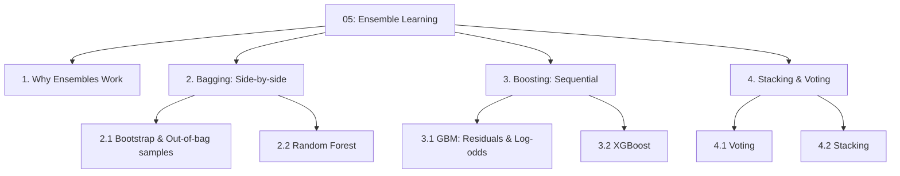
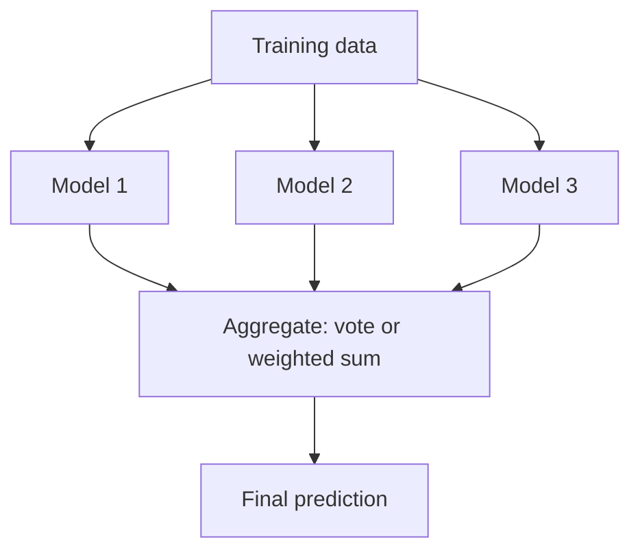
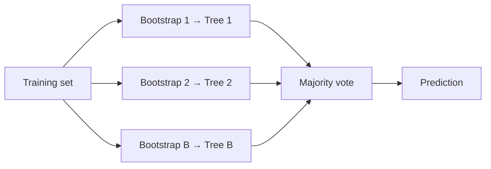
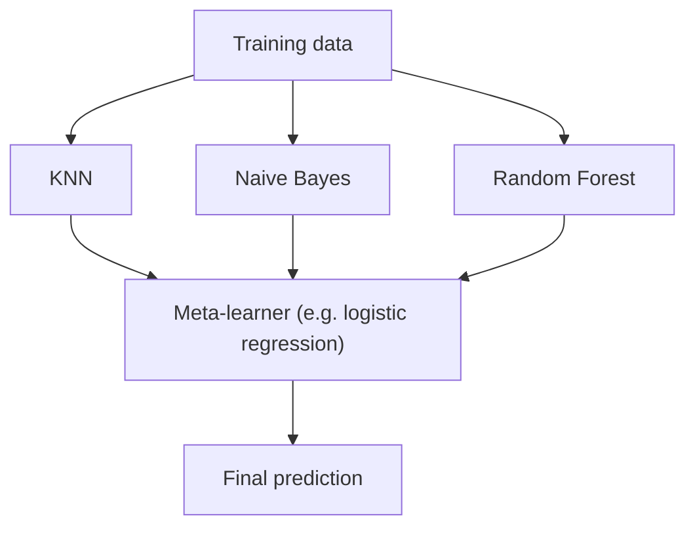

# 05 — Ensemble Learning

> Topic: Bagging, Random Forest, Boosting (GBM, XGBoost), Stacking and Voting
> Date: Aug 6, 2026

## Concept Hierarchy

**Ordering note:** *Why ensembles work* is placed first because bagging and boosting attack two different halves of the same bias–variance decomposition — without that framing they look like arbitrary alternatives. Bagging precedes boosting because it is the simpler, parallel idea, and because Random Forest's bootstrap machinery (2.1) is a prerequisite for understanding what boosting deliberately does *differently*. Stacking and voting come last as the generic combiners.

**Running example used throughout:** the **spam/ham mailbox** from [03](03-probability-and-information-theory.md) and [04](04-classification-algorithms.md), now with 10,000 emails so that resampling is meaningful. The base learner throughout is the decision tree from [04 §3](04-classification-algorithms.md).

---

## 1. Why Ensembles Work

**Meaning** — One model has one set of blind spots. Combine many models whose blind spots differ, and the mistakes cancel while the correct signal reinforces.

> **Formal definition:** Ensemble learning combines the predictions of multiple base learners into a single aggregated prediction that generalises better than any individual member, provided the members are individually better than random and make sufficiently uncorrelated errors.

**Why it matters — the two conditions** — An ensemble only helps if the base learners are (a) better than random guessing, and (b) **diverse** — their errors must not be correlated. Three identical trees vote identically and gain nothing; the entire design effort in bagging and boosting goes into manufacturing diversity.

**The bias–variance framing** (see [regression Session 5 §1](../../05-supervised-ml-regression/notes/05-model-optimization.md)):

| Family       | Base learners                            | Attacks                                        | Built                                  |
| ------------ | ---------------------------------------- | ---------------------------------------------- | -------------------------------------- |
| **Bagging**  | Low bias, high variance (deep trees)     | **Variance** — averaging cancels the noise     | In parallel, independently             |
| **Boosting** | High bias, low variance (shallow stumps) | **Bias** — each round fixes the residual error | Sequentially, each depends on the last |

**Worked intuition** — 5 independent models each 70% accurate, majority-voting on a binary problem: the ensemble is right whenever at least 3 are right, which works out to about 84% accuracy. The gain comes entirely from independence — if all 5 always agreed, the ensemble would stay at 70%.

**Exam focus** — The two conditions for an ensemble to help, and the bagging-reduces-variance / boosting-reduces-bias split, are the highest-yield facts in this note.

---

## 2. Bagging (Side-by-side)

> **Formal definition:** Bagging (bootstrap aggregating) trains each base learner on an independent bootstrap sample of the training set and combines them by majority vote (classification) or averaging (regression).

### 2.1 Bootstrap and Out-of-Bag Samples

**Meaning** — A bootstrap sample is a new training set of the same size, drawn from the original **with replacement** — so some rows appear several times and others not at all. Those left out are the *out-of-bag* rows and act as a free validation set.

> **Formal definition:** A bootstrap sample is a sample of size $n$ drawn uniformly at random with replacement from a dataset of size $n$. The observations excluded from a given bootstrap sample are its out-of-bag (OOB) observations.

**Formula** — Exam-important — probability that a specific row is excluded from one bootstrap sample:
$$P(\text{excluded}) = \left(1 - \frac{1}{n}\right)^{n} \xrightarrow[n \to \infty]{} e^{-1} \approx 0.368$$

**Interpretation** — Each bootstrap sample contains roughly **63.2%** of the distinct original rows (some duplicated), leaving about **36.8%** out-of-bag. Every tree therefore has its own private ~37% holdout, and averaging each row's predictions over only the trees that did *not* see it gives the **OOB error estimate** — an honest generalisation estimate with no separate validation split and no cross-validation cost.

**Worked example** — 10,000 emails, 500 trees. Each tree trains on 10,000 rows drawn with replacement (≈6,320 distinct emails) and is evaluated on the ≈3,680 emails it never saw.

**Important details** — Sampling *with* replacement is what makes the samples differ; sampling without replacement of the same size would just reproduce the original set every time.

### 2.2 Random Forest

**Meaning** — Bagging applied to decision trees, plus one extra trick: at every split, each tree may only consider a random subset of features. This forces the trees apart.

> **Formal definition:** A random forest is an ensemble of decision trees, each grown on a bootstrap sample of the training data and each split chosen from a random subset of $m$ of the $p$ available features, with predictions aggregated by majority vote.

**Steps**

1. Draw $B$ bootstrap samples (2.1).
2. Grow one **unpruned** tree per sample ([04 §3.2](04-classification-algorithms.md)).
3. At each split, sample $m$ features at random and choose the best split among only those.
4. Classify a new email by majority vote across all $B$ trees.

**Formula** — Exam-important — the usual default is $m = \sqrt{p}$ for classification (and $m = p/3$ for regression).

**Why the feature subsampling matters** — Without it, if one feature (`free`) is overwhelmingly predictive, *every* bootstrap tree picks it as the root and all the trees end up nearly identical — bootstrap diversity alone is not enough. Restricting each split to $m$ random features forces some trees to build on `meeting` or link count instead, decorrelating the ensemble. This is precisely what distinguishes a random forest from plain bagged trees.

**Key hyperparameters**

| Parameter                  | Meaning                    | Effect                                                                         |
| -------------------------- | -------------------------- | ------------------------------------------------------------------------------ |
| $B$ (`n_estimators`)       | Number of trees            | More is monotonically better until it plateaus; never overfits by adding trees |
| $m$ (`max_features`)       | Features per split         | Lower = more decorrelation, higher bias per tree                               |
| Tree depth / min leaf size | Individual tree complexity | Usually left unrestricted; the averaging handles the variance                  |

**Important details — feature importance** — Random forests report per-feature importance by totalling the impurity reduction that feature achieved across all trees (or by measuring accuracy loss when that feature's values are randomly permuted). This makes an otherwise opaque ensemble partially interpretable.

**Strengths** — Strong accuracy with almost no tuning, resistant to overfitting as $B$ grows, gives free OOB validation and feature importances, handles mixed feature types, trains in parallel.

**Limits** — Loses the single tree's readable rule structure, larger memory footprint, and slower prediction than one tree.

**Exam focus** — The 63.2% / 36.8% bootstrap split with its derivation, and the *two* independent sources of randomness (bootstrap rows **and** random features per split), are the standard questions.

---

## 3. Boosting (Sequential)

**Meaning** — Instead of many independent models voting, build models one after another where each new model concentrates on what the ensemble has got wrong so far.

> **Formal definition:** Boosting builds an additive model $F_M(x) = \sum_{m=1}^{M}\nu\, h_m(x)$ by sequentially fitting each weak learner $h_m$ to the errors of the current ensemble, thereby reducing bias.

|                  | Bagging               | Boosting                                  |
| ---------------- | --------------------- | ----------------------------------------- |
| Order            | Parallel, independent | Sequential, each depends on the last      |
| Data per model   | Bootstrap sample      | Full set, reweighted / residual-targeted  |
| Base learner     | Deep, low-bias trees  | Shallow stumps, high-bias                 |
| Reduces          | Variance              | Bias                                      |
| Combination      | Equal-weight vote     | Weighted sum                              |
| Overfitting risk | Low                   | **Higher** — too many rounds will overfit |

**AdaBoost (the original idea)** — Give every training row equal weight; after each round, increase the weight on misclassified rows so the next stump is forced to focus on them, and give each stump a say proportional to its accuracy.

### 3.1 Gradient Boosting Machines (Residuals & Log-Odds)

**Meaning** — Rather than reweighting rows, each new tree is trained to predict the *error* left over by the ensemble so far, and its output is added on.

> **Formal definition:** Gradient boosting fits each successive base learner to the negative gradient of the loss function evaluated at the current ensemble's predictions (the pseudo-residuals), performing gradient descent in function space.

**Steps (binary classification with log-loss)**

1. **Initialise with the log-odds** of the base rate — the classifier works in log-odds space, not probability space, so that added contributions stay unbounded and can always be mapped back into $[0,1]$:
$$F_0(x) = \log\frac{p}{1-p}$$
With 6,000 spam out of 10,000: $p = 0.6$ and $F_0 = \log(0.6/0.4) = \log 1.5 = 0.405$.
2. **Convert to probability** with the sigmoid: $p_i = \dfrac{1}{1+e^{-F(x_i)}}$.
3. **Compute pseudo-residuals** — for log-loss these are simply $r_i = y_i - p_i$ (actual minus predicted probability). A spam email ($y=1$) currently scored 0.6 has residual $+0.4$.
4. **Fit a shallow tree** to those residuals.
5. **Update** with a learning rate $\nu$: $F_{m}(x) = F_{m-1}(x) + \nu\, h_m(x)$.
6. Repeat for $M$ rounds.

**Where** — $\nu$: learning rate (shrinkage), typically 0.01–0.1; $M$: number of boosting rounds; $h_m$: the $m$-th tree.

**Interpretation** — Working in log-odds keeps every additive update valid: probabilities would need clipping at 0 and 1, whereas log-odds range over all reals and the sigmoid maps the total back to a probability at the end. This is the same logit transformation explained in [07 §4](07-gaps-to-look-up.md).

**Important details — the $\nu$/$M$ trade-off** — A smaller learning rate needs more rounds but generalises better ("shrinkage"). $\nu$ and $M$ must be tuned together, with early stopping on a validation set: unlike a random forest, adding boosting rounds *can and will* overfit.

**Key hyperparameters** — number of rounds $M$, learning rate $\nu$, tree depth (typically 3–8), and subsample fraction (stochastic gradient boosting, which borrows bagging's randomness).

### 3.2 XGBoost (Extreme Gradient Boosting)

**Meaning** — An engineered implementation of gradient boosting built for speed and for resistance to overfitting.

> **Formal definition:** XGBoost minimises a regularised objective $\mathcal{L} = \sum_{i} l(y_i, \hat{y}_i) + \sum_{m}\Omega(f_m)$ where $\Omega(f) = \gamma T + \tfrac{1}{2}\lambda\|w\|^2$, using a second-order Taylor expansion of the loss to choose splits.

**Where** — $T$: number of leaves in the tree; $w$: the leaf output values; $\gamma$: minimum gain required to add a leaf; $\lambda$: L2 penalty on leaf weights.

**What it adds over plain GBM**

| Feature                                                           | Benefit                                                                                                                               |
| ----------------------------------------------------------------- | ------------------------------------------------------------------------------------------------------------------------------------- |
| **Regularisation** ($\gamma$, $\lambda$, and an L1 term $\alpha$) | Complexity is penalised inside the objective itself, not only via depth limits — this is the "extra math" that prevents over-learning |
| **Second-order (Newton) approximation**                           | Uses gradient *and* Hessian, so split gains are more accurate than first-order GBM                                                    |
| **Sparsity-aware split finding**                                  | Learns a default direction for missing values instead of requiring imputation                                                         |
| **Approximate/histogram split finding**                           | Buckets continuous features instead of scanning every midpoint from [04 §3.3](04-classification-algorithms.md)                        |
| **Parallel & cache-aware implementation**                         | Feature-wise parallelism within each sequential round; column blocks stored pre-sorted                                                |
| **Built-in cross-validation and early stopping**                  | Stops adding rounds when validation loss stops improving                                                                              |

**Important details** — The sequential *dependency* between rounds cannot be parallelised; what XGBoost parallelises is the split search **within** each round. LightGBM and CatBoost are later variants of the same family (leaf-wise growth and native categorical handling respectively).

**Exam focus** — Name the two regularisation terms in $\Omega(f)$ and what each penalises ($\gamma$ per leaf, $\lambda$ on leaf weights), and state clearly that the boosting rounds themselves remain sequential.

---

## 4. Stacking & Voting (Combining Experts)

### 4.1 Voting

> **Formal definition:** A voting classifier combines predictions from several *different* algorithms — hard voting takes the majority predicted class; soft voting averages the predicted class probabilities and takes the argmax.

**Worked example** — KNN says spam, Naive Bayes says ham, a decision tree says spam.

- **Hard voting** — 2 spam vs 1 ham → **spam**.
- **Soft voting** — probabilities 0.55, 0.30, 0.80 → mean 0.55 → **spam** (above 0.5).

**Important details** — Soft voting usually outperforms hard voting because it uses confidence rather than just the verdict — but only when the members' probabilities are *calibrated*. Naive Bayes' notoriously over-confident scores ([04 §2.1](04-classification-algorithms.md)) can distort a soft vote badly.

### 4.2 Stacking

> **Formal definition:** Stacking (stacked generalisation) trains a meta-learner on the out-of-fold predictions of several heterogeneous base learners, so that the meta-learner learns how much to trust each base learner rather than weighting them equally.

**Steps**

1. Split the training data into $k$ folds.
2. Train each base learner on $k-1$ folds and predict the held-out fold; repeat so every row has an **out-of-fold** prediction from each base learner.
3. Build a new dataset whose features are those out-of-fold predictions and whose label is the original label.
4. Train the meta-learner (typically a simple model, e.g. logistic regression) on it.
5. At prediction time, run all base learners, feed their outputs to the meta-learner.

**Important details** — Step 2 is the entire point. Using *in-sample* base predictions leaks information: an overfitted base learner looks perfect on its own training rows, so the meta-learner learns to trust it completely and the stack collapses. Out-of-fold predictions are the standard defence.

| Method   | Members                        | How combined                   | Learned?                        |
| -------- | ------------------------------ | ------------------------------ | ------------------------------- |
| Voting   | Different algorithms           | Majority / probability average | No — fixed rule                 |
| Bagging  | Same algorithm, different data | Majority vote                  | No — equal weights              |
| Boosting | Same algorithm, sequential     | Weighted sum                   | Weights learned during training |
| Stacking | Different algorithms           | A trained meta-model           | Yes — a second-level model      |

**Exam focus** — Distinguish all four combination strategies in one table, and explain why out-of-fold predictions are mandatory for stacking.

---

## Quick Revision

- **Key formulas:** OOB fraction $(1-1/n)^n \to e^{-1} \approx 0.368$; random forest $m = \sqrt{p}$; GBM init $F_0 = \log\frac{p}{1-p}$, residual $r_i = y_i - p_i$, update $F_m = F_{m-1} + \nu h_m$; XGBoost penalty $\Omega(f) = \gamma T + \frac12\lambda\|w\|^2$.
- **Most important comparison:** bagging (parallel, deep trees, cuts variance) vs boosting (sequential, shallow trees, cuts bias).
- **Two sources of randomness in a random forest:** bootstrap rows and random feature subsets per split.
- **5 exam keywords:** bootstrap, out-of-bag, pseudo-residual, shrinkage/learning rate, out-of-fold prediction.
- **6 common mistakes:** believing more boosting rounds can never overfit (they can — only random forest trees are safe to add); calling a random forest "just bagged trees" and omitting the feature subsampling; quoting the OOB fraction as 50%; describing GBM as reweighting rows (that is AdaBoost — GBM fits residuals); stacking on in-sample instead of out-of-fold predictions; claiming XGBoost parallelises the boosting rounds themselves.

## Topic Coverage

- Ensemble Learning — Covered in Section 1
- Bagging — Covered in Section 2
- Bootstrap & Out-of-bag samples — Covered in Section 2.1
- Random Forest — Covered in Section 2.2
- Boosting — Covered in Section 3
- GBM (Residuals & Log-Odds) — Covered in Section 3.1
- XGBoost — Covered in Section 3.2
- Stacking & Voting — Covered in Section 4

Next: [06 — Model Evaluation](06-model-evaluation.md) · Back to [module map](00-study-checklist.md).
