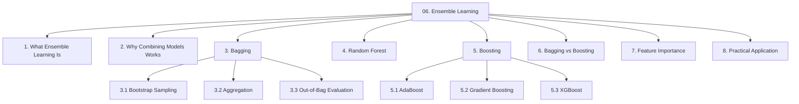
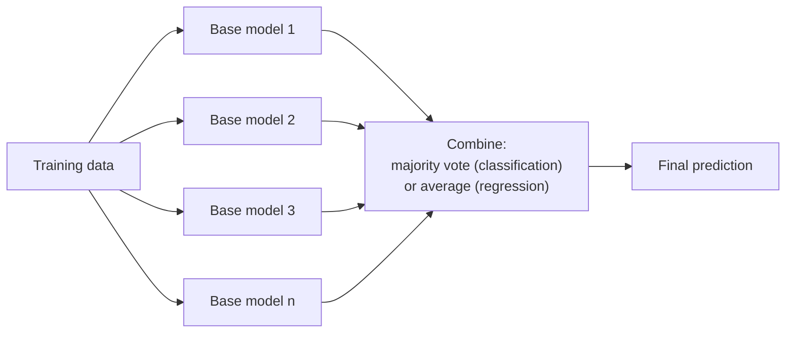
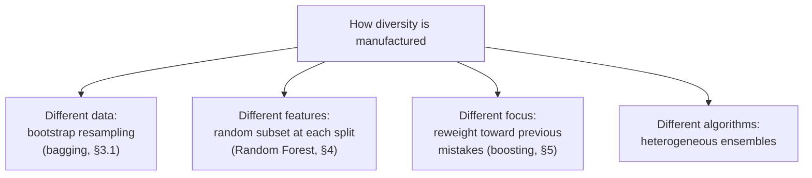
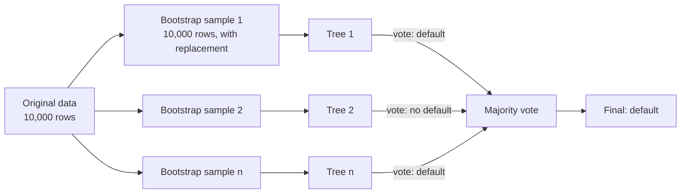
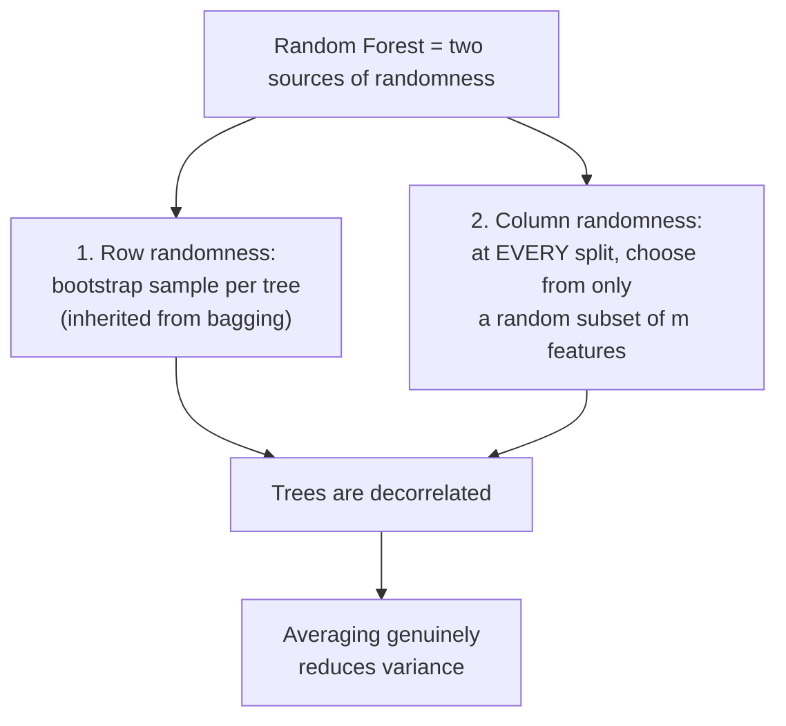
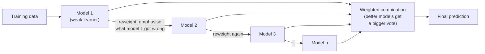
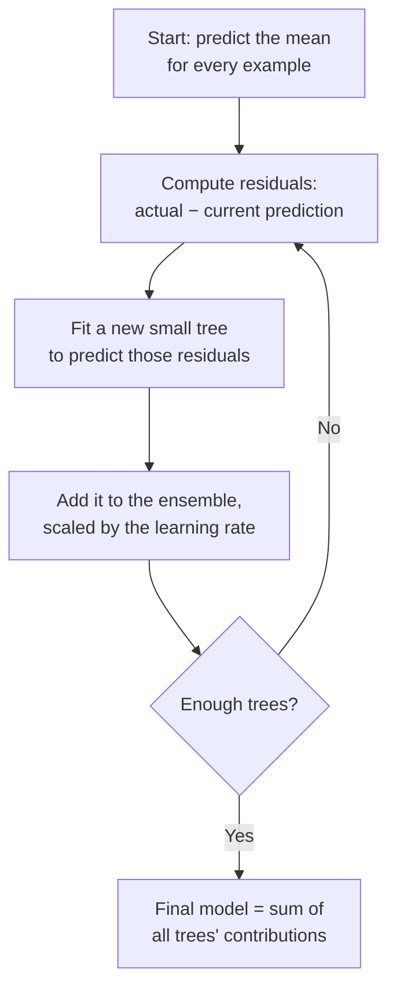
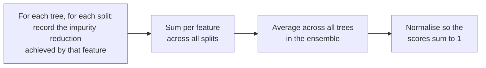

# Chapter 06 — Ensemble Learning

> Source: `unit-4_ensemble_learning.txt`
> Read after: [Chapter 05](05-decision-trees-and-id3.md) — decision trees are the base learner throughout

## Concept Hierarchy

**Ordering note:** the source lists the models (Random Forest, AdaBoost, Gradient Boosting, XGBoost) alongside the techniques (bagging, boosting). Here each model is nested under the technique it implements, so the family relationship is visible: Random Forest *is* bagging applied to trees; AdaBoost, GBM and XGBoost are three generations of boosting.

**Running example:** the same bank problem — classify applicants as default / no-default. The source's own suggested datasets, **Bank Marketing** and **Telco Churn**, are structurally identical to this (tabular, mixed feature types, binary imbalanced target), so §8 uses them directly.

---

## 1. What Ensemble Learning Is

**Picture this** — a village fair, an ox standing in a pen, and a sign inviting you to guess its weight. Eight hundred people write a number on a slip. Almost every slip is wrong: the butcher guesses far too high, the schoolteacher far too low, a child writes a number no ox has ever weighed. Then someone tips out the box and averages all eight hundred, and the result lands within a few pounds of the truth. Not one person in that field knew the weight of the ox. The field knew it.

**Mapping**:

| Analogy element                              | What it really is                                     |
| -------------------------------------------- | ----------------------------------------------------- |
| One person's slip of paper                   | one base model's prediction                           |
| The butcher high and the schoolteacher low   | errors pointing in different directions               |
| Tipping out the box and averaging            | the aggregation step — vote or mean                   |
| The average landing near the truth           | independent errors cancelling out                     |
| The whole field of eight hundred guessers    | the ensemble                                          |
| One wild slip not moving the answer          | robustness to a single bad base model                 |
| Everyone simply copying the butcher's number | correlated models — the ensemble gains nothing at all |

**Meaning** — a single decision tree is fast and readable but unstable and greedy ([05 §5](05-decision-trees-and-id3.md#5-hypothesis-space-search-in-id3)). Ensemble learning refuses to fix the individual model and instead builds **many** of them, then combines their predictions into one answer that is more accurate and more stable than any single member.

> **Formal definition:** Ensemble learning is a machine learning paradigm in which multiple base models are trained and their predictions are combined — typically by voting, averaging, or weighted combination — to produce a final prediction with lower generalisation error than any individual base model.

**Terminology to fix now:**

| Term                            | Meaning                                                                                                  |
| ------------------------------- | -------------------------------------------------------------------------------------------------------- |
| **Base learner** / weak learner | One individual model inside the ensemble — almost always a decision tree in this chapter                 |
| **Weak learner**                | A model only slightly better than random guessing (accuracy just above 50% on a balanced binary problem) |
| **Strong learner**              | A model with high accuracy — what the ensemble aims to produce                                           |
| **Homogeneous ensemble**        | All base learners are the same type (e.g. all trees) — bagging and boosting are both homogeneous         |
| **Heterogeneous ensemble**      | Mixed model types combined (e.g. a tree, a KNN and a logistic regression)                                |
| **Decision stump**              | A decision tree of depth 1 — a single test. The canonical weak learner for AdaBoost                      |

The two techniques covered by the source differ only in **how** the base models are built and combined:

> **Formal definition:** Bagging (bootstrap aggregating) trains base learners independently and in parallel on different random resamples of the training data and combines them by equal-weight voting or averaging. Boosting trains base learners sequentially, each one focusing on the examples that its predecessors classified incorrectly, and combines them by weighted voting.

**Core takeaway** — an ensemble is a vote, so it beats its members only when they are right more often than not *and* wrong in different ways; remove either condition and it is worth no more than one member.

---

## 2. Why Combining Models Works

Combining models is not automatically beneficial — a field where everyone copied the butcher's number returns the butcher's answer, and 100 identical trees vote identically and give exactly the accuracy of one tree. Two conditions must hold.

**Condition 1 — each base model must be better than random.** If each model is right 60% of the time and their errors are independent, a majority vote of 100 such models is right over 97% of the time, because they would all have to be wrong simultaneously for the vote to fail. If each model were right only 40% of the time, the same vote would drive accuracy *down*.

**Condition 2 — the models must be diverse**, i.e. they must make *different* mistakes. Errors that are independent cancel out in the vote; errors that are correlated simply accumulate.

**The bias–variance reading** — this is the single most examinable idea in the chapter:

> **Formal definition:** Bias is the error arising from a model's simplifying assumptions, causing it to systematically miss the true relationship (underfitting); variance is the error arising from a model's sensitivity to the particular training sample used, causing its predictions to change substantially with small changes in the data (overfitting).

|              | Base learners used                              | What it reduces | Because                                                                                               |
| ------------ | ----------------------------------------------- | --------------- | ----------------------------------------------------------------------------------------------------- |
| **Bagging**  | Deep, fully grown, low-bias/high-variance trees | **Variance**    | Averaging many noisy-but-unbiased estimates cancels the noise while preserving the signal             |
| **Boosting** | Shallow, high-bias/low-variance trees (stumps)  | **Bias**        | Each new learner is added specifically to correct the residual error the current ensemble still makes |

**Core takeaway** — diversity and not quantity is what an ensemble converts into accuracy, which is why every method in this chapter is really a different trick for manufacturing disagreement.

---

## 3. Bagging (Bootstrap Aggregating)

**Picture this** — rather than sending one surveyor round the whole town, you send out twenty, and hand each a different randomly drawn list of houses to visit. Some households appear three times on one surveyor's list and never at all on another's. Every surveyor comes back with a slightly different picture of the town — none of them dishonest, all of them shaped by the accident of whose door they happened to knock on. Lay the twenty reports side by side and average them, and that accident washes out.

**Mapping**:

| Analogy element                                  | What it really is                              |
| ------------------------------------------------ | ---------------------------------------------- |
| The town's full register of households           | the original training set                      |
| One surveyor's randomly drawn list               | one bootstrap sample                           |
| A household appearing three times on a list      | sampling with replacement                      |
| Households missing from one surveyor's list      | that model's out-of-bag examples               |
| Twenty surveyors walking at the same time        | base models trained independently, in parallel |
| Each report shaped by whose door they knocked on | variance contributed by the particular sample  |
| Averaging the twenty reports                     | aggregation by majority vote or mean           |

**Meaning** — bagging manufactures diversity by giving each base model a different random view of the same data, then cancels out the resulting disagreement by averaging.

> **Formal definition:** Bagging is an ensemble method that generates multiple training subsets by bootstrap sampling from the original dataset, trains one independent base model on each subset in parallel, and aggregates their outputs by majority voting for classification or averaging for regression.

The name is the method: **B**ootstrap **agg**regat**ing** — the two steps are §3.1 and §3.2.

### 3.1 Bootstrap Sampling

> **Formal definition:** Bootstrap sampling is the process of drawing a sample of size $n$ from a dataset of size $n$ **with replacement**, so that some observations appear multiple times in the sample and others do not appear at all.

**Example** — from 10 applicants numbered 1–10, one bootstrap sample might be `[3, 7, 3, 1, 9, 9, 2, 5, 3, 8]`. Applicant 3 appears three times; applicants 4, 6 and 10 are absent. Each sample is the same *size* as the original but has a different *composition* — and that difference is what makes the trees differ.

**Formula (Expected out-of-bag proportion)** — Additional depth
$$P(\text{an example is omitted}) = \left(1 - \frac{1}{n}\right)^{n} \xrightarrow[n \to \infty]{} e^{-1} \approx 0.368$$

**Where** — $n$: the number of examples in the dataset (and the size of each bootstrap sample); $1/n$: the probability of drawing one specific example on a single draw; $(1-1/n)$: the probability of *not* drawing it on one draw; raising to the power $n$ gives the probability of missing it across all $n$ draws; $e$: Euler's number.

**Interpretation** — each bootstrap sample contains roughly **63.2%** of the unique original examples, and about **36.8%** are left out. Those left-out rows are called **out-of-bag** and are useful (§3.3).

### 3.2 Aggregation

| Task           | Aggregation rule                                                                                                                                             |
| -------------- | ------------------------------------------------------------------------------------------------------------------------------------------------------------ |
| Classification | **Majority vote** — the class predicted by the most trees. (Soft voting averages the predicted probabilities instead, and usually performs slightly better.) |
| Regression     | **Mean** of the trees' numeric predictions                                                                                                                   |

Every model gets an **equal vote** in bagging. This is the sharpest structural contrast with boosting, where votes are weighted (§5.1).

### 3.3 Out-of-Bag (OOB) Evaluation

Since each tree never saw about 36.8% of the data, those rows act as a free validation set for that tree.

> **Formal definition:** The out-of-bag error is an estimate of an ensemble's generalisation error, computed by predicting each training example using only the base models that did not include that example in their bootstrap sample, and comparing those predictions with the true labels.

**Why it matters** — OOB error approximates cross-validation accuracy at no extra cost and without giving up any data to a hold-out set. It is one of the practical reasons bagged ensembles are convenient on small datasets.

**Core takeaway** — bagging works by averaging away the part of each model that came only from the accident of which rows it happened to be shown.

---

## 4. Random Forest

**Picture this** — the twenty surveyors come back and their reports are nearly identical, which is useless. Reading them you see why: every single surveyor opened with the same obvious question at every doorstep — how big is the house? So you impose a rule. At each door, a surveyor may choose only from a small random handful of the questions on the form. The obvious question is simply unavailable most of the time, and they are forced to find out what the other questions can tell them.

**Mapping**:

| Analogy element                              | What it really is                                 |
| -------------------------------------------- | ------------------------------------------------- |
| Twenty near-identical reports                | highly correlated trees — diversity has collapsed |
| The obvious question everyone opened with    | a dominant feature chosen at every root           |
| The rule limiting choices at each doorstep   | random feature subsetting at every split          |
| The small handful of questions offered       | the $m$ features drawn per split                  |
| Surveyors pushed onto the other questions    | decorrelated trees                                |
| Reports that finally differ from one another | genuine diversity, so averaging actually pays     |

**Meaning** — bagging alone leaves a subtle problem: if one feature is overwhelmingly predictive, *every* bootstrap tree will choose it at the root, and the trees end up highly correlated — which violates the diversity condition of §2. Random Forest injects a second source of randomness to break that correlation.

> **Formal definition:** Random Forest is an ensemble method that constructs a large number of decision trees using bootstrap-sampled training subsets and, at each split, considers only a randomly selected subset of the available features; predictions are made by majority vote for classification or averaging for regression.

**Formula (Features considered per split)** — Exam-important
$$m = \sqrt{n} \ \text{ (classification)} \qquad\qquad m = \frac{n}{3} \ \text{ (regression)}$$

**Where** — $m$: the number of features randomly offered at each individual split; $n$: the total number of features available. These are the conventional defaults, not derived rules.

**Example** — the bank has $n = 36$ features after encoding. Each split in each tree picks the best attribute from a fresh random draw of $m = 6$ features. The dominant feature `credit_score` is therefore unavailable at roughly five out of six splits, forcing the trees to discover alternative structure.

**Steps:**

1. Draw a bootstrap sample of the training data.
2. Grow a decision tree on it, **but** at every node select the best split from a random subset of $m$ features rather than all $n$.
3. Grow the tree deep, usually **without pruning** — variance is handled by averaging, not by pruning.
4. Repeat for $B$ trees (typically 100–500).
5. Predict by majority vote (classification) or mean (regression).

**Important details:**

- **More trees never overfit.** Adding trees to a Random Forest cannot increase overfitting; it only stabilises the estimate, with diminishing returns after a few hundred. This surprises people and is a good exam point.
- **Readability is lost.** The individual trees remain readable, but 500 of them voting is not. This is the price paid for accuracy — mitigated partly by feature importance (§7).
- **No scaling required**, inherited from decision trees ([04 §6.2](04-knn.md#62-feature-scaling)).
- **Parallelisable** — trees are independent, so training scales across cores.

**Core takeaway** — bagging alone cannot decorrelate trees while one feature dominates, so hiding features at every split is what actually manufactures the diversity that averaging needs to pay off.

---

## 5. Boosting

**Picture this** — a tutor who refuses to re-teach anything you already know. After each test she looks only at what you got wrong, and builds the entire next lesson around those questions. The one you keep failing takes more of her time every round, until it stops being the thing you fail. And she cannot plan the third lesson before the second one has been sat and marked — the whole arrangement runs as a chain, one link at a time.

**Mapping**:

| Analogy element                                           | What it really is                                        |
| --------------------------------------------------------- | -------------------------------------------------------- |
| Each lesson she teaches                                   | one base learner                                         |
| Marking the test before planning the next lesson          | training model $t$ on the errors of models $1 \dots t-1$ |
| The questions you got wrong                               | misclassified (or high-residual) examples                |
| Giving those questions more time each round               | increasing those examples' weights                       |
| Being unable to start lesson 3 before lesson 2 is marked  | the sequential, non-parallelisable structure             |
| Trusting a tutor who taught well more than one who didn't | the learner weight $\alpha_t$                            |
| A question that was mis-printed in the book               | a permanently mislabelled example — chased forever       |

**Meaning** — bagging builds its models in ignorance of one another. Boosting does the opposite: it builds them in a chain, and each new model is told exactly where the current ensemble is failing.

> **Formal definition:** Boosting is an ensemble method that trains base learners sequentially, where each successive learner is trained to correct the errors of the combined ensemble built so far, and the final prediction is a weighted combination of all learners' outputs.

Boosting cannot be parallelised — model $t$ requires the completed output of model $t-1$. That sequential dependency is the direct cost of its higher accuracy.

**Core takeaway** — boosting improves by aiming each new model squarely at the error that remains, which is also precisely why it will chase a permanently mislabelled record into the ground.

### 5.1 AdaBoost (Adaptive Boosting)

The original and most examinable boosting algorithm, and the tutor at her most literal: she goes through the paper with a highlighter, marks every question you got wrong, and highlights the repeat offenders more heavily each round. Its mechanism is **example reweighting** — misclassified rows get heavier, so the next learner is forced to pay attention to them.

> **Formal definition:** AdaBoost is a boosting algorithm that maintains a weight distribution over the training examples, increasing the weights of misclassified examples after each round so that subsequent weak learners focus on them, and combines the weak learners in a weighted majority vote in which each learner's weight is a function of its accuracy.

**Steps:**

1. **Initialise** all $m$ example weights equally: $w_i = 1/m$.
2. For each round $t = 1 \dots T$:
   a. Train a weak learner (usually a decision stump) on the weighted data.
   b. Compute its weighted error $\varepsilon_t$.
   c. Compute the learner's own vote weight $\alpha_t$.
   d. **Increase** the weights of the examples it got wrong, **decrease** the weights of those it got right, then renormalise so the weights sum to 1.
3. **Final prediction** = weighted majority vote of all $T$ learners, using the $\alpha_t$ as vote strengths.

**Formula (Weighted error of learner $t$)** — Exam-important
$$\varepsilon_t = \sum_{i:\ h_t(x^{(i)}) \neq y^{(i)}} w_i$$

**Where** — $\varepsilon_t$: the weighted error rate of learner $t$, between 0 and 1; $w_i$: the current weight of training example $i$; $h_t(x^{(i)})$: learner $t$'s prediction for example $i$; $y^{(i)}$: the true label; the sum runs only over the examples the learner got wrong.

**Formula (Learner weight $\alpha_t$)** — Exam-important
$$\alpha_t = \frac{1}{2}\ln\!\left(\frac{1-\varepsilon_t}{\varepsilon_t}\right)$$

**Where** — $\alpha_t$: the weight (voting power) given to learner $t$ in the final combination; $\varepsilon_t$: its weighted error from the previous formula; $\ln$: the natural logarithm.

**Formula (Example weight update)** — Exam-important
$$w_i \leftarrow \frac{w_i \cdot \exp\!\left(-\alpha_t\, y^{(i)}\, h_t(x^{(i)})\right)}{Z_t}$$

**Where** — $w_i$: the weight of example $i$; $\alpha_t$: the learner weight above; $y^{(i)} \in \{-1, +1\}$: the true label in $\pm1$ encoding; $h_t(x^{(i)}) \in \{-1,+1\}$: the learner's prediction; $Z_t$: a normalisation constant chosen so all weights sum to 1. The product $y^{(i)}h_t(x^{(i)})$ equals $+1$ on a correct prediction (so the exponent is negative and the weight shrinks) and $-1$ on a mistake (exponent positive, weight grows).

**Worked example** — 10 examples, so each starts at $w_i = 0.1$. Round 1's stump misclassifies 3 of them, giving $\varepsilon_1 = 0.3$:

$$\alpha_1 = \frac{1}{2}\ln\!\left(\frac{1-0.3}{0.3}\right) = \frac{1}{2}\ln(2.333) = \frac{1}{2}(0.847) = 0.424$$

**Interpretation** — $\alpha_1 = 0.424$ is a moderate vote. Read the behaviour of $\alpha$ at the extremes:

| $\varepsilon_t$            | $\alpha_t$ | Meaning                                                       |
| -------------------------- | ---------- | ------------------------------------------------------------- |
| $0.01$ (near-perfect)      | $2.30$     | Very large vote                                               |
| $0.30$                     | $0.42$     | Moderate vote                                                 |
| $0.50$ (random guessing)   | $0.00$     | **Zero vote** — a coin-flip learner is ignored entirely       |
| $0.70$ (worse than random) | $-0.42$    | **Negative vote** — its prediction is inverted and still used |

The three misclassified examples then gain weight while the other seven lose it, so round 2's stump is built on data where those three dominate.

**Important details** — AdaBoost is sensitive to noisy data and outliers, precisely *because* it chases mistakes: a permanently mislabelled record keeps getting reweighted upward round after round, and eventually distorts the whole ensemble. This is the mirror image of bagging, where a bad row is diluted across resamples.

### 5.2 Gradient Boosting

The same tutor, teaching differently: instead of highlighting which questions to redo, she works out exactly how many marks you are still short on each one and teaches only that gap. Gradient boosting replaces AdaBoost's reweighting with a cleaner idea — each new tree is trained to predict the **residual errors** that the current ensemble still leaves behind.

> **Formal definition:** Gradient boosting is a boosting technique that builds an additive model in a forward stage-wise manner, fitting each successive base learner to the negative gradient of the loss function with respect to the current ensemble's predictions — for squared-error loss, this is equivalent to fitting each new learner to the residuals of the current model.

**Formula (Additive update)** — Exam-important
$$F_t(x) = F_{t-1}(x) + \nu\, h_t(x)$$

**Where** — $F_t(x)$: the ensemble's prediction after $t$ rounds; $F_{t-1}(x)$: the prediction before this round; $h_t(x)$: the new tree, fitted to the residuals of $F_{t-1}$; $\nu$: the **learning rate** (also called shrinkage), typically $0.01$–$0.1$, which scales down each tree's contribution.

**Worked example** — true credit score 720. Initial prediction (the mean) is 650, so the residual is $+70$. Tree 1 predicts a residual of 60; with $\nu = 0.1$ the ensemble moves to $650 + 0.1(60) = 656$. The new residual is 64, tree 2 attacks that, and so on. Progress is deliberately slow because small steps generalise better than large ones.

**Important details:**

- **Learning rate and number of trees trade off.** A smaller $\nu$ needs more trees; the combination is tuned together on the validation set.
- **Unlike Random Forest, gradient boosting CAN overfit** if given too many trees — each one keeps fitting finer residuals, eventually fitting noise. Early stopping on validation error is standard.
- **Base learners are deliberately shallow** (depth 3–8), because boosting reduces bias and needs high-bias, low-variance members (§2).

### 5.3 XGBoost

> **Formal definition:** XGBoost (Extreme Gradient Boosting) is an optimised, regularised implementation of gradient boosting that adds explicit penalty terms on model complexity to the objective function and incorporates systems-level optimisations such as parallelised split finding, sparsity-aware handling of missing values and cache-efficient data structures.

XGBoost is not a new *idea* — it is §5.2 engineered properly:

| Addition over plain gradient boosting                          | Effect                                                                                                                                                               |
| -------------------------------------------------------------- | -------------------------------------------------------------------------------------------------------------------------------------------------------------------- |
| **Regularisation** ($L_1$ and $L_2$ penalties on leaf weights) | Directly penalises complexity, so it overfits less than plain GBM                                                                                                    |
| **Parallelised split finding**                                 | Individual trees are still sequential, but the search for the best split *within* a tree is parallelised — the main speed win                                        |
| **Built-in handling of missing values**                        | Learns a default branch direction for missing entries, so no imputation step is needed ([05 §10](05-decision-trees-and-id3.md#10-handling-missing-attribute-values)) |
| **Tree pruning by max depth with backward pruning**            | Grows to a depth limit, then prunes back splits with negative gain                                                                                                   |
| **Built-in cross-validation and early stopping**               | Fewer external tuning loops                                                                                                                                          |

**Why it matters** — XGBoost (and its relatives LightGBM and CatBoost) is the default winner on tabular data of exactly the bank's type, and dominates competition leaderboards for structured problems. Neural networks generally do not beat it on tabular data.

---

## 6. Bagging vs Boosting

Both have now been explained individually; this table only contrasts them.

|                                   | Bagging (§3, §4)                        | Boosting (§5)                                                                |
| --------------------------------- | --------------------------------------- | ---------------------------------------------------------------------------- |
| **Model construction**            | Parallel and independent                | Sequential and dependent                                                     |
| **Training data per model**       | A bootstrap resample of the full data   | The full data, with weights (AdaBoost) or residuals (GBM) updated each round |
| **Base learner**                  | Deep, fully grown trees                 | Shallow trees / stumps                                                       |
| **What it fixes**                 | High **variance**                       | High **bias**                                                                |
| **Model votes**                   | Equal weight                            | Weighted by accuracy ($\alpha_t$) or shrunk by $\nu$                         |
| **Overfitting risk**              | Low — adding trees is safe              | Higher — too many rounds overfits                                            |
| **Sensitivity to noise/outliers** | Low — noise is diluted across resamples | High — noise is actively chased                                              |
| **Parallelisable**                | Yes                                     | No (across rounds)                                                           |
| **Typical accuracy**              | Good and very stable                    | Usually higher, needs more tuning                                            |
| **Representative model**          | Random Forest                           | AdaBoost, Gradient Boosting, XGBoost                                         |

The central difference in one sentence: **bagging averages away the randomness of independent models, while boosting incrementally corrects the errors of a chain of dependent models.**

**How to choose** — start with a Random Forest: it is nearly parameter-free, hard to break, and gives an honest baseline plus feature importances. Move to gradient boosting or XGBoost when you need the last few points of accuracy and can afford the tuning. Prefer bagging when the data is known to be noisy, since boosting will chase that noise.

---

## 7. Feature Importance

**Picture this** — the panel has delivered its verdict and gone home, so you sit down with the transcripts and count, question by question, how much each one actually narrowed things down. Some questions were asked at almost every turn and settled the matter each time. Others were asked once and changed nobody's mind. The tally tells you honestly what the panel leaned on — but it does not tell you what caused the outcome, and where two questions were near-duplicates, whichever happened to be asked first takes the credit for both.

**Mapping**:

| Analogy element                                      | What it really is                                   |
| ---------------------------------------------------- | --------------------------------------------------- |
| The transcripts                                      | every split in every tree of the ensemble           |
| How much a question narrowed things down             | the impurity reduction achieved at that split       |
| Tallying question by question                        | summing per feature, then averaging across trees    |
| Questions asked constantly that settled everything   | high-importance features                            |
| Two questions that were near-duplicates              | strongly correlated features                        |
| Each of them looking half as useful as it was        | importance credit split between correlated features |
| The tally not explaining *why* the verdict was right | importance is not causation                         |

**Meaning** — an ensemble sacrifices the readability of a single tree ([05 §1.2](05-decision-trees-and-id3.md#12-how-a-tree-makes-a-prediction)). Feature importance buys some of it back by ranking the inputs by how much work each one actually did.

> **Formal definition:** Feature importance is a score assigned to each input variable that quantifies its contribution to a model's predictions; in tree-based ensembles it is commonly computed as the total reduction in impurity (e.g. entropy or Gini) attributable to splits on that variable, summed over all nodes and averaged across all trees.

**Example output** for the bank model:

| Feature              | Importance |
| -------------------- | ---------- |
| credit_score         | 0.34       |
| loan_to_income_ratio | 0.27       |
| age                  | 0.14       |
| employment_type      | 0.11       |
| city                 | 0.09       |
| gender               | 0.05       |

**Uses:** feature selection (drop the bottom of the list and retrain), sanity checking (if `customer_id` ranks top, you have a data leak), stakeholder communication, and domain validation.

**Important limitations — state these to get full marks:**

- **Correlated features split the credit.** If `income` and `loan_to_income_ratio` are strongly related, the ensemble uses them interchangeably and each ends up with roughly half the importance it deserves — making both look weaker than either really is.
- **Impurity-based importance is biased toward high-cardinality features**, for exactly the same reason information gain is ([05 §3](05-decision-trees-and-id3.md#3-information-gain)). A continuous feature offers more candidate splits than a binary one and accumulates more apparent importance.
- **Importance is not causation.** A high score means the model relied on the feature, not that changing it would change reality.
- **Permutation importance** is a more reliable alternative: shuffle one feature's values and measure how much validation accuracy drops.

**Core takeaway** — feature importance records what the model leaned on rather than what drives the outcome, so correlated inputs quietly split the credit and both end up looking weaker than either really is.

---

## 8. Practical Application

The source suggests applying these methods to a **Bank Marketing** dataset (predict whether a customer subscribes to a term deposit) or a **Telco Churn** dataset (predict whether a customer leaves). Both map directly onto the running example, and the pipeline is the same:

| Step            | What happens                                                                     | Reference                                                             |
| --------------- | -------------------------------------------------------------------------------- | --------------------------------------------------------------------- |
| Problem framing | Binary classification with an imbalanced target (few subscribers / few churners) | [01 §3.1](01-ml-foundations.md#31-supervised-learning)                |
| Data split      | Train / validation / test                                                        | [01 §5](01-ml-foundations.md#5-training-validation-and-test-data)     |
| Preprocessing   | Encode categorical fields; **no scaling needed** for tree ensembles              | [04 §6](04-knn.md#6-feature-preparation)                              |
| Baseline        | A single decision tree, to have something to beat                                | [05 §4](05-decision-trees-and-id3.md#4-the-id3-algorithm)             |
| Bagged model    | Random Forest, ~300 trees, OOB error as a quick check                            | §3, §4                                                                |
| Boosted model   | XGBoost, tuned $\nu$ and tree count with early stopping                          | §5.3                                                                  |
| Evaluation      | **Not accuracy** — the classes are imbalanced. Use precision, recall, F1 and AUC | [07 §1](07-performance-metrics.md#1-why-accuracy-alone-is-not-enough) |
| Interpretation  | Feature importance to explain the model to the business                          | §7                                                                    |

The source does not supply the actual data or code for these datasets; that is recorded in [08 §5 — Gaps to Look Up](08-exam-preparation.md#5-gaps-to-look-up).

**Connection** — every chapter so far has produced predictions. None has said how to judge them honestly. Chapter 07 supplies that missing half, and its imbalanced-class warning applies with full force to the datasets named above.

---

**Previous:** [Chapter 05](05-decision-trees-and-id3.md) · **Next:** [Chapter 06b — Ensemble Methods Deep Dive](06b-ensemble-methods-deep-dive.md) (AdaBoost, Gradient Boosting for classification, Random Forest internals) · Then [Chapter 07 — Performance Metrics](07-performance-metrics.md) · Back to [module map](00-study-checklist.md)
