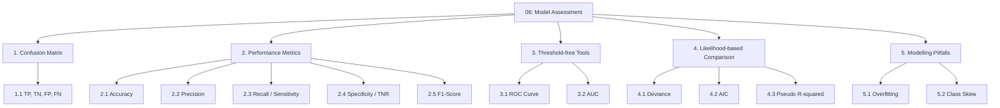
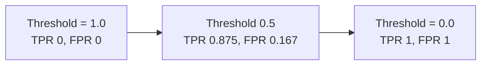

# 06 — Model Assessment & Evaluation

> Topic: Confusion matrix, performance metrics, comparative tools, and modelling pitfalls
> Date: Aug 6, 2026

## Concept Hierarchy

**Ordering note:** The confusion matrix comes first because every metric in Part 2 is a ratio of its four cells — none of them can be defined before it. Part 3 (ROC/AUC) follows Part 2 because a ROC curve is literally a sweep of Part-2 metrics across every possible threshold. Part 4 groups the likelihood-based tools (deviance, AIC, pseudo-$R^2$) that compare *models* rather than score predictions. Pitfalls close the note because they are the reasons the earlier metrics can mislead.

**Running example used throughout:** the **spam filter** from [04](04-classification-algorithms.md), evaluated on a test set of **100 emails, of which 40 are truly spam**. The model's results: it correctly flags 35 spam, misses 5, and wrongly flags 10 real emails. Throughout, **spam = positive class**.

---

## 1. Confusion Matrix

**Meaning** — A 2×2 scorecard cross-tabulating what the model said against what was actually true. Accuracy alone hides which *kind* of mistake was made; the matrix does not.

> **Formal definition:** A confusion matrix is a contingency table in which rows represent actual classes and columns represent predicted classes, so that cell $(i,j)$ counts observations of true class $i$ predicted as class $j$.

### 1.1 The Four Cells

|                             | **Predicted: Spam (positive)** | **Predicted: Ham (negative)**      |
| --------------------------- | ------------------------------ | ---------------------------------- |
| **Actual: Spam (positive)** | **TP = 35** (correctly caught) | **FN = 5** (spam that got through) |
| **Actual: Ham (negative)**  | **FP = 10** (real email lost)  | **TN = 50** (correctly delivered)  |

| Cell | Name           | Also called                   | In the example                     |
| ---- | -------------- | ----------------------------- | ---------------------------------- |
| TP   | True Positive  | Hit                           | 35 spam correctly flagged          |
| TN   | True Negative  | Correct rejection             | 50 real emails correctly delivered |
| FP   | False Positive | **Type I error**, false alarm | 10 real emails sent to spam        |
| FN   | False Negative | **Type II error**, miss       | 5 spam emails reaching the inbox   |

**Check** — Row totals give the true class counts: $TP + FN = 40$ actual spam, $FP + TN = 60$ actual ham. Column totals give the predicted counts: $TP + FP = 45$ predicted spam.

**Important details** — Which error is worse is a **business** decision, not a statistical one. For a spam filter, FP (losing a real invoice) is far worse than FN (one nuisance email) — the same asymmetry encoded in the cost matrix in [04 §3.4](04-classification-algorithms.md). For cancer screening the asymmetry reverses: a missed diagnosis (FN) is catastrophic.

**Exam focus** — Correctly identify the positive class first; every metric below flips meaning if the positive class is defined the other way round. Then map Type I to FP and Type II to FN.

---

## 2. Performance Metrics

All five are computed from the same four cells above.

### 2.1 Accuracy

> **Formal definition:** Accuracy is the proportion of all predictions that are correct.

**Formula** — Essential
$$Accuracy = \frac{TP + TN}{TP + TN + FP + FN}$$

**Worked example** — $(35 + 50)/100 = 0.85$ → **85%**.

**Interpretation** — 85 of 100 emails were handled correctly. Useful only when the classes are reasonably balanced — see the skew trap in §5.2.

### 2.2 Precision

> **Formal definition:** Precision (positive predictive value) is the proportion of predicted positives that are actually positive.

**Formula** — Essential
$$Precision = \frac{TP}{TP + FP}$$

**Worked example** — $35 / (35 + 10) = 35/45 = 0.778$ → **77.8%**.

**Interpretation** — When the filter says "spam", it is right 77.8% of the time; the other 22.2% are real emails wrongly quarantined. **Precision is the metric to maximise when false positives are expensive** — exactly the spam-filter case.

### 2.3 Recall / Sensitivity / TPR

> **Formal definition:** Recall (sensitivity, true positive rate) is the proportion of actual positives that the model correctly identifies.

**Formula** — Essential
$$Recall = \frac{TP}{TP + FN}$$

**Worked example** — $35 / (35 + 5) = 35/40 = 0.875$ → **87.5%**.

**Interpretation** — The filter catches 87.5% of all spam; 12.5% slips through. **Recall is the metric to maximise when false negatives are expensive** — disease screening, fraud detection.

**Important details — the precision/recall trade-off** — Lowering the decision threshold flags more emails as spam: recall rises (fewer misses) while precision falls (more real mail caught). You cannot maximise both; you pick based on which error costs more.

### 2.4 Specificity / TNR

> **Formal definition:** Specificity (true negative rate) is the proportion of actual negatives correctly identified as negative.

**Formula** — Exam-important
$$Specificity = \frac{TN}{TN + FP} \qquad\text{and}\qquad FPR = 1 - Specificity = \frac{FP}{TN+FP}$$

**Worked example** — $50 / (50 + 10) = 50/60 = 0.833$ → **83.3%**, so $FPR = 0.167$.

**Interpretation** — 83.3% of real emails are correctly delivered. Recall and specificity are mirror images: recall is accuracy *on the positive class*, specificity is accuracy *on the negative class*. The ROC curve in §3.1 plots exactly these two against each other.

### 2.5 F1-Score

> **Formal definition:** The F1-score is the harmonic mean of precision and recall, giving a single balanced measure that is high only when both are high.

**Formula** — Essential
$$F1 = 2 \times \frac{Precision \times Recall}{Precision + Recall}$$

**Worked example** — $2 \times \dfrac{0.778 \times 0.875}{0.778 + 0.875} = \dfrac{1.362}{1.653} = 0.824$ → **82.4%**.

**Interpretation** — Because the mean is **harmonic** rather than arithmetic, F1 is dragged down by the weaker of the two. A model with precision 1.0 and recall 0.02 has an arithmetic mean of 0.51 but an F1 of just 0.039 — which is why F1, not accuracy, is the standard headline metric under class skew (§5.2).

**Important details** — The generalised $F_\beta = (1+\beta^2)\frac{P \times R}{\beta^2 P + R}$ lets you weight one side: $\beta = 2$ favours recall, $\beta = 0.5$ favours precision.

### Summary table

| Metric      | Formula                  | Value | Question it answers                          |
| ----------- | ------------------------ | ----- | -------------------------------------------- |
| Accuracy    | $\frac{TP+TN}{Total}$    | 0.850 | How often is the model right overall?        |
| Precision   | $\frac{TP}{TP+FP}$       | 0.778 | When it says positive, is it right?          |
| Recall      | $\frac{TP}{TP+FN}$       | 0.875 | Of all real positives, how many were found?  |
| Specificity | $\frac{TN}{TN+FP}$       | 0.833 | Of all real negatives, how many were spared? |
| F1          | harmonic mean of P and R | 0.824 | Are precision and recall *both* good?        |

**Exam focus** — Given a confusion matrix, compute all five without confusing the denominators: precision divides by the **predicted**-positive column, recall by the **actual**-positive row. That single mix-up is the most common error in this topic.

---

## 3. Threshold-free Tools

### 3.1 ROC Curve

**Meaning** — Every metric above depends on a threshold (default 0.5). A ROC curve removes that dependence by plotting performance across *all* thresholds at once.

> **Formal definition:** The Receiver Operating Characteristic curve plots the true positive rate (recall) against the false positive rate ($1 -$ specificity) as the classification threshold is varied over its full range.

**How to read it**

- The **diagonal** from $(0,0)$ to $(1,1)$ is a random guesser.
- The **top-left corner** $(0,1)$ is a perfect classifier: catches every positive, raises no false alarm.
- A curve bowing **further toward the top-left** is a better model.
- Our model sits at $(0.167,\ 0.875)$ at the default threshold — well above the diagonal.

**Important details** — The curve is a property of the model's *ranking* ability, independent of the operating threshold you eventually deploy. Choosing that threshold is a separate, cost-driven step ([04 §3.4](04-classification-algorithms.md)).

**Important details — when ROC misleads** — Under heavy class skew, FPR has a very large denominator ($TN + FP$), so even many false positives barely move it and the ROC curve looks flatteringly good. The **precision–recall curve** is the honest alternative in that regime.

### 3.2 AUC (Area Under the Curve)

> **Formal definition:** AUC is the area under the ROC curve, equal to the probability that the model assigns a higher score to a randomly chosen positive observation than to a randomly chosen negative one.

| AUC     | Interpretation                                               |
| ------- | ------------------------------------------------------------ |
| 1.0     | Perfect separation                                           |
| 0.9–1.0 | Excellent                                                    |
| 0.8–0.9 | Good                                                         |
| 0.7–0.8 | Fair                                                         |
| 0.5     | No better than random guessing                               |
| < 0.5   | Worse than random — usually a flipped label, not a bad model |

**Interpretation** — An AUC of 0.92 means: pick one spam and one ham email at random, and 92% of the time the model scores the spam higher. That probabilistic reading is what makes AUC comparable across models and datasets.

**Exam focus** — Know both axes of the ROC curve by name and formula, the meaning of the diagonal, and AUC's probabilistic interpretation.

---

## 4. Likelihood-based Comparison

These compare whole *models* (typically logistic regression, [07 §5](07-gaps-to-look-up.md)) rather than scoring individual predictions.

### 4.1 Deviance

> **Formal definition:** Deviance is $-2\ln(\hat{L})$, where $\hat{L}$ is the maximised likelihood of the fitted model — a goodness-of-fit measure for which lower values indicate a better fit.

**Formula** — Exam-important
$$D = -2\ln(\hat{L}) \qquad\text{and}\qquad D_{null} - D_{model} \sim \chi^2_{k}$$

**Where** — $D_{null}$: deviance of the intercept-only model; $D_{model}$: deviance of the fitted model; $k$: the number of predictors added (the degrees of freedom).

**Interpretation** — The drop from null to residual deviance is how much the predictors explain. Comparing that drop against a $\chi^2_k$ distribution tests whether the improvement is more than chance would give — the test itself is worked through in [07 §2](07-gaps-to-look-up.md). It is the classification analogue of the F-test for overall model significance from [regression Session 2 §2.8](../../05-supervised-ml-regression/notes/02-linear-regression.md).

### 4.2 AIC (Akaike Information Criterion)

> **Formal definition:** $AIC = 2k - 2\ln(\hat{L})$, where $k$ is the number of estimated parameters — a model-selection criterion that rewards fit and penalises complexity, with lower values preferred.

**Formula** — Essential
$$AIC = 2k - 2\ln(\hat{L}) = 2k + D$$

**Worked example** — Model A: 3 predictors, deviance 180 → $AIC = 2(4) + 180 = 188$ (4 parameters including the intercept). Model B: 8 predictors, deviance 172 → $AIC = 2(9) + 172 = 190$. **Model A wins** despite its worse raw fit — the 8 extra predictors did not earn their complexity.

**Interpretation** — The $2k$ term is what stops you from simply adding predictors forever: deviance can only fall as predictors are added, so without a penalty the biggest model always "wins" and you overfit. AIC values are only comparable across models fitted to the **same dataset**; the absolute number is meaningless on its own.

**Important details** — **BIC** $= k\ln(n) - 2\ln(\hat{L})$ penalises complexity more aggressively once $n > 7$, so it selects smaller models than AIC. Same complexity-penalty idea as regularisation ([regression Session 5 §5](../../05-supervised-ml-regression/notes/05-model-optimization.md)) and cost-complexity pruning ([04 §3.5](04-classification-algorithms.md)).

### 4.3 Pseudo $R^2$

> **Formal definition:** McFadden's pseudo $R^2 = 1 - \dfrac{\ln \hat{L}_{model}}{\ln \hat{L}_{null}}$ — an analogue of the coefficient of determination for models fitted by maximum likelihood.

**Interpretation** — Bounded in $[0,1)$ but **not** interpretable as "proportion of variance explained" the way ordinary $R^2$ is ([regression Session 2 §2.5](../../05-supervised-ml-regression/notes/02-linear-regression.md)). McFadden values of **0.2–0.4 already indicate an excellent fit**, so comparing a pseudo $R^2$ of 0.3 against a linear-regression $R^2$ of 0.3 is meaningless. Use it only to rank models on the same data.

**Exam focus** — Write the AIC formula and explain the role of the $2k$ penalty; state why deviance alone cannot be used for model selection.

---

## 5. Modelling Pitfalls

### 5.1 Overfitting

> **Formal definition:** Overfitting occurs when a model captures noise specific to the training sample rather than the underlying signal, producing high training performance and poor performance on unseen data.

**Symptoms** — Training accuracy 99%, test accuracy 72%. The gap itself is the diagnosis.

**Where it appears in this module**

| Algorithm     | Overfitting cause   | Control                                                                             |
| ------------- | ------------------- | ----------------------------------------------------------------------------------- |
| KNN           | $k$ too small       | Increase $k$; tune by cross-validation ([04 §1.2](04-classification-algorithms.md)) |
| Decision tree | Unlimited depth     | Pre-/post-pruning ([04 §3.5](04-classification-algorithms.md))                      |
| Boosting      | Too many rounds     | Early stopping, lower learning rate ([05 §3.1](05-ensemble-learning.md))            |
| Any           | Too many predictors | AIC/BIC (§4.2), feature selection ([07 §1](07-gaps-to-look-up.md))                  |

**Important details** — Random forests are the notable exception: adding trees does not cause overfitting because each is trained independently and the vote is an average ([05 §2.2](05-ensemble-learning.md)). The full bias–variance treatment lives in [regression Session 5 §1–2](../../05-supervised-ml-regression/notes/05-model-optimization.md) and is not repeated here.

### 5.2 Class Skew (Imbalance)

> **Formal definition:** Class skew (class imbalance) is a marked inequality in the number of observations across classes, which causes accuracy-driven training and evaluation to favour the majority class.

**Worked example — the accuracy paradox** — 1,000 transactions, 10 fraudulent. A model that predicts "not fraud" for everything:

|                      | Predicted fraud | Predicted not fraud |
| -------------------- | --------------- | ------------------- |
| **Actual fraud**     | TP = 0          | FN = 10             |
| **Actual not fraud** | FP = 0          | TN = 990            |

Accuracy $= 990/1000 = \mathbf{99\%}$, but recall $= 0/10 = \mathbf{0}$, precision undefined, F1 $= 0$. The model is worthless yet scores 99%.

**Remedies**

| Remedy                                         | How it works                                                                                |
| ---------------------------------------------- | ------------------------------------------------------------------------------------------- |
| **Report F1 / precision-recall, not accuracy** | Exposes the failure immediately (§2.5)                                                      |
| **Class weights / cost matrix**                | Make minority errors expensive during training ([04 §3.4](04-classification-algorithms.md)) |
| **Oversampling (incl. SMOTE)**                 | Duplicate or synthesise minority examples                                                   |
| **Undersampling**                              | Drop majority examples — cheap but loses information                                        |
| **Threshold shifting**                         | Lower the decision cut-off below 0.5 to raise recall (§3.1)                                 |
| **Stratified sampling**                        | Preserve the class ratio in every train/test/CV split                                       |

**Important details** — Resampling must be applied **only to the training split, after** the train/test split. Oversampling before splitting leaks copies of minority rows into the test set and produces meaninglessly high scores — the same data-leakage rule as scaling ([regression Session 1 §2.6](../../05-supervised-ml-regression/notes/01-introduction.md)).

**Exam focus** — Reproduce the accuracy paradox with numbers and name at least three remedies. This is the most frequently examined idea in the whole evaluation topic.

---

## Quick Revision

- **Key formulas:** Accuracy $\frac{TP+TN}{Total}$; Precision $\frac{TP}{TP+FP}$; Recall $\frac{TP}{TP+FN}$; Specificity $\frac{TN}{TN+FP}$; F1 $2\frac{PR}{P+R}$; $AIC = 2k - 2\ln\hat{L}$; McFadden $R^2 = 1 - \frac{\ln\hat L_{model}}{\ln\hat L_{null}}$.
- **Most important comparison:** precision (cost of false alarms) vs recall (cost of misses) — the trade-off that drives threshold choice.
- **Threshold-free:** ROC plots TPR vs FPR; AUC = P(a random positive is ranked above a random negative).
- **5 exam keywords:** Type I error, harmonic mean, true positive rate, accuracy paradox, deviance.
- **6 common mistakes:** dividing precision by the actual-positive row instead of the predicted-positive column; reporting accuracy on a skewed dataset; treating pseudo $R^2$ on the same scale as ordinary $R^2$; comparing AIC values across different datasets; oversampling before the train/test split; assuming a low FPR means a good model when negatives vastly outnumber positives.

## Topic Coverage

- Confusion Matrix (TP, TN, FP, FN) — Covered in Section 1
- Accuracy / Precision / Recall / Specificity / F1 — Covered in Sections 2.1–2.5
- ROC Curve — Covered in Section 3.1
- AUC — Covered in Section 3.2
- Deviance — Covered in Section 4.1
- AIC — Covered in Section 4.2
- Pseudo $R^2$ — Covered in Section 4.3
- Overfitting — Covered in Section 5.1
- Class Skew — Covered in Section 5.2

Next: [07 — Gaps to Look Up](07-gaps-to-look-up.md) · Back to [module map](00-study-checklist.md).
