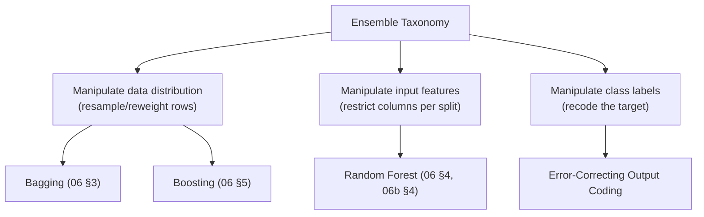
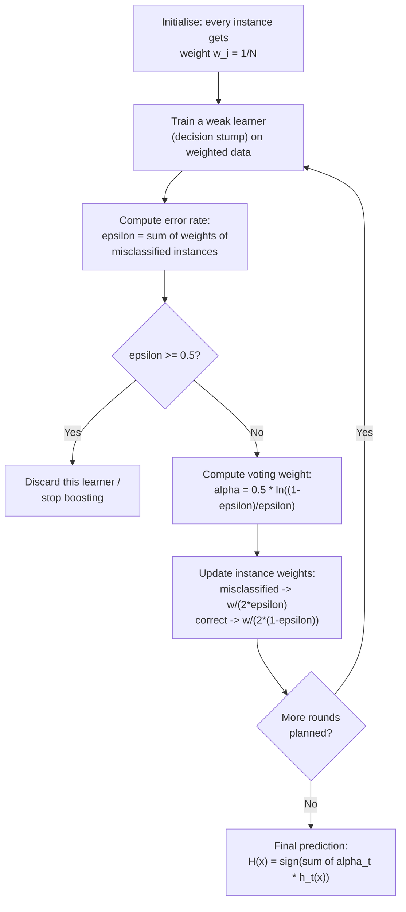
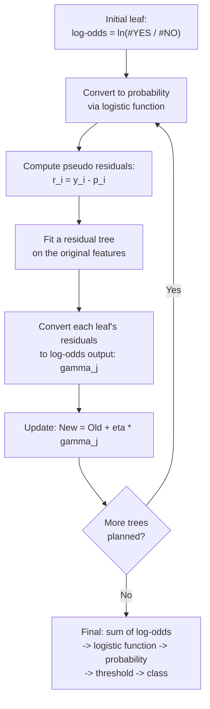
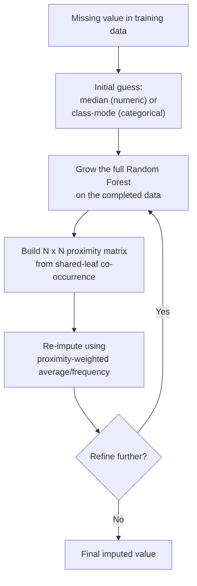

# Chapter 06b — Ensemble Methods Deep Dive: AdaBoost, Gradient Boosting for Classification & Random Forest Internals

> Sources: `08_ensemble-learning.pptx`, `09_adaBoost.pdf`, `10_gradientBoost.pdf`, `11_random_forest.pptx`
> Read after: [Chapter 06](06-ensemble-learning.md) — that chapter already explains what bagging and boosting *are*, why combining models works, the bias–variance split, bootstrap sampling, and the basic Random Forest mechanism. This chapter does not re-teach any of that; it goes to the depth these four source files add **on top of it**: the exact diversity-generation toolkit, the full worked AdaBoost algorithm, Gradient Boosting written out specifically for a **classification** target (log-odds and all), and the Random Forest internals — out-of-bag detail, voting, and proximity-based missing-data imputation — that Chapter 06 does not cover.

## Concept Hierarchy

```mermaid
flowchart TD
    C6B[06b. Ensemble Methods Deep Dive] --> P1[1. Weak-Learner Diversity and Ensemble Taxonomy]
    C6B --> P2[2. AdaBoost in Depth]
    C6B --> P3[3. Gradient Boosting for Classification]
    C6B --> P4[4. Random Forest Internals]

    P1 --> C11[1.1 Strong Learners vs Weak Learners]
    P1 --> C12[1.2 Manufacturing Diverse Weak Learners]
    P1 --> C13[1.3 Mathematical Confidence of an Ensemble]
    P1 --> C14[1.4 Taxonomy of Ensemble Methods]

    P2 --> C21[2.1 Decision Stumps as Weak Learners]
    P2 --> C22[2.2 The AdaBoost Algorithm, Step by Step]
    P2 --> C23[2.3 Worked Example: Error, Alpha and Weight Update]
    P2 --> C24[2.4 Sensitivity to Outliers]

    P3 --> C31[3.1 Why Classification Needs a Different Starting Point]
    P3 --> C32[3.2 Step 1 - The Initial Leaf: Log-Odds]
    P3 --> C33[3.3 Step 2 - Pseudo Residuals]
    P3 --> C34[3.4 Step 3 - The Residual Tree]
    P3 --> C35[3.5 Step 4 - Leaf Output Gamma]
    P3 --> C36[3.6 Step 5 - Updating the Model]
    P3 --> C37[3.7 The Full Cycle and Final Prediction]

    P4 --> C41[4.1 Bootstrapping and Feature Subsetting Recap]
    P4 --> C42[4.2 Out-of-Bag Error in a Random Forest]
    P4 --> C43[4.3 Ensemble Voting]
    P4 --> C44[4.4 Missing Data in Training Samples]
    P4 --> C45[4.5 Missing Data in Test Samples]
```

**Ordering note:** §1 deepens [06 §1–§2](06-ensemble-learning.md#1-what-ensemble-learning-is) with the specific diversity-generation toolkit and taxonomy these sources add. §2 and §3 are the two boosting algorithms Chapter 06 only sketched, worked to full depth. §4 fills the one gap Chapter 06 leaves entirely open — Random Forest's own out-of-bag mechanics, voting, and its distinctive proximity-matrix missing-data method. Nothing here contradicts Chapter 06; each section cross-references it rather than re-explaining it.

**Running examples:** this chapter keeps the bank-loan scenario from [00 §2](00-study-checklist.md#2-the-one-running-example) as the throughline, but reuses four small, numbers-attached examples straight from the source material for the actual calculations, because inventing new numbers where the sources already give exact ones would violate the notes' own accuracy: a **spam-detector** made of weak checks (§1.1), a **movie-preference predictor** for "Troll 2" (§3), a **heart-disease dataset** with a missing weight and a missing artery-blockage flag (§4.4), and a **student pass/fail** predictor (§4.3).

---

## 1. Weak-Learner Diversity and Ensemble Taxonomy

### 1.1 Strong Learners vs Weak Learners

**Picture this** — imagine hiring one brilliant, famously accurate food critic to review a restaurant, versus handing four ordinary diners a one-line checklist each: *"Was the food hot? Was the bill correct? Was the table clean? Did the waiter smile?"* The critic alone is nearly always right, but you can only afford to send one, and it takes them a week to write the review. The four ordinary diners are each only slightly better than a coin flip on the *whole* question of "was it a good restaurant" — but each is fast, cheap, and asks something specific.

**Mapping**:

| Analogy element                                | What it really is                                        |
| ---------------------------------------------- | -------------------------------------------------------- |
| The famous, accurate, slow food critic         | a **strong learner** (e.g. an SVM)                       |
| One diner's one-line checklist question        | a **weak learner** (e.g. a decision stump, a perceptron) |
| Four diners instead of one critic              | trading one expensive accurate model for many cheap ones |
| Combining the four checklists into one verdict | the ensemble's aggregated prediction                     |

**Meaning** — a **strong learner** is a classifier such as a Support Vector Machine that reaches high accuracy on its own but is expensive to train and to run. A **weak learner** is a simple, fast classifier — a decision stump, a shallow perceptron — that has low accuracy alone but costs almost nothing to build. Ensemble learning is the bet that **many** cheap weak learners, combined correctly, can match or beat one expensive strong learner.

> **Formal definition:** A strong learner is a classifier capable of achieving arbitrarily high accuracy on a learning problem given sufficient data and computation; a weak learner is a classifier that performs only slightly better than random guessing but can be constructed with minimal computational cost.

**Example — spam detection.** A single "strong" spam classifier would need to reason jointly over the whole email. Instead, the problem is broken into individual **weak** checks, each barely better than a coin flip alone: *does the email contain promotional phrases? does it contain only an image and no text? is the sender's identity verified? is the subject line in all caps?* No single check reliably catches spam, but combining several of them lets the ensemble detect spam with high probability and high accuracy — this is exactly the same shape as the four-diner checklist above.

**Core takeaway** — a weak learner is not a worse *version* of a strong learner, it is a deliberately narrow question, and an ensemble's power comes from combining many narrow questions rather than trying to build one model that answers everything at once.

**Exam focus:** be ready to *name* an example of each — SVM for strong, decision stump/perceptron for weak — and to state the cost/accuracy trade-off in one sentence.

### 1.2 Manufacturing Diverse Weak Learners

**Meaning** — [Chapter 06 §2](06-ensemble-learning.md#2-why-combining-models-works) already established that an ensemble only beats its members when their errors are *independent* — each weak learner must fail on different instances, not the same ones. This section is the concrete toolkit for forcing that independence.

> **Formal definition:** Diversity, in ensemble learning, is the property that base learners make errors that are statistically independent of one another, so that no single instance is systematically misclassified by a majority of the ensemble.

| Technique                     | What varies between learners                                                                                                                 |
| ----------------------------- | -------------------------------------------------------------------------------------------------------------------------------------------- |
| **Different algorithms**      | e.g. one learner is a decision stump, another a perceptron                                                                                   |
| **Different hyperparameters** | e.g. the same algorithm trained with different depths or learning rates                                                                      |
| **Resampling**                | each learner trains on a different bootstrap sample of the data ([06 §3.1](06-ensemble-learning.md#31-bootstrap-sampling))                   |
| **Different feature subsets** | each learner sees only some of the available features (the mechanism behind Random Forest, [06 §4](06-ensemble-learning.md#4-random-forest)) |

**Important details:** these four techniques are not mutually exclusive — Random Forest, for instance, stacks resampling *and* feature subsetting together. Empirically, combining around **100 weak learners** is enough for most problems, though fewer can suffice for simpler ones; this is a practical rule of thumb from the source, not a derived bound.

**Core takeaway** — diversity has to be *manufactured* deliberately, and every ensemble method in this book is really just a different choice of which of these four knobs it turns.

### 1.3 Mathematical Confidence of an Ensemble

**Picture this** — imagine flipping a slightly-biased coin that lands on "correct" 60% of the time. Flipping it once tells you almost nothing reliable. Flipping it 100 times and needing **every single flip** to come up wrong before the ensemble fails is a wildly different bet — the odds of that happening are astronomically small.

**Meaning** — if $N$ independent weak learners each have the same accuracy $A$, the chance that they are *all simultaneously wrong* on the same instance shrinks extremely fast as $N$ grows.

**Formula (Probability of total ensemble failure)** — Exam-important
$$P(\text{all } N \text{ models wrong}) = (1-A)^N$$

**Where** — $A$: the accuracy of a single weak learner (assumed identical and independent across all learners); $N$: the number of weak learners in the ensemble; $(1-A)$: the error rate of one learner.

**Example** — with $A = 0.6$ (each learner is right 60% of the time) and $N = 100$ learners:
$$(1 - 0.6)^{100} = 0.4^{100} \approx 1.6 \times 10^{-40}$$

**Interpretation** — the probability that all 100 independent weak learners fail together is, for all practical purposes, zero. This is a *looser* bound than the majority-vote calculation in [Chapter 06 §2](06-ensemble-learning.md#2-why-combining-models-works) (which found ~97% accuracy for a majority vote of 100 learners at $A=0.6$) — $(1-A)^N$ only answers "what is the chance *every single one* fails," not "what is the chance the *majority* fails," which is the more realistic question an ensemble actually needs to survive. Both formulas make the same point from different angles: independence turns a mediocre model into a reliable one.

**Core takeaway** — this formula is the mathematical reason ensembles are trusted at all: independent weak errors don't add up, they multiply down toward zero.

### 1.4 Taxonomy of Ensemble Methods

**Meaning** — every ensemble technique manufactures diversity by modifying exactly one of three things about training.

> **Formal definition:** Ensemble methods can be classified by which component of the learning process is manipulated to produce diverse base learners: the distribution of the training data, the set of input features, or the class labels themselves.

| Category                     | Mechanism                                                    | Representative method                                                                                                              |
| ---------------------------- | ------------------------------------------------------------ | ---------------------------------------------------------------------------------------------------------------------------------- |
| Manipulate data distribution | Resample or reweight training rows between learners          | Bagging ([06 §3](06-ensemble-learning.md#3-bagging-bootstrap-aggregating)), Boosting ([06 §5](06-ensemble-learning.md#5-boosting)) |
| Manipulate input features    | Restrict each learner (or each split) to a subset of columns | Random Forest ([06 §4](06-ensemble-learning.md#4-random-forest))                                                                   |
| Manipulate class labels      | Recode a multi-class target into several binary sub-problems | Error-Correcting Output Coding (ECOC)                                                                                              |

**Error-Correcting Output Coding (ECOC), briefly:** for a multi-class problem, each class is assigned a unique binary codeword; a set of binary classifiers is trained, one per codeword bit, and a new instance is classified by finding the class whose codeword is closest to the pattern of binary predictions it produced. This is the one ensemble family in the source that manipulates *labels* rather than rows or columns.

> **Formal definition:** Error-Correcting Output Coding is an ensemble technique for multi-class classification that encodes each class as a unique binary codeword, trains one binary classifier per codeword bit, and predicts the class whose codeword is closest (by Hamming distance) to the vector of binary predictions.

**Core takeaway** — bagging, boosting, Random Forest and ECOC are not four unrelated tricks; they are the only four places diversity *can* be introduced into a training pipeline — rows, columns, or labels — and every method in this book is one of those three choices.

**Connection** — with the diversity toolkit and the taxonomy in place, the rest of this chapter walks through the two named algorithms from the taxonomy's "data distribution" branch that Chapter 06 only summarised — AdaBoost (§2) and Gradient Boosting (§3) — and then returns to the "input features" branch for the Random Forest internals Chapter 06 left out (§4).

---

## 2. AdaBoost in Depth

[Chapter 06 §5.1](06-ensemble-learning.md#51-adaboost-adaptive-boosting) already introduced AdaBoost's core idea — reweight misclassified examples so the next learner is forced to focus on them — and its three central formulas (weighted error $\varepsilon_t$, learner weight $\alpha_t$, and the exponential weight-update rule). This section adds what that summary left out: how the weak learners themselves are literally built, a worked continuation of the weight-update arithmetic, and the outlier problem in more depth.

### 2.1 Decision Stumps as Weak Learners

**Meaning** — in AdaBoost, the weak learner combined at every round is almost always a **decision stump**: a decision tree with exactly one split (already named as the canonical weak learner in [06's terminology table](06-ensemble-learning.md#1-what-ensemble-learning-is)). This section covers how a stump is actually constructed from either kind of attribute.

> **Formal definition:** A decision stump is a one-level decision tree consisting of a single internal node and its immediate leaves, which makes a prediction by testing exactly one attribute against exactly one threshold or category.

**How it works:**

- **Categorical attribute stump** — each category of the attribute becomes its own leaf directly; no threshold is needed, since the values are already discrete groups.
- **Numerical attribute stump** — the attribute's values are sorted, and a split point is placed **between every pair of consecutive values**. Variations of the same stump are created by flipping the relational operator (`<` vs `≥`).

**Example** — for a numerical attribute $X_2$ with sorted values $1, 2, 3, \dots$, candidate split points sit at the midpoints: $X_2 < 1.5$, $X_2 < 2.5$, and so on. Each candidate split is scored (typically by weighted information gain or weighted Gini, exactly as in [Chapter 05](05-decision-trees-and-id3.md#3-information-gain), but weighted by the current instance weights), and the best-scoring one becomes that round's stump.

**Core takeaway** — a stump is not a shrunk decision tree, it is the smallest possible one, which is exactly why AdaBoost needs dozens or hundreds of them chained together to reach real accuracy.

### 2.2 The AdaBoost Algorithm, Step by Step

**Formula (Error rate, $\varepsilon$)** — Exam-important — restated from [06 §5.1](06-ensemble-learning.md#51-adaboost-adaptive-boosting) in the source's own notation
$$\varepsilon = \sum_{\text{wrong}} w_i$$

**Where** — $\varepsilon$: the weighted error rate of the current weak classifier; $w_i$: the current weight of training instance $i$; the sum runs only over instances the classifier misclassifies.

> **Rule:** $\varepsilon$ must be strictly less than $0.5$ for the weak classifier to be kept. If $\varepsilon \ge 0.5$, the classifier is no better than a coin toss (or worse) and is discarded, or boosting stops.

**Formula (Voting weight, $\alpha$)** — Exam-important
$$\alpha = 0.5 \cdot \ln\!\left(\frac{1-\varepsilon}{\varepsilon}\right)$$

**Where** — $\alpha$: the "amount of say" (voting weight) this classifier gets in the final ensemble; $\varepsilon$: its error rate from the formula above; $\ln$: the natural logarithm.

**Plot behaviour of $\alpha$ against $\varepsilon$:**

| $\varepsilon$          | $\alpha$      | Meaning                                                  |
| ---------------------- | ------------- | -------------------------------------------------------- |
| $\to 0$ (near-perfect) | $\to +\infty$ | An almost-flawless learner gets almost unlimited say     |
| $= 0.5$ (coin toss)    | $= 0$         | No say at all — as good as ignoring it                   |
| $\to 1$ (always wrong) | $\to -\infty$ | Its vote is inverted and trusted heavily the *other* way |

**Formula (Instance weight update)** — Exam-important — the source's simplified form, equivalent to the exponential rule in [06 §5.1](06-ensemble-learning.md#51-adaboost-adaptive-boosting)
$$w_{\text{new}} = \begin{cases} \dfrac{w_{\text{old}}}{2\varepsilon} & \text{misclassified} \\[4pt] \dfrac{w_{\text{old}}}{2(1-\varepsilon)} & \text{correctly classified} \end{cases}$$

**Where** — $w_{\text{old}}$: the instance's weight before this round; $w_{\text{new}}$: its weight for the next round; $\varepsilon$: the current classifier's error rate.

**Important details:** this looks like a different rule from Chapter 06's exponential form $w_i \leftarrow w_i \exp(-\alpha y^{(i)} h_t(x^{(i)}))/Z_t$, but it is the *same* update, algebraically simplified: substituting $\alpha = 0.5\ln((1-\varepsilon)/\varepsilon)$ and the normaliser $Z_t = 2\sqrt{\varepsilon(1-\varepsilon)}$ into the exponential form collapses it exactly to the two cases above (worked in §2.3). Either formula is fair game in an exam; know that they agree.

**Formula (Ensemble prediction)** — restated from [06 §5.1](06-ensemble-learning.md#51-adaboost-adaptive-boosting)
$$H(x) = \text{sign}\left(\sum_{t=1}^{T} \alpha_t\, h_t(x)\right)$$

**Where** — $H(x)$: the ensemble's final class prediction; $\alpha_t$: the voting weight of round $t$'s learner; $h_t(x) \in \{-1, +1\}$: that learner's prediction; $\text{sign}(\cdot)$: returns $+1$ if its argument is positive and $-1$ if negative.

**Example** — if the weighted sum $\sum_t \alpha_t h_t(x)$ evaluates to a positive number, the ensemble predicts Class $+1$; if negative, it predicts Class $-1$ (i.e. Class 2).

**Core takeaway** — every AdaBoost formula exists to answer one question in sequence: how wrong was this learner ($\varepsilon$), how much should it be trusted ($\alpha$), and how should the next round's attention be redistributed (the weight update) — nothing in the algorithm does anything else.

### 2.3 Worked Example: Error, Alpha and Weight Update

[Chapter 06's worked example](06-ensemble-learning.md#51-adaboost-adaptive-boosting) used 10 instances, each starting at $w_i = 0.1$, with round 1's stump misclassifying 3 of them: $\varepsilon_1 = 0.3$, giving $\alpha_1 = 0.424$. This section finishes that calculation using the weight-update formula from §2.2.

**Misclassified instances (3 of them):**
$$w_{\text{new}} = \frac{0.1}{2 \times 0.3} = \frac{0.1}{0.6} \approx 0.1667$$

**Correctly classified instances (7 of them):**
$$w_{\text{new}} = \frac{0.1}{2 \times (1 - 0.3)} = \frac{0.1}{1.4} \approx 0.0714$$

**Interpretation** — check that the weights still sum to 1, as any valid probability distribution must:
$$3 \times 0.1667 + 7 \times 0.0714 = 0.500 + 0.500 = 1.000$$

They do — exactly, with no separate normalisation step needed. This is the practical advantage of the source's simplified update formula over the raw exponential form: normalisation is *built in* by construction, because $2\varepsilon$ and $2(1-\varepsilon)$ are chosen precisely so the two groups' weights always sum back to $\varepsilon$ and $1-\varepsilon$ respectively (each scaled by $\tfrac{1}{2\varepsilon}$ or $\tfrac{1}{2(1-\varepsilon)}$), which always resolves to a total of exactly 1.

The 3 misclassified instances now carry roughly **2.3× the weight** of the 7 correctly classified ones ($0.1667 / 0.0714 \approx 2.33$), so round 2's stump is trained on data where those 3 hard examples dominate the loss — precisely the "sequential correction" behaviour named in [06 §5](06-ensemble-learning.md#5-boosting).

### 2.4 Sensitivity to Outliers

**Meaning** — the same reweighting mechanism that makes AdaBoost effective is also its weakness. An outlier — a genuinely mislabelled or unrepresentative record — tends to get **repeatedly** misclassified round after round, because no stump can correctly separate a genuinely wrong label from its neighbours. Each such round multiplies its weight upward by $1/(2\varepsilon)$, so its weight can grow extremely large.

**Why it matters** — once one instance's weight dominates the distribution, subsequent weak learners are forced to spend almost all their capacity trying to fit that single point, which drags down accuracy on every other instance. This is the mirror image of bagging, where a bad row is diluted across resamples rather than amplified ([06 §3](06-ensemble-learning.md#3-bagging-bootstrap-aggregating)).

**Important details — mitigation trade-off:** capping (restricting) how large an instance's weight is allowed to grow can limit this damage, but it also weakens AdaBoost's core mechanism — deliberately down-weighting its attention to genuinely hard-but-valid examples along with the outliers — so it typically lowers overall classifier performance somewhat. There is no free fix; it is a trade-off between robustness and the sharp focus that makes AdaBoost effective in the first place.

**Core takeaway** — AdaBoost cannot tell the difference between "a hard example worth focusing on" and "a wrong label that will never be fit," so it amplifies both identically, which is exactly why noisy or mislabelled data is the one thing that reliably breaks it.

**Connection** — AdaBoost corrects errors by *reweighting instances*. The next algorithm, Gradient Boosting, corrects errors by a different, more general mechanism — fitting a new model directly to the *residual error itself* — and needs an extra translation step the moment the target is a category rather than a number.

---

## 3. Gradient Boosting for Classification

[Chapter 06 §5.2](06-ensemble-learning.md#52-gradient-boosting) explained Gradient Boosting's core mechanism for a **numeric** target: fit each new tree to the residuals of the current ensemble, add it in, scaled by a learning rate. This section is what changes when the target is a **category** — because "residual = actual − predicted" makes no sense yet when there is no number to predict.

### 3.1 Why Classification Needs a Different Starting Point

**Picture this** — imagine you're not guessing a person's height (an ordinary number you could simply average) but guessing whether they'll like a cult B-movie called *Troll 2* — a yes/no question. You can't "average" a room full of yes/no answers into a sensible number the way you can average heights. You need a different starting number altogether: not the answer itself, but a measure of *how lopsided the room's opinion already is* — many more yeses than noes, or the reverse — expressed on a scale where 0 means "perfectly split" and it stretches toward $+\infty$ or $-\infty$ as the room becomes more one-sided.

**Meaning** — Gradient boosting natively predicts numbers by starting from the training set's **mean**. That trick fails outright for a category like *loves Troll 2: YES / NO*, so classification instead starts from the **log-odds** of the target — the same log-odds quantity that underlies logistic regression's [sigmoid function](03-logistic-regression.md#2-the-sigmoid-function), reused here as the ensemble's starting prediction.

**Example (running data for this section):** predicting whether people love the movie *Troll 2*, from features `popcorn preference`, `age`, and `favourite colour`, using training data with **4 YES** and **2 NO** labels.

**Core takeaway** — classification with gradient boosting is not a new algorithm bolted onto the numeric version; it is the exact same five-step cycle, with log-odds substituted in everywhere a plain number used to be.

### 3.2 Step 1 — The Initial Leaf: Log-Odds

**Formal definition:** the initial leaf of a gradient-boosted classifier is the log-odds of the observed class frequencies in the training data, used as the ensemble's starting prediction before any tree is added.

**Formula (Initial log-odds)** — Essential
$$\text{Initial log-odds} = \ln\!\left(\frac{\#\text{YES}}{\#\text{NO}}\right)$$

**Where** — $\#\text{YES}$: the count of positive-class training examples; $\#\text{NO}$: the count of negative-class training examples; $\ln$: the natural logarithm. A ratio above 1 (more YES than NO) gives a positive log-odds; below 1 gives negative; exactly equal gives 0.

**Example** — with 4 YES and 2 NO:
$$\ln\!\left(\frac{4}{2}\right) = \ln(2) \approx 0.7$$

**Formula (Converting log-odds to probability)** — Essential — the logistic function, reused from [Chapter 03](03-logistic-regression.md#2-the-sigmoid-function)
$$P(\text{YES}) = \frac{e^{\text{log-odds}}}{1 + e^{\text{log-odds}}}$$

**Where** — $e$: Euler's number; log-odds: the value computed above.

**Example** — converting $0.7$:
$$P(\text{YES}) = \frac{e^{0.7}}{1+e^{0.7}} \approx \frac{2.014}{3.014} \approx 0.67$$

**Interpretation** — at the standard 0.5 threshold, this initial model predicts **YES for every single person**, including the two who actually said NO — it is confidently wrong for them from the very first step. That gap is exactly what the rest of the cycle exists to close.

### 3.3 Step 2 — Pseudo Residuals

**Formal definition:** a pseudo residual is the difference between an instance's observed target (coded YES $=1$, NO $=0$) and its currently predicted probability, used in place of an ordinary residual because probabilities, not raw class labels, are what the model actually outputs.

**Formula (Pseudo residual)** — Essential
$$r_i = y_i - p_i$$

**Where** — $r_i$: the pseudo residual for instance $i$; $y_i \in \{0, 1\}$: the true label (YES$=1$, NO$=0$); $p_i$: the model's current predicted probability of YES for that instance.

**Example** — every instance currently has $p_i \approx 0.67$ (the shared initial prediction):

- For a true **YES** instance: $r_i = 1 - 0.67 = +0.33$
- For a true **NO** instance: $r_i = 0 - 0.67 = -0.67$

**Interpretation** — a positive residual means the model under-predicted that instance's chance of YES (it needs pushing up); a negative residual means it over-predicted (it needs pushing down). Residual size also signals difficulty: the NO instances start with a much *larger*-magnitude residual ($-0.67$ vs $+0.33$) because the initial model is more badly wrong about them.

### 3.4 Step 3 — The Residual Tree

**Meaning** — a decision tree is fit **not to the original YES/NO labels**, but to the pseudo residuals computed in §3.3, using the original features (`popcorn`, `age`, `favourite colour`) as predictors.

> **Formal definition:** the residual tree is a regression tree trained to predict the pseudo residuals of the current ensemble from the original input features, so that its leaves group together instances with similar remaining error.

**How it works** — this is an ordinary regression tree ([05 §1](05-decision-trees-and-id3.md#1-what-a-decision-tree-is)) with a numeric target (the residuals), split by whichever feature best separates large residuals from small ones. Its leaves each collect a small group of instances that shared similar prediction error.

### 3.5 Step 4 — Leaf Output Gamma

**Meaning** — a leaf's raw output would naturally be the *average residual* of the instances that land in it — but that average is expressed in **probability space**, and it cannot simply be added to the ensemble's running total, which is expressed in **log-odds space**. Before the leaf's contribution can be added to the model, it must be converted.

**Formula (Leaf output, $\gamma_j$)** — Essential
$$\gamma_j = \frac{\sum_{i \in \text{leaf } j} r_i}{\sum_{i \in \text{leaf } j} P_i (1 - P_i)}$$

**Where** — $\gamma_j$: the log-odds-scale output for leaf $j$; $r_i$: the pseudo residual of instance $i$ in that leaf (from §3.3); $P_i$: instance $i$'s current predicted probability; the denominator sums, over every instance in the leaf, its probability times one minus its probability — a quantity that is largest when $P_i$ is near $0.5$ (most uncertain) and smallest near $0$ or $1$ (most confident).

**Worked example** — continuing the Troll 2 data with two illustrative leaves: one containing the 4 YES instances ($r_i = +0.33$, $P_i = 0.67$ each) and one containing the 2 NO instances ($r_i = -0.67$, $P_i = 0.67$ each):

*YES leaf:*
$$\gamma_{\text{YES}} = \frac{4 \times 0.33}{4 \times (0.67 \times 0.33)} = \frac{1.32}{0.8844} \approx 1.49$$

*NO leaf:*
$$\gamma_{\text{NO}} = \frac{2 \times (-0.67)}{2 \times (0.67 \times 0.33)} = \frac{-1.34}{0.4422} \approx -3.03$$

**Interpretation** — the NO leaf gets a much larger-magnitude correction ($-3.03$ vs $+1.49$) because its instances were further from correct, matching the larger residual seen in §3.3.

### 3.6 Step 5 — Updating the Model

**Formula (Additive log-odds update)** — Essential — the same additive shape as [06 §5.2](06-ensemble-learning.md#52-gradient-boosting), applied here in log-odds space
$$\text{New} = \text{Old} + \eta \cdot \gamma_j$$

**Where** — Old: the instance's log-odds prediction before this round; $\eta$ (eta): the **learning rate**, e.g. $0.1$; $\gamma_j$: the leaf output from §3.5 for the leaf this instance falls into; New: the updated log-odds prediction.

**Worked example** — with $\eta = 0.1$, starting from the initial log-odds of $0.7$:

- Instances in the YES leaf: $0.7 + 0.1 \times 1.49 = 0.849$, which converts back to $P(\text{YES}) = e^{0.849}/(1+e^{0.849}) \approx 0.70$ — up from $0.67$, moving in the correct direction.
- Instances in the NO leaf: $0.7 + 0.1 \times (-3.03) = 0.397$, which converts to $P(\text{YES}) \approx 0.60$ — down from $0.67$, also moving in the correct direction, though still far from a confident NO.

**Rule:** a small $\eta$ makes cautious, incremental corrections and prevents overfitting — exactly as in the numeric version ([06 §5.2](06-ensemble-learning.md#52-gradient-boosting)). Notice how much work is still left after just one tree — this is precisely why the cycle repeats many times.

### 3.7 The Full Cycle and Final Prediction

**Formula (Final prediction)**
$$\text{Initial leaf} + \eta \cdot \text{Tree}_1 + \eta \cdot \text{Tree}_2 + \dots + \eta \cdot \text{Tree}_T \;\xrightarrow{\text{logistic}}\; \text{probability} \;\xrightarrow{\text{threshold}}\; \text{class}$$

**Interpretation** — the cycle of §3.3–§3.6 (residuals → tree → gamma → update) repeats for $T$ rounds, each time re-deriving fresh residuals from the *updated* probabilities. The final class prediction only appears at the very end, once every tree's small log-odds correction has been summed and the total is converted back to a probability and thresholded — exactly mirroring §3.2's conversion, run in reverse.

**Core takeaway** — every step in this section exists purely to solve one translation problem: gradient boosting only knows how to add numbers, so classification has to smuggle a yes/no decision through log-odds space and back, one small step at a time.

**Connection** — AdaBoost (§2) and Gradient Boosting (§3) both build a sequential chain that corrects prior mistakes, but by genuinely different mechanisms — compare them directly below before moving to Random Forest, the ensemble family built on manipulating *features*, not sequence.

### Comparison: AdaBoost vs Gradient Boosting

|                         | AdaBoost (§2)                                               | Gradient Boosting (§3)                                                                                                   |
| ----------------------- | ----------------------------------------------------------- | ------------------------------------------------------------------------------------------------------------------------ |
| Correction mechanism    | Reweights misclassified **instances**                       | Fits a new tree to the **residual error** (negative gradient of the loss)                                                |
| Typical base learner    | Decision stump (depth 1), almost always                     | Shallow tree (depth 3–8)                                                                                                 |
| Combination rule        | Weighted vote using $\alpha_t$                              | Additive sum scaled by learning rate $\eta$                                                                              |
| Classification handling | Native — sign of a weighted vote                            | Needs a log-odds/logistic translation layer (§3.2, §3.7)                                                                 |
| Sensitivity to outliers | High — a bad instance's weight compounds every round (§2.4) | Present but more diffuse — controlled by $\eta$ and tree depth ([06 §5.2](06-ensemble-learning.md#52-gradient-boosting)) |

**The central difference in one sentence:** AdaBoost corrects itself by telling the next learner *which examples* to pay more attention to, while Gradient Boosting corrects itself by telling the next learner *exactly how wrong* the ensemble currently is on every example, expressed as a residual it can directly fit. **How to choose:** reach for AdaBoost when you want a simple, fast, easily-explained boosting baseline built from stumps; reach for Gradient Boosting (or its optimised descendant XGBoost, [06 §5.3](06-ensemble-learning.md#53-xgboost)) when the extra tuning effort of learning rate and tree depth is affordable and the last few points of accuracy matter.

---

## 4. Random Forest Internals

[Chapter 06 §4](06-ensemble-learning.md#4-random-forest) already explained *why* Random Forest works — bootstrapping decorrelates trees by row, and feature subsetting at every split decorrelates them further by column. This section covers what that chapter left out entirely: the forest's own out-of-bag bookkeeping, how its votes are actually tallied, and its distinctive method for handling missing data, which no other method in this book uses.

### 4.1 Bootstrapping and Feature Subsetting Recap

**Meaning** — Random Forest builds each tree from a **bootstrapped dataset**: a sample drawn at random, with replacement, from the training data, while **preserving the original class distribution** — a detail Chapter 06 does not mention. As established in [06 §3.1](06-ensemble-learning.md#31-bootstrap-sampling), this leaves roughly **36.8%** of the original rows unused by any given tree; these become that tree's **out-of-bag (OOB) samples**.

At every node of every tree, the split search is restricted to a random subset of $R$ features out of the total $M$ available ($R < M$), exactly as formalised in [06 §4](06-ensemble-learning.md#4-random-forest)'s formula for $m = \sqrt{n}$ (classification) or $m = n/3$ (regression). Splitting continues down each branch until nodes become too small to split further.

**Important details:**

- **No pruning is needed.** Unlike a standalone decision tree ([05 §8](05-decision-trees-and-id3.md#8-pruning)), individual Random Forest trees are grown fully, because variance is controlled by averaging across trees rather than by pruning any one of them — the same point Chapter 06 makes in its own words.
- Preserving class distribution in the bootstrap draw specifically matters for **imbalanced** classification problems, so that a rare class is not accidentally left out of a given tree's training sample entirely.

### 4.2 Out-of-Bag Error in a Random Forest

**Meaning** — the general OOB-evaluation idea from [06 §3.3](06-ensemble-learning.md#33-out-of-bag-oob-evaluation) applies directly to Random Forest: each tree is tested only on the roughly 36.8% of rows it never trained on.

**How it works** — for every training observation, only the subset of trees for which that observation was **out-of-bag** are asked to predict it; their predictions are combined (majority vote for classification, mean for regression), and the result is compared against the true label to compute either the **classification error rate** or the **mean squared error (MSE)**, aggregated across all observations.

**Why it matters** — this gives an honest, built-in estimate of the forest's generalisation performance without holding out a separate validation set, at zero extra training cost — precisely because the forest already trains hundreds of trees on different row subsets.

### 4.3 Ensemble Voting

**Formal definition:** Random Forest ensemble voting is the process of passing a test input through every tree in the forest and selecting the final predicted class by majority vote across all trees' individual predictions (or the mean, for regression).

**Example — predicting student pass/fail from `Hours Studied` and `Sleep Hours`, using 3 trees:**

| Tree   | Prediction |
| ------ | ---------- |
| Tree 1 | Yes (Pass) |
| Tree 2 | Yes (Pass) |
| Tree 3 | No (Fail)  |

Two votes for Yes against one for No gives a majority-vote final prediction of **Yes (Pass)** — the same mechanism as [06 §3.2](06-ensemble-learning.md#32-aggregation)'s aggregation step, just named here for Random Forest specifically rather than for bagging in general.

**Core takeaway** — a Random Forest never "asks itself" anything; every prediction is produced by literally polling every tree and counting hands, which is exactly why it needs its trees to disagree usefully rather than agree identically (the whole point of feature subsetting, [06 §4](06-ensemble-learning.md#4-random-forest)).

### 4.4 Missing Data in Training Samples

**Picture this** — imagine a hospital record with a blank where a patient's weight should be. Instead of leaving that blank untouched or throwing the whole record away, you make your best rough guess right now — the typical weight of patients like this one — then quietly go back later and refine that guess once you understand this patient's neighbours better.

**Meaning** — Random Forest imputes missing training values in **two passes**: a fast, rough **initial guess**, followed by an iterative **refinement** using how similar patients group together across the forest's own trees.

#### 4.4.1 Initial Guess Imputation

> **Formal definition:** Initial guess imputation replaces a missing numerical value with the **median** of that feature (computed within the observation's class), and a missing categorical value with the **mode** (most common value) of that feature within its class.

**Example** — in a heart-disease dataset, a patient's missing `blocked arteries` flag is filled with **"No"**, because "No" is the mode of that feature among patients in the healthy class; a different patient's missing `weight` is filled with **167.5**, the median weight within their class.

#### 4.4.2 Proximity Matrix Calculation

> **Formal definition:** The proximity matrix is an $N \times N$ matrix, where $N$ is the number of training samples, in which entry $(i,j)$ counts how often samples $i$ and $j$ land in the same leaf node across all trees in the forest, normalised by dividing by the total number of trees.

**Why it matters** — two samples that repeatedly end up in the same leaf, across many different trees built on different bootstrap samples and different feature subsets, are ones the forest consistently treats as similar — this proximity score is a learned, data-driven notion of "how alike are these two rows," built entirely from how the trees already split the data.

#### 4.4.3 Imputation via Proximity Scores

**Meaning** — the crude initial guess from §4.4.1 is now refined using the proximity matrix: instead of one global median or mode, each missing value is re-estimated as a **weighted** average or frequency, where the weights are how proximate (similar) each other sample is to the one with the missing value.

**Formula (Proximity-weighted numeric imputation)** — Essential
$$\hat{x}_{\text{missing}} = \frac{\sum_i \text{proximity}_i \times x_i}{\sum_i \text{proximity}_i}$$

**Where** — $\hat{x}_{\text{missing}}$: the refined imputed value; $\text{proximity}_i$: how often the sample with the missing value shares a leaf with sample $i$ (from the proximity matrix); $x_i$: sample $i$'s own (non-missing) value for that feature; the sums run over all other training samples.

**Example** — imputing the missing weight of sample 4 using proximities to the other samples gives:
$$\text{Weighted average weight} = \frac{\sum \text{proximity}_i \times \text{weight}_i}{\sum \text{proximity}_i} = 198.5$$

replacing the cruder initial median guess with a value informed by which specific patients sample 4 resembles.

For a missing **categorical** value, such as `blocked arteries`, the same proximity weights are used to compute a **weighted frequency** of "Yes" versus "No" among similar samples, and the category with the higher weighted frequency is selected — the categorical counterpart of the formula above.

**Important details:** this two-pass process (initial guess, then proximity refinement) can itself be repeated for several iterations, each time rebuilding the forest and its proximity matrix on the newly refined data, until the imputed values stabilise.

**Core takeaway** — Random Forest doesn't just fill in a missing value once; it uses the forest it already built to define "similar patients" and then lets those specific neighbours, not the whole dataset, answer the blank.

### 4.5 Missing Data in Test Samples

**Meaning** — a genuinely new test instance with missing features cannot be imputed the way training data was, because it has no true label to compute a class-specific median or mode from, and it was never part of the proximity matrix. Random Forest instead creates a copy of the test instance for **each possible class**, imputes the missing features assuming that instance belongs to that class, and lets the forest's overall prediction settle the question.

**How it works:**

1. Duplicate the incomplete test sample once for every class label the target can take.
2. For each copy, fill its missing features using proximity-based imputation ([§4.4.3](#443-imputation-via-proximity-scores)) computed **as if** that copy belonged to that assumed class.
3. Run every completed copy through the forest.
4. Take the **consensus prediction** across the copies as the final answer for the original, incomplete test sample.

**Why it matters** — this sidesteps circularity (needing the class to impute the features, but needing the features to predict the class) by simply trying every class assumption and letting the forest's own voting mechanism (§4.3) arbitrate between them.

**Core takeaway** — for a test sample, Random Forest resolves "which class does this belong to" and "what would its missing values have been" simultaneously, by trying every class hypothesis and letting the forest decide which one is self-consistent.

**Connection** — this closes the last method-specific gap Chapter 06 left open. Every ensemble idea across both chapters — diversity, bagging, boosting, Random Forest, AdaBoost, Gradient Boosting — ultimately exists to feed a classifier whose output still has to be judged honestly, which is exactly the job of [Chapter 07 — Performance Metrics](07-performance-metrics.md).

---

## Examination Preparation

**Must understand** — how weak-learner diversity is manufactured and why it mathematically matters ([§1.2](#12-manufacturing-diverse-weak-learners), [§1.3](#13-mathematical-confidence-of-an-ensemble)); the full AdaBoost cycle end to end ([§2.2](#22-the-adaboost-algorithm-step-by-step)–[§2.3](#23-worked-example-error-alpha-and-weight-update)); why Gradient Boosting classification needs a log-odds detour that the numeric version does not ([§3.1](#31-why-classification-needs-a-different-starting-point)–[§3.7](#37-the-full-cycle-and-final-prediction)); how Random Forest's proximity matrix turns "similar rows" into a numeric weight for imputation ([§4.4](#44-missing-data-in-training-samples)).

**Must remember:**

| Formal definition / formula                                                                           | Reference                                          |
| ----------------------------------------------------------------------------------------------------- | -------------------------------------------------- |
| Strong learner / weak learner                                                                         | [§1.1](#11-strong-learners-vs-weak-learners)       |
| $(1-A)^N$ — probability all $N$ learners are simultaneously wrong                                     | [§1.3](#13-mathematical-confidence-of-an-ensemble) |
| Ensemble taxonomy — data distribution / input features / class labels                                 | [§1.4](#14-taxonomy-of-ensemble-methods)           |
| $\varepsilon = \sum_{\text{wrong}} w_i$; $\alpha = 0.5\ln\frac{1-\varepsilon}{\varepsilon}$           | [§2.2](#22-the-adaboost-algorithm-step-by-step)    |
| $w_{\text{new}} = w_{\text{old}}/(2\varepsilon)$ or $w_{\text{old}}/(2(1-\varepsilon))$               | [§2.2](#22-the-adaboost-algorithm-step-by-step)    |
| $H(x) = \text{sign}\left(\sum_t \alpha_t h_t(x)\right)$                                               | [§2.2](#22-the-adaboost-algorithm-step-by-step)    |
| Initial log-odds $= \ln(\#\text{YES}/\#\text{NO})$; $P(\text{YES}) = e^{\text{lo}}/(1+e^{\text{lo}})$ | [§3.2](#32-step-1---the-initial-leaf-log-odds)     |
| Pseudo residual $r_i = y_i - p_i$                                                                     | [§3.3](#33-step-2---pseudo-residuals)              |
| $\gamma_j = \sum r_i / \sum P_i(1-P_i)$                                                               | [§3.5](#35-step-4---leaf-output-gamma)             |
| Proximity-weighted imputation formula                                                                 | [§4.4.3](#443-imputation-via-proximity-scores)     |

**Common question patterns:**

- **2-mark:** Define a weak learner / strong learner. State the rule for $\varepsilon \ge 0.5$ in AdaBoost. Define the proximity matrix.
- **5-mark:** Derive and explain $\alpha_t$ in AdaBoost with its behaviour at the three special values of $\varepsilon$. Explain why Gradient Boosting needs log-odds for classification. Compare AdaBoost and Gradient Boosting (§3, comparison table).
- **10-mark:** Walk through the full AdaBoost algorithm with a worked numeric example and a diagram. Walk through the full Gradient Boosting classification cycle (log-odds → residuals → tree → gamma → update) with the Troll 2 worked example and a diagram. Explain Random Forest's missing-data handling for both training and test samples with the proximity-matrix mechanism.

**Answer-writing guidance:**

- *2-mark:* state the formal definition precisely, then one supporting fact or example.
- *5-mark:* formal definition, the mechanism in 2–3 steps, the relevant formula, one small example.
- *10-mark:* introduction and formal definition, a Mermaid diagram of the process, the full step-by-step mechanism with formulas, a worked numeric example, one limitation, a one-line conclusion.

**Model answers:**

- **2-mark — "Define a weak learner and give an example."** *A weak learner is a classifier that performs only slightly better than random guessing but requires minimal computational cost to build; a decision stump (a decision tree with a single split) is the canonical example used in AdaBoost.*
- **5-mark — "Explain how AdaBoost computes and uses the voting weight $\alpha$."** *After each weak learner is trained, AdaBoost computes its weighted error rate $\varepsilon = \sum_{\text{wrong}} w_i$, the sum of the current weights of the instances it misclassified. From this it computes the learner's voting weight $\alpha = 0.5\ln((1-\varepsilon)/\varepsilon)$. This value approaches $+\infty$ as $\varepsilon \to 0$ (a near-perfect learner is trusted heavily), equals exactly $0$ at $\varepsilon = 0.5$ (a coin-flip learner is given no say), and becomes negative for $\varepsilon > 0.5$ (a worse-than-random learner has its prediction inverted). $\alpha$ is then used both to weight that learner's vote in the final prediction $H(x) = \text{sign}(\sum_t \alpha_t h_t(x))$ and, implicitly, to scale how strongly instance weights are updated for the next round.*
- **10-mark — "Explain Gradient Boosting for a classification target, with a worked example."** See the full walkthrough in [§3.1](#31-why-classification-needs-a-different-starting-point)–[§3.7](#37-the-full-cycle-and-final-prediction): introduce why a category target rules out averaging; define the initial log-odds leaf and its conversion to probability; define the pseudo residual $r_i = y_i - p_i$; describe fitting a regression tree to those residuals; give the leaf-output formula $\gamma_j = \sum r_i / \sum P_i(1-P_i)$ and the additive update $\text{New} = \text{Old} + \eta\gamma_j$; walk the Troll 2 numbers through one full round (log-odds $0.7 \to P \approx 0.67 \to$ residuals $+0.33/-0.67 \to \gamma_{\text{YES}} \approx 1.49$, $\gamma_{\text{NO}} \approx -3.03 \to$ updated probabilities $0.70$ / $0.60$); include the §3.7 cycle diagram; note that a small learning rate trades speed for protection against overfitting; conclude that classification gradient boosting is the numeric algorithm plus a log-odds translation layer at both ends.

## Practice Questions

1. What is the difference between a strong learner and a weak learner? Give one example of each.
2. What rule must an AdaBoost weak learner's error rate satisfy to be kept in the ensemble?
3. Write the formula for a decision stump's split points on a numerical attribute.
4. What does the proximity matrix in Random Forest measure?
5. State the formula converting log-odds to a probability in Gradient Boosting classification.
6. Why does $(1-A)^N$ shrink so quickly as $N$ grows, and what does it tell you about ensembles built from independent weak learners?
7. Explain why AdaBoost's simplified weight-update formula ($w/(2\varepsilon)$, $w/(2(1-\varepsilon))$) always keeps the weights summing to 1 without a separate normalisation step.
8. Why can't Gradient Boosting simply average the training labels to get its initial prediction when the target is a category?
9. Explain, in your own words, why a large instance weight is dangerous for AdaBoost but not obviously dangerous for the accuracy of a single round in isolation.
10. What does the leaf-output formula $\gamma_j = \sum r_i / \sum P_i(1-P_i)$ actually convert, and why is that conversion necessary?
11. Compare AdaBoost and Gradient Boosting on how each one identifies "what to correct next."
12. Compare Bagging's taxonomy category with Random Forest's — how are they related, and what does Random Forest add?
13. Compare the initial-guess imputation step with the proximity-refinement step in Random Forest's missing-data handling — what does each one contribute that the other cannot?
14. A hospital dataset has a missing `weight` value for one patient. Walk through, step by step, how Random Forest would estimate it.
15. A bank's AdaBoost model keeps assigning a huge weight to one specific loan applicant's record across many rounds, and overall accuracy is dropping. Diagnose what is happening and suggest a mitigation, noting its trade-off.
16. A test-time loan application arrives with a missing `income` field. Explain how a trained Random Forest would still produce a prediction for it.
17. Derive, from the AdaBoost example in §2.3, what happens to the ratio between a misclassified instance's weight and a correctly classified instance's weight as $\varepsilon$ gets smaller. Explain what this means for how sharply the ensemble focuses on its hardest examples.
18. Using the Troll 2 example, explain why the NO-labelled instances receive a larger-magnitude leaf output $\gamma$ than the YES-labelled instances, and connect this back to the pseudo residuals computed for each group.

## Quick Revision

**One-sentence summary:** this chapter completes Chapter 06 by working AdaBoost, Gradient Boosting's classification variant, and Random Forest's internal machinery down to their exact formulas and worked numbers, rather than their general shape.

**Compact hierarchy:** see the Concept Hierarchy diagram at the top of this chapter.

**Essential definitions:** strong/weak learner ([§1.1](#11-strong-learners-vs-weak-learners)); diversity ([§1.2](#12-manufacturing-diverse-weak-learners)); ensemble taxonomy ([§1.4](#14-taxonomy-of-ensemble-methods)); decision stump ([§2.1](#21-decision-stumps-as-weak-learners)); pseudo residual ([§3.3](#33-step-2---pseudo-residuals)); proximity matrix ([§4.4.2](#442-proximity-matrix-calculation)).

**Key steps/workflow:** AdaBoost cycle ([§2.2](#22-the-adaboost-algorithm-step-by-step)); Gradient Boosting classification cycle ([§3.7](#37-the-full-cycle-and-final-prediction)); Random Forest missing-data cycle ([§4.4](#44-missing-data-in-training-samples)).

**Most important comparison:** AdaBoost vs Gradient Boosting ([§3, comparison table](#comparison-adaboost-vs-gradient-boosting)).

**Key formulas:** $(1-A)^N$ ([§1.3](#13-mathematical-confidence-of-an-ensemble)); $\varepsilon$, $\alpha$, weight update, $H(x)$ ([§2.2](#22-the-adaboost-algorithm-step-by-step)); log-odds, pseudo residual, $\gamma_j$, additive update ([§3.2](#32-step-1---the-initial-leaf-log-odds)–[§3.6](#36-step-5---updating-the-model)); proximity-weighted imputation ([§4.4.3](#443-imputation-via-proximity-scores)).

**5 exam keywords:** decision stump, voting weight ($\alpha$), pseudo residual, log-odds, proximity matrix.

**5 common mistakes:** forgetting the $\varepsilon \ge 0.5$ discard rule; confusing AdaBoost's exponential and simplified weight-update forms as different algorithms rather than equivalent ones; trying to average YES/NO labels directly instead of using log-odds; forgetting to convert a leaf's residual average back into log-odds space via $\gamma_j$ before adding it to the model; imputing test-sample missing data the same way as training-sample missing data (test samples need the class-copy-and-consensus method of [§4.5](#45-missing-data-in-test-samples), not the direct proximity method of §4.4).

**Mental Models:**

- §1.1 Strong vs weak learners — one expert critic vs four checklist diners; *many narrow questions can out-perform one broad expert when combined correctly.*
- §1.3 Mathematical confidence — a biased coin that must land wrong every single time; *independent errors don't add, they multiply down toward zero.*
- §2.4 AdaBoost outlier sensitivity — a question that was misprinted in the textbook, chased harder every round; *AdaBoost cannot distinguish a hard example from a wrong one, so it amplifies both.*
- §3.1 Gradient Boosting classification — guessing a yes/no opinion instead of a height, needing a lopsidedness scale instead of an average; *the whole classification variant exists only to translate averaging into something a yes/no target can use.*
- §4.4 Random Forest missing data — a rough guess now, refined later using how your own neighbours turned out; *the forest uses the very trees it built to decide who your "similar patients" are.*

## Topic Coverage

| Topic (from knowledge map)                                                                                 | Status                                                                                                                                                                 |
| ---------------------------------------------------------------------------------------------------------- | ---------------------------------------------------------------------------------------------------------------------------------------------------------------------- |
| 1.1 Introduction to Ensemble Learning                                                                      | Merged with [Chapter 06 §1](06-ensemble-learning.md#1-what-ensemble-learning-is) (not re-covered here) — `08_ensemble-learning.pptx`                                   |
| 1.1.1 Strong Learners                                                                                      | Covered in [§1.1](#11-strong-learners-vs-weak-learners) — `08_ensemble-learning.pptx`                                                                                  |
| 1.1.2 Weak Learners (incl. spam detection example)                                                         | Covered in [§1.1](#11-strong-learners-vs-weak-learners) — `08_ensemble-learning.pptx`                                                                                  |
| 1.2 Diversity of Weak Learners                                                                             | Covered in [§1.2](#12-manufacturing-diverse-weak-learners) — `08_ensemble-learning.pptx`                                                                               |
| 1.2.1 Techniques for Generating Diverse Weak Learners                                                      | Covered in [§1.2](#12-manufacturing-diverse-weak-learners) — `08_ensemble-learning.pptx`                                                                               |
| 1.2.2 Simple Majority Voting vs. Weighted Voting                                                           | Merged with [Chapter 06 §3.2 / §5](06-ensemble-learning.md#32-aggregation) (not re-covered here) — `08_ensemble-learning.pptx`                                         |
| 1.2.3 Mathematical Confidence of Ensembles                                                                 | Covered in [§1.3](#13-mathematical-confidence-of-an-ensemble) — `08_ensemble-learning.pptx`                                                                            |
| 1.3 Taxonomy of Ensemble Methods                                                                           | Covered in [§1.4](#14-taxonomy-of-ensemble-methods) — `08_ensemble-learning.pptx`                                                                                      |
| 1.3.1–1.3.3 Manipulating Data Distribution / Input Features / Class Labels                                 | Covered in [§1.4](#14-taxonomy-of-ensemble-methods) — `08_ensemble-learning.pptx`                                                                                      |
| 1.4 Bagging (Bootstrap Aggregation)                                                                        | Merged with [Chapter 06 §3](06-ensemble-learning.md#3-bagging-bootstrap-aggregating) (not re-covered here) — `08_ensemble-learning.pptx`                               |
| 1.4.1–1.4.5 Bootstrap Sampling, Selection Probability, Aggregation, OOB Set, OOB Error, Variance Reduction | Merged with [Chapter 06 §3.1–§3.3](06-ensemble-learning.md#31-bootstrap-sampling) (not re-covered here) — `08_ensemble-learning.pptx`                                  |
| 1.5 Boosting Foundations                                                                                   | Merged with [Chapter 06 §5](06-ensemble-learning.md#5-boosting) (not re-covered here) — `08_ensemble-learning.pptx`                                                    |
| 1.5.1–1.5.3 Sequential Training, Model Voting Rights, Instance Weights                                     | Merged with [Chapter 06 §5](06-ensemble-learning.md#5-boosting) / covered further in [§2.2](#22-the-adaboost-algorithm-step-by-step) — `08_ensemble-learning.pptx`     |
| 1.6 Bagging vs. Boosting Comparison                                                                        | Merged with [Chapter 06 §6](06-ensemble-learning.md#6-bagging-vs-boosting) (not re-covered here) — `08_ensemble-learning.pptx`                                         |
| 2.1 Core Adaptive Mechanism                                                                                | Merged with [Chapter 06 §5.1](06-ensemble-learning.md#51-adaboost-adaptive-boosting) / deepened in [§2.2](#22-the-adaboost-algorithm-step-by-step) — `09_adaBoost.pdf` |
| 2.1.1 Weak Learners as Stumps                                                                              | Covered in [§2.1](#21-decision-stumps-as-weak-learners) — `09_adaBoost.pdf`                                                                                            |
| 2.2 AdaBoost Algorithmic Steps                                                                             | Covered in [§2.2](#22-the-adaboost-algorithm-step-by-step) — `09_adaBoost.pdf`                                                                                         |
| 2.2.1–2.2.5 Weight Init, Error Rate, Alpha, Weight Update, Weighted Vote                                   | Covered in [§2.2](#22-the-adaboost-algorithm-step-by-step)–[§2.3](#23-worked-example-error-alpha-and-weight-update) — `09_adaBoost.pdf`                                |
| 2.3 Decision Stumps Construction                                                                           | Covered in [§2.1](#21-decision-stumps-as-weak-learners) — `09_adaBoost.pdf`                                                                                            |
| 2.4 Sensitivity to Outliers                                                                                | Covered in [§2.4](#24-sensitivity-to-outliers) — `09_adaBoost.pdf`                                                                                                     |
| 3.1 Gradient Boosting Classification Objective                                                             | Covered in [§3.1](#31-why-classification-needs-a-different-starting-point) — `10_gradientBoost.pdf`                                                                    |
| 3.2 Step 1: The Initial Leaf (Log-Odds)                                                                    | Covered in [§3.2](#32-step-1---the-initial-leaf-log-odds) — `10_gradientBoost.pdf`                                                                                     |
| 3.3 Step 2: Measuring Error with Pseudo Residuals                                                          | Covered in [§3.3](#33-step-2---pseudo-residuals) — `10_gradientBoost.pdf`                                                                                              |
| 3.4 Step 3: Residual Tree Construction                                                                     | Covered in [§3.4](#34-step-3---the-residual-tree) — `10_gradientBoost.pdf`                                                                                             |
| 3.5 Step 4: Leaf Output Computation (Log-Odds Conversion)                                                  | Covered in [§3.5](#35-step-4---leaf-output-gamma) — `10_gradientBoost.pdf`                                                                                             |
| 3.6 Step 5: Updating the Model                                                                             | Covered in [§3.6](#36-step-5---updating-the-model) — `10_gradientBoost.pdf`                                                                                            |
| 3.7 The Full Cycle and Final Prediction                                                                    | Covered in [§3.7](#37-the-full-cycle-and-final-prediction) — `10_gradientBoost.pdf`                                                                                    |
| 4.1 Random Forest Concept                                                                                  | Merged with [Chapter 06 §4](06-ensemble-learning.md#4-random-forest) (not re-covered here) — `11_random_forest.pptx`                                                   |
| 4.2 Step 1: Bootstrapped Dataset Generation                                                                | Covered in [§4.1](#41-bootstrapping-and-feature-subsetting-recap) — `11_random_forest.pptx`                                                                            |
| 4.3 Step 2: Feature Subsetting                                                                             | Merged with [Chapter 06 §4](06-ensemble-learning.md#4-random-forest) / recapped in [§4.1](#41-bootstrapping-and-feature-subsetting-recap) — `11_random_forest.pptx`    |
| 4.4 Step 3: Out-of-Bag (OOB) Error Computation                                                             | Covered in [§4.2](#42-out-of-bag-error-in-a-random-forest) — `11_random_forest.pptx`                                                                                   |
| 4.5 Step 4: Ensemble Prediction (Voting)                                                                   | Covered in [§4.3](#43-ensemble-voting) — `11_random_forest.pptx`                                                                                                       |
| 4.6 Handling Missing Data in Training Samples                                                              | Covered in [§4.4](#44-missing-data-in-training-samples) — `11_random_forest.pptx`                                                                                      |
| 4.6.1–4.6.3 Initial Guess, Proximity Matrix, Imputation via Proximity Scores                               | Covered in [§4.4.1](#441-initial-guess-imputation)–[§4.4.3](#443-imputation-via-proximity-scores) — `11_random_forest.pptx`                                            |
| 4.7 Handling Missing Data in Test Samples                                                                  | Covered in [§4.5](#45-missing-data-in-test-samples) — `11_random_forest.pptx`                                                                                          |

---

**Previous:** [Chapter 06 — Ensemble Learning](06-ensemble-learning.md) · **Next:** [Chapter 07 — Performance Metrics](07-performance-metrics.md) · Back to [module map](00-study-checklist.md)
