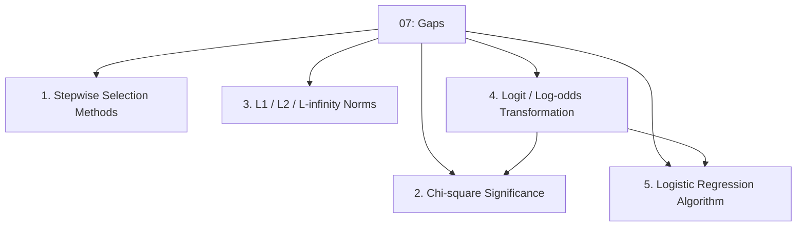
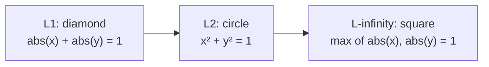
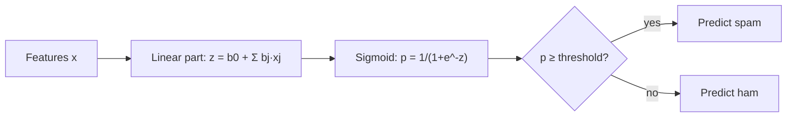

# 07 — Gaps to Look Up

> Topic: Concepts referenced by the source decks but never explained in them
> Date: Aug 6, 2026

## Concept Hierarchy

**Ordering note:** The five items are the Part C list from the [module map](00-study-checklist.md), reordered so that prerequisites come first: the logit transformation (4) is placed immediately before logistic regression (5) because the latter is built on it, and both are placed after chi-square (2) because deviance testing uses the $\chi^2$ distribution.

**Running example used throughout:** the same **spam/ham** setting from [04](04-classification-algorithms.md) and [06](06-model-evaluation.md).

---

## 1. Stepwise Selection Methods

**Referenced as** — "recall from previous lessons", without saying how variables are actually added or removed.

> **Formal definition:** Stepwise selection is an iterative feature-selection procedure that adds and/or removes one predictor at a time based on a statistical criterion, terminating when no single change improves the criterion.

**The three variants**

| Variant                    | Starts from                  | Each step                                                                                               | Can it reverse a decision? |
| -------------------------- | ---------------------------- | ------------------------------------------------------------------------------------------------------- | -------------------------- |
| **Forward selection**      | Empty model (intercept only) | Add the predictor with the lowest p-value, if below the entry threshold                                 | No                         |
| **Backward elimination**   | All predictors               | Remove the predictor with the highest p-value, if above the removal threshold                           | No                         |
| **Bidirectional stepwise** | Either                       | Add the best candidate, then re-test **all** included predictors and drop any that became insignificant | Yes                        |

**Steps (bidirectional, the version the decks mean)**

1. Fit the current model and record its criterion (p-value based, or AIC — [06 §4.2](06-model-evaluation.md)).
2. **Forward step** — for each excluded predictor, test the model with it added; add the best if it clears the entry threshold (commonly $p < 0.05$, or a drop in AIC).
3. **Backward step** — for each included predictor, test the model without it; remove any that no longer clears the removal threshold (commonly $p > 0.10$).
4. Repeat 2–3 until no addition or removal improves the criterion.

**Worked example** — Spam predictors: `free`, `links`, `all-caps ratio`, `sender age`.
Step 1 adds `free` ($p = 0.001$). Step 2 adds `links` ($p = 0.004$). Step 3's backward check finds that `free` has risen to $p = 0.21$ — its signal is now redundant with `links` — so `free` is dropped. Pure forward selection would have kept it forever; that recovery is the whole point of bidirectional stepwise.

**Important details** — Why two different thresholds? Making the removal threshold looser than the entry threshold (0.10 vs 0.05) prevents a predictor from being added and removed endlessly in an infinite loop.

**Important details — the caveats** — Stepwise selection is widely criticised: the p-values it reports are biased because the same data chose the model *and* tested it, it is unstable under small data changes, and it is greedy so it does not find the globally best subset. Regularisation (Lasso, [regression Session 5 §5.2](../../05-supervised-ml-regression/notes/05-model-optimization.md)) is the modern preference. Full treatment of all four selection methods, including RFE, is in [regression Session 4 §4](../../05-supervised-ml-regression/notes/04-feature-engineering.md).

---

## 2. Chi-square ($\chi^2$) Significance

**Referenced as** — a way to check whether predictors genuinely improve the deviance score, without explaining the test.

> **Formal definition:** The chi-square test compares an observed frequency distribution against the distribution expected under a null hypothesis, using the statistic $\chi^2 = \sum \frac{(O-E)^2}{E}$, which follows a $\chi^2$ distribution with $df$ degrees of freedom when the null hypothesis is true.

### 2.1 Use A — Testing deviance improvement (likelihood-ratio test)

**Formula** — Essential
$$\chi^2_{stat} = D_{null} - D_{model} \sim \chi^2_{k}$$

**Where** — $D_{null}, D_{model}$: null and residual deviance ([06 §4.1](06-model-evaluation.md)); $k$: number of predictors added = degrees of freedom.

**Worked example** — Null deviance 260, residual deviance 180, 3 predictors added.

1. $\chi^2_{stat} = 260 - 180 = 80$, with $df = 3$.
2. Critical value $\chi^2_{3,\,0.05} = 7.815$.
3. $80 \gg 7.815$, so reject $H_0$ ("all three coefficients are zero"): the predictors *do* significantly improve the fit ($p < 0.001$).

**Interpretation** — Deviance always falls when predictors are added, so the question is never "did it fall?" but "did it fall by more than chance would produce?". The $\chi^2$ distribution supplies the yardstick. This is the direct analogue of the F-test for overall significance in [regression Session 2 §2.8](../../05-supervised-ml-regression/notes/02-linear-regression.md).

### 2.2 Use B — Testing feature–class independence

**Formula** — Exam-important
$$\chi^2 = \sum_{cells}\frac{(O - E)^2}{E}, \qquad E_{ij} = \frac{(\text{row total}_i)(\text{col total}_j)}{n}, \qquad df = (r-1)(c-1)$$

**Worked example** — Is the word `free` associated with spam? Using the mailbox from [03](03-probability-and-information-theory.md) (observed counts):

|               | `free` = yes | `free` = no | Row total |
| ------------- | ------------ | ----------- | --------- |
| Spam          | 4            | 2           | 6         |
| Ham           | 1            | 3           | 4         |
| **Col total** | 5            | 5           | **10**    |

Expected under independence: $E_{spam,yes} = (6 \times 5)/10 = 3$, $E_{spam,no} = 3$, $E_{ham,yes} = 2$, $E_{ham,no} = 2$.

$$\chi^2 = \frac{(4-3)^2}{3} + \frac{(2-3)^2}{3} + \frac{(1-2)^2}{2} + \frac{(3-2)^2}{2} = 0.333 + 0.333 + 0.5 + 0.5 = 1.667$$

With $df = (2-1)(2-1) = 1$, the critical value is 3.841. Since $1.667 < 3.841$, we **fail to reject** independence — on only 10 emails the association is not statistically significant, even though the raw proportions look suggestive.

**Important details** — This is the reasoning behind scikit-learn's `SelectKBest(chi2)` filter for feature selection. The test needs expected counts of at least 5 per cell to be reliable — our toy example violates that, which is itself the lesson: small samples cannot establish significance.

---

## 3. L1 / L2 / L∞ Norms vs Distance

**Referenced as** — "$L_p$ norms" and "$L$-infinity" in the distance slides, with no geometric explanation.

> **Formal definition:** A norm $\|\mathbf{v}\|$ measures the length of a single vector; the $L_p$ norm is $\|\mathbf{v}\|_p = \left(\sum_i |v_i|^p\right)^{1/p}$. The corresponding distance between two points is the norm of their difference: $d_p(\mathbf{x},\mathbf{y}) = \|\mathbf{x}-\mathbf{y}\|_p$.

**The one-line link** — This is the whole relationship the slides skipped: **distance is the norm of the difference vector**. Every measure in [02 §2](02-data-mechanics-and-proximity.md) is just a norm applied to $\mathbf{x}-\mathbf{y}$.

| Norm       | Formula on $\mathbf{v}$            | Distance name | Unit ball shape in 2D        |
| ---------- | ---------------------------------- | ------------- | ---------------------------- |
| $L_1$      | $\sum \lvert v_i \rvert$           | Manhattan     | **Diamond** (rotated square) |
| $L_2$      | $\sqrt{\sum v_i^2}$                | Euclidean     | **Circle**                   |
| $L_p$      | $(\sum \lvert v_i \rvert^p)^{1/p}$ | Minkowski     | Between diamond and square   |
| $L_\infty$ | $\max_i \lvert v_i \rvert$         | Chebyshev     | **Square**                   |

**The geometric meaning** — The *unit ball* is the set of all points at distance exactly 1 from the origin under that norm. Under $L_2$ that set is the familiar circle. Under $L_1$ it is a diamond with corners at $(\pm1, 0)$ and $(0, \pm1)$: the point $(0.5, 0.5)$ is on the boundary because $0.5 + 0.5 = 1$, whereas under $L_2$ it sits *inside* at distance $0.707$. Under $L_\infty$ the ball is a square, since only the largest coordinate matters — $(1, 1)$ is on the boundary because $\max(1,1) = 1$.

**Why the shapes matter beyond distance** — The same shapes explain regularisation ([regression Session 5 §5](../../05-supervised-ml-regression/notes/05-model-optimization.md)): Lasso's $L_1$ penalty region is the diamond, whose sharp corners lie *on the axes*, so the optimum frequently lands on a corner and sets a coefficient exactly to zero. Ridge's $L_2$ region is the smooth circle with no corners, so it shrinks coefficients toward zero without ever reaching it. XGBoost's $\lambda\|w\|^2$ term ([05 §3.2](05-ensemble-learning.md)) is the same $L_2$ penalty applied to leaf weights.

**Worked example** — $\mathbf{v} = (3, 4)$: $\|\mathbf{v}\|_1 = 7$, $\|\mathbf{v}\|_2 = 5$, $\|\mathbf{v}\|_\infty = 4$. The ordering $\|\mathbf{v}\|_\infty \le \|\mathbf{v}\|_2 \le \|\mathbf{v}\|_1$ always holds.

---

## 4. Logit / Log-Odds Transformation

**Referenced as** — used in the boosting and deviance maths, with the probability→logit step never shown.

> **Formal definition:** The logit of a probability $p$ is $\text{logit}(p) = \ln\left(\frac{p}{1-p}\right)$, the natural logarithm of the odds. It maps $(0,1)$ onto $(-\infty, +\infty)$; its inverse is the logistic (sigmoid) function $p = \frac{1}{1+e^{-z}}$.

**The three-step chain**

1. **Probability** — $p \in [0, 1]$. Bounded, so it cannot be the output of an unbounded linear equation.
2. **Odds** — $\dfrac{p}{1-p} \in [0, \infty)$. Removes the upper bound but is asymmetric: "twice as likely" and "half as likely" are 2 and 0.5, not mirror images.
3. **Log-odds (logit)** — $\ln\dfrac{p}{1-p} \in (-\infty, \infty)$. Unbounded and symmetric about 0, so a linear model can output it freely.

**Worked example** — $p = 0.8$ → odds $= 0.8/0.2 = 4$ ("4 to 1 on") → logit $= \ln 4 = 1.386$.
Reverse it: $p = 1/(1+e^{-1.386}) = 1/(1+0.25) = 0.8$. ✔

| $p$ | Odds  | Logit    |
| --- | ----- | -------- |
| 0.1 | 0.111 | $-2.197$ |
| 0.5 | 1.0   | **0**    |
| 0.8 | 4.0   | $+1.386$ |
| 0.9 | 9.0   | $+2.197$ |

**Interpretation** — Logit 0 is exactly the 50/50 point; positive means "more likely than not". Note the symmetry: $p=0.1$ and $p=0.9$ give $\mp 2.197$, the same magnitude in opposite directions — a property the raw odds do not have.

**Why every model in this module uses it** — GBM initialises at $F_0 = \log\frac{p}{1-p}$ and adds tree outputs to it ([05 §3.1](05-ensemble-learning.md)) precisely because log-odds space is unbounded: you can keep adding contributions forever without ever producing an invalid probability, and the sigmoid maps the total safely back into $[0,1]$ at the end. Deviance ([06 §4.1](06-model-evaluation.md)) is likewise computed from log-likelihoods on this scale.

---

## 5. Logistic Regression Algorithm

**Referenced as** — used throughout the classification examples, but the fitting maths is never given.

> **Formal definition:** Logistic regression models the probability of the positive class as $P(y=1 \mid \mathbf{x}) = \sigma(\beta_0 + \sum_j \beta_j x_j)$ where $\sigma(z) = 1/(1+e^{-z})$, estimating the coefficients by maximum likelihood (equivalently, by minimising log-loss).

### 5.1 The Model

**Formula** — Essential — the model is linear **in the log-odds**, not in the probability:
$$\ln\left(\frac{p}{1-p}\right) = \beta_0 + \beta_1 x_1 + \dots + \beta_p x_p \quad\Longleftrightarrow\quad p = \frac{1}{1 + e^{-(\beta_0 + \sum \beta_j x_j)}}$$

**Where** — $z$: the linear predictor (a logit, §4); $\sigma$: the sigmoid squashing $z$ into $(0,1)$; the threshold defaults to 0.5 but is a free choice ([06 §3.1](06-model-evaluation.md)).

**Why not plain linear regression?** — A straight line is unbounded, so it would predict probabilities below 0 and above 1; its residuals cannot be normal or homoscedastic when $y$ is 0/1, violating the assumptions in [regression Session 3 §1](../../05-supervised-ml-regression/notes/03-assumptions-and-model-evaluation.md). The sigmoid fixes the range problem; maximum likelihood fixes the estimation problem.

### 5.2 The Cost Function

**Formula** — Essential — log-loss (binary cross-entropy), averaged over $n$ observations:
$$J(\beta) = -\frac{1}{n}\sum_{i=1}^{n}\Big[y_i \ln(p_i) + (1-y_i)\ln(1-p_i)\Big]$$

**How to read it** — Only one term is ever active per row. If $y_i = 1$, the cost is $-\ln(p_i)$: predicting 0.9 costs $0.105$, predicting 0.1 costs $2.303$. Confident *and wrong* is punished sharply — as $p_i \to 0$ for a true positive, the cost tends to infinity.

**Important details** — Squared error is not used because, composed with the sigmoid, it produces a **non-convex** surface full of local minima. Log-loss is convex in $\beta$, so gradient descent reaches the global optimum. Note also $J(\beta) = D/(2n)$ up to a constant — log-loss and deviance ([06 §4.1](06-model-evaluation.md)) are the same quantity in different units.

### 5.3 Fitting

**Steps**

1. Initialise all $\beta_j = 0$.
2. Compute $z_i$ and $p_i = \sigma(z_i)$ for every row.
3. Compute the gradient — remarkably, it takes the same clean form as in linear regression:
$$\frac{\partial J}{\partial \beta_j} = \frac{1}{n}\sum_{i=1}^{n}(p_i - y_i)\,x_{ij}$$
4. Update: $\beta_j \leftarrow \beta_j - \eta \dfrac{\partial J}{\partial \beta_j}$ (see [regression Session 5 §4](../../05-supervised-ml-regression/notes/05-model-optimization.md) for gradient descent itself).
5. Repeat until convergence.

**Important details** — Unlike linear regression, there is **no closed-form solution** — no OLS-style normal equation exists, so an iterative method is mandatory. Production solvers use Newton–Raphson / IRLS rather than plain gradient descent, but the objective is identical. The term $(p_i - y_i)$ is the same pseudo-residual that gradient boosting fits its trees to ([05 §3.1](05-ensemble-learning.md)).

### 5.4 Interpreting the Coefficients

**Formula** — Exam-important — exponentiating a coefficient gives an **odds ratio**:
$$\text{odds ratio} = e^{\beta_j}$$

**Worked example** — Fitted spam model: $\beta_{\texttt{free}} = 1.2$. Then $e^{1.2} = 3.32$: each additional occurrence of the word `free` multiplies the **odds** of spam by 3.32, holding everything else constant.

**Interpretation** — The multiplier applies to the odds, **not** to the probability. Going from $p = 0.5$ (odds 1) to odds 3.32 gives $p = 0.77$ — a rise of 0.27, not a tripling. A coefficient of 0 means an odds ratio of 1, i.e. no effect; a negative coefficient means odds below 1, i.e. evidence *against* the positive class.

**Important details** — Regularised variants (L1/L2 penalties on $\beta$, §3) are standard, and the multi-class extension is softmax/multinomial logistic regression. Coefficient significance is tested with the Wald test, and overall model significance with the deviance $\chi^2$ test from §2.1.

---

## Quick Revision

- **Key formulas:** $\chi^2 = \sum\frac{(O-E)^2}{E}$; $\chi^2_{stat} = D_{null} - D_{model}$; $\|\mathbf{v}\|_p = (\sum|v_i|^p)^{1/p}$; $\text{logit}(p) = \ln\frac{p}{1-p}$; $\sigma(z) = \frac{1}{1+e^{-z}}$; log-loss $-\frac1n\sum[y\ln p + (1-y)\ln(1-p)]$; odds ratio $e^{\beta_j}$.
- **Most important comparison:** $L_1$ diamond (corners on the axes → exact zeros → Lasso) vs $L_2$ circle (smooth → shrinkage only → Ridge).
- **The one-line bridge:** distance = the norm of the difference vector.
- **5 exam keywords:** likelihood-ratio test, unit ball, log-odds, log-loss, odds ratio.
- **6 common mistakes:** reading $e^{\beta}$ as a change in probability rather than in odds; assuming logistic regression has a closed-form solution; using squared error with a sigmoid; trusting stepwise p-values as if the model had been pre-specified; forgetting the expected-count-≥5 requirement for $\chi^2$; treating $L_\infty$ as a sum rather than a maximum.

## Topic Coverage

- Stepwise selection methods — Covered in Section 1
- Chi-square significance — Covered in Section 2
- L1/L2/L∞ norms vs distance — Covered in Section 3
- Logit / log-odds transformation — Covered in Section 4
- Logistic regression algorithm — Covered in Section 5

Back to [module map](00-study-checklist.md).
