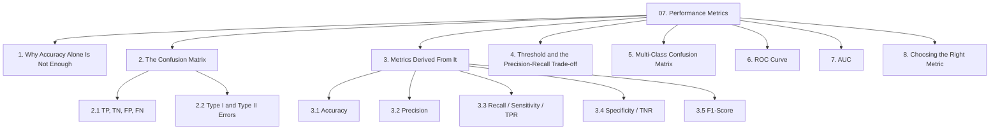
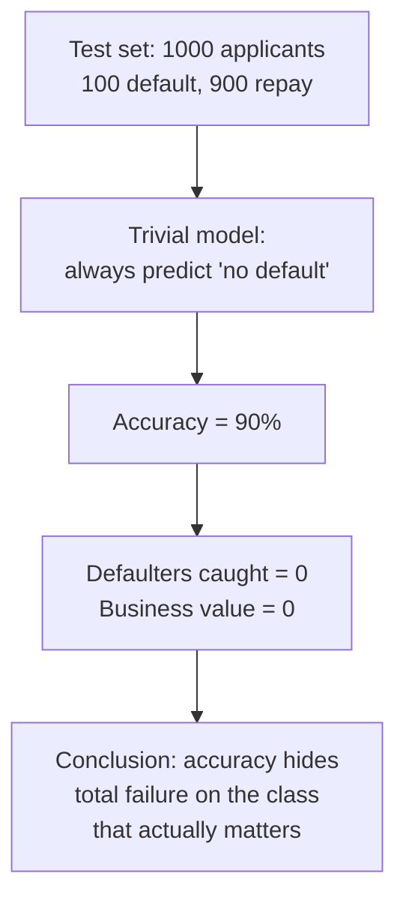
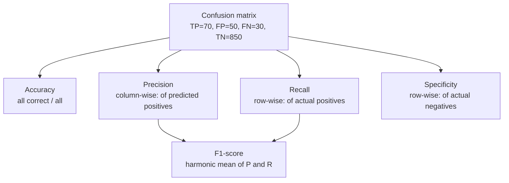
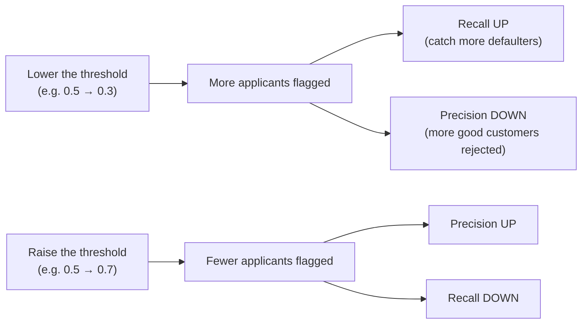
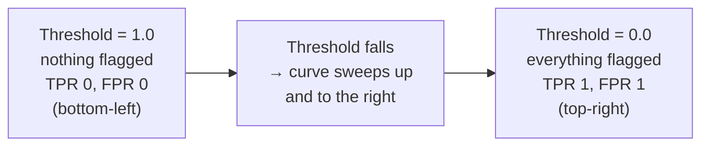
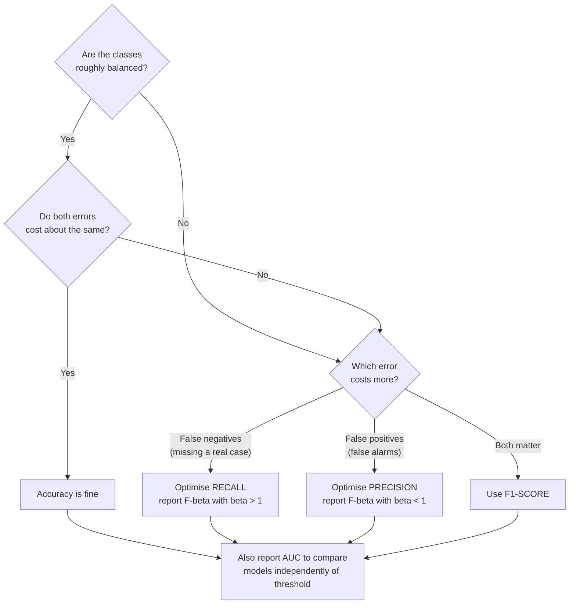

# Chapter 07 — Performance Metrics for Classification

> Source: `unit-1_b_performance_metrics.pdf`
> Read after: Chapters [03](03-logistic-regression.md)–[06](06-ensemble-learning.md) — you need a classifier before you can score one

## Concept Hierarchy

**Ordering note:** the source presents this material as unit 1b, immediately after the ML introduction. It is placed last here because every metric is computed *from a classifier's output*, and the classifiers only exist from Chapter 03 onwards. §1 (the accuracy trap) is promoted to the front because it is the motivation for everything that follows.

**Running example (used for every calculation in this chapter):** the bank's model is evaluated on a **test set of 1,000 unseen applicants**, of whom **100 actually defaulted** and **900 repaid**. The **positive class is "default"** — the rare, costly event we are trying to detect. Choosing which class is "positive" is a decision you make, and every metric below depends on it.

---

## 1. Why Accuracy Alone Is Not Enough

**Picture this** — a guard on the door of a very safe building. Out of every thousand people who walk past him, exactly one is carrying something they should not be. He has worked out a strategy that cannot be beaten on paper: wave everybody through. He is now right 999 times out of every thousand, a score most people would frame and hang on the wall — and in his entire career he has caught nobody at all.

**Mapping**:

| Analogy element                              | What it really is                                        |
| -------------------------------------------- | -------------------------------------------------------- |
| The thousand people walking past him         | the test set                                             |
| The one person actually carrying something   | an instance of the rare positive class                   |
| Waving everybody through                     | the trivial always-predict-negative classifier           |
| Being right 999 times out of a thousand      | 99.9% accuracy                                           |
| Having caught nobody in his whole career     | zero recall on the only class anyone cares about         |
| His manager being pleased with the number    | exactly why accuracy gets reported and why it misleads   |

**Meaning** — a model that never predicts "default" at all — a single line of code returning "no default" for everyone — scores $900/1000 = \mathbf{90\%}$ accuracy on this test set. It catches zero defaulters and is completely worthless to the bank, yet it beats many genuine models on the accuracy metric.

> **Formal definition:** Class imbalance is the condition in which the classes in a dataset are represented in substantially unequal proportions, causing accuracy to be dominated by performance on the majority class and therefore misleading as a measure of a classifier's usefulness.

This is why one number is never enough. The confusion matrix (§2) breaks the result apart so the failure becomes visible, and every metric in §3 is a different summary of that breakdown.

**Core takeaway** — accuracy rewards agreeing with the majority class, so on a rare-event problem it is measuring the imbalance in your data rather than the ability of your model.

---

## 2. The Confusion Matrix

**Picture this** — at the end of the shift the guard's whole day is emptied into four trays. Tray one: people he stopped who really were carrying something. Tray two: people he waved through who really were harmless. Tray three: people he stopped who turned out to have nothing but a laptop and a grievance. Tray four: people he waved straight through who were carrying exactly what he was standing there to find. Every claim anyone will ever make about that guard — every single one — is some ratio of the counts in those four trays.

**Mapping**:

| Analogy element                                  | What it really is                                   |
| ------------------------------------------------ | --------------------------------------------------- |
| Stopped, and rightly so                          | **TP** — true positive                               |
| Waved through, and rightly so                    | **TN** — true negative                               |
| Stopped wrongly — the laptop-and-grievance tray   | **FP** — false positive, a Type I error, a false alarm |
| Waved through wrongly                            | **FN** — false negative, a Type II error, a miss     |
| Emptying the entire shift into the trays         | evaluating over the whole test set                  |
| The four counts laid out on a 2×2 board           | the confusion matrix                                |
| Every claim anyone makes about the guard         | every derived metric in §3                           |

**Meaning** — the confusion matrix is simply those four counts arranged so that actual and predicted classes each get an axis.

> **Formal definition:** A confusion matrix is a tabular summary of a classifier's performance in which each row represents the actual class of the instances and each column represents the predicted class (or vice versa), so that each cell contains the number of instances of a given actual class assigned to a given predicted class.

### 2.1 TP, TN, FP, FN

For the bank model at the default threshold of 0.5:

|                        | **Predicted: Default** | **Predicted: No default** | Row total |
| ---------------------- | ---------------------- | ------------------------- | --------- |
| **Actual: Default**    | **TP = 70**            | **FN = 30**               | 100       |
| **Actual: No default** | **FP = 50**            | **TN = 850**              | 900       |
| Column total           | 120                    | 880                       | 1000      |

| Cell   | Full name      | Meaning in this problem                                              | Count |
| ------ | -------------- | -------------------------------------------------------------------- | ----- |
| **TP** | True Positive  | Would default, model said default — **correctly caught**             | 70    |
| **TN** | True Negative  | Would repay, model said repay — **correctly cleared**                | 850   |
| **FP** | False Positive | Would repay, model said default — **good customer wrongly rejected** | 50    |
| **FN** | False Negative | Would default, model said repay — **bad loan wrongly approved**      | 30    |

**How to read any cell without memorising:** the second word is *what the model predicted*; the first word says *whether it was right*. "False Negative" = the model predicted negative, and it was false. This decoding rule survives exam pressure better than a memorised grid.

**Useful identities:**

$$TP + FN = \text{all actual positives} = 100 \qquad FP + TN = \text{all actual negatives} = 900$$
$$TP + FP = \text{all predicted positives} = 120 \qquad TP+TN+FP+FN = \text{total} = 1000$$

**Common mistake** — different textbooks and libraries transpose the matrix (predictions on rows). Always label your axes explicitly in an exam answer; the marks are for the labels as much as the numbers.

### 2.2 Type I and Type II Errors

> **Formal definition:** A Type I error is the incorrect rejection of a true null hypothesis, corresponding to a false positive; a Type II error is the failure to reject a false null hypothesis, corresponding to a false negative.

|                       | Type I error                            | Type II error                     |
| --------------------- | --------------------------------------- | --------------------------------- |
| Confusion-matrix cell | **FP**                                  | **FN**                            |
| Plain reading         | A false alarm                           | A miss                            |
| Bank example          | Reject a customer who would have repaid | Approve a loan that then defaults |
| Cost to the bank      | Lost interest revenue, unhappy customer | The entire principal              |
| Medical analogy       | Healthy patient told they are ill       | Ill patient told they are healthy |

**Why it matters** — the two errors almost never cost the same, and §4 shows that you can trade one for the other by moving the threshold. Knowing *which* error is more expensive is a business decision that determines which metric you should optimise (§8).

**Core takeaway** — every classification metric is a different ratio of the same four counts, so filling the four trays correctly is most of the work and the formulas are the easy part.

---

## 3. Metrics Derived From the Confusion Matrix

Each metric below is one question you could ask about the four trays, and each is answered by dividing one tray count by a different total.

The one structural insight that makes these easy to keep apart: **precision reads down the predicted-positive column; recall reads across the actual-positive row.** Both have $TP$ on top; only the denominator differs.

### 3.1 Accuracy

> **Formal definition:** Accuracy is the proportion of all instances that are correctly classified by the model.

**Formula (Accuracy)** — Essential
$$\text{Accuracy} = \frac{TP + TN}{TP + TN + FP + FN}$$

**Where** — $TP$: true positives; $TN$: true negatives; $FP$: false positives; $FN$: false negatives; the denominator is the total number of instances evaluated.

**Example** — $\dfrac{70 + 850}{1000} = \mathbf{0.92}$, i.e. 92%.

**Interpretation** — 92% sounds strong until compared against the trivial 90% baseline from §1. The real model bought only two percentage points, and accuracy cannot tell you *where* it did so. Use accuracy only when the classes are roughly balanced **and** both error types cost about the same.

### 3.2 Precision

> **Formal definition:** Precision is the proportion of instances predicted as positive that are actually positive.

**Formula (Precision)** — Essential
$$\text{Precision} = \frac{TP}{TP + FP}$$

**Where** — $TP$: correctly predicted positives; $FP$: negatives incorrectly predicted as positive; the denominator $TP+FP$ is the total number of positive *predictions* made.

**Example** — $\dfrac{70}{70 + 50} = \dfrac{70}{120} = \mathbf{0.583}$.

**Interpretation** — when this model flags an applicant as a likely defaulter it is right only 58% of the time. Four out of every ten rejections hit a customer who would have repaid. Precision is the metric to optimise when a **false positive is expensive**: flagging legitimate email as spam, or accusing an innocent customer of fraud.

**Memory hook** — *"Of everything I flagged, how much was real?"*

### 3.3 Recall (Sensitivity, True Positive Rate)

Three names, one formula. Use whichever your question paper uses.

> **Formal definition:** Recall, also called sensitivity or the true positive rate, is the proportion of actual positive instances that the model correctly identifies as positive.

**Formula (Recall)** — Essential
$$\text{Recall} = \text{Sensitivity} = TPR = \frac{TP}{TP + FN}$$

**Where** — $TP$: correctly identified positives; $FN$: positives the model missed; the denominator $TP+FN$ is the total number of *actual* positives in the data.

**Example** — $\dfrac{70}{70 + 30} = \dfrac{70}{100} = \mathbf{0.70}$.

**Interpretation** — the model catches 70% of the applicants who will genuinely default; 30 bad loans still get approved. Recall is the metric to optimise when a **false negative is expensive**: missing a cancer diagnosis, missing a fraudulent transaction, missing a defaulting borrower.

**Memory hook** — *"Of everything that was real, how much did I catch?"*

### 3.4 Specificity (True Negative Rate)

The mirror image of recall, computed on the negative row.

> **Formal definition:** Specificity, also called the true negative rate, is the proportion of actual negative instances that the model correctly identifies as negative.

**Formula (Specificity)** — Essential
$$\text{Specificity} = TNR = \frac{TN}{TN + FP}$$

**Where** — $TN$: correctly identified negatives; $FP$: negatives incorrectly flagged as positive; the denominator $TN+FP$ is the total number of *actual* negatives.

**Example** — $\dfrac{850}{850 + 50} = \dfrac{850}{900} = \mathbf{0.944}$.

**Formula (False Positive Rate)** — Essential
$$FPR = \frac{FP}{FP + TN} = 1 - \text{Specificity}$$

**Where** — $FP$: false positives; $TN$: true negatives; $FPR$ is the proportion of genuinely negative cases that were wrongly flagged. This is the quantity plotted on the horizontal axis of the ROC curve (§6).

**Example** — $FPR = 50/900 = 0.056$, and indeed $1 - 0.944 = 0.056$.

**Interpretation** — the model correctly clears 94.4% of good customers. Specificity looks reassuringly high here only because the negative class is large; it says nothing about the 30 defaulters that slipped through.

**Recall vs specificity** — both are row-wise rates: recall on the actual-positive row, specificity on the actual-negative row. Together they describe how the model treats each true class, independently of how common each class is — which is exactly why the ROC curve (§6) is built from these two and is unaffected by class imbalance.

### 3.5 F1-Score

Precision and recall pull in opposite directions (§4), so a single combined number is needed to compare models. The mean chosen for the job behaves like a chain rather than a committee: the whole thing is only as strong as the weaker of the two links.

> **Formal definition:** The F1-score is the harmonic mean of precision and recall, providing a single measure that balances the two and is high only when both are high.

**Formula (F1-score)** — Essential
$$F1 = 2 \times \frac{\text{Precision} \times \text{Recall}}{\text{Precision} + \text{Recall}}$$

**Where** — $\text{Precision}$: from §3.2; $\text{Recall}$: from §3.3; the factor 2 is what makes the harmonic mean equal 1 when both inputs are 1.

**Example** — $F1 = 2 \times \dfrac{0.583 \times 0.70}{0.583 + 0.70} = 2 \times \dfrac{0.408}{1.283} = \mathbf{0.636}$.

**Why the harmonic mean and not the ordinary average** — this is the standard follow-up question. Compare a model with precision 1.0 and recall 0.02 (it flags exactly one applicant, and is right):

| Mean type         | Calculation                     | Result                                         |
| ----------------- | ------------------------------- | ---------------------------------------------- |
| Arithmetic        | $(1.0 + 0.02)/2$                | $0.51$ — flatteringly high for a useless model |
| **Harmonic (F1)** | $2(1.0 \times 0.02)/(1.0+0.02)$ | $\mathbf{0.039}$ — correctly damning           |

The harmonic mean is dominated by the **smaller** of the two values, so it cannot be gamed by maximising one metric and abandoning the other. It equals the arithmetic mean only when precision and recall are equal, and is lower otherwise.

**Formula ($F_\beta$-score, generalised)** — Additional depth
$$F_\beta = (1+\beta^2)\times\frac{\text{Precision}\times\text{Recall}}{(\beta^2 \times \text{Precision}) + \text{Recall}}$$

**Where** — $\beta$: a weighting parameter — $\beta = 1$ gives the ordinary F1; $\beta = 2$ weights recall twice as heavily as precision (use when misses are costlier); $\beta = 0.5$ weights precision twice as heavily (use when false alarms are costlier).

**Summary of all metrics for the running example:**

| Metric      | Value | Reading                                             |
| ----------- | ----- | --------------------------------------------------- |
| Accuracy    | 0.920 | Misleading — barely beats the 0.90 trivial baseline |
| Precision   | 0.583 | 42% of rejections are wrong                         |
| Recall      | 0.700 | 30 defaulters still get through                     |
| Specificity | 0.944 | Good customers are mostly treated fairly            |
| F1-score    | 0.636 | The honest headline number for this model           |

**Core takeaway** — precision and recall count the very same true positives and differ only in what they divide by: one asks about everything you flagged, the other about everything that was really there.

---

## 4. The Classification Threshold and the Precision–Recall Trade-off

**Picture this** — the walk-through detector at the door has a sensitivity dial on the side. Turn it up and it shrieks at belt buckles, coins, the foil in a chewing-gum wrapper; the queue backs out of the building and everybody is furious, and absolutely nothing gets past. Turn it down and the queue flows beautifully, everyone is happy, and things get past. There is no setting of that dial at which nobody is delayed *and* nothing gets through — and it is the manager, not the engineer, who has to decide which of those two he can live with.

**Mapping**:

| Analogy element                             | What it really is                                       |
| ------------------------------------------- | ------------------------------------------------------- |
| The sensitivity dial                        | the classification threshold                            |
| Turning the sensitivity up                  | lowering the probability threshold — flagging more       |
| Shrieking at belt buckles                   | false positives rising, precision falling               |
| Nothing getting past                        | recall rising                                           |
| Turning the sensitivity down                | raising the threshold — flagging fewer                   |
| The queue flowing beautifully               | precision rising                                        |
| Things getting past                         | recall falling                                          |
| The manager deciding, not the engineer      | the threshold is a business decision, not a statistical one |

**Meaning** — the metrics above all describe a *single* threshold. Since logistic regression and every ensemble emit a **probability** ([03 §2.3](03-logistic-regression.md#23-the-classification-threshold)), the threshold is a dial you can turn — and turning it moves every number in §3.

**Worked sweep** — the same model, same test set, four thresholds:

| Threshold          | TP  | FN  | FP  | TN  | Precision        | Recall |
| ------------------ | --- | --- | --- | --- | ---------------- | ------ |
| 0.7 (strict)       | 60  | 40  | 27  | 873 | $60/87 = 0.690$  | $0.60$ |
| 0.5 (default)      | 70  | 30  | 50  | 850 | $70/120 = 0.583$ | $0.70$ |
| 0.3 (lenient)      | 88  | 12  | 180 | 720 | $88/268 = 0.328$ | $0.88$ |
| 0.1 (very lenient) | 97  | 3   | 450 | 450 | $97/547 = 0.177$ | $0.97$ |

**Interpretation** — recall rises monotonically as the threshold falls, precision falls monotonically. There is no threshold that maximises both, because they are computed from the same predictions with opposing denominators. The choice is a **business decision**, not a statistical one: a bank that loses ₹5 lakh per default but only ₹20,000 of profit per rejected good customer should deliberately accept low precision to buy high recall.

**Important detail** — you can only tune the threshold on the **validation set** ([01 §5](01-ml-foundations.md#5-training-validation-and-test-data)). Choosing it on the test set makes the final reported metric optimistic.

**Core takeaway** — precision and recall move in opposite directions because they share a numerator and disagree about the denominator, so no setting of the dial can maximise both.

---

## 5. Multi-Class Confusion Matrix

Several queues now, not one, and each is judged as *this queue versus everybody else*. With $k$ classes the matrix becomes $k \times k$, and the TP/FP/FN labels are computed **per class**, one-vs-rest — the same decomposition idea as [03 §5](03-logistic-regression.md#5-multi-class-classification-one-vs-all).

> **Formal definition:** In multi-class classification, the confusion matrix is a $k \times k$ table in which the cell at row $i$, column $j$ contains the number of instances of actual class $i$ that were predicted as class $j$; the diagonal holds the correct predictions and every off-diagonal cell holds a specific type of confusion between two classes.

**Example** — 200 applicants graded **Low / Medium / High** risk (rows = actual, columns = predicted):

|                    | **Pred: Low** | **Pred: Medium** | **Pred: High** | Actual total |
| ------------------ | ------------- | ---------------- | -------------- | ------------ |
| **Actual: Low**    | **50**        | 10               | 5              | 65           |
| **Actual: Medium** | 8             | **40**           | 12             | 60           |
| **Actual: High**   | 2             | 8                | **65**         | 75           |
| Predicted total    | 60            | 58               | 82             | 200          |

**Overall accuracy** = diagonal / total = $(50+40+65)/200 = 155/200 = \mathbf{0.775}$.

**Per-class computation, treating "High" as positive:**

- $TP = 65$ (the diagonal cell for High)
- $FP = 5 + 12 = 17$ (High *column*, excluding the diagonal — other classes wrongly called High)
- $FN = 2 + 8 = 10$ (High *row*, excluding the diagonal — actual Highs called something else)
- $TN = 200 - 65 - 17 - 10 = 108$ (everything not involving High)

$$\text{Precision}_{\text{High}} = \frac{65}{82} = 0.793 \qquad \text{Recall}_{\text{High}} = \frac{65}{75} = 0.867$$

**All three classes:**

| Class  | TP  | FP  | FN  | Precision       | Recall          |
| ------ | --- | --- | --- | --------------- | --------------- |
| Low    | 50  | 10  | 15  | $50/60 = 0.833$ | $50/65 = 0.769$ |
| Medium | 40  | 18  | 20  | $40/58 = 0.690$ | $40/60 = 0.667$ |
| High   | 65  | 17  | 10  | $65/82 = 0.793$ | $65/75 = 0.867$ |

**Reading the off-diagonal cells** — the largest confusion is 12 actual-Medium applicants predicted High, and the 10 actual-Low predicted Medium. Medium is the hardest class (lowest precision *and* lowest recall), which makes intuitive sense: it borders both neighbours. The near-zero Low↔High cells (5 and 2) confirm the model rarely makes a catastrophic two-grade error.

**Averaging the per-class scores into one number:**

> **Formal definition:** Macro-averaging computes a metric independently for each class and takes the unweighted mean, treating all classes as equally important; micro-averaging pools the TP, FP and FN counts across all classes before computing the metric, thereby weighting each class by its frequency.

- **Macro precision** $= (0.833 + 0.690 + 0.793)/3 = \mathbf{0.772}$
- **Macro recall** $= (0.769 + 0.667 + 0.867)/3 = \mathbf{0.768}$
- **Micro precision** $= \dfrac{\sum TP}{\sum TP + \sum FP} = \dfrac{155}{155+45} = \mathbf{0.775}$ — which equals overall accuracy, and always does in single-label multi-class problems.

**Which to use** — macro when every class matters equally regardless of size (a rare fraud class must not be drowned out); micro when overall correctness across all instances is what matters. A third option, **weighted average**, weights each class's score by its true frequency.

**Core takeaway** — a multi-class matrix is just $k$ binary matrices stacked, so the only genuinely new decision is the averaging: macro treats every class as equally important, micro treats every instance as equally important.

---

## 6. ROC Curve

**Picture this** — instead of arguing about where to leave the sensitivity dial, you sweep it slowly from one extreme to the other and record what the machine does at every setting: what fraction of real threats it caught, against what fraction of innocent travellers it delayed. Join those points up and the machine's entire character is one line on a page. Now you can put two detectors side by side and compare them without either one being set to anything in particular.

**Mapping**:

| Analogy element                                | What it really is                                       |
| ---------------------------------------------- | ------------------------------------------------------- |
| Sweeping the dial from end to end              | varying the threshold across its whole range            |
| Fraction of real threats caught                | TPR / recall — the vertical axis                         |
| Fraction of innocent travellers delayed        | FPR — the horizontal axis                                |
| One point on the line                          | the classifier at one fixed threshold                   |
| The whole line                                 | the ROC curve                                           |
| The dial at maximum, everybody stopped         | the top-right point $(1,1)$                              |
| A line hugging the top-left corner             | a strongly discriminating classifier                    |
| A line lying along the diagonal                | a detector no better than a coin toss                   |

**Meaning** — every metric so far describes one threshold. The ROC curve describes the classifier at **all thresholds at once**, so two models can be compared without first committing to a cut-off.

> **Formal definition:** A Receiver Operating Characteristic (ROC) curve is a plot of the true positive rate against the false positive rate for a binary classifier as its discrimination threshold is varied across the full range of possible values.

**Axes** — $y$ = TPR = recall (§3.3); $x$ = FPR = $1 -$ specificity (§3.4). Both are row-wise rates, so **neither depends on class balance** — the reason ROC survives the imbalance problem of §1.

**Worked sweep for the bank model:**

| Threshold | TP  | FP  | TPR $= TP/100$ | FPR $= FP/900$ |
| --------- | --- | --- | -------------- | -------------- |
| 1.0       | 0   | 0   | 0.00           | 0.000          |
| 0.9       | 40  | 9   | 0.40           | 0.010          |
| 0.7       | 60  | 27  | 0.60           | 0.030          |
| 0.5       | 70  | 50  | 0.70           | 0.056          |
| 0.3       | 88  | 180 | 0.88           | 0.200          |
| 0.1       | 97  | 450 | 0.97           | 0.500          |
| 0.0       | 100 | 900 | 1.00           | 1.000          |

Plotting TPR against FPR and joining the points gives the ROC curve. Every curve necessarily starts at $(0,0)$ and ends at $(1,1)$.

**How to read the plot:**

| Region                              | Meaning                                                                  |
| ----------------------------------- | ------------------------------------------------------------------------ |
| **Top-left corner $(0,1)$**         | The perfect classifier: catches every positive, raises zero false alarms |
| **The diagonal $y = x$**            | Random guessing — the model has no discriminative ability at all         |
| **Closer to the top-left = better** | The standard one-line answer                                             |
| **Below the diagonal**              | Worse than random; inverting every prediction would improve it           |

> **Formal definition:** A conservative classifier operates in the lower-left region of the ROC space, making positive predictions only with strong evidence, and therefore has few false positives but also a lower true positive rate; a liberal classifier operates in the upper-right region, making positive predictions freely, and therefore attains a high true positive rate at the cost of many false positives.

|                | Conservative classifier                  | Liberal classifier                    |
| -------------- | ---------------------------------------- | ------------------------------------- |
| ROC region     | Lower-left                               | Upper-right                           |
| Threshold      | High (e.g. 0.7–0.9)                      | Low (e.g. 0.1–0.3)                    |
| FPR            | Low                                      | High                                  |
| TPR / recall   | Low                                      | High                                  |
| Precision      | High                                     | Low                                   |
| Bank behaviour | Rejects almost nobody; misses defaulters | Rejects freely; annoys good customers |
| Use when       | False positives are costly               | False negatives are costly            |

**Important details** — a ROC curve can only be drawn for a model that outputs a **score or probability**. A model emitting only hard labels produces a single point in ROC space, not a curve — one more reason [03 §2.2](03-logistic-regression.md#22-reading-the-output-as-a-probability) insists that logistic regression's output is a probability, not a label.

**Core takeaway** — ROC is immune to class imbalance because both of its axes are computed *inside* one true class, so piling up more innocent travellers cannot shift the curve.

---

## 7. AUC (Area Under the ROC Curve)

**Picture this** — stand one person who really is carrying something next to one person who really is not, and send both through the machine. Do not ask it to decide anything; just read the two numbers off the dial and see which came out higher. Now do that for every possible such pairing and count how often the machine put the right person on top. That single fraction is the score.

**Mapping**:

| Analogy element                                     | What it really is                                       |
| --------------------------------------------------- | ------------------------------------------------------- |
| One real threat beside one innocent traveller       | a randomly chosen positive and negative instance        |
| Reading the dial rather than taking the decision    | using the model's score, not its predicted label        |
| Which of the two reads higher                       | the ranking the model imposes on the pair               |
| The fraction of pairs it gets the right way round   | the AUC                                                 |
| Getting every single pair right                     | AUC $= 1.0$                                              |
| Effectively coin-flipping each pair                 | AUC $= 0.5$                                              |
| Reading everybody 20 points too high, but in order  | a calibration error AUC is blind to                     |

**Meaning** — a curve is hard to put in a results table. AUC collapses it into one number.

> **Formal definition:** AUC is the area under the ROC curve, and equals the probability that a randomly chosen positive instance is assigned a higher score by the classifier than a randomly chosen negative instance.

That probabilistic reading is the part worth memorising: **AUC = 0.85 means that if you pick one real defaulter and one real repayer at random, the model gives the defaulter the higher risk score 85% of the time.**

| AUC         | Interpretation                                                       |
| ----------- | -------------------------------------------------------------------- |
| $1.0$       | Perfect separation                                                   |
| $0.9 - 1.0$ | Excellent                                                            |
| $0.8 - 0.9$ | Good                                                                 |
| $0.7 - 0.8$ | Fair                                                                 |
| $0.5 - 0.7$ | Poor                                                                 |
| $0.5$       | **No better than random guessing** — the diagonal                    |
| $< 0.5$     | Worse than random; the model's scores are anti-correlated with truth |

**Why it matters:**

- **Threshold-free** — it summarises performance across every possible cut-off, so it compares two models before either has been tuned.
- **Insensitive to class imbalance** — because TPR and FPR are computed within each true class (§3.4).
- **Single number** — convenient for model selection and leaderboard reporting.

**Limitations to state for full marks:**

- AUC evaluates **ranking quality, not calibration**. A model whose probabilities are all systematically too high still gets a perfect AUC if it ranks correctly.
- On severely imbalanced problems AUC can look flattering, because the huge negative class keeps FPR small; the **precision–recall curve** is the more honest choice there.
- A single AUC number hides *where* on the curve the model performs well. Two models with identical AUC can behave very differently in the low-FPR region you actually plan to operate in.

**Core takeaway** — AUC scores only the model's *ranking*, which is why a model that orders every case perfectly can still report probabilities that are uniformly and badly wrong.

---

## 8. Choosing the Right Metric

| Situation                                | Primary metric    | Reason                                                     |
| ---------------------------------------- | ----------------- | ---------------------------------------------------------- |
| Balanced classes, symmetric costs        | Accuracy          | Simple and meaningful here                                 |
| Medical screening, fraud, loan default   | Recall            | A missed case is far costlier than a false alarm           |
| Spam filtering, content moderation       | Precision         | Wrongly blocking legitimate content is the expensive error |
| Imbalanced data, both errors matter      | F1-score          | Neither precision nor recall can be abandoned              |
| Comparing candidate models before tuning | AUC               | Threshold-free and imbalance-insensitive                   |
| Multi-class with a small critical class  | Macro-averaged F1 | Prevents the rare class from being drowned out             |

**Never report a single metric in isolation.** The professional answer for the running example is: *"Accuracy 0.92, but on an imbalanced test set where the trivial baseline is 0.90; precision 0.58, recall 0.70, F1 0.64, AUC 0.85. The model catches 70% of defaulters at the cost of wrongly rejecting 50 good customers, and the threshold should be tuned against the bank's relative cost of the two errors."*

---

**Previous:** [Chapter 06](06-ensemble-learning.md) · **Next:** [Chapter 08 — Exam Preparation](08-exam-preparation.md) · Back to [module map](00-study-checklist.md)
