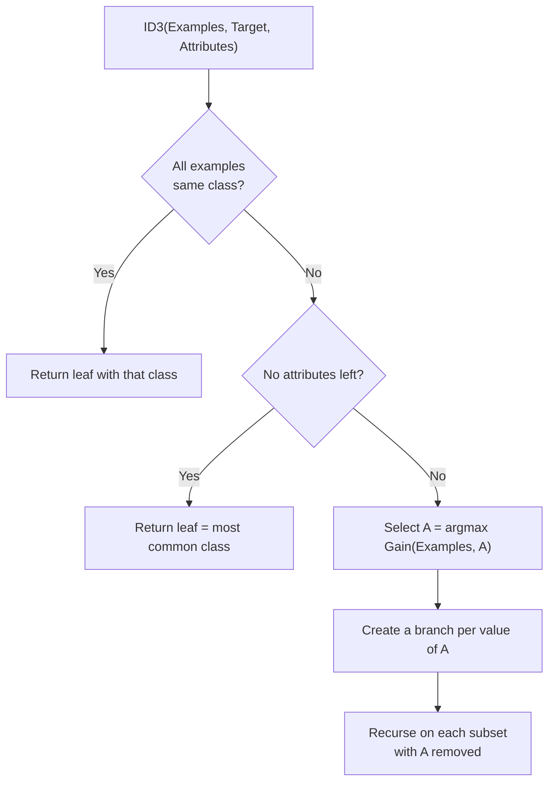

# Chapter 08 — Examination Preparation

> Covers all 8 source files. This chapter contains **no new teaching** — everything here points back to the chapter where the concept was explained in full.

## Contents

1. [Examination Preparation](#1-examination-preparation)
2. [Practice Questions](#2-practice-questions)
3. [Quick Revision](#3-quick-revision)
4. [Topic Coverage](#4-topic-coverage)
5. [Gaps to Look Up](#5-gaps-to-look-up)

---

## 1. Examination Preparation

### 1.1 Must Understand

Concepts where memorising the sentence will not save you — the examiner will change the numbers or the scenario:

| Concept                                                  | Section                                                                                                                                                           | What you must actually be able to do                         |
| -------------------------------------------------------- | ----------------------------------------------------------------------------------------------------------------------------------------------------------------- | ------------------------------------------------------------ |
| Decomposing a scenario into $\langle P, T, E\rangle$     | [01 §1](01-ml-foundations.md#1-what-machine-learning-is)                                                                                                          | Take an unseen scenario and name all three parts correctly   |
| Choosing supervised vs unsupervised vs reinforcement     | [01 §3.4](01-ml-foundations.md#34-comparison-of-the-three-styles)                                                                                                 | Decide from a description of the available data              |
| Regression vs classification                             | [01 §3.1](01-ml-foundations.md#31-supervised-learning)                                                                                                            | Decide from the target variable's data type                  |
| Why squared error is used and why gradient descent works | [02 §3](02-linear-regression-and-gradient-descent.md#3-the-squared-error-cost-function), [02 §5](02-linear-regression-and-gradient-descent.md#5-gradient-descent) | Trace one iteration by hand with given numbers               |
| Diagnosing a bad learning rate                           | [02 §5.3](02-linear-regression-and-gradient-descent.md#53-the-learning-rate-alpha)                                                                                | Read a plot of $J$ vs iteration and say what is wrong        |
| Why linear regression fails at classification            | [03 §1](03-logistic-regression.md#1-why-linear-regression-cannot-do-classification)                                                                               | Give all three failures with the fix each motivates          |
| Sigmoid → probability → threshold → label                | [03 §2](03-logistic-regression.md#2-the-logistic-regression-model)                                                                                                | Keep the four stages distinct; the ROC curve depends on it   |
| Finding a decision boundary from given $\theta$          | [03 §3](03-logistic-regression.md#3-decision-boundary)                                                                                                            | Write the boundary equation and classify a given point       |
| Effect of $K$ on bias and variance                       | [04 §4.3](04-knn.md#43-what-k-does-to-the-decision-boundary)                                                                                                      | Explain both extremes and why validation is needed           |
| Why scaling is mandatory for KNN                         | [04 §6.2](04-knn.md#62-feature-scaling)                                                                                                                           | Reproduce the numeric demonstration, not just the claim      |
| Computing entropy and information gain                   | [05 §2](05-decision-trees-and-id3.md#2-entropy), [05 §3](05-decision-trees-and-id3.md#3-information-gain)                                                         | Build a tree from a given table, showing all working         |
| ID3 as a greedy hypothesis-space search                  | [05 §5](05-decision-trees-and-id3.md#5-hypothesis-space-search-in-id3)                                                                                            | State all four properties and their consequences             |
| Overfitting and how pruning addresses it                 | [05 §7](05-decision-trees-and-id3.md#7-overfitting-in-decision-trees), [05 §8](05-decision-trees-and-id3.md#8-pruning)                                            | Use the two-hypothesis definition, not "high training error" |
| Bagging reduces variance, boosting reduces bias          | [06 §2](06-ensemble-learning.md#2-why-combining-models-works)                                                                                                     | Explain *why*, not just state it                             |
| Reading and computing from a confusion matrix            | [07 §2](07-performance-metrics.md#2-the-confusion-matrix), [07 §3](07-performance-metrics.md#3-metrics-derived-from-the-confusion-matrix)                         | Compute all five metrics from a given matrix                 |
| Precision–recall trade-off via the threshold             | [07 §4](07-performance-metrics.md#4-the-classification-threshold-and-the-precisionrecall-trade-off)                                                               | Say which way each metric moves and why                      |
| Interpreting ROC and AUC                                 | [07 §6](07-performance-metrics.md#6-roc-curve), [07 §7](07-performance-metrics.md#7-auc-area-under-the-roc-curve)                                                 | Give the probabilistic reading of AUC                        |

### 1.2 Must Remember

The formal wording lives in the `> **Formal definition:**` callout at each section listed. Use those, not the simplified teaching sentences.

**Definitions to reproduce verbatim:**

| Term                                                                                                          | Definition at                                                                                                                                                                                             |
| ------------------------------------------------------------------------------------------------------------- | --------------------------------------------------------------------------------------------------------------------------------------------------------------------------------------------------------- |
| Machine learning ($\langle P,T,E\rangle$)                                                                     | [01 §1](01-ml-foundations.md#1-what-machine-learning-is)                                                                                                                                                  |
| Supervised / unsupervised / reinforcement learning                                                            | [01 §3.1](01-ml-foundations.md#31-supervised-learning), [§3.2](01-ml-foundations.md#32-unsupervised-learning), [§3.3](01-ml-foundations.md#33-reinforcement-learning)                                     |
| Regression, classification                                                                                    | [01 §3.1](01-ml-foundations.md#31-supervised-learning)                                                                                                                                                    |
| Training / validation / test set                                                                              | [01 §5](01-ml-foundations.md#5-training-validation-and-test-data)                                                                                                                                         |
| Residual, cost function, gradient descent, learning rate, convergence                                         | [02 §2](02-linear-regression-and-gradient-descent.md#2-prediction-error-residuals)–[§6](02-linear-regression-and-gradient-descent.md#6-convergence)                                                       |
| Logistic regression, sigmoid, decision boundary, one-vs-all                                                   | [03 §2](03-logistic-regression.md#2-the-logistic-regression-model)–[§5](03-logistic-regression.md#5-multi-class-classification-one-vs-all)                                                                |
| KNN, Euclidean distance, feature scaling, curse of dimensionality                                             | [04 §1](04-knn.md#1-instance-based-lazy-learning), [§2.1](04-knn.md#21-euclidean-distance), [§6.2](04-knn.md#62-feature-scaling), [§7](04-knn.md#7-strengths-limitations-and-the-curse-of-dimensionality) |
| Decision tree, entropy, information gain, ID3                                                                 | [05 §1](05-decision-trees-and-id3.md#1-what-a-decision-tree-is)–[§4](05-decision-trees-and-id3.md#4-the-id3-algorithm)                                                                                    |
| Inductive bias, overfitting, pruning, reduced-error pruning, rule post-pruning                                | [05 §6](05-decision-trees-and-id3.md#6-inductive-bias-prerequisite)–[§8.3](05-decision-trees-and-id3.md#83-rule-post-pruning)                                                                             |
| Ensemble learning, bagging, boosting, Random Forest, AdaBoost, gradient boosting, XGBoost, feature importance | [06 §1](06-ensemble-learning.md#1-what-ensemble-learning-is)–[§7](06-ensemble-learning.md#7-feature-importance)                                                                                           |
| Confusion matrix, Type I/II error, accuracy, precision, recall, specificity, F1, ROC, AUC                     | [07 §2](07-performance-metrics.md#2-the-confusion-matrix)–[§7](07-performance-metrics.md#7-auc-area-under-the-roc-curve)                                                                                  |

**Formula sheet:**

| #   | Formula                                                                                    | Section                                                                                                               |
| --- | ------------------------------------------------------------------------------------------ | --------------------------------------------------------------------------------------------------------------------- |
| 1   | $J(\theta) = \frac{1}{2m}\sum(h_\theta(x^{(i)}) - y^{(i)})^2$                              | [02 §3](02-linear-regression-and-gradient-descent.md#3-the-squared-error-cost-function)                               |
| 2   | $\theta_j := \theta_j - \alpha\frac{1}{m}\sum(h_\theta(x^{(i)}) - y^{(i)})x_j^{(i)}$       | [02 §5.2](02-linear-regression-and-gradient-descent.md#52-the-update-rule)                                            |
| 3   | $g(z) = \dfrac{1}{1+e^{-z}}$                                                               | [03 §2.1](03-logistic-regression.md#21-the-sigmoid-function)                                                          |
| 4   | $J(\theta) = -\frac{1}{m}\sum[y\log h_\theta(x) + (1-y)\log(1-h_\theta(x))]$               | [03 §4](03-logistic-regression.md#4-cost-function-for-logistic-regression)                                            |
| 5   | $d(p,q) = \sqrt{\sum(p_j - q_j)^2}$                                                        | [04 §2.1](04-knn.md#21-euclidean-distance)                                                                            |
| 6   | $x' = \dfrac{x - x_{\min}}{x_{\max}-x_{\min}}$ and $x' = \dfrac{x-\mu}{\sigma}$            | [04 §6.2](04-knn.md#62-feature-scaling)                                                                               |
| 7   | $H(S) = -\sum p_i \log_2 p_i$                                                              | [05 §2](05-decision-trees-and-id3.md#2-entropy)                                                                       |
| 8   | $\text{Gain}(S,A) = H(S) - \sum_v \frac{\lvert S_v\rvert}{\lvert S\rvert}H(S_v)$           | [05 §3](05-decision-trees-and-id3.md#3-information-gain)                                                              |
| 9   | $\alpha_t = \frac{1}{2}\ln\!\left(\frac{1-\varepsilon_t}{\varepsilon_t}\right)$            | [06 §5.1](06-ensemble-learning.md#51-adaboost-adaptive-boosting)                                                      |
| 10  | Accuracy $=\frac{TP+TN}{TP+TN+FP+FN}$                                                      | [07 §3.1](07-performance-metrics.md#31-accuracy)                                                                      |
| 11  | Precision $=\frac{TP}{TP+FP}$; Recall $=\frac{TP}{TP+FN}$; Specificity $=\frac{TN}{TN+FP}$ | [07 §3.2](07-performance-metrics.md#32-precision)–[§3.4](07-performance-metrics.md#34-specificity-true-negative-rate) |
| 12  | $F1 = 2\times\frac{P \times R}{P + R}$                                                     | [07 §3.5](07-performance-metrics.md#35-f1-score)                                                                      |

**Numbers worth memorising:** entropy of a 50/50 binary split $= 1.0$; entropy of a pure set $= 0$; bootstrap sample retains $\approx 63.2\%$ of unique rows; Random Forest default $m = \sqrt{n}$ features per split; AUC $= 0.5$ is random; AdaBoost gives a learner with $\varepsilon = 0.5$ a vote weight of exactly $0$.

### 1.3 Common Question Patterns

#### 2-mark

- Define machine learning / supervised learning / entropy / overfitting / precision / AUC.
- State the inductive bias of ID3.
- Write the sigmoid function and state its range.
- Differentiate Type I and Type II error.
- What is a bootstrap sample?
- Why is an odd value of $K$ preferred in KNN?

#### 5-mark

- Explain the $\langle P,T,E\rangle$ framework with an example.
- Compare supervised, unsupervised and reinforcement learning.
- Why can linear regression not be used for classification?
- Explain gradient descent and the role of the learning rate.
- Explain one-vs-all multi-class classification.
- Explain the elbow method for choosing $K$.
- Why is feature scaling essential for KNN? Illustrate numerically.
- Compute entropy and information gain for a given small table.
- Explain overfitting in decision trees and two ways to prevent it.
- Compare bagging and boosting.
- Given a confusion matrix, compute accuracy, precision, recall, specificity and F1.
- Explain the precision–recall trade-off.

#### 10-mark

- Explain the ID3 algorithm and construct the decision tree for a given dataset, showing all entropy and gain calculations.
- Explain logistic regression completely: sigmoid, probability interpretation, decision boundary, cost function, and extension to multiple classes.
- Explain KNN completely: the algorithm, distance metrics, choosing $K$, feature preparation, and its strengths and limitations.
- Explain ensemble learning: why it works, bagging vs boosting, Random Forest, AdaBoost, gradient boosting and XGBoost.
- Explain classifier evaluation: confusion matrix, all derived metrics, the ROC curve and AUC, with a worked example.
- Explain overfitting in decision trees and both pruning strategies in detail.

### 1.4 Answer-Writing Guidance

| Marks  | Structure                                                                                                                                                                                                                                     | Length guide |
| ------ | --------------------------------------------------------------------------------------------------------------------------------------------------------------------------------------------------------------------------------------------- | ------------ |
| **2**  | Formal definition, stated precisely + one supporting point or example. Nothing else.                                                                                                                                                          | 2–4 lines    |
| **5**  | Formal definition → main explanation → 3–4 key points → one example, formula or small diagram.                                                                                                                                                | ~1 page      |
| **10** | Introduction (1–2 lines placing the topic) → formal definition → labelled diagram or workflow → detailed explanation broken into numbered sub-parts → worked example or application → advantages and limitations table → one-line conclusion. | 2–3 pages    |

**Rules that earn marks regardless of topic:** define every symbol you write; label both axes of every graph; show intermediate steps in every calculation (method carries most of the marks); state limitations unprompted — they separate a 7 from a 10.

### 1.5 Model Answers

#### 2-mark: *Define entropy and state its range for a binary classification problem.*

Entropy is a measure from information theory that quantifies the impurity or disorder of a collection of examples; for a set $S$ with $c$ classes it is given by $H(S) = -\sum_{i=1}^{c}p_i\log_2 p_i$, where $p_i$ is the proportion of examples belonging to class $i$.

For a binary target, entropy ranges from $0$ (all examples belong to one class — a perfectly pure set) to $1$ bit (an equal 50–50 split — maximum impurity).

#### 5-mark: *Explain why feature scaling is essential for K-Nearest Neighbours. Illustrate with an example.*

**Definition.** Feature scaling is the transformation of numeric features onto a common range or distribution, so that no feature dominates a distance computation purely because of the units in which it is measured.

**Why KNN requires it.** KNN classifies a query by finding its $K$ nearest training instances under a distance metric, typically Euclidean distance $d(p,q) = \sqrt{\sum_j (p_j - q_j)^2}$. Every feature contributes to that sum through its squared difference, so a feature measured in large units contributes a numerically larger term regardless of its actual predictive relevance.

**Numeric illustration.** Compare two applicants, $P$ = (age 30, income ₹600,000) and $Q$ = (age 55, income ₹610,000):

$$d = \sqrt{(30-55)^2 + (600000-610000)^2} = \sqrt{625 + 100{,}000{,}000} \approx 10{,}000.03$$

Age contributes $625$ out of roughly $10^8$ — about $0.0006\%$ of the distance. A 25-year age gap has been rendered irrelevant purely by the choice of rupees as the unit for income.

**The two standard methods.** Min–max normalisation, $x' = \dfrac{x - x_{\min}}{x_{\max}-x_{\min}}$, maps every feature into $[0,1]$. Standardisation, $x' = \dfrac{x-\mu}{\sigma}$, gives every feature mean $0$ and standard deviation $1$ and is preferred when outliers are present.

**Essential precaution.** The scaling statistics must be computed on the training set alone and then applied to the validation and test sets, otherwise information from the test data leaks into training and the reported performance is optimistically biased.

#### 10-mark: *Explain the ID3 algorithm in detail, including entropy, information gain, its hypothesis space search and its inductive bias.*

**Introduction.** ID3 (Iterative Dichotomiser 3) constructs a decision tree from labelled training data by repeatedly selecting the attribute that best separates the classes. Its selection criterion comes from information theory, which is why entropy and information gain must be defined before the algorithm itself.

**Formal definition.** ID3 is a greedy, recursive, top-down algorithm for constructing a decision tree, which at each node selects the attribute with the highest information gain, partitions the training examples by that attribute's values, and repeats on each partition until every subset is pure, no attributes remain, or no examples remain.

**Entropy.** Entropy quantifies the impurity of a set of examples: $H(S) = -\sum_{i=1}^{c}p_i\log_2 p_i$, where $p_i$ is the proportion of class $i$ in $S$. It is $0$ for a pure set and $1$ bit for a balanced binary set. For a dataset of 14 loan applications containing 9 repaid and 5 defaulted:

$$H(S) = -\tfrac{9}{14}\log_2\tfrac{9}{14} - \tfrac{5}{14}\log_2\tfrac{5}{14} = 0.940 \text{ bits}$$

**Information gain.** Gain measures the expected reduction in entropy produced by splitting on an attribute:

$$\text{Gain}(S,A) = H(S) - \sum_{v\in\text{Values}(A)}\frac{|S_v|}{|S|}H(S_v)$$

where $S_v$ is the subset of $S$ for which attribute $A$ takes value $v$. For the attribute *Credit History*, which partitions the 14 examples into Excellent (4 repaid, 0 defaulted), Fair (3, 2) and Poor (2, 3):

$$\text{Gain} = 0.940 - \left[\tfrac{4}{14}(0) + \tfrac{5}{14}(0.971) + \tfrac{5}{14}(0.971)\right] = 0.246$$

This exceeds the gain of Income (0.151), Employment (0.048) and Loan Amount (0.029), so Credit History is chosen as the root.

**The algorithm.**

**Hypothesis space search.** ID3 searches the space of all possible decision trees with four defining characteristics: (1) the hypothesis space is **complete**, so any discrete-valued target function is representable; (2) it maintains a **single current hypothesis**, so it cannot represent all trees consistent with the data; (3) the search is **greedy with no backtracking**, making it efficient but liable to settle on a locally optimal tree; and (4) it uses **all examples at every step** to compute statistically-based gain, which makes it substantially more robust to noisy data than incremental algorithms.

**Inductive bias.** The inductive bias of a learning algorithm is the set of assumptions it uses beyond the training data to choose among equally consistent hypotheses. ID3's bias is a **preference bias**: shorter trees are preferred over longer trees, and trees placing high-information-gain attributes closer to the root are preferred. This is a search bias rather than a restriction bias, since ID3's hypothesis space is unrestricted, and it is justified by Occam's Razor — a short hypothesis fitting the data by coincidence is far less likely than a long one doing so.

**Limitations.** Information gain is biased toward attributes with many distinct values (an identifier attribute would yield maximal gain and zero predictive value); the greedy search may miss attribute combinations that are only jointly informative; and an unrestricted tree overfits noisy data, requiring post-pruning against a separate validation set.

**Conclusion.** ID3 converts an information-theoretic measure of impurity into an efficient tree-construction procedure. Its greedy, preference-biased search yields compact, human-readable models quickly, at the cost of no optimality guarantee and a need for pruning to control overfitting.

---

## 2. Practice Questions

### Basic recall

- **1.** State the $\langle P, T, E\rangle$ definition of machine learning and identify each component for spam detection.
- **2.** Write the sigmoid function and state its output range and its value at $z = 0$.
- **3.** What is a residual in linear regression?
- **4.** Name the four components of a decision tree's structure.
- **5.** What does an AUC of 0.5 indicate about a classifier?

### Conceptual

- **6.** Why is the learning rate $\alpha$ critical in gradient descent, and what are the symptoms of choosing it too large or too small?
- **7.** Explain why a decision tree does not require feature scaling but KNN does.
- **8.** Why does KNN's accuracy deteriorate as the number of features grows?
- **9.** Why is the harmonic mean, rather than the arithmetic mean, used to combine precision and recall?
- **10.** Why does adding more trees to a Random Forest not cause overfitting, while adding more rounds to gradient boosting can?

### Comparison

- **11.** Compare bagging and boosting across model construction, base learners, what error component each reduces, and sensitivity to noise.
- **12.** Compare linear regression and logistic regression across hypothesis, output range, output meaning and cost function.
- **13.** Compare reduced-error pruning and rule post-pruning, and state why the latter is generally preferred.

### Scenario / application

- **14.** A hospital's screening model reports 98% accuracy on a dataset where 2% of patients have the disease. Is this model useful? Justify your answer using appropriate metrics.
- **15.** A bank's model has precision 0.85 and recall 0.40. Management wants to catch more defaulters. What single change would you make, and what will happen to each metric?
- **16.** You must classify 5,000 support tickets into 8 categories using logistic regression. Describe the strategy required and one problem it introduces.

### Long answer

- **17.** Explain the complete ID3 algorithm with a worked example, including its hypothesis-space search characteristics and inductive bias.
- **18.** Explain how a binary classifier is evaluated, covering the confusion matrix, all derived metrics, the ROC curve and AUC, with worked calculations.

---

## 3. Quick Revision

**One-sentence summary of the subject:** supervised classification learns a mapping from labelled examples to discrete class labels using linear-boundary models (logistic regression), instance-based models (KNN), rule-based models (decision trees) or combinations of them (ensembles), and evaluates the result with confusion-matrix-derived metrics rather than accuracy alone.

**Structure:** see the concept hierarchy diagram in [00 §1](00-study-checklist.md#1-how-this-book-is-organised).

**The four algorithms at a glance:**

|                | Logistic Regression                                    | KNN                                      | Decision Tree                      | Ensembles                     |
| -------------- | ------------------------------------------------------ | ---------------------------------------- | ---------------------------------- | ----------------------------- |
| Type           | Parametric, eager                                      | Non-parametric, lazy                     | Non-parametric, eager              | Meta-algorithm                |
| Learns         | Weights $\theta$                                       | Nothing (stores data)                    | A tree of rules                    | Many trees                    |
| Boundary       | Linear (or polynomial)                                 | Arbitrarily jagged                       | Axis-parallel staircase            | Smoothed combination          |
| Scaling needed | Yes (for gradient descent)                             | **Yes, critical**                        | No                                 | No                            |
| Readable       | Moderate (weights)                                     | No                                       | **Yes**                            | No (use feature importance)   |
| Main weakness  | Cannot fit non-linear data without engineered features | Slow prediction, curse of dimensionality | Overfits, unstable                 | Opaque, costlier to train     |
| Chapter        | [03](03-logistic-regression.md)                        | [04](04-knn.md)                          | [05](05-decision-trees-and-id3.md) | [06](06-ensemble-learning.md) |

**The most important comparison:** bagging vs boosting — [06 §6](06-ensemble-learning.md#6-bagging-vs-boosting).

**Key workflows to be able to reproduce:** gradient descent iteration ([02 §5.4](02-linear-regression-and-gradient-descent.md#54-worked-iteration)); ID3 tree construction ([05 §4.2](05-decision-trees-and-id3.md#42-fully-worked-example)); confusion matrix to metrics ([07 §3](07-performance-metrics.md#3-metrics-derived-from-the-confusion-matrix)); threshold sweep to ROC ([07 §6](07-performance-metrics.md#6-roc-curve)).

**Formulas:** see the sheet in §1.2 above.

**Five exam keywords:** *entropy*, *information gain*, *inductive bias*, *precision–recall trade-off*, *bias–variance*.

**Five common mistakes:**

- **1.** Reporting **training accuracy** as model performance ([01 §5](01-ml-foundations.md#5-training-validation-and-test-data)).
- **2.** Saying logistic regression **outputs 0 or 1** — it outputs a probability; the threshold outputs the label ([03 §2.3](03-logistic-regression.md#23-the-classification-threshold)).
- **3.** Applying KNN to **unscaled** features ([04 §6.2](04-knn.md#62-feature-scaling)).
- **4.** Non-simultaneous parameter updates in gradient descent ([02 §5.2](02-linear-regression-and-gradient-descent.md#52-the-update-rule)).
- **5.** Judging an **imbalanced** problem by accuracy ([07 §1](07-performance-metrics.md#1-why-accuracy-alone-is-not-enough)).

### Mental Models

One row per major concept: the picture it was taught with, and the single line that lets you rebuild the rest of the section from memory. These are recall triggers — if a row does not immediately bring the mechanism back, reread the section it points to.

| Section                                                                                                       | The picture                                            | Core takeaway                                                                                    |
| ------------------------------------------------------------------------------------------------------------- | ------------------------------------------------------ | ------------------------------------------------------------------------------------------------ |
| [01 §1](01-ml-foundations.md#1-what-machine-learning-is)                                                      | Catching a cricket ball                                | Learning is claimed only when a named score on a named task rises with more experience           |
| [01 §2](01-ml-foundations.md#2-why-machine-learning-instead-of-ordinary-programming)                          | The recipe card vs the cook who never wrote one        | ML runs programming backwards — answers in, rules out, so nobody can read the rule afterwards     |
| [01 §3](01-ml-foundations.md#3-learning-styles)                                                               | Three walkers dropped into a strange city              | The feedback your data can physically give chooses the branch for you                            |
| [01 §5](01-ml-foundations.md#5-training-validation-and-test-data)                                             | Practice papers, timed mock, real paper                | A test score is honest only while the test stays unseen                                          |
| [02 §1](02-linear-regression-and-gradient-descent.md#1-the-hypothesis)                                        | A steel ruler over drawing pins                        | You choose the shape of the answer; the algorithm only chooses where to put it                   |
| [02 §2](02-linear-regression-and-gradient-descent.md#2-prediction-error-residuals)                            | Vertical threads from each pin to the ruler            | Signed gaps cannot simply be added, which is what forces the squaring                            |
| [02 §3](02-linear-regression-and-gradient-descent.md#3-the-squared-error-cost-function)                       | Laying each thread out as a square before weighing     | Blind to the direction of an error, hypersensitive to its size                                   |
| [02 §4](02-linear-regression-and-gradient-descent.md#4-the-cost-surface-and-contour-plots)                    | A landscape of every ruler position you could take     | The bowl is a property of the cost function, never of the optimiser                              |
| [02 §5](02-linear-regression-and-gradient-descent.md#5-gradient-descent)                                      | Walking downhill in fog, by feel alone                 | A purely local measurement reaches the global best — but only while the landscape is one bowl     |
| [02 §5.3](02-linear-regression-and-gradient-descent.md#53-the-learning-rate-alpha)                            | The length of your stride                              | Only the shape of $J$ over iterations diagnoses it; a rising curve has already answered you       |
| [02 §6](02-linear-regression-and-gradient-descent.md#6-convergence)                                           | The ground gone flat under your boots                  | Converged means the walking stopped, not that it stopped anywhere good                           |
| [03 §1](03-logistic-regression.md#1-why-linear-regression-cannot-do-classification)                           | A ruler asked a yes-or-no question                     | A line has no floor and no ceiling, so fit quality can never make it a probability               |
| [03 §2](03-logistic-regression.md#2-the-logistic-regression-model)                                            | A lever wired to a dimmer switch                       | Learning happens in the lever; usable meaning comes out of the dimmer                            |
| [03 §3](03-logistic-regression.md#3-decision-boundary)                                                        | A fence still standing over an empty field             | The boundary belongs to $\theta$, not to the data                                                 |
| [03 §4](03-logistic-regression.md#4-cost-function-for-logistic-regression)                                    | The witness who swore to it and was wrong              | Log-loss penalises confidence, not merely error                                                  |
| [03 §5](03-logistic-regression.md#5-multi-class-classification-one-vs-all)                                    | Three separate interview rooms                         | You only need to *rank* the $k$ answers, never to trust them as one joint distribution            |
| [04 §1](04-knn.md#1-instance-based-lazy-learning)                                                             | The student who wheels in the whole trolley of books   | All the cost of learning moves from training time to prediction time                             |
| [04 §2](04-knn.md#2-measuring-distance)                                                                       | Pins on a town map — crow-flies or street grid          | Whichever formula you pick *is* the model's definition of "similar"                               |
| [04 §3](04-knn.md#3-the-knn-classification-algorithm)                                                         | Knocking on the $K$ nearest doors                       | No boundary is ever computed — it is merely wherever the local vote flips                         |
| [04 §4](04-knn.md#4-choosing-k)                                                                               | Asking one neighbour versus asking the whole city      | $K$ is a smoothing dial, and only unseen data can say where to set it                             |
| [04 §6](04-knn.md#6-feature-preparation)                                                                      | A map with one axis in mm and the other in km          | Distance obeys units, not meaning                                                                |
| [04 §7](04-knn.md#7-strengths-limitations-and-the-curse-of-dimensionality)                                    | A hundred people scattered across a continent          | Features expand the space faster than they add information, so "nearest" stops meaning "similar"  |
| [05 §1](05-decision-trees-and-id3.md#1-what-a-decision-tree-is)                                               | The triage nurse's laminated card                      | Readable and limited for the very same reason — one attribute per question                        |
| [05 §2](05-decision-trees-and-id3.md#2-entropy)                                                               | Three sealed jars of sweets                            | It measures the surprise of the next draw, and it is capped by the number of classes              |
| [05 §3](05-decision-trees-and-id3.md#3-information-gain)                                                      | Tipping the jar through a sieve                        | The **big** piles must come out pure, not merely some pile                                       |
| [05 §4](05-decision-trees-and-id3.md#4-the-id3-algorithm)                                                     | Twenty questions, played properly                      | It takes the best question available now and never reconsiders the opening one                   |
| [05 §5](05-decision-trees-and-id3.md#5-hypothesis-space-search-in-id3)                                        | A maze whose doors lock behind you                     | Representable and reachable are two different claims                                             |
| [05 §6](05-decision-trees-and-id3.md#6-inductive-bias-prerequisite)                                           | Two witnesses, one body of evidence                    | Data can only eliminate; the bias is what actually chooses                                       |
| [05 §7](05-decision-trees-and-id3.md#7-overfitting-in-decision-trees)                                         | Memorising last year's answer key                      | It is the gap between the two scores, never either score alone                                    |
| [05 §8](05-decision-trees-and-id3.md#8-pruning)                                                               | Sawing limbs off an overgrown fruit tree               | Training accuracy always falls when you prune, so only the harvest can judge the cut             |
| [05 §9](05-decision-trees-and-id3.md#9-handling-continuous-valued-attributes)                                 | One fence post along a road of cattle                  | Only the places the class changes are worth evaluating                                           |
| [05 §10](05-decision-trees-and-id3.md#10-handling-missing-attribute-values)                                   | The form with one box left blank                       | Photocopy and split rather than invent a value                                                   |
| [06 §1](06-ensemble-learning.md#1-what-ensemble-learning-is)                                                  | Guessing the ox's weight at the village fair           | Members must be right more often than not **and** wrong in different ways                        |
| [06 §3](06-ensemble-learning.md#3-bagging-bootstrap-aggregating)                                              | Twenty surveyors with different house lists            | Averaging away the accident of which rows each model happened to see                             |
| [06 §4](06-ensemble-learning.md#4-random-forest)                                                              | Banning the obvious question at each doorstep          | Hiding features at every split is what manufactures diversity                                     |
| [06 §5](06-ensemble-learning.md#5-boosting)                                                                   | The tutor who re-teaches only what you got wrong       | Aiming at the remaining error — mislabelled rows included, forever                                |
| [06 §7](06-ensemble-learning.md#7-feature-importance)                                                         | Auditing the transcripts after the verdict             | It records what the model leaned on, not what causes the outcome                                 |
| [07 §1](07-performance-metrics.md#1-why-accuracy-alone-is-not-enough)                                         | The guard who waves everybody through                  | Accuracy measures the imbalance in your data, not the ability of your model                      |
| [07 §2](07-performance-metrics.md#2-the-confusion-matrix)                                                     | The shift emptied into four trays                      | Every metric is a different ratio of the same four counts                                        |
| [07 §4](07-performance-metrics.md#4-the-classification-threshold-and-the-precisionrecall-trade-off)           | The sensitivity dial on the detector                   | Shared numerator, rival denominators — so no setting maximises both                               |
| [07 §6](07-performance-metrics.md#6-roc-curve)                                                                | Sweeping the dial and plotting the whole machine       | Both axes live inside one true class, so imbalance cannot move the curve                         |
| [07 §7](07-performance-metrics.md#7-auc-area-under-the-roc-curve)                                             | One smuggler beside one traveller — which reads higher | It scores ranking only, and is blind to calibration                                              |

---

## 4. Topic Coverage

Every item extracted from the 8 source files, with where it now lives.

| Source topic                                             | Status                                                                                                                                                 | Source file                       |
| -------------------------------------------------------- | ------------------------------------------------------------------------------------------------------------------------------------------------------ | --------------------------------- |
| Learning problem $\langle P,T,E\rangle$                  | Covered in [01 §1](01-ml-foundations.md#1-what-machine-learning-is)                                                                                    | unit-1_a_ml_intro                 |
| Examples: chess, self-driving, text categorisation, spam | Covered in [01 §1.4](01-ml-foundations.md#14-worked-p-t-e-breakdowns)                                                                                  | unit-1_a_ml_intro                 |
| Learning styles: supervised, unsupervised, reinforcement | Covered in [01 §3](01-ml-foundations.md#3-learning-styles)                                                                                             | unit-1_a_ml_intro                 |
| Traditional programming vs ML                            | Covered in [01 §2](01-ml-foundations.md#2-why-machine-learning-instead-of-ordinary-programming)                                                        | unit-1_a_ml_intro                 |
| Notation ($m$, $n$, $x^{(i)}$, $h_\theta$)               | Added as prerequisite in [01 §4](01-ml-foundations.md#4-notation-you-will-see-in-every-later-chapter)                                                  | implied across unit-1_c, unit-1_d |
| Train / validation / test split                          | Added as prerequisite in [01 §5](01-ml-foundations.md#5-training-validation-and-test-data)                                                             | referenced by unit-3_b (pruning)  |
| Prediction error / residuals                             | Covered in [02 §2](02-linear-regression-and-gradient-descent.md#2-prediction-error-residuals)                                                          | unit-1_c_linear_regression        |
| Squared error cost function                              | Covered in [02 §3](02-linear-regression-and-gradient-descent.md#3-the-squared-error-cost-function)                                                     | unit-1_c_linear_regression        |
| Cost surface & contour plots                             | Covered in [02 §4](02-linear-regression-and-gradient-descent.md#4-the-cost-surface-and-contour-plots)                                                  | unit-1_c_linear_regression        |
| Gradient descent                                         | Covered in [02 §5](02-linear-regression-and-gradient-descent.md#5-gradient-descent)                                                                    | unit-1_c_linear_regression        |
| Convergence                                              | Covered in [02 §6](02-linear-regression-and-gradient-descent.md#6-convergence)                                                                         | unit-1_c_linear_regression        |
| Conjugate gradient / BFGS / L-BFGS                       | Named in [02 §7](02-linear-regression-and-gradient-descent.md#7-advanced-optimisation-alternatives); listed as a gap (§5 below)                        | unit-1_c, unit-1_d                |
| Probability prediction                                   | Covered in [03 §2.2](03-logistic-regression.md#22-reading-the-output-as-a-probability)                                                                 | unit-1_d_logistic_regression      |
| Sigmoid function                                         | Covered in [03 §2.1](03-logistic-regression.md#21-the-sigmoid-function)                                                                                | unit-1_d_logistic_regression      |
| Decision boundary                                        | Covered in [03 §3](03-logistic-regression.md#3-decision-boundary)                                                                                      | unit-1_d_logistic_regression      |
| Multi-class one-vs-all                                   | Covered in [03 §5](03-logistic-regression.md#5-multi-class-classification-one-vs-all)                                                                  | unit-1_d_logistic_regression      |
| Euclidean distance                                       | Covered in [04 §2.1](04-knn.md#21-euclidean-distance)                                                                                                  | unit-2_knn                        |
| Choosing K ($\sqrt{n}$, elbow method)                    | Covered in [04 §4](04-knn.md#4-choosing-k)                                                                                                             | unit-2_knn                        |
| KNN for regression                                       | Covered in [04 §5](04-knn.md#5-knn-for-regression)                                                                                                     | unit-2_knn                        |
| Feature prep: encoding gender/location, scaling          | Covered in [04 §6](04-knn.md#6-feature-preparation)                                                                                                    | unit-2_knn                        |
| Tree structure (root, decision node, leaf)               | Covered in [05 §1.1](05-decision-trees-and-id3.md#11-anatomy-of-a-tree)                                                                                | unit-3_a_decission_tree           |
| Entropy                                                  | Covered in [05 §2](05-decision-trees-and-id3.md#2-entropy)                                                                                             | unit-3_a, unit-3_b (merged)       |
| Information gain                                         | Covered in [05 §3](05-decision-trees-and-id3.md#3-information-gain)                                                                                    | unit-3_a, unit-3_b (merged)       |
| ID3 algorithm                                            | Covered in [05 §4](05-decision-trees-and-id3.md#4-the-id3-algorithm)                                                                                   | unit-3_b_id3_algo                 |
| Hypothesis space search, greedy search                   | Covered in [05 §5](05-decision-trees-and-id3.md#5-hypothesis-space-search-in-id3)                                                                      | unit-3_b_id3_algo                 |
| Inductive bias                                           | Added as prerequisite in [05 §6](05-decision-trees-and-id3.md#6-inductive-bias-prerequisite); also a gap (§5 below)                                    | unit-3_b_id3_algo                 |
| Overfitting (noise, small datasets)                      | Covered in [05 §7](05-decision-trees-and-id3.md#7-overfitting-in-decision-trees)                                                                       | unit-3_b_id3_algo                 |
| Pruning: reduced-error, rule post-pruning                | Covered in [05 §8](05-decision-trees-and-id3.md#8-pruning)                                                                                             | unit-3_b_id3_algo                 |
| Validation set                                           | Covered in [05 §8.1](05-decision-trees-and-id3.md#81-the-validation-set), defined in [01 §5](01-ml-foundations.md#5-training-validation-and-test-data) | unit-3_b_id3_algo                 |
| Continuous-valued attributes                             | Covered in [05 §9](05-decision-trees-and-id3.md#9-handling-continuous-valued-attributes)                                                               | unit-3_b_id3_algo                 |
| Missing attribute values                                 | Covered in [05 §10](05-decision-trees-and-id3.md#10-handling-missing-attribute-values)                                                                 | unit-3_b_id3_algo                 |
| Minimum Description Length                               | Not covered — flagged out of scope by the source; listed as a gap (§5 below)                                                                           | unit-3_b_id3_algo                 |
| Ensemble techniques: bagging, boosting                   | Covered in [06 §3](06-ensemble-learning.md#3-bagging-bootstrap-aggregating), [§5](06-ensemble-learning.md#5-boosting)                                  | unit-4_ensemble_learning          |
| Random Forest                                            | Covered in [06 §4](06-ensemble-learning.md#4-random-forest)                                                                                            | unit-4_ensemble_learning          |
| AdaBoost                                                 | Covered in [06 §5.1](06-ensemble-learning.md#51-adaboost-adaptive-boosting)                                                                            | unit-4_ensemble_learning          |
| Gradient Boosting                                        | Covered in [06 §5.2](06-ensemble-learning.md#52-gradient-boosting)                                                                                     | unit-4_ensemble_learning          |
| XGBoost                                                  | Covered in [06 §5.3](06-ensemble-learning.md#53-xgboost)                                                                                               | unit-4_ensemble_learning          |
| Feature importance                                       | Covered in [06 §7](06-ensemble-learning.md#7-feature-importance)                                                                                       | unit-4_ensemble_learning          |
| Bank Marketing / Telco Churn application                 | Framework covered in [06 §8](06-ensemble-learning.md#8-practical-application); data and code are a gap (§5 below)                                      | unit-4_ensemble_learning          |
| Confusion matrix (binary & multi-class)                  | Covered in [07 §2](07-performance-metrics.md#2-the-confusion-matrix), [§5](07-performance-metrics.md#5-multi-class-confusion-matrix)                   | unit-1_b_performance_metrics      |
| Accuracy, precision, recall, specificity, F1             | Covered in [07 §3](07-performance-metrics.md#3-metrics-derived-from-the-confusion-matrix)                                                              | unit-1_b_performance_metrics      |
| ROC curve, conservative vs liberal classifiers           | Covered in [07 §6](07-performance-metrics.md#6-roc-curve)                                                                                              | unit-1_b_performance_metrics      |
| AUC                                                      | Covered in [07 §7](07-performance-metrics.md#7-auc-area-under-the-roc-curve)                                                                           | unit-1_b_performance_metrics      |

---

## 5. Gaps to Look Up

Concepts the source material relies on or mentions but never explains. Fill these from a textbook (Mitchell, *Machine Learning*, chapters 2–3 covers the first three) if your syllabus includes them.

| Gap                                   | Why it is needed                                                                                                                                                                                                                                                                                                    | Where it was referenced                             |
| ------------------------------------- | ------------------------------------------------------------------------------------------------------------------------------------------------------------------------------------------------------------------------------------------------------------------------------------------------------------------- | --------------------------------------------------- |
| **FIND-S algorithm**                  | Used as the comparison point for ID3's hypothesis-space search and bias, so the contrast is unusable without knowing what FIND-S searches and how                                                                                                                                                                   | unit-3_b, alongside the search-space discussion     |
| **Candidate-Elimination algorithm**   | The standard illustration of a *restriction* bias and of maintaining a version space rather than a single hypothesis — the contrast that makes ID3's preference bias meaningful                                                                                                                                     | unit-3_b, alongside inductive bias                  |
| **Inductive bias (formal treatment)** | Named repeatedly but never defined. A working definition has been supplied in [05 §6](05-decision-trees-and-id3.md#6-inductive-bias-prerequisite) since §5 cannot proceed without it, but the formal treatment (bias as the assumptions needed to make deduction from training data possible) is not in the sources | unit-3_b                                            |
| **Conjugate gradient, BFGS, L-BFGS**  | Listed as faster alternatives to gradient descent with no explanation of how they choose a step direction or size                                                                                                                                                                                                   | unit-1_c and unit-1_d, optimisation sections        |
| **Minimum Description Length (MDL)**  | Named as a principled way to choose tree size, and explicitly marked "out of scope" by the source itself                                                                                                                                                                                                            | unit-3_b, tree-size discussion                      |
| **Gain ratio / split information**    | Not mentioned at all by the sources, yet needed to address information gain's documented bias toward high-cardinality attributes ([05 §3](05-decision-trees-and-id3.md#3-information-gain))                                                                                                                         | not in the sources — added here as a known omission |
| **Gini impurity**                     | The default splitting criterion in CART, Random Forest and scikit-learn, and the basis of impurity-based feature importance ([06 §7](06-ensemble-learning.md#7-feature-importance)); the sources teach only entropy                                                                                                 | not in the sources — added here as a known omission |
| **Hands-on implementation**           | The ensemble source names Bank Marketing and Telco Churn datasets but supplies neither the data nor the code steps. Practice in [notebooks/](../notebooks/)                                                                                                                                                         | unit-4_ensemble_learning                            |

---

**Previous:** [Chapter 07](07-performance-metrics.md) · Back to [module map](00-study-checklist.md) · [Module index](../README.md)
